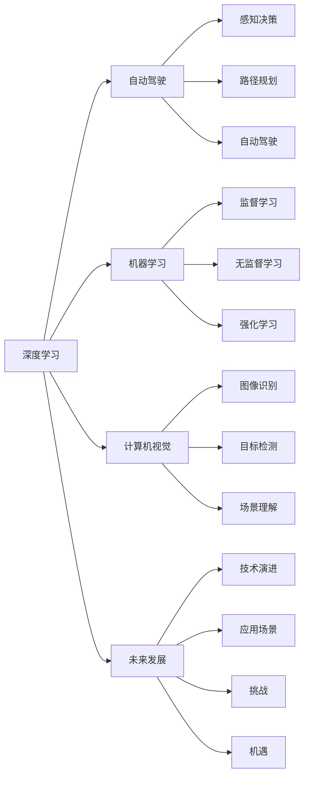

                 

# 安德烈·卡帕西：人工智能的未来发展机遇

> 关键词：人工智能,深度学习,自动驾驶,机器学习,计算机视觉,未来发展,机遇挑战

## 1. 背景介绍

在科技迅猛发展的今天，人工智能(AI)技术已经渗透到我们生活的各个角落。从智能助手、自动驾驶，到工业自动化、医疗诊断，AI的应用场景日益丰富。然而，面对这些技术进步带来的机遇与挑战，我们不禁思考：AI的未来发展方向究竟在哪里？

安德烈·卡帕西（Andrej Karpathy），斯坦福大学的计算机视觉教授，同时也是人工智能领域的领军人物，在深度学习、自动驾驶和计算机视觉等诸多前沿领域都有深入研究和显著贡献。本文章将基于他的研究视角，探讨人工智能未来的发展机遇。

## 2. 核心概念与联系

### 2.1 核心概念概述

要深入理解AI的未来发展方向，我们首先需要明确几个核心概念：

- **深度学习(Deep Learning)**：一种基于神经网络技术的机器学习方法，能够通过多层次的特征提取和抽象，自动学习复杂的数据表征。深度学习在计算机视觉、自然语言处理等领域取得了显著成果。
- **自动驾驶(Autonomous Driving)**：结合计算机视觉、传感器融合、决策规划等技术，实现车辆自主导航和避障，是AI在实际应用中的重要体现。
- **机器学习(Machine Learning)**：一种使计算机系统具有学习能力的技术，包括监督学习、无监督学习和强化学习等。
- **计算机视觉(Computer Vision)**：利用计算机模拟人类视觉系统，实现图像识别、目标检测、场景理解等功能。
- **未来发展**：AI技术的未来发展趋势，包括技术的演进、应用场景的拓展以及面临的挑战。
- **机遇挑战**：AI技术发展带来的机遇和需要克服的挑战，如数据隐私、安全、伦理等问题。

### 2.2 核心概念原理和架构的 Mermaid 流程图



## 3. 核心算法原理 & 具体操作步骤

### 3.1 算法原理概述

基于深度学习的AI技术，其核心在于构建多层神经网络，通过对大量数据进行学习，提取特征并进行预测或分类。以自动驾驶为例，其算法流程主要包括以下几个步骤：

1. **数据获取**：通过摄像头、雷达、激光雷达等传感器获取车辆周围环境的实时数据。
2. **特征提取**：使用深度学习模型对传感器数据进行特征提取，识别出道路、车辆、行人等目标。
3. **环境建模**：将提取的特征输入到高级模型中，构建道路场景的三维地图。
4. **决策规划**：根据地图信息，结合规划算法，决定车辆的驾驶路径。
5. **控制执行**：将规划路径转化为具体驾驶指令，控制车辆行驶。

### 3.2 算法步骤详解

以自动驾驶中的物体检测为例，其算法步骤如下：

1. **数据预处理**：对传感器数据进行归一化、去噪等预处理。
2. **特征提取**：使用卷积神经网络（CNN）提取图像特征。
3. **候选框生成**：使用区域提议网络（RPN）生成可能包含目标的候选框。
4. **目标检测**：将候选框输入到Faster R-CNN等模型中，进行目标分类和位置回归。
5. **非极大值抑制（NMS）**：对检测结果进行后处理，去除重叠框。

### 3.3 算法优缺点

深度学习在自动驾驶中的应用，有以下优缺点：

- **优点**：
  - **高精度**：通过多层次特征提取，深度学习能够准确识别和定位道路目标。
  - **鲁棒性**：多传感器融合提高了算法的鲁棒性和容错性。
  - **实时性**：高效的神经网络模型和硬件加速技术提升了自动驾驶系统的响应速度。

- **缺点**：
  - **复杂性**：深度学习模型复杂，需要大量的训练数据和计算资源。
  - **数据依赖**：模型性能依赖于标注数据的质量，高质量数据获取成本高。
  - **解释性不足**：深度学习模型往往是"黑盒"，难以解释其内部决策过程。

### 3.4 算法应用领域

深度学习在自动驾驶中的应用，已经覆盖了从感知到决策的各个环节。除了物体检测，还包括场景理解、路径规划、行为预测等。

- **物体检测**：识别道路上的车辆、行人、交通标志等。
- **场景理解**：理解道路环境，如交通信号、路标等。
- **路径规划**：基于地图和实时数据，规划最优路径。
- **行为预测**：预测其他车辆的行驶意图，避免碰撞。

## 4. 数学模型和公式 & 详细讲解 & 举例说明

### 4.1 数学模型构建

自动驾驶中的物体检测，通常使用Faster R-CNN等模型。其基本模型结构如下：

- **特征提取**：通过卷积神经网络（CNN）提取图像特征。
- **候选框生成**：使用区域提议网络（RPN）生成候选框。
- **目标检测**：将候选框输入到检测器中，进行目标分类和位置回归。

### 4.2 公式推导过程

以目标检测为例，其基本公式如下：

设输入图像为 $I$，特征图为 $F$，候选框为 $R$，目标检测器为 $D$。则目标检测的过程可以表示为：

$$
\text{Detection} = D(F(R(I)))
$$

其中 $R$ 表示候选框，$F$ 表示特征提取器，$D$ 表示检测器。

### 4.3 案例分析与讲解

以Faster R-CNN为例，其算法流程如下：

1. **特征提取**：通过卷积神经网络（CNN）提取图像特征。
2. **候选框生成**：使用RPN生成候选框。
3. **目标检测**：将候选框输入到检测器中，进行目标分类和位置回归。
4. **非极大值抑制（NMS）**：对检测结果进行后处理，去除重叠框。

## 5. 项目实践：代码实例和详细解释说明

### 5.1 开发环境搭建

自动驾驶的代码实现通常需要使用深度学习框架，如TensorFlow、PyTorch等。以下是使用PyTorch进行自动驾驶开发的开发环境配置流程：

1. 安装Anaconda：从官网下载并安装Anaconda，用于创建独立的Python环境。

2. 创建并激活虚拟环境：
```bash
conda create -n pytorch-env python=3.8 
conda activate pytorch-env
```

3. 安装PyTorch：根据CUDA版本，从官网获取对应的安装命令。例如：
```bash
conda install pytorch torchvision torchaudio cudatoolkit=11.1 -c pytorch -c conda-forge
```

4. 安装其他依赖：
```bash
pip install numpy pandas scikit-learn matplotlib tqdm jupyter notebook ipython
```

完成上述步骤后，即可在`pytorch-env`环境中开始自动驾驶的代码实现。

### 5.2 源代码详细实现

以下是一个使用PyTorch进行物体检测的代码实现，包含数据加载、模型定义、训练和测试：

```python
import torch
import torch.nn as nn
import torch.optim as optim
from torchvision import datasets, transforms

# 数据预处理
transform = transforms.Compose([
    transforms.ToTensor(),
    transforms.Normalize(mean=[0.485, 0.456, 0.406],
                         std=[0.229, 0.224, 0.225])
])

# 数据集加载
train_dataset = datasets.CIFAR10(root='./data', train=True,
                                transform=transform, download=True)

# 模型定义
class CNN(nn.Module):
    def __init__(self):
        super(CNN, self).__init__()
        self.conv1 = nn.Conv2d(3, 6, 5)
        self.pool = nn.MaxPool2d(2, 2)
        self.conv2 = nn.Conv2d(6, 16, 5)
        self.fc1 = nn.Linear(16 * 5 * 5, 120)
        self.fc2 = nn.Linear(120, 84)
        self.fc3 = nn.Linear(84, 10)

    def forward(self, x):
        x = self.pool(F.relu(self.conv1(x)))
        x = self.pool(F.relu(self.conv2(x)))
        x = x.view(-1, 16 * 5 * 5)
        x = F.relu(self.fc1(x))
        x = F.relu(self.fc2(x))
        x = self.fc3(x)
        return x

# 训练和测试
model = CNN()
criterion = nn.CrossEntropyLoss()
optimizer = optim.SGD(model.parameters(), lr=0.001, momentum=0.9)

for epoch in range(2):
    running_loss = 0.0
    for i, data in enumerate(train_loader, 0):
        inputs, labels = data
        optimizer.zero_grad()
        outputs = model(inputs)
        loss = criterion(outputs, labels)
        loss.backward()
        optimizer.step()
        running_loss += loss.item()
        if i % 2000 == 1999:    # 每2000批次输出一次损失
            print('[%d, %5d] loss: %.3f' %
                  (epoch + 1, i + 1, running_loss / 2000))
            running_loss = 0.0

print('Finished Training')
```

### 5.3 代码解读与分析

以上代码实现了CIFAR-10数据集上的物体检测任务，包含数据预处理、模型定义、训练和测试。

**数据预处理**：使用`transforms`模块进行数据归一化和转换为张量。

**模型定义**：定义了一个简单的卷积神经网络（CNN），包含卷积层、池化层和全连接层。

**训练和测试**：使用随机梯度下降（SGD）优化器进行训练，输出每个epoch的损失。

## 6. 实际应用场景

### 6.1 智能交通系统

自动驾驶技术在智能交通系统中的应用，可以显著提高道路通行效率和安全性。通过车辆间的通信和协作，实现车路协同，提升交通流量和应急响应能力。

在实际应用中，可以构建车辆通信网络，通过车辆传感器和通信设备实时交换信息，实现交通流监测和调控。自动驾驶车辆可以根据前方车辆的状态，动态调整行驶速度和路线，避免拥堵和事故。

### 6.2 智慧物流

自动驾驶技术在智慧物流中的应用，可以大幅提高运输效率和降低成本。通过自动驾驶车辆进行货物配送，可以实现全天候、实时性的物流服务。

在实际应用中，可以将货物装入自动驾驶车辆，通过智能调度系统，规划最优的配送路线和调度策略。自动驾驶车辆可以根据实时交通和路况信息，动态调整配送计划，确保货物按时送达。

### 6.3 城市自动巡逻

自动驾驶技术在城市自动巡逻中的应用，可以提升公共安全和服务质量。通过自动驾驶车辆进行城市巡逻和安防监控，可以实时发现和处理各种异常情况。

在实际应用中，可以部署自动驾驶巡逻车，配备高清摄像头和传感器，实时监控城市各个角落。一旦发现异常情况，巡逻车可以立即发出警报并采取行动，确保城市安全。

### 6.4 未来应用展望

未来，自动驾驶技术的应用将更加广泛，涵盖更多领域和场景。例如：

- **无人驾驶出租车**：自动驾驶技术可以广泛应用于城市出租车服务，提供更加便捷、安全的出行方式。
- **自动驾驶公共交通**：自动驾驶技术可以应用于公交车、地铁等公共交通工具，提升出行效率和舒适性。
- **农业自动化**：自动驾驶技术可以应用于农业机械，进行精准农业管理，提高农业生产效率。
- **远程医疗**：自动驾驶技术可以应用于医疗配送车辆，提供实时送药服务，提升医疗服务的覆盖范围。

## 7. 工具和资源推荐

### 7.1 学习资源推荐

为了帮助开发者系统掌握自动驾驶技术，这里推荐一些优质的学习资源：

1. 《深度学习与自动驾驶》：介绍深度学习在自动驾驶中的应用，涵盖图像处理、目标检测、路径规划等主题。
2. 《自动驾驶：从感知到控制》：介绍自动驾驶的完整流程，包括感知、决策、控制等关键环节。
3. 《计算机视觉与深度学习》：介绍计算机视觉的基本概念和深度学习在视觉任务中的应用。
4. Coursera自动驾驶课程：斯坦福大学开设的自动驾驶相关课程，涵盖自动驾驶的各个方面。
5. Udacity自动驾驶纳米学位：通过实战项目，系统学习自动驾驶技术。

### 7.2 开发工具推荐

高效的开发离不开优秀的工具支持。以下是几款用于自动驾驶开发的常用工具：

1. TensorFlow：基于深度学习的开源框架，灵活动态的计算图，适合快速迭代研究。
2. PyTorch：基于Python的开源深度学习框架，灵活高效，适合研究与工程并行。
3. OpenCV：计算机视觉库，提供了丰富的图像处理和分析功能。
4. ROS：机器人操作系统，适合构建自动驾驶车辆的软件环境。
5. UGVision：无人车视觉库，支持自动驾驶车辆的前端视觉开发。

### 7.3 相关论文推荐

自动驾驶技术的发展离不开学界的持续研究。以下是几篇奠基性的相关论文，推荐阅读：

1. "Learning to Drive: End to End Deep Learning for Self-Driving Cars"：介绍端到端的自动驾驶系统，涵盖感知、决策、控制等环节。
2. "End to End Training for Self-Driving Cars"：通过端到端的训练方法，提升自动驾驶车辆的表现。
3. "Deep Driving: Unsupervised Learning of Road-Scene Semantics"：使用无监督学习方法，学习道路场景的语义表示。
4. "Driving autonomous vehicles in complex environments using an attention-based model"：使用注意力机制，提升自动驾驶车辆的环境理解能力。
5. "Learning to Drive in Simulated Environments"：通过模拟环境训练自动驾驶车辆，提升其在复杂环境下的表现。

## 8. 总结：未来发展趋势与挑战

### 8.1 总结

本文对基于深度学习的自动驾驶技术进行了全面系统的介绍。首先阐述了深度学习在自动驾驶中的应用，明确了自动驾驶技术在感知、决策和控制等关键环节的算法原理。其次，从原理到实践，详细讲解了深度学习在自动驾驶中的具体操作和应用。最后，探讨了自动驾驶技术的未来发展趋势和面临的挑战。

通过本文的系统梳理，可以看到，深度学习在自动驾驶中的应用已经逐步成熟，未来的发展前景广阔。然而，自动驾驶技术在实际应用中也面临诸多挑战，如数据获取、安全性和伦理问题等，需要通过持续的研究和实践，不断优化和完善。

### 8.2 未来发展趋势

展望未来，自动驾驶技术的发展趋势包括：

1. **技术演进**：深度学习模型将不断迭代升级，引入更多先进算法，提升性能和鲁棒性。
2. **应用拓展**：自动驾驶技术将拓展到更多场景，如无人驾驶出租车、自动驾驶公共交通等。
3. **数据驱动**：通过大规模数据训练，提升模型的泛化能力和安全性。
4. **多模态融合**：融合多种传感器数据，提升环境感知和决策能力。
5. **算法优化**：优化深度学习算法，提高计算效率和实时性。
6. **政策规范**：制定和完善相关法律法规，规范自动驾驶车辆的行为。

### 8.3 面临的挑战

尽管深度学习在自动驾驶中的应用已经取得了显著进展，但在迈向更加智能化、普适化应用的过程中，它仍面临诸多挑战：

1. **数据隐私和安全**：自动驾驶技术需要获取大量数据，如何保护用户隐私和数据安全是一大挑战。
2. **伦理道德问题**：自动驾驶车辆在面临紧急情况时，如何做出最优决策，避免伤害，是一个复杂的伦理道德问题。
3. **计算资源需求**：深度学习模型需要大量计算资源，如何降低资源消耗，提升计算效率，是实现大规模应用的关键。
4. **感知能力和鲁棒性**：如何提升车辆对复杂环境的感知能力和鲁棒性，避免意外情况下的事故。
5. **法律法规和规范**：自动驾驶技术的普及需要配套的法律和规范，以确保其安全性和可靠性。

### 8.4 研究展望

面对自动驾驶技术面临的种种挑战，未来的研究需要在以下几个方面寻求新的突破：

1. **数据隐私保护**：研究如何在大数据训练中保护用户隐私，开发匿名化技术和数据加密方法。
2. **伦理决策模型**：研究自动驾驶车辆在复杂场景下的伦理决策模型，确保其决策过程符合人类价值观。
3. **计算资源优化**：研究高效的计算优化算法，降低深度学习模型的资源消耗，提升实时性。
4. **多模态融合**：研究多传感器融合技术，提升车辆对复杂环境的感知能力。
5. **法律法规制定**：制定和完善自动驾驶技术的法律法规，规范其行为和应用。

这些研究方向的探索，必将引领自动驾驶技术迈向更高的台阶，为构建安全、可靠、可控的智能系统铺平道路。面向未来，自动驾驶技术还需要与其他人工智能技术进行更深入的融合，如知识表示、因果推理、强化学习等，多路径协同发力，共同推动自动驾驶技术的进步。只有勇于创新、敢于突破，才能不断拓展自动驾驶的边界，让人工智能技术更好地造福人类社会。

## 9. 附录：常见问题与解答

**Q1：深度学习在自动驾驶中的应用有哪些？**

A: 深度学习在自动驾驶中的应用包括：

1. **感知**：通过图像处理和目标检测，实现对道路环境的感知。
2. **决策**：通过模型预测和优化，做出最优的驾驶决策。
3. **控制**：通过模型控制车辆的行驶状态，实现自动驾驶。

**Q2：自动驾驶技术的核心算法是什么？**

A: 自动驾驶技术的核心算法包括：

1. **深度学习**：用于提取和处理传感器数据，实现对道路环境的理解。
2. **路径规划**：通过优化算法，规划最优的行驶路径。
3. **控制算法**：通过控制模型，实现车辆的自主驾驶。

**Q3：自动驾驶技术在实际应用中面临哪些挑战？**

A: 自动驾驶技术在实际应用中面临以下挑战：

1. **数据获取**：需要大量高质量的数据，获取成本高。
2. **安全性**：如何在各种复杂情况下确保车辆安全。
3. **伦理道德**：自动驾驶车辆在紧急情况下如何做出最优决策。
4. **计算资源**：深度学习模型需要大量计算资源，如何提升实时性。

**Q4：自动驾驶技术未来的发展方向是什么？**

A: 自动驾驶技术未来的发展方向包括：

1. **技术演进**：引入更多先进算法，提升模型性能。
2. **应用拓展**：拓展到更多场景，如无人驾驶出租车、自动驾驶公共交通。
3. **数据驱动**：通过大规模数据训练，提升模型的泛化能力。
4. **多模态融合**：融合多种传感器数据，提升环境感知能力。
5. **计算优化**：优化计算资源，提升实时性。

**Q5：如何保护自动驾驶数据隐私？**

A: 保护自动驾驶数据隐私的方法包括：

1. **数据匿名化**：通过去除或模糊化个人标识信息，保护用户隐私。
2. **数据加密**：使用加密技术，防止数据泄露。
3. **差分隐私**：在数据集中加入噪声，防止个人隐私泄露。

---

作者：禅与计算机程序设计艺术 / Zen and the Art of Computer Programming

