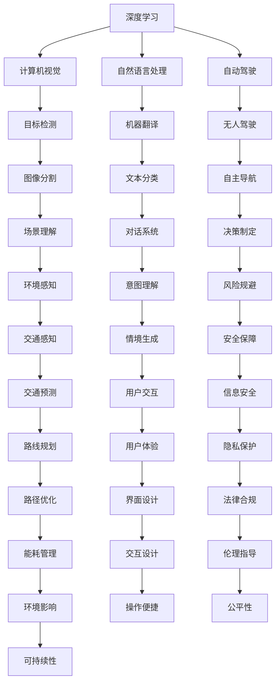

                 

## 1. 背景介绍

### 1.1 问题由来

在人工智能领域，Andrej Karpathy 是一位备受瞩目的研究者和实践者。他的工作不仅覆盖了计算机视觉、深度学习、自动驾驶等多个领域，还对人工智能的未来发展有着深邃的洞察。本文将梳理并探讨 Karpathy 对人工智能未来发展机遇的独特见解。

### 1.2 问题核心关键点

Karpathy 的研究和教学经验使其对人工智能的发展趋势有深刻理解。他强调了深度学习在计算机视觉、自然语言处理、自动驾驶等领域的重要作用，并对未来 AI 技术的应用场景和伦理问题提出了独到见解。本文将从多个维度探讨 Karpathy 对人工智能未来发展机遇的看法。

## 2. 核心概念与联系

### 2.1 核心概念概述

为了更好地理解 Karpathy 对人工智能未来发展机遇的看法，本节将介绍几个核心概念：

- **深度学习**：一种基于人工神经网络的机器学习技术，通过多层次的特征提取和处理，使得机器能够学习和模拟人类大脑的认知过程。
- **计算机视觉**：研究如何让计算机“看”和“理解”图像和视频，涵盖目标检测、图像分割、场景理解等任务。
- **自然语言处理**：使计算机能够理解、处理和生成人类语言，涵盖机器翻译、文本分类、对话系统等任务。
- **自动驾驶**：使汽车能够自主导航、决策，以实现无人驾驶。
- **AI伦理**：探讨人工智能在社会、经济、法律等方面的伦理问题，包括隐私保护、决策透明度等。

这些概念构成了 Karpathy 探讨人工智能未来发展机遇的基础框架。

### 2.2 核心概念原理和架构的 Mermaid 流程图



这个流程图展示了深度学习技术如何应用于不同领域，并且每个领域内又涉及多个子任务，形成了一个复杂但相互联系的体系。

## 3. 核心算法原理 & 具体操作步骤

### 3.1 算法原理概述

Karpathy 强调了深度学习在人工智能中的核心地位，并认为深度学习技术将不断演进，推动人工智能在多个领域的应用。具体来说，他关注以下几个方面：

1. **模型压缩与量化**：深度学习模型参数量巨大，硬件资源受限，模型压缩与量化技术能够减少模型大小和计算开销，使得 AI 应用更加灵活和高效。
2. **自监督学习**：利用未标注数据进行预训练，使得模型能够更好地泛化，适应更多下游任务。
3. **跨模态学习**：结合视觉、语音、文本等多种模态的信息，提升模型对复杂场景的理解能力。
4. **对抗训练**：通过引入对抗样本训练模型，增强模型的鲁棒性和泛化能力。
5. **小样本学习**：在数据量不足的情况下，通过迁移学习、微调等技术，使模型能够在小样本上取得良好效果。

### 3.2 算法步骤详解

以下详细阐述了深度学习技术在计算机视觉、自然语言处理、自动驾驶等领域的具体应用步骤：

**深度学习在计算机视觉中的应用**：
1. **数据收集与预处理**：收集大量带标签的图像数据，并进行数据增强、归一化等预处理。
2. **模型选择与设计**：选择适合的深度学习架构（如卷积神经网络 CNN、循环神经网络 RNN 等），并设计模型的层数、参数量等。
3. **模型训练与调优**：使用梯度下降等优化算法，最小化损失函数，调整学习率、批大小等超参数。
4. **模型评估与部署**：在验证集上评估模型性能，选择最优模型进行部署，集成到实际应用中。

**深度学习在自然语言处理中的应用**：
1. **数据收集与预处理**：收集大量带标签的文本数据，并进行分词、清洗等预处理。
2. **模型选择与设计**：选择适合的深度学习架构（如 LSTM、Transformer 等），并设计模型的层数、参数量等。
3. **模型训练与调优**：使用梯度下降等优化算法，最小化损失函数，调整学习率、批大小等超参数。
4. **模型评估与部署**：在验证集上评估模型性能，选择最优模型进行部署，集成到实际应用中。

**深度学习在自动驾驶中的应用**：
1. **传感器数据收集**：收集车辆内外部的传感器数据，如摄像头、雷达、激光雷达等。
2. **环境建模**：使用深度学习模型对传感器数据进行环境建模，识别道路、车辆、行人等目标。
3. **决策制定**：结合环境建模结果，使用强化学习等方法制定驾驶决策，如加速、减速、转向等。
4. **模型评估与部署**：在模拟和真实环境中评估模型性能，选择最优模型进行部署，集成到实际车辆中。

### 3.3 算法优缺点

深度学习在人工智能中的应用具有以下优点：
1. **强大的学习能力**：深度学习模型能够自动学习数据的特征表示，适用于处理复杂模式。
2. **广泛应用**：深度学习技术在计算机视觉、自然语言处理、自动驾驶等领域都有重要应用，推动了人工智能的发展。
3. **算法多样性**：深度学习包含多种模型架构和优化算法，适用于不同的任务需求。

同时，深度学习也存在一些缺点：
1. **计算资源需求高**：深度学习模型需要大量的计算资源进行训练和推理。
2. **数据需求大**：深度学习模型需要大量的标注数据进行训练，获取标注数据成本高。
3. **模型复杂性**：深度学习模型复杂，难以解释和调试。
4. **公平性与伦理问题**：深度学习模型可能存在偏见，影响决策公平性，引发伦理问题。

### 3.4 算法应用领域

Karpathy 认为，深度学习技术将在多个领域发挥重要作用，具体包括：

- **计算机视觉**：自动驾驶、目标检测、图像分割等。
- **自然语言处理**：机器翻译、对话系统、文本分类等。
- **自动驾驶**：无人驾驶、环境感知、决策制定等。
- **医疗健康**：影像诊断、基因分析等。
- **智能家居**：语音助手、家庭安防等。
- **金融服务**：风险评估、欺诈检测等。

## 4. 数学模型和公式 & 详细讲解 & 举例说明

### 4.1 数学模型构建

Karpathy 强调了数学模型在深度学习中的重要性，特别是损失函数的设计和优化算法的选择。以计算机视觉中的目标检测任务为例，构建数学模型如下：

设目标检测模型的输入为图像 $I$，输出为每个目标的边界框坐标 $(b_x, b_y, b_w, b_h)$ 和类别标签 $c$。假设模型的输出为热力图 $H$，其中每个像素点的值表示该像素点包含目标的概率。则目标检测任务的目标是最小化损失函数：

$$
\mathcal{L} = \frac{1}{N} \sum_{i=1}^N \mathcal{L}_{i}
$$

其中，$N$ 为所有目标的数目。每个目标的损失函数 $\mathcal{L}_i$ 可以表示为：

$$
\mathcal{L}_i = \sum_{k=1}^{K} \left( \text{IoU}(b_i^k, \hat{b}_i^k) + C\left(\text{IoU}(b_i^k, \hat{b}_i^k) \right)^2 \right)
$$

其中，$\text{IoU}$ 表示边界框的交并比，$K$ 为每个目标的类别数，$C$ 为类别权重。

### 4.2 公式推导过程

以计算机视觉中的目标检测任务为例，推导损失函数的梯度计算过程如下：

1. 计算每个目标的边界框坐标 $b_i^k$ 和模型输出的热力图 $\hat{b}_i^k$。
2. 计算边界框的交并比 $\text{IoU}$。
3. 根据类别权重 $C$ 和损失函数 $\mathcal{L}_i$，计算损失函数的梯度。
4. 使用反向传播算法，计算模型参数 $\theta$ 的梯度。
5. 使用梯度下降等优化算法，更新模型参数 $\theta$。

### 4.3 案例分析与讲解

以自动驾驶中的环境建模任务为例，说明深度学习模型如何进行推理和预测。

假设自动驾驶系统从车载摄像头和激光雷达中获取环境数据 $X$，模型通过卷积神经网络对数据进行处理，得到环境特征表示 $H$。然后，使用循环神经网络对时间序列数据进行处理，得到动态特征表示 $R$。结合空间特征和时间特征，模型输出环境模型 $M$。具体推理过程如下：

1. 输入环境数据 $X$ 到卷积神经网络中，得到特征表示 $H$。
2. 输入时间序列数据 $R$ 到循环神经网络中，得到动态特征表示 $R$。
3. 结合 $H$ 和 $R$，输出环境模型 $M$。
4. 在训练过程中，使用监督信号对模型进行训练，最小化损失函数 $\mathcal{L}$。
5. 在测试过程中，使用模型 $M$ 进行环境建模，预测目标的位置和运动轨迹。

## 5. 项目实践：代码实例和详细解释说明

### 5.1 开发环境搭建

进行深度学习项目实践前，需要准备好开发环境。以下是使用 Python 和 PyTorch 进行计算机视觉项目开发的配置流程：

1. 安装 Python 和 PyTorch：使用 pip 或 conda 安装 Python 和 PyTorch，并配置虚拟环境。
2. 安装其他依赖库：安装 OpenCV、NumPy、SciPy 等库，用于数据处理和数学计算。
3. 配置 CUDA 和 GPU 资源：确保安装了 CUDA 和 GPU 驱动程序，并配置 PyTorch 使用 GPU 进行计算。
4. 安装可视化工具：安装 Matplotlib、TensorBoard 等可视化工具，用于监控训练过程和结果。

### 5.2 源代码详细实现

以下是一个简单的计算机视觉项目代码实现，以目标检测为例：

```python
import torch
import torch.nn as nn
import torch.optim as optim
from torch.utils.data import DataLoader, Dataset
from torchvision import transforms, models

# 定义数据集
class CustomDataset(Dataset):
    def __init__(self, images, labels):
        self.images = images
        self.labels = labels
        
    def __len__(self):
        return len(self.images)
    
    def __getitem__(self, idx):
        image = self.images[idx]
        label = self.labels[idx]
        return image, label

# 定义模型
class CustomModel(nn.Module):
    def __init__(self):
        super(CustomModel, self).__init__()
        self.conv = nn.Sequential(
            nn.Conv2d(3, 64, kernel_size=3, padding=1),
            nn.ReLU(),
            nn.MaxPool2d(2, 2),
            nn.Conv2d(64, 128, kernel_size=3, padding=1),
            nn.ReLU(),
            nn.MaxPool2d(2, 2),
            nn.Conv2d(128, 256, kernel_size=3, padding=1),
            nn.ReLU(),
            nn.MaxPool2d(2, 2)
        )
        self.fc = nn.Sequential(
            nn.Linear(256 * 4 * 4, 256),
            nn.ReLU(),
            nn.Linear(256, 2)
        )
    
    def forward(self, x):
        x = self.conv(x)
        x = x.view(x.size(0), -1)
        x = self.fc(x)
        return x

# 定义训练过程
def train(model, train_loader, optimizer, criterion):
    model.train()
    for batch_idx, (data, target) in enumerate(train_loader):
        optimizer.zero_grad()
        output = model(data)
        loss = criterion(output, target)
        loss.backward()
        optimizer.step()

# 训练模型
model = CustomModel()
criterion = nn.CrossEntropyLoss()
optimizer = optim.Adam(model.parameters(), lr=0.001)

train_loader = DataLoader(train_dataset, batch_size=4, shuffle=True)
train(train_loader, optimizer, criterion)

# 评估模型
model.eval()
with torch.no_grad():
    test_loss = 0
    correct = 0
    total = 0
    for data, target in test_loader:
        output = model(data)
        test_loss += criterion(output, target).item()
        _, predicted = torch.max(output.data, 1)
        total += target.size(0)
        correct += (predicted == target).sum().item()
    print('Test set: Average loss: {:.4f}, Accuracy: {}/{} ({:.0f}%)'.format(
        test_loss / len(test_loader),
        correct,
        total,
        100. * correct / total))
```

### 5.3 代码解读与分析

代码实现了目标检测任务的深度学习模型，并使用交叉熵损失函数进行训练。关键点包括：

1. 数据集定义：自定义数据集类，将图像和标签作为输入输出。
2. 模型定义：使用卷积神经网络进行特征提取，并使用全连接层进行分类。
3. 训练过程：使用 Adam 优化器进行模型训练，最小化交叉熵损失。
4. 评估过程：在测试集上计算模型准确率和损失。

## 6. 实际应用场景

### 6.1 智能家居

深度学习技术在智能家居中的应用主要体现在语音助手和智能安防等领域。Karpathy 认为，未来智能家居将更加智能化、个性化和自动化，能够根据用户行为和环境变化实时调整家居环境，提升用户体验。

以语音助手为例，深度学习模型能够通过自然语言处理技术，理解用户语音指令，并根据指令自动控制家居设备，如灯光、温度、窗帘等。这种智能家居场景将大大提升用户的生活便利性和舒适性。

### 6.2 医疗健康

在医疗健康领域，深度学习技术主要用于影像诊断和基因分析等任务。Karpathy 认为，深度学习模型能够从医学影像中自动识别病变区域，提高诊断的准确性和效率。

例如，使用卷积神经网络对医学影像进行特征提取和分类，能够快速识别肿瘤、骨折等疾病。未来，随着深度学习技术的进一步发展，AI 辅助诊断将更加广泛应用，提升医疗服务水平。

### 6.3 自动驾驶

自动驾驶是深度学习技术的重要应用领域，Karpathy 对此尤为关注。他指出，自动驾驶技术在提升交通安全性、缓解交通拥堵方面具有巨大潜力。

深度学习模型在自动驾驶中用于环境建模、决策制定和路径规划等任务。未来，随着感知能力、决策能力、计算能力的进一步提升，自动驾驶技术将逐步从封闭场景走向开放道路，实现更加智能、可靠的自动驾驶。

## 7. 工具和资源推荐

### 7.1 学习资源推荐

为了帮助开发者系统掌握深度学习技术的应用，推荐以下学习资源：

1. Deep Learning Specialization（吴恩达 Coursera 课程）：涵盖深度学习的基本概念、神经网络、卷积神经网络、循环神经网络等内容。
2. PyTorch 官方文档：详细介绍了 PyTorch 的使用方法，包括模型的定义、训练、评估等。
3. TensorFlow 官方文档：介绍了 TensorFlow 的使用方法，包括模型的定义、训练、评估等。
4. Fast.ai 课程：以实际项目为导向，涵盖深度学习在计算机视觉、自然语言处理等领域的应用。

### 7.2 开发工具推荐

1. PyTorch：易于使用，支持动态计算图，适合研究和快速原型开发。
2. TensorFlow：由 Google 主导开发，生产部署方便，适合大规模工程应用。
3. TensorBoard：可视化工具，用于监控训练过程和结果。
4. Weights & Biases：实验跟踪工具，记录和可视化训练过程中的各项指标。

### 7.3 相关论文推荐

1. ImageNet Classification with Deep Convolutional Neural Networks：提出 AlexNet 模型，奠定了深度学习在计算机视觉领域的基础。
2. Deep Residual Learning for Image Recognition：提出 ResNet 模型，解决深度网络退化问题。
3. Attention is All You Need：提出 Transformer 模型，推动自然语言处理技术的发展。
4. Generative Adversarial Nets：提出 GAN 模型，推动生成对抗网络的研究。
5. AlphaGo Zero：使用深度强化学习技术，让 AI 在围棋中战胜人类。

## 8. 总结：未来发展趋势与挑战

### 8.1 研究成果总结

Karpathy 在深度学习领域的贡献主要体现在以下几个方面：

1. 深度学习在计算机视觉中的应用：提出 AlexNet、ResNet 等模型，推动计算机视觉技术的发展。
2. 深度学习在自然语言处理中的应用：提出 Transformer 模型，推动自然语言处理技术的发展。
3. 深度学习在自动驾驶中的应用：推动自动驾驶技术的进步，提出多模态感知和决策模型。

### 8.2 未来发展趋势

Karpathy 认为，未来深度学习技术将向以下几个方向发展：

1. 模型压缩与量化：减少模型大小和计算开销，使得 AI 应用更加灵活和高效。
2. 自监督学习：利用未标注数据进行预训练，使得模型能够更好地泛化。
3. 跨模态学习：结合视觉、语音、文本等多种模态的信息，提升模型对复杂场景的理解能力。
4. 对抗训练：通过引入对抗样本训练模型，增强模型的鲁棒性和泛化能力。
5. 小样本学习：在数据量不足的情况下，通过迁移学习、微调等技术，使模型能够在小样本上取得良好效果。

### 8.3 面临的挑战

尽管深度学习技术在多个领域取得了显著成就，但也面临以下挑战：

1. 计算资源需求高：深度学习模型需要大量的计算资源进行训练和推理。
2. 数据需求大：深度学习模型需要大量的标注数据进行训练，获取标注数据成本高。
3. 模型复杂性：深度学习模型复杂，难以解释和调试。
4. 公平性与伦理问题：深度学习模型可能存在偏见，影响决策公平性，引发伦理问题。

### 8.4 研究展望

Karpathy 认为，未来深度学习技术需要在以下几个方面进行突破：

1. 模型压缩与量化：进一步减少模型大小和计算开销，使得 AI 应用更加灵活和高效。
2. 自监督学习：利用未标注数据进行预训练，使得模型能够更好地泛化。
3. 跨模态学习：结合视觉、语音、文本等多种模态的信息，提升模型对复杂场景的理解能力。
4. 对抗训练：通过引入对抗样本训练模型，增强模型的鲁棒性和泛化能力。
5. 小样本学习：在数据量不足的情况下，通过迁移学习、微调等技术，使模型能够在小样本上取得良好效果。

## 9. 附录：常见问题与解答

**Q1: 深度学习技术在计算机视觉中的应用有哪些？**

A: 深度学习技术在计算机视觉中主要应用于目标检测、图像分类、图像分割等任务。

**Q2: 深度学习在自动驾驶中的应用有哪些？**

A: 深度学习在自动驾驶中用于环境建模、决策制定和路径规划等任务。

**Q3: 如何提高深度学习模型的鲁棒性？**

A: 通过对抗训练、数据增强等技术，提高深度学习模型的鲁棒性。

**Q4: 深度学习在医疗健康中的应用有哪些？**

A: 深度学习在医疗健康中主要用于影像诊断和基因分析等任务。

**Q5: 未来深度学习技术的发展趋势有哪些？**

A: 未来深度学习技术将向模型压缩与量化、自监督学习、跨模态学习、对抗训练和小样本学习等方向发展。

---

作者：禅与计算机程序设计艺术 / Zen and the Art of Computer Programming

