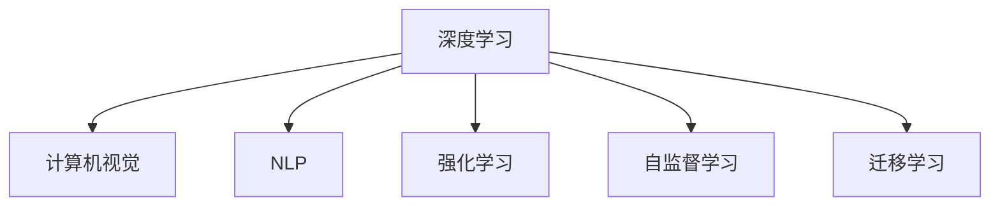

                 

## 1. 背景介绍

人工智能(AI)技术的迅猛发展，正深刻影响着各行各业。作为深度学习领域的领军人物，Andrej Karpathy 的见解和思考，无疑能为业界提供重要的参考。本文将从多个角度探讨 Andrej Karpathy 对人工智能未来发展的看法，结合其研究和实践经验，分析当前的机遇与挑战。

## 2. 核心概念与联系

### 2.1 核心概念概述

Andrej Karpathy 在人工智能领域的研究覆盖了深度学习、计算机视觉、机器人学等多个方向。以下是他对AI未来发展的核心概念概述：

- **深度学习（Deep Learning）**：一种基于神经网络结构的机器学习技术，通过多层非线性变换，可以从数据中学习高级特征表示。

- **计算机视觉（Computer Vision）**：使计算机能够“看懂”图像和视频，自动地进行目标检测、图像分割、场景理解等任务。

- **自然语言处理（Natural Language Processing, NLP）**：使计算机能够理解、处理和生成人类语言，包括文本生成、机器翻译、问答系统等。

- **强化学习（Reinforcement Learning, RL）**：一种通过试错反馈，学习最优决策策略的机器学习方法，常用于机器人控制、游戏AI等领域。

- **自监督学习（Self-Supervised Learning）**：利用数据自身的内在关系，进行无监督学习，以获得更好的特征表示。

- **迁移学习（Transfer Learning）**：利用已有任务的知识，迁移到新任务上，以减少学习时间和数据需求。

这些概念彼此之间相互联系，共同构成了现代AI技术的基础框架。

### 2.2 核心概念原理和架构的 Mermaid 流程图



以上流程图展示了深度学习与其它AI子领域之间的关系，每个领域都可以从深度学习中获益，并相互促进，形成了一个完整的AI生态系统。

## 3. 核心算法原理 & 具体操作步骤

### 3.1 算法原理概述

AI技术的核心在于数据驱动的学习和优化，通过大量数据训练模型，使其能够进行预测、分类、生成等任务。本文将结合 Andrej Karpathy 的研究，探讨当前AI算法的原理与特点。

### 3.2 算法步骤详解

Andrej Karpathy 在深度学习研究中，特别关注卷积神经网络（CNNs）、循环神经网络（RNNs）、生成对抗网络（GANs）等模型的设计与应用。以下以 CNNs 为例，详细介绍其工作原理和步骤：

1. **数据准备**：首先收集并标注大量图像数据，将图像分成训练集、验证集和测试集。

2. **模型构建**：设计卷积层、池化层、全连接层等组成卷积神经网络。卷积层通过滤波器提取图像特征，池化层进行特征降维，全连接层将特征映射到标签空间。

3. **模型训练**：使用随机梯度下降（SGD）等优化算法，最小化损失函数，更新模型参数。训练过程中，使用验证集评估模型性能，避免过拟合。

4. **模型评估**：在测试集上评估模型性能，如准确率、召回率、F1 值等指标。

### 3.3 算法优缺点

Andrej Karpathy 认为，深度学习算法具有以下优点：

- **强大的表示学习能力**：能够学习到数据的高级特征表示，无需人工设计特征。
- **自适应性强**：通过端到端学习，能够适应多种复杂的非线性关系。
- **可扩展性**：能够应用于大规模数据集，提升模型性能。

同时，也存在以下缺点：

- **计算资源需求高**：训练深度神经网络需要大量的计算资源，如GPU、TPU。
- **模型复杂性高**：深度模型复杂，难以解释和调试。
- **过拟合风险**：在数据量不足的情况下，容易过拟合，泛化性能差。

### 3.4 算法应用领域

Andrej Karpathy 在计算机视觉领域的研究成果丰富，广泛应用于图像分类、目标检测、图像生成等领域。以下列出几个典型的应用场景：

- **自动驾驶**：利用计算机视觉技术，识别道路标志、车辆、行人等，实现自动驾驶。
- **医学影像分析**：通过深度学习，分析医学影像，辅助医生进行疾病诊断。
- **增强现实（AR）**：利用计算机视觉技术，生成虚拟场景，增强现实体验。

## 4. 数学模型和公式 & 详细讲解

### 4.1 数学模型构建

Andrej Karpathy 的深度学习研究中，涉及多个数学模型，包括卷积神经网络、循环神经网络等。以卷积神经网络为例，构建数学模型如下：

$$
f(x) = W^{(1)}x + b^{(1)} \rightarrow \max\limits_{k=1}^K \ReLU(xW^{(2)}_k + b^{(2)}_k)
$$

其中，$x$ 为输入，$W^{(1)}$、$W^{(2)}_k$ 为权重，$b^{(1)}$、$b^{(2)}_k$ 为偏置，$\ReLU$ 为激活函数。

### 4.2 公式推导过程

以卷积神经网络的训练过程为例，公式推导如下：

1. **损失函数**：定义交叉熵损失函数 $L(y, \hat{y})$，其中 $y$ 为真实标签，$\hat{y}$ 为模型预测。

2. **梯度下降**：通过反向传播算法，计算损失函数对参数的梯度 $\nabla_L$。

3. **模型更新**：使用梯度下降算法更新模型参数，最小化损失函数。

### 4.3 案例分析与讲解

以图像分类任务为例，结合 Andrej Karpathy 的论文，分析模型的训练和应用过程。训练过程如下：

1. **数据准备**：收集并标注大量图像数据，将数据分为训练集、验证集和测试集。

2. **模型构建**：设计卷积神经网络，包括卷积层、池化层、全连接层等。

3. **模型训练**：使用随机梯度下降算法，最小化交叉熵损失函数，更新模型参数。训练过程中，使用验证集评估模型性能，避免过拟合。

4. **模型评估**：在测试集上评估模型性能，如准确率、召回率、F1 值等指标。

## 5. 项目实践：代码实例和详细解释说明

### 5.1 开发环境搭建

为了进行深度学习项目实践，需要搭建好开发环境。以下是基于 Python 的深度学习开发环境搭建流程：

1. **安装 Python**：从官网下载并安装最新版本的 Python。

2. **安装 PyTorch**：使用 pip 安装 PyTorch 和相关库，如 torchvision、torchtext 等。

3. **安装 GPU 驱动**：确保安装的 GPU 驱动与 PyTorch 版本兼容。

4. **安装 CUDA**：从 Nvidia 官网下载 CUDA 版本，安装并配置环境变量。

5. **安装 CUDA 工具包**：从 Nvidia 官网下载对应的 CUDA 工具包，安装并配置环境变量。

### 5.2 源代码详细实现

以下是一个简单的卷积神经网络实现，使用 PyTorch 库：

```python
import torch
import torch.nn as nn
import torchvision.transforms as transforms
import torchvision.datasets as datasets

# 定义模型
class Net(nn.Module):
    def __init__(self):
        super(Net, self).__init__()
        self.conv1 = nn.Conv2d(3, 6, 5)
        self.pool = nn.MaxPool2d(2, 2)
        self.conv2 = nn.Conv2d(6, 16, 5)
        self.fc1 = nn.Linear(16 * 5 * 5, 120)
        self.fc2 = nn.Linear(120, 84)
        self.fc3 = nn.Linear(84, 10)

    def forward(self, x):
        x = self.pool(F.relu(self.conv1(x)))
        x = self.pool(F.relu(self.conv2(x)))
        x = x.view(-1, 16 * 5 * 5)
        x = F.relu(self.fc1(x))
        x = F.relu(self.fc2(x))
        x = self.fc3(x)
        return x

# 训练模型
def train(net, train_loader, optimizer, criterion, num_epochs):
    for epoch in range(num_epochs):
        running_loss = 0.0
        for i, data in enumerate(train_loader, 0):
            inputs, labels = data
            optimizer.zero_grad()
            outputs = net(inputs)
            loss = criterion(outputs, labels)
            loss.backward()
            optimizer.step()
            running_loss += loss.item()
            if i % 2000 == 1999:
                print('Epoch %d, loss: %.3f' % (epoch + 1, running_loss / 2000))
                running_loss = 0.0
```

### 5.3 代码解读与分析

以上代码实现了一个简单的卷积神经网络，包含卷积层、池化层、全连接层等。训练过程中，使用随机梯度下降算法，最小化交叉熵损失函数，更新模型参数。以下是对关键代码的解读：

- `nn.Conv2d`：定义卷积层。
- `nn.MaxPool2d`：定义池化层。
- `nn.Linear`：定义全连接层。
- `F.relu`：定义激活函数。
- `optimizer.zero_grad()`：清除梯度缓存。
- `optimizer.step()`：更新模型参数。

## 6. 实际应用场景

### 6.1 医疗影像分析

Andrej Karpathy 在医疗影像分析领域的研究成果显著，利用深度学习技术，可以实现自动化的病变检测、影像分割等任务。具体应用如下：

1. **病变检测**：通过卷积神经网络，自动识别医学影像中的病变区域，辅助医生进行诊断。
2. **影像分割**：将医学影像中的不同区域分割出来，如肿瘤、血管等，进行精细分析。
3. **图像生成**：通过生成对抗网络，生成仿真医学影像，用于教学和研究。

### 6.2 自动驾驶

Andrej Karpathy 在自动驾驶领域也有重要贡献，利用计算机视觉技术，实现道路标志识别、车辆检测等任务。具体应用如下：

1. **道路标志识别**：通过卷积神经网络，自动识别道路标志，如停车标志、限速标志等。
2. **车辆检测**：通过目标检测算法，识别车辆位置和类别，辅助自动驾驶。
3. **场景理解**：通过语义分割算法，理解道路、行人等场景元素，进行智能决策。

### 6.3 游戏AI

Andrej Karpathy 在强化学习领域的研究成果丰富，应用于游戏AI领域，实现智能游戏策略和决策。具体应用如下：

1. **智能游戏策略**：通过强化学习算法，训练智能玩家，进行游戏对弈。
2. **实时决策**：实时感知游戏环境，进行最优决策，提升游戏表现。
3. **多智能体协作**：通过合作学习算法，多个智能体协同作战，实现复杂任务。

## 7. 工具和资源推荐

### 7.1 学习资源推荐

为了深入学习 Andrej Karpathy 的研究成果，推荐以下学习资源：

1. **Deep Learning Specialization**：Andrej Karpathy 在 Coursera 上开设的深度学习课程，涵盖深度学习基础和高级技术。
2. **CS231n: Convolutional Neural Networks for Visual Recognition**：斯坦福大学开设的计算机视觉课程，由 Andrej Karpathy 主讲，涵盖卷积神经网络、目标检测、图像生成等技术。
3. **The Illustrated Bible of Deep Learning**：Andrej Karpathy 出版的深度学习入门书籍，以图解形式讲解深度学习原理。
4. **Deep Learning with PyTorch**：Andrej Karpathy 发表的 PyTorch 教程，详细讲解 PyTorch 库的使用和深度学习模型构建。

### 7.2 开发工具推荐

Andrej Karpathy 推荐了以下深度学习开发工具：

1. **PyTorch**：用于构建和训练深度学习模型的开源框架，支持动态计算图。
2. **TensorFlow**：由 Google 开发的全功能机器学习框架，支持分布式计算和高效优化。
3. **Caffe2**：Facebook 开源的深度学习框架，优化了模型推理速度。
4. **MXNet**：由 Apache 开发的深度学习框架，支持多种语言和多种硬件平台。
5. **Keras**：高层次的神经网络 API，易于上手，支持多种深度学习框架。

### 7.3 相关论文推荐

Andrej Karpathy 的研究成果丰硕，以下论文推荐深入阅读：

1. **Convolutional Neural Networks for Sentence Classification**：提出卷积神经网络在文本分类中的应用。
2. **Deep Residual Learning for Image Recognition**：提出残差网络（ResNet），解决深度神经网络退化问题。
3. **Playing Atari with Deep Reinforcement Learning**：提出使用深度强化学习算法，进行游戏AI训练。
4. **Visual-Attention for Visual Recognition**：提出视觉注意力机制，提升计算机视觉模型的表现。
5. **Real-Time Single Image and Video Deblurring using a Deep Convolutional Encoder-Decoder Network**：提出卷积神经网络，用于单张图像和视频去模糊。

## 8. 总结：未来发展趋势与挑战

### 8.1 研究成果总结

Andrej Karpathy 在深度学习领域的研究，涵盖了多个方向，包括卷积神经网络、循环神经网络、生成对抗网络等。其研究成果广泛应用于计算机视觉、自动驾驶、游戏AI等领域，推动了AI技术的发展。

### 8.2 未来发展趋势

Andrej Karpathy 认为，未来AI技术的发展趋势如下：

1. **深度学习将继续发展**：深度学习技术将不断进步，网络结构更加复杂，参数量更大，性能更好。
2. **AI将广泛应用于各个领域**：AI技术将渗透到医疗、教育、交通等各个领域，带来深刻变革。
3. **AI将更加注重伦理和安全**：AI技术的普及将引发伦理和安全问题，需要制定相应的规范和标准。
4. **跨领域协作将更加频繁**：AI技术将与其他学科深度融合，推动科技发展。
5. **AI将更加注重人性化**：AI技术将更加注重人性化设计，提升用户体验。

### 8.3 面临的挑战

Andrej Karpathy 认为，未来AI技术面临的挑战如下：

1. **计算资源需求高**：深度学习模型需要大量的计算资源，如何降低资源消耗将是重要课题。
2. **模型复杂性高**：深度模型复杂，难以解释和调试，需要开发更简单、更易于理解的技术。
3. **数据隐私和安全**：AI技术将处理大量敏感数据，如何保障数据隐私和安全是重要问题。
4. **伦理和社会影响**：AI技术的普及将引发伦理和社会问题，需要制定相应的规范和标准。
5. **跨领域协作难度大**：AI技术涉及多个学科，跨领域协作难度大，需要制定统一的标准和规范。

### 8.4 研究展望

Andrej Karpathy 认为，未来AI技术的研究方向如下：

1. **普适化AI**：开发更加普适、可解释的AI技术，提升用户体验。
2. **跨领域协作**：加强跨学科协作，推动AI技术发展。
3. **伦理和安全**：制定AI技术的伦理和安全规范，保障用户隐私和数据安全。
4. **人性化设计**：注重人性化设计，提升用户体验。

## 9. 附录：常见问题与解答

**Q1：深度学习算法的计算资源需求高，如何解决？**

A: 可以使用分布式计算、模型压缩、量化等技术，降低计算资源消耗。例如，使用 TensorFlow 的分布式训练框架，或者使用 PyTorch 的模型压缩算法，进行模型优化。

**Q2：深度学习模型复杂，难以解释和调试，如何解决？**

A: 可以使用可视化工具，如 TensorBoard，实时监测模型训练状态，帮助理解模型行为。同时，可以开发更简单、更易于理解的技术，如知识蒸馏、可解释性模型等。

**Q3：如何保障AI技术的伦理和安全？**

A: 制定AI技术的伦理和安全规范，保障用户隐私和数据安全。同时，加强模型审查和监督，避免模型滥用和偏见。

**Q4：如何推动跨领域协作？**

A: 加强跨学科交流和合作，制定统一的标准和规范。例如，建立AI技术标准化组织，推动跨领域协作和技术推广。

**Q5：如何实现普适化AI？**

A: 开发更加普适、可解释的AI技术，注重人性化设计，提升用户体验。例如，开发多语言支持、跨平台兼容的AI应用。

---

作者：禅与计算机程序设计艺术 / Zen and the Art of Computer Programming

