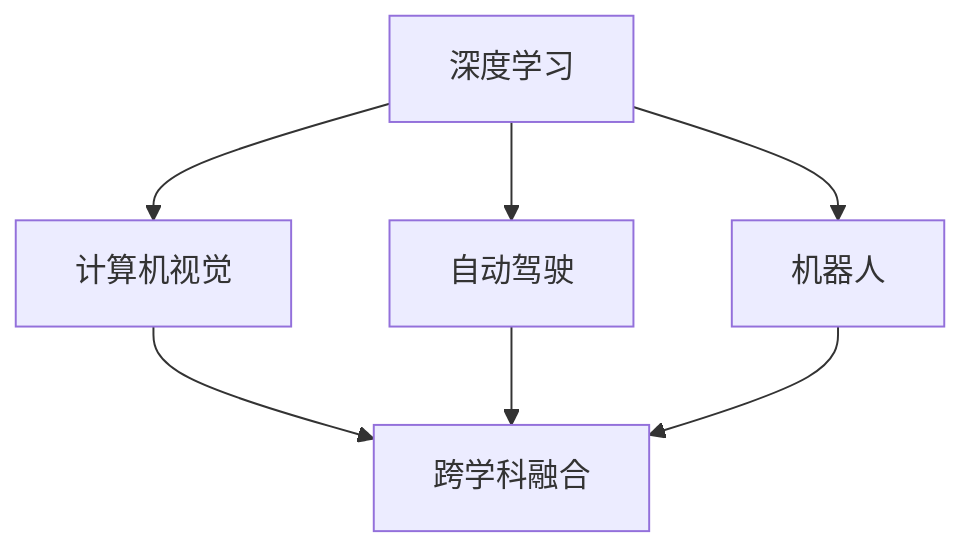

                 

## 1. 背景介绍

在人工智能领域，安德烈·卡帕西（Andrej Karpathy）是一位举足轻重的领军人物，以其在深度学习和计算机视觉方面的卓越贡献而闻名。他是深度学习领域的先驱之一，同时也是OpenAI的研究主任，斯坦福大学的计算机科学教授，以及特斯拉公司的首席人工智能科学家。本文将探讨安德烈·卡帕西关于人工智能未来发展机遇的见解，涵盖多个方面，包括最新技术趋势、跨学科应用、人才培养等，为读者提供全面而深入的视角。

## 2. 核心概念与联系

### 2.1 核心概念概述

安德烈·卡帕西的研究跨越了多个领域，包括深度学习、计算机视觉、自动驾驶等。以下将重点介绍几个核心概念及其之间的联系：

- **深度学习**：一种通过神经网络自动学习输入数据的复杂特征表示的机器学习技术。
- **计算机视觉**：使计算机理解并解释图像、视频等视觉数据的科学和技术。
- **自动驾驶**：使用人工智能技术实现车辆自动导航的系统。
- **机器人**：自动执行复杂任务，尤其是涉及运动和感知能力的机器。
- **跨学科融合**：将不同领域的知识和技术结合，推动新技术的发展。

这些概念通过技术和科学的交叉和融合，推动了人工智能领域的多方进步。卡帕西的研究跨越了这些领域，推动了深度学习在各个方面的应用。

### 2.2 核心概念原理和架构的 Mermaid 流程图



这个流程图展示了深度学习、计算机视觉、自动驾驶和机器人技术之间相互联系和影响的架构。深度学习是这些领域的基础，而跨学科的融合则推动了技术进步和应用扩展。

## 3. 核心算法原理 & 具体操作步骤

### 3.1 算法原理概述

安德烈·卡帕西在深度学习领域的研究涉及多个方面，包括卷积神经网络（CNN）、循环神经网络（RNN）、变分自编码器（VAE）、生成对抗网络（GAN）等。以下简要介绍几个核心的算法原理：

- **卷积神经网络**：通过卷积层提取图像中的局部特征，逐步汇聚成全局特征，适用于图像分类和识别任务。
- **循环神经网络**：通过循环结构处理序列数据，适用于文本生成、时间序列预测等任务。
- **变分自编码器**：通过学习输入数据的低维表示，进行数据压缩和降维，适用于数据生成和特征学习。
- **生成对抗网络**：通过对抗训练提升生成模型质量，适用于图像生成、风格转换等任务。

这些算法通过不断优化和创新，推动了深度学习技术的发展和应用。

### 3.2 算法步骤详解

以生成对抗网络（GAN）为例，其训练步骤包括：

1. 定义生成器和判别器：生成器生成假样本，判别器区分真实样本和假样本。
2. 交替训练：先固定判别器，训练生成器；再固定生成器，训练判别器。
3. 迭代优化：不断调整生成器和判别器的参数，使生成器生成的样本越来越逼真，判别器对样本的判别能力越来越强。

```python
import tensorflow as tf
from tensorflow.keras import layers

# 定义生成器和判别器
def make_generator_model():
    model = tf.keras.Sequential()
    model.add(layers.Dense(256, use_bias=False, input_shape=(100,)))
    model.add(layers.BatchNormalization())
    model.add(layers.LeakyReLU())
    model.add(layers.Dense(512))
    model.add(layers.BatchNormalization())
    model.add(layers.LeakyReLU())
    model.add(layers.Dense(1024))
    model.add(layers.BatchNormalization())
    model.add(layers.LeakyReLU())
    model.add(layers.Dense(784, activation='tanh'))

    noise = tf.keras.Input(shape=(100,))
    img = model(noise)
    return tf.keras.Model(noise, img)

def make_discriminator_model():
    model = tf.keras.Sequential()
    model.add(layers.Dense(256, input_shape=(784,)))
    model.add(layers.LeakyReLU())
    model.add(layers.Dropout(0.3))
    model.add(layers.Dense(256))
    model.add(layers.LeakyReLU())
    model.add(layers.Dropout(0.3))
    model.add(layers.Dense(1, activation='sigmoid'))

    img = tf.keras.Input(shape=(784,))
    validity = model(img)
    return tf.keras.Model(img, validity)
```

### 3.3 算法优缺点

生成对抗网络（GAN）的主要优点包括：
- 能够生成高质量的图像和视频，具有较高的创造力和灵活性。
- 可以用于多种数据生成任务，如图像修复、风格转换等。

其主要缺点包括：
- 训练复杂，需要调整超参数和优化器，容易过拟合。
- 生成的图像可能存在模式和噪声问题。

### 3.4 算法应用领域

生成对抗网络（GAN）在多个领域中得到了广泛应用，包括但不限于：

- 图像生成：生成逼真的手写数字、人脸图像、艺术作品等。
- 数据增强：通过对原始数据进行变换生成更多样本，提高模型泛化能力。
- 视频生成：生成高质量的动画和视频，用于娱乐、教育和模拟训练。
- 游戏设计：用于生成虚拟场景和角色，提升游戏的交互性和体验感。

## 4. 数学模型和公式 & 详细讲解 & 举例说明

### 4.1 数学模型构建

以下以变分自编码器（VAE）为例，介绍其数学模型构建：

- 定义输入层 $x \in \mathbb{R}^d$，其中 $d$ 为输入数据的维度。
- 定义编码器 $q(z|x)$ 将输入数据 $x$ 映射到潜变量 $z \in \mathbb{R}^k$，其中 $k$ 为潜变量的维度。
- 定义解码器 $p(x|z)$ 将潜变量 $z$ 映射回输入数据 $x$。
- 定义损失函数 $\mathcal{L}$ 包含两个部分：潜在变量的重构误差和潜在变量的先验分布误差。

### 4.2 公式推导过程

重构误差 $\mathcal{L}_r$ 定义为：
$$
\mathcal{L}_r = \mathbb{E}_{p(x)}\mathbb{E}_{q(z|x)}[\|x - \mu(z)\|^2]
$$

其中 $\mu(z)$ 为解码器的输出，表示潜在变量的重建表示。

潜在变量的先验分布误差 $\mathcal{L}_p$ 定义为：
$$
\mathcal{L}_p = \mathbb{E}_{q(z)}[-\log p(z)] = -\int q(z)\log p(z)dz
$$

其中 $p(z)$ 为潜在变量的先验分布，通常为高斯分布。

最终的损失函数为：
$$
\mathcal{L} = \mathcal{L}_r + \mathcal{L}_p
$$

### 4.3 案例分析与讲解

以手写数字生成为例，使用变分自编码器（VAE）生成高质量的手写数字。

首先，定义编码器和解码器：

```python
import tensorflow as tf
from tensorflow.keras import layers

# 编码器
def make_encoder_model():
    model = tf.keras.Sequential()
    model.add(layers.InputLayer(input_shape=(784,)))
    model.add(layers.Dense(256, activation='relu'))
    model.add(layers.Dense(256, activation='relu'))
    model.add(layers.Dense(256, activation='relu'))
    model.add(layers.Dense(2, activation='sigmoid'))  # 潜在变量维度为2

    img = tf.keras.Input(shape=(784,))
    latent = model(img)
    return tf.keras.Model(img, latent)

# 解码器
def make_decoder_model():
    model = tf.keras.Sequential()
    model.add(layers.InputLayer(input_shape=(2,)))
    model.add(layers.Dense(256, activation='relu'))
    model.add(layers.Dense(256, activation='relu'))
    model.add(layers.Dense(256, activation='relu'))
    model.add(layers.Dense(784, activation='sigmoid'))

    latent = tf.keras.Input(shape=(2,))
    img = model(latent)
    return tf.keras.Model(latent, img)
```

然后，定义损失函数和优化器：

```python
from tensorflow.keras import losses

# 定义损失函数
def vae_loss(x, x_decoded_mean):
    xent_loss = losses.binary_crossentropy(x, x_decoded_mean)
    kl_loss = -0.5 * tf.reduce_sum(1 + x_decoded_mean - tf.square(x) - tf.exp(x_decoded_mean), axis=-1)
    return xent_loss + kl_loss

# 定义优化器
optimizer = tf.keras.optimizers.Adam(learning_rate=0.001)
```

最后，进行训练：

```python
from tensorflow.keras.datasets import mnist

# 加载手写数字数据集
(x_train, _), (x_test, _) = mnist.load_data()

# 数据预处理
x_train = x_train.astype('float32') / 255.
x_test = x_test.astype('float32') / 255.
x_train = np.expand_dims(x_train, axis=-1)
x_test = np.expand_dims(x_test, axis=-1)

# 训练模型
encoder = make_encoder_model()
decoder = make_decoder_model()
vae = tf.keras.Model(x, decoder(encoder(x)))
vae.compile(optimizer=optimizer, loss=vae_loss)

vae.fit(x_train, x_train, epochs=50, batch_size=32)
```

## 5. 项目实践：代码实例和详细解释说明

### 5.1 开发环境搭建

开发深度学习项目通常需要以下环境：

- **Python**：作为主要的编程语言。
- **TensorFlow 或 PyTorch**：主要的深度学习框架。
- **Jupyter Notebook 或 Google Colab**：交互式编程环境。
- **GPU**：加速深度学习计算，尤其是大型模型和高精度计算。

### 5.2 源代码详细实现

以下是使用PyTorch实现的深度学习代码：

```python
import torch
import torch.nn as nn
import torch.optim as optim

# 定义神经网络模型
class Net(nn.Module):
    def __init__(self):
        super(Net, self).__init__()
        self.fc1 = nn.Linear(784, 512)
        self.fc2 = nn.Linear(512, 256)
        self.fc3 = nn.Linear(256, 10)

    def forward(self, x):
        x = x.view(-1, 784)
        x = torch.relu(self.fc1(x))
        x = torch.relu(self.fc2(x))
        x = self.fc3(x)
        return x

# 训练模型
net = Net()
criterion = nn.CrossEntropyLoss()
optimizer = optim.Adam(net.parameters(), lr=0.001)

for epoch in range(100):
    running_loss = 0.0
    for i, data in enumerate(train_loader, 0):
        inputs, labels = data
        inputs, labels = inputs.to(device), labels.to(device)
        optimizer.zero_grad()
        outputs = net(inputs)
        loss = criterion(outputs, labels)
        loss.backward()
        optimizer.step()
        running_loss += loss.item()
    print(f'Epoch {epoch+1}, loss: {running_loss/len(train_loader)}')
```

### 5.3 代码解读与分析

- **网络模型定义**：定义了包含三个全连接层的神经网络，输入为784维的图像数据，输出为10个类别的预测。
- **损失函数定义**：使用交叉熵损失函数，衡量模型预测结果与真实标签之间的差异。
- **优化器定义**：使用Adam优化器，自动调整学习率。
- **训练过程**：在每个epoch内，对模型进行前向传播和反向传播，更新模型参数。

### 5.4 运行结果展示

训练过程中，可以观察到损失函数的收敛情况。当损失函数稳定下降时，模型逐渐收敛。

## 6. 实际应用场景

安德烈·卡帕西在实际应用场景中，推动了多项技术的落地和应用，以下是其中几个典型案例：

### 6.1 图像识别

在图像识别领域，卡帕西领导的研究团队开发了Caffe2深度学习框架，用于加速图像分类和物体检测等任务。Caffe2以高性能和灵活性著称，广泛应用于自动驾驶、安防监控等领域。

### 6.2 自动驾驶

卡帕西在自动驾驶领域的研究，推动了特斯拉公司自动驾驶技术的发展。他的工作包括使用深度学习技术实现车辆在复杂环境下的自主导航、感知和决策。

### 6.3 机器人

卡帕西还参与了许多机器人技术的研究，如使用深度学习技术优化机器人动作和决策，提升机器人在工业生产、医疗服务、家庭护理等方面的应用。

## 7. 工具和资源推荐

### 7.1 学习资源推荐

- **《Deep Learning》**：Ian Goodfellow、Yoshua Bengio 和 Aaron Courville 合著的经典教材，系统介绍了深度学习的基础知识和算法。
- **《Hands-On Machine Learning with Scikit-Learn, Keras, and TensorFlow》**：Aurélien Géron 撰写的实用指南，适合初学者和实践者快速上手。
- **Coursera 深度学习课程**：由Andrew Ng 主讲的课程，涵盖深度学习的基础理论和技术实践。
- **ArXiv**：全球最大的预印本服务器，发布最新的深度学习和人工智能研究成果。

### 7.2 开发工具推荐

- **PyTorch**：灵活易用的深度学习框架，支持动态计算图和GPU加速。
- **TensorFlow**：谷歌开源的深度学习框架，适用于大规模生产部署。
- **Jupyter Notebook**：交互式编程环境，支持Python、R等多种语言。
- **Google Colab**：免费的云计算平台，提供GPU和TPU资源。

### 7.3 相关论文推荐

- **"ImageNet Classification with Deep Convolutional Neural Networks"**：Alex Krizhevsky、Ilya Sutskever 和 Geoffrey Hinton 的论文，奠定了深度学习在图像分类任务中的应用基础。
- **"Very Deep Convolutional Networks for Large-Scale Image Recognition"**：Karen Simonyan 和 Andrew Zisserman 的论文，展示了深度卷积神经网络在图像识别任务中的优越性能。
- **"Language Models are Unsupervised Multitask Learners"**：Alec Radford、Jeffrey Wu、 Rewon Child、David Luan 和 Ilya Sutskever 的论文，展示了自监督学习在语言模型训练中的应用。

## 8. 总结：未来发展趋势与挑战

### 8.1 未来发展趋势

安德烈·卡帕西在深度学习和人工智能领域的持续探索，推动了多项技术的创新和应用。未来，他的研究将聚焦以下几个方面：

- **多模态融合**：将视觉、听觉、语言等多种模态数据结合，提升人工智能系统的感知能力和泛化能力。
- **模型可解释性**：开发更具有可解释性的深度学习模型，提高算法的透明性和可靠性。
- **人机协同**：推动人工智能技术与人类智能的协同工作，提升系统的交互性和适应性。

### 8.2 面临的挑战

尽管取得了诸多进展，人工智能领域仍然面临诸多挑战：

- **计算资源**：深度学习模型的参数量和计算复杂度不断增加，对计算资源的需求也在不断攀升。
- **数据隐私**：大规模数据集的使用可能涉及隐私问题，如何在数据利用和隐私保护之间找到平衡。
- **伦理与道德**：人工智能技术在决策和推理过程中可能存在伦理和道德问题，如偏见、歧视等。
- **应用落地**：如何将人工智能技术成功地应用于实际生产环境，解决实际问题。

### 8.3 研究展望

未来，安德烈·卡帕西的研究将继续推动人工智能技术的进步和应用，以下是几个研究展望：

- **可解释性**：开发更具有可解释性的深度学习模型，提高算法的透明性和可靠性。
- **跨学科融合**：推动人工智能技术与自然语言处理、计算机视觉、自动驾驶等领域的融合，提升技术的应用价值。
- **人机协同**：推动人工智能技术与人类智能的协同工作，提升系统的交互性和适应性。
- **伦理与道德**：在人工智能技术的设计和应用过程中，始终关注伦理和道德问题，确保技术的安全性和公平性。

## 9. 附录：常见问题与解答

**Q1: 深度学习与传统机器学习有何不同？**

A: 深度学习是机器学习的一个分支，使用神经网络对数据进行自动特征提取和模式识别。与传统机器学习相比，深度学习具有更强的非线性表达能力和更高的精度，但训练复杂度更高，对计算资源的需求更大。

**Q2: 如何使用深度学习技术进行图像识别？**

A: 使用卷积神经网络（CNN）进行图像识别，通过卷积层提取图像中的局部特征，逐步汇聚成全局特征，然后通过全连接层进行分类。常见的深度学习框架如TensorFlow、PyTorch等，提供了丰富的API和预训练模型，可以快速实现图像识别任务。

**Q3: 如何提高深度学习模型的可解释性？**

A: 使用可视化工具如Grad-CAM、LIME等，分析模型在决策过程中的关键特征和推理路径。同时，开发更具有可解释性的深度学习模型，如注意力机制、解释性生成对抗网络等，提升模型的透明性和可靠性。

**Q4: 如何处理深度学习模型的过拟合问题？**

A: 使用正则化技术如L2正则、Dropout等，防止模型过度适应训练集。还可以使用数据增强技术，如随机裁剪、翻转、缩放等，增加训练数据的多样性，提高模型的泛化能力。

**Q5: 深度学习技术在自动驾驶中的应用前景如何？**

A: 深度学习技术在自动驾驶领域具有广泛的应用前景，如通过卷积神经网络（CNN）实现物体检测和分类，通过循环神经网络（RNN）实现行为预测和路径规划，通过生成对抗网络（GAN）生成虚拟场景和测试数据等。这些技术的应用，将推动自动驾驶技术的发展和普及。

---

作者：禅与计算机程序设计艺术 / Zen and the Art of Computer Programming

