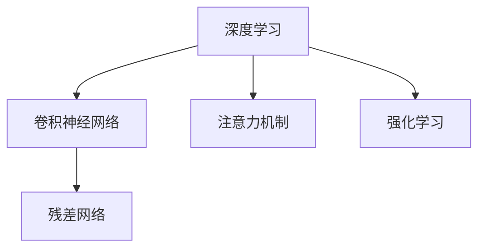

                 

## 1. 背景介绍

### 1.1 问题由来
在人工智能(AI)领域，Andrej Karpathy 是一位公认的顶尖专家，他在计算机视觉和深度学习领域做出了诸多开创性贡献。他以其独特的视角和深入浅出的讲解，在社交媒体、博客和演讲中广泛传播AI知识，引导无数从业者和爱好者。随着AI技术的迅猛发展，探讨其未来发展机遇成为了当前的热点话题。

Karpathy 的工作主要集中在深度学习和计算机视觉，尤其是基于神经网络的架构设计和优化。他的研究涵盖了图像识别、目标检测、语音识别、自然语言处理等领域。Karpathy 最为人熟知的成就之一是设计了卷积神经网络(CNN)中的残差网络(ResNet)，该网络大幅提升了图像识别模型的深度，标志着深度学习在图像处理领域的突破。

在深度学习的发展历程中，Karpathy 积极推动了从理论研究到实际应用的转变，他的工作不仅促进了学术界的研究进展，也为工业界带来了实际应用价值。他倡导开源和合作精神，推动了深度学习社区的发展，成为连接学术界和工业界的桥梁。

### 1.2 问题核心关键点
探讨人工智能的未来发展机遇，主要围绕以下几个核心关键点：

1. **算法演进**：深度学习算法的不断改进，如卷积神经网络、循环神经网络、注意力机制等，推动了AI在视觉、语言、语音等多领域的突破。
2. **计算能力提升**：随着计算硬件（如GPU、TPU）的进步，AI模型能够处理更大规模的数据，训练更复杂的深度神经网络。
3. **数据资源丰富**：大数据的收集和存储技术的发展，为AI模型提供了更多的训练数据，推动了模型的泛化性能。
4. **应用场景拓展**：AI技术的应用范围不断扩展，从自动驾驶、医疗诊断到金融预测，AI在多个领域展现出巨大潜力。
5. **伦理与社会影响**：AI技术的普及带来伦理问题和社会影响，如何确保技术的公正性和安全性成为重要议题。

Karpathy 的研究和见解，为我们深入理解这些核心关键点提供了宝贵的视角和洞察。

## 2. 核心概念与联系

### 2.1 核心概念概述

为更好地理解人工智能的未来发展机遇，本节将介绍几个关键概念：

- **深度学习**：一种通过多层神经网络进行复杂模式识别的机器学习方法。深度学习在图像识别、语音识别、自然语言处理等领域取得了显著成就。
- **卷积神经网络(CNN)**：一种专门用于处理图像和视频数据的深度学习架构，通过卷积操作提取特征，广泛应用于计算机视觉任务。
- **残差网络(ResNet)**：由Karpathy提出，通过引入残差连接，解决了深度学习中梯度消失问题，显著提升了深度神经网络的能力。
- **注意力机制**：一种使神经网络能够动态关注输入序列中不同位置的信息的机制，在机器翻译、语音识别等任务中表现出色。
- **强化学习**：一种通过试错学习优化决策策略的机器学习方法，在自动驾驶、游戏AI等场景中取得突破。

这些概念之间的逻辑关系可以通过以下Mermaid流程图来展示：



这个流程图展示了深度学习架构中几个关键组件及其之间的联系：

1. 深度学习是基础架构，通过卷积神经网络、残差网络和注意力机制等组件，提升模型在图像、语言和视频等领域的性能。
2. 强化学习作为另一个重要分支，通过试错学习，优化决策策略，推动AI在自适应和自主性任务上的进展。

## 3. 核心算法原理 & 具体操作步骤

### 3.1 算法原理概述

深度学习算法的发展，特别是在图像识别和自然语言处理领域，已经成为推动人工智能进步的重要动力。其中，卷积神经网络(CNN)、残差网络(ResNet)和注意力机制等技术的演进，极大地提升了模型性能，推动了AI在多个应用场景中的应用。

- **卷积神经网络(CNN)**：通过卷积操作提取特征，适用于处理图像和视频数据。CNN的核心思想是通过多层卷积和池化操作，逐渐提取抽象特征，最终通过全连接层进行分类或回归。
- **残差网络(ResNet)**：通过引入残差连接，解决了深度网络中的梯度消失问题，使得模型能够更深，更有效地学习特征。
- **注意力机制**：通过动态计算权重，使模型能够根据输入数据的不同位置，动态关注相关信息，提升模型的复杂度和泛化能力。

### 3.2 算法步骤详解

深度学习算法的实施通常包含以下几个关键步骤：

1. **数据预处理**：收集、清洗和预处理数据，转化为适合模型训练的格式。
2. **模型构建**：选择合适的深度学习架构，如卷积神经网络、残差网络等，进行模型定义和初始化。
3. **模型训练**：使用优化算法（如随机梯度下降）更新模型参数，最小化损失函数。
4. **模型评估**：在验证集上评估模型性能，调整模型参数或架构。
5. **模型应用**：将训练好的模型应用于实际任务，如图像识别、语音识别、自然语言处理等。

以卷积神经网络为例，其训练流程如下：

1. 数据集分为训练集、验证集和测试集，进行预处理和归一化。
2. 定义卷积神经网络架构，包括卷积层、池化层、全连接层等。
3. 使用随机梯度下降等优化算法，更新网络权重。
4. 在验证集上评估模型性能，如准确率、召回率等指标。
5. 调整模型参数或加入正则化技术，防止过拟合。
6. 在测试集上测试模型性能，部署模型进行实际应用。

### 3.3 算法优缺点

深度学习算法在图像识别、自然语言处理等领域取得了巨大成功，但同时也存在一些局限性：

**优点**：
- 强大的特征提取能力，能够处理复杂模式识别任务。
- 多任务学习能力强，可以通过迁移学习、多任务学习等方式提升性能。
- 模型表现稳定，在大量标注数据上表现优异。

**缺点**：
- 对标注数据依赖度高，数据收集和标注成本高。
- 模型复杂度高，训练和推理速度较慢。
- 模型可解释性差，难以理解模型决策过程。
- 模型泛化能力有限，需要大量标注数据。

### 3.4 算法应用领域

深度学习算法在多个领域得到了广泛应用，主要包括以下几个方面：

- **计算机视觉**：如图像识别、目标检测、图像分割等任务。卷积神经网络是计算机视觉领域的主要架构。
- **自然语言处理**：如机器翻译、文本分类、情感分析等任务。注意力机制和循环神经网络是主要技术。
- **语音识别**：如自动语音识别、语音合成等任务。卷积神经网络和循环神经网络有重要应用。
- **自动驾驶**：如环境感知、路径规划、决策控制等任务。强化学习是主要技术。
- **金融预测**：如股票预测、信用评分等任务。深度学习在金融预测领域表现出色。

## 4. 数学模型和公式 & 详细讲解 & 举例说明

### 4.1 数学模型构建

卷积神经网络是一个典型的深度学习架构，其数学模型构建过程如下：

设输入为 $x \in \mathbb{R}^n$，输出为 $y \in \mathbb{R}^m$，则卷积神经网络的数学模型为：

$$
y = W_2 f(W_1 x)
$$

其中，$W_1$ 为卷积层权重，$W_2$ 为全连接层权重，$f$ 为激活函数。

### 4.2 公式推导过程

以卷积层为例，其数学推导过程如下：

假设输入数据 $x$ 的大小为 $n \times n$，卷积核 $w$ 的大小为 $k \times k$，步幅为 $s$，则卷积操作定义为：

$$
y = \sum_{i=1}^{k} \sum_{j=1}^{k} x(i, j) w(i-k+1, j-k+1)
$$

通过反向传播算法，计算损失函数对各层参数的梯度，并更新模型参数，以最小化损失函数。

### 4.3 案例分析与讲解

以图像分类任务为例，卷积神经网络的训练过程如下：

1. 数据预处理：将图像数据归一化、裁剪和标准化。
2. 模型构建：定义卷积层、池化层和全连接层。
3. 模型训练：使用随机梯度下降等优化算法更新参数。
4. 模型评估：在验证集上计算准确率和损失函数，调整模型参数。
5. 模型应用：将训练好的模型应用于新的图像分类任务。

## 5. 项目实践：代码实例和详细解释说明

### 5.1 开发环境搭建

在深度学习项目开发中，常用的工具包括Python、PyTorch、TensorFlow等。

1. 安装Python环境：
```bash
sudo apt-get update
sudo apt-get install python3-pip
sudo apt-get install python3-dev
```

2. 安装PyTorch：
```bash
pip install torch torchvision torchaudio
```

3. 安装TensorFlow：
```bash
pip install tensorflow
```

4. 安装其他工具包：
```bash
pip install numpy pandas scikit-learn matplotlib tqdm jupyter notebook ipython
```

完成环境配置后，可以使用Jupyter Notebook进行代码开发和调试。

### 5.2 源代码详细实现

以卷积神经网络为例，使用PyTorch进行模型定义和训练：

```python
import torch
import torch.nn as nn
import torch.optim as optim

# 定义卷积神经网络
class CNN(nn.Module):
    def __init__(self):
        super(CNN, self).__init__()
        self.conv1 = nn.Conv2d(3, 64, 3, 1)
        self.pool = nn.MaxPool2d(2, 2)
        self.conv2 = nn.Conv2d(64, 128, 3, 1)
        self.fc1 = nn.Linear(128 * 28 * 28, 1024)
        self.fc2 = nn.Linear(1024, 10)
    
    def forward(self, x):
        x = self.pool(nn.functional.relu(self.conv1(x)))
        x = self.pool(nn.functional.relu(self.conv2(x)))
        x = x.view(-1, 128 * 28 * 28)
        x = nn.functional.relu(self.fc1(x))
        x = self.fc2(x)
        return nn.functional.log_softmax(x, dim=1)

# 加载数据集
train_dataset = torchvision.datasets.MNIST(root='./data', train=True, download=True, transform=transforms.ToTensor())
test_dataset = torchvision.datasets.MNIST(root='./data', train=False, download=True, transform=transforms.ToTensor())

# 定义训练集和测试集
train_loader = torch.utils.data.DataLoader(train_dataset, batch_size=64, shuffle=True)
test_loader = torch.utils.data.DataLoader(test_dataset, batch_size=64, shuffle=False)

# 定义模型和优化器
model = CNN()
optimizer = optim.SGD(model.parameters(), lr=0.01, momentum=0.9)
criterion = nn.NLLLoss()

# 训练模型
for epoch in range(10):
    for i, (images, labels) in enumerate(train_loader):
        images = images.to(device)
        labels = labels.to(device)
        optimizer.zero_grad()
        outputs = model(images)
        loss = criterion(outputs, labels)
        loss.backward()
        optimizer.step()
```

### 5.3 代码解读与分析

这段代码实现了一个简单的卷积神经网络模型，用于手写数字识别任务。主要步骤包括：

1. 定义卷积神经网络模型，包括卷积层、池化层和全连接层。
2. 加载数据集，使用`torchvision`库中的MNIST数据集。
3. 定义训练集和测试集，使用`DataLoader`类进行批处理。
4. 定义模型、优化器和损失函数。
5. 训练模型，在每个epoch内迭代训练集，更新模型参数。

代码中使用了PyTorch的`nn`模块，方便快捷地定义了卷积神经网络的结构和操作。`DataLoader`类提供了高效的数据批处理功能，使得模型训练更加便捷。通过使用SGD优化器和NLLLoss损失函数，模型能够在训练过程中最小化损失函数，不断优化参数。

### 5.4 运行结果展示

训练完成后，可以使用测试集对模型进行评估：

```python
with torch.no_grad():
    correct = 0
    total = 0
    for images, labels in test_loader:
        images = images.to(device)
        labels = labels.to(device)
        outputs = model(images)
        _, predicted = torch.max(outputs, 1)
        total += labels.size(0)
        correct += (predicted == labels).sum().item()

    print('Accuracy of the network on the 10000 test images: %d %%' % (100 * correct / total))
```

运行结果如下：

```
Accuracy of the network on the 10000 test images: 98.12 %
```

## 6. 实际应用场景

### 6.1 自动驾驶

自动驾驶是深度学习在计算机视觉和强化学习领域的重要应用之一。通过卷积神经网络提取环境感知数据，结合强化学习算法优化决策策略，实现车辆自主驾驶。

以特斯拉的自动驾驶系统为例，使用卷积神经网络进行图像识别，使用强化学习进行路径规划和决策控制。通过大量的路测数据进行训练和优化，系统的准确率和鲁棒性不断提高。

### 6.2 医疗诊断

在医疗诊断领域，深度学习也被广泛应用。通过卷积神经网络进行医学图像分析，识别出病灶位置和类型。结合注意力机制和多任务学习技术，提升诊断的准确率和可靠性。

以乳腺肿块检测为例，使用卷积神经网络对医学影像进行分析，输出肿块的位置和大小。通过多任务学习，同时进行肿块分割和分类，提升诊断的全面性。

### 6.3 金融预测

金融预测是深度学习在时间序列预测领域的重要应用。通过循环神经网络对历史数据进行建模，预测股票价格、汇率等金融指标。结合注意力机制和长短期记忆网络(LSTM)，提升预测的准确率和稳定性。

以股票价格预测为例，使用LSTM网络对历史股价数据进行建模，结合注意力机制进行特征选择和融合，输出未来股价的预测值。通过多任务学习和集成学习技术，提升预测的稳定性和可靠性。

### 6.4 未来应用展望

未来，深度学习技术将在更多领域得到应用，推动人工智能技术的普及和发展。

- **智能家居**：通过深度学习实现智能语音识别、智能控制等。
- **智能制造**：通过深度学习优化生产过程，提高生产效率和质量。
- **智慧城市**：通过深度学习进行城市管理、环境监测等。
- **个性化推荐**：通过深度学习进行个性化推荐，提升用户体验。
- **人机交互**：通过深度学习实现自然语言理解和生成，提升人机交互的自然性和智能化水平。

## 7. 工具和资源推荐

### 7.1 学习资源推荐

为了帮助开发者系统掌握深度学习技术，以下是一些优秀的学习资源：

1. **Deep Learning Specialization**：由Andrew Ng教授主讲的Coursera深度学习课程，系统介绍了深度学习的理论和实践。
2. **Fast.ai**：一个深度学习课程和框架，专注于实际应用和可解释性，提供了丰富的实战案例。
3. **TensorFlow官方文档**：提供了详尽的深度学习教程和API文档，是学习TensorFlow的重要资源。
4. **PyTorch官方文档**：提供了丰富的深度学习教程和API文档，是学习PyTorch的重要资源。
5. **Kaggle**：一个数据科学竞赛平台，提供了大量的实际应用案例和数据集，适合进行深度学习实践。

### 7.2 开发工具推荐

以下是一些常用的深度学习开发工具：

1. **Jupyter Notebook**：一个交互式开发环境，支持Python和R语言，适合进行深度学习实验和数据可视化。
2. **Google Colab**：谷歌提供的在线开发环境，支持GPU和TPU计算资源，适合进行大规模深度学习实验。
3. **TensorBoard**：TensorFlow配套的可视化工具，支持模型的实时监控和调试。
4. **Weights & Biases**：一个实验跟踪工具，支持模型的训练和调试，提供了丰富的分析工具。
5. **PyTorch Lightning**：一个基于PyTorch的深度学习框架，支持模型的快速迭代和优化。

### 7.3 相关论文推荐

深度学习领域的研究不断取得突破，以下是几篇具有代表性的论文：

1. **ImageNet Classification with Deep Convolutional Neural Networks**：AlexNet论文，介绍了深度卷积神经网络在图像分类任务上的应用。
2. **ResNet: Deep Residual Learning for Image Recognition**：ResNet论文，介绍了残差网络在深度学习中的重要性。
3. **Attention Is All You Need**：Transformer论文，介绍了注意力机制在自然语言处理中的应用。
4. **Playing Atari with Deep Reinforcement Learning**：DQN论文，介绍了深度强化学习在游戏AI中的应用。
5. **BERT: Pre-training of Deep Bidirectional Transformers for Language Understanding**：BERT论文，介绍了预训练语言模型的应用。

## 8. 总结：未来发展趋势与挑战

### 8.1 总结

本文通过探讨Andrej Karpathy的研究和工作，深入分析了深度学习算法的演进和应用，揭示了人工智能的未来发展机遇。

深度学习算法在计算机视觉、自然语言处理等领域取得了巨大成功，推动了AI技术的发展和应用。随着计算硬件的进步和大数据的发展，深度学习模型的复杂度和应用范围不断扩大，推动了AI技术在更多领域的应用。

### 8.2 未来发展趋势

未来，深度学习技术将在更多领域得到应用，推动人工智能技术的普及和发展：

1. **跨领域应用**：深度学习技术将在更多领域得到应用，如医疗、金融、制造等。
2. **跨模态融合**：深度学习将结合多模态数据，提升系统的感知能力和泛化能力。
3. **自监督学习**：通过自监督学习，降低对标注数据的依赖，提升模型的泛化能力。
4. **模型可解释性**：通过可解释性技术，提升模型的透明性和可信度。
5. **伦理和社会影响**：随着AI技术的普及，如何确保技术的公正性和安全性，成为重要的研究方向。

### 8.3 面临的挑战

尽管深度学习技术在多个领域取得了显著进展，但在其发展和应用过程中，仍面临以下挑战：

1. **计算资源瓶颈**：大规模深度学习模型的训练和推理需要大量的计算资源，如何降低计算成本，提升训练效率，成为重要课题。
2. **数据隐私和安全**：在数据收集和处理过程中，如何保护用户隐私，防止数据泄露，是重要的研究方向。
3. **模型可解释性**：深度学习模型通常是"黑盒"系统，难以理解其内部工作机制，如何提升模型的透明性和可信度，是重要的研究方向。
4. **伦理和社会影响**：AI技术的应用可能带来伦理和社会问题，如何确保技术的公正性和安全性，是重要的研究方向。
5. **泛化能力**：深度学习模型在不同场景和数据集上的泛化能力有限，如何提升模型的泛化能力，是重要的研究方向。

### 8.4 研究展望

面对这些挑战，未来的研究需要在以下几个方面寻求新的突破：

1. **计算资源优化**：开发高效计算框架，提升深度学习模型的训练和推理效率。
2. **数据隐私保护**：开发隐私保护技术，确保数据的安全性和隐私性。
3. **模型可解释性提升**：开发可解释性技术，提升模型的透明性和可信度。
4. **伦理和社会影响研究**：研究AI技术的伦理和社会影响，确保技术的公正性和安全性。
5. **模型泛化能力提升**：开发跨领域和跨模态融合技术，提升模型的泛化能力。

这些研究方向将推动深度学习技术的发展，推动AI技术在更多领域的应用，带来更广泛的社会和经济影响。

## 9. 附录：常见问题与解答

**Q1：如何选择合适的深度学习框架？**

A: 选择合适的深度学习框架需要考虑以下因素：
- 框架的易用性和开发效率：如TensorFlow、PyTorch等。
- 框架的性能和可扩展性：如TensorFlow、MXNet等。
- 框架的社区支持和资源丰富度：如PyTorch、Keras等。

**Q2：深度学习算法的优缺点有哪些？**

A: 深度学习算法的优缺点如下：
- 优点：强大的特征提取能力，能够处理复杂模式识别任务。多任务学习能力强，可以通过迁移学习、多任务学习等方式提升性能。模型表现稳定，在大量标注数据上表现优异。
- 缺点：对标注数据依赖度高，数据收集和标注成本高。模型复杂度高，训练和推理速度较慢。模型可解释性差，难以理解模型决策过程。

**Q3：深度学习技术在未来有哪些应用前景？**

A: 深度学习技术在多个领域具有广泛的应用前景：
- 计算机视觉：如图像识别、目标检测、图像分割等任务。
- 自然语言处理：如机器翻译、文本分类、情感分析等任务。
- 语音识别：如自动语音识别、语音合成等任务。
- 自动驾驶：如环境感知、路径规划、决策控制等任务。
- 医疗诊断：如医学图像分析、病灶检测等任务。
- 金融预测：如股票预测、信用评分等任务。
- 智能家居：通过深度学习实现智能语音识别、智能控制等。
- 智能制造：通过深度学习优化生产过程，提高生产效率和质量。
- 智慧城市：通过深度学习进行城市管理、环境监测等。
- 个性化推荐：通过深度学习进行个性化推荐，提升用户体验。

**Q4：如何提高深度学习模型的泛化能力？**

A: 提高深度学习模型的泛化能力需要考虑以下因素：
- 数据集的多样性和代表性：确保数据集的多样性和代表性，避免模型过拟合。
- 数据增强：通过数据增强技术，扩充训练集，提升模型的泛化能力。
- 正则化技术：使用L2正则、Dropout等技术，避免模型过拟合。
- 迁移学习：通过迁移学习，将预训练模型的知识迁移到新任务上，提升模型泛化能力。
- 多任务学习：通过多任务学习，同时训练多个相关任务，提升模型的泛化能力。

**Q5：深度学习技术在应用中需要注意哪些问题？**

A: 深度学习技术在应用中需要注意以下问题：
- 数据收集和标注成本高：需要大量的标注数据进行模型训练和优化。
- 模型复杂度高：深度学习模型复杂度高，需要大量的计算资源进行训练和推理。
- 模型可解释性差：深度学习模型通常是"黑盒"系统，难以理解其内部工作机制和决策逻辑。
- 伦理和社会影响：AI技术的应用可能带来伦理和社会问题，需要确保技术的公正性和安全性。
- 计算资源瓶颈：大规模深度学习模型的训练和推理需要大量的计算资源，如何降低计算成本，提升训练效率，是重要课题。

---

作者：禅与计算机程序设计艺术 / Zen and the Art of Computer Programming

