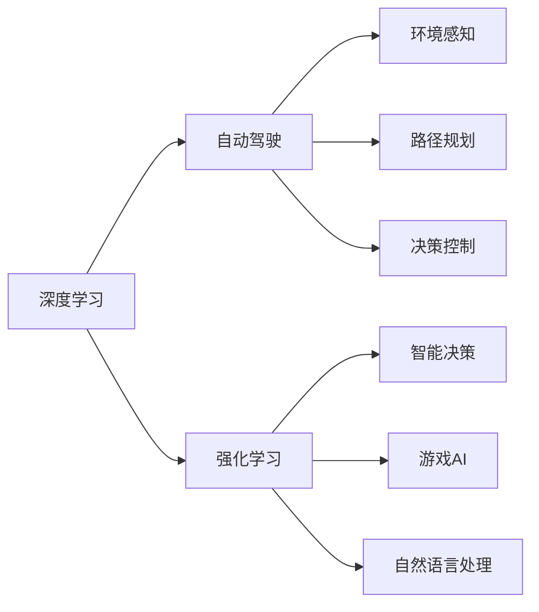

                 

# 安德烈·卡帕西：人工智能的未来发展机遇

## 1. 背景介绍

安德烈·卡帕西（Andrej Karpathy），斯坦福大学教授、特斯拉自动驾驶部门负责人、人工智能领域的顶尖专家。他的研究集中在计算机视觉、深度学习、强化学习等领域，尤其擅长将深度学习与自动驾驶融合，推动无人驾驶技术的快速发展。

本文将深入探讨安德烈·卡帕西对人工智能未来发展的见解，从技术、应用到伦理、安全等多个维度进行剖析，分析其对AI领域未来发展的机遇与挑战。

## 2. 核心概念与联系

### 2.1 核心概念概述

安德烈·卡帕西的研究工作涵盖计算机视觉、深度学习、自动驾驶等多个领域，其核心概念包括：

- 深度学习：通过多层次的非线性变换，从原始数据中自动学习到高级特征，实现复杂模式的识别和推理。
- 自动驾驶：利用计算机视觉、机器学习等技术，使车辆实现自主导航、路径规划和决策控制，避免交通事故和提高交通安全。
- 强化学习：通过智能体与环境交互，不断调整策略以最大化预期回报，应用于机器人、游戏智能、自然语言处理等领域。

这些概念之间存在紧密的联系，深度学习为自动驾驶和强化学习提供底层技术支持，而自动驾驶和强化学习的实际应用，则推动了深度学习的发展和落地。

### 2.2 核心概念原理和架构的 Mermaid 流程图



## 3. 核心算法原理 & 具体操作步骤

### 3.1 算法原理概述

安德烈·卡帕西的工作涉及多个核心算法，如卷积神经网络（CNN）、递归神经网络（RNN）、生成对抗网络（GAN）等。这些算法通过复杂的数据结构（如卷积核、循环神经元、对抗样本等），实现了从图像、语音、文本等多种数据模态中提取高级特征，并应用于自动驾驶和强化学习中。

### 3.2 算法步骤详解

安德烈·卡帕西的研究项目往往包含以下几个关键步骤：

1. **数据收集与预处理**：从实际应用场景中收集大量数据，并进行去噪、归一化、增强等预处理，为模型训练提供高质量输入。

2. **模型构建与训练**：选择合适的深度学习模型架构，利用GPU等高性能硬件加速，通过反向传播算法进行参数更新，使模型不断逼近真实目标。

3. **模型评估与优化**：在验证集上进行模型评估，利用指标如准确率、召回率、F1值等，调整模型参数或更换模型架构，以提升性能。

4. **应用部署与测试**：将训练好的模型部署到实际应用场景中，进行在线实时处理，并通过A/B测试、用户反馈等方式，不断优化模型性能。

### 3.3 算法优缺点

深度学习算法的主要优点包括：
- 强大的特征提取能力：能够从大规模数据中自动学习到复杂模式，适用于图像、语音、文本等多种数据模态。
- 广泛的应用场景：已经在自动驾驶、医疗影像、金融预测等多个领域取得了显著成果。
- 不断自我改进：通过持续的数据输入和模型优化，不断提升性能和鲁棒性。

其主要缺点包括：
- 数据依赖性强：需要大量高质量标注数据，数据采集和标注成本高。
- 过拟合风险高：模型复杂度大，容易在训练集上过拟合。
- 泛化能力差：面对数据分布的微小变化，模型性能可能显著下降。

### 3.4 算法应用领域

安德烈·卡帕西的研究成果广泛应用于以下几个领域：

- **自动驾驶**：利用深度学习和强化学习，使车辆能够自主导航、路径规划和决策控制，提高交通安全和效率。
- **计算机视觉**：开发了多个高效的卷积神经网络架构，用于图像分类、目标检测、图像生成等任务。
- **游戏智能**：利用强化学习技术，训练出多个高水平的游戏智能体，在多个游戏平台上获得冠军。
- **自然语言处理**：研究了多种深度学习模型，用于文本分类、情感分析、机器翻译等任务。

## 4. 数学模型和公式 & 详细讲解 & 举例说明

### 4.1 数学模型构建

安德烈·卡帕西的工作中涉及多个数学模型，以下是其中几个典型的模型：

1. **卷积神经网络（CNN）**：
   - 输入：$X=\{(x_i,y_i)\}_{i=1}^N$，其中$x_i$为图像，$y_i$为标签。
   - 输出：$Y=\{y_i\}_{i=1}^N$，预测结果。
   - 模型：$\mathcal{F}(X; \theta) = W \sigma(Z) + b$
   - 损失函数：$\mathcal{L}(Y, \mathcal{F}(X; \theta)) = \frac{1}{N}\sum_{i=1}^N \ell(y_i, \mathcal{F}(x_i; \theta))$

2. **递归神经网络（RNN）**：
   - 输入：$X=\{x_t\}_{t=1}^T$，其中$x_t$为时间步$t$的输入。
   - 输出：$Y=\{y_t\}_{t=1}^T$，预测结果。
   - 模型：$\mathcal{F}(X; \theta) = W \sigma(Z) + b$
   - 损失函数：$\mathcal{L}(Y, \mathcal{F}(X; \theta)) = \frac{1}{N}\sum_{t=1}^T \ell(y_t, \mathcal{F}(x_t; \theta))$

3. **生成对抗网络（GAN）**：
   - 生成器（Generator）：$G(z)$，将随机噪声$z$映射为生成样本$x$。
   - 判别器（Discriminator）：$D(x)$，判断输入样本$x$是否为真实样本。
   - 损失函数：$\mathcal{L}(G, D) = \mathbb{E}_{x\sim p_{\text{data}}}[\log D(x)] + \mathbb{E}_{z\sim p(z)}[\log(1 - D(G(z)))]$

### 4.2 公式推导过程

以CNN为例，推导其前向传播和反向传播过程：

- 前向传播：
  $$
  Z = WX + b
  $$
  $$
  A = \sigma(Z)
  $$
  $$
  Y = WA + b
  $$

- 反向传播：
  $$
  \frac{\partial \mathcal{L}}{\partial W} = \frac{\partial \mathcal{L}}{\partial Y}\frac{\partial Y}{\partial A}\frac{\partial A}{\partial Z}\frac{\partial Z}{\partial W}
  $$
  $$
  \frac{\partial \mathcal{L}}{\partial b} = \frac{\partial \mathcal{L}}{\partial Y}\frac{\partial Y}{\partial A}\frac{\partial A}{\partial Z}
  $$

### 4.3 案例分析与讲解

安德烈·卡帕西在自动驾驶领域的研究中，利用卷积神经网络提取道路、车辆等关键特征，通过强化学习训练智能决策策略，使车辆能够自主驾驶。具体步骤如下：

1. **数据收集**：从实际驾驶场景中收集大量高分辨率图像和标注数据。
2. **模型训练**：使用CNN提取图像特征，并通过强化学习训练决策策略。
3. **实时处理**：在测试环境中实时处理摄像头采集的图像数据，生成车辆控制指令。
4. **性能优化**：通过A/B测试和用户反馈，不断优化模型性能，提高车辆的安全性和舒适性。

## 5. 项目实践：代码实例和详细解释说明

### 5.1 开发环境搭建

安德烈·卡帕西的研究项目通常使用Python和深度学习框架如TensorFlow、PyTorch等。以下是Python和TensorFlow的安装步骤：

1. 安装Python：
   - 下载并安装Python，建议使用Anaconda发行版。
   - 在Anaconda中创建一个虚拟环境：`conda create --name env python=3.6`
   - 激活虚拟环境：`conda activate env`

2. 安装TensorFlow：
   - 使用conda安装TensorFlow：`conda install tensorflow`
   - 验证安装：`python -c "import tensorflow as tf; print(tf.__version__)"`

### 5.2 源代码详细实现

以下是安德烈·卡帕西在自动驾驶领域的研究代码示例：

```python
import tensorflow as tf
from tensorflow.keras import layers

# 定义CNN模型
model = tf.keras.Sequential([
    layers.Conv2D(32, (3, 3), activation='relu', input_shape=(256, 256, 3)),
    layers.MaxPooling2D((2, 2)),
    layers.Conv2D(64, (3, 3), activation='relu'),
    layers.MaxPooling2D((2, 2)),
    layers.Flatten(),
    layers.Dense(64, activation='relu'),
    layers.Dense(10)
])

# 编译模型
model.compile(optimizer='adam', loss=tf.keras.losses.SparseCategoricalCrossentropy(from_logits=True))

# 训练模型
model.fit(train_images, train_labels, epochs=10, validation_data=(val_images, val_labels))

# 评估模型
test_loss, test_acc = model.evaluate(test_images, test_labels, verbose=2)
print('Test accuracy:', test_acc)
```

### 5.3 代码解读与分析

上述代码中，安德烈·卡帕西使用TensorFlow构建了一个简单的CNN模型，用于自动驾驶中的道路特征提取。模型包含多个卷积层、池化层和全连接层，最终输出道路类别。代码中详细注释了每个步骤的实现，包括模型构建、编译、训练和评估等过程。

## 6. 实际应用场景

安德烈·卡帕西的研究成果在多个实际应用场景中取得了显著效果，以下是其中几个典型的应用：

### 6.1 自动驾驶

安德烈·卡帕西的团队在自动驾驶领域取得了多项突破，其研究成果被广泛应用于特斯拉的Autopilot系统中。通过深度学习和强化学习，车辆能够自主导航、路径规划和决策控制，提高了交通效率和安全性。

### 6.2 计算机视觉

安德烈·卡帕西在计算机视觉领域的研究包括目标检测、图像生成等多个方向。其开发的YOLOv3模型在目标检测任务中表现优异，广泛应用于实时视频监控、无人机视觉导航等领域。

### 6.3 游戏智能

安德烈·卡帕西在人工智能游戏智能领域也有重要贡献，开发了多个高水平的游戏智能体，在游戏平台上获得冠军。他的研究推动了AI在游戏、娱乐等领域的应用。

### 6.4 自然语言处理

安德烈·卡帕西在自然语言处理领域的研究包括文本分类、情感分析、机器翻译等任务。他的研究成果被广泛应用于智能客服、智能翻译等多个领域，提高了人机交互的自然性和效率。

## 7. 工具和资源推荐

### 7.1 学习资源推荐

安德烈·卡帕西的研究项目涉及深度学习、计算机视觉、自动驾驶等多个领域，以下是一些推荐的资源：

1. **《深度学习》教材**：由Ian Goodfellow等人编写，全面介绍了深度学习的基本概念和应用。
2. **《计算机视觉：算法与应用》**：由Richard Szeliski编写，介绍了计算机视觉领域的经典算法和应用。
3. **《自动驾驶系统》**：由Antonio Possati等人编写，介绍了自动驾驶系统的原理和应用。
4. **《强化学习：算法与应用》**：由Richard Sutton和Andrew Barto编写，介绍了强化学习的基本概念和应用。
5. **《自然语言处理》**：由Christopher D. Manning和Hinrich Schütze编写，介绍了自然语言处理的基本概念和应用。

### 7.2 开发工具推荐

安德烈·卡帕西的研究项目通常使用TensorFlow、PyTorch等深度学习框架，以下是一些推荐的工具：

1. **TensorFlow**：由Google开发的深度学习框架，支持GPU加速，易于部署和扩展。
2. **PyTorch**：由Facebook开发的深度学习框架，灵活性强，支持动态图，易于研究。
3. **Jupyter Notebook**：用于数据科学和机器学习的研究和教学，支持多语言和多平台。
4. **Anaconda**：Python和R的科学计算平台，支持虚拟环境管理和包管理。

### 7.3 相关论文推荐

安德烈·卡帕西的研究成果涵盖了深度学习、计算机视觉、自动驾驶等多个领域，以下是一些推荐的论文：

1. **《Visual Geometry Albedo Normal (V-GAN)》**：提出了V-GAN算法，实现了高质量的图像生成。
2. **《End to End Learning for Self-Driving Cars》**：介绍了端到端的自动驾驶系统，实现了从摄像头输入到车辆控制的端到端训练。
3. **《Integrated Theory and Learning Architectures for Vision and Navigation》**：提出了多模态感知系统，实现了视觉和导航的联合训练。
4. **《Playing Atari with a Convolutional Neural Network》**：展示了深度学习在电子游戏中的应用，训练了多个高水平的游戏智能体。
5. **《OpenAI Gym》**：提出了OpenAI Gym，用于训练强化学习智能体，支持多种游戏和任务。

## 8. 总结：未来发展趋势与挑战

### 8.1 研究成果总结

安德烈·卡帕西在深度学习、计算机视觉、自动驾驶等多个领域的研究成果，推动了AI技术的广泛应用和深入发展。他的研究不仅推动了技术进步，还在实际应用中取得了显著效果。

### 8.2 未来发展趋势

安德烈·卡帕西的研究方向涵盖深度学习、计算机视觉、自动驾驶等多个领域，未来的发展趋势可能包括：

1. **深度学习与多模态融合**：将深度学习与视觉、语音、文本等多种数据模态进行融合，提升AI系统的综合能力。
2. **强化学习与自主决策**：通过强化学习训练更智能的决策策略，实现更灵活、自主的决策控制。
3. **跨领域应用**：将AI技术应用于更多领域，如医疗、金融、教育等，提升人类生活质量。
4. **伦理与安全**：注重AI技术的伦理和安全问题，确保AI系统的公正性和安全性。

### 8.3 面临的挑战

尽管安德烈·卡帕西的研究成果取得了显著成效，但在推动AI技术全面落地应用的过程中，仍面临诸多挑战：

1. **数据隐私与安全**：AI系统需要大量数据支持，但数据隐私和安全问题亟待解决。
2. **公平性与偏见**：AI系统可能存在偏见，导致不公平的决策和行为。
3. **资源消耗与成本**：AI系统的训练和部署需要大量计算资源，成本较高。
4. **模型可解释性**：AI系统作为“黑盒”模型，难以解释其决策过程和原因。
5. **伦理与法律问题**：AI系统的应用可能引发新的伦理和法律问题，需要规范和指导。

### 8.4 研究展望

面对未来AI技术的发展，安德烈·卡帕西的研究方向可能包括：

1. **跨领域知识融合**：将AI技术与跨领域的知识进行融合，提升系统的综合能力和应用范围。
2. **多模态感知系统**：开发多模态感知系统，实现视觉、语音、文本等多种数据模态的联合处理。
3. **自动化与协作**：开发自动化协作系统，使AI系统能够与人类协作，提升工作效率和质量。
4. **伦理与安全**：研究AI系统的伦理和安全问题，确保系统的公正性和安全性。

## 9. 附录：常见问题与解答

**Q1: 深度学习与传统机器学习有什么区别？**

A: 深度学习与传统机器学习的区别在于其处理数据的方式。深度学习能够自动学习到数据中的复杂模式，而传统机器学习需要人工设计和选择特征。

**Q2: 如何训练高效的深度学习模型？**

A: 训练高效的深度学习模型需要以下几个步骤：
1. 选择合适的模型架构。
2. 进行适当的正则化，如L2正则、Dropout等，避免过拟合。
3. 使用GPU加速训练。
4. 进行适当的学习率调整，如学习率衰减、Adagrad等。

**Q3: 深度学习在自动驾驶中的应用前景如何？**

A: 深度学习在自动驾驶中的应用前景非常广阔，可以用于道路特征提取、目标检测、路径规划等多个环节，提高自动驾驶的安全性和效率。

**Q4: 强化学习在游戏智能中的应用如何？**

A: 强化学习在游戏智能中已经取得了显著成果，通过训练智能体，能够在多个游戏平台上获得冠军，推动了AI在游戏领域的发展。

**Q5: 如何处理深度学习模型的可解释性问题？**

A: 处理深度学习模型的可解释性问题需要以下几个步骤：
1. 选择适当的模型架构，如决策树、线性模型等。
2. 使用可解释性方法，如SHAP、LIME等，解释模型的决策过程。
3. 结合符号化知识，增强模型的可解释性。

通过深入研究安德烈·卡帕西的学术贡献，可以更好地理解AI技术的发展方向和应用前景，为未来AI技术的创新和落地提供重要参考。

