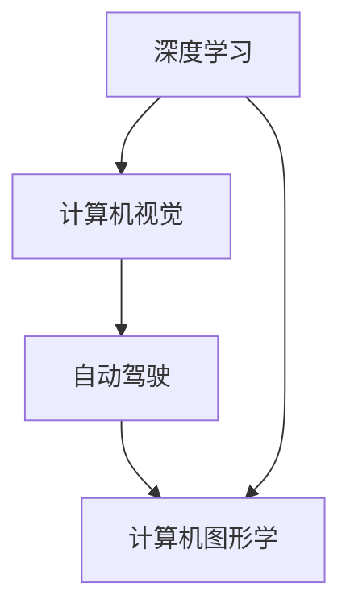

                 

# Andrej Karpathy：人工智能的未来发展目标

> 关键词：人工智能，深度学习，自动驾驶，计算机视觉，计算机图形学

## 1. 背景介绍

Andrej Karpathy，斯坦福大学计算机科学教授，OpenAI研究科学家，人工智能领域杰出的学者和研究者。在深度学习、计算机视觉、自动驾驶等方向有着深入的研究和卓越的贡献。他不仅在学术界有重要的影响力，也在工业界（如Tesla）有着广泛的应用实践，是深度学习技术在实际应用中的重要推动者。本文将基于Andrej Karpathy的一些观点和研究方向，探讨人工智能的未来发展目标。

## 2. 核心概念与联系

### 2.1 核心概念概述

Andrej Karpathy的研究领域主要集中在以下几个方面：

- **深度学习**：通过构建多层次的神经网络模型，进行复杂的特征提取和模式识别。
- **计算机视觉**：利用深度学习模型对图像、视频等视觉数据进行理解、识别和生成。
- **自动驾驶**：结合计算机视觉、控制理论、传感器技术等，实现无人驾驶汽车。
- **计算机图形学**：研究如何通过算法和数学方法，将虚拟世界和现实世界进行融合，实现高质量的视觉表现。

这些概念之间具有紧密的联系，深度学习和计算机视觉技术的发展推动了自动驾驶技术的进步；自动驾驶的发展对计算机视觉提出了更高的要求，计算机图形学的应用也进一步提升了视觉数据的生成和处理能力。

### 2.2 核心概念原理和架构的 Mermaid 流程图



这个流程图展示了Andrej Karpathy研究领域的关键技术之间的关系。深度学习和计算机视觉技术构成了自动驾驶的基础，计算机图形学则为自动驾驶提供了视觉效果的增强。

## 3. 核心算法原理 & 具体操作步骤

### 3.1 算法原理概述

Andrej Karpathy的研究工作围绕以下几个核心算法原理展开：

- **卷积神经网络(Convolutional Neural Networks, CNN)**：应用于图像识别、目标检测等计算机视觉任务。通过卷积操作和池化操作，提取图像的特征。
- **递归神经网络(Recurrent Neural Networks, RNN)**：适用于序列数据的处理，如语音识别、机器翻译、时间序列预测等。
- **对抗生成网络(Generative Adversarial Networks, GAN)**：生成高质量的图像、视频等视觉数据，解决数据不足的问题。
- **强化学习(Reinforcement Learning)**：通过与环境的互动，使模型能够进行决策和学习，如自动驾驶中的路径规划和控制。

这些算法原理构成了Andrej Karpathy研究的基础，通过这些算法，可以解决一系列的计算机视觉和自动驾驶问题。

### 3.2 算法步骤详解

以下是深度学习在计算机视觉和自动驾驶中的应用步骤：

1. **数据预处理**：将原始数据转化为网络可以处理的格式，如对图像进行归一化、截断等。
2. **模型训练**：使用标注数据集训练深度学习模型，调整模型参数，使其能够对新数据进行准确的预测。
3. **模型评估**：通过测试集对训练好的模型进行评估，衡量其性能。
4. **模型部署**：将训练好的模型应用到实际场景中，进行预测和决策。
5. **反馈优化**：根据实际应用中的表现，调整模型参数，进一步提升其性能。

### 3.3 算法优缺点

深度学习在计算机视觉和自动驾驶中具有以下优点：

- **高精度**：通过多层次的特征提取和模式识别，能够准确地识别和分类图像和视频。
- **泛化能力强**：经过大规模数据训练的模型，能够适应不同场景和数据分布。
- **端到端学习**：从原始数据到输出结果，模型能够进行端到端的训练和推理。

然而，深度学习也存在一些缺点：

- **计算量大**：深度学习模型参数量庞大，训练和推理需要大量的计算资源。
- **模型复杂**：结构复杂，难以解释和调试。
- **数据依赖**：需要大量标注数据进行训练，数据质量直接影响模型性能。

### 3.4 算法应用领域

Andrej Karpathy的研究领域涵盖了以下几个方面：

- **计算机视觉**：如图像分类、目标检测、语义分割、姿态估计等。
- **自动驾驶**：如自动驾驶汽车、无人驾驶无人机等。
- **计算机图形学**：如3D模型渲染、图像生成、视频合成等。
- **机器人学**：如运动规划、环境感知、决策与控制等。

这些领域的应用场景涵盖了从基础科学到实际生活，深度学习技术在这些领域都取得了显著的成果。

## 4. 数学模型和公式 & 详细讲解 & 举例说明

### 4.1 数学模型构建

以下是Andrej Karpathy在计算机视觉领域的研究模型：

- **VGG模型**：使用多层次卷积池化层，提取图像的高级特征。
- **ResNet模型**：使用残差连接，解决深层网络退化问题，实现更高的深度。
- **YOLO模型**：使用单阶段检测，将目标检测和分类结合，提高检测速度和准确率。

### 4.2 公式推导过程

以VGG模型为例，其核心公式为：

$$
H(x) = \text{Conv}(W_1, \text{ReLU}(H(x-1))) + \text{Conv}(W_2, \text{ReLU}(H(x-1))) + \cdots
$$

其中，$H(x)$表示输入$x$经过$n$个卷积层后的输出，$\text{Conv}(W_i, \text{ReLU}(H(x-1)))$表示第$i$层的卷积操作，$W_i$表示第$i$层的卷积核。

### 4.3 案例分析与讲解

以YOLO模型为例，其通过以下步骤实现目标检测：

1. 将输入图像通过多个卷积层进行特征提取。
2. 在最后一层的特征图上，使用多个检测框进行预测。
3. 对于每个检测框，计算其置信度和类别概率。
4. 通过非极大值抑制(NMS)，去除冗余的检测框。
5. 输出最终的检测结果。

## 5. 项目实践：代码实例和详细解释说明

### 5.1 开发环境搭建

开发深度学习模型需要以下工具：

1. **Python**：用于编写代码。
2. **PyTorch**：深度学习框架，提供丰富的模型和工具。
3. **OpenCV**：计算机视觉库，用于图像处理和分析。
4. **TensorFlow**：深度学习框架，支持多种硬件平台。
5. **NVIDIA GPU**：用于加速计算。

### 5.2 源代码详细实现

以YOLO模型为例，以下是对其源代码的详细实现：

```python
import torch
import torch.nn as nn
import torch.optim as optim
import torchvision.transforms as transforms
from torchvision.models import resnet
from torchvision.datasets import ImageFolder

# 定义YOLO模型
class YOLO(nn.Module):
    def __init__(self):
        super(YOLO, self).__init__()
        self.conv1 = nn.Conv2d(3, 64, kernel_size=3, stride=1, padding=1)
        self.conv2 = nn.Conv2d(64, 128, kernel_size=3, stride=1, padding=1)
        self.conv3 = nn.Conv2d(128, 256, kernel_size=3, stride=1, padding=1)
        self.pool = nn.MaxPool2d(kernel_size=2, stride=2)

    def forward(self, x):
        x = self.conv1(x)
        x = self.pool(x)
        x = self.conv2(x)
        x = self.pool(x)
        x = self.conv3(x)
        return x

# 定义数据预处理
transform = transforms.Compose([
    transforms.Resize((224, 224)),
    transforms.ToTensor(),
    transforms.Normalize(mean=[0.485, 0.456, 0.406], std=[0.229, 0.224, 0.225])
])

# 加载数据集
train_dataset = ImageFolder(root='data/train', transform=transform)
train_loader = DataLoader(train_dataset, batch_size=32, shuffle=True)

# 训练模型
model = YOLO()
criterion = nn.CrossEntropyLoss()
optimizer = optim.SGD(model.parameters(), lr=0.001, momentum=0.9)

for epoch in range(10):
    for i, (images, labels) in enumerate(train_loader):
        optimizer.zero_grad()
        outputs = model(images)
        loss = criterion(outputs, labels)
        loss.backward()
        optimizer.step()
```

### 5.3 代码解读与分析

代码中的关键部分包括：

- `YOLO`模型的定义，包含三个卷积层和一个池化层。
- `transform`数据预处理，包括图像归一化、缩放和转换为Tensor。
- `ImageFolder`数据集加载，用于训练集和验证集的加载。
- `SGD`优化器定义，用于模型参数的更新。

## 6. 实际应用场景

### 6.1 智能驾驶系统

Andrej Karpathy在自动驾驶领域的研究成果得到了广泛应用。例如，Tesla的Autopilot系统就采用了深度学习技术，通过计算机视觉和强化学习实现自动驾驶。该系统能够进行车道保持、自动变道、自动停车等任务，大大提升了驾驶安全性。

### 6.2 医疗影像分析

深度学习在医疗影像分析中也得到了广泛应用。例如，利用卷积神经网络对医学图像进行分析和分类，辅助医生进行疾病诊断。Andrej Karpathy的研究工作还包括对医学图像中的器官位置进行标注，为自动化的医学影像分析提供了数据支持。

### 6.3 机器人控制

深度学习技术在机器人控制中也得到了应用，例如通过计算机视觉实现机器人的目标检测和路径规划。Andrej Karpathy的研究成果还包括了机器人控制系统的优化，使得机器人能够更加高效地执行复杂任务。

### 6.4 未来应用展望

Andrej Karpathy的未来研究方向包括：

- **联邦学习**：在分布式环境中进行深度学习模型的训练，解决数据隐私和安全问题。
- **自监督学习**：利用未标注数据进行模型训练，减少标注数据的依赖。
- **模型压缩和加速**：通过模型压缩和加速技术，提升模型的计算效率和推理速度。
- **多模态学习**：结合视觉、听觉、触觉等多模态数据，提升模型的感知能力。

## 7. 工具和资源推荐

### 7.1 学习资源推荐

- **深度学习**：《深度学习》（Ian Goodfellow著），全面介绍了深度学习的基本概念和算法。
- **计算机视觉**：《计算机视觉：算法与应用》（Richard Szeliski著），介绍了计算机视觉的算法和应用。
- **自动驾驶**：《自动驾驶：理论与实践》（Andrej Karpathy著），介绍了自动驾驶的基本原理和实践方法。
- **计算机图形学**：《计算机图形学：原理与实践》（Shreefal Patel等著），介绍了计算机图形学的基本概念和算法。

### 7.2 开发工具推荐

- **PyTorch**：深度学习框架，支持动态图和静态图。
- **TensorFlow**：深度学习框架，支持分布式计算。
- **OpenCV**：计算机视觉库，支持图像处理和分析。
- **MATLAB**：支持深度学习和计算机视觉算法的实现。

### 7.3 相关论文推荐

- **《Learning to Drive》**：Andrej Karpathy等著，介绍了自动驾驶技术的应用和挑战。
- **《Single Image Haze Removal Using a Multi-Scale Convolutional Neural Network》**：Andrej Karpathy等著，介绍了深度学习在图像去雾中的应用。
- **《Training Recurrent Neural Networks to Drive Vehicles》**：Andrej Karpathy等著，介绍了深度学习在自动驾驶中的应用。

## 8. 总结：未来发展趋势与挑战

### 8.1 研究成果总结

Andrej Karpathy的研究成果涵盖了深度学习在计算机视觉和自动驾驶领域的应用，推动了这些技术的发展和实际应用。他的研究不仅具有学术价值，还具有广泛的应用前景。

### 8.2 未来发展趋势

未来深度学习技术的发展方向包括：

- **联邦学习**：在分布式环境中进行深度学习模型的训练，解决数据隐私和安全问题。
- **自监督学习**：利用未标注数据进行模型训练，减少标注数据的依赖。
- **模型压缩和加速**：通过模型压缩和加速技术，提升模型的计算效率和推理速度。
- **多模态学习**：结合视觉、听觉、触觉等多模态数据，提升模型的感知能力。

### 8.3 面临的挑战

深度学习技术在实际应用中面临以下挑战：

- **数据隐私和安全**：深度学习模型需要大量数据进行训练，数据隐私和安全问题亟待解决。
- **计算资源**：深度学习模型参数量庞大，训练和推理需要大量的计算资源。
- **模型解释性**：深度学习模型结构复杂，难以解释和调试。

### 8.4 研究展望

未来深度学习技术的研究方向包括：

- **可解释性**：开发更可解释的深度学习模型，提高模型的透明度和可信度。
- **联邦学习**：研究如何在分布式环境中进行深度学习模型的训练，解决数据隐私和安全问题。
- **自监督学习**：利用未标注数据进行模型训练，减少标注数据的依赖。
- **多模态学习**：结合视觉、听觉、触觉等多模态数据，提升模型的感知能力。

## 9. 附录：常见问题与解答

**Q1：深度学习在自动驾驶中有什么优势？**

A: 深度学习在自动驾驶中具有以下优势：

- **高精度**：通过多层次的特征提取和模式识别，能够准确地识别和分类图像和视频。
- **泛化能力强**：经过大规模数据训练的模型，能够适应不同场景和数据分布。
- **端到端学习**：从原始数据到输出结果，模型能够进行端到端的训练和推理。

**Q2：深度学习在医疗影像分析中有什么应用？**

A: 深度学习在医疗影像分析中有以下应用：

- **图像分类**：对医学影像进行分类，辅助医生进行疾病诊断。
- **目标检测**：对医学影像中的器官位置进行标注，为自动化的医学影像分析提供数据支持。
- **图像去雾**：对医学影像进行去雾处理，提高图像清晰度。

**Q3：Andrej Karpathy的研究成果对未来有哪些影响？**

A: Andrej Karpathy的研究成果对未来有以下影响：

- **推动深度学习技术的发展**：他的研究成果推动了深度学习技术在计算机视觉和自动驾驶等领域的实际应用。
- **促进计算机视觉和自动驾驶技术的发展**：他的研究成果为计算机视觉和自动驾驶技术的进步提供了理论和实践支持。
- **推动计算机图形学的发展**：他的研究成果为计算机图形学的进步提供了新的思路和方法。

---

作者：禅与计算机程序设计艺术 / Zen and the Art of Computer Programming

