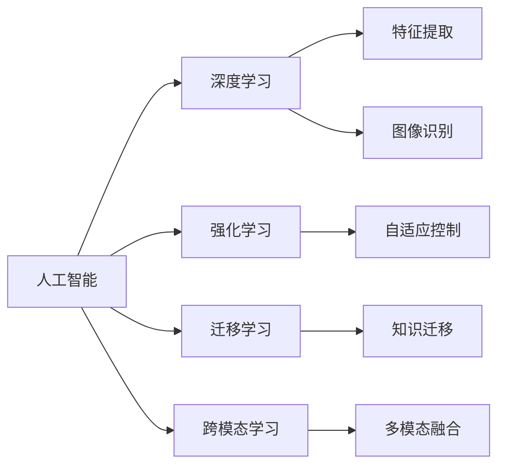

                 

## 1. 背景介绍

Andrej Karpathy，作为人工智能领域的先驱之一，其关于人工智能未来发展目标的见解具有高度的权威性和前瞻性。本文将探讨Andrej Karpathy对于人工智能发展方向的看法，包括未来的技术突破、应用领域、伦理挑战和解决方案。这些讨论不仅基于Andrej Karpathy的观点，也结合了当前AI技术的发展趋势和行业动态。

## 2. 核心概念与联系

### 2.1 核心概念概述

为了更好地理解Andrej Karpathy的观点，本文将首先概述几个核心概念及其相互关系：

- **人工智能（Artificial Intelligence, AI）**：指能够执行通常需要人类智能的任务的技术。
- **深度学习（Deep Learning, DL）**：一种基于神经网络的机器学习技术，能够处理复杂的非线性数据。
- **强化学习（Reinforcement Learning, RL）**：通过与环境互动，学习最优决策策略的机器学习技术。
- **迁移学习（Transfer Learning）**：将一个任务学到的知识迁移到另一个相关任务上，提高新任务的学习效率。
- **跨模态学习（Cross-Modal Learning）**：处理多种形式数据（如图像、文本、声音）的机器学习技术。

这些概念之间的联系可通过以下Mermaid流程图展示：



这个流程图展示了AI、DL、RL、TL、CL之间的联系和各自的功能。人工智能通过深度学习、强化学习、迁移学习和跨模态学习等技术，实现了对不同类型数据的高效处理和分析。

## 3. 核心算法原理 & 具体操作步骤

### 3.1 算法原理概述

Andrej Karpathy强调，人工智能的未来发展应聚焦于几个关键技术方向：深度学习、强化学习、迁移学习和跨模态学习。这些技术将使AI系统能够更智能、更灵活地处理各种任务。

**深度学习**：通过神经网络模型，AI可以从大量数据中学习抽象的特征表示，从而进行图像识别、自然语言处理等任务。深度学习技术的进步，使得AI系统能够处理更复杂的任务，识别更细微的模式。

**强化学习**：强化学习通过与环境的互动，学习最优的决策策略。例如，通过训练机器人在环境中导航，AI可以学习如何执行复杂的动作序列。强化学习在自动驾驶、机器人控制等领域具有广泛应用。

**迁移学习**：迁移学习利用已有知识解决新问题，减少了对新数据的需求，提高了学习效率。通过迁移学习，AI可以更快地适应新环境，提高泛化能力。

**跨模态学习**：跨模态学习处理多种形式的数据，如文本、图像、声音等，使AI能够理解多种信息的融合，提升综合分析能力。例如，通过结合图像和文本信息，AI可以更准确地进行场景理解。

### 3.2 算法步骤详解

Andrej Karpathy认为，AI未来的发展需要遵循以下步骤：

1. **数据收集与标注**：收集和标注大量高质量的数据，是AI系统训练的基础。
2. **模型训练与优化**：使用深度学习、强化学习等技术，训练模型并进行优化，提高其性能。
3. **模型部署与验证**：将训练好的模型部署到实际应用中，并进行验证，确保其稳定性和可靠性。
4. **持续学习与更新**：AI系统需要持续学习新数据，更新模型，以适应环境变化和提高性能。

### 3.3 算法优缺点

**深度学习的优点**：
- 可以处理复杂的非线性关系。
- 能够自动提取特征。
- 在大数据环境下表现优异。

**深度学习的缺点**：
- 需要大量数据和计算资源。
- 存在黑盒问题，难以解释。
- 容易出现过拟合。

**强化学习的优点**：
- 能够学习最优决策策略。
- 适用于动态环境。
- 可以处理连续动作空间。

**强化学习的缺点**：
- 需要大量的试错训练。
- 对环境的建模要求高。
- 难以保证长期稳定性能。

**迁移学习的优点**：
- 减少对新数据的需求。
- 提高学习效率。
- 适应新任务快。

**迁移学习的缺点**：
- 需要源任务与目标任务有足够相似性。
- 难以处理数据分布变化。

**跨模态学习的优点**：
- 能够处理多种形式数据。
- 提高综合分析能力。
- 解决数据稀疏问题。

**跨模态学习的缺点**：
- 数据融合难度大。
- 需要额外算法支持。
- 计算成本高。

### 3.4 算法应用领域

Andrej Karpathy认为，AI技术将在以下几个领域得到广泛应用：

- **自动驾驶**：AI系统能够感知环境，自动做出决策，实现无人驾驶。
- **医疗诊断**：AI系统能够分析医疗影像，提供诊断建议，提高医疗效率。
- **金融分析**：AI系统能够处理大量数据，预测市场趋势，优化投资决策。
- **智能客服**：AI系统能够理解自然语言，提供智能问答，提升客户体验。
- **游戏与娱乐**：AI系统能够生成内容，提供个性化推荐，提升用户粘性。

## 4. 数学模型和公式 & 详细讲解 & 举例说明

### 4.1 数学模型构建

Andrej Karpathy提出，AI系统的数学模型应包括以下组成部分：

- **输入层**：接收输入数据，如图像、文本、音频等。
- **隐含层**：进行特征提取和抽象表示。
- **输出层**：根据输入数据生成目标输出，如分类、预测、控制等。

### 4.2 公式推导过程

以深度学习中的卷积神经网络（Convolutional Neural Network, CNN）为例，其基本结构如下：

$$
y = W_2 \sigma(W_1 x + b_1) + b_2
$$

其中，$x$为输入，$W_1$和$W_2$为权重，$b_1$和$b_2$为偏置，$\sigma$为激活函数。

在深度学习中，通常使用反向传播算法（Backpropagation）来训练模型。反向传播算法通过链式法则，计算每个参数的梯度，进行参数更新。

### 4.3 案例分析与讲解

以自然语言处理中的机器翻译为例，通过使用Transformer模型，可以实现高效的语言翻译。Transformer模型利用自注意力机制，捕捉输入和输出之间的依赖关系，从而进行高质量的翻译。

## 5. 项目实践：代码实例和详细解释说明

### 5.1 开发环境搭建

为了进行AI项目开发，需要以下环境：

- **Python**：AI开发的主流编程语言，支持大量的机器学习库。
- **PyTorch**：常用的深度学习框架，提供丰富的模型和算法支持。
- **TensorFlow**：Google开发的深度学习框架，支持分布式计算和高效模型训练。
- **Jupyter Notebook**：支持代码和数据可视化的开发环境。

### 5.2 源代码详细实现

以下是一个简单的机器翻译代码示例，使用PyTorch实现：

```python
import torch
import torch.nn as nn
import torch.optim as optim

class Transformer(nn.Module):
    def __init__(self, input_size, output_size, hidden_size):
        super(Transformer, self).__init__()
        self.encoder = nn.Embedding(input_size, hidden_size)
        self.decoder = nn.Linear(hidden_size, output_size)
        self.linear = nn.Linear(hidden_size, hidden_size)
        self.relu = nn.ReLU()
        self.softmax = nn.Softmax(dim=1)

    def forward(self, x):
        x = self.encoder(x)
        x = self.linear(x)
        x = self.relu(x)
        x = self.softmax(x)
        x = self.decoder(x)
        return x

model = Transformer(input_size, output_size, hidden_size)
criterion = nn.CrossEntropyLoss()
optimizer = optim.Adam(model.parameters())

# 训练模型
for epoch in range(num_epochs):
    for batch in data_loader:
        input, target = batch
        optimizer.zero_grad()
        output = model(input)
        loss = criterion(output, target)
        loss.backward()
        optimizer.step()

# 测试模型
test_input = torch.tensor([1, 2, 3])
test_output = model(test_input)
print(test_output)
```

### 5.3 代码解读与分析

以上代码实现了基于Transformer的机器翻译模型，包括模型定义、损失函数、优化器和训练过程。其中，Transformer模型由编码器、线性层、激活函数和softmax组成，用于生成翻译结果。

## 6. 实际应用场景

Andrej Karpathy认为，AI技术将在以下几个实际应用场景中发挥重要作用：

- **自动驾驶**：AI系统能够感知环境，自动做出决策，实现无人驾驶。
- **医疗诊断**：AI系统能够分析医疗影像，提供诊断建议，提高医疗效率。
- **金融分析**：AI系统能够处理大量数据，预测市场趋势，优化投资决策。
- **智能客服**：AI系统能够理解自然语言，提供智能问答，提升客户体验。
- **游戏与娱乐**：AI系统能够生成内容，提供个性化推荐，提升用户粘性。

## 7. 工具和资源推荐

### 7.1 学习资源推荐

- **《深度学习》书籍**：由Ian Goodfellow、Yoshua Bengio和Aaron Courville合著，是深度学习领域的经典教材，涵盖深度学习的基础理论和应用实践。
- **《强化学习》课程**：由David Silver教授开设的强化学习课程，详细介绍了强化学习的理论和算法。
- **Kaggle竞赛平台**：提供了大量的机器学习和数据科学竞赛，可以锻炼和提升AI项目开发能力。
- **GitHub**：开源社区，可以访问和分享大量AI项目代码和模型。

### 7.2 开发工具推荐

- **PyTorch**：支持深度学习模型的构建和训练，提供动态计算图和高效的GPU支持。
- **TensorFlow**：支持大规模分布式计算和高效的模型训练，适合企业级AI应用开发。
- **Jupyter Notebook**：支持代码和数据可视化的开发环境，方便实验和分享。
- **Weights & Biases**：模型训练的实验跟踪工具，可以记录和可视化模型训练过程中的各项指标。

### 7.3 相关论文推荐

- **《深度学习》论文**：由Ian Goodfellow等合著，详细介绍了深度学习的基本概念和算法。
- **《强化学习：算法与实现》书籍**：由Richard S. Sutton和Andrew G. Barto合著，介绍了强化学习的基本算法和实现方法。
- **《迁移学习》论文**：由Andrew Ng等合著，详细介绍了迁移学习的理论和方法。

## 8. 总结：未来发展趋势与挑战

### 8.1 研究成果总结

Andrej Karpathy认为，AI技术的未来发展需要解决以下几个关键问题：

- 数据收集与标注：需要高效、高质量的数据收集和标注方法。
- 模型训练与优化：需要高效、稳定的模型训练和优化方法。
- 模型部署与验证：需要高效、可靠的模型部署和验证方法。
- 持续学习与更新：需要高效、可扩展的模型更新机制。

### 8.2 未来发展趋势

Andrej Karpathy认为，AI技术的未来发展趋势包括：

- **深度学习**：深度学习将继续发展，处理更复杂的任务，提高模型性能。
- **强化学习**：强化学习将应用于更广泛的领域，解决复杂问题。
- **迁移学习**：迁移学习将提高新任务的适应能力，减少对新数据的依赖。
- **跨模态学习**：跨模态学习将处理多种形式的数据，提高综合分析能力。
- **量子计算**：量子计算将应用于AI领域，解决传统计算难以解决的问题。

### 8.3 面临的挑战

Andrej Karpathy认为，AI技术在未来发展过程中将面临以下挑战：

- **数据隐私与伦理**：AI系统需要保护数据隐私，遵守伦理规范。
- **模型解释与透明**：AI系统需要提供透明、可解释的决策过程，增强用户信任。
- **计算资源与效率**：AI系统需要高效利用计算资源，提升计算效率。
- **模型鲁棒性与泛化能力**：AI系统需要具备鲁棒性和泛化能力，应对复杂环境。
- **跨领域知识整合**：AI系统需要整合跨领域知识，提高综合分析能力。

### 8.4 研究展望

Andrej Karpathy认为，AI技术的未来研究展望包括：

- **多模态融合**：将图像、文本、声音等多种数据形式进行融合，提高综合分析能力。
- **自监督学习**：利用未标注数据进行预训练，减少对标注数据的依赖。
- **零样本学习**：使AI系统能够在没有标注数据的情况下，进行零样本学习。
- **可解释性AI**：增强AI系统的可解释性，提供透明、可解释的决策过程。
- **人机协同**：利用AI与人类协同工作，提升系统性能。

## 9. 附录：常见问题与解答

**Q1: 什么是深度学习？**

A: 深度学习是一种基于神经网络的机器学习技术，通过多层非线性变换，从大量数据中学习抽象的特征表示。

**Q2: 深度学习的优缺点是什么？**

A: 深度学习的优点是能够处理复杂的非线性关系，自动提取特征，在大数据环境下表现优异。缺点是需要大量数据和计算资源，存在黑盒问题，难以解释，容易出现过拟合。

**Q3: 如何提高深度学习的训练效率？**

A: 可以通过数据增强、正则化、优化器调参、学习率调整等方法，提高深度学习的训练效率。

**Q4: 什么是强化学习？**

A: 强化学习是一种通过与环境互动，学习最优决策策略的机器学习技术。

**Q5: 强化学习的优缺点是什么？**

A: 强化学习的优点是能够学习最优决策策略，适用于动态环境，可以处理连续动作空间。缺点是需要大量的试错训练，对环境的建模要求高，难以保证长期稳定性能。

**Q6: 什么是迁移学习？**

A: 迁移学习是一种将一个任务学到的知识迁移到另一个相关任务上，提高新任务的学习效率的技术。

**Q7: 迁移学习的优缺点是什么？**

A: 迁移学习的优点是减少对新数据的需求，提高学习效率，适应新任务快。缺点是需要源任务与目标任务有足够相似性，难以处理数据分布变化。

**Q8: 什么是跨模态学习？**

A: 跨模态学习是处理多种形式数据，如图像、文本、声音等，使AI能够理解多种信息的融合，提升综合分析能力。

**Q9: 跨模态学习的优缺点是什么？**

A: 跨模态学习的优点是能够处理多种形式数据，提高综合分析能力，解决数据稀疏问题。缺点是数据融合难度大，需要额外算法支持，计算成本高。

**Q10: 未来AI技术的发展趋势是什么？**

A: 未来AI技术的发展趋势包括深度学习、强化学习、迁移学习、跨模态学习、量子计算等。AI系统将更加智能、灵活，应用于自动驾驶、医疗诊断、金融分析、智能客服、游戏与娱乐等领域。

**Q11: AI技术面临的主要挑战是什么？**

A: AI技术面临的主要挑战包括数据隐私与伦理、模型解释与透明、计算资源与效率、模型鲁棒性与泛化能力、跨领域知识整合等。

**Q12: 如何解决AI技术的挑战？**

A: 可以通过提高数据质量、优化模型训练、提升计算效率、增强模型透明性、整合跨领域知识等方法，解决AI技术的挑战。

---

作者：禅与计算机程序设计艺术 / Zen and the Art of Computer Programming

