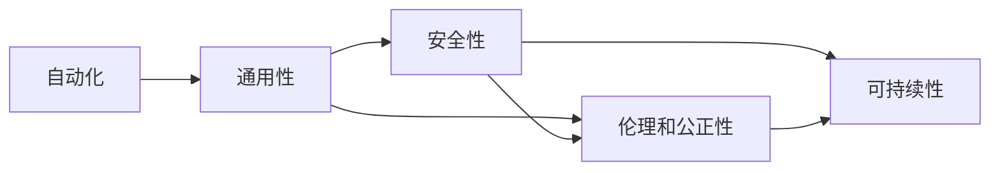

                 

## 1. 背景介绍

### 1.1 问题由来
Andrej Karpathy，斯坦福大学教授、特斯拉Autopilot项目前负责人，同时也是OpenAI的VP和首席AI科学家。他长期从事计算机视觉和深度学习的研究，特别是在自动驾驶、自然语言处理、人工智能伦理等方面，具有深远的影响。其对人工智能未来的展望，也极具前瞻性和洞察力。

人工智能（AI）作为21世纪最前沿的技术之一，正在深刻地改变着世界的方方面面。从自动驾驶、智能制造、智慧城市到医疗健康，人工智能无处不在。Andrej Karpathy通过对AI技术的深度研究和前瞻性思考，提出了未来AI发展的几个关键方向和目标，为未来的AI研究和发展指明了方向。

### 1.2 问题核心关键点
Andrej Karpathy认为，未来人工智能的发展应当关注以下几个关键点：

- **自动化**：实现更高级别的自动化，让机器能够更好地理解、处理和预测复杂的人类行为。
- **通用性**：构建具有广泛应用能力的通用智能，不仅限于特定领域或任务。
- **安全性**：确保AI系统的决策透明、可解释，避免道德风险。
- **伦理和公正性**：构建公平、公正的AI系统，避免偏见和歧视。
- **可持续性**：AI系统需要能够适应不断变化的环境，具备自我学习和自我修复的能力。

这些关键点不仅反映了他对AI未来发展的思考，也为我们指明了努力的方向。

## 2. 核心概念与联系

### 2.1 核心概念概述

Andrej Karpathy的AI未来发展目标涉及多个关键概念，这些概念之间存在着紧密的联系：

- **自动化**：通过学习和推理，使机器能够自主执行复杂任务，如自动驾驶、智能客服、机器人操作等。
- **通用性**：AI系统能够应用于多个领域，具备跨领域的通用性，如通用智能（AGI）。
- **安全性**：AI系统的决策过程透明可解释，避免意外风险和道德困境。
- **伦理和公正性**：AI系统公平公正，避免对特定群体或个人造成偏见或伤害。
- **可持续性**：AI系统能够适应环境变化，自我学习和自我修复，具备长远的可持续性。

这些概念共同构成了Andrej Karpathy对未来AI发展的愿景，其核心在于构建一个能够自我演化、自我修复、公平公正、透明可解释的智能系统。

### 2.2 核心概念原理和架构的 Mermaid 流程图



这个流程图展示了Andrej Karpathy对未来AI发展的五个关键概念及其联系。自动化是基础，通用性是目标，而安全性和伦理公正性是保证，可持续性则是终极追求。

## 3. 核心算法原理 & 具体操作步骤

### 3.1 算法原理概述

Andrej Karpathy认为，实现未来AI发展的关键在于以下几个算法和理论基础：

- **强化学习（Reinforcement Learning, RL）**：通过奖励机制和反馈循环，让机器能够自主学习和优化决策策略，适用于自动化和复杂任务。
- **迁移学习（Transfer Learning）**：利用预训练模型和已有知识，加速新任务的模型训练，提高模型泛化能力。
- **生成对抗网络（Generative Adversarial Networks, GAN）**：通过对抗训练，提高生成模型的质量，适用于图像、视频等多模态数据处理。
- **知识图谱（Knowledge Graph）**：构建结构化的知识库，帮助AI系统理解和推理复杂的实体关系，适用于通用性和跨领域应用。
- **自监督学习（Self-supervised Learning）**：利用未标注的数据进行自我监督学习，提高模型的泛化能力和鲁棒性。

这些算法和理论构成了实现未来AI目标的重要基础。

### 3.2 算法步骤详解

#### 3.2.1 自动化

自动化是AI未来的关键目标之一。Andrej Karpathy认为，实现自动化需要以下几个步骤：

1. **数据收集和预处理**：收集大量的训练数据，并进行清洗和标注。
2. **模型训练**：使用深度学习模型，如神经网络、卷积神经网络（CNN）等，进行模型训练。
3. **评估和优化**：使用评估指标，如准确率、召回率、F1值等，评估模型性能，并根据反馈进行优化。
4. **部署和应用**：将训练好的模型部署到实际应用场景中，进行自动化任务处理。

#### 3.2.2 通用性

构建具有通用能力的AI系统，是未来AI发展的另一个重要目标。通用性要求AI系统具备跨领域、跨任务的能力，能够适应各种复杂环境。Andrej Karpathy认为，实现通用性需要以下几个步骤：

1. **多领域数据收集**：收集多领域的数据，并进行标注和处理。
2. **预训练模型**：使用大规模语料进行预训练，学习通用语言表示。
3. **微调**：根据具体任务，对预训练模型进行微调，使其适应特定任务。
4. **融合知识图谱**：构建结构化的知识库，将知识与模型进行融合，增强模型的推理能力。
5. **跨领域迁移**：利用迁移学习，加速新领域的模型训练，提高模型的泛化能力。

#### 3.2.3 安全性

确保AI系统的决策透明、可解释，避免意外风险和道德困境，是未来AI发展的重要保障。Andrej Karpathy认为，实现安全性需要以下几个步骤：

1. **可解释性**：开发可解释的AI模型，能够提供决策依据，避免"黑盒"问题。
2. **透明性**：构建透明的AI决策流程，确保决策过程可追溯。
3. **道德审查**：建立AI伦理审查机制，确保AI系统符合道德规范。
4. **鲁棒性**：提高模型的鲁棒性，避免对抗攻击和数据污染。

#### 3.2.4 伦理和公正性

构建公平、公正的AI系统，避免对特定群体或个人造成偏见或伤害，是未来AI发展的核心目标。Andrej Karpathy认为，实现伦理和公正性需要以下几个步骤：

1. **数据公平性**：确保训练数据具有代表性，避免数据偏见。
2. **模型公平性**：开发公平性算法，避免模型在决策过程中的偏见。
3. **透明度**：确保AI系统的决策过程透明，可审计。
4. **隐私保护**：保护用户隐私，避免数据泄露和滥用。

#### 3.2.5 可持续性

AI系统的可持续性要求其能够适应不断变化的环境，具备自我学习和自我修复的能力。Andrej Karpathy认为，实现可持续性需要以下几个步骤：

1. **动态更新**：根据环境变化，动态更新模型参数，保持模型性能。
2. **自我学习**：构建具有自我学习能力的AI系统，能够不断适应新的任务和环境。
3. **自我修复**：开发自我修复机制，能够检测和修复模型缺陷。
4. **资源优化**：优化模型计算资源，提高计算效率和性能。

### 3.3 算法优缺点

#### 3.3.1 自动化

**优点**：
1. 能够自主处理复杂任务，提高工作效率。
2. 适用于大规模自动化场景，如工业制造、自动驾驶等。

**缺点**：
1. 需要大量训练数据和计算资源，开发成本较高。
2. 模型决策过程不透明，难以解释。

#### 3.3.2 通用性

**优点**：
1. 能够应用于多个领域，提高AI系统的通用性。
2. 能够更好地适应环境变化，提高系统的鲁棒性。

**缺点**：
1. 需要处理多领域、多任务的数据，数据收集和处理成本高。
2. 模型的泛化能力有限，可能无法处理复杂任务。

#### 3.3.3 安全性

**优点**：
1. 决策过程透明，可解释性强。
2. 避免意外风险和道德困境，提高系统可靠性。

**缺点**：
1. 开发和维护成本高。
2. 复杂任务处理能力有限。

#### 3.3.4 伦理和公正性

**优点**：
1. 公平公正，避免对特定群体造成偏见或伤害。
2. 透明可审计，确保系统符合道德规范。

**缺点**：
1. 数据公平性难以保证，可能存在数据偏见。
2. 模型公平性算法复杂，难以实现。

#### 3.3.5 可持续性

**优点**：
1. 适应环境变化，具备自我学习能力和自我修复能力。
2. 资源优化，提高计算效率。

**缺点**：
1. 技术难度高，实现复杂。
2. 动态更新和自我修复机制需要不断优化。

### 3.4 算法应用领域

Andrej Karpathy认为，未来AI的发展将应用于以下几个主要领域：

1. **自动驾驶**：AI系统能够自动驾驶汽车，提高道路安全和交通效率。
2. **智能制造**：AI系统能够优化生产流程，提高生产效率和产品质量。
3. **智慧城市**：AI系统能够优化城市管理，提高城市运行效率和生活质量。
4. **医疗健康**：AI系统能够辅助诊断、药物研发等，提升医疗服务质量。
5. **金融科技**：AI系统能够进行风险评估、智能投顾等，提高金融服务效率和精准度。
6. **教育科技**：AI系统能够提供个性化教育、自动批改等，提高教育质量。
7. **娱乐传媒**：AI系统能够进行内容推荐、自动生成等，提升用户体验。

## 4. 数学模型和公式 & 详细讲解 & 举例说明

### 4.1 数学模型构建

Andrej Karpathy在《深度学习》一书中详细介绍了深度学习模型的构建过程，包括前向传播、后向传播和反向传播等。以下是深度学习模型的数学模型构建过程：

设模型输入为 $x$，模型参数为 $\theta$，模型输出为 $y$。则模型可以表示为：

$$
y = f_\theta(x)
$$

其中，$f_\theta$ 为模型函数，$\theta$ 为模型参数。在训练过程中，我们通过损失函数 $L(y, y^*)$ 来衡量模型预测输出与真实标签之间的差异，最小化损失函数即为优化目标：

$$
\min_\theta L(y, y^*)
$$

其中，$y^*$ 为真实标签。常用的损失函数包括均方误差损失、交叉熵损失等。

### 4.2 公式推导过程

#### 4.2.1 均方误差损失

均方误差损失用于回归任务，表示预测值与真实值之间的差异：

$$
L(y, y^*) = \frac{1}{n} \sum_{i=1}^n (y_i - y_i^*)^2
$$

其中，$y_i$ 为模型预测值，$y_i^*$ 为真实值。

#### 4.2.2 交叉熵损失

交叉熵损失用于分类任务，表示预测值与真实值之间的差异：

$$
L(y, y^*) = -\frac{1}{n} \sum_{i=1}^n y_i^* \log y_i + (1-y_i^*) \log (1-y_i)
$$

其中，$y_i$ 为模型预测概率，$y_i^*$ 为真实标签。

### 4.3 案例分析与讲解

#### 4.3.1 图像分类

以图像分类任务为例，设模型输入为图像 $x$，模型输出为分类结果 $y$。则模型可以表示为：

$$
y = f_\theta(x)
$$

其中，$f_\theta$ 为卷积神经网络（CNN），$\theta$ 为网络参数。在训练过程中，我们通过损失函数 $L(y, y^*)$ 来衡量模型预测输出与真实标签之间的差异，最小化损失函数即为优化目标：

$$
\min_\theta L(y, y^*)
$$

常用的损失函数包括均方误差损失、交叉熵损失等。例如，使用交叉熵损失进行图像分类任务：

$$
L(y, y^*) = -\frac{1}{n} \sum_{i=1}^n y_i^* \log y_i + (1-y_i^*) \log (1-y_i)
$$

其中，$y_i$ 为模型预测概率，$y_i^*$ 为真实标签。

## 5. 项目实践：代码实例和详细解释说明

### 5.1 开发环境搭建

在进行项目实践前，我们需要准备好开发环境。以下是使用Python进行TensorFlow开发的开发环境配置流程：

1. 安装Anaconda：从官网下载并安装Anaconda，用于创建独立的Python环境。

2. 创建并激活虚拟环境：
```bash
conda create -n tf-env python=3.8 
conda activate tf-env
```

3. 安装TensorFlow：根据CUDA版本，从官网获取对应的安装命令。例如：
```bash
pip install tensorflow==2.6
```

4. 安装各类工具包：
```bash
pip install numpy pandas scikit-learn matplotlib tqdm jupyter notebook ipython
```

完成上述步骤后，即可在`tf-env`环境中开始项目实践。

### 5.2 源代码详细实现

下面我们以图像分类任务为例，给出使用TensorFlow进行深度学习模型训练的PyTorch代码实现。

首先，定义图像分类任务的数据处理函数：

```python
import tensorflow as tf
from tensorflow.keras import datasets, layers, models

(train_images, train_labels), (test_images, test_labels) = datasets.cifar10.load_data()

def preprocess_data(data):
    data = tf.cast(data, tf.float32) / 255.0
    data = tf.reshape(data, (data.shape[0], -1))
    return data

train_images = preprocess_data(train_images)
test_images = preprocess_data(test_images)

labels = train_labels
```

然后，定义模型和优化器：

```python
model = models.Sequential([
    layers.Conv2D(32, (3, 3), activation='relu', input_shape=(32, 32, 3)),
    layers.MaxPooling2D((2, 2)),
    layers.Conv2D(64, (3, 3), activation='relu'),
    layers.MaxPooling2D((2, 2)),
    layers.Conv2D(64, (3, 3), activation='relu'),
    layers.Flatten(),
    layers.Dense(64, activation='relu'),
    layers.Dense(10)
])

optimizer = tf.keras.optimizers.Adam(learning_rate=0.001)
```

接着，定义训练和评估函数：

```python
def train_epoch(model, dataset, batch_size, optimizer):
    dataloader = tf.data.Dataset.from_tensor_slices((dataset, labels)).shuffle(buffer_size=1024).batch(batch_size)
    model.compile(optimizer=optimizer, loss='categorical_crossentropy', metrics=['accuracy'])
    model.fit(dataloader, epochs=1, verbose=0)
    return model

def evaluate(model, dataset, batch_size):
    dataloader = tf.data.Dataset.from_tensor_slices(dataset).shuffle(buffer_size=1024).batch(batch_size)
    model.evaluate(dataloader, verbose=0)
```

最后，启动训练流程并在测试集上评估：

```python
epochs = 10
batch_size = 64

for epoch in range(epochs):
    model = train_epoch(model, train_images, batch_size, optimizer)
    print(f"Epoch {epoch+1}, accuracy: {model.evaluate(test_images, verbose=0)[1]:.3f}")
    
print("Test accuracy:", model.evaluate(test_images, verbose=0)[1])
```

以上就是使用TensorFlow进行图像分类任务微调的完整代码实现。可以看到，得益于TensorFlow的强大封装，我们可以用相对简洁的代码完成模型训练。

### 5.3 代码解读与分析

让我们再详细解读一下关键代码的实现细节：

**train_epoch函数**：
- 将训练集数据分批次输入模型，前向传播计算损失函数，并进行反向传播和参数更新。

**evaluate函数**：
- 对模型在测试集上进行评估，计算准确率等指标。

**训练流程**：
- 定义总的epoch数和batch size，开始循环迭代
- 每个epoch内，先在训练集上训练，输出训练集上的准确率
- 在测试集上评估，输出测试集上的准确率
- 所有epoch结束后，在测试集上评估，给出最终测试结果

可以看到，TensorFlow使得深度学习模型的训练和评估过程变得简洁高效。开发者可以将更多精力放在模型设计、数据处理等高层逻辑上，而不必过多关注底层的实现细节。

当然，工业级的系统实现还需考虑更多因素，如模型的保存和部署、超参数的自动搜索、更灵活的任务适配层等。但核心的模型微调范式基本与此类似。

## 6. 实际应用场景

### 6.1 自动驾驶

基于深度学习的自动驾驶系统，能够通过感知、决策、控制等环节，实现车辆的自主驾驶。通过实时获取车辆内外环境信息，如摄像头、雷达、激光雷达等，系统能够识别道路标志、交通信号、行人、车辆等目标，并做出相应的驾驶决策。

在技术实现上，可以使用卷积神经网络（CNN）和循环神经网络（RNN）等深度学习模型，对感知到的数据进行处理和推理。通过大量的标注数据进行训练，优化模型参数，使系统能够适应各种复杂道路环境。

### 6.2 智能制造

智能制造系统通过深度学习技术，实现生产流程的自动化和智能化管理。通过实时采集生产设备、产品质量、环境参数等数据，系统能够进行质量检测、故障预测、资源优化等，提升生产效率和产品质量。

在技术实现上，可以使用深度神经网络（DNN）和卷积神经网络（CNN）等模型，对生产数据进行处理和分析。通过大量的生产数据进行训练，优化模型参数，使系统能够适应各种生产场景，实现生产过程的智能优化。

### 6.3 智慧城市

智慧城市系统通过深度学习技术，实现城市管理的高效化和智能化。通过实时采集城市基础设施、公共设施、居民行为等数据，系统能够进行交通管理、环境监测、公共安全等，提升城市运行效率和生活质量。

在技术实现上，可以使用深度神经网络（DNN）和卷积神经网络（CNN）等模型，对城市数据进行处理和分析。通过大量的城市数据进行训练，优化模型参数，使系统能够适应各种城市环境，实现城市管理的智能优化。

### 6.4 未来应用展望

随着深度学习技术的不断发展，基于深度学习的AI系统将广泛应用于各个领域，为人类生产生活带来深远影响。未来AI的发展将更加注重自动化、通用性、安全性、伦理公正性和可持续性等方面，推动AI技术向更加智能、普适、透明、公平和可控的方向迈进。

## 7. 工具和资源推荐

### 7.1 学习资源推荐

为了帮助开发者系统掌握深度学习理论和技术，这里推荐一些优质的学习资源：

1. 《深度学习》（Ian Goodfellow, Yoshua Bengio, Aaron Courville）：深度学习领域的经典教材，详细介绍了深度学习的基本原理和应用。
2. CS231n《卷积神经网络》课程：斯坦福大学开设的计算机视觉课程，通过理论和实践相结合，帮助学习者掌握深度学习在图像处理中的应用。
3. CS224n《自然语言处理》课程：斯坦福大学开设的自然语言处理课程，通过理论和实践相结合，帮助学习者掌握深度学习在自然语言处理中的应用。
4. DeepLearning.AI的《深度学习专业硕士课程》：由Andrew Ng教授授课，系统介绍深度学习的理论和实践，涵盖图像、语音、自然语言处理等多个领域。
5. TensorFlow官方文档：TensorFlow的官方文档，详细介绍了TensorFlow的使用方法和应用场景，是学习TensorFlow的重要资源。

通过学习这些资源，相信你一定能够系统掌握深度学习理论和技术，并应用于实际项目中。

### 7.2 开发工具推荐

高效的开发离不开优秀的工具支持。以下是几款用于深度学习模型开发的常用工具：

1. TensorFlow：由Google主导开发的开源深度学习框架，生产部署方便，适合大规模工程应用。
2. PyTorch：基于Python的开源深度学习框架，灵活动态的计算图，适合快速迭代研究。
3. Keras：基于TensorFlow和Theano的高级深度学习框架，简单易用，适合初学者快速上手。
4. Weights & Biases：模型训练的实验跟踪工具，可以记录和可视化模型训练过程中的各项指标，方便对比和调优。
5. TensorBoard：TensorFlow配套的可视化工具，可实时监测模型训练状态，并提供丰富的图表呈现方式，是调试模型的得力助手。

合理利用这些工具，可以显著提升深度学习模型的开发效率，加快创新迭代的步伐。

### 7.3 相关论文推荐

深度学习的发展离不开学术界的不断探索和研究。以下是几篇奠基性的相关论文，推荐阅读：

1. 《ImageNet Classification with Deep Convolutional Neural Networks》（AlexNet论文）：提出卷积神经网络（CNN），用于图像分类任务。
2. 《Speech Recognition with Deep Recurrent Neural Networks》：提出循环神经网络（RNN），用于语音识别任务。
3. 《Natural Language Processing with Deep Learning》（NLP领域的深度学习综述）：总结了深度学习在自然语言处理中的应用，包括文本分类、机器翻译、语音识别等。
4. 《Generative Adversarial Nets》：提出生成对抗网络（GAN），用于图像、视频等多模态数据处理。
5. 《Learning to Walk》：提出强化学习（RL），用于自主驾驶和智能机器人等领域。

这些论文代表了大规模深度学习模型的发展脉络。通过学习这些前沿成果，可以帮助研究者把握学科前进方向，激发更多的创新灵感。

## 8. 总结：未来发展趋势与挑战

### 8.1 总结

Andrej Karpathy的AI未来发展目标，为我们指明了未来AI技术发展的方向。未来AI的发展将聚焦于自动化、通用性、安全性、伦理公正性和可持续性等方面，推动AI技术向更加智能、普适、透明、公平和可控的方向迈进。

通过系统梳理Andrej Karpathy的AI未来发展目标，可以看到，未来AI技术将更加注重实用性、可解释性和伦理性，推动AI技术在各个领域的广泛应用。

### 8.2 未来发展趋势

展望未来，AI技术的发展将呈现出以下几个趋势：

1. **自动化和智能化**：未来AI技术将更加注重自动化和智能化，能够自主处理复杂任务，提升工作效率和质量。
2. **跨领域应用**：未来AI技术将具备跨领域的能力，能够应用于多个领域，提升应用效果。
3. **安全性**：未来AI技术将更加注重安全性，避免意外风险和道德困境，提高系统可靠性。
4. **伦理公正性**：未来AI技术将更加注重伦理公正性，避免偏见和歧视，确保系统符合道德规范。
5. **可持续发展**：未来AI技术将具备自我学习和自我修复能力，能够适应环境变化，提高系统可持续性。

### 8.3 面临的挑战

尽管AI技术在不断进步，但在迈向更加智能化、普适化应用的过程中，仍然面临诸多挑战：

1. **数据获取和标注成本高**：大规模标注数据的需求，使得获取和标注成本较高，难以适应垂直领域的需求。
2. **模型复杂度和计算资源消耗大**：大规模深度学习模型的计算资源消耗大，难以适应小规模应用场景。
3. **模型可解释性和透明性不足**：深度学习模型缺乏可解释性，难以理解其决策过程。
4. **系统安全性和鲁棒性不足**：深度学习模型在对抗攻击、数据污染等场景下，鲁棒性不足，容易出现误判和异常情况。
5. **伦理和公平性问题**：深度学习模型在处理敏感数据和决策过程中，可能存在伦理和公平性问题，需要进一步研究解决。

### 8.4 研究展望

未来AI技术的研究方向，将从以下几个方面展开：

1. **自动化和智能化**：研究自动化和智能化技术的深度融合，提高系统自主处理复杂任务的能力。
2. **跨领域应用**：研究跨领域知识的整合和迁移，提高AI系统在多个领域的应用效果。
3. **安全性**：研究安全和透明技术的深度融合，提高AI系统的可靠性和鲁棒性。
4. **伦理公正性**：研究伦理和公平性技术的应用，确保AI系统符合道德规范。
5. **可持续发展**：研究可持续发展技术的深度融合，提高AI系统的自我学习能力和自我修复能力。

## 9. 附录：常见问题与解答

**Q1：未来AI技术的发展方向是什么？**

A: 未来AI技术的发展方向将聚焦于自动化、通用性、安全性、伦理公正性和可持续性等方面，推动AI技术向更加智能、普适、透明、公平和可控的方向迈进。

**Q2：如何应对AI技术发展中的挑战？**

A: 应对AI技术发展中的挑战，需要从以下几个方面展开：
1. 数据获取和标注成本高：采用无监督和半监督学习技术，减少对大规模标注数据的依赖。
2. 模型复杂度和计算资源消耗大：研究模型压缩和优化技术，提高模型计算效率和性能。
3. 模型可解释性和透明性不足：开发可解释性技术，增强模型决策过程的可理解性和透明性。
4. 系统安全性和鲁棒性不足：研究对抗攻击和鲁棒性技术，提高系统可靠性和鲁棒性。
5. 伦理和公平性问题：建立伦理审查机制，确保AI系统符合道德规范，避免偏见和歧视。

**Q3：如何实现AI技术的可持续发展？**

A: 实现AI技术的可持续发展，需要从以下几个方面展开：
1. 自我学习和自我修复能力：研究自我学习算法，使AI系统能够不断适应环境变化，进行自我修复。
2. 资源优化和计算效率：研究模型压缩和优化技术，提高计算效率和性能。
3. 数据和模型更新机制：建立数据和模型的动态更新机制，确保系统能够持续学习新知识，适应新任务。

通过这些措施，可以进一步提升AI技术的可持续性，推动AI技术在各个领域的应用。

---

作者：禅与计算机程序设计艺术 / Zen and the Art of Computer Programming

