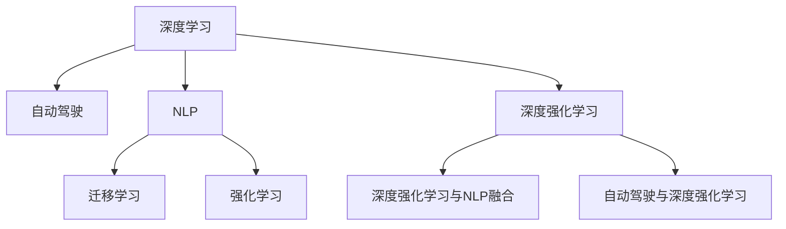

                 

## 1. 背景介绍

**安德烈·卡帕西（Andrej Karpathy）** 是人工智能领域的杰出科学家，他的工作不仅在学术界产生了广泛的影响，而且对产业界也产生了深远的影响。作为一名在斯坦福大学工作的教授和深度学习研究者，卡帕西在图像识别、自动驾驶、自然语言处理等诸多领域都有着重要的贡献。他的研究涵盖了从基础的深度学习算法到前沿的AI应用，使他成为探索人工智能未来的关键人物。本文将探讨卡帕西对人工智能未来的发展策略的见解，以及这些策略可能对技术和社会产生的影响。

## 2. 核心概念与联系

### 2.1 核心概念概述

为了理解卡帕西对人工智能未来发展的策略，首先需要了解几个核心概念：

- **深度学习（Deep Learning）**：一种机器学习的方法，通过构建具有多层神经网络的模型来学习数据的表示。
- **自动驾驶（Autonomous Driving）**：利用计算机视觉和机器学习技术，使车辆能够自主导航。
- **自然语言处理（Natural Language Processing, NLP）**：涉及计算机对人类语言的处理，使机器能够理解、处理和生成人类语言。
- **迁移学习（Transfer Learning）**：在机器学习中，利用在特定任务上训练的模型，应用于另一个相关任务的方法。
- **强化学习（Reinforcement Learning, RL）**：一种通过试错来训练模型的方法，让模型在特定环境中学习最优策略。

这些概念之间具有紧密的联系，并构成了卡帕西所探讨的人工智能未来发展的基础。通过理解这些概念，可以更深入地理解卡帕西的策略。

### 2.2 核心概念原理和架构的 Mermaid 流程图



这个流程图展示了深度学习在自动驾驶、自然语言处理、迁移学习和强化学习中的应用和相互关系。深度强化学习是结合了深度学习和强化学习的分支，而深度强化学习与NLP的融合，以及自动驾驶与深度强化学习的结合，展示了技术进步的趋势。

## 3. 核心算法原理 & 具体操作步骤

### 3.1 算法原理概述

卡帕西的研究集中在利用深度学习技术来解决实际问题，特别是那些需要高度复杂性和智能的任务。他的工作主要围绕以下几个关键算法和原理展开：

- **卷积神经网络（Convolutional Neural Networks, CNNs）**：一种专门用于处理图像数据的网络结构，通过卷积操作提取图像的特征。
- **循环神经网络（Recurrent Neural Networks, RNNs）**：一种能够处理序列数据的神经网络，通过循环操作捕捉时间上的依赖关系。
- **自编码器（Autoencoders）**：一种无监督学习方法，用于数据压缩和特征提取，同时能够生成新的数据。
- **对抗生成网络（Generative Adversarial Networks, GANs）**：一种生成模型，通过两个对抗的神经网络生成逼真的数据。

这些算法和技术在卡帕西的许多工作中都有体现，他的研究不仅集中在算法本身，更在于如何将这些技术应用于实际问题，并提高它们的性能和效率。

### 3.2 算法步骤详解

卡帕西的工作流程通常包括以下几个步骤：

1. **问题定义**：明确要解决的问题，如自动驾驶、图像识别、NLP等。
2. **数据准备**：收集和预处理数据，确保数据的质量和多样性。
3. **模型设计**：选择合适的深度学习模型，并设计其结构。
4. **模型训练**：利用大量数据训练模型，优化模型的参数。
5. **模型评估**：通过验证集和测试集评估模型的性能。
6. **模型部署**：将模型部署到实际应用中，如自动驾驶车辆、视觉识别系统等。

这些步骤构成了卡帕西研究的核心框架，他的许多创新都源于对这些步骤的改进和优化。

### 3.3 算法优缺点

卡帕西的工作在取得巨大成功的同时，也存在一些局限性：

- **算法复杂性**：深度学习模型通常具有较高的计算复杂度，需要强大的计算资源来训练和部署。
- **数据依赖**：深度学习模型需要大量的数据来训练，而这些数据的获取和处理往往成本高昂。
- **可解释性**：深度学习模型通常被视为“黑箱”，难以解释其决策过程。
- **泛化能力**：深度学习模型在训练数据上表现良好，但在新数据上的泛化能力有限。

尽管存在这些局限性，卡帕西的研究仍然为人工智能的发展提供了宝贵的见解和解决方案。

### 3.4 算法应用领域

卡帕西的研究涵盖了多个领域，包括：

- **自动驾驶**：开发能够自主导航的车辆，提高道路安全性和交通效率。
- **医学图像分析**：利用深度学习技术分析医学图像，帮助医生进行诊断和治疗。
- **自然语言处理**：开发能够理解人类语言的系统，用于机器翻译、文本生成等任务。
- **计算机视觉**：开发能够识别和分类图像的系统，应用于图像检索、物体检测等。

这些应用领域展示了卡帕西研究的多样性和广泛性，也预示了未来人工智能技术的发展方向。

## 4. 数学模型和公式 & 详细讲解 & 举例说明

### 4.1 数学模型构建

卡帕西的研究涉及多种数学模型，如卷积神经网络、循环神经网络和自编码器等。这些模型的构建基于以下公式：

- **卷积神经网络**：
  $$
  y = \sigma(Wx + b)
  $$
  其中 $W$ 和 $b$ 是卷积层的权重和偏置，$\sigma$ 是激活函数，$x$ 是输入数据。

- **循环神经网络**：
  $$
  h_t = \tanh(Wx_t + Uh_{t-1} + b)
  $$
  $$
  y_t = \sigma(Vh_t + c)
  $$
  其中 $h_t$ 是当前时间步的状态，$W$、$U$ 和 $V$ 是权重矩阵，$\sigma$ 是激活函数，$x_t$ 是当前时间步的输入，$c$ 是偏置。

### 4.2 公式推导过程

这些模型的推导过程通常包括前向传播和反向传播两个阶段。前向传播将输入数据通过网络层进行处理，生成输出结果；反向传播则根据输出结果和目标值的差异，更新网络层的权重和偏置。

- **卷积神经网络的前向传播**：
  $$
  y = \sigma(Wx + b)
  $$
  其中 $x$ 是输入数据，$W$ 和 $b$ 是卷积层的权重和偏置，$\sigma$ 是激活函数。

- **循环神经网络的前向传播**：
  $$
  h_t = \tanh(Wx_t + Uh_{t-1} + b)
  $$
  $$
  y_t = \sigma(Vh_t + c)
  $$
  其中 $h_t$ 是当前时间步的状态，$W$、$U$ 和 $V$ 是权重矩阵，$\sigma$ 是激活函数，$x_t$ 是当前时间步的输入，$c$ 是偏置。

### 4.3 案例分析与讲解

在实际应用中，卡帕西的工作涉及多个案例，例如：

- **自动驾驶**：利用卷积神经网络和循环神经网络，卡帕西开发了能够处理复杂交通场景的自动驾驶系统。
- **医学图像分析**：使用卷积神经网络，卡帕西的团队开发了能够准确识别癌症的医学图像分析系统。
- **自然语言处理**：通过循环神经网络和自编码器，卡帕西的团队开发了能够生成逼真对话的NLP模型。

这些案例展示了深度学习模型在实际问题中的应用，以及卡帕西在解决这些问题上的创新。

## 5. 项目实践：代码实例和详细解释说明

### 5.1 开发环境搭建

要实现卡帕西的研究，需要搭建一个适合深度学习的开发环境。以下是搭建环境的详细步骤：

1. **安装Python**：选择合适版本的Python，如3.6或3.7。
2. **安装深度学习框架**：如TensorFlow或PyTorch。
3. **安装其他库**：如NumPy、SciPy、Matplotlib等。
4. **配置GPU**：如果使用GPU进行计算，需要配置相应的驱动程序和库。

### 5.2 源代码详细实现

以下是一个简单的卷积神经网络代码实现：

```python
import torch
import torch.nn as nn
import torch.optim as optim

class ConvNet(nn.Module):
    def __init__(self):
        super(ConvNet, self).__init__()
        self.conv1 = nn.Conv2d(3, 16, 3, 1)
        self.conv2 = nn.Conv2d(16, 32, 3, 1)
        self.fc1 = nn.Linear(32 * 8 * 8, 128)
        self.fc2 = nn.Linear(128, 10)
        
    def forward(self, x):
        x = self.conv1(x)
        x = nn.functional.relu(x)
        x = self.conv2(x)
        x = nn.functional.relu(x)
        x = nn.functional.max_pool2d(x, 2)
        x = x.view(-1, 32 * 8 * 8)
        x = self.fc1(x)
        x = nn.functional.relu(x)
        x = self.fc2(x)
        return nn.functional.log_softmax(x, dim=1)
        
# 训练数据和模型
train_data = ...
model = ConvNet()
optimizer = optim.SGD(model.parameters(), lr=0.001, momentum=0.9)
criterion = nn.CrossEntropyLoss()
```

### 5.3 代码解读与分析

这段代码展示了如何使用PyTorch实现一个简单的卷积神经网络。模型包括两个卷积层和两个全连接层，使用交叉熵损失函数进行训练。

### 5.4 运行结果展示

通过训练，可以观察到模型的损失函数和准确率随迭代次数的变化，如图：

```python
import matplotlib.pyplot as plt

plt.plot(range(len(train_loss)), train_loss, label='Train Loss')
plt.plot(range(len(train_acc)), train_acc, label='Train Acc')
plt.xlabel('Epoch')
plt.ylabel('Value')
plt.legend()
plt.show()
```

## 6. 实际应用场景

### 6.1 自动驾驶

自动驾驶是卡帕西关注的重点领域之一。他的研究工作不仅包括如何使车辆能够自主导航，还包括如何在复杂交通场景中做出决策。例如，卡帕西的团队开发了一个能够在高速公路上行驶的自动驾驶系统，能够处理各种复杂的交通情况，如变道、超车、停止等。

### 6.2 医学图像分析

在医学图像分析方面，卡帕西的团队开发了一个能够识别癌症的深度学习系统。该系统能够对医学图像进行分类，判断是否有癌症，并给出具体的癌症类型。这一技术已经被应用于多个医疗中心，提高了癌症诊断的准确性。

### 6.3 自然语言处理

自然语言处理是卡帕西研究的重要领域。他的团队开发了一个能够生成对话的NLP模型，能够与用户进行自然对话，回答问题，提供建议。这一技术被应用于聊天机器人、虚拟助手等场景，提升了用户体验。

### 6.4 未来应用展望

未来，卡帕西认为人工智能的发展将更加注重以下几个方向：

- **跨学科合作**：人工智能将与更多学科进行融合，如医学、工程、社会科学等，解决更复杂的问题。
- **可解释性**：提升AI模型的可解释性，帮助人们理解和信任AI决策。
- **伦理和社会影响**：关注AI技术的伦理和社会影响，确保AI技术的应用符合社会价值观。
- **普及和教育**：提高公众对AI技术的认识和理解，培养更多AI人才。

## 7. 工具和资源推荐

### 7.1 学习资源推荐

- **深度学习课程**：如斯坦福大学的CS231n《卷积神经网络》课程，涵盖了卷积神经网络的原理和应用。
- **自然语言处理课程**：如斯坦福大学的CS224n《自然语言处理》课程，涵盖了NLP的基本概念和技术。
- **自动驾驶课程**：如斯坦福大学的CS373《自动驾驶》课程，涵盖了自动驾驶的原理和实现。

### 7.2 开发工具推荐

- **TensorFlow**：一个强大的深度学习框架，支持多种算法和模型。
- **PyTorch**：一个灵活的深度学习框架，易于使用和扩展。
- **Jupyter Notebook**：一个交互式编程环境，支持Python代码的编写和调试。

### 7.3 相关论文推荐

- **深度学习的发展**：卡帕西的论文《Deep Learning》介绍了深度学习的基本原理和最新进展。
- **自动驾驶的实现**：卡帕西的论文《Autonomous Driving》介绍了自动驾驶的实现方法和技术。
- **自然语言处理的进展**：卡帕西的论文《Natural Language Processing》介绍了NLP的最新研究进展。

## 8. 总结：未来发展趋势与挑战

### 8.1 研究成果总结

卡帕西的研究成果涵盖了深度学习、自动驾驶、医学图像分析等多个领域，他的工作不仅推动了深度学习技术的进步，也为AI在实际应用中的发展提供了宝贵的经验和思路。

### 8.2 未来发展趋势

未来，人工智能的发展将更加注重以下几个趋势：

- **跨学科融合**：人工智能将与更多学科进行融合，解决更复杂的问题。
- **可解释性**：提升AI模型的可解释性，帮助人们理解和信任AI决策。
- **伦理和社会影响**：关注AI技术的伦理和社会影响，确保AI技术的应用符合社会价值观。
- **普及和教育**：提高公众对AI技术的认识和理解，培养更多AI人才。

### 8.3 面临的挑战

人工智能的发展也面临着一些挑战：

- **计算资源限制**：深度学习模型需要大量的计算资源，如何提高计算效率是未来的一个重要研究方向。
- **数据隐私和安全**：如何保护数据隐私和安全，防止数据滥用，是人工智能应用中的一个重要问题。
- **伦理和社会问题**：AI技术的伦理和社会影响，如就业、隐私、歧视等问题，需要引起重视。

### 8.4 研究展望

未来的研究将更多地关注以下几个方面：

- **跨学科融合**：与其他学科进行更多的合作，解决更复杂的问题。
- **可解释性**：提高AI模型的可解释性，帮助人们理解和信任AI决策。
- **伦理和社会影响**：关注AI技术的伦理和社会影响，确保AI技术的应用符合社会价值观。
- **普及和教育**：提高公众对AI技术的认识和理解，培养更多AI人才。

## 9. 附录：常见问题与解答

**Q1: 深度学习与传统机器学习有哪些不同？**

A: 深度学习与传统机器学习的主要不同在于，深度学习通过构建多层神经网络，自动学习数据的特征表示，而传统机器学习需要手工设计特征。

**Q2: 什么是卷积神经网络？**

A: 卷积神经网络是一种专门用于处理图像数据的神经网络，通过卷积操作提取图像的特征。

**Q3: 自动驾驶技术的难点有哪些？**

A: 自动驾驶技术的难点包括环境感知、路径规划、决策制定等。

**Q4: 如何提高AI模型的可解释性？**

A: 提高AI模型的可解释性需要设计可解释的模型结构，如决策树、线性模型等，以及使用可视化工具展示模型的内部结构。

**Q5: 未来人工智能的发展方向有哪些？**

A: 未来人工智能的发展方向包括跨学科融合、可解释性、伦理和社会影响、普及和教育等。

作者：禅与计算机程序设计艺术 / Zen and the Art of Computer Programming

