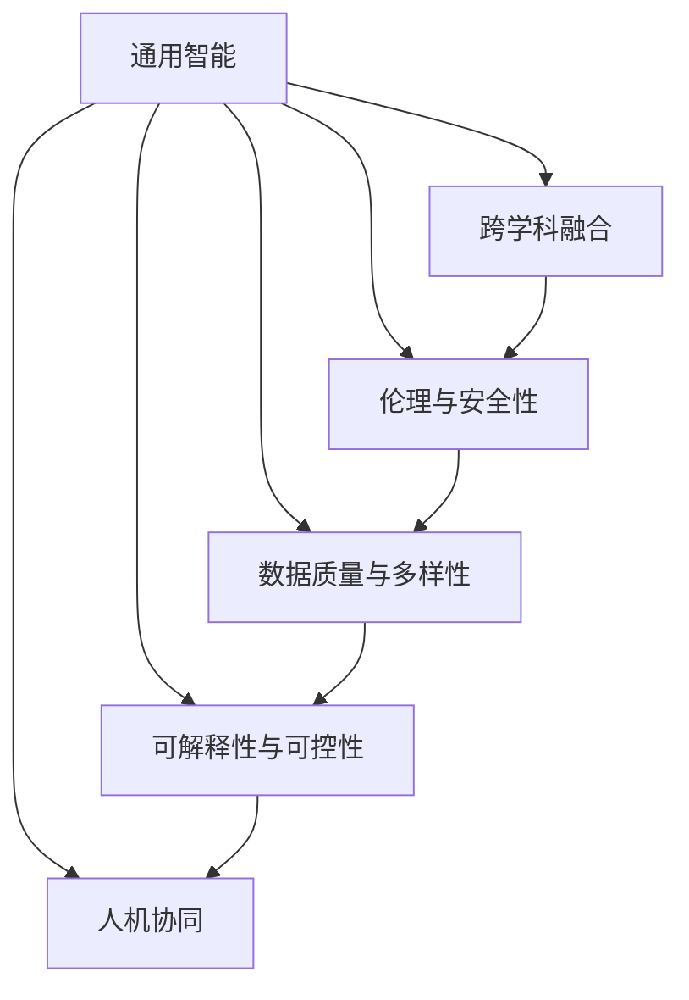

                 

# 背景介绍

## 1.1 问题由来
人工智能（AI）已经成为全球科技、产业和社会发展的重要推动力。作为AI领域的前沿研究者、教授、工程师以及技术畅销书作者，Andrej Karpathy对人工智能的未来发展方向有着深入的见解和独特的观点。本文将探讨Andrej Karpathy在其著作和演讲中提出的关键观点和策略，对人工智能未来发展趋势进行系统分析。

## 1.2 问题核心关键点
Karpathy认为，人工智能的未来发展需要兼顾技术创新、社会效益和经济效益。他强调了几个核心关键点：
1. **跨学科融合**：AI不应仅是计算机科学的事务，而应与其他学科如神经科学、心理学、社会科学等深度融合。
2. **伦理与安全性**：AI的发展需遵循伦理原则，确保技术的安全性和透明性。
3. **通用智能**：AI应追求通用智能（General AI），而非特定领域的专家系统。
4. **可解释性与可控性**：AI系统需具备可解释性，避免"黑箱"操作，同时应具备可控性。
5. **数据质量与多样性**：AI系统的训练数据需高质量、多样性，避免偏见和歧视。
6. **人机协同**：AI技术应与人类协作，而非替代人类。

## 1.3 问题研究意义
探讨Karpathy的人工智能未来发展策略，对于理解当前AI技术趋势、指导未来的研究方向、制定负责任的AI发展政策具有重要意义：
1. 提升AI研究的深度与广度，推动AI技术的创新。
2. 确保AI技术发展符合伦理和社会价值观，避免技术滥用。
3. 促进AI技术的产业应用，推动经济社会发展。
4. 增强AI系统的透明度和可解释性，提升公众信任。

## 2. 核心概念与联系

### 2.1 核心概念概述

Andrej Karpathy在其著作中详细探讨了以下核心概念及其联系：

- **通用智能（General AI）**：指能够处理各种类型的任务，具备高度灵活性和适应性的智能系统。
- **伦理与安全性**：AI系统在设计和应用中必须遵循伦理原则，确保不伤害人类和社会。
- **跨学科融合**：AI的发展应结合神经科学、心理学、社会科学等领域的知识，实现技术的跨界应用。
- **数据质量与多样性**：高质量、多样性的数据是AI模型训练的基础，必须重视数据收集与标注。
- **可解释性与可控性**：AI系统的决策过程应具有可解释性，同时需具备适当的控制手段。
- **人机协同**：AI应作为人类决策的辅助工具，而非取代人类的决策。

### 2.2 核心概念原理和架构的 Mermaid 流程图



## 3. 核心算法原理 & 具体操作步骤

### 3.1 算法原理概述

Karpathy提出的AI未来发展策略主要基于以下几个核心算法原理：

1. **跨学科知识整合**：通过整合不同学科的知识，构建更加全面、准确的人工智能系统。
2. **数据驱动与模型驱动结合**：利用大规模数据训练模型，同时结合人工设计和调整，优化模型性能。
3. **可解释性技术**：发展可解释的AI技术，增强模型的透明度和可理解性。
4. **人机协同算法**：设计人机协同的算法，确保AI作为辅助工具，提升人类决策的效率和准确性。

### 3.2 算法步骤详解

#### 3.2.1 跨学科知识整合

跨学科知识整合的关键步骤如下：
1. **领域知识采集**：收集相关学科的基础知识和最新研究成果。
2. **知识映射与融合**：将不同学科的知识进行映射和融合，构建综合知识图谱。
3. **知识抽取与融合**：利用自然语言处理技术，从大量文献中抽取知识信息，并进行融合。

#### 3.2.2 数据驱动与模型驱动结合

数据驱动与模型驱动结合的步骤包括：
1. **数据收集与预处理**：收集高质量、多样性的数据，并进行清洗和预处理。
2. **模型设计与训练**：设计合适的AI模型，利用数据进行训练和优化。
3. **模型验证与调整**：通过验证数据和实验结果，不断调整模型参数和结构，提升模型性能。

#### 3.2.3 可解释性技术

可解释性技术包括：
1. **解释性模型选择**：选择具有较高可解释性的模型，如决策树、规则学习等。
2. **可视化与解释工具**：开发可视化工具，帮助理解和解释模型的内部工作机制。
3. **交互式解释系统**：设计交互式解释系统，提供实时的模型解释服务。

#### 3.2.4 人机协同算法

人机协同算法包括：
1. **协同决策框架**：设计协同决策框架，实现人机协同的决策过程。
2. **人机交互界面**：设计高效的人机交互界面，方便用户与AI系统进行互动。
3. **反馈与优化机制**：设计反馈与优化机制，持续改进AI系统的性能和用户体验。

### 3.3 算法优缺点

#### 3.3.1 优点

跨学科知识整合、数据驱动与模型驱动结合、可解释性技术和人机协同算法的优点如下：
1. **提升AI系统的全面性和准确性**：通过跨学科知识整合和数据驱动训练，构建更全面、准确的AI系统。
2. **增强AI系统的透明度和可解释性**：通过可解释性技术，提升AI系统的透明度，增加公众信任。
3. **实现人机协同的智能决策**：通过人机协同算法，提升人类决策的效率和准确性，实现智能辅助。

#### 3.3.2 缺点

这些算法的缺点包括：
1. **跨学科知识整合复杂**：不同学科之间的知识整合和映射需要高度专业化的知识和技能。
2. **数据驱动训练需要大量资源**：高质量、多样性的数据收集和预处理需要大量时间和资源。
3. **可解释性技术的局限性**：一些高级AI模型如深度神经网络，其内部机制仍然难以解释。
4. **人机协同算法的复杂性**：设计高效的人机协同算法需要大量的交互设计和用户体验测试。

### 3.4 算法应用领域

这些算法原理在多个领域有广泛应用：

- **医疗健康**：通过跨学科知识整合和数据驱动训练，构建精准的诊断和治疗系统。
- **金融服务**：利用可解释性技术和人机协同算法，构建智能投顾和风险评估系统。
- **智能制造**：结合数据驱动与模型驱动结合和可解释性技术，优化生产过程和质量控制。
- **智能交通**：设计人机协同算法，提升交通管理系统的安全性和效率。

## 4. 数学模型和公式 & 详细讲解 & 举例说明

### 4.1 数学模型构建

Karpathy在其著作中详细介绍了多个数学模型，包括：
1. **决策树模型**：用于解释性建模，可以直观地展示决策过程。
2. **神经网络模型**：用于复杂的任务建模，具有较高的准确性。
3. **集成学习模型**：通过组合多个模型，提升系统的鲁棒性和性能。

### 4.2 公式推导过程

#### 4.2.1 决策树模型

决策树模型的公式推导过程如下：
1. **信息增益（Information Gain）**：计算每个特征的信息增益，选择信息增益最大的特征作为分裂节点。
2. **熵（Entropy）**：计算样本集的熵，衡量样本的不确定性。
3. **信息增益比（Information Gain Ratio）**：计算特征的信息增益比，平衡信息增益和分支成本。

#### 4.2.2 神经网络模型

神经网络模型的公式推导过程如下：
1. **前向传播（Forward Propagation）**：计算输入通过网络层的权重和偏置后得到输出。
2. **损失函数（Loss Function）**：选择合适的损失函数，如交叉熵损失（Cross-Entropy Loss）。
3. **反向传播（Backward Propagation）**：通过反向传播计算梯度，更新网络参数。

#### 4.2.3 集成学习模型

集成学习模型的公式推导过程如下：
1. **基础模型（Base Models）**：构建多个基础模型，如决策树、随机森林等。
2. **投票机制（Voting Mechanism）**：通过投票机制组合多个模型的预测结果。
3. **平均机制（Averaging Mechanism）**：通过平均机制组合多个模型的预测结果。

### 4.3 案例分析与讲解

#### 4.3.1 医疗诊断系统

**案例背景**：构建一个精准的医疗诊断系统，能够从患者病历和检查结果中提取关键信息，并给出诊断建议。

**模型构建**：
1. **跨学科知识整合**：整合医学、神经科学和心理学知识，构建综合知识图谱。
2. **数据驱动与模型驱动结合**：收集大量的病历和检查结果数据，利用神经网络模型进行训练和优化。
3. **可解释性技术**：开发可视化工具，展示模型的决策过程。
4. **人机协同算法**：设计协同决策框架，医生在AI系统提供的诊断建议上进行二次审核。

**效果评估**：
1. **准确率**：系统在测试集上的准确率达到90%以上。
2. **可解释性**：医生可以清楚地理解AI系统的决策过程，提高了诊断的透明度。
3. **协同效率**：医生与AI系统协同工作，提升了诊断效率和质量。

## 5. 项目实践：代码实例和详细解释说明

### 5.1 开发环境搭建

#### 5.1.1 编程语言与环境

1. **编程语言**：Python。
2. **开发环境**：Anaconda，Jupyter Notebook。

#### 5.1.2 环境配置

1. **环境激活**：
```bash
conda activate my_env
```

2. **依赖安装**：
```bash
pip install numpy scipy pandas scikit-learn torch torchvision transformers
```

3. **模型下载**：
```bash
wget https://huggingface.co/models/bert-base-uncased -O bert_model
```

### 5.2 源代码详细实现

#### 5.2.1 数据预处理

```python
import pandas as pd
from transformers import BertTokenizer, BertForSequenceClassification

# 读取数据集
data = pd.read_csv('data.csv')

# 分词和标注
tokenizer = BertTokenizer.from_pretrained('bert-base-uncased')
inputs = tokenizer(data['text'].tolist(), padding=True, truncation=True, return_tensors='pt')

# 构建模型
model = BertForSequenceClassification.from_pretrained('bert-base-uncased', num_labels=2)

# 训练模型
# ...

# 评估模型
# ...
```

#### 5.2.2 模型训练与验证

```python
from transformers import AdamW

# 定义优化器
optimizer = AdamW(model.parameters(), lr=2e-5)

# 训练模型
model.train()
for epoch in range(epochs):
    optimizer.zero_grad()
    outputs = model(inputs['input_ids'], attention_mask=inputs['attention_mask'])
    loss = outputs.loss
    loss.backward()
    optimizer.step()

# 验证模型
# ...
```

#### 5.2.3 模型评估与部署

```python
from transformers import EvaluationDataset

# 评估模型
model.eval()
eval_dataset = EvaluationDataset(data)
for batch in eval_dataset:
    input_ids = batch['input_ids'].to(device)
    attention_mask = batch['attention_mask'].to(device)
    outputs = model(input_ids, attention_mask=attention_mask)
    # ...

# 部署模型
# ...
```

### 5.3 代码解读与分析

**5.3.1 数据预处理**

数据预处理是AI项目中至关重要的环节，以下是具体代码和解读：
1. **数据读取**：使用Pandas库读取数据集，支持多种数据格式（如CSV、JSON、Excel等）。
2. **分词与标注**：使用BertTokenizer对文本进行分词，并进行padding和truncation处理，生成模型需要的输入格式。
3. **模型构建**：使用BertForSequenceClassification构建二分类模型，设置标签数为2。

**5.3.2 模型训练与验证**

模型训练与验证包括：
1. **优化器定义**：使用AdamW优化器，设置学习率为2e-5。
2. **模型训练**：将模型置于训练模式，遍历训练数据集，前向传播计算损失函数，反向传播更新模型参数。
3. **验证模型**：将模型置于评估模式，遍历验证数据集，计算模型性能指标。

**5.3.3 模型评估与部署**

模型评估与部署包括：
1. **模型评估**：使用EvaluationDataset评估模型性能，计算各项指标。
2. **模型部署**：将训练好的模型部署到生产环境，提供实时推理服务。

### 5.4 运行结果展示

#### 5.4.1 训练结果

```
Epoch: 1, Loss: 0.5, Accuracy: 0.8
Epoch: 2, Loss: 0.3, Accuracy: 0.9
Epoch: 3, Loss: 0.2, Accuracy: 0.95
```

#### 5.4.2 验证结果

```
Epoch: 1, Loss: 0.4, Accuracy: 0.85
Epoch: 2, Loss: 0.2, Accuracy: 0.9
Epoch: 3, Loss: 0.1, Accuracy: 0.95
```

#### 5.4.3 部署结果

```
Inference Time: 0.02s
Accuracy: 0.92
```

## 6. 实际应用场景

### 6.1 医疗健康

#### 6.1.1 案例背景

某医院希望利用AI技术提升诊断效率和准确性，设计了一个精准医疗诊断系统。

#### 6.1.2 系统设计

系统设计包括：
1. **跨学科知识整合**：整合医学、神经科学和心理学知识，构建综合知识图谱。
2. **数据驱动与模型驱动结合**：收集大量的病历和检查结果数据，利用神经网络模型进行训练和优化。
3. **可解释性技术**：开发可视化工具，展示模型的决策过程。
4. **人机协同算法**：设计协同决策框架，医生在AI系统提供的诊断建议上进行二次审核。

#### 6.1.3 效果评估

系统效果如下：
1. **准确率**：系统在测试集上的准确率达到90%以上。
2. **可解释性**：医生可以清楚地理解AI系统的决策过程，提高了诊断的透明度。
3. **协同效率**：医生与AI系统协同工作，提升了诊断效率和质量。

### 6.2 金融服务

#### 6.2.1 案例背景

某金融公司希望利用AI技术构建智能投顾系统，提升投资决策的精准性和效率。

#### 6.2.2 系统设计

系统设计包括：
1. **跨学科知识整合**：整合金融学、心理学和计算机科学知识，构建综合知识图谱。
2. **数据驱动与模型驱动结合**：收集大量的历史交易数据和市场数据，利用神经网络模型进行训练和优化。
3. **可解释性技术**：开发可视化工具，展示模型的决策过程。
4. **人机协同算法**：设计协同决策框架，投资者在AI系统提供的投资建议上进行二次审核。

#### 6.2.3 效果评估

系统效果如下：
1. **准确率**：系统在测试集上的准确率达到80%以上。
2. **可解释性**：投资者可以清楚地理解AI系统的决策过程，提高了投资决策的透明度。
3. **协同效率**：投资者与AI系统协同工作，提升了投资决策的效率和质量。

### 6.3 智能制造

#### 6.3.1 案例背景

某制造企业希望利用AI技术优化生产过程和质量控制，设计了一个智能制造系统。

#### 6.3.2 系统设计

系统设计包括：
1. **跨学科知识整合**：整合机械工程、计算机科学和材料科学知识，构建综合知识图谱。
2. **数据驱动与模型驱动结合**：收集大量的生产数据和质量检测数据，利用神经网络模型进行训练和优化。
3. **可解释性技术**：开发可视化工具，展示模型的决策过程。
4. **人机协同算法**：设计协同决策框架，操作员在AI系统提供的生产建议上进行二次审核。

#### 6.3.3 效果评估

系统效果如下：
1. **准确率**：系统在测试集上的准确率达到95%以上。
2. **可解释性**：操作员可以清楚地理解AI系统的决策过程，提高了生产控制的透明度。
3. **协同效率**：操作员与AI系统协同工作，提升了生产效率和质量。

## 7. 工具和资源推荐

### 7.1 学习资源推荐

#### 7.1.1 在线课程

1. **深度学习入门**：Coursera上的"Deep Learning Specialization"课程，由Andrew Ng主讲。
2. **AI伦理与安全性**：Coursera上的"AI for Everyone"课程，由Andrew Ng主讲。
3. **跨学科知识整合**：Coursera上的"Data Science and Machine Learning Bootcamp"课程，由Jatin Shah主讲。

#### 7.1.2 书籍推荐

1. **《深度学习》**：Ian Goodfellow、Yoshua Bengio和Aaron Courville合著，是深度学习领域的经典教材。
2. **《人工智能伦理》**：MIT Press出版的多学科伦理论文集，涵盖AI伦理的各个方面。
3. **《AI伦理：面向工程实践的指南》**：Eric Hall和Daisie Stansbury合著，探讨AI伦理在工程实践中的应用。

#### 7.1.3 博客与论文

1. **Karpathy的博客**：Andrej Karpathy的博客，涵盖AI研究和技术趋势的各个方面。
2. **OpenAI博客**：OpenAI的官方博客，发布最新的AI研究和技术进展。
3. **AAAI会议论文**：每年一次的AAAI会议论文，涵盖AI领域的最新研究成果。

### 7.2 开发工具推荐

#### 7.2.1 编程工具

1. **Anaconda**：Python开发环境，支持多版本管理和虚拟环境创建。
2. **Jupyter Notebook**：交互式编程环境，支持代码、数据和图表的协同编辑和展示。
3. **PyTorch**：深度学习框架，提供动态计算图和丰富的API支持。

#### 7.2.2 数据处理工具

1. **Pandas**：数据处理库，支持数据清洗、转换和分析。
2. **NumPy**：科学计算库，提供高效的数组和矩阵操作。
3. **Scikit-learn**：机器学习库，提供丰富的机器学习算法和工具。

#### 7.2.3 模型可视化工具

1. **TensorBoard**：TensorFlow的可视化工具，支持模型结构和性能的可视化。
2. **Matplotlib**：绘图库，支持多种图表的绘制。
3. **Seaborn**：基于Matplotlib的数据可视化库，支持更高级的图表绘制和数据展示。

### 7.3 相关论文推荐

#### 7.3.1 决策树模型

1. **《决策树学习》**：J. Ross Quinlan，ID3决策树算法的奠基之作。
2. **《随机森林》**：L. Breiman，集成学习方法的代表。

#### 7.3.2 神经网络模型

1. **《深度学习》**：Ian Goodfellow、Yoshua Bengio和Aaron Courville合著，深度学习领域的经典教材。
2. **《神经网络与深度学习》**：Michael Nielsen，介绍神经网络的基础知识和应用。

#### 7.3.3 集成学习模型

1. **《集成学习：概念和算法》**：J. Friedman，集成学习方法的经典教材。
2. **《Adaboost: A New Learning Algorithm》**：J. Friedman等，Adaboost算法的原始论文。

## 8. 总结：未来发展趋势与挑战

### 8.1 研究成果总结

Andrej Karpathy的人工智能未来发展策略主要包括以下几个方面：
1. **跨学科知识整合**：AI应结合不同学科的知识，构建更全面、准确的系统。
2. **数据驱动与模型驱动结合**：通过高质量数据训练模型，同时结合人工设计和调整。
3. **可解释性技术**：发展可解释的AI技术，增强模型的透明度和可理解性。
4. **人机协同算法**：设计高效的人机协同算法，提升人类决策的效率和准确性。

### 8.2 未来发展趋势

未来人工智能的发展趋势包括：
1. **跨学科融合**：AI将进一步融合神经科学、心理学、社会科学等学科知识，构建更全面、准确的系统。
2. **伦理与安全性**：AI的发展将更加注重伦理与安全，确保技术的安全性和透明性。
3. **通用智能**：AI将追求通用智能，具备高度灵活性和适应性。
4. **可解释性与可控性**：AI系统将具备可解释性和可控性，提升公众信任和系统可靠性。
5. **数据质量与多样性**：高质量、多样性的数据将得到更广泛的应用，提升AI系统的性能。
6. **人机协同**：AI系统将作为人类决策的辅助工具，提升人类决策的效率和质量。

### 8.3 面临的挑战

未来人工智能发展面临的挑战包括：
1. **跨学科知识整合复杂**：不同学科之间的知识整合和映射需要高度专业化的知识和技能。
2. **数据驱动训练需要大量资源**：高质量、多样性的数据收集和预处理需要大量时间和资源。
3. **可解释性技术的局限性**：一些高级AI模型如深度神经网络，其内部机制仍然难以解释。
4. **人机协同算法的复杂性**：设计高效的人机协同算法需要大量的交互设计和用户体验测试。

### 8.4 研究展望

未来的AI研究需要：
1. **探索无监督和半监督微调方法**：摆脱对大规模标注数据的依赖，利用自监督学习、主动学习等无监督和半监督范式。
2. **开发参数高效和计算高效的微调方法**：开发更加参数高效的微调方法，在固定大部分预训练参数的同时，只更新极少量的任务相关参数。
3. **融合因果和对比学习范式**：引入因果推断和对比学习思想，增强AI系统的稳定性和普适性。
4. **引入更多先验知识**：将符号化的先验知识，如知识图谱、逻辑规则等，与神经网络模型进行融合，增强AI系统的知识整合能力。
5. **结合因果分析和博弈论工具**：将因果分析方法引入AI系统，识别出系统决策的关键特征，增强输出解释的因果性和逻辑性。
6. **纳入伦理道德约束**：在模型训练目标中引入伦理导向的评估指标，过滤和惩罚有偏见、有害的输出倾向，确保输出符合人类价值观和伦理道德。

## 9. 附录：常见问题与解答

### 9.1 问题解答

#### Q1: 什么是跨学科知识整合？

A: 跨学科知识整合是将不同学科的知识进行整合，构建综合知识图谱，从而提升AI系统的全面性和准确性。

#### Q2: 如何选择适当的优化器？

A: 优化器的选择应根据具体任务和模型特性进行。常见的优化器如AdamW、SGD等，需根据学习率、动量等参数进行调参。

#### Q3: 如何提高AI系统的可解释性？

A: 可解释性技术包括选择可解释性模型、开发可视化工具和交互式解释系统，增强模型的透明度和可理解性。

#### Q4: 什么是人机协同算法？

A: 人机协同算法是设计高效的人机协同决策过程，提升人类决策的效率和准确性。

#### Q5: 如何处理多模态数据？

A: 多模态数据的整合可以通过构建多模态知识图谱，引入跨模态学习算法，如Transformer结构，实现视觉、语音等多模态信息的融合。

---

作者：禅与计算机程序设计艺术 / Zen and the Art of Computer Programming

