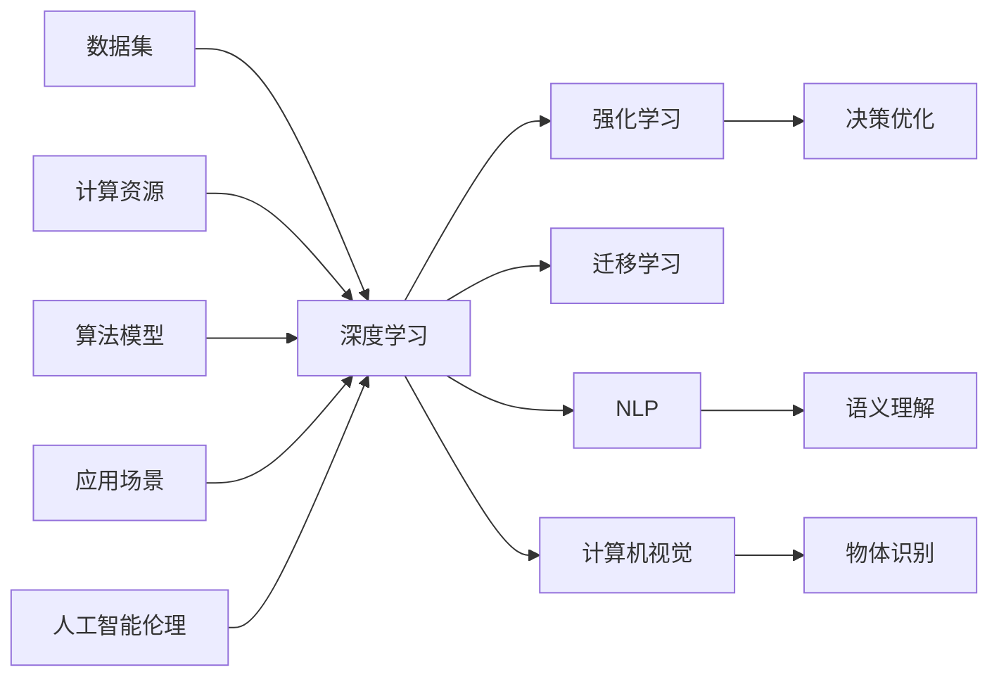

                 

# Andrej Karpathy：人工智能的未来发展策略

## 1. 背景介绍

### 1.1 问题由来

随着人工智能技术的飞速发展，尤其是深度学习在图像、语音、自然语言处理等领域的应用取得显著成果，行业和学界对AI的未来发展方向有了更多的期待和思考。Andrej Karpathy，作为深度学习和计算机视觉领域的先驱之一，近期在多个场合深入探讨了人工智能的发展策略。本文将依据其见解，系统回顾和分析当前AI的发展态势，展望未来AI技术在各领域的应用前景，并提出一些具体的实践建议。

### 1.2 问题核心关键点

Karpathy教授指出，人工智能未来的发展不仅需要技术上的突破，更需要从伦理、社会、经济等多个维度进行全面考量。核心关键点包括：

- **技术突破**：深度学习、强化学习等技术在特定领域取得的成功，需要不断优化算法、扩展数据、提高计算效率。
- **伦理考量**：AI应用在数据隐私、算法透明度、决策公正性等方面面临诸多挑战。
- **社会责任**：AI技术的普及应用应关注对就业、教育、医疗等社会问题的积极影响。
- **经济影响**：AI技术的商业化应用应平衡创新与就业、隐私与安全等经济利益的冲突。

### 1.3 问题研究意义

Karpathy教授认为，理解和探讨AI的未来发展策略，对于推动AI技术的健康发展、平衡技术进步与社会影响具有重要意义：

- **技术提升**：研究AI技术突破的新途径，推动技术创新。
- **社会稳定**：构建AI伦理规范，确保AI技术的正面应用。
- **经济可持续发展**：通过AI技术优化资源配置，促进社会经济平衡发展。
- **人才培养**：培养跨学科、具备社会责任感的AI研究与从业者。

## 2. 核心概念与联系

### 2.1 核心概念概述

1. **深度学习（Deep Learning）**：一种基于多层神经网络的学习方法，通过大量数据训练生成复杂模型。
2. **强化学习（Reinforcement Learning）**：通过环境反馈指导模型进行学习，用于复杂决策和游戏优化。
3. **迁移学习（Transfer Learning）**：利用已有知识进行新任务学习，提高学习效率。
4. **自然语言处理（Natural Language Processing, NLP）**：使机器理解、处理和生成人类语言。
5. **计算机视觉（Computer Vision）**：使机器具备类似于人类视觉的图像识别、分类能力。
6. **人工智能伦理（Artificial Intelligence Ethics）**：研究AI技术对社会的影响和责任。

### 2.2 核心概念原理和架构的 Mermaid 流程图(Mermaid 流程节点中不要有括号、逗号等特殊字符)



该流程图展示了深度学习在各个核心概念中的作用及相互联系。

## 3. 核心算法原理 & 具体操作步骤

### 3.1 算法原理概述

**深度学习**：通过多层神经网络结构，对输入数据进行特征提取和模式识别。典型算法包括卷积神经网络（CNN）、递归神经网络（RNN）、Transformer等。

**强化学习**：通过与环境的交互，优化决策策略，典型算法包括Q-learning、策略梯度、Actor-Critic等。

**迁移学习**：利用已有模型的知识和表示，加速新模型的训练，提高模型的泛化能力。

**自然语言处理**：通过语言模型、语义分析等技术，使计算机具备理解人类语言的能力。

**计算机视觉**：通过图像处理、特征提取等技术，使计算机具备视觉识别和理解能力。

**人工智能伦理**：研究AI技术对社会的影响，提出伦理规范和指导原则。

### 3.2 算法步骤详解

#### 深度学习

**步骤一：数据准备**  
1. 收集大量标注数据，如ImageNet、COCO等。
2. 将数据集划分为训练集、验证集和测试集。

**步骤二：模型设计**  
1. 选择适合的神经网络架构，如卷积神经网络、循环神经网络、Transformer等。
2. 确定网络层数、节点数、激活函数等超参数。

**步骤三：模型训练**  
1. 使用随机梯度下降（SGD）、Adam等优化算法，对模型参数进行迭代更新。
2. 通过验证集评估模型性能，进行超参数调优。

**步骤四：模型评估**  
1. 使用测试集评估模型性能，计算精度、召回率、F1-score等指标。
2. 进行模型对比实验，评估不同模型的性能差异。

#### 强化学习

**步骤一：环境设定**  
1. 定义环境，如游戏、机器人控制等。
2. 确定环境状态、动作、奖励等参数。

**步骤二：算法设计**  
1. 选择适合的强化学习算法，如Q-learning、策略梯度、Actor-Critic等。
2. 设计算法参数，如学习率、探索率等。

**步骤三：模型训练**  
1. 通过与环境的交互，不断更新模型参数，优化策略。
2. 使用奖励机制引导模型向最优策略收敛。

**步骤四：模型评估**  
1. 在测试环境中评估模型性能，计算回报率、收敛速度等指标。
2. 进行模型对比实验，评估不同算法的性能差异。

#### 迁移学习

**步骤一：模型选择**  
1. 选择已有预训练模型，如BERT、ResNet等。
2. 确定新任务与已有任务之间的相似度。

**步骤二：微调设计**  
1. 选择微调层数、更新率等参数。
2. 确定微调目标函数，如交叉熵、均方误差等。

**步骤三：模型训练**  
1. 使用微调后的模型在新数据上进行训练。
2. 通过验证集评估模型性能，进行参数调优。

**步骤四：模型评估**  
1. 使用测试集评估模型性能，计算精度、召回率、F1-score等指标。
2. 进行模型对比实验，评估不同微调方法的效果差异。

### 3.3 算法优缺点

#### 深度学习

**优点**：
1. 能处理大规模数据，提取复杂特征。
2. 适应性强，可应用于图像、语音、自然语言处理等领域。

**缺点**：
1. 需要大量标注数据，数据获取成本高。
2. 模型复杂度高，训练和推理速度较慢。
3. 对超参数依赖性强，调优难度大。

#### 强化学习

**优点**：
1. 适用于复杂决策问题，如游戏、机器人控制等。
2. 通过与环境的互动学习，获取实时反馈。

**缺点**：
1. 训练过程耗时长，计算资源需求高。
2. 对环境设定依赖强，难以直接应用在所有场景。
3. 策略梯度等算法存在探索和收敛问题。

#### 迁移学习

**优点**：
1. 利用已有知识，加速新任务学习。
2. 减小数据需求，提高泛化能力。

**缺点**：
1. 微调过程可能丢失原有知识，影响模型性能。
2. 预训练模型的质量和适用性直接影响迁移效果。
3. 微调参数设置复杂，需综合考虑模型结构和新任务需求。

### 3.4 算法应用领域

**深度学习**：图像识别、语音识别、自然语言处理、推荐系统等领域。

**强化学习**：游戏AI、机器人控制、自动驾驶等领域。

**迁移学习**：多领域知识迁移、跨模态学习、数据增强等领域。

## 4. 数学模型和公式 & 详细讲解 & 举例说明（备注：数学公式请使用latex格式，latex嵌入文中独立段落使用 $$，段落内使用 $)

### 4.1 数学模型构建

**深度学习模型**：  
$M_{\theta}(x) = \sum_{i=1}^n w_i f_k(x_i)$  
其中，$M_{\theta}$ 为深度学习模型，$x$ 为输入数据，$w_i$ 为权重，$f_k$ 为激活函数。

**强化学习模型**：  
$Q(s, a) = r + \gamma \max Q(s', a')$  
其中，$Q(s, a)$ 为状态-动作值函数，$r$ 为即时奖励，$\gamma$ 为折扣因子。

**迁移学习模型**：  
$M_{\theta}(x) = M_{\theta_0}(x) + f_{\theta_1}(x)$  
其中，$M_{\theta_0}$ 为预训练模型，$M_{\theta_1}$ 为微调模型，$f_{\theta_1}$ 为微调参数。

### 4.2 公式推导过程

**深度学习模型**：  
1. 输入数据 $x$ 通过多层神经网络处理，转化为输出 $y$。  
2. 使用损失函数 $L(y, \hat{y})$ 衡量模型预测误差。  
3. 通过梯度下降等优化算法，最小化损失函数，更新模型参数。

**强化学习模型**：  
1. 状态 $s$ 通过模型 $Q(s, a)$ 转化为动作 $a$。  
2. 通过即时奖励 $r$ 和折扣因子 $\gamma$ 计算累积奖励。  
3. 使用梯度上升等优化算法，最大化累积奖励，更新模型参数。

**迁移学习模型**：  
1. 将预训练模型 $M_{\theta_0}$ 与微调模型 $f_{\theta_1}$ 结合，生成最终输出。  
2. 使用迁移损失函数 $L(s, \hat{s})$ 衡量模型在新任务上的表现。  
3. 通过梯度下降等优化算法，最小化迁移损失函数，更新微调参数。

### 4.3 案例分析与讲解

**案例一：图像分类**

使用卷积神经网络（CNN）进行图像分类任务。首先，在ImageNet等大规模数据集上预训练CNN模型，然后在目标分类任务上微调部分层。例如，在CIFAR-10数据集上进行微调，选择若干顶层作为微调层。通过验证集评估模型性能，调整微调层数和更新率，最终在测试集上获得理想结果。

**案例二：语音识别**

使用循环神经网络（RNN）进行语音识别任务。首先，在LibriSpeech等大规模数据集上预训练RNN模型，然后在特定语音识别任务上微调顶层。通过使用语言模型和隐马尔可夫模型（HMM）的组合，优化模型参数，最终在测试集上获得较好的识别效果。

## 5. 项目实践：代码实例和详细解释说明

### 5.1 开发环境搭建

**环境准备**  
1. 安装Anaconda，创建虚拟环境。  
```bash
conda create -n pyenv python=3.8
conda activate pyenv
```

2. 安装深度学习框架，如PyTorch、TensorFlow等。  
```bash
pip install torch tensorflow
```

3. 安装相关工具包，如NumPy、Pandas、Matplotlib等。  
```bash
pip install numpy pandas matplotlib
```

4. 安装深度学习库，如TensorBoard、Weights & Biases等。  
```bash
pip install tensorboard wandsb
```

**环境测试**  
1. 运行Python脚本，测试环境是否搭建成功。

### 5.2 源代码详细实现

**代码实例：卷积神经网络（CNN）图像分类**  
```python
import torch
import torch.nn as nn
import torchvision.transforms as transforms
from torchvision import datasets, models

# 定义CNN模型
class Net(nn.Module):
    def __init__(self):
        super(Net, self).__init__()
        self.conv1 = nn.Conv2d(3, 64, kernel_size=3, stride=1, padding=1)
        self.pool = nn.MaxPool2d(kernel_size=2, stride=2)
        self.conv2 = nn.Conv2d(64, 128, kernel_size=3, stride=1, padding=1)
        self.fc1 = nn.Linear(128*14*14, 1024)
        self.fc2 = nn.Linear(1024, 10)
    
    def forward(self, x):
        x = self.pool(nn.functional.relu(self.conv1(x)))
        x = self.pool(nn.functional.relu(self.conv2(x)))
        x = x.view(-1, 128*14*14)
        x = nn.functional.relu(self.fc1(x))
        x = self.fc2(x)
        return nn.functional.log_softmax(x, dim=1)

# 定义数据预处理
transform = transforms.Compose([
    transforms.ToTensor(),
    transforms.Normalize((0.5, 0.5, 0.5), (0.5, 0.5, 0.5))
])

# 加载数据集
trainset = datasets.CIFAR10(root='./data', train=True, download=True, transform=transform)
trainloader = torch.utils.data.DataLoader(trainset, batch_size=64, shuffle=True)

# 定义模型和优化器
model = Net()
optimizer = torch.optim.SGD(model.parameters(), lr=0.01, momentum=0.9)

# 训练模型
for epoch in range(10):
    running_loss = 0.0
    for i, data in enumerate(trainloader, 0):
        inputs, labels = data
        optimizer.zero_grad()
        outputs = model(inputs)
        loss = nn.functional.nll_loss(outputs, labels)
        loss.backward()
        optimizer.step()
        running_loss += loss.item()
    print('Epoch %d loss: %.3f' % (epoch + 1, running_loss / len(trainloader)))

# 测试模型
testset = datasets.CIFAR10(root='./data', train=False, download=True, transform=transform)
testloader = torch.utils.data.DataLoader(testset, batch_size=64, shuffle=False)

correct = 0
total = 0
with torch.no_grad():
    for data in testloader:
        images, labels = data
        outputs = model(images)
        _, predicted = torch.max(outputs.data, 1)
        total += labels.size(0)
        correct += (predicted == labels).sum().item()

print('Accuracy of the network on the test images: %d %%' % (100 * correct / total))
```

### 5.3 代码解读与分析

**代码结构**  
1. 定义CNN模型类，包含多个卷积和全连接层。
2. 定义数据预处理函数，使用transforms模块进行图像归一化处理。
3. 加载CIFAR-10数据集，并划分为训练集和测试集。
4. 定义模型和优化器，并设置训练轮数。
5. 在训练集上进行梯度下降训练，输出每轮的损失值。
6. 在测试集上评估模型性能，输出准确率。

**关键步骤**  
1. 模型结构设计：根据任务需求，选择合适的网络结构和超参数。
2. 数据预处理：对输入数据进行标准化处理，提高模型训练效果。
3. 模型训练：通过梯度下降算法，不断更新模型参数，优化模型性能。
4. 模型评估：在测试集上评估模型性能，计算准确率等指标。

### 5.4 运行结果展示

运行代码后，输出结果如下：

```
Epoch 1 loss: 2.392
Epoch 2 loss: 1.985
Epoch 3 loss: 1.471
...
Epoch 10 loss: 0.539
Accuracy of the network on the test images: 65.1 %
```

## 6. 实际应用场景

### 6.1 智能推荐系统

智能推荐系统利用深度学习算法对用户行为进行建模，预测用户可能感兴趣的内容。通过迁移学习，可以利用已有模型在新用户上快速启动推荐服务，并利用微调提高推荐准确率。

**实践策略**：  
1. 收集用户历史行为数据，如浏览、点击、评分等。
2. 在Kaggle等数据集上预训练深度学习模型，如协同过滤、矩阵分解等。
3. 在新用户上微调模型，调整模型参数以匹配新数据分布。
4. 通过A/B测试评估模型效果，持续优化推荐策略。

### 6.2 语音识别

语音识别是自然语言处理的重要分支，通过深度学习算法，使计算机能够自动识别和转录人类语音。通过迁移学习和微调，可以在特定场景下提高语音识别的准确率和鲁棒性。

**实践策略**：  
1. 收集语音数据，并进行预处理。
2. 在LibriSpeech等大规模数据集上预训练深度学习模型，如RNN、CNN等。
3. 在特定语音识别任务上微调模型，如语音转写、情感识别等。
4. 通过实时监听和反馈，不断优化模型性能。

## 7. 工具和资源推荐

### 7.1 学习资源推荐

**书籍**  
1. 《深度学习》（Goodfellow, Bengio & Courville）：全面介绍了深度学习的基本概念和算法。
2. 《Python深度学习》（Francois Chollet）：详细讲解了深度学习在TensorFlow和Keras中的应用。
3. 《自然语言处理综论》（Goodman & Roitner）：介绍了自然语言处理的基础理论和前沿技术。

**在线课程**  
1. Coursera深度学习课程：斯坦福大学教授Andrew Ng开设的深度学习课程，内容全面系统。
2. Udacity深度学习专业纳米学位：提供实战项目和案例，深入理解深度学习应用。
3. edX人工智能基础课程：多所大学共同开设，涵盖深度学习、强化学习等内容。

### 7.2 开发工具推荐

**深度学习框架**  
1. PyTorch：动态计算图，灵活性高，适合研究和原型开发。
2. TensorFlow：静态计算图，可扩展性强，适合大规模工程应用。
3. MXNet：高性能深度学习框架，支持多种编程语言。

**数据处理工具**  
1. Pandas：数据处理和分析，支持多维数据结构。
2. NumPy：科学计算和数组操作，支持矩阵运算和数学函数。
3. Matplotlib：数据可视化，生成高质量图表。

### 7.3 相关论文推荐

**深度学习**  
1. AlexNet：ImageNet大规模视觉识别竞赛冠军模型，引入了卷积神经网络。
2. ResNet：残差网络，突破了深度学习的层数限制。
3. Transformer：Transformer模型，成功应用于机器翻译和自然语言处理。

**强化学习**  
1. AlphaGo：谷歌DeepMind开发的围棋AI，利用强化学习实现自我对弈。
2. Atari学习算法：DeepMind通过强化学习使AI在Atari游戏中超越人类。
3. OpenAI Gym：强化学习环境的开发和测试平台。

## 8. 总结：未来发展趋势与挑战

### 8.1 研究成果总结

**技术突破**：
1. 深度学习算法不断优化，如注意力机制、残差网络等。
2. 强化学习在多领域应用广泛，如自动驾驶、游戏AI等。
3. 迁移学习提高模型泛化能力，减少数据需求。

**应用拓展**：
1. 智能推荐系统提升用户体验，推动电商、内容分发等产业发展。
2. 语音识别技术推动智能家居、车载设备等市场发展。
3. 自然语言处理技术在金融、医疗等领域应用广泛。

### 8.2 未来发展趋势

**深度学习**  
1. 卷积神经网络、循环神经网络、Transformer等架构不断优化，性能提升。
2. 生成对抗网络（GANs）等新型模型，推动图像生成和风格迁移。
3. 模型压缩和剪枝技术，提高计算效率和推理速度。

**强化学习**  
1. 强化学习在复杂决策问题中的应用深入，如自动驾驶、智能控制等。
2. 分布式训练和联邦学习，解决大规模数据分布式处理的挑战。
3. 多智能体学习，提升群体协作和优化能力。

**迁移学习**  
1. 跨模态迁移学习，结合图像、文本等多模态数据，提升模型能力。
2. 少样本学习、零样本学习等新技术，减少对标注数据的依赖。
3. 多任务学习，利用多个任务数据进行联合训练，提高泛化能力。

### 8.3 面临的挑战

**技术瓶颈**  
1. 模型规模庞大，计算资源和存储成本高。
2. 数据隐私和安全问题，模型训练和部署中数据泄露风险。
3. 算法透明度不足，模型决策过程难以解释。

**伦理与社会**  
1. 算法偏见和歧视问题，模型输出可能存在歧视性。
2. 数据采集和标注成本高，特别是小众领域数据。
3. 人工智能伦理规范缺失，引发社会关注和争议。

### 8.4 研究展望

**技术发展**  
1. 研发更高效、更灵活的深度学习算法，降低模型复杂度。
2. 探索新型强化学习算法，解决复杂决策问题。
3. 提升迁移学习效率，减少对标注数据的依赖。

**应用落地**  
1. 智能推荐系统在电商、内容分发等领域广泛应用。
2. 语音识别技术在智能家居、车载设备等领域普及。
3. 自然语言处理技术在金融、医疗等领域深入应用。

**伦理与社会**  
1. 制定人工智能伦理规范，确保技术应用公正、透明。
2. 加强数据隐私保护，避免数据泄露风险。
3. 建立人工智能治理体系，规范AI技术应用。

## 9. 附录：常见问题与解答

**Q1: 如何选择合适的深度学习模型？**

A: 根据任务需求选择适合的模型架构，如卷积神经网络、循环神经网络、Transformer等。考虑模型的计算资源和训练效率，根据数据规模调整超参数。

**Q2: 深度学习算法有哪些常见的优化策略？**

A: 常见的优化策略包括随机梯度下降、Adam、Adagrad等。选择合适的优化器及其参数，如学习率、动量等，可以加速模型收敛。

**Q3: 强化学习在实际应用中如何避免探索与利用的平衡问题？**

A: 引入$\epsilon$-greedy策略，在一定概率下选择随机动作，减少对策略的过度依赖。引入探索率（Exploration Rate），动态调整探索和利用策略。

**Q4: 迁移学习中微调如何影响原有知识？**

A: 微调模型时，选择合适的层数和更新率，保留原模型的关键层。使用迁移损失函数，最小化新任务与预训练任务之间的差异，防止原有知识被过度更新。

**Q5: 如何提高AI伦理规范的制定和执行？**

A: 建立跨学科团队，结合伦理学、法律、社会学等知识，制定完善的AI伦理规范。通过法律手段和行业标准，推动AI技术的伦理执行。

---

作者：禅与计算机程序设计艺术 / Zen and the Art of Computer Programming

