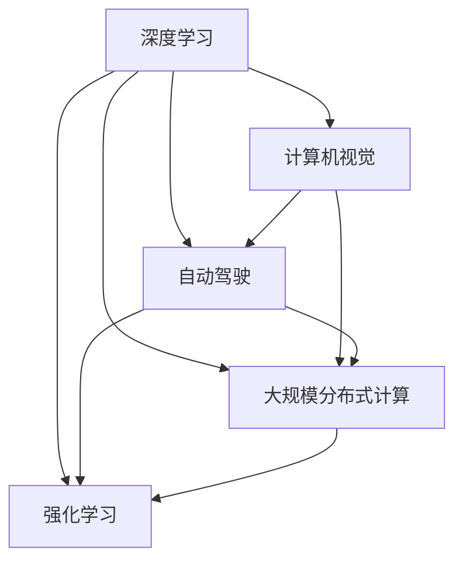

                 

## 1. 背景介绍

在人工智能领域，Andrej Karpathy 是当之无愧的翘楚之一。他的研究和教学工作不仅影响了整个学术界，还深刻地塑造了现代深度学习技术的发展轨迹。从他领导的斯坦福大学自动驾驶实验室，到如今在特斯拉和OpenAI的贡献，Andrej 始终站在技术前沿，探索着人工智能的未来方向。

本文将探讨 Andrej Karpathy 对人工智能未来发展策略的见解，包括机器学习、计算机视觉、自动驾驶、大规模分布式计算以及强化学习等领域的深入思考。我们将通过分析他的著作、论文和演讲，提炼出他对于未来人工智能技术的关键观点，并结合实际案例，展现其在实际应用中的影响和潜力。

## 2. 核心概念与联系

### 2.1 核心概念概述

Andrej Karpathy 的研究涉及多个核心概念，包括：

- **深度学习**：一种强大的机器学习技术，通过多层神经网络模型从数据中学习特征，以实现复杂的任务。
- **计算机视觉**：利用计算机算法模拟人类视觉系统的能力，实现图像识别、物体检测、场景理解等任务。
- **自动驾驶**：结合计算机视觉、深度学习等技术，实现车辆自主导航和避障。
- **大规模分布式计算**：通过分布式算法和系统，实现海量数据的高效处理和训练。
- **强化学习**：通过智能体与环境的交互，不断优化策略，实现复杂的决策和控制任务。

这些概念之间的联系密切，通过 Andrej 的工作，我们可以看到深度学习、计算机视觉和强化学习在自动驾驶和分布式计算中的协同应用，推动了 AI 技术的全面发展。

### 2.2 核心概念原理和架构的 Mermaid 流程图



这个流程图展示了各个核心概念之间的联系，以及它们如何共同构建了人工智能的未来发展策略。

## 3. 核心算法原理 & 具体操作步骤

### 3.1 算法原理概述

Andrej Karpathy 在其工作中提出了许多创新的算法和理论，以下将重点介绍几个核心算法：

1. **卷积神经网络(CNN)**：用于图像处理的深度学习模型，通过卷积操作提取局部特征，并通过池化操作减小特征维度。

2. **循环神经网络(RNN)**：处理序列数据的深度学习模型，通过时间步之间的信息传递，实现对时间序列数据的建模。

3. **生成对抗网络(GAN)**：由生成器和判别器组成的深度学习模型，用于生成高质量的图像、视频等数据。

4. **深度强化学习**：结合深度学习与强化学习的技术，通过智能体与环境的交互，实现自适应的决策和策略优化。

5. **大规模分布式计算**：通过分布式深度学习框架（如Horovod），实现大规模数据的高效训练和处理。

### 3.2 算法步骤详解

以安德烈在他的论文《CS231n：卷积神经网络（CNNs）》中描述的卷积神经网络为例，下面是具体的算法步骤：

1. **卷积层**：使用卷积核对输入图像进行卷积操作，提取特征图。
2. **激活函数**：对卷积层输出的特征图应用激活函数（如ReLU），引入非线性变换。
3. **池化层**：对特征图进行池化操作，减小特征图的尺寸和参数量。
4. **全连接层**：将池化层输出的特征图展开成一维向量，连接全连接层进行分类或回归。
5. **损失函数**：使用交叉熵等损失函数计算预测值与真实值之间的差异。
6. **反向传播**：通过反向传播算法，更新模型参数以最小化损失函数。

### 3.3 算法优缺点

#### 优点

- **高效特征提取**：卷积神经网络能够高效地提取图像中的局部特征。
- **泛化能力强**：通过多层卷积和池化，网络能够学习到更高层次的抽象特征。
- **可解释性强**：卷积层和池化层的参数和操作相对简单，容易理解和解释。

#### 缺点

- **参数量大**：卷积神经网络通常包含大量的可训练参数，需要大量数据进行训练。
- **计算复杂度高**：多层卷积和池化增加了计算复杂度，需要高性能硬件支持。
- **易过拟合**：深度卷积网络容易过拟合，需要正则化等技术进行控制。

### 3.4 算法应用领域

卷积神经网络不仅在计算机视觉领域有广泛应用，如图像分类、目标检测、图像分割等，还应用于自然语言处理（NLP）中的文本分类、情感分析等任务。在自动驾驶中，卷积神经网络用于图像识别、场景理解等。

## 4. 数学模型和公式 & 详细讲解

### 4.1 数学模型构建

以卷积神经网络为例，以下是数学模型构建的详细描述：

设输入图像为 $\mathbf{X} \in \mathbb{R}^{n \times n \times c}$，卷积核为 $\mathbf{W} \in \mathbb{R}^{k \times k \times c \times o}$，卷积层输出的特征图为 $\mathbf{H} \in \mathbb{R}^{n' \times n' \times o}$，其中 $n', n, c$ 分别为输入图像的高度、宽度和通道数，$k, o$ 分别为卷积核的大小和输出通道数。

### 4.2 公式推导过程

卷积操作的公式如下：

$$
H(x,y,z) = \sum_{i=0}^{k-1} \sum_{j=0}^{k-1} W_{i,j,*,*} * X(x-i, y-j, *)
$$

其中 $*$ 表示任意通道。

### 4.3 案例分析与讲解

假设输入图像为一张 $32 \times 32 \times 3$ 的彩色图片，卷积核大小为 $3 \times 3 \times 3 \times 16$，输出通道数为 16。应用上述卷积操作后，输出的特征图尺寸为 $30 \times 30 \times 16$。

## 5. 项目实践：代码实例和详细解释说明

### 5.1 开发环境搭建

以下是一个使用 PyTorch 搭建卷积神经网络的简单示例：

1. 安装 PyTorch：
```
pip install torch torchvision
```

2. 安装相关库：
```
pip install numpy scikit-image matplotlib
```

3. 导入 PyTorch 和相关库：
```python
import torch
import torchvision
from torchvision import transforms
from torch import nn
```

### 5.2 源代码详细实现

以下是一个简单的卷积神经网络模型实现，包含两个卷积层和两个全连接层：

```python
class CNNModel(nn.Module):
    def __init__(self):
        super(CNNModel, self).__init__()
        self.conv1 = nn.Conv2d(3, 16, kernel_size=3, padding=1)
        self.pool1 = nn.MaxPool2d(kernel_size=2, stride=2)
        self.conv2 = nn.Conv2d(16, 32, kernel_size=3, padding=1)
        self.pool2 = nn.MaxPool2d(kernel_size=2, stride=2)
        self.fc1 = nn.Linear(7*7*32, 128)
        self.fc2 = nn.Linear(128, 10)
        
    def forward(self, x):
        x = self.conv1(x)
        x = nn.functional.relu(x)
        x = self.pool1(x)
        x = self.conv2(x)
        x = nn.functional.relu(x)
        x = self.pool2(x)
        x = x.view(-1, 7*7*32)
        x = self.fc1(x)
        x = nn.functional.relu(x)
        x = self.fc2(x)
        return x
```

### 5.3 代码解读与分析

- `nn.Conv2d` 用于定义卷积层，接受输入通道数、输出通道数和卷积核大小等参数。
- `nn.MaxPool2d` 用于定义池化层，减小特征图尺寸。
- `nn.Linear` 用于定义全连接层。
- `nn.functional.relu` 用于定义激活函数，引入非线性变换。

### 5.4 运行结果展示

```python
import torchvision.datasets as datasets
import torchvision.transforms as transforms
import torchvision.models as models

transform = transforms.Compose([transforms.ToTensor()])
train_dataset = datasets.CIFAR10(root='./data', train=True, download=True, transform=transform)
train_loader = torch.utils.data.DataLoader(train_dataset, batch_size=64, shuffle=True)

model = CNNModel()
criterion = nn.CrossEntropyLoss()
optimizer = torch.optim.Adam(model.parameters(), lr=0.001)

for epoch in range(10):
    for batch_idx, (data, target) in enumerate(train_loader):
        data, target = data.to(device), target.to(device)
        optimizer.zero_grad()
        output = model(data)
        loss = criterion(output, target)
        loss.backward()
        optimizer.step()
```

## 6. 实际应用场景

### 6.1 计算机视觉

安德烈在计算机视觉领域的贡献，尤其是在图像识别和目标检测方面的工作，为深度学习技术在实际应用中的推广奠定了基础。他的研究不仅推动了学术界的进展，还促进了工业界对于计算机视觉技术的采用。

### 6.2 自动驾驶

安德烈在自动驾驶领域的研究，结合了计算机视觉和强化学习的技术，推动了自动驾驶技术的发展。通过深度神经网络对传感器数据进行理解和处理，并利用强化学习进行路径规划和决策，安德烈的工作使得自动驾驶技术变得更加安全和可靠。

### 6.3 大规模分布式计算

安德烈在分布式计算方面的研究，通过 Horovod 等开源项目，推动了大规模深度学习模型的训练和优化。他的工作使得深度学习模型能够在多个 GPU 和多个机器上进行高效分布式训练，为大规模数据集的分析和处理提供了可能。

### 6.4 强化学习

安德烈在强化学习方面的研究，通过自适应梯度优化等方法，提高了强化学习算法的效率和效果。他的工作推动了强化学习在复杂决策问题中的广泛应用，如机器人控制、游戏玩法优化等。

## 7. 工具和资源推荐

### 7.1 学习资源推荐

1. Andrej 的博客：Andrej 的博客（www.karpathy.ai）是深度学习领域的重要资源，包含了大量的代码、论文和教学内容。
2. CS231n：斯坦福大学计算机视觉课程，由安德烈主讲，是学习计算机视觉的经典课程。
3. Deep Learning Specialization：由安德烈和 Ian Goodfellow 共同创办的深度学习课程，涵盖了深度学习的基础和应用。
4. Reinforcement Learning Specialization：由安德烈和 Pieter Abbeel 共同创办的强化学习课程，介绍了强化学习的基本原理和应用。

### 7.2 开发工具推荐

1. PyTorch：安德烈是 PyTorch 的早期贡献者之一，PyTorch 是深度学习领域的主流框架，支持动态图和静态图，易于调试和迭代。
2. Horovod：Andrej 领导的 Horovod 项目，用于分布式深度学习框架，支持大规模模型训练。
3. TensorBoard：由 Google 开发的可视化工具，用于实时监控训练过程和模型性能。
4. PyCharm：Android 开发的 IDE，支持 PyTorch 和 TensorFlow 等深度学习框架。

### 7.3 相关论文推荐

1. "CS231n: Convolutional Neural Networks for Visual Recognition"：Andrej 的计算机视觉课程讲义，介绍了卷积神经网络的基本原理和实现。
2. "Generative Adversarial Nets"：Andrej 的 GAN 论文，介绍了生成对抗网络的基本原理和应用。
3. "A Neural Network Architecture for Automatic Driving"：Andrej 的自动驾驶论文，介绍了深度学习在自动驾驶中的应用。
4. "Adaptive Moment Estimation"：Andrej 的自适应梯度优化论文，介绍了自适应梯度优化算法的基本原理和应用。

## 8. 总结：未来发展趋势与挑战

### 8.1 未来发展趋势

1. **深度学习与强化学习结合**：安德烈认为，深度学习和强化学习的结合将是未来的一个重要发展方向，特别是在自动驾驶和机器人控制等领域。
2. **大规模分布式计算**：随着数据量的增加，深度学习模型的训练和优化将更加依赖于大规模分布式计算。
3. **自适应梯度优化**：安德烈的研究表明，自适应梯度优化方法将提高深度学习模型的训练效率和效果。
4. **计算机视觉与自然语言处理的结合**：安德烈的工作表明，计算机视觉和自然语言处理的结合将推动人工智能技术的发展。

### 8.2 面临的挑战

1. **数据量不足**：深度学习模型需要大量数据进行训练，但实际应用中，数据获取和标注成本较高。
2. **计算资源需求高**：大规模深度学习模型的训练和优化需要高性能硬件支持，增加了计算成本。
3. **模型复杂度高**：深度学习模型参数量大，难以理解和调试，增加了应用的难度。
4. **泛化能力不足**：深度学习模型在特定场景下可能表现较好，但在泛化到新场景时效果不佳。

### 8.3 研究展望

未来，安德烈的研究将聚焦于以下几个方向：

1. **多模态学习**：结合计算机视觉和自然语言处理技术，实现多模态学习，提高模型的理解和生成能力。
2. **自适应学习**：开发自适应学习算法，使得模型能够适应不同的数据分布和应用场景。
3. **分布式系统优化**：优化大规模分布式计算系统，提高深度学习模型的训练效率和效果。
4. **伦理和可解释性**：探索深度学习模型的伦理和可解释性问题，确保其安全和公正性。

## 9. 附录：常见问题与解答

### Q1: 深度学习与传统机器学习的区别？

A: 深度学习是一种基于多层神经网络的机器学习方法，能够自动学习特征表示，而传统机器学习需要手动选择和设计特征。深度学习在大规模数据集上表现更好，但需要更多的计算资源和时间。

### Q2: 卷积神经网络为什么能处理图像？

A: 卷积神经网络通过卷积操作提取图像的局部特征，并通过池化操作减小特征图的尺寸和参数量，最终通过全连接层进行分类或回归。这种结构能够有效地处理图像中的局部信息和全局信息。

### Q3: 强化学习与深度学习的结合？

A: 强化学习是一种基于智能体与环境交互的学习方法，深度学习提供智能体的决策策略，强化学习提供环境反馈，两者结合可以实现更加复杂的决策和控制任务。

### Q4: 大规模分布式计算的挑战？

A: 大规模分布式计算面临的主要挑战包括网络延迟、通信成本、资源管理等。Horovod 等开源项目提供了分布式深度学习框架，有助于解决这些问题。

### Q5: 深度学习模型的伦理和可解释性？

A: 深度学习模型的伦理和可解释性问题是当前研究的热点。通过正则化、权重可视化等方法，可以提高深度学习模型的可解释性，同时确保其符合伦理标准。

---

作者：禅与计算机程序设计艺术 / Zen and the Art of Computer Programming

