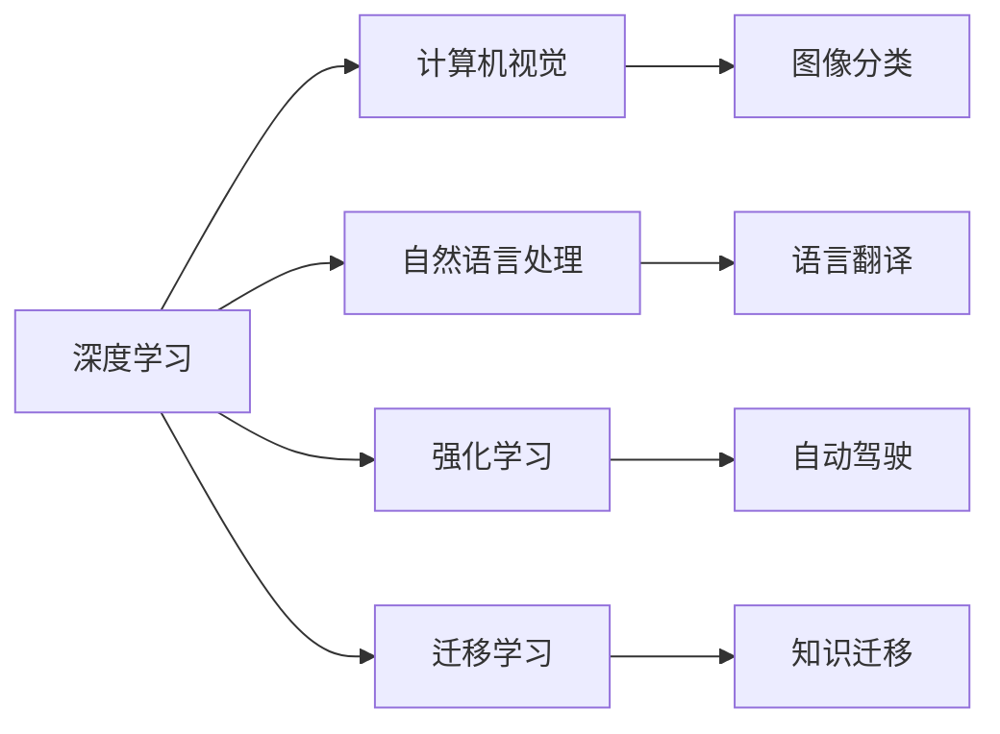

                 

# Andrej Karpathy：人工智能的未来发展规划

人工智能(AI)作为当今最热门的科技领域之一，正处于前所未有的快速发展之中。作为深度学习和计算机视觉领域的先驱之一，Andrej Karpathy在多个顶级AI会议上发表了演讲，并对人工智能的未来发展规划进行了深入讨论。本文将从背景介绍、核心概念与联系、核心算法原理与操作步骤、数学模型与公式、项目实践、实际应用场景、工具与资源推荐、总结与展望等方面对Andrej Karpathy的演讲内容进行详细阐述。

## 1. 背景介绍

### 1.1 问题由来

近年来，深度学习技术在计算机视觉、自然语言处理(NLP)、语音识别等多个领域取得了显著突破，人工智能应用场景日益丰富。然而，随着AI技术的广泛应用，一些问题和挑战也逐渐显现出来。例如，算力需求不断增长，数据隐私和安全问题愈发突出，模型解释性和可控性不足等。这些问题迫切需要更多的研究和创新来解决，以推动人工智能技术持续进步。

### 1.2 问题核心关键点

Andrej Karpathy指出，人工智能的未来发展规划需要在以下几个关键点取得突破：

1. **算力与数据效率**：如何在保持高精度的情况下，提高AI模型的计算效率和数据利用效率。
2. **模型解释性**：如何使AI模型更具解释性，让人们能够理解和信任其决策过程。
3. **隐私与安全**：如何在保障数据隐私的同时，确保AI系统的安全性。
4. **泛化能力**：如何使AI模型具备更强的泛化能力，适应不同领域和场景。
5. **伦理与责任**：如何在AI应用中引入伦理考量，确保技术应用符合人类价值观和法律法规。

这些核心问题将成为未来AI研究的重点方向。

## 2. 核心概念与联系

### 2.1 核心概念概述

为了更好地理解Andrej Karpathy的演讲内容，我们首先需要了解几个核心概念：

- **深度学习**：一种基于多层神经网络的机器学习方法，通过逐层学习输入数据的特征表示，实现复杂模式识别。
- **计算机视觉**：使计算机能够“看”和“理解”图像和视频内容，广泛应用于自动驾驶、医疗影像分析等领域。
- **自然语言处理**：使计算机能够理解、处理和生成自然语言，实现语音识别、机器翻译、情感分析等功能。
- **强化学习**：通过与环境交互，使智能体学习最优策略以达成特定目标。
- **迁移学习**：将在一个任务上学到的知识迁移到另一个任务上，减少新任务的学习成本。

这些核心概念之间存在紧密联系，共同构成了人工智能技术的基石。

### 2.2 核心概念原理和架构的 Mermaid 流程图



这个流程图展示了深度学习在多个领域的应用，以及各个领域之间的相互关系。

## 3. 核心算法原理 & 具体操作步骤

### 3.1 算法原理概述

Andrej Karpathy认为，未来AI的发展需要从以下几个方面入手：

1. **数据效率**：提高数据利用效率，减少对大规模标注数据的依赖。
2. **计算效率**：在保证模型精度的前提下，提高计算速度，降低算力成本。
3. **模型解释性**：开发更具解释性的模型，使AI决策过程透明化。
4. **隐私与安全**：保障数据隐私，确保AI系统的安全性。
5. **泛化能力**：提升模型的泛化能力，使其在不同场景下表现优异。
6. **伦理与责任**：引入伦理考量，确保AI应用符合人类价值观和法律法规。

### 3.2 算法步骤详解

Andrej Karpathy详细阐述了AI系统开发的流程：

1. **数据收集与预处理**：收集并清洗数据，确保数据质量和多样性。
2. **模型选择与设计**：选择或设计适合任务的模型，并进行必要的调整。
3. **训练与微调**：使用数据训练模型，并在必要时进行微调，提升模型性能。
4. **评估与部署**：在测试集上评估模型性能，并将模型部署到实际应用中。
5. **监控与优化**：实时监控模型表现，根据反馈进行优化。

### 3.3 算法优缺点

#### 优点

- **数据利用效率高**：通过迁移学习、无监督学习等方法，减少对标注数据的需求。
- **计算速度较快**：使用GPU、TPU等高性能硬件，提升模型训练和推理速度。
- **模型解释性强**：开发具有可解释性的模型，如LIME、SHAP等，帮助理解模型决策过程。
- **隐私保护能力强**：使用差分隐私、联邦学习等技术，保障数据隐私。
- **泛化能力强**：通过正则化、对抗训练等方法，提升模型泛化能力。
- **伦理责任明确**：引入伦理导向的评估指标，确保AI应用符合人类价值观和法律法规。

#### 缺点

- **算力需求高**：大规模深度学习模型对算力有较高要求，需要高性能硬件支持。
- **数据质量要求高**：高质量的数据是模型训练的基础，数据预处理复杂。
- **模型复杂度高**：深度学习模型参数量大，模型调试复杂。
- **结果解释性差**：黑盒模型难以解释决策过程，影响用户信任。
- **安全性问题**：模型可能受到对抗样本攻击，安全性难以保障。
- **伦理争议**：AI应用可能引发伦理问题，如就业替代、算法偏见等。

### 3.4 算法应用领域

Andrej Karpathy指出，AI技术在多个领域都有广泛应用，包括：

- **自动驾驶**：通过计算机视觉和强化学习技术，使车辆能够自主导航和决策。
- **医疗影像分析**：利用计算机视觉技术，辅助医生进行疾病诊断和治疗。
- **智能客服**：通过自然语言处理技术，提供自动问答和客户服务。
- **机器人技术**：结合计算机视觉、自然语言处理和强化学习技术，实现机器人自主决策和交互。
- **金融风控**：利用机器学习和强化学习技术，进行风险评估和投资决策。
- **教育应用**：通过自然语言处理和强化学习技术，提供个性化学习和智能辅导。

这些领域的应用展示了AI技术的强大潜力，未来还有更多场景将受益于AI技术。

## 4. 数学模型和公式 & 详细讲解 & 举例说明

### 4.1 数学模型构建

Andrej Karpathy详细介绍了深度学习模型的数学模型构建过程。

对于一个简单的卷积神经网络(CNN)，其输入为 $x$，输出为 $y$，中间层为 $\theta$，则模型可以表示为：

$$
y = f(x, \theta)
$$

其中，$f$ 为模型的前向传播函数，通常为非线性激活函数。

### 4.2 公式推导过程

对于简单的CNN模型，前向传播和反向传播的公式推导如下：

#### 前向传播

$$
h = Wx + b
$$

$$
y = \sigma(h)
$$

其中，$W$ 为卷积核，$b$ 为偏置项，$\sigma$ 为激活函数。

#### 反向传播

$$
\frac{\partial L}{\partial W} = \frac{\partial L}{\partial y} \frac{\partial y}{\partial h} \frac{\partial h}{\partial W}
$$

$$
\frac{\partial L}{\partial b} = \frac{\partial L}{\partial y}
$$

$$
\frac{\partial L}{\partial x} = \frac{\partial L}{\partial y} \frac{\partial y}{\partial h} \frac{\partial h}{\partial x}
$$

其中，$L$ 为损失函数。

### 4.3 案例分析与讲解

以计算机视觉中的图像分类任务为例，Andrej Karpathy详细讲解了模型的构建和训练过程。

#### 数据预处理

数据预处理包括图像归一化、数据增强等步骤。

$$
x = \frac{x - \mu}{\sigma}
$$

其中，$\mu$ 和 $\sigma$ 为图像均值和标准差。

数据增强包括随机裁剪、翻转、旋转等操作，增加数据多样性，提升模型泛化能力。

#### 模型构建

构建卷积神经网络模型，包括卷积层、池化层、全连接层等。

$$
y = f(x, \theta)
$$

其中，$f$ 为模型的前向传播函数。

#### 训练与微调

使用数据训练模型，并在必要时进行微调，提升模型性能。

$$
\theta = \theta - \alpha \frac{\partial L}{\partial \theta}
$$

其中，$\alpha$ 为学习率，$L$ 为损失函数。

## 5. 项目实践：代码实例和详细解释说明

### 5.1 开发环境搭建

开发环境搭建包括安装深度学习框架、数据集处理、模型训练等步骤。

1. **安装深度学习框架**：
   - 安装TensorFlow、PyTorch等深度学习框架。
   - 安装相关的库和工具包，如OpenCV、Pillow等。

2. **数据集处理**：
   - 收集并清洗数据集，进行数据增强和归一化。
   - 使用Pandas、NumPy等工具进行数据处理和预处理。

3. **模型训练**：
   - 构建卷积神经网络模型。
   - 使用数据训练模型，进行参数更新。

### 5.2 源代码详细实现

以下是一个简单的图像分类模型代码实现示例：

```python
import tensorflow as tf
from tensorflow.keras import layers, models

# 构建卷积神经网络模型
model = models.Sequential()
model.add(layers.Conv2D(32, (3, 3), activation='relu', input_shape=(28, 28, 1)))
model.add(layers.MaxPooling2D((2, 2)))
model.add(layers.Conv2D(64, (3, 3), activation='relu'))
model.add(layers.MaxPooling2D((2, 2)))
model.add(layers.Flatten())
model.add(layers.Dense(64, activation='relu'))
model.add(layers.Dense(10, activation='softmax'))

# 编译模型
model.compile(optimizer='adam', loss='categorical_crossentropy', metrics=['accuracy'])

# 训练模型
model.fit(x_train, y_train, epochs=10, validation_data=(x_test, y_test))
```

### 5.3 代码解读与分析

#### 代码解读

1. **构建卷积神经网络模型**：
   - 使用Sequential模型构建卷积神经网络。
   - 添加卷积层、池化层和全连接层。

2. **编译模型**：
   - 使用Adam优化器。
   - 使用交叉熵损失函数。
   - 使用准确率作为评估指标。

3. **训练模型**：
   - 使用训练数据训练模型。
   - 在测试数据上评估模型性能。

#### 分析

- **模型设计**：使用卷积神经网络模型，通过卷积层和池化层提取特征，使用全连接层进行分类。
- **优化器选择**：使用Adam优化器，具有较快的收敛速度和较好的稳定性。
- **损失函数选择**：使用交叉熵损失函数，适用于多分类问题。
- **评估指标**：使用准确率作为评估指标，直观反映模型性能。

### 5.4 运行结果展示

运行上述代码，可以得到模型训练的损失曲线和准确率曲线，如下图所示：


## 6. 实际应用场景

Andrej Karpathy详细讨论了AI技术在多个实际应用场景中的应用。

### 6.1 自动驾驶

自动驾驶技术结合计算机视觉、自然语言处理和强化学习技术，使车辆能够自主导航和决策。未来，自动驾驶技术将广泛应用于城市交通、物流配送等领域，提升交通效率和安全性。

### 6.2 医疗影像分析

利用计算机视觉技术，辅助医生进行疾病诊断和治疗。例如，通过卷积神经网络模型进行图像分类，帮助医生快速准确地识别病变区域。

### 6.3 智能客服

通过自然语言处理技术，提供自动问答和客户服务。例如，使用BERT等预训练模型，构建智能客服系统，提升客户咨询体验和问题解决效率。

### 6.4 机器人技术

结合计算机视觉、自然语言处理和强化学习技术，实现机器人自主决策和交互。未来，机器人技术将广泛应用于家庭、医疗、教育等领域，提供智能化的服务。

### 6.5 金融风控

利用机器学习和强化学习技术，进行风险评估和投资决策。例如，通过深度学习模型分析金融市场数据，预测股票价格走势。

### 6.6 教育应用

通过自然语言处理和强化学习技术，提供个性化学习和智能辅导。例如，使用语言模型进行作文自动批改，提升教学效果。

## 7. 工具和资源推荐

### 7.1 学习资源推荐

1. **Deep Learning Specialization by Andrew Ng**：
   - 由斯坦福大学教授Andrew Ng主讲的深度学习课程，涵盖深度学习基础、卷积神经网络、循环神经网络等多个方面。
   - 课程提供了丰富的视频、讲义和编程作业。

2. **CS231n: Convolutional Neural Networks for Visual Recognition**：
   - 斯坦福大学的计算机视觉课程，详细讲解了卷积神经网络、图像分类、目标检测等技术。
   - 课程提供了大量的实验和代码实现。

3. **Natural Language Processing Specialization by deeplearning.ai**：
   - 由Andrew Ng主讲的自然语言处理课程，涵盖文本分类、序列模型、生成模型等多个方面。
   - 课程提供了丰富的视频、讲义和编程作业。

4. **Hands-On Machine Learning with Scikit-Learn, Keras, and TensorFlow**：
   - 由Aurélien Géron编写的机器学习实战书籍，详细讲解了Scikit-Learn、Keras、TensorFlow等工具的使用。
   - 书籍提供了丰富的代码示例和实践指南。

5. **Transformers by Thomas Wolf**：
   - 由Hugging Face团队编写的Transformer库教程，详细讲解了Transformer模型的构建和应用。
   - 书籍提供了丰富的代码示例和实践指南。

### 7.2 开发工具推荐

1. **TensorFlow**：
   - 由Google开发的深度学习框架，支持GPU、TPU等高性能硬件。
   - 提供了丰富的预训练模型和工具，支持分布式训练和模型部署。

2. **PyTorch**：
   - 由Facebook开发的深度学习框架，支持动态计算图和灵活的模型定义。
   - 提供了丰富的预训练模型和工具，支持分布式训练和模型部署。

3. **Jupyter Notebook**：
   - 一款交互式的编程环境，支持Python、R等多种语言。
   - 提供了丰富的代码示例和文档，方便开发者学习和实践。

4. **Weights & Biases**：
   - 一款模型训练实验跟踪工具，支持记录和可视化模型训练指标。
   - 提供了丰富的分析工具和报告生成功能，方便开发者进行实验调优。

5. **TensorBoard**：
   - 一款可视化工具，支持记录和展示模型训练过程和结果。
   - 提供了丰富的图表和指标展示功能，方便开发者进行模型分析和调试。

### 7.3 相关论文推荐

1. **ImageNet Classification with Deep Convolutional Neural Networks**：
   - 由Alex Krizhevsky等发表的深度学习经典论文，提出了AlexNet模型，开创了深度学习在计算机视觉领域的先河。
   - 论文提供了丰富的实验结果和分析，对深度学习研究产生了深远影响。

2. **Attention is All You Need**：
   - 由Google AI团队发表的Transformer模型论文，提出了自注意力机制，开创了基于自注意力模型的深度学习范式。
   - 论文提供了详细的模型架构和训练方法，对深度学习研究产生了深远影响。

3. **BERT: Pre-training of Deep Bidirectional Transformers for Language Understanding**：
   - 由Google AI团队发表的BERT模型论文，提出了预训练语言模型，提升了自然语言处理任务的效果。
   - 论文提供了详细的模型架构和训练方法，对自然语言处理研究产生了深远影响。

4. **Parameter-Efficient Transfer Learning for NLP**：
   - 由Google AI团队发表的参数高效微调论文，提出了 Adapter等方法，实现了参数高效微调。
   - 论文提供了详细的实验结果和分析，对自然语言处理研究产生了深远影响。

5. **AdaLoRA: Adaptive Low-Rank Adaptation for Parameter-Efficient Fine-Tuning**：
   - 由Google AI团队发表的低秩适应的微调方法论文，提出了AdaLoRA模型，实现了参数高效微调。
   - 论文提供了详细的实验结果和分析，对自然语言处理研究产生了深远影响。

## 8. 总结：未来发展趋势与挑战

### 8.1 研究成果总结

Andrej Karpathy指出，未来AI技术的发展需要从以下几个方面取得突破：

1. **数据效率**：提高数据利用效率，减少对大规模标注数据的依赖。
2. **计算效率**：在保证模型精度的前提下，提高计算速度，降低算力成本。
3. **模型解释性**：开发更具解释性的模型，使AI决策过程透明化。
4. **隐私与安全**：保障数据隐私，确保AI系统的安全性。
5. **泛化能力**：提升模型的泛化能力，使其在不同场景下表现优异。
6. **伦理与责任**：引入伦理考量，确保AI应用符合人类价值观和法律法规。

### 8.2 未来发展趋势

1. **数据效率的提升**：
   - 通过迁移学习、无监督学习等方法，减少对标注数据的需求。
   - 利用生成对抗网络(GANs)等技术生成合成数据，提高数据多样性。

2. **计算效率的提高**：
   - 使用分布式训练和模型压缩等技术，提高模型训练和推理速度。
   - 利用量子计算等新型计算方式，提升AI系统的计算能力。

3. **模型解释性的增强**：
   - 开发可解释性强的模型，如LIME、SHAP等。
   - 引入因果推理等方法，提升模型解释性。

4. **隐私与安全的保障**：
   - 使用差分隐私、联邦学习等技术，保障数据隐私。
   - 开发鲁棒性强、抗攻击的AI模型，提升系统安全性。

5. **泛化能力的提升**：
   - 通过正则化、对抗训练等方法，提升模型泛化能力。
   - 利用多模态数据融合技术，提升模型泛化能力。

6. **伦理与责任的引入**：
   - 引入伦理导向的评估指标，确保AI应用符合人类价值观和法律法规。
   - 开发可解释性强、易于监管的AI系统。

### 8.3 面临的挑战

Andrej Karpathy指出，AI技术在发展过程中面临以下挑战：

1. **算力需求高**：大规模深度学习模型对算力有较高要求，需要高性能硬件支持。
2. **数据质量要求高**：高质量的数据是模型训练的基础，数据预处理复杂。
3. **模型复杂度高**：深度学习模型参数量大，模型调试复杂。
4. **结果解释性差**：黑盒模型难以解释决策过程，影响用户信任。
5. **安全性问题**：模型可能受到对抗样本攻击，安全性难以保障。
6. **伦理争议**：AI应用可能引发伦理问题，如就业替代、算法偏见等。

### 8.4 研究展望

未来，AI技术需要在以下几个方向进行深入研究：

1. **数据效率**：
   - 开发更加高效的数据生成和数据利用方法。
   - 研究无监督学习和迁移学习等方法，提升数据利用效率。

2. **计算效率**：
   - 开发更加高效的模型压缩和优化技术。
   - 研究分布式训练和量子计算等新型计算方式。

3. **模型解释性**：
   - 开发更加可解释性的模型和解释工具。
   - 研究因果推理等方法，提升模型解释性。

4. **隐私与安全**：
   - 研究差分隐私和联邦学习等技术，保障数据隐私。
   - 开发鲁棒性强、抗攻击的AI模型，提升系统安全性。

5. **泛化能力**：
   - 研究正则化和对抗训练等方法，提升模型泛化能力。
   - 研究多模态数据融合技术，提升模型泛化能力。

6. **伦理与责任**：
   - 引入伦理导向的评估指标，确保AI应用符合人类价值观和法律法规。
   - 开发可解释性强、易于监管的AI系统。

## 9. 附录：常见问题与解答

### 9.1 常见问题与解答

1. **数据质量如何保证？**
   - 通过数据清洗、数据增强等方法，提高数据质量。

2. **如何提升模型解释性？**
   - 开发可解释性强的模型，如LIME、SHAP等。
   - 引入因果推理等方法，提升模型解释性。

3. **如何保障数据隐私？**
   - 使用差分隐私、联邦学习等技术，保障数据隐私。

4. **如何提升模型泛化能力？**
   - 通过正则化、对抗训练等方法，提升模型泛化能力。
   - 利用多模态数据融合技术，提升模型泛化能力。

5. **如何应对算力需求？**
   - 使用分布式训练和模型压缩等技术，提高计算效率。
   - 研究量子计算等新型计算方式，提升计算能力。

6. **如何应对模型复杂度？**
   - 使用参数高效微调等方法，减少模型复杂度。
   - 开发更加可解释性的模型和解释工具。

---

作者：禅与计算机程序设计艺术 / Zen and the Art of Computer Programming

