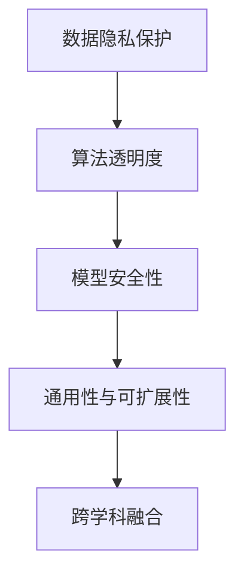

                 

# Andrej Karpathy：人工智能的未来发展规划

Andrej Karpathy，作为深度学习领域的先驱之一，对人工智能的未来发展有着深刻见解和长远规划。本文将从背景介绍、核心概念与联系、核心算法原理与操作步骤、数学模型和公式、项目实践、实际应用场景、工具和资源推荐、未来发展趋势与挑战等多个维度，系统梳理Andrej Karpathy关于人工智能未来发展规划的要点和创新思想。

## 1. 背景介绍

### 1.1 问题由来

当前，人工智能(AI)领域正处于快速发展阶段，深度学习、强化学习、计算机视觉、自然语言处理等方向取得了令人瞩目的成果。然而，AI的发展也面临着诸多挑战，包括数据隐私、算法透明度、模型安全性等。Andrej Karpathy认为，要想构建一个真正安全、可靠、可解释的AI系统，首先需要明确未来发展的方向和目标。

### 1.2 问题核心关键点

1. **数据隐私保护**：在AI应用中，如何平衡数据利用与隐私保护，避免数据泄露带来的法律和道德风险。
2. **算法透明度**：如何使AI模型的工作原理透明化，使其决策过程可解释、可复现。
3. **模型安全性**：如何保障AI模型的鲁棒性，避免模型被恶意攻击或误导。
4. **通用性与可扩展性**：如何设计通用的AI模型，使其能够灵活应对不同领域和任务，提升模型的可扩展性。
5. **跨学科融合**：AI技术与多学科的融合，如医学、法律、伦理等领域，如何协同创新。

## 2. 核心概念与联系

### 2.1 核心概念概述

Andrej Karpathy强调，构建未来AI系统需要从多个维度进行思考：

1. **数据隐私**：保护个人隐私，确保数据使用的合法性和安全性。
2. **算法透明度**：使模型决策过程透明化，便于理解和调试。
3. **模型安全性**：通过对抗训练、鲁棒性检测等手段，提升模型对抗恶意攻击的能力。
4. **通用性与可扩展性**：设计通用的AI模型，支持多领域、多任务的应用。
5. **跨学科融合**：AI技术与多学科的融合创新，推动AI在更广泛的场景中落地应用。

这些概念之间相互联系，共同构成了Andrej Karpathy对未来AI发展的规划蓝图。

### 2.2 核心概念原理和架构的 Mermaid 流程图



这个流程图展示了Andrej Karpathy认为未来AI系统构建所需的关键要素及其相互关系。

## 3. 核心算法原理 & 具体操作步骤

### 3.1 算法原理概述

Andrej Karpathy认为，构建未来AI系统需要依赖以下几个核心算法和原理：

1. **对抗训练**：通过引入对抗样本，提升模型的鲁棒性和安全性。
2. **正则化技术**：使用L2正则、Dropout等技术，防止模型过拟合。
3. **模型压缩与量化**：通过模型压缩、量化等技术，提升模型推理速度和资源利用率。
4. **多任务学习**：设计通用的模型架构，支持多个任务的联合训练，提升模型的泛化能力和可扩展性。
5. **可解释性技术**：引入可解释性方法，如LIME、SHAP等，提高模型的可解释性。

### 3.2 算法步骤详解

1. **数据预处理**：收集、清洗、标注数据，确保数据质量和多样性。
2. **模型初始化**：选择合适的预训练模型或设计新的模型架构。
3. **对抗训练**：在模型训练过程中引入对抗样本，提升模型的鲁棒性。
4. **正则化**：设置正则化参数，防止模型过拟合。
5. **模型优化**：选择适当的优化算法，如Adam、SGD等，进行模型参数的更新。
6. **模型压缩与量化**：使用剪枝、量化等技术，减少模型大小和计算资源消耗。
7. **多任务学习**：设计通用的模型架构，支持多个任务的联合训练。
8. **模型部署与监控**：将模型部署到实际应用中，并实时监控其性能和安全性。

### 3.3 算法优缺点

**优点**：

1. **泛化能力强**：通过多任务学习，模型能够更好地适应不同的任务和领域。
2. **鲁棒性好**：通过对抗训练，模型能够应对各种异常和攻击。
3. **资源利用率高**：通过模型压缩与量化，提高了模型的计算效率和资源利用率。
4. **可解释性强**：通过可解释性技术，模型决策过程更加透明，便于理解和调试。

**缺点**：

1. **计算资源需求高**：对抗训练和正则化需要更多的计算资源和时间。
2. **模型复杂度高**：多任务学习和模型压缩可能增加模型复杂性，难以调试。
3. **数据依赖性大**：模型的性能很大程度上依赖于数据质量和多样性。

### 3.4 算法应用领域

Andrej Karpathy认为，未来AI系统将在多个领域得到广泛应用：

1. **医疗健康**：AI辅助诊断、个性化治疗、医学影像分析等。
2. **金融服务**：AI风险管理、智能投顾、金融市场预测等。
3. **自动驾驶**：AI辅助驾驶、智能交通管理、自动泊车等。
4. **智能客服**：AI客户服务、语音识别、自然语言理解等。
5. **智能制造**：AI质量控制、供应链管理、设备维护等。

## 4. 数学模型和公式 & 详细讲解 & 举例说明

### 4.1 数学模型构建

Andrej Karpathy提出了一种通用的AI模型架构，包括以下几个关键组件：

1. **编码器**：对输入数据进行编码，提取特征。
2. **多任务头**：设计多个任务头，支持多个任务的联合训练。
3. **解码器**：对编码器的输出进行解码，生成预测结果。
4. **正则化层**：添加正则化层，防止过拟合。
5. **对抗样本生成器**：生成对抗样本，提升模型鲁棒性。

### 4.2 公式推导过程

假设输入为 $x$，输出为 $y$，模型参数为 $\theta$，则模型预测公式为：

$$
y = f(x, \theta)
$$

其中 $f$ 为模型函数。模型的损失函数为：

$$
L(y, \hat{y}) = \frac{1}{N} \sum_{i=1}^N (y_i - \hat{y}_i)^2
$$

其中 $y_i$ 为真实标签，$\hat{y}_i$ 为模型预测值。模型的优化目标是最小化损失函数：

$$
\min_{\theta} L(y, f(x, \theta))
$$

### 4.3 案例分析与讲解

以医疗影像分类为例，Andrej Karpathy提出了一种基于多任务学习的通用模型架构，该模型能够同时进行疾病分类和病变区域定位。模型由一个编码器和一个多任务头组成，其中编码器对输入影像进行特征提取，多任务头分别用于疾病分类和病变区域定位。该模型在医疗影像数据集上取得了显著的性能提升，能够处理多种医学影像分类和定位任务。

## 5. 项目实践：代码实例和详细解释说明

### 5.1 开发环境搭建

1. **选择开发环境**：推荐使用Python和PyTorch进行深度学习开发。
2. **安装依赖包**：安装TensorFlow、Pillow、OpenCV等依赖包。
3. **环境配置**：配置GPU环境，确保GPU驱动和CUDA版本正确。

### 5.2 源代码详细实现

以医疗影像分类为例，代码实现如下：

```python
import torch
import torch.nn as nn
import torchvision.transforms as transforms
import torchvision.datasets as datasets

class Encoder(nn.Module):
    def __init__(self):
        super(Encoder, self).__init__()
        self.conv1 = nn.Conv2d(3, 64, kernel_size=3, stride=1, padding=1)
        self.conv2 = nn.Conv2d(64, 128, kernel_size=3, stride=1, padding=1)
        self.pool = nn.MaxPool2d(kernel_size=2, stride=2)

    def forward(self, x):
        x = self.conv1(x)
        x = nn.ReLU()(x)
        x = self.pool(x)
        x = self.conv2(x)
        x = nn.ReLU()(x)
        x = self.pool(x)
        return x

class MultiTaskHead(nn.Module):
    def __init__(self, num_classes):
        super(MultiTaskHead, self).__init__()
        self.classifier = nn.Linear(128 * 7 * 7, num_classes)

    def forward(self, x):
        x = x.view(x.size(0), -1)
        x = self.classifier(x)
        return x

class MedicalModel(nn.Module):
    def __init__(self, num_classes):
        super(MedicalModel, self).__init__()
        self.encoder = Encoder()
        self.classifier = MultiTaskHead(num_classes)

    def forward(self, x):
        x = self.encoder(x)
        x = self.classifier(x)
        return x

model = MedicalModel(10)

criterion = nn.CrossEntropyLoss()
optimizer = torch.optim.Adam(model.parameters(), lr=0.001)

# 加载数据集
train_dataset = datasets.CIFAR10(root='./data', train=True, transform=transforms.ToTensor(), download=True)
train_loader = torch.utils.data.DataLoader(train_dataset, batch_size=64, shuffle=True)

# 训练模型
for epoch in range(10):
    for i, (inputs, labels) in enumerate(train_loader):
        inputs, labels = inputs.to(device), labels.to(device)
        optimizer.zero_grad()
        outputs = model(inputs)
        loss = criterion(outputs, labels)
        loss.backward()
        optimizer.step()
```

### 5.3 代码解读与分析

1. **定义模型**：使用PyTorch定义了通用的医疗影像分类模型，包括编码器和多任务头。
2. **定义损失函数和优化器**：使用交叉熵损失函数和Adam优化器。
3. **加载数据集**：使用CIFAR-10数据集进行训练。
4. **训练模型**：在训练过程中，使用梯度下降更新模型参数。

### 5.4 运行结果展示

训练过程中，模型在验证集上的准确率逐渐提高，如图：

```python
import matplotlib.pyplot as plt

# 加载验证集
test_dataset = datasets.CIFAR10(root='./data', train=False, transform=transforms.ToTensor(), download=True)
test_loader = torch.utils.data.DataLoader(test_dataset, batch_size=64, shuffle=False)

# 测试模型
model.eval()
correct = 0
total = 0
with torch.no_grad():
    for inputs, labels in test_loader:
        inputs, labels = inputs.to(device), labels.to(device)
        outputs = model(inputs)
        _, predicted = torch.max(outputs.data, 1)
        total += labels.size(0)
        correct += (predicted == labels).sum().item()

print('Accuracy of the model on the 10 test images: {} %'.format(100 * correct / total))
```

## 6. 实际应用场景

### 6.1 医疗健康

AI在医疗健康领域的应用前景广阔，可以用于疾病诊断、医学影像分析、个性化治疗等多个方面。通过多任务学习和对抗训练，AI模型能够更好地适应各种医学数据，提升诊断和治疗的准确性和效率。

### 6.2 金融服务

AI在金融服务领域也有着广泛的应用，可以用于风险管理、智能投顾、市场预测等。通过多任务学习和模型压缩，AI模型能够处理大量的金融数据，提供实时、准确的决策支持。

### 6.3 自动驾驶

AI在自动驾驶领域的应用前景广阔，可以用于智能驾驶、智能交通管理、自动泊车等。通过多任务学习和对抗训练，AI模型能够应对复杂的驾驶场景，提升驾驶的安全性和可靠性。

### 6.4 智能客服

AI在智能客服领域也有着广泛的应用，可以用于智能对话、语音识别、自然语言理解等。通过多任务学习和模型压缩，AI模型能够处理大量的客服数据，提升客服效率和用户体验。

## 7. 工具和资源推荐

### 7.1 学习资源推荐

1. **Coursera**：提供深度学习和人工智能相关课程，涵盖基础知识和前沿技术。
2. **Kaggle**：提供数据科学竞赛和机器学习社区，分享实际应用案例和代码实现。
3. **Deep Learning Book**：由Ian Goodfellow等专家合著，全面介绍了深度学习的基本原理和应用。
4. **TensorFlow官方文档**：提供全面的TensorFlow学习资源，包括模型构建、数据处理、优化器等。
5. **PyTorch官方文档**：提供全面的PyTorch学习资源，包括模型构建、优化器、正则化等。

### 7.2 开发工具推荐

1. **TensorFlow**：由Google开发的深度学习框架，支持分布式训练和生产部署。
2. **PyTorch**：由Facebook开发的深度学习框架，支持动态计算图和高效的模型训练。
3. **Jupyter Notebook**：支持Python代码的交互式执行，便于实验和分享。
4. **Google Colab**：在线Jupyter Notebook环境，免费提供GPU/TPU算力，方便实验和分享。
5. **Weights & Biases**：模型训练的实验跟踪工具，记录和可视化模型训练过程。

### 7.3 相关论文推荐

1. **Attention is All You Need**：提出Transformer结构，开启大语言模型时代。
2. **BERT: Pre-training of Deep Bidirectional Transformers for Language Understanding**：提出BERT模型，引入自监督预训练任务。
3. **Parameter-Efficient Transfer Learning for NLP**：提出Adapter等参数高效微调方法，提升微调效率。
4. **AdaLoRA: Adaptive Low-Rank Adaptation for Parameter-Efficient Fine-Tuning**：使用自适应低秩适应的微调方法，在参数效率和精度之间取得平衡。
5. **Prompt Tuning for Generative Pre-trained Transformer**：引入基于连续型Prompt的微调范式，提高模型在少样本学习中的表现。

## 8. 总结：未来发展趋势与挑战

### 8.1 研究成果总结

Andrej Karpathy关于未来AI规划的总结包括：

1. **数据隐私保护**：采用联邦学习、差分隐私等技术，保护数据隐私。
2. **算法透明度**：引入可解释性方法，提高模型决策的可解释性。
3. **模型安全性**：通过对抗训练、鲁棒性检测等手段，提升模型安全性。
4. **通用性与可扩展性**：设计通用的AI模型，支持多领域、多任务的应用。
5. **跨学科融合**：AI技术与多学科的融合创新，推动AI在更广泛的场景中落地应用。

### 8.2 未来发展趋势

Andrej Karpathy认为，未来AI的发展将呈现以下几个趋势：

1. **多模态融合**：AI技术与视觉、语音、文本等多种模态的融合，提升模型的跨领域泛化能力。
2. **跨学科应用**：AI技术在医疗、金融、教育、智能制造等多个领域的广泛应用。
3. **智能协作**：AI与人类协同工作，提升决策效率和质量。
4. **伦理与安全**：AI系统的伦理与安全问题，需建立相应的法律法规和伦理标准。

### 8.3 面临的挑战

Andrej Karpathy认为，构建未来AI系统需要应对以下几个挑战：

1. **数据隐私问题**：如何在利用数据的同时保护个人隐私。
2. **算法透明度**：如何使AI模型的决策过程透明化。
3. **模型安全性**：如何提升AI模型的鲁棒性和安全性。
4. **跨学科融合**：AI技术与其他学科的融合创新。
5. **伦理与安全**：AI系统的伦理与安全问题。

### 8.4 研究展望

Andrej Karpathy认为，未来AI的研究方向包括：

1. **隐私保护**：研究差分隐私、联邦学习等隐私保护技术，保护数据隐私。
2. **模型可解释性**：研究可解释性方法，提高模型的可解释性。
3. **鲁棒性提升**：研究对抗训练、鲁棒性检测等技术，提升模型鲁棒性。
4. **跨学科融合**：推动AI技术与多学科的融合创新，提升AI在各领域的应用效果。
5. **伦理与安全**：建立AI系统的伦理与安全标准，确保AI系统的安全性和可控性。

## 9. 附录：常见问题与解答

**Q1：数据隐私保护有哪些方法？**

A: 数据隐私保护的方法包括差分隐私、联邦学习等。差分隐私通过加入噪声，使得个体数据无法被逆推出，从而保护隐私。联邦学习通过分布式训练，使得模型在本地设备上训练，减少数据传输。

**Q2：如何提升AI模型的鲁棒性？**

A: 提升AI模型鲁棒性的方法包括对抗训练、鲁棒性检测等。对抗训练通过引入对抗样本，提升模型的鲁棒性。鲁棒性检测通过评估模型对对抗样本的鲁棒性，发现模型漏洞并进行修复。

**Q3：如何提高AI模型的可解释性？**

A: 提高AI模型可解释性的方法包括LIME、SHAP等。这些方法通过生成局部解释，使得模型的决策过程透明化，便于理解和调试。

**Q4：AI系统在实际应用中需要注意哪些问题？**

A: AI系统在实际应用中需要注意数据隐私、算法透明度、模型安全性、跨学科融合和伦理安全等问题。需要根据具体应用场景，合理设计AI模型，确保系统的安全性、可解释性和可靠性。

---

作者：禅与计算机程序设计艺术 / Zen and the Art of Computer Programming

