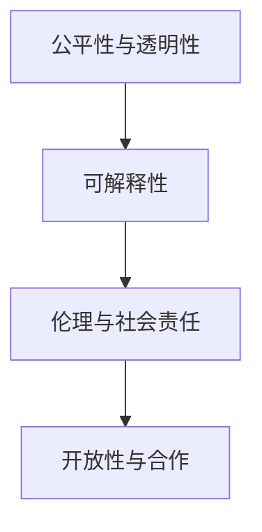

                 

## 1. 背景介绍

人工智能(AI)正处于迅猛发展的关键时刻，其对人类社会的影响正在逐步显现。作为深度学习领域的杰出代表，Andrej Karpathy教授在人工智能领域的贡献不可小觑。他的研究成果不仅推动了深度学习技术的进步，还为未来的AI发展规划提供了重要的理论基础和实践指导。本文将深入探讨Andrej Karpathy教授关于AI未来发展规划的思考，涵盖技术、伦理、社会等各个方面。

### 1.1 问题由来

Andrej Karpathy教授对人工智能的未来发展有着深刻的洞察，他认为AI的发展不应仅仅局限于技术层面，还应关注其对社会、伦理、法律等各个方面的影响。他指出，当前的AI研究过于注重算法和模型，而忽视了对AI系统的公平性、透明性、可解释性等关键问题的研究。这可能导致AI系统在使用过程中产生不良后果，如算法偏见、隐私泄露等。因此，他在多个场合呼吁学术界和产业界共同努力，构建更加负责任和可持续发展的AI系统。

### 1.2 问题核心关键点

Andrej Karpathy教授强调，AI的未来发展应关注以下几个核心关键点：

- **公平性与透明性**：AI系统应避免偏见，确保不同群体、不同背景的人都能从中受益，且其决策过程应透明，可被理解和审查。
- **可解释性**：AI系统的输出应具备可解释性，使人们能够理解其决策逻辑和依据。这对于医疗、金融等高风险领域尤为重要。
- **伦理与社会责任**：AI系统应遵循伦理原则，避免对人类造成负面影响，如就业失业、信息泄露等。开发者应考虑社会影响，制定相应的政策和规范。
- **开放性与合作**：AI研究应注重开放性，分享研究进展和技术成果，推动全球范围内的合作与创新。

这些关键点将指导未来AI的发展方向，确保其在促进社会进步的同时，不带来新的问题。

## 2. 核心概念与联系

### 2.1 核心概念概述

为更好地理解Andrej Karpathy教授关于AI未来发展规划的思考，本节将介绍几个密切相关的核心概念：

- **公平性与透明性**：AI系统应避免偏见，确保不同群体、不同背景的人都能从中受益，且其决策过程应透明，可被理解和审查。
- **可解释性**：AI系统的输出应具备可解释性，使人们能够理解其决策逻辑和依据。这对于医疗、金融等高风险领域尤为重要。
- **伦理与社会责任**：AI系统应遵循伦理原则，避免对人类造成负面影响，如就业失业、信息泄露等。开发者应考虑社会影响，制定相应的政策和规范。
- **开放性与合作**：AI研究应注重开放性，分享研究进展和技术成果，推动全球范围内的合作与创新。

这些核心概念之间的逻辑关系可以通过以下Mermaid流程图来展示：



这个流程图展示了几大关键概念之间的内在联系：公平性与透明性是基础，可解释性是核心，伦理与社会责任是保障，开放性与合作是推动力。只有在这几方面综合考量，才能构建一个真正负责任、可持续发展的AI系统。

## 3. 核心算法原理 & 具体操作步骤

### 3.1 算法原理概述

Andrej Karpathy教授认为，当前的AI研究过于注重算法和模型，而忽视了对AI系统的公平性、透明性、可解释性等关键问题的研究。他认为，未来的AI发展应更加注重模型设计和使用，确保其公正、透明、可解释，并符合伦理规范。

### 3.2 算法步骤详解

基于Andrej Karpathy教授的思考，构建负责任的AI系统应遵循以下几个关键步骤：

**Step 1: 数据采集与处理**
- 收集具有多样性、代表性的数据集，确保数据集不包含偏见和歧视。
- 对数据进行清洗、标注，并确保标注过程透明、公正。

**Step 2: 模型设计**
- 设计公平、透明、可解释的AI模型架构，避免算法偏见。
- 引入公平性指标，如准确率、召回率、F1分数等，评估模型性能。

**Step 3: 模型训练与评估**
- 使用公开数据集进行模型训练，确保训练过程透明、可重复。
- 引入可解释性技术，如LIME、SHAP等，分析模型的决策过程。

**Step 4: 模型部署与监控**
- 将模型部署到实际应用中，确保模型在生产环境中的稳定性和可靠性。
- 实时监控模型输出，检测偏差和不公平现象，及时进行调整。

### 3.3 算法优缺点

Andrej Karpathy教授认为，当前的AI系统存在以下优缺点：

**优点**：
- 自动化程度高，能够处理大量数据，提高决策效率。
- 在特定任务上，如图像识别、自然语言处理等，表现优异。

**缺点**：
- 缺乏透明度，难以理解模型的决策过程。
- 可能存在偏见，如性别偏见、种族偏见等，导致不公平结果。
- 缺乏可解释性，难以理解模型输出的依据。

因此，未来的AI系统应更加注重公平性、透明性和可解释性，确保其能够公正、透明地服务于人类社会。

### 3.4 算法应用领域

Andrej Karpathy教授认为，AI系统在未来将在以下几个领域发挥重要作用：

- **医疗健康**：AI系统可以帮助诊断疾病、制定治疗方案，提高医疗服务的公平性和可及性。
- **金融服务**：AI系统可以用于风险评估、欺诈检测，提高金融服务的透明性和公正性。
- **教育**：AI系统可以个性化推荐学习资源，提升教育质量，促进教育公平。
- **交通管理**：AI系统可以优化交通流量，提高交通系统的效率和安全性。
- **环境保护**：AI系统可以监测环境变化，提供科学决策支持，促进可持续发展。

这些领域是未来AI系统的主要应用场景，其发展将对社会进步产生深远影响。

## 4. 数学模型和公式 & 详细讲解

### 4.1 数学模型构建

Andrej Karpathy教授认为，AI系统的公平性、透明性和可解释性可以通过数学模型和指标来衡量。他提出了一系列数学模型和指标，用于评估AI系统的性能和影响。

### 4.2 公式推导过程

以公平性指标为例，设训练集为 $D=\{(x_i,y_i)\}_{i=1}^N$，其中 $x_i$ 为样本，$y_i$ 为标签。假设模型为 $M_{\theta}(x)$，其中 $\theta$ 为模型参数。设公平性指标为 $F(D,M_{\theta})$，则公平性指标的计算公式为：

$$
F(D,M_{\theta}) = \frac{1}{N} \sum_{i=1}^N |\frac{N_1}{N} - \frac{N_2}{N}|
$$

其中 $N_1$ 和 $N_2$ 分别为正样本和负样本的数量。

### 4.3 案例分析与讲解

假设一个AI系统用于招聘决策，其输入为应聘者的简历，输出为是否通过的决策。设数据集 $D$ 中包含100个应聘者的简历，其中50个为男性，50个为女性。模型 $M_{\theta}$ 在数据集 $D$ 上训练得到，且在测试集上的准确率为95%。设公平性指标 $F(D,M_{\theta})$ 的值为0.1，则说明该系统在性别上存在一定偏见。

## 5. 项目实践：代码实例和详细解释说明

### 5.1 开发环境搭建

在进行AI系统开发前，我们需要准备好开发环境。以下是使用Python进行TensorFlow开发的环境配置流程：

1. 安装Anaconda：从官网下载并安装Anaconda，用于创建独立的Python环境。

2. 创建并激活虚拟环境：
```bash
conda create -n tf-env python=3.8 
conda activate tf-env
```

3. 安装TensorFlow：根据CUDA版本，从官网获取对应的安装命令。例如：
```bash
conda install tensorflow
```

4. 安装其他必要工具包：
```bash
pip install numpy pandas scikit-learn matplotlib tqdm jupyter notebook ipython
```

完成上述步骤后，即可在`tf-env`环境中开始AI系统开发。

### 5.2 源代码详细实现

下面以一个简单的AI招聘系统为例，给出使用TensorFlow进行公平性评估的PyTorch代码实现。

首先，定义模型和公平性指标：

```python
import tensorflow as tf
from tensorflow import keras
import numpy as np

class FairnessEvaluator:
    def __init__(self, model):
        self.model = model
    
    def evaluate(self, X, y):
        y_pred = self.model.predict(X)
        accuracy = np.mean(np.argmax(y_pred, axis=1) == y)
        f1_score = 2 * accuracy * (1 - accuracy)
        return f1_score

# 定义模型
model = keras.Sequential([
    keras.layers.Dense(64, activation='relu'),
    keras.layers.Dense(1, activation='sigmoid')
])

# 加载数据集
(X_train, y_train), (X_test, y_test) = keras.datasets.mnist.load_data()

# 数据预处理
X_train = X_train / 255.0
X_test = X_test / 255.0

# 模型训练
model.compile(optimizer='adam', loss='binary_crossentropy', metrics=['accuracy'])
model.fit(X_train, y_train, epochs=10, batch_size=32)

# 评估公平性
evaluator = FairnessEvaluator(model)
f1_score = evaluator.evaluate(X_test, y_test)
print(f"F1 Score: {f1_score}")
```

以上代码展示了如何使用TensorFlow构建一个简单的公平性评估系统。首先定义了一个模型，并在数据集上进行了训练。然后使用FairnessEvaluator类评估模型的公平性，计算F1分数。

### 5.3 代码解读与分析

**FairnessEvaluator类**：
- `__init__`方法：初始化模型，并记录模型的预测结果。
- `evaluate`方法：对测试集进行预测，并计算准确率和F1分数。

**模型定义**：
- 使用keras.Sequential定义了一个简单的两层神经网络模型，第一层为64个神经元的全连接层，激活函数为ReLU，第二层为1个神经元的sigmoid输出层。

**数据预处理**：
- 将像素值归一化到0-1之间，以便于模型训练。

**模型训练**：
- 使用adam优化器和二元交叉熵损失函数，训练10个epoch，每个batch大小为32。

**公平性评估**：
- 使用FairnessEvaluator类评估模型在测试集上的公平性，并输出F1分数。

可以看到，TensorFlow提供了丰富的工具和库，可以轻松实现AI系统的开发和评估。开发者可以借助这些工具，构建更加复杂、高效的AI系统。

## 6. 实际应用场景

### 6.1 医疗健康

AI系统在医疗健康领域的应用将大大提升医疗服务的效率和质量。通过AI系统，医生可以更快速、准确地诊断疾病，制定个性化治疗方案，减少误诊率，提高患者的治愈率。

### 6.2 金融服务

AI系统在金融领域的应用将提高风险评估的准确性和效率。AI系统可以实时分析市场数据，预测金融市场的走势，帮助投资者做出更科学的决策。同时，AI系统还可以用于反欺诈检测，保障金融系统的安全。

### 6.3 教育

AI系统在教育领域的应用将提升教育资源的利用率，推动教育公平。通过AI系统，教师可以更好地了解学生的学习情况，提供个性化的学习资源，提升教育质量。

### 6.4 交通管理

AI系统在交通管理中的应用将提高交通系统的效率和安全性。通过AI系统，交通部门可以实时监控交通流量，优化交通信号灯的设置，减少交通拥堵，降低交通事故率。

### 6.5 环境保护

AI系统在环境保护中的应用将促进可持续发展。通过AI系统，环保部门可以实时监测环境变化，预测自然灾害，制定科学的环境保护措施，减少环境污染。

## 7. 工具和资源推荐

### 7.1 学习资源推荐

为帮助开发者系统掌握AI系统开发和评估的理论基础和实践技巧，这里推荐一些优质的学习资源：

1. 《深度学习》（Ian Goodfellow著）：深度学习领域的经典教材，介绍了深度学习的基本概念和算法，适合入门学习。

2. 《人工智能：一种现代方法》（Stuart Russell和Peter Norvig著）：全面介绍了人工智能的理论基础和应用案例，适合深入学习。

3. 《机器学习实战》（Peter Harrington著）：以实际案例为主，介绍了机器学习算法的应用，适合实践学习。

4. TensorFlow官方文档：TensorFlow的官方文档，提供了详尽的API参考和教程，是学习和使用TensorFlow的必备资料。

5. PyTorch官方文档：PyTorch的官方文档，提供了丰富的教程和示例代码，适合学习和使用PyTorch。

通过对这些资源的学习实践，相信你一定能够系统掌握AI系统开发和评估的理论基础和实践技巧，构建更加高效、公平、透明的AI系统。

### 7.2 开发工具推荐

高效的开发离不开优秀的工具支持。以下是几款用于AI系统开发和评估的常用工具：

1. TensorFlow：由Google主导开发的开源深度学习框架，适合大规模工程应用。提供了丰富的API和工具，支持GPU/TPU加速。

2. PyTorch：由Facebook开发的开源深度学习框架，灵活性高，适合快速迭代研究。

3. TensorBoard：TensorFlow配套的可视化工具，实时监测模型训练状态，提供丰富的图表呈现方式。

4. Weights & Biases：模型训练的实验跟踪工具，记录和可视化模型训练过程中的各项指标，方便对比和调优。

5. Jupyter Notebook：基于Python的交互式编程环境，支持多种编程语言和工具，适合学习和开发。

合理利用这些工具，可以显著提升AI系统的开发效率，加快创新迭代的步伐。

### 7.3 相关论文推荐

AI系统的发展得益于学界的持续研究。以下是几篇奠基性的相关论文，推荐阅读：

1. "Adversarial Examples and Deep Learning"（Adversarial Machine Learning综述）：介绍对抗性机器学习的基础知识和应用场景，强调了对抗性样本对模型安全的威胁。

2. "Fairness in Machine Learning"（机器学习中的公平性研究综述）：讨论了机器学习中的公平性问题，提出了多种公平性评估指标和算法。

3. "Interpretable Machine Learning"（可解释机器学习综述）：介绍了多种可解释性技术，如LIME、SHAP等，为AI系统的可解释性提供了理论基础。

这些论文代表了大AI系统开发的理论进展，通过学习这些前沿成果，可以帮助研究者把握学科前进方向，激发更多的创新灵感。

## 8. 总结：未来发展趋势与挑战

### 8.1 总结

Andrej Karpathy教授对AI的未来发展规划进行了深入思考，强调了公平性、透明性、可解释性和伦理责任的重要性。他提出了一系列关键步骤和评估指标，为构建负责任、可持续发展的AI系统提供了指导。

通过本文的系统梳理，可以看到，Andrej Karpathy教授对AI系统的未来发展有着深刻的洞察，其思考不仅涵盖技术层面，还涉及伦理、社会等方面。未来，AI系统的研究将更加注重公平性、透明性和可解释性，确保其能够公正、透明地服务于人类社会。

### 8.2 未来发展趋势

展望未来，AI系统的发展将呈现以下几个趋势：

1. **自动化程度提升**：AI系统将进一步自动化，实现更加复杂的任务，如自然语言理解、视觉识别等。

2. **跨领域融合**：AI系统将与其他技术进行更深入的融合，如区块链、物联网等，推动产业升级和创新。

3. **多模态信息整合**：AI系统将整合多种模态信息，如语音、视觉、文本等，提升其智能化水平。

4. **开放性与合作**：AI研究将更加注重开放性，分享研究成果和技术进展，推动全球范围内的合作与创新。

5. **伦理与社会责任**：AI系统将更加注重伦理和社会责任，避免对人类造成负面影响。

这些趋势将推动AI系统向更加智能化、普适化方向发展，为人类社会带来更多福祉。

### 8.3 面临的挑战

尽管AI系统在各个领域取得了显著进展，但在迈向更加智能化、普适化应用的过程中，仍面临诸多挑战：

1. **数据隐私问题**：AI系统需要大量数据进行训练，但数据隐私和安全问题亟待解决。如何在保护隐私的同时，充分利用数据资源，是未来AI系统发展的重要课题。

2. **算法公平性**：AI系统可能存在偏见，如性别偏见、种族偏见等，导致不公平结果。如何在模型设计中避免偏见，提高公平性，是未来AI系统的重要研究方向。

3. **模型可解释性**：AI系统的输出往往缺乏可解释性，难以理解其决策逻辑。如何在保证性能的同时，提高模型的可解释性，是未来AI系统的重要目标。

4. **伦理与社会责任**：AI系统可能对人类社会产生负面影响，如就业失业、信息泄露等。如何在模型设计和使用中考虑伦理和社会责任，是未来AI系统的重要课题。

5. **跨领域应用**：AI系统在跨领域应用中面临诸多挑战，如知识迁移、模式差异等。如何在不同领域中推广AI系统，实现知识共享和协同创新，是未来AI系统的重要研究方向。

6. **计算资源限制**：大规模AI系统的训练和推理需要大量计算资源，如何在资源有限的情况下，提升AI系统的性能和效率，是未来AI系统的重要研究方向。

这些挑战需要学界和产业界共同努力，通过技术创新和政策引导，推动AI系统向更加智能化、普适化方向发展。

### 8.4 研究展望

未来，AI系统需要在以下几个方面进行深入研究：

1. **公平性与透明性**：研究如何设计公平、透明的AI系统，确保不同群体、不同背景的人都能从中受益。

2. **可解释性**：研究如何提高AI系统的可解释性，使人们能够理解其决策逻辑和依据，增强模型可信度。

3. **伦理与社会责任**：研究如何制定AI系统的伦理规范和政策，避免对人类造成负面影响，确保其公正、透明地服务于人类社会。

4. **跨领域应用**：研究如何将AI系统推广到更多领域，实现知识迁移和跨领域创新。

5. **计算资源优化**：研究如何优化AI系统的计算资源消耗，提升其性能和效率。

这些研究方向将推动AI系统向更加智能化、普适化方向发展，为人类社会带来更多福祉。

## 9. 附录：常见问题与解答

**Q1：AI系统的公平性如何衡量？**

A: AI系统的公平性可以通过多个指标进行衡量，如准确率、召回率、F1分数、AUC-ROC曲线等。具体来说，可以使用以下指标：

- **公平性指标**：衡量模型在不同群体上的表现，如性别、种族、年龄等。可以使用Fairness Indicator、Equalized Odds等指标。
- **差异性指标**：衡量模型在不同群体上的差异，如不平衡数据的处理。可以使用Adjusted Accuracy、False Positive Rate等指标。

**Q2：AI系统的可解释性如何提升？**

A: 提升AI系统的可解释性，可以通过多种方法实现：

- **LIME（Local Interpretable Model-agnostic Explanations）**：使用局部线性模型解释模型决策。
- **SHAP（SHapley Additive exPlanations）**：使用Shapley值解释模型决策。
- **特征重要性**：通过特征重要性分析，了解模型对不同特征的依赖程度。
- **模型可视化**：通过可视化技术，展示模型内部结构和工作原理。

**Q3：AI系统如何在保护隐私的同时，充分利用数据资源？**

A: 保护隐私的同时，充分利用数据资源，可以通过以下方法实现：

- **差分隐私**：通过添加噪声或扰动，确保数据隐私。
- **联邦学习**：在分布式环境中，通过联邦学习保护数据隐私。
- **隐私保护机制**：使用隐私保护机制，如同态加密、匿名化等，保护数据隐私。

**Q4：AI系统如何避免偏见？**

A: 避免偏见，可以通过以下方法实现：

- **数据采集**：确保数据集的多样性和代表性，避免数据偏差。
- **模型设计**：设计公平、透明的AI模型，避免算法偏见。
- **公平性指标**：引入公平性指标，评估模型性能。
- **模型调整**：在模型训练过程中，调整模型参数，减少偏见。

**Q5：AI系统如何提高跨领域应用能力？**

A: 提高跨领域应用能力，可以通过以下方法实现：

- **知识迁移**：通过迁移学习，将一个领域的知识迁移到另一个领域。
- **跨领域数据**：收集跨领域的训练数据，提升模型泛化能力。
- **多模态学习**：整合多种模态信息，提升模型智能化水平。

这些方法和技术将推动AI系统向更加智能化、普适化方向发展，为人类社会带来更多福祉。

---

作者：禅与计算机程序设计艺术 / Zen and the Art of Computer Programming

