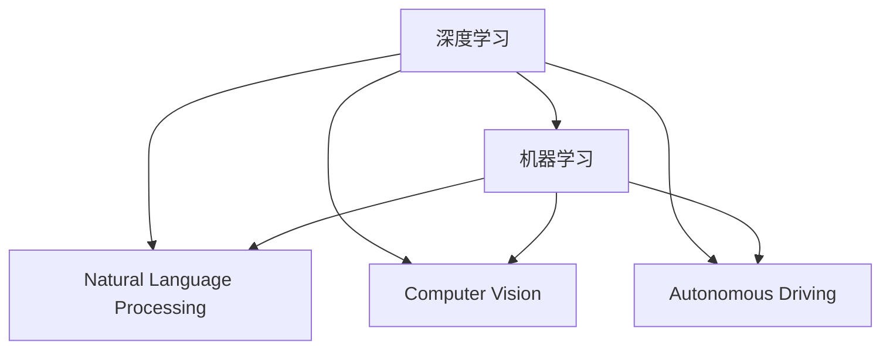

                 

# Andrej Karpathy：人工智能的未来发展趋势

> 关键词：人工智能，深度学习，机器学习，自然语言处理，计算机视觉，自动驾驶

## 1. 背景介绍

### 1.1 问题由来

Andrej Karpathy是深度学习领域的知名学者和工程师，他的工作涉及多个前沿领域，包括计算机视觉、自然语言处理、自动驾驶等。他的研究和开发工作对人工智能技术的进步有着深远的影响。

Karpathy近年来在多个公开场合讨论了人工智能未来的发展趋势，其中不乏深刻见解和对未来技术的展望。他的观点不仅对学术界，也对战室中的工程师和研究者具有重要意义。

本文将综合Karpathy的观点，梳理人工智能在深度学习、机器学习、自然语言处理、计算机视觉和自动驾驶等领域的发展趋势，并对未来面临的挑战进行深入分析。

## 2. 核心概念与联系

### 2.1 核心概念概述

在讨论未来人工智能的发展趋势之前，我们先来梳理一下与人工智能密切相关的核心概念和它们之间的联系。

- **深度学习**：通过多层神经网络模拟人类大脑的层次化处理能力，实现对数据的高效表示和处理。深度学习是当前人工智能技术的主流范式。

- **机器学习**：通过数据驱动的方式训练模型，使其能够从样本中学习规律，进而对新样本进行预测或分类。机器学习是实现人工智能的核心手段。

- **自然语言处理**（NLP）：使计算机能够理解、生成和处理人类语言，包括文本分类、机器翻译、情感分析等任务。

- **计算机视觉**：使计算机能够识别和理解图像和视频中的视觉信息，包括目标检测、图像分割、姿态估计等任务。

- **自动驾驶**：通过感知、决策和控制等技术，使车辆能够自主导航和驾驶。自动驾驶是人工智能在现实世界中的重要应用场景之一。

这些概念之间存在紧密联系，共同构成了人工智能技术的核心。深度学习是实现这些技术的基础，机器学习则是训练模型的核心方法，而自然语言处理、计算机视觉和自动驾驶等则是具体的应用领域。

### 2.2 核心概念原理和架构的 Mermaid 流程图



这个流程图展示了深度学习如何作为机器学习的基础，进而应用于自然语言处理、计算机视觉和自动驾驶等领域。

## 3. 核心算法原理 & 具体操作步骤

### 3.1 算法原理概述

Andrej Karpathy在多次演讲和论文中强调，人工智能的未来发展将依赖于以下几个关键因素：

- **数据驱动**：数据的丰富性和多样性是实现深度学习的基础。越来越多的数据将使模型能够学习更丰富的表示和规律。

- **模型复杂性**：模型参数量和复杂度的增加将使模型能够学习更加复杂的特征和模式，从而提高性能。

- **计算能力**：强大的计算能力能够加速模型训练和推理，使模型能够处理更大规模的数据和更复杂的任务。

- **知识工程**：将领域知识和规则与机器学习模型相结合，使模型能够更好地理解和处理特定领域的问题。

### 3.2 算法步骤详解

在Karpathy看来，未来的人工智能发展将经历以下几个关键步骤：

1. **数据收集和标注**：收集和标注更多高质量的数据，使模型能够学习更丰富的表示和规律。

2. **模型训练和调优**：使用深度学习技术训练模型，并通过超参数调优、正则化等手段优化模型性能。

3. **模型集成和融合**：将多个模型进行集成和融合，使系统能够处理更复杂的任务。

4. **实时处理和推理**：实现模型的实时处理和推理，使系统能够快速响应和决策。

5. **持续学习**：使系统能够持续学习和适应新数据，保持性能的稳定性和鲁棒性。

### 3.3 算法优缺点

Karpathy认为，当前的深度学习模型虽然强大，但也存在一些缺点：

- **过拟合**：模型在训练集上表现优异，但在测试集上表现不佳，容易导致过拟合。

- **可解释性**：深度学习模型通常被视为"黑盒"，难以解释其内部工作机制和决策过程。

- **计算资源需求高**：深度学习模型需要大量的计算资源进行训练和推理，这对硬件提出了较高要求。

- **数据依赖性**：深度学习模型对数据依赖性强，需要大量的标注数据进行训练。

### 3.4 算法应用领域

Karpathy认为，未来人工智能将在以下几个领域得到广泛应用：

- **自然语言处理**：包括文本分类、机器翻译、情感分析等任务。

- **计算机视觉**：包括目标检测、图像分割、姿态估计等任务。

- **自动驾驶**：实现自主导航和驾驶，提升交通系统的安全性和效率。

- **医疗**：通过图像分析、诊断工具等辅助医生进行疾病诊断和治疗。

- **金融**：通过数据分析和预测模型进行风险控制和投资决策。

## 4. 数学模型和公式 & 详细讲解 & 举例说明

### 4.1 数学模型构建

在深度学习中，常见的数学模型包括：

- **多层感知器（MLP）**：由多个线性层和激活函数构成，实现对数据的非线性处理。

- **卷积神经网络（CNN）**：通过卷积操作提取图像中的特征，实现图像分类和目标检测等任务。

- **循环神经网络（RNN）**：通过循环结构处理序列数据，实现语音识别、自然语言处理等任务。

- **自注意力机制（Attention）**：通过自注意力机制对输入序列进行加权处理，提升模型对复杂数据的理解能力。

### 4.2 公式推导过程

以卷积神经网络（CNN）为例，其基本公式为：

$$ y = \sigma(\mathbf{W}x + \mathbf{b}) $$

其中，$x$ 为输入，$\mathbf{W}$ 为权重矩阵，$\mathbf{b}$ 为偏置项，$\sigma$ 为激活函数。

在卷积操作中，输入 $x$ 通过卷积核进行卷积操作，得到特征图 $f$，公式为：

$$ f(i,j) = \sum_k w_{k,i}x(i-k,j) + b_k $$

其中，$w$ 为卷积核，$b$ 为偏置项，$(i,j)$ 为卷积核在输入上的位置。

### 4.3 案例分析与讲解

以图像分类为例，使用卷积神经网络对图像进行分类。假设有一张图像 $x$，其像素值为 $x_1, x_2, \ldots, x_n$，使用卷积核 $w_1, w_2, \ldots, w_m$ 进行卷积操作，得到特征图 $f_1, f_2, \ldots, f_m$，通过全连接层将特征图映射到分类结果 $y$。

## 5. 项目实践：代码实例和详细解释说明

### 5.1 开发环境搭建

为了进行深度学习模型的开发，需要安装一些必要的软件和库，如：

- **Python**：深度学习开发的主要编程语言，建议使用3.6或更高版本。

- **PyTorch**：深度学习框架，支持GPU加速和分布式训练。

- **TensorFlow**：另一个流行的深度学习框架，支持多种硬件平台。

- **Jupyter Notebook**：交互式编程环境，便于调试和展示代码。

### 5.2 源代码详细实现

以卷积神经网络（CNN）为例，展示如何实现图像分类任务。

```python
import torch
import torch.nn as nn
import torchvision.transforms as transforms
from torchvision.datasets import CIFAR10
from torchvision.models import VGG16

# 定义数据预处理
transform_train = transforms.Compose([
    transforms.RandomCrop(32, padding=4),
    transforms.RandomHorizontalFlip(),
    transforms.ToTensor(),
    transforms.Normalize(mean=[0.4914, 0.4822, 0.4465], std=[0.2023, 0.1994, 0.2010])
])

transform_test = transforms.Compose([
    transforms.ToTensor(),
    transforms.Normalize(mean=[0.4914, 0.4822, 0.4465], std=[0.2023, 0.1994, 0.2010])
])

# 加载数据集
trainset = CIFAR10(root='./data', train=True, download=True, transform=transform_train)
trainloader = torch.utils.data.DataLoader(trainset, batch_size=64, shuffle=True)

testset = CIFAR10(root='./data', train=False, download=True, transform=transform_test)
testloader = torch.utils.data.DataLoader(testset, batch_size=64, shuffle=False)

# 定义模型
model = VGG16(pretrained=False)

# 定义损失函数和优化器
criterion = nn.CrossEntropyLoss()
optimizer = torch.optim.Adam(model.parameters(), lr=0.001)

# 训练模型
for epoch in range(10):
    running_loss = 0.0
    for i, data in enumerate(trainloader, 0):
        inputs, labels = data
        optimizer.zero_grad()
        outputs = model(inputs)
        loss = criterion(outputs, labels)
        loss.backward()
        optimizer.step()
        running_loss += loss.item()
        if i % 200 == 199:
            print('[%d, %5d] loss: %.3f' % (epoch + 1, i + 1, running_loss / 200))
            running_loss = 0.0
```

### 5.3 代码解读与分析

以上代码实现了卷积神经网络（CNN）对CIFAR-10数据集的图像分类任务。具体步骤如下：

1. **数据预处理**：使用`transforms`库对训练集和测试集进行预处理，包括随机裁剪、翻转、归一化等操作。

2. **加载数据集**：使用`CIFAR10`加载训练集和测试集。

3. **定义模型**：使用`VGG16`定义卷积神经网络模型。

4. **定义损失函数和优化器**：使用`CrossEntropyLoss`作为损失函数，`Adam`优化器进行模型优化。

5. **训练模型**：使用训练集数据对模型进行训练，输出每个epoch的平均损失值。

## 6. 实际应用场景

### 6.1 智能客服系统

智能客服系统是人工智能在NLP领域的重要应用场景之一。通过自然语言处理技术，系统可以理解客户问题，并自动回答或转接人工服务。

- **意图识别**：使用深度学习模型对客户输入进行意图识别，判断用户是否需要自动回答或人工服务。

- **自然语言生成**：使用生成模型生成自然语言回复，提高用户满意度。

- **知识图谱**：通过知识图谱提高系统的知识储备，使系统能够更好地理解和回答复杂问题。

### 6.2 金融舆情监测

金融舆情监测是人工智能在金融领域的重要应用场景之一。通过自然语言处理技术，系统可以实时监测新闻、评论等数据，判断市场情绪和舆情变化，辅助投资决策。

- **情感分析**：使用深度学习模型对新闻和评论进行情感分析，判断市场情绪。

- **事件抽取**：使用实体识别和关系抽取等技术，提取市场事件信息，辅助投资决策。

- **风险控制**：通过舆情监测，及时发现和防范市场风险。

### 6.3 个性化推荐系统

个性化推荐系统是人工智能在电商、社交等领域的核心应用之一。通过深度学习模型，系统能够对用户行为进行分析和预测，推荐符合用户兴趣的商品和服务。

- **协同过滤**：通过用户行为数据，使用协同过滤算法推荐相似用户喜欢的商品。

- **深度学习**：使用深度学习模型对用户行为进行表示和预测，推荐个性化商品。

- **混合推荐**：结合协同过滤和深度学习，提高推荐精度。

## 7. 工具和资源推荐

### 7.1 学习资源推荐

1. **《Deep Learning》（Goodfellow et al.）**：深度学习领域的经典教材，涵盖了深度学习的基本概念和算法。

2. **《Hands-On Machine Learning with Scikit-Learn, Keras, and TensorFlow》（Aurélien Géron）**：介绍了使用Scikit-Learn、Keras和TensorFlow进行机器学习的实践方法。

3. **《Natural Language Processing in Action》（Jeremy Howard, Kevin Chen）**：介绍了自然语言处理的基本概念和技术。

4. **《CS231n: Convolutional Neural Networks for Visual Recognition》**：斯坦福大学计算机视觉课程，涵盖了卷积神经网络在计算机视觉中的应用。

5. **Kaggle**：数据科学竞赛平台，提供丰富的数据集和竞赛任务，适合进行深度学习实践。

### 7.2 开发工具推荐

1. **PyTorch**：深度学习框架，支持GPU加速和分布式训练。

2. **TensorFlow**：另一个流行的深度学习框架，支持多种硬件平台。

3. **Jupyter Notebook**：交互式编程环境，便于调试和展示代码。

4. **Keras**：高层API，方便构建和训练深度学习模型。

5. **Scikit-Learn**：机器学习库，提供了各种机器学习算法和工具。

### 7.3 相关论文推荐

1. **《ImageNet Classification with Deep Convolutional Neural Networks》（Krizhevsky et al.）**：介绍使用卷积神经网络进行图像分类的经典论文。

2. **《Attention is All You Need》（Vaswani et al.）**：介绍使用自注意力机制进行自然语言处理的论文。

3. **《Deep Learning for Unsupervised Feature Learning》（Gao et al.）**：介绍使用深度学习进行无监督特征学习的论文。

4. **《Natural Language Processing with Transformers》（Jurafsky et al.）**：介绍使用Transformer进行自然语言处理的论文。

## 8. 总结：未来发展趋势与挑战

### 8.1 研究成果总结

Andrej Karpathy认为，未来的深度学习研究将关注以下几个方面：

- **模型压缩和优化**：通过模型压缩和优化技术，提高模型的实时处理能力和资源利用率。

- **多模态学习**：将视觉、语音、文本等多模态数据进行联合建模，提升模型的综合理解能力。

- **零样本学习**：通过零样本学习技术，使模型能够在没有标注数据的情况下进行推理和生成。

- **迁移学习**：将模型在不同领域和任务上进行迁移学习，提高模型的泛化能力。

### 8.2 未来发展趋势

Karpathy认为，未来的深度学习技术将经历以下几个发展趋势：

- **模型规模继续增大**：随着硬件性能的提升，模型规模将进一步扩大，提升模型的表示能力。

- **多模态融合**：通过多模态学习技术，将视觉、语音、文本等数据进行联合建模，提升模型的综合理解能力。

- **实时处理和推理**：通过优化模型结构和算法，提升模型的实时处理和推理能力，实现实时应用。

- **知识工程与机器学习的结合**：将领域知识和规则与机器学习模型相结合，提升模型的解释能力和推理能力。

### 8.3 面临的挑战

尽管深度学习技术取得了巨大成功，但也面临以下挑战：

- **数据瓶颈**：高质量数据获取困难，尤其是小样本场景下的数据稀疏性问题。

- **模型复杂度**：模型规模和复杂度增加，需要更多的计算资源和训练时间。

- **过拟合**：模型在训练集上表现优异，但在测试集上表现不佳，容易导致过拟合。

- **可解释性**：深度学习模型通常被视为"黑盒"，难以解释其内部工作机制和决策过程。

### 8.4 研究展望

为了应对这些挑战，未来的深度学习研究需要在以下几个方面进行突破：

- **无监督和半监督学习**：通过无监督和半监督学习技术，提升模型的泛化能力和鲁棒性。

- **模型压缩和优化**：通过模型压缩和优化技术，提高模型的实时处理能力和资源利用率。

- **多模态融合**：将视觉、语音、文本等多模态数据进行联合建模，提升模型的综合理解能力。

- **知识工程与机器学习的结合**：将领域知识和规则与机器学习模型相结合，提升模型的解释能力和推理能力。

## 9. 附录：常见问题与解答

### Q1: 深度学习与机器学习有什么区别？

A: 深度学习是机器学习的一个子集，通过使用多层神经网络对数据进行抽象和表示，实现对数据的非线性处理。机器学习则是一个更广泛的概念，涵盖有监督、无监督和半监督学习等。

### Q2: 如何缓解深度学习的过拟合问题？

A: 缓解深度学习过拟合问题的方法包括：

- **数据增强**：通过对训练数据进行旋转、裁剪等操作，扩充训练集。

- **正则化**：通过L1、L2正则化等方法，防止模型过拟合。

- **早停法**：通过监控验证集性能，及时停止训练，避免过拟合。

- **模型集成**：通过集成多个模型，提高模型的泛化能力。

### Q3: 如何提高深度学习的可解释性？

A: 提高深度学习可解释性的方法包括：

- **可视化**：通过可视化技术，展示模型内部的权重和激活值，帮助理解模型行为。

- **层级激活**：通过逐层可视化模型激活，理解模型在每一层的特征表示。

- **特征重要性**：通过特征重要性分析，理解模型对输入的依赖关系。

- **知识图谱**：通过知识图谱引导模型学习，提高模型的可解释性。

### Q4: 深度学习模型在实际应用中面临哪些挑战？

A: 深度学习模型在实际应用中面临以下挑战：

- **数据获取困难**：高质量数据获取困难，尤其是小样本场景下的数据稀疏性问题。

- **模型规模和复杂度增加**：模型规模和复杂度增加，需要更多的计算资源和训练时间。

- **可解释性不足**：深度学习模型通常被视为"黑盒"，难以解释其内部工作机制和决策过程。

- **模型鲁棒性不足**：模型面对域外数据时，泛化性能往往大打折扣。

### Q5: 未来深度学习将如何发展？

A: 未来深度学习将朝着以下几个方向发展：

- **模型规模继续增大**：随着硬件性能的提升，模型规模将进一步扩大，提升模型的表示能力。

- **多模态融合**：通过多模态学习技术，将视觉、语音、文本等数据进行联合建模，提升模型的综合理解能力。

- **实时处理和推理**：通过优化模型结构和算法，提升模型的实时处理和推理能力，实现实时应用。

- **知识工程与机器学习的结合**：将领域知识和规则与机器学习模型相结合，提升模型的解释能力和推理能力。

---

作者：禅与计算机程序设计艺术 / Zen and the Art of Computer Programming

