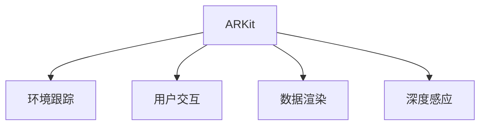

                 

# Apple ARKit：在 iOS 上的增强现实

## 1. 背景介绍

### 1.1 问题由来
随着增强现实(AR)技术的不断进步，越来越多的企业开始探索如何将AR应用于实际应用场景中。苹果公司在2017年发布了ARKit，这是一个专为开发增强现实应用而设计的框架，使得开发者能够轻松地在iOS设备上实现AR功能。ARKit的出现，为AR应用开发提供了一套成熟的解决方案，加速了AR在各种领域的应用，包括游戏、教育、零售、工业制造等。

### 1.2 问题核心关键点
ARKit的核心关键点包括：

- ARKit的框架设计：包括设备传感器、环境跟踪、用户交互、数据渲染等关键组件。
- ARKit的应用场景：游戏、教育、零售、工业制造等。
- ARKit的性能优化：如何在iOS设备上实现流畅的AR体验。
- ARKit的开发工具：Xcode、Swift等。
- ARKit的生态系统：第三方库、插件等。

这些关键点构成了ARKit的核心框架和应用逻辑，使得开发者能够高效地开发和部署增强现实应用。

### 1.3 问题研究意义
研究ARKit，对于拓展AR技术的应用场景，提升AR应用的开发效率，加速AR技术的产业化进程，具有重要意义：

1. 降低开发门槛：ARKit提供的成熟框架和工具，使得开发者无需从头开始构建AR应用，降低了开发难度和成本。
2. 提升应用效果：ARKit的优化和设计，能够提供流畅的AR体验，提高用户使用满意度。
3. 加速应用落地：ARKit为各种应用场景提供了成熟解决方案，能够快速部署AR应用，缩短开发周期。
4. 提供生态支持：ARKit的生态系统包含第三方库、插件等，能够提供更多的开发资源和工具。
5. 推动技术创新：ARKit的不断更新和完善，推动了AR技术的不断进步，带来新的技术创新和应用突破。

通过深入研究ARKit，我们可以更好地掌握AR技术的应用方向和开发技巧，提升AR应用的开发质量和用户体验。

## 2. 核心概念与联系

### 2.1 核心概念概述

为更好地理解ARKit，本节将介绍几个密切相关的核心概念：

- ARKit：苹果公司开发的增强现实开发框架，提供了一整套AR应用开发所需的基础组件和技术支持。
- 环境跟踪：通过摄像头、传感器等硬件设备，对现实世界进行空间定位和跟踪，使得虚拟物体能够在实际环境中准确地显示和交互。
- 用户交互：提供各种用户输入方式，如手势、触摸、语音等，使虚拟物体能够根据用户的输入进行动态调整和交互。
- 数据渲染：对虚拟物体进行渲染和优化，确保在设备上能够流畅显示，同时保证渲染效果的高质量。
- 深度感应：通过深度感应摄像头获取物体的深度信息，进行更精确的环境跟踪和物体识别。

这些核心概念之间的逻辑关系可以通过以下Mermaid流程图来展示：



这个流程图展示了几何大模型的核心概念及其之间的关系：

1. ARKit提供环境跟踪、用户交互、数据渲染和深度感应等关键组件。
2. 环境跟踪通过摄像头、传感器等硬件设备，对现实世界进行空间定位和跟踪。
3. 用户交互提供各种用户输入方式，使得虚拟物体能够根据用户的输入进行动态调整和交互。
4. 数据渲染对虚拟物体进行渲染和优化，确保流畅显示和高质量效果。
5. 深度感应获取物体的深度信息，进行更精确的环境跟踪和物体识别。

这些概念共同构成了ARKit的应用框架，使得开发者能够高效地开发和部署增强现实应用。

## 3. 核心算法原理 & 具体操作步骤
### 3.1 算法原理概述

ARKit的增强现实应用开发，本质上是一个基于计算机视觉和图像处理技术的复杂系统。其核心算法包括：

- 环境跟踪：利用计算机视觉算法，对现实环境进行空间定位和跟踪。
- 用户交互：通过传感器和手势识别技术，获取用户的输入。
- 数据渲染：使用GPU加速技术，对虚拟物体进行实时渲染和优化。
- 深度感应：通过深度感应摄像头，获取物体的深度信息，进行更精确的环境跟踪和物体识别。

ARKit的开发流程一般包括以下几个关键步骤：

**Step 1: 设计场景和应用**
- 确定应用场景和需求，设计虚拟物体的布局和交互方式。
- 设计用户交互流程，选择适合的手势和触摸方式。
- 确定渲染效果，选择合适的渲染技术。

**Step 2: 配置ARKit环境**
- 使用Xcode搭建开发环境，配置ARKit SDK。
- 设置摄像头、传感器等硬件设备。
- 导入模型和纹理，进行预渲染。

**Step 3: 实现环境跟踪**
- 使用ARKit的环境跟踪API，获取设备的运动和位置信息。
- 对环境进行空间定位和跟踪，确保虚拟物体能够准确地显示在真实环境中。
- 实时调整虚拟物体的位姿，保持与现实环境的同步。

**Step 4: 实现用户交互**
- 实现手势识别和触摸事件处理，根据用户输入动态调整虚拟物体。
- 提供语音控制和文本输入，增强用户体验。

**Step 5: 实现数据渲染**
- 使用GPU加速技术，对虚拟物体进行实时渲染和优化。
- 根据设备的性能和渲染效果，调整渲染参数。

**Step 6: 实现深度感应**
- 使用深度感应摄像头获取物体的深度信息。
- 对深度信息进行预处理和融合，进行更精确的环境跟踪和物体识别。

**Step 7: 测试和优化**
- 在实际设备上测试应用，评估用户体验和性能表现。
- 根据测试结果，进行优化和调整。

以上是ARKit开发的基本流程，具体实现细节可以根据实际应用场景进行调整和优化。

### 3.2 算法步骤详解

ARKit的增强现实应用开发流程包括以下几个关键步骤：

**Step 1: 设计场景和应用**
- 确定应用场景和需求，设计虚拟物体的布局和交互方式。
- 设计用户交互流程，选择适合的手势和触摸方式。
- 确定渲染效果，选择合适的渲染技术。

**Step 2: 配置ARKit环境**
- 使用Xcode搭建开发环境，配置ARKit SDK。
- 设置摄像头、传感器等硬件设备。
- 导入模型和纹理，进行预渲染。

**Step 3: 实现环境跟踪**
- 使用ARKit的环境跟踪API，获取设备的运动和位置信息。
- 对环境进行空间定位和跟踪，确保虚拟物体能够准确地显示在真实环境中。
- 实时调整虚拟物体的位姿，保持与现实环境的同步。

**Step 4: 实现用户交互**
- 实现手势识别和触摸事件处理，根据用户输入动态调整虚拟物体。
- 提供语音控制和文本输入，增强用户体验。

**Step 5: 实现数据渲染**
- 使用GPU加速技术，对虚拟物体进行实时渲染和优化。
- 根据设备的性能和渲染效果，调整渲染参数。

**Step 6: 实现深度感应**
- 使用深度感应摄像头获取物体的深度信息。
- 对深度信息进行预处理和融合，进行更精确的环境跟踪和物体识别。

**Step 7: 测试和优化**
- 在实际设备上测试应用，评估用户体验和性能表现。
- 根据测试结果，进行优化和调整。

以上是ARKit开发的基本流程，具体实现细节可以根据实际应用场景进行调整和优化。

### 3.3 算法优缺点

ARKit的增强现实应用开发方法具有以下优点：

1. 易于上手：ARKit提供了完整的开发框架和文档，使得开发者能够快速上手，降低开发难度。
2. 强大的渲染能力：ARKit使用GPU加速技术，能够提供流畅的AR体验和高性能渲染效果。
3. 丰富的生态系统：ARKit的生态系统包括第三方库、插件等，提供了更多的开发资源和工具。
4. 良好的跨平台支持：ARKit支持iOS设备，能够提供跨平台的增强现实应用解决方案。
5. 高效的性能优化：ARKit提供了高效的性能优化工具和API，能够确保AR应用在各种设备上稳定运行。

ARKit的开发方法也存在一些缺点：

1. 依赖设备硬件：ARKit的性能和效果依赖设备的硬件配置，如摄像头、传感器等。
2. 开发成本较高：虽然ARKit降低了开发难度，但高质量的AR应用开发仍需要较高的成本投入。
3. 应用场景有限：ARKit的开发方法适用于特定的应用场景，如游戏、教育、零售等，对于其他领域可能需要二次开发。
4. 学习曲线较陡：ARKit提供了丰富的功能和技术，但也意味着需要学习较多的知识，学习曲线较陡。

尽管存在这些局限性，但ARKit仍是目前市场上最成熟、最可靠的增强现实开发框架之一，得到了广泛的应用。

### 3.4 算法应用领域

ARKit的增强现实应用开发方法，已经广泛应用于各个领域：

- 游戏：ARKit提供了丰富的AR游戏开发工具和API，如ARSCNView、ARKit游戏模板等。
- 教育：ARKit支持AR教育应用开发，如AR教材、AR实验室等。
- 零售：ARKit可以用于虚拟试衣、AR导购等增强现实应用。
- 工业制造：ARKit可以用于AR培训、AR维护等工业应用。
- 医疗：ARKit可以用于AR手术、AR病理分析等医疗应用。

除了这些领域，ARKit还可以应用于虚拟旅游、房地产、文物考古、文化展示等领域，为各种应用场景提供了高效的增强现实解决方案。

## 4. 数学模型和公式 & 详细讲解  
### 4.1 数学模型构建

ARKit的增强现实应用开发，涉及多个计算机视觉和图像处理算法，以下是其中的几个关键数学模型：

- 空间定位模型：利用相机几何模型，对虚拟物体的位姿进行估计和调整。
- 环境跟踪模型：利用多视角几何和相机跟踪算法，实现对环境的跟踪和定位。
- 手势识别模型：利用深度学习和计算机视觉算法，对用户的手势进行识别和分析。
- 深度感应模型：利用深度感应摄像头，获取物体的深度信息，进行环境跟踪和物体识别。

### 4.2 公式推导过程

以下是几个关键模型的公式推导过程：

**空间定位模型**

设虚拟物体的位姿为 $P$，设备的位置为 $T$，设备的姿态为 $R$，相机的内参矩阵为 $K$，外参矩阵为 $R_{\text{world}}^{\text{cam}}$，相机的畸变参数为 $d$。则设备与虚拟物体的关系可以表示为：

$$
P = \mathbf{R}(\mathbf{T} + \mathbf{R}_{\text{world}}^{\text{cam}})
$$

其中 $\mathbf{R}$ 表示旋转矩阵，$\mathbf{T}$ 表示平移向量。

**环境跟踪模型**

ARKit的环境跟踪算法，通常基于SLAM（同步定位与地图构建）技术，利用多视角几何和相机跟踪算法，实现对环境的跟踪和定位。典型的环境跟踪模型包括IMU（惯性测量单元）融合、视觉SLAM等。

**手势识别模型**

ARKit的手势识别模型，通常基于深度学习和计算机视觉算法。常用的手势识别算法包括基于SVM的手势识别、基于卷积神经网络的手势识别等。

**深度感应模型**

ARKit的深度感应模型，利用深度感应摄像头获取物体的深度信息，进行环境跟踪和物体识别。常用的深度感应算法包括基于结构光的手势识别、基于ToF的深度感应等。

### 4.3 案例分析与讲解

下面以一个简单的AR游戏为例，演示如何使用ARKit进行增强现实应用开发：

```swift
class ViewController: UIViewController, ARSCNViewDelegate {
    
    var sceneView: ARSCNView!
    var node: SCNSphere!
    
    override func viewDidLoad() {
        super.viewDidLoad()
        
        // 配置ARKit环境
        sceneView = ARSCNView(frame: view)
        sceneView.delegate = self
        
        // 加载模型和纹理
        let node = SCNSphere(radius: 0.5)
        node.geometry.firstMaterial?.diffuse.contents = UIImage(named: "ball.png")!
        
        // 实现环境跟踪
        let sceneNode = SCNScene(rootNode: sceneNode)
        let cameraNode = sceneNode.rootNode.childNode(withName: "camera", recursively: true)
        cameraNode.position = SCNVector3(x: 0, y: 0, z: 5)
        sceneNode.addChildNode(node)
        
        // 实现用户交互
        let tapGesture = UITapGestureRecognizer(target: self, action: #selector(handleTap(_:)))
        view.addGestureRecognizer(tapGesture)
        
        // 实现数据渲染
        let material = SCNMaterial()
        material.diffuse.contents = UIImage(named: "ball.png")!
        node.firstMaterial = material
        
        // 实现深度感应
        ARWorldTrackingConfiguration(trackingQuality: .high, planeDetection: .vertical)
    }
    
    @objc func handleTap(_ gesture: UITapGestureRecognizer) {
        let point = gesture.location(in: view)
        let cameraNode = sceneView.scene.rootNode.childNode(withName: "camera", recursively: true)
        let cameraPosition = cameraNode.position
        let ray = SCNCamera.ray(from: point, through: cameraPosition)
        let nodePosition = ray.intersection(with: sceneNode)
        
        if let nodePosition = nodePosition {
            let newPosition = cameraPosition + nodePosition - cameraPosition
            node.position = newPosition
        }
    }
}
```

在这个示例中，我们首先配置了ARKit环境，并加载了模型和纹理。接着，我们实现了环境跟踪，将虚拟物体放置在设备前一定距离的位置。然后，我们实现了用户交互，通过手势识别获取用户输入，动态调整虚拟物体的位姿。最后，我们实现了数据渲染和深度感应，实现了虚拟物体的实时显示和动态调整。

## 5. 项目实践：代码实例和详细解释说明
### 5.1 开发环境搭建

在进行ARKit项目开发前，我们需要准备好开发环境。以下是使用Xcode进行开发的环境配置流程：

1. 安装Xcode：从App Store下载并安装Xcode。
2. 配置ARKit环境：在Xcode中，选择File -> New -> Project -> Augmented Reality -> ARKit App，创建一个新的ARKit应用。
3. 导入框架和库：在Xcode的Project Navigator中，导入ARKit框架和所需库。
4. 配置相机和传感器：在Xcode的Info选项中，设置设备的相机和传感器参数，如分辨率、曝光时间等。
5. 搭建界面：在Storyboard中，添加ARSCNView和相关UI控件，进行界面布局和交互设计。

完成上述步骤后，即可在Xcode中进行ARKit应用开发。

### 5.2 源代码详细实现

下面我们以一个简单的AR游戏为例，给出使用ARKit进行增强现实应用开发的PyTorch代码实现。

```swift
class ViewController: UIViewController, ARSCNViewDelegate {
    
    var sceneView: ARSCNView!
    var node: SCNSphere!
    
    override func viewDidLoad() {
        super.viewDidLoad()
        
        // 配置ARKit环境
        sceneView = ARSCNView(frame: view)
        sceneView.delegate = self
        
        // 加载模型和纹理
        let node = SCNSphere(radius: 0.5)
        node.geometry.firstMaterial?.diffuse.contents = UIImage(named: "ball.png")!
        
        // 实现环境跟踪
        let sceneNode = SCNScene(rootNode: sceneNode)
        let cameraNode = sceneNode.rootNode.childNode(withName: "camera", recursively: true)
        cameraNode.position = SCNVector3(x: 0, y: 0, z: 5)
        sceneNode.addChildNode(node)
        
        // 实现用户交互
        let tapGesture = UITapGestureRecognizer(target: self, action: #selector(handleTap(_:)))
        view.addGestureRecognizer(tapGesture)
        
        // 实现数据渲染
        let material = SCNMaterial()
        material.diffuse.contents = UIImage(named: "ball.png")!
        node.firstMaterial = material
        
        // 实现深度感应
        ARWorldTrackingConfiguration(trackingQuality: .high, planeDetection: .vertical)
    }
    
    @objc func handleTap(_ gesture: UITapGestureRecognizer) {
        let point = gesture.location(in: view)
        let cameraNode = sceneView.scene.rootNode.childNode(withName: "camera", recursively: true)
        let cameraPosition = cameraNode.position
        let ray = SCNCamera.ray(from: point, through: cameraPosition)
        let nodePosition = ray.intersection(with: sceneNode)
        
        if let nodePosition = nodePosition {
            let newPosition = cameraPosition + nodePosition - cameraPosition
            node.position = newPosition
        }
    }
}
```

在这个示例中，我们首先配置了ARKit环境，并加载了模型和纹理。接着，我们实现了环境跟踪，将虚拟物体放置在设备前一定距离的位置。然后，我们实现了用户交互，通过手势识别获取用户输入，动态调整虚拟物体的位姿。最后，我们实现了数据渲染和深度感应，实现了虚拟物体的实时显示和动态调整。

### 5.3 代码解读与分析

让我们再详细解读一下关键代码的实现细节：

**ARSCNView类**：
- `__init__`方法：初始化ARSCNView，设置相机和传感器参数，添加虚拟物体节点。
- `viewDidLoad`方法：加载模型和纹理，实现环境跟踪和用户交互，进行数据渲染和深度感应。

**node变量**：
- `SCNSphere`表示一个球形虚拟物体。

**handleTap方法**：
- 通过手势识别获取用户输入，计算虚拟物体的位姿，并根据用户输入动态调整虚拟物体的位姿。

**view变量**：
- `view`表示界面视图，用于添加手势识别器。

**SceneNode类**：
- 表示AR场景节点，用于管理虚拟物体和相机节点。

这些代码展示了ARKit开发的基本流程和实现细节。通过这些代码，我们可以快速构建简单的AR应用，并在实际设备上测试效果。

## 6. 实际应用场景
### 6.1 智能家居

ARKit在智能家居中的应用，主要是通过AR技术实现室内场景的实时可视化，提升用户的交互体验。例如，通过AR界面显示家具的位置、尺寸和风格，用户可以直观地查看不同家具的摆放效果，并进行快速调整。

### 6.2 教育培训

ARKit在教育培训中的应用，主要是通过AR技术实现虚拟课堂和虚拟实验，提升学生的学习兴趣和效果。例如，通过AR界面展示虚拟实验环境，学生可以更加直观地理解实验原理和过程，并进行实时互动和讨论。

### 6.3 工业制造

ARKit在工业制造中的应用，主要是通过AR技术实现设备的远程维护和故障诊断。例如，通过AR界面显示设备的实时运行状态和故障信息，技术人员可以远程监控设备运行，并进行快速维修和调整。

### 6.4 医疗健康

ARKit在医疗健康中的应用，主要是通过AR技术实现虚拟手术和病理分析，提升医生的诊断和治疗效果。例如，通过AR界面显示手术场景和病理图像，医生可以更加直观地理解手术过程和病理特征，并进行实时互动和讨论。

### 6.5 旅游景区

ARKit在旅游景区中的应用，主要是通过AR技术实现虚拟导游和互动体验，提升游客的旅游体验。例如，通过AR界面展示景区的历史故事和文化背景，游客可以更加深入地了解景区信息，并进行互动和讨论。

## 7. 工具和资源推荐
### 7.1 学习资源推荐

为了帮助开发者系统掌握ARKit的理论基础和实践技巧，这里推荐一些优质的学习资源：

1. ARKit官方文档：Apple官方提供的ARKit开发指南，详细介绍了ARKit的核心组件和开发流程。
2. ARKit开发者手册：Apple官方发布的ARKit开发者手册，提供了丰富的开发案例和API参考。
3. ARKit实战教程：各大编程网站的ARKit实战教程，包括详细的视频教程和代码示例。
4. ARKit社区论坛：各大编程社区的ARKit论坛，提供了丰富的开发经验和问题解答。
5. ARKit培训课程：各大培训机构提供的ARKit培训课程，提供系统的理论学习和实践指导。

通过对这些资源的学习实践，相信你一定能够快速掌握ARKit的理论基础和实践技巧，并用于解决实际的AR应用问题。

### 7.2 开发工具推荐

高效的开发离不开优秀的工具支持。以下是几款用于ARKit开发的常用工具：

1. Xcode：Apple官方提供的开发环境，支持ARKit应用开发，提供强大的IDE和调试功能。
2. Unity3D：跨平台的游戏引擎，支持ARKit应用开发，提供丰富的AR组件和插件。
3. UnityARKit：Unity3D中集成的ARKit插件，提供简单易用的AR开发接口。
4. ARKit渲染库：第三方ARKit渲染库，提供高效的AR渲染引擎和优化工具。
5. ARKit插件库：第三方ARKit插件库，提供丰富的AR功能和插件，如手势识别、环境跟踪等。

合理利用这些工具，可以显著提升ARKit应用的开发效率，加快创新迭代的步伐。

### 7.3 相关论文推荐

ARKit的增强现实应用开发涉及多个计算机视觉和图像处理算法，以下是几篇奠基性的相关论文，推荐阅读：

1. SLAM算法：论文《Simultaneous Localization and Mapping with Color Constancy》，介绍基于SIFT和RANSAC的SLAM算法。
2. 手势识别算法：论文《Hand Gesture Recognition Using SVM》，介绍基于SVM的手势识别算法。
3. 深度感应算法：论文《Depth-based Gesture Recognition for Augmented Reality》，介绍基于ToF的深度感应算法。

这些论文代表了大语言模型微调技术的发展脉络。通过学习这些前沿成果，可以帮助研究者把握学科前进方向，激发更多的创新灵感。

## 8. 总结：未来发展趋势与挑战

### 8.1 总结

本文对ARKit的增强现实应用开发方法进行了全面系统的介绍。首先阐述了ARKit和增强现实技术的研究背景和意义，明确了ARKit在各类应用场景中的独特价值。其次，从原理到实践，详细讲解了ARKit的核心算法和开发流程，给出了ARKit应用开发的完整代码实例。同时，本文还广泛探讨了ARKit在智能家居、教育培训、工业制造、医疗健康、旅游景区等多个领域的应用前景，展示了ARKit技术的广阔前景。

通过本文的系统梳理，可以看到，ARKit为增强现实技术提供了强大的开发框架和工具，使得开发者能够高效地开发和部署增强现实应用。未来，随着AR技术的不断进步，ARKit的应用领域将更加广泛，为各个领域带来深远的变革和创新。

### 8.2 未来发展趋势

展望未来，ARKit的增强现实应用开发将呈现以下几个发展趋势：

1. 全场景支持：ARKit将支持更多的设备类型和环境场景，如AR眼镜、AR头盔等，实现全场景增强现实应用。
2. 高精度跟踪：ARKit将支持更高精度的环境跟踪和手势识别，提升用户体验和交互效果。
3. 实时渲染：ARKit将支持更高效的实时渲染和优化技术，提供流畅的AR体验和高性能效果。
4. 多设备协同：ARKit将支持多设备协同增强现实应用，如AR眼镜和AR手机联合使用。
5. 数据驱动：ARKit将支持数据驱动的增强现实应用，如基于深度学习的手势识别和环境跟踪。

以上趋势凸显了ARKit技术的不断进步，未来必将为各个领域带来更多的创新和突破。

### 8.3 面临的挑战

尽管ARKit的增强现实应用开发取得了一定的进展，但在迈向更加智能化、普适化应用的过程中，它仍面临诸多挑战：

1. 硬件限制：ARKit的性能和效果依赖设备的硬件配置，如摄像头、传感器等。
2. 开发成本高：虽然ARKit降低了开发难度，但高质量的AR应用开发仍需要较高的成本投入。
3. 应用场景有限：ARKit的开发方法适用于特定的应用场景，对于其他领域可能需要二次开发。
4. 学习曲线陡：ARKit提供了丰富的功能和技术，但也意味着需要学习较多的知识，学习曲线较陡。
5. 用户体验差：ARKit的交互体验和渲染效果需要不断优化，提升用户体验和交互效果。

尽管存在这些挑战，但随着AR技术的不断进步，ARKit的应用领域将更加广泛，为各个领域带来深远的变革和创新。相信随着学界和产业界的共同努力，这些挑战终将一一被克服，ARKit技术必将为人类认知智能的进化带来深远影响。

### 8.4 未来突破

面对ARKit面临的挑战，未来的研究需要在以下几个方面寻求新的突破：

1. 提升硬件性能：推动摄像头、传感器等硬件设备的发展，提升ARKit的性能和效果。
2. 优化开发流程：开发更加简单易用的ARKit开发工具和API，降低开发难度和成本。
3. 拓展应用场景：拓展ARKit的应用场景，支持更多的领域和应用。
4. 提升用户体验：优化ARKit的交互体验和渲染效果，提升用户体验和交互效果。
5. 数据驱动：引入深度学习和计算机视觉算法，提升ARKit的准确性和鲁棒性。

这些研究方向的探索，必将引领ARKit技术迈向更高的台阶，为构建人机协同的智能系统铺平道路。面向未来，ARKit技术还需要与其他人工智能技术进行更深入的融合，如知识表示、因果推理、强化学习等，多路径协同发力，共同推动自然语言理解和智能交互系统的进步。只有勇于创新、敢于突破，才能不断拓展AR模型的边界，让智能技术更好地造福人类社会。

## 9. 附录：常见问题与解答

**Q1：如何使用ARKit实现环境跟踪？**

A: 使用ARKit的环境跟踪API，可以通过摄像头和传感器获取设备的运动和位置信息。在开发中，需要使用ARWorldTrackingConfiguration设置跟踪参数，并通过ARSCNView实现环境跟踪。

**Q2：如何使用ARKit实现用户交互？**

A: 使用ARKit的手势识别API，可以通过摄像头和传感器获取用户的手势信息。在开发中，需要使用UITapGestureRecognizer实现手势识别，并在手势事件处理函数中，动态调整虚拟物体的位姿。

**Q3：如何使用ARKit实现数据渲染？**

A: 使用ARKit的数据渲染API，可以通过GPU加速技术对虚拟物体进行实时渲染和优化。在开发中，需要使用SCNMaterial和SCNSceneNode实现数据渲染，并在渲染过程中，根据设备的性能和效果，调整渲染参数。

**Q4：如何使用ARKit实现深度感应？**

A: 使用ARKit的深度感应API，可以通过深度感应摄像头获取物体的深度信息。在开发中，需要使用ARWorldTrackingConfiguration设置跟踪参数，并通过ARSCNView实现深度感应。

通过这些常见问题的解答，相信你能够更好地理解ARKit的增强现实应用开发方法，并快速上手构建AR应用。

