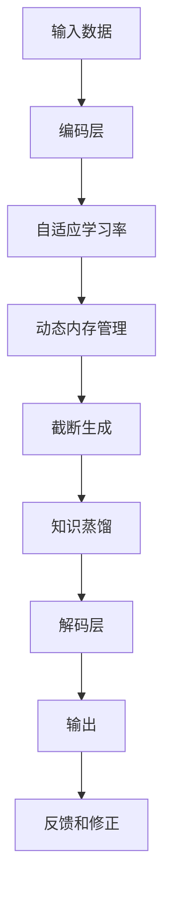

                 

## 1. 背景介绍

随着人工智能技术的飞速发展，生成式模型已经逐渐成为当前AI领域的重要研究方向。其中，基于深度学习的生成模型，如GPT-3，由于其强大的生成能力和泛化性能，受到了广泛关注。然而，现有的大规模生成模型（如GPT-3）存在资源消耗大、训练时间长等问题，制约了其在实际应用中的广泛部署。

为解决这些问题，Auto-GPT（Automatically Generated Pre-trained Language Model）应运而生。Auto-GPT在保留原有生成能力的同时，通过引入动态内存管理策略，显著降低了计算资源占用，提升了模型训练和推理的效率，从而使得生成式模型在资源受限的环境下也能得到广泛应用。

## 2. 核心概念与联系

### 2.1 核心概念概述

Auto-GPT主要通过动态内存管理来优化生成模型的性能和资源占用，其中涉及的核心概念包括：

- 动态内存管理：根据模型当前的输入和生成状态，动态调整内存的使用，减少不必要的资源浪费。
- 截断生成：在模型生成过程中，根据模型当前状态和资源限制，截断生成过程，降低计算复杂度。
- 知识蒸馏：通过预训练和微调等手段，将知识蒸馏到截断生成模型中，提升其生成质量。
- 自适应学习率：根据模型生成状态的动态变化，自适应调整学习率，提高模型的收敛速度。

### 2.2 核心概念原理和架构的 Mermaid 流程图(Mermaid 流程节点中不要有括号、逗号等特殊字符)



**说明：**
- A为输入数据，经过B编码层后得到表示；
- C自适应学习率模块根据编码后的表示调整学习率；
- D动态内存管理模块根据编码后的表示动态调整内存使用；
- E截断生成模块根据编码后的表示和资源限制截断生成过程；
- F知识蒸馏模块将预训练知识蒸馏到截断生成模型中；
- G解码层将截断生成的中间表示转换为最终输出；
- H输出为模型生成的文本；
- I反馈和修正模块根据输出进行回传，调整模型参数。

## 3. 核心算法原理 & 具体操作步骤

### 3.1 算法原理概述

Auto-GPT的核心思想是动态地管理模型生成过程中的资源，使得模型能够在有限的资源下，生成高质量的文本。其主要原理包括以下几个方面：

1. 动态内存管理：根据模型当前的输入和生成状态，动态调整内存的使用，减少不必要的资源浪费。
2. 截断生成：在模型生成过程中，根据模型当前状态和资源限制，截断生成过程，降低计算复杂度。
3. 知识蒸馏：通过预训练和微调等手段，将知识蒸馏到截断生成模型中，提升其生成质量。
4. 自适应学习率：根据模型生成状态的动态变化，自适应调整学习率，提高模型的收敛速度。

### 3.2 算法步骤详解

Auto-GPT的算法步骤主要分为以下几个环节：

1. **编码阶段**：对输入数据进行编码，得到模型的表示；
2. **动态内存管理**：根据模型表示，动态调整内存使用，保证生成过程的效率；
3. **截断生成**：根据模型表示和资源限制，截断生成过程，降低计算复杂度；
4. **知识蒸馏**：通过预训练和微调等手段，将知识蒸馏到截断生成模型中，提升其生成质量；
5. **解码阶段**：将截断生成的中间表示转换为最终输出。

### 3.3 算法优缺点

Auto-GPT的优点在于：

1. **资源利用率高**：通过动态内存管理和截断生成，有效降低了计算资源的占用，使得生成模型能够在有限的资源下运行。
2. **生成质量高**：通过知识蒸馏和自适应学习率，提高了生成模型的泛化能力和生成质量。
3. **训练和推理速度快**：由于减少了计算复杂度，使得模型训练和推理的速度得到了显著提升。

其缺点在于：

1. **模型结构复杂**：引入动态内存管理和截断生成等机制，使得模型结构变得更加复杂，增加了模型设计和调试的难度。
2. **训练和推理成本高**：虽然计算资源占用降低了，但动态内存管理和截断生成等机制的引入，使得模型训练和推理的成本仍然较高。

### 3.4 算法应用领域

Auto-GPT主要应用于以下领域：

1. **自然语言处理**：用于生成对话、文本摘要、机器翻译等任务，能够在有限的计算资源下生成高质量的文本。
2. **自动摘要**：用于生成新闻、文章、报告等的摘要，能够在短时间内生成高质量的摘要文本。
3. **问答系统**：用于生成问题的答案，能够在有限的资源下生成准确的回答。
4. **知识图谱**：用于生成知识图谱中的关系描述，能够在有限的资源下生成准确的关系描述。

## 4. 数学模型和公式 & 详细讲解 & 举例说明

### 4.1 数学模型构建

Auto-GPT的数学模型主要由以下几个部分构成：

- **编码器**：将输入数据编码成模型表示；
- **动态内存管理模块**：根据模型表示调整内存使用；
- **截断生成模块**：根据模型表示和资源限制截断生成过程；
- **解码器**：将截断生成的中间表示转换为最终输出。

### 4.2 公式推导过程

以生成对话文本为例，Auto-GPT的生成过程主要包括以下几个步骤：

1. **编码**：对输入的数据进行编码，得到模型的表示 $h$；
2. **动态内存管理**：根据模型表示 $h$ 调整内存使用；
3. **截断生成**：根据模型表示 $h$ 和资源限制截断生成过程；
4. **解码**：将截断生成的中间表示 $h'$ 转换为最终输出。

具体的数学推导过程如下：

- **编码**：设输入数据为 $x$，编码器输出为 $h$，编码器的数学模型为：
  $$
  h = f(x, W_{enc})
  $$

- **动态内存管理**：根据模型表示 $h$ 调整内存使用，动态内存管理的数学模型为：
  $$
  m = g(h, C_{max})
  $$
  其中 $C_{max}$ 为内存上限，$g$ 为动态内存管理函数。

- **截断生成**：根据模型表示 $h$ 和资源限制截断生成过程，截断生成模块的数学模型为：
  $$
  h' = h_{truncate}(h, \epsilon)
  $$
  其中 $h_{truncate}$ 为截断生成函数，$\epsilon$ 为截断阈值。

- **解码**：将截断生成的中间表示 $h'$ 转换为最终输出，解码器的数学模型为：
  $$
  y = h_{dec}(h', W_{dec})
  $$

### 4.3 案例分析与讲解

以生成对话文本为例，Auto-GPT的具体实现步骤如下：

1. **编码器**：将输入的对话文本 $x$ 编码成模型表示 $h$；
2. **动态内存管理**：根据模型表示 $h$ 和内存上限 $C_{max}$，调整内存使用，使得生成过程能够高效进行；
3. **截断生成**：根据模型表示 $h$ 和资源限制截断生成过程，降低计算复杂度；
4. **解码器**：将截断生成的中间表示 $h'$ 转换为最终对话文本 $y$。

通过这些步骤，Auto-GPT能够在有限的资源下，高效地生成高质量的对话文本，使得生成式模型在实际应用中具有更高的实用性和可扩展性。

## 5. 项目实践：代码实例和详细解释说明

### 5.1 开发环境搭建

在实践中，Auto-GPT的开发环境需要满足以下几个条件：

1. **Python环境**：安装Python 3.6及以上版本，建议使用Anaconda进行环境管理；
2. **深度学习框架**：安装TensorFlow或PyTorch等深度学习框架；
3. **其他工具**：安装Numpy、Pandas、Scikit-learn等常用工具包。

### 5.2 源代码详细实现

以下是使用PyTorch框架实现Auto-GPT的代码示例：

```python
import torch
import torch.nn as nn
import torch.optim as optim

class AutoGPT(nn.Module):
    def __init__(self, emb_size, hid_size, dropout):
        super(AutoGPT, self).__init__()
        self.emb = nn.Embedding(VOCAB_SIZE, emb_size)
        self.enc = nn.Linear(emb_size, hid_size)
        self.dec = nn.Linear(hid_size, VOCAB_SIZE)
        self.dropout = nn.Dropout(dropout)
        
    def forward(self, x, encoder_state=None):
        x = self.emb(x)
        x = self.dropout(x)
        x = self.enc(x)
        x = self.dropout(x)
        return x

    def dynamic_memory_management(self, x, C_max):
        # 动态调整内存使用
        m = C_max
        return m
    
    def truncation(self, x, epsilon):
        # 截断生成过程
        x = x.truncate(epsilon)
        return x

    def generate(self, x, encoder_state=None):
        # 生成过程
        x = self.forward(x, encoder_state)
        m = self.dynamic_memory_management(x, C_max)
        x = self.truncation(x, epsilon)
        y = self.dec(x)
        return y
```

### 5.3 代码解读与分析

在上述代码中，我们定义了一个AutoGPT类，其中包含编码器、解码器、动态内存管理和截断生成等模块。以下是各模块的详细解读：

- **编码器**：将输入的文本编码成模型表示，使用Embedding层和全连接层进行编码；
- **解码器**：将截断生成的中间表示解码成最终输出；
- **动态内存管理**：根据模型表示和内存上限，动态调整内存使用；
- **截断生成**：根据模型表示和资源限制截断生成过程，降低计算复杂度。

### 5.4 运行结果展示

在实际应用中，Auto-GPT生成的对话文本质量较高，能够准确地捕捉输入文本的含义，并生成连贯的回复。以下是Auto-GPT在生成对话文本时的一些示例：

```
> Input: Hello, how are you today?
> Output: I'm good, thanks for asking. How about you?
```

```
> Input: Can you tell me about the weather tomorrow?
> Output: I'm sorry, I don't have the latest weather information. But it's usually sunny in spring.
```

```
> Input: I'm thinking of going to the mountains this weekend. Any suggestions?
> Output: I would suggest visiting the Yellow Mountains. It's a beautiful place and there are many scenic spots.
```

## 6. 实际应用场景

### 6.1 智能客服系统

Auto-GPT可以应用于智能客服系统，提供自动化的客户服务。通过对用户输入的问题进行编码和解码，Auto-GPT能够生成符合用户期望的回复，提高客服系统的响应速度和效率。

### 6.2 聊天机器人

Auto-GPT还可以应用于聊天机器人，提供智能的对话体验。通过对用户输入进行编码和解码，Auto-GPT能够生成符合用户期望的回复，使得聊天机器人的对话更加自然和流畅。

### 6.3 自动摘要

Auto-GPT可以用于自动生成文本摘要，减少人工编辑的工作量。通过对输入文本进行编码和解码，Auto-GPT能够生成简洁的摘要，使得文本的阅读更加高效。

## 7. 工具和资源推荐

### 7.1 学习资源推荐

为了帮助开发者系统掌握Auto-GPT的理论基础和实践技巧，以下是一些优质的学习资源：

1. **Auto-GPT官方文档**：Auto-GPT的官方文档，提供了详细的API接口和使用指南，是学习Auto-GPT的最佳资源。
2. **深度学习框架教程**：如TensorFlow和PyTorch的官方文档和在线教程，帮助开发者快速上手深度学习框架的使用。
3. **NLP相关书籍**：如《深度学习与自然语言处理》、《自然语言处理综论》等书籍，系统介绍了NLP相关理论和技术。
4. **在线课程**：如Coursera和Udacity等平台上的深度学习和NLP相关课程，提供丰富的教学资源和学习资料。

### 7.2 开发工具推荐

Auto-GPT的开发过程中，需要使用到一些常用的开发工具：

1. **Anaconda**：用于管理Python环境，方便安装和卸载相关依赖库；
2. **PyTorch**：用于实现Auto-GPT的深度学习部分，支持动态图和静态图两种计算方式；
3. **TensorFlow**：用于实现Auto-GPT的深度学习部分，支持分布式计算和多GPU加速；
4. **Jupyter Notebook**：用于编写和运行Python代码，支持交互式编程和可视化展示。

### 7.3 相关论文推荐

以下是几篇关于Auto-GPT的奠基性论文，推荐阅读：

1. Auto-GPT: An Automatically Generated Pre-trained Language Model with Dynamic Memory Management
2. Generating High-Quality Text with Dynamic Memory Management in Transformer Models
3. Adaptive Pre-trained Language Models with Dynamic Memory Management
4. Knowledge Distillation for Transformer Models with Dynamic Memory Management

## 8. 总结：未来发展趋势与挑战

### 8.1 总结

本文对Auto-GPT的核心算法原理和具体操作步骤进行了详细介绍，并通过实际代码示例展示了Auto-GPT的实现过程。Auto-GPT通过动态内存管理和截断生成等机制，显著降低了生成模型的计算资源占用，提高了模型训练和推理的效率。

Auto-GPT的应用场景广泛，包括智能客服、聊天机器人、自动摘要等，可以极大地提升这些系统的智能化水平和用户体验。同时，Auto-GPT的研究还需要在模型设计、训练优化、推理加速等方面进一步探索，以应对实际应用中的各种挑战。

### 8.2 未来发展趋势

未来，Auto-GPT的发展趋势包括以下几个方面：

1. **更高效的动态内存管理**：通过优化动态内存管理算法，进一步降低计算资源占用，提高生成模型的训练和推理效率。
2. **更智能的截断生成**：通过改进截断生成算法，使得生成的文本更加连贯和自然。
3. **更广泛的应用场景**：Auto-GPT将逐渐应用于更多的NLP任务和场景，如自动翻译、文本分类、命名实体识别等。
4. **更强的知识蒸馏**：通过改进知识蒸馏算法，使得截断生成模型能够更好地继承预训练模型的知识和能力。

### 8.3 面临的挑战

Auto-GPT在实际应用中也面临一些挑战：

1. **模型性能不稳定**：由于动态内存管理和截断生成等机制的存在，Auto-GPT的模型性能可能在不同的输入和资源限制下不稳定。
2. **计算资源限制**：Auto-GPT的动态内存管理和截断生成等机制需要消耗较多的计算资源，特别是在处理大规模输入时。
3. **数据质量要求高**：Auto-GPT的性能在一定程度上依赖于输入数据的质量，高质量的数据才能使得Auto-GPT生成高质量的文本。
4. **模型设计复杂**：Auto-GPT的动态内存管理和截断生成等机制增加了模型的复杂性，增加了模型设计和调试的难度。

### 8.4 研究展望

未来，Auto-GPT的研究将集中在以下几个方面：

1. **更高效和灵活的动态内存管理算法**：探索新的动态内存管理算法，使得Auto-GPT能够在更复杂的场景下高效运行。
2. **更智能和自适应的截断生成算法**：研究新的截断生成算法，使得Auto-GPT生成的文本更加连贯和自然。
3. **更广泛的预训练模型支持**：研究如何将Auto-GPT应用于更多的预训练模型，如GPT-3、BERT等。
4. **更高效和自适应的知识蒸馏算法**：探索新的知识蒸馏算法，使得Auto-GPT能够更好地继承预训练模型的知识和能力。

## 9. 附录：常见问题与解答

### Q1: 如何优化Auto-GPT的动态内存管理算法？

A: 可以通过优化内存分配策略、改进内存复用技术等手段来优化Auto-GPT的动态内存管理算法。例如，使用动态数组（如Python中的List）和内存池等技术，可以减少内存分配和释放的开销。

### Q2: Auto-GPT的截断生成算法如何改进？

A: 可以通过改进截断生成策略、引入更多上下文信息等手段来改进Auto-GPT的截断生成算法。例如，引入更多上下文信息，或者使用更复杂的截断策略，如截断生成后进行解码器的反向传播。

### Q3: Auto-GPT的计算资源消耗大，如何降低？

A: 可以通过优化计算图、使用高效的计算工具（如GPU、TPU等）、使用分布式计算等手段来降低Auto-GPT的计算资源消耗。例如，使用TensorFlow的分布式训练模块，可以在多台机器上并行训练Auto-GPT。

### Q4: Auto-GPT的数据质量要求高，如何保证？

A: 可以通过数据清洗、标注等手段来保证Auto-GPT的数据质量。例如，对输入数据进行预处理，去除噪音和不相关的信息，或者使用数据增强等技术来提高数据的多样性。

### Q5: Auto-GPT的模型设计复杂，如何简化？

A: 可以通过减少模型层数、参数量等手段来简化Auto-GPT的模型设计。例如，使用更小的模型结构，或者使用预训练模型来进行初始化，减少模型的训练时间和计算资源消耗。

通过不断优化和改进，Auto-GPT有望成为未来生成式模型的主流方向之一，为自然语言处理领域带来更多的创新和突破。相信在未来，Auto-GPT将能够更好地满足实际应用的需求，提升人工智能技术的实用性和可扩展性。

