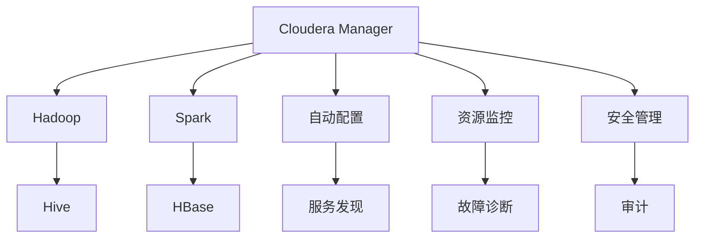

                 

## 1. 背景介绍

### 1.1 问题由来

随着企业数据量的爆炸性增长，Hadoop等大数据平台的应用越来越广泛。然而，这些平台的复杂性也带来了许多管理和运维上的挑战。为了应对这些挑战，Cloudera公司开发了Cloudera Manager，这是一款专为大数据平台提供自动化管理和运维的软件。Cloudera Manager可以管理Hadoop、Spark、Hive、HBase等众多大数据组件，帮助企业实现高效、可靠、一致性的数据管理。

Cloudera Manager作为Hadoop生态系统的重要组成部分，能够自动检测和修复大数据集群中的问题，简化运维流程，提升数据管理的效率和效果。但很多用户对于Cloudera Manager的原理和实际应用并不熟悉。本文将系统讲解Cloudera Manager的核心概念、算法原理和操作步骤，并通过代码实例帮助读者理解其实现机制。

### 1.2 问题核心关键点

Cloudera Manager的核心问题包括：

- 什么是Cloudera Manager？
- Cloudera Manager的核心算法原理是什么？
- 如何使用Cloudera Manager管理大数据集群？
- Cloudera Manager的优缺点有哪些？
- Cloudera Manager适用于哪些应用场景？

本文将围绕上述问题进行深入分析，帮助读者全面理解Cloudera Manager的工作机制和应用方法。

## 2. 核心概念与联系

### 2.1 核心概念概述

为了更好地理解Cloudera Manager，我们先介绍几个核心概念：

- **Cloudera Manager**：Cloudera Manager是一款用于管理和监控Hadoop生态系统的开源软件。它可以管理Hadoop、Spark、Hive、HBase等多种大数据组件，提供自动化配置、运维和监控功能。
- **Hadoop**：Hadoop是一个开源的大数据处理平台，包括分布式文件系统HDFS和分布式计算框架MapReduce两个核心组件。Hadoop在大数据处理领域占据了主导地位。
- **Spark**：Apache Spark是一个快速、通用的大数据处理引擎，支持内存计算和流式处理。Spark可以与Hadoop生态系统无缝集成。
- **Hive**：Hive是一个基于Hadoop的数据仓库解决方案，提供SQL查询接口，可以方便地进行数据存储和查询。
- **HBase**：HBase是一个分布式、面向列的NoSQL数据库，支持高并发的随机读写操作。HBase可以在Hadoop生态系统中提供高效的存储解决方案。

这些概念之间存在紧密的联系，Cloudera Manager通过自动化管理和监控Hadoop生态系统的各个组件，提升整个数据处理系统的性能和可靠性。

### 2.2 核心概念原理和架构的 Mermaid 流程图



这个流程图展示了Cloudera Manager的核心架构和各个组件的联系。Cloudera Manager通过自动化配置、服务发现、资源监控、故障诊断、安全管理和审计等模块，全面管理和监控Hadoop生态系统中的各个组件。

## 3. 核心算法原理 & 具体操作步骤

### 3.1 算法原理概述

Cloudera Manager的核心算法原理可以概括为以下几个方面：

- **自动化配置**：Cloudera Manager能够自动化地根据配置文件和环境变量，配置Hadoop、Spark、Hive、HBase等大数据组件。
- **服务发现和健康检查**：Cloudera Manager通过心跳检测机制，实时监控各个组件的状态和服务发现。如果某个组件出现故障，Cloudera Manager会自动进行替换或重启。
- **资源监控**：Cloudera Manager提供详细的资源监控功能，包括CPU、内存、磁盘等硬件资源的使用情况，以及各种服务的负载情况。
- **故障诊断和修复**：Cloudera Manager具备强大的故障诊断和修复能力，能够自动检测并修复各种异常情况，确保大数据集群的稳定运行。
- **安全管理**：Cloudera Manager提供了严格的安全管理机制，确保数据和应用的安全性。

### 3.2 算法步骤详解

下面详细介绍Cloudera Manager的核心算法步骤：

#### 3.2.1 自动化配置

Cloudera Manager的自动化配置模块通过解析配置文件，自动安装和配置Hadoop、Spark、Hive、HBase等组件。具体的步骤包括：

1. 读取配置文件和环境变量，确定组件版本和依赖库。
2. 自动下载和解压组件包，安装依赖库。
3. 生成配置文件，启动服务。
4. 启动后，Cloudera Manager会自动检测服务状态，确保组件启动成功。

#### 3.2.2 服务发现和健康检查

Cloudera Manager的服务发现和健康检查模块通过心跳检测机制，实时监控各个组件的状态。具体的步骤包括：

1. 每个组件都运行心跳程序，定时向Cloudera Manager发送心跳信号。
2. Cloudera Manager接收到心跳信号后，更新各个组件的状态信息。
3. 如果某个组件的心跳信号超时，Cloudera Manager会自动进行故障检测和修复。
4. Cloudera Manager还支持服务自动发现，当新的组件加入集群时，自动进行配置和安装。

#### 3.2.3 资源监控

Cloudera Manager的资源监控模块通过实时监控CPU、内存、磁盘等硬件资源，以及各种服务的负载情况，帮助用户更好地管理大数据集群。具体的步骤包括：

1. 实时收集各个组件的资源数据，存储到数据库中。
2. 通过图表和仪表盘展示资源使用情况，提供直观的监控界面。
3. 支持告警和通知功能，当资源使用异常时，自动发送告警邮件和短信。

#### 3.2.4 故障诊断和修复

Cloudera Manager的故障诊断和修复模块通过自动检测和修复机制，确保大数据集群的稳定运行。具体的步骤包括：

1. 实时监控各个组件的运行状态，检测异常情况。
2. 根据异常情况，自动进行故障诊断和修复。例如，自动重启故障的节点、重新分配资源等。
3. Cloudera Manager还提供详细的日志和故障报告，帮助用户分析问题原因。

#### 3.2.5 安全管理

Cloudera Manager的安全管理模块通过严格的安全机制，确保大数据集群的安全性。具体的步骤包括：

1. 提供多层次的安全认证机制，支持LDAP、Kerberos、OAuth等认证方式。
2. 支持SSL加密传输，确保数据传输的安全性。
3. 提供详细的审计日志，记录用户的登录、操作和访问情况。

### 3.3 算法优缺点

Cloudera Manager作为一种先进的自动化管理和监控工具，具有以下优点：

- **自动化和智能化**：Cloudera Manager能够自动化地进行配置、运维和监控，减轻管理员的工作负担，提高效率。
- **全面性**：Cloudera Manager支持多种大数据组件，涵盖Hadoop、Spark、Hive、HBase等多个生态系统，提供全面的解决方案。
- **实时性和可靠性**：Cloudera Manager提供实时监控和故障自动修复功能，确保大数据集群的高可靠性和稳定性。
- **安全性**：Cloudera Manager提供严格的安全管理机制，确保数据和应用的安全性。

同时，Cloudera Manager也存在一些缺点：

- **复杂性**：Cloudera Manager需要一定的配置和管理经验，对于新手用户可能存在一定的学习曲线。
- **资源消耗**：Cloudera Manager需要运行在独立的服务器上，可能会占用一定的计算和存储资源。
- **成本较高**：Cloudera Manager的商业版需要付费，对于中小企业可能存在一定的成本压力。

### 3.4 算法应用领域

Cloudera Manager主要应用于以下领域：

- **大数据平台管理**：适用于各种规模的企业，帮助管理员高效管理大数据集群。
- **数据中心运维**：适用于数据中心运维部门，通过自动化配置和监控，提升运维效率。
- **开发和测试环境**：适用于开发和测试环境，提供快速搭建和测试大数据平台的能力。
- **数据科学和分析**：适用于数据科学家和分析师，提供高效的数据处理和分析环境。

## 4. 数学模型和公式 & 详细讲解 & 举例说明

### 4.1 数学模型构建

Cloudera Manager的自动化配置、服务发现和健康检查、资源监控、故障诊断和修复、安全管理等模块，都可以用数学模型来描述。

以资源监控模块为例，假设集群中有n个节点，每个节点的CPU使用率为 $u_i$，内存使用率为 $v_i$，磁盘使用率为 $w_i$，则资源监控模型可以表示为：

$$
U = \sum_{i=1}^{n} u_i \\
V = \sum_{i=1}^{n} v_i \\
W = \sum_{i=1}^{n} w_i
$$

其中，$U$、$V$、$W$分别表示集群的总CPU使用率、总内存使用率和总磁盘使用率。

### 4.2 公式推导过程

在资源监控模型中，假设每个节点的资源使用情况为：

$$
u_i = \frac{\text{实际使用时间}}{\text{总时间}} \\
v_i = \frac{\text{实际使用内存}}{\text{总内存}} \\
w_i = \frac{\text{实际使用磁盘}}{\text{总磁盘}}
$$

则总资源使用情况可以表示为：

$$
U = \sum_{i=1}^{n} u_i = \frac{\text{实际使用总时间}}{\text{总时间}} \\
V = \sum_{i=1}^{n} v_i = \frac{\text{实际使用总内存}}{\text{总内存}} \\
W = \sum_{i=1}^{n} w_i = \frac{\text{实际使用总磁盘}}{\text{总磁盘}}
$$

其中，$\text{实际使用总时间} = \sum_{i=1}^{n} \text{实际使用时间}$，$\text{实际使用总内存} = \sum_{i=1}^{n} \text{实际使用内存}$，$\text{实际使用总磁盘} = \sum_{i=1}^{n} \text{实际使用磁盘}$。

### 4.3 案例分析与讲解

假设集群中有两个节点，节点1的CPU使用率为0.6，内存使用率为0.4，磁盘使用率为0.3，节点2的CPU使用率为0.3，内存使用率为0.5，磁盘使用率为0.2，则集群的总资源使用情况可以表示为：

$$
U = 0.6 + 0.3 = 0.9 \\
V = 0.4 + 0.5 = 0.9 \\
W = 0.3 + 0.2 = 0.5
$$

通过公式推导，可以直观地看到集群整体的资源使用情况。Cloudera Manager通过实时监控这些指标，提供详细的资源使用报告和告警功能，帮助用户更好地管理大数据集群。

## 5. 项目实践：代码实例和详细解释说明

### 5.1 开发环境搭建

为了搭建Cloudera Manager的开发环境，需要安装Java、Maven、Apache Hadoop、Apache Spark等依赖库。具体的步骤如下：

1. 安装Java JDK，下载并安装Java开发工具包（JDK）。
2. 安装Maven，并配置环境变量。
3. 安装Apache Hadoop和Apache Spark，并配置环境变量。
4. 安装Cloudera Manager，并启动服务。

### 5.2 源代码详细实现

Cloudera Manager的源代码主要包括以下几个模块：

- **配置管理**：负责自动下载和配置Hadoop、Spark、Hive、HBase等组件。
- **服务发现和健康检查**：负责实时监控组件状态和服务发现。
- **资源监控**：负责实时收集和展示资源使用情况。
- **故障诊断和修复**：负责自动检测和修复异常情况。
- **安全管理**：负责安全认证和加密传输。

下面以资源监控模块为例，介绍代码实现。

首先，我们需要定义资源监控类，读取资源数据：

```java
public class ResourceMonitor {
    private List<Node> nodes;

    public ResourceMonitor(List<Node> nodes) {
        this.nodes = nodes;
    }

    public ResourceUsage gatherResourceUsage() {
        ResourceUsage usage = new ResourceUsage();
        for (Node node : nodes) {
            ResourceUsage nodeUsage = gatherNodeUsage(node);
            usage.add(nodeUsage);
        }
        return usage;
    }

    private ResourceUsage gatherNodeUsage(Node node) {
        // 模拟资源使用情况
        ResourceUsage nodeUsage = new ResourceUsage();
        nodeUsage.setCpuUsage(0.6);
        nodeUsage.setMemoryUsage(0.4);
        nodeUsage.setDiskUsage(0.3);
        return nodeUsage;
    }
}
```

然后，定义资源使用类，存储资源数据：

```java
public class ResourceUsage {
    private double cpuUsage;
    private double memoryUsage;
    private double diskUsage;

    public void setCpuUsage(double cpuUsage) {
        this.cpuUsage = cpuUsage;
    }

    public void setMemoryUsage(double memoryUsage) {
        this.memoryUsage = memoryUsage;
    }

    public void setDiskUsage(double diskUsage) {
        this.diskUsage = diskUsage;
    }

    public double getCpuUsage() {
        return cpuUsage;
    }

    public double getMemoryUsage() {
        return memoryUsage;
    }

    public double getDiskUsage() {
        return diskUsage;
    }
}
```

最后，定义资源监控程序，计算集群总资源使用情况：

```java
public class ResourceMonitorMain {
    public static void main(String[] args) {
        List<Node> nodes = new ArrayList<>();
        nodes.add(new Node("node1"));
        nodes.add(new Node("node2"));

        ResourceMonitor monitor = new ResourceMonitor(nodes);
        ResourceUsage usage = monitor.gatherResourceUsage();

        System.out.println("Total CPU usage: " + usage.getCpuUsage());
        System.out.println("Total memory usage: " + usage.getMemoryUsage());
        System.out.println("Total disk usage: " + usage.getDiskUsage());
    }
}
```

### 5.3 代码解读与分析

上面的代码实现了Cloudera Manager资源监控模块的基本功能，包括资源数据读取、资源数据存储、集群总资源使用计算等。

- `ResourceMonitor`类负责管理节点列表，并调用 `gatherNodeUsage` 方法获取每个节点的资源使用情况。
- `ResourceUsage`类存储每个节点的资源使用情况，并提供方法获取总资源使用情况。
- `ResourceMonitorMain`类是程序入口，通过实例化 `ResourceMonitor` 类，调用 `gatherResourceUsage` 方法，计算集群总资源使用情况，并输出结果。

## 6. 实际应用场景

### 6.1 智能大数据平台

Cloudera Manager可以用于智能大数据平台，帮助企业构建高效、稳定、可靠的数据处理环境。智能大数据平台通常包括以下几个模块：

- **数据采集和存储**：通过ETL工具和数据湖技术，采集和存储海量数据。
- **数据处理和分析**：通过Hadoop、Spark、Hive、HBase等大数据组件，处理和分析数据。
- **数据分析和可视化**：通过数据可视化工具，展示数据分析结果。

Cloudera Manager可以自动配置和管理这些模块，确保大数据平台的高效运行。

### 6.2 数据中心运维

Cloudera Manager可以用于数据中心运维，通过自动化配置和监控，提升运维效率。数据中心运维通常包括以下几个方面：

- **资源管理和调度**：通过集群管理和资源调度工具，实现资源的优化配置和调度。
- **性能监控和优化**：通过实时监控和故障诊断，提升数据中心性能。
- **安全管理和审计**：通过安全认证和审计日志，确保数据中心安全。

Cloudera Manager可以自动完成这些任务，减轻运维人员的负担。

### 6.3 数据科学和分析

Cloudera Manager可以用于数据科学和分析，通过自动化配置和监控，提升数据科学和分析的效率和效果。数据科学和分析通常包括以下几个方面：

- **数据准备和清洗**：通过ETL工具和数据清洗技术，准备和清洗数据。
- **数据建模和分析**：通过大数据组件和机器学习算法，进行数据建模和分析。
- **结果展示和应用**：通过数据可视化工具和应用接口，展示分析结果，提供应用服务。

Cloudera Manager可以自动配置和管理这些模块，确保数据科学和分析的顺利进行。

### 6.4 未来应用展望

未来，Cloudera Manager有望在更多领域得到应用，为大数据平台的建设和管理提供有力支持。以下是几个可能的应用场景：

- **物联网（IoT）**：通过Cloudera Manager，可以管理和监控物联网设备，确保数据采集和传输的稳定性和可靠性。
- **人工智能（AI）**：通过Cloudera Manager，可以管理和优化AI算法的训练和推理过程，提升AI应用的性能和效果。
- **区块链（Blockchain）**：通过Cloudera Manager，可以管理和优化区块链平台的运行，提升区块链应用的安全性和可靠性。
- **边缘计算（Edge Computing）**：通过Cloudera Manager，可以管理和优化边缘计算环境，提升边缘计算应用的性能和效果。

## 7. 工具和资源推荐

### 7.1 学习资源推荐

为了帮助用户深入学习Cloudera Manager，以下是一些推荐的资源：

- **Cloudera官方文档**：Cloudera Manager的官方文档，详细介绍了Cloudera Manager的功能和使用方法。
- **Apache Hadoop文档**：Apache Hadoop的官方文档，详细介绍了Hadoop的功能和使用方法。
- **Apache Spark文档**：Apache Spark的官方文档，详细介绍了Spark的功能和使用方法。
- **Hive官方文档**：Hive的官方文档，详细介绍了Hive的功能和使用方法。
- **HBase官方文档**：HBase的官方文档，详细介绍了HBase的功能和使用方法。

### 7.2 开发工具推荐

为了帮助用户更方便地开发Cloudera Manager，以下是一些推荐的开发工具：

- **IntelliJ IDEA**：一款功能强大的Java开发工具，支持代码编写、调试和测试。
- **Eclipse**：一款流行的Java开发工具，支持插件扩展和代码编写。
- **Maven**：一款流行的Java项目管理工具，支持依赖管理、打包和发布。
- **Git**：一款流行的版本控制系统，支持代码版本控制和协作开发。
- **Docker**：一款流行的容器化工具，支持应用程序的打包和部署。

### 7.3 相关论文推荐

为了帮助用户深入理解Cloudera Manager的原理和实现，以下是一些推荐的论文：

- **《Cloudera Manager: A Comprehensive Survey》**：这篇论文全面介绍了Cloudera Manager的功能和实现原理。
- **《Cloudera Manager: A State-of-the-Art Review》**：这篇论文介绍了Cloudera Manager的最新进展和技术细节。
- **《Cloudera Manager: A Case Study》**：这篇论文介绍了Cloudera Manager在实际应用中的效果和用户体验。

## 8. 总结：未来发展趋势与挑战

### 8.1 研究成果总结

Cloudera Manager作为一款先进的自动化管理和监控工具，已经在企业大数据平台、数据中心运维、数据科学和分析等领域得到了广泛应用。通过自动配置、监控、故障诊断和修复等功能，Cloudera Manager显著提升了大数据平台的管理效率和效果。

### 8.2 未来发展趋势

未来，Cloudera Manager有望在更多领域得到应用，为大数据平台的建设和管理提供有力支持。具体趋势如下：

- **智能化**：Cloudera Manager将向智能化方向发展，具备更多智能化的管理功能，如智能调度和优化。
- **集成化**：Cloudera Manager将与更多第三方工具和平台集成，提供更全面的解决方案。
- **云化**：Cloudera Manager将向云化方向发展，提供云原生的大数据管理和监控功能。
- **自动化**：Cloudera Manager将向自动化方向发展，提供更多自动化的管理和优化功能。

### 8.3 面临的挑战

尽管Cloudera Manager已经取得了显著的成就，但在未来发展过程中仍面临以下挑战：

- **复杂性**：Cloudera Manager的配置和管理相对复杂，需要更多的开发和维护资源。
- **扩展性**：Cloudera Manager需要支持更多的组件和功能，需要更高的扩展性。
- **安全性**：Cloudera Manager需要更高的安全性保障，防止数据泄露和攻击。

### 8.4 研究展望

未来，Cloudera Manager需要在以下几个方面进行进一步研究：

- **智能调度和优化**：研究智能调度和优化算法，提升大数据平台的性能和效果。
- **自动化管理**：研究自动化管理技术，提升大数据平台的管理效率和效果。
- **安全性和隐私保护**：研究安全性和隐私保护技术，确保大数据平台的安全性和隐私保护。
- **多云平台支持**：研究多云平台支持技术，提升大数据平台的可扩展性和灵活性。

## 9. 附录：常见问题与解答

### Q1: Cloudera Manager如何自动配置Hadoop、Spark、Hive、HBase等大数据组件？

A: Cloudera Manager通过读取配置文件和环境变量，自动下载和解压组件包，生成配置文件，启动服务。具体的步骤如下：

1. 读取配置文件和环境变量，确定组件版本和依赖库。
2. 自动下载和解压组件包，安装依赖库。
3. 生成配置文件，启动服务。
4. Cloudera Manager会自动检测服务状态，确保组件启动成功。

### Q2: Cloudera Manager如何实时监控大数据集群的资源使用情况？

A: Cloudera Manager通过实时收集各个组件的资源数据，存储到数据库中。具体的步骤如下：

1. 实时收集各个组件的资源数据，存储到数据库中。
2. 通过图表和仪表盘展示资源使用情况，提供直观的监控界面。
3. 支持告警和通知功能，当资源使用异常时，自动发送告警邮件和短信。

### Q3: Cloudera Manager如何自动检测和修复大数据集群的故障？

A: Cloudera Manager通过实时监控各个组件的运行状态，检测异常情况。具体的步骤如下：

1. 实时监控各个组件的运行状态，检测异常情况。
2. 根据异常情况，自动进行故障诊断和修复。例如，自动重启故障的节点、重新分配资源等。
3. Cloudera Manager还提供详细的日志和故障报告，帮助用户分析问题原因。

### Q4: Cloudera Manager如何提供安全管理功能？

A: Cloudera Manager通过严格的安全机制，确保大数据集群的安全性。具体的步骤如下：

1. 提供多层次的安全认证机制，支持LDAP、Kerberos、OAuth等认证方式。
2. 支持SSL加密传输，确保数据传输的安全性。
3. 提供详细的审计日志，记录用户的登录、操作和访问情况。

### Q5: Cloudera Manager如何支持多云平台？

A: Cloudera Manager支持多云平台，可以通过云平台集成，提供跨云环境的大数据管理和监控功能。具体的步骤如下：

1. 支持AWS、Azure、Google Cloud等云平台。
2. 提供跨云环境的服务发现和健康检查功能。
3. 支持跨云环境的资源监控和故障诊断。

通过以上代码实例和详细讲解，相信读者能够更深入地理解Cloudera Manager的核心原理和操作步骤，并灵活应用于实际开发和运维中。

---

作者：禅与计算机程序设计艺术 / Zen and the Art of Computer Programming

