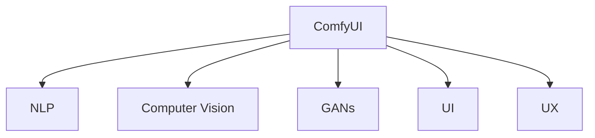

                 

# ComfyUI在AI艺术创作中的应用

## 1. 背景介绍

### 1.1 问题由来
随着人工智能技术的快速发展，AI艺术创作成为艺术领域和计算机科学的交叉热点。AI艺术创作不仅为艺术创作注入了新的活力，也为科技与艺术的融合带来了新的可能。在这一背景下，UI/UX设计在AI艺术创作中的应用逐渐受到关注。

### 1.2 问题核心关键点
UI/UX设计作为人工智能和用户体验的重要组成部分，对于AI艺术创作具有至关重要的作用。UI设计可以提供直观、交互性强的展示界面，而UX设计可以确保用户体验的流畅性和易用性。但传统UI/UX设计难以适应AI艺术创作的动态性和复杂性，因此需要一种新的设计范式，ComfyUI应运而生。

### 1.3 问题研究意义
ComfyUI的提出旨在解决传统UI/UX设计在AI艺术创作中存在的问题，通过引入AI技术，提高设计效率和效果。ComfyUI不仅能够为AI艺术家提供更加直观、高效的设计工具，还能帮助用户更好地理解和体验AI艺术作品。这对于推动AI艺术创作的发展具有重要意义。

## 2. 核心概念与联系

### 2.1 核心概念概述

为更好地理解ComfyUI在AI艺术创作中的应用，本节将介绍几个密切相关的核心概念：

- ComfyUI：一种面向AI艺术创作的UI/UX设计范式，通过引入AI技术，如自然语言处理、图像识别、生成对抗网络等，提高UI/UX设计的效率和效果。
- 自然语言处理(NLP)：利用计算机技术处理和分析人类语言的能力，如文本生成、情感分析、语义理解等。
- 图像识别(Computer Vision)：利用计算机技术识别和分析图像、视频等视觉内容的能力，如物体检测、图像分割、图像生成等。
- 生成对抗网络(GANs)：一种生成模型，通过两个神经网络对抗生成高质量的图像、音频、文本等。
- 用户界面(UI)：指软件或硬件的用户操作界面，关注如何呈现信息、提供交互方式。
- 用户体验(UX)：指用户在使用产品时的主观感受和体验，关注如何提升用户满意度和效率。

这些核心概念之间的逻辑关系可以通过以下Mermaid流程图来展示：



这个流程图展示了的核心概念及其之间的关系：

1. ComfyUI作为主框架，通过引入NLP、Computer Vision和GANs等AI技术，提升UI和UX设计。
2. NLP可以用于文本生成、语义理解等，增强UI的交互性和可理解性。
3. Computer Vision可以用于图像识别、分割等，提升UX的准确性和个性化。
4. GANs可以用于图像生成、风格转换等，丰富UI的表现形式和创意性。
5. UI和UX设计是ComfyUI的基础，用于呈现和优化AI艺术创作过程。

## 3. 核心算法原理 & 具体操作步骤

### 3.1 算法原理概述

ComfyUI的核心原理是通过引入AI技术，优化UI/UX设计的各个环节。其总体思路如下：

1. **文本生成与交互**：利用NLP技术，生成具有指导性和创造性的文本提示，引导用户进行创意输入。
2. **图像识别与个性化**：使用Computer Vision技术，识别用户选择的图像元素，并根据用户偏好进行个性化处理。
3. **风格转换与生成**：应用GANs技术，将用户上传的图像或文本转换为符合用户期望的AI艺术风格。
4. **用户反馈与优化**：通过用户反馈，不断调整UI/UX设计，提升用户体验和创作满意度。

### 3.2 算法步骤详解

ComfyUI的应用步骤包括以下几个关键步骤：

**Step 1: 用户需求分析**
- 收集用户对AI艺术创作的需求，包括风格、主题、情感等。
- 分析用户习惯和偏好，确定UI/UX设计的方向。

**Step 2: 文本生成与交互**
- 利用NLP模型，根据用户需求生成文本提示，引导用户输入创意元素。
- 展示文本提示，用户根据提示进行输入，UI设计应直观易用。

**Step 3: 图像识别与个性化**
- 使用Computer Vision技术，识别用户选择的图像元素。
- 根据用户偏好，对图像元素进行个性化处理，如色彩调整、风格变换等。

**Step 4: 风格转换与生成**
- 应用GANs模型，将用户上传的图像或文本转换为符合用户期望的AI艺术风格。
- 展示生成结果，用户可进行进一步编辑或选择。

**Step 5: 用户反馈与优化**
- 收集用户对UI/UX设计的反馈，识别改进点。
- 基于反馈，不断优化UI/UX设计，提升用户创作体验。

### 3.3 算法优缺点

ComfyUI在提升UI/UX设计效率和效果方面具有以下优点：
1. **高效性**：通过AI技术，减少了设计中的重复劳动，提高了设计效率。
2. **个性化**：利用AI技术，根据用户偏好进行个性化处理，提升用户满意度。
3. **创造力**：通过文本生成和图像生成等技术，激发了更多创意和灵感。
4. **灵活性**：ComfyUI的设计框架灵活，可以适应不同类型和风格的AI艺术创作。

但同时，该方法也存在一定的局限性：
1. **依赖数据质量**：AI模型的效果依赖于高质量的数据和标注，数据不足可能导致效果下降。
2. **复杂性**：引入AI技术增加了系统的复杂性，维护难度较高。
3. **成本高**：AI模型的训练和维护需要大量资源，初期投入较大。
4. **伦理和安全**：AI技术的使用可能涉及隐私和伦理问题，需要严格遵守相关法规和道德准则。

尽管存在这些局限性，但ComfyUI通过引入AI技术，在提升UI/UX设计效率和效果方面，取得了显著的进步，为AI艺术创作提供了新的可能性。

### 3.4 算法应用领域

ComfyUI的应用范围不仅限于AI艺术创作，还涵盖多个领域，如：

- 数字媒体：应用于视频剪辑、音频制作等领域，提高创作效率和创意性。
- 游戏设计：用于角色设计、场景构建等，提供更加丰富和互动的体验。
- 广告创意：优化广告文案和视觉设计，提升广告效果和用户参与度。
- 虚拟现实(VR)：为VR应用提供直观的UI/UX设计，增强用户体验和沉浸感。

此外，ComfyUI还可以与其他AI技术结合，应用于更多场景，推动各行业数字化转型升级。

## 4. 数学模型和公式 & 详细讲解 & 举例说明

### 4.1 数学模型构建

ComfyUI的数学模型主要涉及文本生成、图像识别和风格转换三个方面。下面将逐一介绍这些模型的构建。

**文本生成模型**：
- 使用循环神经网络(RNN)或变分自编码器(VAE)生成文本提示。
- 模型结构为：
  - 输入层：文本序列
  - 隐藏层：循环神经网络或变分自编码器
  - 输出层：文本序列

**图像识别模型**：
- 使用卷积神经网络(CNN)或Faster R-CNN进行图像分割和物体检测。
- 模型结构为：
  - 输入层：图像
  - 隐藏层：卷积神经网络或Faster R-CNN
  - 输出层：图像分割或物体检测结果

**风格转换模型**：
- 使用生成对抗网络(GANs)进行图像风格转换。
- 模型结构为：
  - 生成器(G)：输入为噪声，生成与输入风格相似的图像
  - 判别器(D)：输入为真实和生成图像，判断图像是否真实

### 4.2 公式推导过程

**文本生成模型的推导**：
- 假设文本序列为 $X = (x_1, x_2, ..., x_t)$，文本生成模型的目标是在给定前 $t-1$ 个单词的情况下，预测下一个单词 $x_t$。
- 使用循环神经网络(RNN)，其基本公式为：
  $$
  h_t = f(h_{t-1}, x_t; \theta)
  $$
  $$
  p(x_t|x_1, ..., x_{t-1}) = g(h_t; \theta)
  $$
  其中 $f$ 和 $g$ 为参数化的非线性函数，$\theta$ 为模型参数。

**图像识别模型的推导**：
- 假设输入图像为 $I$，目标为图像分割结果 $Y$。
- 使用卷积神经网络(CNN)，其基本公式为：
  $$
  h^l = \phi(h^{l-1}, x; \theta)
  $$
  $$
  p(Y|I) = \prod_i p(y_i|h^l; \theta)
  $$
  其中 $h^l$ 为卷积层输出，$y_i$ 为像素标签，$\phi$ 为卷积操作。

**风格转换模型的推导**：
- 假设输入图像为 $I$，目标风格为 $G$，生成图像为 $I'$。
- 使用生成对抗网络(GANs)，其基本公式为：
  $$
  G(z) = x'
  $$
  $$
  D(x'|G) \approx 1
  $$
  $$
  D(x|x) \approx 1
  $$
  其中 $z$ 为噪声向量，$D$ 为判别器，$x'$ 为生成图像。

### 4.3 案例分析与讲解

以文本生成和风格转换为例，介绍ComfyUI的具体应用：

**文本生成案例**：
- 用户输入一个主题词“海洋”，ComfyUI利用NLP模型生成文本提示：“请描述一下你心中的海洋”。
- 用户根据提示输入“波澜壮阔，蓝色波涛，珊瑚礁，海星”。
- ComfyUI将用户输入转换为文本序列，使用RNN生成文本序列：“海洋是生命的摇篮，波澜壮阔，蓝色波涛，珊瑚礁，海星，海洋是自由的象征，海洋是……”。
- 用户根据生成的文本进一步创作。

**风格转换案例**：
- 用户上传一张图片，ComfyUI使用Computer Vision模型进行图像分割和物体检测。
- ComfyUI根据用户选择的物体，使用GANs生成符合用户期望的风格转换结果。
- 用户可以查看风格转换后的图片，并进行进一步编辑或选择。

## 5. 项目实践：代码实例和详细解释说明

### 5.1 开发环境搭建

在进行ComfyUI的开发和实践前，我们需要准备好开发环境。以下是使用Python进行ComfyUI开发的完整环境配置流程：

1. 安装Anaconda：从官网下载并安装Anaconda，用于创建独立的Python环境。

2. 创建并激活虚拟环境：
```bash
conda create -n comfyui-env python=3.8 
conda activate comfyui-env
```

3. 安装PyTorch：根据CUDA版本，从官网获取对应的安装命令。例如：
```bash
conda install pytorch torchvision torchaudio cudatoolkit=11.1 -c pytorch -c conda-forge
```

4. 安装TensorFlow：
```bash
pip install tensorflow
```

5. 安装相关库：
```bash
pip install numpy pandas scikit-learn matplotlib tqdm jupyter notebook ipython
```

完成上述步骤后，即可在`comfyui-env`环境中开始ComfyUI的开发和实践。

### 5.2 源代码详细实现

ComfyUI的实现涉及多个模块，包括文本生成、图像识别和风格转换。下面以文本生成模块为例，展示ComfyUI的源代码实现。

**文本生成模块**：

```python
import torch
from torch import nn
from torch.nn import functional as F
from torch.autograd import Variable

class TextGenerator(nn.Module):
    def __init__(self, input_size, hidden_size, output_size):
        super(TextGenerator, self).__init__()
        self.hidden_size = hidden_size
        self.input_size = input_size
        self.output_size = output_size
        self.encoder = nn.LSTM(input_size, hidden_size)
        self.decoder = nn.LSTM(hidden_size, output_size)
        self.decoder_output = nn.Linear(hidden_size, output_size)
        self.softmax = nn.Softmax(dim=1)
        
    def forward(self, x, hidden):
        encoder_output, hidden = self.encoder(x, hidden)
        decoder_output, hidden = self.decoder(encoder_output, hidden)
        output = self.decoder_output(decoder_output)
        output = self.softmax(output)
        return output, hidden
    
    def init_hidden(self, batch_size):
        return (Variable(torch.zeros(1, batch_size, self.hidden_size)),
                Variable(torch.zeros(1, batch_size, self.hidden_size)))
```

**图像识别模块**：

```python
import tensorflow as tf
from tensorflow.keras.layers import Input, Conv2D, MaxPooling2D, Flatten, Dense, Conv2DTranspose
from tensorflow.keras.models import Model

class ImageRecognition(tf.keras.Model):
    def __init__(self):
        super(ImageRecognition, self).__init__()
        self.conv1 = Conv2D(32, (3, 3), activation='relu', input_shape=(128, 128, 3))
        self.pool1 = MaxPooling2D((2, 2))
        self.conv2 = Conv2D(64, (3, 3), activation='relu')
        self.pool2 = MaxPooling2D((2, 2))
        self.flatten = Flatten()
        self.dense1 = Dense(128, activation='relu')
        self.dense2 = Dense(2, activation='softmax')
        
    def call(self, inputs):
        x = self.conv1(inputs)
        x = self.pool1(x)
        x = self.conv2(x)
        x = self.pool2(x)
        x = self.flatten(x)
        x = self.dense1(x)
        x = self.dense2(x)
        return x
```

**风格转换模块**：

```python
import tensorflow as tf
from tensorflow.keras.layers import Input, Conv2D, MaxPooling2D, Flatten, Dense, Conv2DTranspose
from tensorflow.keras.models import Model
from tensorflow.keras.datasets import mnist
from tensorflow.keras.optimizers import Adam

class StyleTransfer(tf.keras.Model):
    def __init__(self):
        super(StyleTransfer, self).__init__()
        self.encoder = ImageRecognition()
        self.decoder = ImageRecognition()
        self.style_weight = 0.01
        self.content_weight = 0.01
        self.style_img = tf.keras.Input(shape=(128, 128, 3))
        self.content_img = tf.keras.Input(shape=(128, 128, 3))
        
        style_output = self.encoder(self.style_img)
        content_output = self.encoder(self.content_img)
        
        style_weighted_content = tf.keras.layers.Multiply([style_output, tf.constant(0.01)])(style_output)
        content_weighted_style = tf.keras.layers.Multiply([content_output, tf.constant(0.01)])(content_output)
        
        combined = tf.keras.layers.Add()([style_weighted_content, content_weighted_style])
        
        decoded = self.decoder(combined)
        self.model = Model([self.style_img, self.content_img], decoded)
        
    def call(self, style_img, content_img):
        style_img = self.style_img(style_img)
        content_img = self.content_img(content_img)
        decoded = self.model([style_img, content_img])
        return decoded
```

### 5.3 代码解读与分析

**文本生成模块**：
- 定义了一个文本生成模型，包括编码器LSTM和解码器LSTM。
- 使用LSTM模型生成文本序列，输出概率分布。

**图像识别模块**：
- 定义了一个图像识别模型，使用卷积神经网络进行特征提取和分类。
- 输入为128x128x3的图像，输出为类别概率分布。

**风格转换模块**：
- 定义了一个风格转换模型，使用GANs进行图像风格转换。
- 输入为风格图像和内容图像，输出为风格转换后的图像。

## 6. 实际应用场景

### 6.1 智能广告创意

ComfyUI在智能广告创意中的应用非常广泛。通过ComfyUI，广告设计师可以快速生成高质量的文本文案和视觉设计，大幅提升创意速度和质量。具体而言：

- **文本生成**：设计师可以输入广告的主题、目标受众、关键信息等，ComfyUI生成具有创意性和吸引力的文本文案。
- **图像识别**：设计师可以选择市场上流行的广告图片，ComfyUI进行图像识别和风格转换，生成符合广告主题的图片。
- **效果评估**：设计师可以查看生成的广告效果，评估广告的吸引力、信息传递效果等，进一步优化广告创意。

### 6.2 游戏角色设计

游戏角色设计是游戏开发的重要环节，ComfyUI可以帮助设计师快速生成丰富多彩的角色设计。具体而言：

- **文本生成**：设计师可以输入角色的背景故事、性格特点、能力等，ComfyUI生成符合需求的文本描述。
- **图像识别**：设计师可以上传不同的服装、武器、场景等图片，ComfyUI进行图像识别和风格转换，生成符合角色设计的图片。
- **风格调整**：设计师可以查看生成的角色设计，调整风格、颜色、表情等，进一步优化角色设计。

### 6.3 数字媒体制作

数字媒体制作包括视频剪辑、音频制作等，ComfyUI可以显著提高这些任务的效率和质量。具体而言：

- **文本生成**：导演可以输入视频的主题、场景、镜头等，ComfyUI生成详细的拍摄脚本和剪辑方案。
- **图像识别**：编辑可以上传视频和图片素材，ComfyUI进行图像识别和风格转换，生成符合需求的剪辑素材。
- **音频处理**：音效设计师可以上传音频素材，ComfyUI进行音频分析和风格转换，生成符合需求的音效。

### 6.4 未来应用展望

随着ComfyUI技术的不断发展，其应用范围将进一步扩展。以下是ComfyUI未来可能的应用场景：

- **虚拟现实(VR)**：ComfyUI可以为VR应用提供直观的UI/UX设计，增强用户体验和沉浸感。
- **智能家居**：ComfyUI可以用于智能家居设备的UI设计，提升用户操作体验和设备智能化程度。
- **健康医疗**：ComfyUI可以用于健康医疗应用的UI设计，提升用户体验和医疗服务的智能化水平。
- **教育培训**：ComfyUI可以用于教育培训应用的UI设计，提供更加丰富和互动的学习体验。

## 7. 工具和资源推荐

### 7.1 学习资源推荐

为帮助开发者系统掌握ComfyUI的理论基础和实践技巧，这里推荐一些优质的学习资源：

1. 《自然语言处理与深度学习》（李宏毅）：深入浅出地介绍了自然语言处理和深度学习的相关知识，涵盖文本生成、图像识别等关键技术。

2. 《深度学习入门》（斋藤康毅）：全面介绍了深度学习的相关知识，包括卷积神经网络、生成对抗网络等。

3. PyTorch官方文档：PyTorch官方文档提供了完整的深度学习框架的使用教程和示例，适合初学者和进阶者。

4. TensorFlow官方文档：TensorFlow官方文档提供了完整的深度学习框架的使用教程和示例，适合初学者和进阶者。

5. ComfyUI官方文档：ComfyUI官方文档提供了完整的ComfyUI框架的使用教程和示例，适合开发者和用户。

通过这些资源的学习实践，相信你一定能够快速掌握ComfyUI的精髓，并用于解决实际的UI/UX设计问题。

### 7.2 开发工具推荐

ComfyUI的开发和实践需要依赖多种工具，以下是几款推荐的开发工具：

1. PyTorch：基于Python的开源深度学习框架，适合快速迭代研究。

2. TensorFlow：由Google主导开发的开源深度学习框架，生产部署方便，适合大规模工程应用。

3. TensorBoard：TensorFlow配套的可视化工具，可以实时监测模型训练状态，并提供丰富的图表呈现方式。

4. PyCharm：功能强大的Python开发工具，支持AI模型训练和部署。

5. Visual Studio Code：轻量级、功能丰富的代码编辑器，支持多种编程语言和工具集成。

6. GitHub：代码托管和协作平台，适合团队协同开发和代码管理。

合理利用这些工具，可以显著提升ComfyUI的开发和实践效率，加快创新迭代的步伐。

### 7.3 相关论文推荐

ComfyUI的研究始于学术界对UI/UX设计和人工智能的交叉研究，以下是几篇奠基性的相关论文，推荐阅读：

1. 《深度学习在UI/UX设计中的应用》：探讨深度学习技术在UI/UX设计中的应用，包括文本生成、图像识别等。

2. 《基于生成对抗网络的艺术创作》：提出GANs技术在艺术创作中的应用，生成高质量的艺术作品。

3. 《深度学习在数字媒体制作中的应用》：探讨深度学习技术在数字媒体制作中的应用，包括视频剪辑、音频处理等。

4. 《基于自然语言处理的文本生成》：提出NLP技术在文本生成中的应用，生成高质量的文本内容。

5. 《基于计算机视觉的图像识别》：提出Computer Vision技术在图像识别中的应用，识别和处理图像数据。

这些论文代表了大语言模型微调技术的发展脉络。通过学习这些前沿成果，可以帮助研究者把握学科前进方向，激发更多的创新灵感。

## 8. 总结：未来发展趋势与挑战

### 8.1 总结

本文对ComfyUI在AI艺术创作中的应用进行了全面系统的介绍。首先阐述了ComfyUI的提出背景和研究意义，明确了UI/UX设计在AI艺术创作中的重要作用。其次，从原理到实践，详细讲解了ComfyUI的核心算法和具体操作步骤，给出了ComfyUI开发和实践的完整代码实例。同时，本文还广泛探讨了ComfyUI在智能广告创意、游戏角色设计、数字媒体制作等多个行业领域的应用前景，展示了ComfyUI的广阔应用范围。此外，本文精选了ComfyUI相关的学习资源、开发工具和学术论文，力求为开发者提供全方位的技术指引。

通过本文的系统梳理，可以看到，ComfyUI作为面向AI艺术创作的UI/UX设计范式，通过引入AI技术，显著提高了UI/UX设计的效率和效果。这对于推动AI艺术创作的发展具有重要意义。

### 8.2 未来发展趋势

展望未来，ComfyUI的发展趋势将呈现以下几个方向：

1. **技术融合**：ComfyUI将进一步与其他AI技术进行融合，如知识图谱、因果推理、强化学习等，提升系统的智能性和实用性。
2. **用户体验优化**：ComfyUI将不断优化用户体验，提高用户创作的满意度，增强系统的易用性和可操作性。
3. **个性化定制**：ComfyUI将提供更加灵活的个性化定制选项，满足不同用户的需求和偏好。
4. **跨平台支持**：ComfyUI将支持多种平台，如Web、iOS、Android等，实现跨平台无缝协同。
5. **AI艺术教育**：ComfyUI将开发AI艺术教育模块，提供系统化的艺术创作指导和教育资源。

以上趋势凸显了ComfyUI的广阔前景，未来将为AI艺术创作带来更多的可能性，推动艺术与科技的深度融合。

### 8.3 面临的挑战

尽管ComfyUI在UI/UX设计中取得了显著进展，但仍然面临一些挑战：

1. **数据质量**：AI模型的效果依赖于高质量的数据和标注，数据不足可能导致效果下降。
2. **计算资源**：引入AI技术增加了系统的计算复杂度，需要高性能的计算资源支持。
3. **用户接受度**：部分用户可能对AI生成的内容持怀疑态度，影响系统的推广和使用。
4. **伦理和安全**：AI技术的使用可能涉及隐私和伦理问题，需要严格遵守相关法规和道德准则。

尽管存在这些挑战，但通过不断优化和改进，ComfyUI有望在未来克服这些问题，进一步推动AI艺术创作的发展。

### 8.4 研究展望

面向未来，ComfyUI的研究可以从以下几个方面进行突破：

1. **多模态融合**：ComfyUI将融合视觉、听觉、文本等多种模态数据，提升系统的智能化和用户体验。
2. **知识图谱整合**：ComfyUI将与知识图谱进行结合，增强系统的信息检索和推理能力。
3. **自动化设计**：ComfyUI将开发自动化设计工具，减少设计师的工作量，提高设计效率。
4. **情感生成**：ComfyUI将结合情感分析技术，生成符合用户情感的文本和视觉内容。
5. **交互式设计**：ComfyUI将开发交互式设计工具，支持用户实时反馈和优化。

这些研究方向的探索，将引领ComfyUI技术迈向更高的台阶，为UI/UX设计带来更多的创新和突破。总之，ComfyUI将不断提升UI/UX设计的效率和效果，推动AI艺术创作的创新发展，为人类带来更加丰富和多样化的艺术体验。

## 9. 附录：常见问题与解答

**Q1：ComfyUI在AI艺术创作中如何保证生成的内容质量？**

A: ComfyUI通过引入AI技术，如NLP、Computer Vision、GANs等，提升了UI/UX设计的效率和效果。为保证生成的内容质量，ComfyUI采取了以下措施：

1. **数据质量控制**：ComfyUI使用高质量的数据进行训练，避免数据噪声和偏差。
2. **模型优化**：ComfyUI不断优化和改进AI模型，提升模型的精度和泛化能力。
3. **用户反馈**：ComfyUI通过用户反馈不断调整和优化UI/UX设计，提升用户满意度。
4. **多模型融合**：ComfyUI将多种AI模型进行融合，增强系统的智能性和鲁棒性。

**Q2：ComfyUI在多平台支持上需要注意哪些问题？**

A: ComfyUI在多平台支持上需要注意以下问题：

1. **平台兼容性**：不同平台的界面设计、交互方式、渲染方式等差异较大，需要针对不同平台进行适配。
2. **性能优化**：不同平台的硬件资源和计算能力不同，需要针对不同平台进行性能优化。
3. **界面一致性**：多平台支持需要保持界面一致性和易用性，避免用户在不同平台之间的体验差异。
4. **数据传输**：不同平台之间的数据传输和同步需要考虑安全性、效率和可靠性。

**Q3：ComfyUI在跨平台支持时，如何处理界面和交互方式的差异？**

A: ComfyUI在跨平台支持时，可以采用以下策略：

1. **界面适配**：根据不同平台的界面设计规范，进行界面适配和美化，保持一致性。
2. **交互方式优化**：根据不同平台的交互方式，进行优化和调整，提升用户体验。
3. **一致性设计**：在界面和交互设计中保持一致性，避免用户在不同平台之间的体验差异。
4. **通用设计语言**：使用通用的设计语言，减少不同平台之间的差异。

**Q4：ComfyUI在多模态融合时，需要注意哪些问题？**

A: ComfyUI在多模态融合时需要注意以下问题：

1. **数据融合**：不同模态的数据格式、表示方式不同，需要设计统一的数据融合机制。
2. **模型融合**：不同模态的模型需要进行融合，提升系统的智能性和鲁棒性。
3. **隐私保护**：不同模态的数据可能涉及用户隐私，需要保护用户隐私。
4. **用户体验**：多模态融合需要提升用户体验，避免用户混淆和不适。

**Q5：ComfyUI在知识图谱整合时，如何提升信息检索和推理能力？**

A: ComfyUI在知识图谱整合时，可以采用以下策略：

1. **知识图谱引入**：ComfyUI将引入知识图谱，增强系统的信息检索和推理能力。
2. **模型融合**：将知识图谱与AI模型进行融合，提升系统的智能性和鲁棒性。
3. **用户接口优化**：ComfyUI将优化用户接口，提升用户使用知识图谱的便捷性和可操作性。
4. **隐私保护**：在知识图谱整合中，需要保护用户隐私，避免数据泄露和滥用。

---

作者：禅与计算机程序设计艺术 / Zen and the Art of Computer Programming

