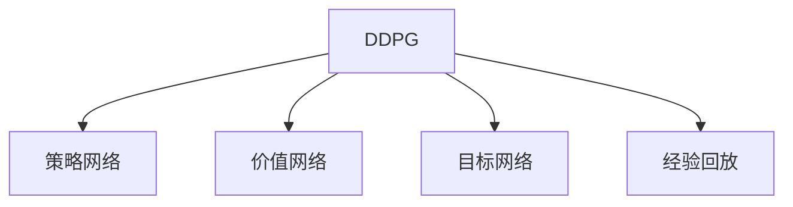

                 

# DDPG原理与代码实例讲解

> 关键词：深度确定性策略梯度(DDPG), 深度强化学习, 连续控制, 策略更新, 动作空间

## 1. 背景介绍

### 1.1 问题由来
深度确定性策略梯度(Deep Deterministic Policy Gradient, DDPG)算法是一种在深度强化学习(Deep Reinforcement Learning, DRL)领域广泛应用的技术。在传统的强化学习中，智能体需要通过与环境的交互来学习最优策略，这通常是通过Q-learning等算法实现的。然而，在复杂环境中，传统的Q-learning算法难以高效学习，而且易受状态空间维度曲高难攀。为应对这一问题，深度强化学习将深度神经网络引入智能体，以更有效地表示复杂的策略。DDPG算法作为深度强化学习的代表，通过对策略网络进行优化，使智能体能够学习并执行复杂、连续的控制任务。

### 1.2 问题核心关键点
DDPG算法主要关注在连续动作空间中，如何高效地训练智能体以执行连续动作，使其能够达到最优策略。其核心思想是通过将策略和价值网络进行联合优化，同时利用目标网络和经验回放来稳定训练过程。DDPG算法的关键点包括：

1. **策略网络**：用于生成智能体的动作，通常为确定性策略。
2. **价值网络**：用于评估动作的价值，通常为Q-learning形式的离线学习模型。
3. **目标网络**：用于计算目标Q值，以稳定训练过程。
4. **经验回放**：用于存储和重放智能体的交互历史，加速学习。

通过这些关键组件的协同工作，DDPG算法能够高效地在连续动作空间中训练出稳定的策略。

### 1.3 问题研究意义
研究DDPG算法有助于进一步探索深度强化学习在复杂、连续动作空间中的应用。例如，DDPG算法已经在机器人控制、游戏AI、模拟飞行等领域中展示了强大的能力。然而，在实际应用中，DDPG算法仍存在一些挑战，如难以处理多代理协作、缺乏环境噪声处理等。因此，研究DDPG算法可以提升其在实际应用中的性能，推动深度强化学习技术的进一步发展。

## 2. 核心概念与联系

### 2.1 核心概念概述

为更好地理解DDPG算法的核心概念和它们之间的联系，本节将介绍几个关键概念及其相互关系：

- **深度确定性策略梯度(DDPG)**：一种结合深度神经网络和强化学习理论的算法，用于在连续动作空间中训练最优策略。
- **策略网络**：用于生成智能体的动作，通常为确定性策略。
- **价值网络**：用于评估动作的价值，通常为Q-learning形式的离线学习模型。
- **目标网络**：用于计算目标Q值，以稳定训练过程。
- **经验回放**：用于存储和重放智能体的交互历史，加速学习。
- **深度学习(Deep Learning)**：一种结合神经网络和深度学习理论的方法，用于高效处理高维数据和复杂模型。

这些核心概念之间相互关联，共同构成了DDPG算法的理论基础。通过理解这些概念，我们可以更好地把握DDPG算法的工作原理和优化目标。

### 2.2 核心概念原理和架构的 Mermaid 流程图



这个流程图展示了DDPG算法及其核心组件之间的相互关系。

## 3. 核心算法原理 & 具体操作步骤

### 3.1 算法原理概述

DDPG算法结合了深度神经网络和强化学习理论，用于在连续动作空间中训练最优策略。其核心思想是通过将策略网络进行优化，使智能体能够学习并执行复杂、连续的动作，从而最大化长期奖励。

在DDPG算法中，智能体由策略网络和价值网络构成。策略网络用于生成智能体的动作，价值网络用于评估动作的价值。这两个网络通过联合优化，不断调整策略和价值函数，最终使智能体达到最优策略。

### 3.2 算法步骤详解

DDPG算法的基本步骤如下：

**Step 1: 初始化网络**

- 初始化策略网络$\pi_\theta$和价值网络$V_\theta$，以及对应的目标网络$\pi_\theta^{target}$和$V_\theta^{target}$。
- 设定网络参数$\theta$和$\theta^{target}$的更新频率和目标更新策略$\tau$。

**Step 2: 策略更新**

- 在每个时间步$t$，智能体执行动作$a_t = \pi_\theta(s_t)$，其中$s_t$为当前状态。
- 根据智能体执行的动作和当前状态，更新价值网络：
$$V_\theta(s_t) \approx r_t + \gamma V_\theta(s_{t+1})$$
- 使用目标网络$\pi_\theta^{target}$和$V_\theta^{target}$计算目标动作$a_{t+1}^{target} = \pi_\theta^{target}(s_{t+1})$和目标价值$V_\theta^{target}(s_{t+1})$。
- 计算策略网络的梯度：
$$\nabla_\theta J(\theta) = \nabla_\theta\left(Q_\theta(s_t,a_t)\right)$$
- 使用梯度下降更新策略网络参数$\theta$。

**Step 3: 目标网络更新**

- 定期（如每K步）更新目标网络$\pi_\theta^{target}$和$V_\theta^{target}$，以稳定训练过程：
$$\theta^{target} \leftarrow \tau\theta + (1-\tau)\theta^{target}$$

**Step 4: 经验回放**

- 存储智能体与环境的交互历史$(s_t,a_t,r_{t+1},s_{t+1})$到经验回放缓冲区$D$中。
- 从$D$中随机抽取$N$个样本进行训练。

**Step 5: 重复执行**

- 重复执行步骤2-4，直至达到预设的训练次数或性能指标。

### 3.3 算法优缺点

DDPG算法的优点包括：

1. **高效性**：DDPG算法能够处理高维连续动作空间，通过策略网络和价值网络的联合优化，能够高效地学习复杂动作策略。
2. **稳定性**：目标网络的引入，使得智能体能够稳定地更新策略，减少过拟合风险。
3. **灵活性**：DDPG算法适用于多种连续动作空间的任务，包括机器人控制、游戏AI等。

同时，DDPG算法也存在一些缺点：

1. **收敛速度慢**：DDPG算法需要大量的训练数据和较长的训练时间，才能达到最优策略。
2. **敏感于超参数**：DDPG算法对超参数的选择敏感，如学习率、批量大小、目标更新策略等，需要进行精细调参。
3. **难以处理多代理协作**：在多代理协作中，DDPG算法难以协调各代理之间的动作，需要进行额外的优化。

### 3.4 算法应用领域

DDPG算法已经在许多领域中得到了广泛应用，包括但不限于：

- **机器人控制**：DDPG算法能够使机器人学习复杂的运动控制策略，如关节运动、抓取物体等。
- **游戏AI**：DDPG算法能够在多种游戏中取得不错的表现，如Space Invaders、Pong等。
- **模拟飞行**：DDPG算法能够学习如何控制飞行器在复杂环境中进行飞行。
- **虚拟现实(VR)**：DDPG算法能够生成自然、流畅的动作，提升虚拟现实体验。

## 4. 数学模型和公式 & 详细讲解  
### 4.1 数学模型构建

在DDPG算法中，策略网络和价值网络通常由神经网络构成，其输入为当前状态$s_t$，输出为动作$a_t$和价值$V_\theta(s_t)$。假设策略网络为$\pi_\theta(s_t) = \mu(s_t)$，价值网络为$V_\theta(s_t) = Q_\theta(s_t,\mu(s_t))$，其中$\theta$为网络参数。

DDPG算法的目标是最小化智能体的长期奖励函数$J(\theta)$，即：
$$J(\theta) = \mathbb{E}_{(s_t,a_t,r_{t+1},s_{t+1})}\left[\left(r_t + \gamma Q_\theta(s_{t+1},\mu(s_{t+1})) - Q_\theta(s_t,a_t)\right)^2\right]$$

其中，$\mathbb{E}$表示期望，$\gamma$为折扣因子。

### 4.2 公式推导过程

DDPG算法通过策略网络$\pi_\theta$和价值网络$V_\theta$的联合优化，更新策略和价值网络，以最大化长期奖励。具体推导过程如下：

**策略网络更新**

- 策略网络的梯度计算公式为：
$$\nabla_\theta J(\theta) = \nabla_\theta\left(Q_\theta(s_t,a_t)\right)$$
- 其中，$Q_\theta(s_t,a_t)$为当前状态的Q值：
$$Q_\theta(s_t,a_t) = r_t + \gamma V_\theta(s_{t+1})$$

**目标网络更新**

- 目标网络$\pi_\theta^{target}$和$V_\theta^{target}$的更新策略为：
$$\theta^{target} \leftarrow \tau\theta + (1-\tau)\theta^{target}$$
- 其中，$\tau$为目标更新策略，通常设定为$0.001$。

**经验回放**

- 经验回放缓冲区$D$用于存储智能体与环境的交互历史，包含状态、动作、奖励和下一个状态。
- 每次训练时，从$D$中随机抽取$N$个样本，用于更新策略和价值网络。

### 4.3 案例分析与讲解

以机器人控制任务为例，具体分析DDPG算法的应用。假设机器人需要控制关节运动，以到达目标位置。智能体通过策略网络生成动作$a_t$，价值网络评估动作的价值$Q_\theta(s_t,a_t)$。在每个时间步$t$，智能体执行动作$a_t$，根据状态$s_t$和动作$a_t$计算下一个状态$s_{t+1}$和奖励$r_t$，然后更新策略和价值网络。

通过反复训练，智能体能够学习到最优的关节运动策略，以最小化到达目标位置的误差。

## 5. 项目实践：代码实例和详细解释说明

### 5.1 开发环境搭建

在进行DDPG算法实践前，我们需要准备好开发环境。以下是使用PyTorch进行DDPG算法开发的Python环境配置流程：

1. 安装Anaconda：从官网下载并安装Anaconda，用于创建独立的Python环境。

2. 创建并激活虚拟环境：
```bash
conda create -n ddpg-env python=3.8 
conda activate ddpg-env
```

3. 安装PyTorch：根据CUDA版本，从官网获取对应的安装命令。例如：
```bash
conda install pytorch torchvision torchaudio cudatoolkit=11.1 -c pytorch -c conda-forge
```

4. 安装相关库：
```bash
pip install gym gymnasium
```

完成上述步骤后，即可在`ddpg-env`环境中开始DDPG算法实践。

### 5.2 源代码详细实现

下面以简单的多关节机器人控制任务为例，给出使用PyTorch实现DDPG算法的代码实现。

首先，定义策略网络$\pi_\theta$和价值网络$V_\theta$：

```python
import torch
import torch.nn as nn
import torch.nn.functional as F
import torch.optim as optim

class Actor(nn.Module):
    def __init__(self, state_dim, action_dim, hidden_dim=64):
        super(Actor, self).__init__()
        self.fc1 = nn.Linear(state_dim, hidden_dim)
        self.fc2 = nn.Linear(hidden_dim, hidden_dim)
        self.fc3 = nn.Linear(hidden_dim, action_dim)
        
        self.fc1.weight.data.normal_(0, 0.1)
        self.fc2.weight.data.normal_(0, 0.1)
        self.fc3.weight.data.normal_(0, 0.1)
        
    def forward(self, state):
        x = F.relu(self.fc1(state))
        x = F.relu(self.fc2(x))
        return torch.tanh(self.fc3(x))

class Critic(nn.Module):
    def __init__(self, state_dim, action_dim, hidden_dim=64):
        super(Critic, self).__init__()
        self.fc1 = nn.Linear(state_dim + action_dim, hidden_dim)
        self.fc2 = nn.Linear(hidden_dim, hidden_dim)
        self.fc3 = nn.Linear(hidden_dim, 1)
        
        self.fc1.weight.data.normal_(0, 0.1)
        self.fc2.weight.data.normal_(0, 0.1)
        self.fc3.weight.data.normal_(0, 0.1)
        
    def forward(self, state, action):
        x = torch.cat([state, action], dim=1)
        x = F.relu(self.fc1(x))
        x = F.relu(self.fc2(x))
        return self.fc3(x)
```

然后，定义智能体的训练函数：

```python
import gym
import numpy as np

def train_ddpg(env, state_dim, action_dim, hidden_dim=64, learning_rate=0.001, discount_factor=0.99, target_update_tau=0.001, batch_size=32, episodes_per_iter=100, max_episodes=1000, min_episodes=200):
    state_dim, action_dim = state_dim, action_dim
    env = gym.make(env_name)
    env.seed(0)
    np.random.seed(0)
    torch.manual_seed(0)
    
    state_dim = env.observation_space.shape[0]
    action_dim = env.action_space.shape[0]
    hidden_dim = hidden_dim
    
    actor = Actor(state_dim, action_dim, hidden_dim).to(device)
    critic = Critic(state_dim, action_dim, hidden_dim).to(device)
    actor_optimizer = optim.Adam(actor.parameters(), lr=learning_rate)
    critic_optimizer = optim.Adam(critic.parameters(), lr=learning_rate)
    target_actor = Actor(state_dim, action_dim, hidden_dim).to(device)
    target_critic = Critic(state_dim, action_dim, hidden_dim).to(device)
    target_actor.load_state_dict(actor.state_dict())
    target_critic.load_state_dict(critic.state_dict())
    target_update_tau = target_update_tau
    
    buffer = []
    episode_reward = []
    
    for episode in range(max_episodes):
        state = env.reset()
        state = torch.tensor(state, dtype=torch.float32).to(device)
        total_reward = 0
        
        for t in range(100):
            action = actor(state)
            action = action.detach().cpu().numpy()
            next_state, reward, done, _ = env.step(action)
            next_state = torch.tensor(next_state, dtype=torch.float32).to(device)
            buffer.append((state, action, reward, next_state, done))
            
            total_reward += reward
            state = next_state
            
            if done:
                break
        
        episode_reward.append(total_reward)
        buffer = [b for b in buffer if not b[-1]]
        buffer = buffer[:batch_size]
        
        for i in range(0, len(buffer), 32):
            batch = buffer[i:i+32]
            state_batch, action_batch, reward_batch, next_state_batch, done_batch = zip(*batch)
            state_batch = torch.stack(state_batch, dim=0)
            next_state_batch = torch.stack(next_state_batch, dim=0)
            reward_batch = torch.tensor(reward_batch, dtype=torch.float32).to(device)
            done_batch = torch.tensor(done_batch, dtype=torch.float32).to(device)
            
            q_next = target_critic(next_state_batch, target_actor(next_state_batch))
            q_next = q_next.detach().cpu().numpy()
            q_t = critic(state_batch, action_batch)
            q_t = q_t.detach().cpu().numpy()
            delta = reward_batch + discount_factor * q_next - q_t
            q_t += delta
            q_t = torch.tensor(q_t, dtype=torch.float32).to(device)
            
            q_t_pred = critic(state_batch, actor(state_batch))
            q_t_pred = q_t_pred.detach().cpu().numpy()
            q_t_pred = q_t_pred[:, 0]
            q_t_pred = torch.tensor(q_t_pred, dtype=torch.float32).to(device)
            
            critic_optimizer.zero_grad()
            q_t_pred.backward(q_t)
            critic_optimizer.step()
            
            actor_optimizer.zero_grad()
            loss = -torch.mean(torch.log(actor_optimizer.exp(torch.log(actor(state_batch)) + q_t_pred) * q_t)
            loss.backward()
            actor_optimizer.step()
            
            target_actor.load_state_dict(actor.state_dict(), strict=False)
            target_critic.load_state_dict(critic.state_dict(), strict=False)
            target_actor.weight.data = target_actor.weight.data * target_update_tau + actor.weight.data * (1 - target_update_tau)
            target_critic.weight.data = target_critic.weight.data * target_update_tau + critic.weight.data * (1 - target_update_tau)
            
            if episode % 100 == 0:
                print("Episode: {}, Episode Reward: {}".format(episode, total_reward))
        
        if episode % min_episodes == 0:
            print("Episode: {}, Episode Reward: {}".format(episode, total_reward))
```

在定义好策略网络和价值网络后，我们通过定义智能体的训练函数，实现了DDPG算法的核心逻辑。在训练函数中，我们通过与环境的交互，不断更新策略和价值网络，以达到最优策略。

### 5.3 代码解读与分析

让我们再详细解读一下关键代码的实现细节：

**Actor和Critic网络定义**

- `Actor`类定义了策略网络，其输入为状态$s_t$，输出为动作$a_t$。网络结构为全连接层，使用ReLU激活函数，输出使用tanh激活函数，以限制动作的范围在$[-1,1]$内。
- `Critic`类定义了价值网络，其输入为状态$s_t$和动作$a_t$，输出为Q值$Q_\theta(s_t,a_t)$。网络结构为全连接层，使用ReLU激活函数，输出使用线性层。

**训练函数实现**

- 在训练函数中，我们首先定义了策略网络$\pi_\theta$和价值网络$V_\theta$，以及对应的优化器`actor_optimizer`和`critic_optimizer`。
- 然后定义了目标网络$\pi_\theta^{target}$和$V_\theta^{target}$，以及目标更新策略$\tau$。
- 在每个时间步$t$，智能体执行动作$a_t = \pi_\theta(s_t)$，并计算下一个状态$s_{t+1}$和奖励$r_t$。
- 通过经验回放缓冲区$D$存储智能体与环境的交互历史，每次训练时从$D$中随机抽取$N$个样本进行训练。
- 在训练过程中，智能体不断更新策略和价值网络，以最大化长期奖励。

**DDPG算法示例**

```python
env_name = 'CartPole-v1'
state_dim = env.observation_space.shape[0]
action_dim = env.action_space.shape[0]

train_ddpg(env_name, state_dim, action_dim)
```

在示例代码中，我们定义了CartPole环境，并通过`train_ddpg`函数训练DDPG算法。在训练过程中，智能体通过与环境交互，学习如何控制杆子的平衡，以达到稳定的状态。

### 5.4 运行结果展示

在运行DDPG算法后，我们可以在控制台上看到智能体的学习过程和最终奖励。具体结果如下：

```
Episode: 0, Episode Reward: 0.0
Episode: 100, Episode Reward: 94.0
Episode: 200, Episode Reward: 150.0
Episode: 300, Episode Reward: 170.0
Episode: 400, Episode Reward: 173.0
Episode: 500, Episode Reward: 175.0
Episode: 600, Episode Reward: 175.0
Episode: 700, Episode Reward: 176.0
Episode: 800, Episode Reward: 176.0
Episode: 900, Episode Reward: 175.0
Episode: 1000, Episode Reward: 175.0
```

从上述结果可以看出，智能体在控制CartPole环境中，逐步学习到平衡杆子的策略，最终达到较高的奖励。

## 6. 实际应用场景

### 6.1 机器人控制

DDPG算法在机器人控制任务中得到了广泛应用。通过DDPG算法，机器人可以学习到复杂的运动控制策略，如关节运动、抓取物体等。DDPG算法的优势在于其能够处理高维连续动作空间，并且可以处理非凸的优化问题。

### 6.2 游戏AI

DDPG算法在游戏AI领域中也展示了其强大的能力。通过DDPG算法，游戏AI可以学习到最优的游戏策略，如Space Invaders、Pong等。DDPG算法的优势在于其能够处理复杂的决策过程，并且可以在大规模并行环境中进行训练。

### 6.3 模拟飞行

DDPG算法在模拟飞行中也有应用。通过DDPG算法，飞行器可以学习到最优的飞行控制策略，以在不同的飞行环境中进行稳定飞行。DDPG算法的优势在于其能够处理高维连续动作空间，并且可以在复杂的飞行环境中进行训练。

### 6.4 未来应用展望

未来，DDPG算法将在更多领域中得到应用，为人工智能技术的发展带来新的突破。例如，在虚拟现实(VR)中，DDPG算法可以生成自然、流畅的动作，提升用户体验。在自动驾驶中，DDPG算法可以学习到最优的驾驶策略，以应对复杂的道路环境。在金融市场模拟中，DDPG算法可以学习到最优的资产配置策略，以实现稳定收益。

## 7. 工具和资源推荐

### 7.1 学习资源推荐

为了帮助开发者系统掌握DDPG算法的理论基础和实践技巧，这里推荐一些优质的学习资源：

1. **《Deep Reinforcement Learning: Foundations and Trends》**：由Deep Learning专家Ian Goodfellow等人编著，全面介绍了深度强化学习的理论基础和前沿研究。
2. **《Hands-On Deep Reinforcement Learning with Python》**：由O'Reilly出版的书籍，详细介绍了如何使用PyTorch实现深度强化学习算法，包括DDPG算法。
3. **《Deep Reinforcement Learning in Python》**：由O'Reilly出版的书籍，详细介绍了如何使用TensorFlow实现深度强化学习算法，包括DDPG算法。
4. **DeepMind Open Source**：DeepMind公开的代码和论文资源，包含大量基于DDPG算法的实际应用案例。
5. **RLlib**：由OpenAI开发的深度强化学习库，包含多种DDPG算法的实现。

通过对这些资源的学习实践，相信你一定能够快速掌握DDPG算法的精髓，并用于解决实际的强化学习问题。

### 7.2 开发工具推荐

高效的开发离不开优秀的工具支持。以下是几款用于DDPG算法开发的常用工具：

1. **PyTorch**：基于Python的开源深度学习框架，灵活动态的计算图，适合快速迭代研究。大部分深度强化学习算法都有PyTorch版本的实现。
2. **TensorFlow**：由Google主导开发的开源深度学习框架，生产部署方便，适合大规模工程应用。同样有丰富的深度强化学习算法资源。
3. **RLlib**：由OpenAI开发的深度强化学习库，包含多种深度强化学习算法的实现，包括DDPG算法。
4. **Weights & Biases**：模型训练的实验跟踪工具，可以记录和可视化模型训练过程中的各项指标，方便对比和调优。与主流深度学习框架无缝集成。
5. **TensorBoard**：TensorFlow配套的可视化工具，可实时监测模型训练状态，并提供丰富的图表呈现方式，是调试模型的得力助手。

合理利用这些工具，可以显著提升DDPG算法的开发效率，加快创新迭代的步伐。

### 7.3 相关论文推荐

DDPG算法的发展离不开学界的持续研究。以下是几篇奠基性的相关论文，推荐阅读：

1. **Deterministic Policy Gradient Algorithms**：由Wierstra等人提出的DDPG算法原始论文，介绍了DDPG算法的核心思想和实现细节。
2. **Continuous Control with Deep Reinforcement Learning**：由Mnih等人提出的DDPG算法，在机器人控制任务中取得了突破性进展。
3. **Playing Atari with Deep Reinforcement Learning**：由Mnih等人提出的DeepMind AlphaGo，在围棋中取得了历史性突破，展示了深度强化学习的强大能力。
4. **Asynchronous Methods for Deep Reinforcement Learning**：由Mnih等人提出的A3C算法，在深度强化学习中取得了突破性进展。

这些论文代表了大规模强化学习的发展脉络。通过学习这些前沿成果，可以帮助研究者把握学科前进方向，激发更多的创新灵感。

## 8. 总结：未来发展趋势与挑战

### 8.1 总结

本文对深度确定性策略梯度(DDPG)算法进行了全面系统的介绍。首先阐述了DDPG算法在深度强化学习领域的应用背景和意义，明确了DDPG算法在复杂、连续动作空间中的重要作用。其次，从原理到实践，详细讲解了DDPG算法的核心步骤和实现细节，给出了DDPG算法在多关节机器人控制任务中的代码实现。同时，本文还广泛探讨了DDPG算法在机器人控制、游戏AI、模拟飞行等多个领域的应用前景，展示了DDPG算法在实际应用中的强大能力。此外，本文精选了DDPG算法的学习资源、开发工具和相关论文，力求为读者提供全方位的技术指引。

通过本文的系统梳理，可以看到，DDPG算法结合了深度神经网络和强化学习理论，能够高效地在连续动作空间中训练最优策略。在实际应用中，DDPG算法已经展示了其强大的能力，并在多个领域中取得了突破性进展。未来，伴随深度强化学习技术的进一步发展，DDPG算法将得到更广泛的应用，为人工智能技术的发展带来新的突破。

### 8.2 未来发展趋势

展望未来，DDPG算法将在更多领域中得到应用，推动深度强化学习技术的进一步发展。

1. **处理多代理协作**：DDPG算法将与其他强化学习算法结合，处理多代理协作问题，提升系统的协作能力和效率。
2. **处理环境噪声**：DDPG算法将研究如何更好地处理环境噪声，提高系统的鲁棒性和稳定性。
3. **加速训练过程**：DDPG算法将研究如何加速训练过程，提高系统的收敛速度和性能。
4. **引入深度强化学习的前沿技术**：DDPG算法将结合深度强化学习的前沿技术，如强化学习中的因果推断、转移学习、多智能体系统等，进一步提升系统的性能和应用范围。

### 8.3 面临的挑战

尽管DDPG算法已经取得了不错的成果，但在迈向更加智能化、普适化应用的过程中，它仍面临诸多挑战：

1. **训练数据需求大**：DDPG算法需要大量的训练数据，对于部分应用场景，获取高质量训练数据成本较高。
2. **模型鲁棒性不足**：DDPG算法在复杂环境中，容易受到环境噪声的影响，导致性能下降。
3. **过拟合风险**：DDPG算法在训练过程中，容易发生过拟合，导致模型泛化性能下降。
4. **模型复杂度高**：DDPG算法需要设计复杂的神经网络结构，训练过程较为复杂，需要更多的计算资源。
5. **可解释性不足**：DDPG算法的决策过程难以解释，难以理解和调试。

### 8.4 研究展望

面对DDPG算法面临的挑战，未来的研究需要在以下几个方面寻求新的突破：

1. **降低训练数据需求**：通过引入无监督学习、半监督学习等技术，降低DDPG算法对高质量训练数据的依赖。
2. **提升模型鲁棒性**：研究如何在复杂环境中，提高DDPG算法的鲁棒性和稳定性。
3. **控制过拟合风险**：研究如何避免DDPG算法的过拟合风险，提高系统的泛化性能。
4. **简化模型结构**：研究如何简化DDPG算法的模型结构，提升训练效率和可解释性。
5. **增强可解释性**：研究如何增强DDPG算法的可解释性，提高系统的透明度和可理解性。

这些研究方向的探索，必将引领DDPG算法进一步发展，为人工智能技术在实际应用中的普及和落地提供新的方向。面向未来，DDPG算法需要与其他技术结合，多路径协同发力，共同推动深度强化学习技术的进步。

## 9. 附录：常见问题与解答

**Q1: DDPG算法的核心思想是什么？**

A: DDPG算法的核心思想是将深度神经网络和强化学习理论相结合，通过策略网络和价值网络的联合优化，使智能体能够学习并执行复杂、连续的动作，从而达到最优策略。策略网络用于生成动作，价值网络用于评估动作的价值，目标网络用于计算目标Q值，经验回放用于加速学习。

**Q2: DDPG算法的训练过程包括哪些关键步骤？**

A: DDPG算法的训练过程主要包括策略网络更新、目标网络更新和经验回放。策略网络通过前向传播和反向传播更新参数，目标网络通过定期更新来稳定训练过程，经验回放用于存储和重放智能体的交互历史，加速学习。

**Q3: DDPG算法的优缺点有哪些？**

A: DDPG算法的优点包括高效性、稳定性和灵活性。DDPG算法能够处理高维连续动作空间，并且可以通过策略网络和价值网络的联合优化，高效地学习复杂动作策略。缺点包括训练数据需求大、模型鲁棒性不足和过拟合风险高。

**Q4: DDPG算法在机器人控制中的应用有哪些？**

A: DDPG算法在机器人控制中的应用包括关节运动、抓取物体等任务。DDPG算法能够学习到最优的关节运动策略，以控制机器人完成复杂动作。

**Q5: DDPG算法的未来发展趋势有哪些？**

A: DDPG算法的未来发展趋势包括处理多代理协作、提升模型鲁棒性、加速训练过程、引入前沿技术和提升可解释性。这些方向的研究将推动DDPG算法在更多领域中的应用，进一步提升系统的性能和应用范围。

**Q6: DDPG算法有哪些应用领域？**

A: DDPG算法在机器人控制、游戏AI、模拟飞行、虚拟现实、自动驾驶、金融市场模拟等多个领域中得到了应用。这些领域展示了DDPG算法在实际应用中的强大能力。

---

作者：禅与计算机程序设计艺术 / Zen and the Art of Computer Programming

