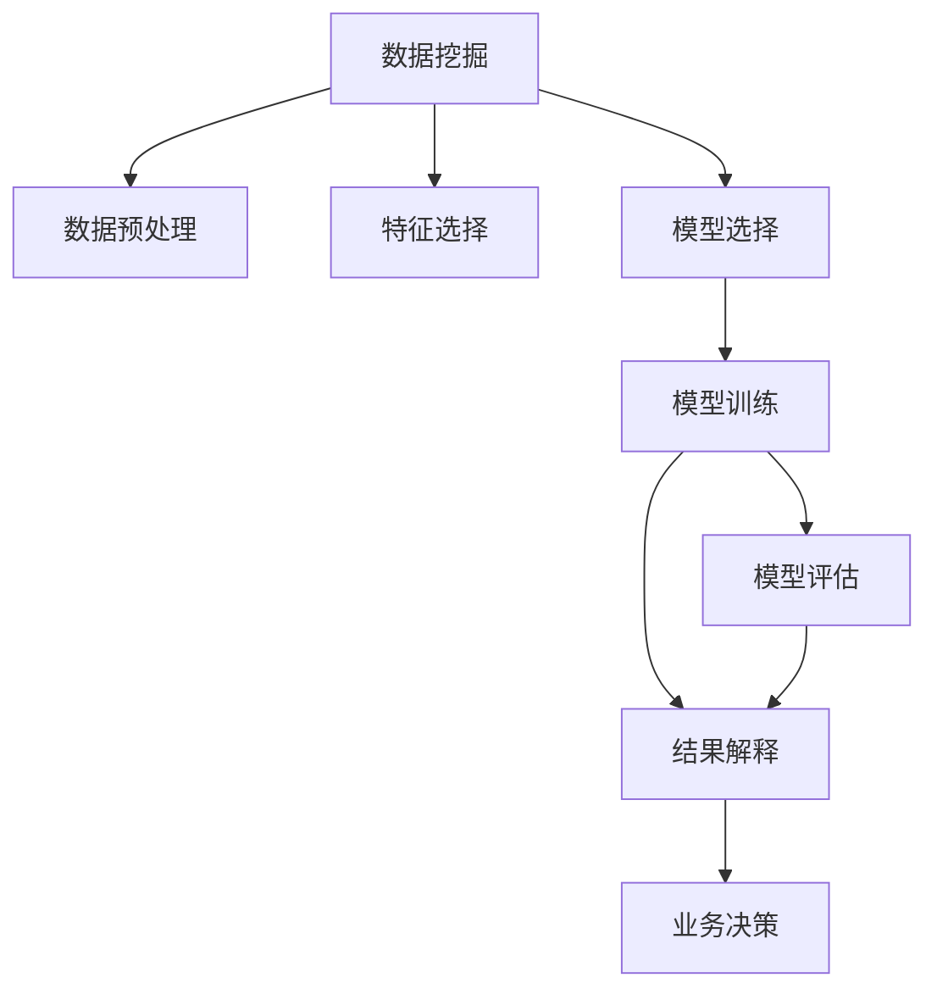

                 

# Data Mining 原理与代码实战案例讲解

> 关键词：数据挖掘,机器学习,Python,统计学,聚类,分类,回归,异常检测

## 1. 背景介绍

### 1.1 问题由来

数据挖掘（Data Mining, DM）是指从大规模数据集中自动发现有用知识和信息的过程。它广泛应用于商业智能、市场分析、网络安全、医疗诊断等多个领域，成为当前大数据时代的重要技术手段。数据挖掘的目标是发现数据中的模式、规律和关联，从而为决策提供依据。

数据挖掘的本质是一种有监督学习和无监督学习的结合，包括数据预处理、特征选择、模型训练、模型评估和结果解释等环节。通过对数据集的分析，数据挖掘可以揭示数据的内在结构和特征，辅助用户进行有效的决策。

### 1.2 问题核心关键点

数据挖掘的核心关键点在于：

- 数据预处理：包括数据清洗、归一化、特征选择等环节，提升数据质量和模型效果。
- 模型选择：选择最适合数据特点的模型，如回归、分类、聚类等，构建准确的预测模型。
- 模型训练：通过训练集数据，调整模型参数，提升模型性能。
- 模型评估：使用测试集数据，评估模型泛化能力和性能表现。
- 结果解释：对模型输出进行解释和可视化，辅助业务决策。

这些关键点共同构成了数据挖掘的完整流程，使得数据挖掘技术在实际应用中具有强大的预测和分析能力。

## 2. 核心概念与联系

### 2.1 核心概念概述

为更好地理解数据挖掘的原理和实践，本节将介绍几个关键概念及其相互关系：

- 数据挖掘（Data Mining, DM）：从大规模数据集中自动发现有用知识和信息的过程，包括数据预处理、特征选择、模型训练、模型评估和结果解释等环节。
- 机器学习（Machine Learning, ML）：利用数据和算法构建预测模型，自动学习数据规律，提升预测能力。
- 统计学（Statistics）：通过统计方法对数据进行分析，发现数据分布和特征。
- 聚类（Clustering）：根据数据特征将数据分成不同的群组，用于数据探索和用户分类。
- 分类（Classification）：根据已知的数据特征预测新数据类别，用于数据预测和目标识别。
- 回归（Regression）：通过拟合数据曲线，预测连续型数值数据，用于数据分析和预测。
- 异常检测（Anomaly Detection）：识别数据中的异常值或异常数据点，用于数据监测和风险预警。

这些核心概念之间的逻辑关系可以通过以下Mermaid流程图来展示：



这个流程图展示了数据挖掘的核心流程，从数据预处理到模型评估，每个环节都为最终结果的输出提供支持。

## 3. 核心算法原理 & 具体操作步骤
### 3.1 算法原理概述

数据挖掘的核心算法原理主要包括以下几个方面：

1. **数据预处理**：数据清洗、归一化、特征选择等。
2. **模型训练**：选择适合的机器学习算法，使用训练集数据训练模型。
3. **模型评估**：使用测试集数据评估模型泛化能力和性能表现。
4. **结果解释**：对模型输出进行解释和可视化，辅助业务决策。

数据挖掘的核心在于选择合适的算法和模型，并进行有效的训练和评估。以下是数据挖掘常见算法及其原理：

1. **聚类算法**：
   - K-means：通过迭代优化，将数据分为K个簇，每个簇中心为簇心。
   - DBSCAN：基于密度聚类，将数据分为核心点、边界点和噪声点。
   - GMM：通过高斯混合模型，将数据分为多个高斯分布。

2. **分类算法**：
   - CART：决策树分类算法，通过树形结构进行分类。
   - SVM：支持向量机分类算法，通过寻找最大间隔超平面进行分类。
   - KNN：K最近邻分类算法，通过K个最近邻的投票结果进行分类。

3. **回归算法**：
   - 线性回归：通过拟合线性模型，预测连续型数值数据。
   - 多项式回归：通过拟合多项式曲线，预测连续型数值数据。
   - 支持向量回归：通过寻找最大间隔超平面，进行回归预测。

4. **异常检测算法**：
   - LOF：基于密度的异常检测算法，通过比较数据点与其邻居的密度差异，检测异常点。
   - 孤立森林：通过构建隔离森林，检测异常数据点。
   - DBSCAN：通过密度聚类，检测异常点。

### 3.2 算法步骤详解

数据挖掘的典型流程包括：

1. **数据收集与预处理**：收集原始数据，并进行清洗、归一化和特征选择。
2. **数据探索与分析**：使用统计方法对数据进行分析，发现数据分布和特征。
3. **模型选择与训练**：根据数据特点选择适合的机器学习算法，使用训练集数据训练模型。
4. **模型评估与优化**：使用测试集数据评估模型泛化能力和性能表现，并根据评估结果进行模型优化。
5. **结果解释与应用**：对模型输出进行解释和可视化，辅助业务决策。

以下是一个基于Python和Scikit-Learn库进行数据挖掘的完整流程示例：

```python
import pandas as pd
from sklearn.model_selection import train_test_split
from sklearn.preprocessing import StandardScaler
from sklearn.cluster import KMeans
from sklearn.linear_model import LogisticRegression
from sklearn.metrics import accuracy_score

# 加载数据
data = pd.read_csv('data.csv')

# 数据清洗和预处理
data = data.dropna()  # 删除缺失值
data = data.drop_duplicates()  # 删除重复值

# 数据探索与分析
print(data.describe())
print(data.corr())

# 数据特征选择
X = data[['feature1', 'feature2', 'feature3']]
y = data['target']

# 数据标准化
scaler = StandardScaler()
X = scaler.fit_transform(X)

# 模型选择与训练
X_train, X_test, y_train, y_test = train_test_split(X, y, test_size=0.2, random_state=42)
kmeans = KMeans(n_clusters=3)
kmeans.fit(X_train)

# 模型评估与优化
y_pred = kmeans.predict(X_test)
accuracy = accuracy_score(y_test, y_pred)
print('Accuracy:', accuracy)

# 结果解释与应用
import matplotlib.pyplot as plt
plt.scatter(X_test[:, 0], X_test[:, 1], c=y_pred)
plt.xlabel('Feature 1')
plt.ylabel('Feature 2')
plt.show()
```

### 3.3 算法优缺点

数据挖掘的优点在于：

1. 自动化数据分析：自动从大规模数据集中发现有用知识和信息，提升数据分析效率。
2. 多领域应用：适用于商业智能、市场分析、网络安全、医疗诊断等多个领域，应用广泛。
3. 灵活的算法选择：根据数据特点选择适合的算法，提升模型效果。

数据挖掘的缺点在于：

1. 数据质量依赖：数据挖掘的效果很大程度上依赖于数据质量，数据噪声和缺失值可能影响结果。
2. 算法复杂度较高：数据挖掘涉及多种算法，算法复杂度较高，需要专业知识支持。
3. 结果解释困难：数据挖掘模型往往复杂，难以对其输出进行有效解释和可视化。

尽管存在这些缺点，但就目前而言，数据挖掘仍然是处理大规模数据集的有效手段，具有广泛的应用前景。

### 3.4 算法应用领域

数据挖掘技术在多个领域得到了广泛应用，包括：

1. **商业智能**：通过分析客户数据，发现客户需求和行为规律，提升销售和营销效果。
2. **市场分析**：分析市场数据，发现市场趋势和变化，辅助企业决策。
3. **网络安全**：通过分析网络流量数据，发现异常行为和攻击模式，提升网络安全防护能力。
4. **医疗诊断**：分析医疗数据，发现疾病规律和特征，提升疾病诊断和治疗效果。
5. **金融分析**：分析金融数据，发现市场规律和风险因素，提升金融风险管理能力。

此外，数据挖掘技术还被应用于更多领域，如城市规划、交通管理、环境监测等，为各行各业提供科学决策支持。

## 4. 数学模型和公式 & 详细讲解 & 举例说明

### 4.1 数学模型构建

数据挖掘的数学模型主要包括以下几种：

1. **聚类模型**：
   - K-means：数据点分为K个簇，每个簇中心为簇心。
   - DBSCAN：数据点分为核心点、边界点和噪声点。
   - GMM：数据点分为多个高斯分布。

2. **分类模型**：
   - CART：通过树形结构进行分类。
   - SVM：通过最大间隔超平面进行分类。
   - KNN：通过K个最近邻的投票结果进行分类。

3. **回归模型**：
   - 线性回归：通过拟合线性模型进行回归预测。
   - 多项式回归：通过拟合多项式曲线进行回归预测。
   - 支持向量回归：通过最大间隔超平面进行回归预测。

4. **异常检测模型**：
   - LOF：基于密度的异常检测算法，通过比较数据点与其邻居的密度差异进行异常检测。
   - 孤立森林：通过构建隔离森林进行异常检测。
   - DBSCAN：通过密度聚类进行异常检测。

### 4.2 公式推导过程

以K-means聚类算法为例，推导其数学公式：

K-means算法通过迭代优化，将数据分为K个簇，每个簇中心为簇心。具体过程如下：

1. 随机选择K个簇心，将数据点分配到最近的簇心。
2. 计算每个簇的数据中心，更新簇心。
3. 重复步骤1和2，直到簇心不再变化或达到预设迭代次数。

设数据集为 $D=\{x_1, x_2, ..., x_n\}$，簇心为 $\mu_k = \frac{1}{N_k} \sum_{x_i \in C_k} x_i$，其中 $C_k$ 为簇 $k$ 的数据点集合。则K-means算法的目标函数为：

$$
\min_{\mu_1, ..., \mu_K} \sum_{i=1}^n \min_{k=1,...,K} ||x_i - \mu_k||^2
$$

其中，$||x_i - \mu_k||^2$ 为数据点 $x_i$ 与簇心 $\mu_k$ 的距离平方。

### 4.3 案例分析与讲解

以下是一个使用Python进行K-means聚类分析的案例：

```python
import numpy as np
from sklearn.cluster import KMeans

# 生成随机数据
data = np.random.rand(100, 2)

# 定义K-means模型，K=3
kmeans = KMeans(n_clusters=3)

# 训练模型
kmeans.fit(data)

# 输出簇心
print(kmeans.cluster_centers_)

# 输出数据点所属的簇
print(kmeans.labels_)
```

## 5. 项目实践：代码实例和详细解释说明
### 5.1 开发环境搭建

在进行数据挖掘实践前，我们需要准备好开发环境。以下是使用Python进行Scikit-Learn开发的环境配置流程：

1. 安装Anaconda：从官网下载并安装Anaconda，用于创建独立的Python环境。

2. 创建并激活虚拟环境：
```bash
conda create -n dm-env python=3.8 
conda activate dm-env
```

3. 安装Scikit-Learn：
```bash
conda install scikit-learn
```

4. 安装各类工具包：
```bash
pip install numpy pandas matplotlib seaborn scikit-learn
```

完成上述步骤后，即可在`dm-env`环境中开始数据挖掘实践。

### 5.2 源代码详细实现

下面以K-means聚类分析为例，给出使用Scikit-Learn库进行数据挖掘的完整代码实现。

首先，定义数据集和聚类模型：

```python
from sklearn.cluster import KMeans
import numpy as np
import matplotlib.pyplot as plt

# 生成随机数据
data = np.random.rand(100, 2)

# 定义K-means模型，K=3
kmeans = KMeans(n_clusters=3)

# 训练模型
kmeans.fit(data)

# 输出簇心
print(kmeans.cluster_centers_)

# 输出数据点所属的簇
print(kmeans.labels_)
```

然后，可视化聚类结果：

```python
# 可视化聚类结果
plt.scatter(data[:, 0], data[:, 1], c=kmeans.labels_)
plt.scatter(kmeans.cluster_centers_[:, 0], kmeans.cluster_centers_[:, 1], marker='*', s=300, c='red')
plt.xlabel('Feature 1')
plt.ylabel('Feature 2')
plt.show()
```

### 5.3 代码解读与分析

让我们再详细解读一下关键代码的实现细节：

**K-means算法**：
- `KMeans`类：Scikit-Learn库提供的K-means聚类算法实现。
- `n_clusters`参数：指定簇的个数。
- `fit`方法：训练K-means模型，更新簇心和标签。
- `cluster_centers_`属性：获取簇心。
- `labels_`属性：获取数据点所属的簇。

**数据集生成**：
- `np.random.rand`函数：生成100个随机数据点，每个数据点包含两个特征。
- `data[:, 0]`和`data[:, 1]`：提取数据点的第一个和第二个特征。

**可视化**：
- `plt.scatter`函数：绘制散点图，展示数据点和簇心。
- `marker='*'`参数：簇心的标记为星号。
- `s=300`参数：簇心的大小。
- `c='red'`参数：簇心的颜色。

可以看到，Scikit-Learn库提供了简单易用的API，使得K-means聚类算法的使用变得非常简单。开发者可以专注于算法原理和结果分析，而不必过多关注底层实现细节。

当然，在工业级的系统实现中，还需要考虑更多因素，如数据集的高效处理、聚类算法的高效实现、结果的可视化展示等。但核心的数据挖掘流程基本与此类似。

## 6. 实际应用场景
### 6.1 电商推荐系统

数据挖掘技术在电商推荐系统中得到了广泛应用。通过分析用户行为数据，电商推荐系统可以发现用户的兴趣和偏好，推荐个性化的商品，提升用户体验和销售转化率。

在技术实现上，可以收集用户浏览、点击、购买等行为数据，进行数据预处理和特征选择。然后，使用聚类算法对用户进行分组，找出兴趣相似的用户群体。接着，使用分类算法对用户和商品进行分类，构建商品推荐矩阵。最后，根据用户分群和商品分类，进行推荐决策，输出个性化推荐列表。

### 6.2 客户细分与画像

数据挖掘技术可以帮助企业进行客户细分与画像，提升市场营销的精准度和效果。通过分析客户历史行为数据，数据挖掘可以发现不同客户群体的特征和需求，为针对性的营销活动提供支持。

在技术实现上，可以收集客户历史购买、浏览、点击等行为数据，进行数据预处理和特征选择。然后，使用聚类算法对客户进行分组，找出不同客户群体。接着，使用分类算法对客户进行分类，构建客户画像。最后，根据客户画像和市场特征，进行针对性的营销活动，提升市场效果。

### 6.3 网络异常检测

数据挖掘技术可以用于网络异常检测，防范网络攻击和风险。通过分析网络流量数据，数据挖掘可以发现异常行为和攻击模式，提升网络安全防护能力。

在技术实现上，可以收集网络流量数据，进行数据预处理和特征选择。然后，使用异常检测算法对数据进行检测，找出异常数据点。接着，使用分类算法对异常数据进行分类，确定异常类型和严重程度。最后，根据异常检测结果，采取相应的安全措施，保护网络安全。

### 6.4 未来应用展望

随着数据挖掘技术的不断发展，未来在更多领域都将得到应用，为各行各业提供科学决策支持。

在智慧医疗领域，数据挖掘技术可以用于患者数据分析、疾病预测和诊断，提升医疗服务的智能化水平。

在智能教育领域，数据挖掘技术可以用于学生行为分析、知识推荐和智能辅导，提升教育效果。

在智慧城市治理中，数据挖掘技术可以用于城市事件监测、舆情分析、应急指挥，提高城市管理的自动化和智能化水平。

此外，在企业生产、社会治理、文娱传媒等众多领域，数据挖掘技术也将不断涌现，为经济社会发展注入新的动力。相信随着技术的日益成熟，数据挖掘必将在更广阔的应用领域大放异彩。

## 7. 工具和资源推荐
### 7.1 学习资源推荐

为了帮助开发者系统掌握数据挖掘的理论基础和实践技巧，这里推荐一些优质的学习资源：

1. 《Python数据科学手册》：由数据科学家Jake VanderPlas撰写，全面介绍了Python在数据科学中的应用，包括数据预处理、模型训练、结果可视化等。

2. 《数据挖掘导论》：由J.stanley Smith和Marcus Rowe撰写，全面介绍了数据挖掘的原理和应用，包括聚类、分类、回归、异常检测等。

3. 《机器学习实战》：由Peter Harrington撰写，通过丰富的案例和实战项目，介绍了机器学习算法的实现和应用。

4. Kaggle平台：全球最大的数据科学竞赛平台，提供了丰富的数据集和比赛项目，适合学习和实践数据挖掘技术。

5. Coursera课程：斯坦福大学和密歇根大学开设的数据挖掘课程，有视频讲座和配套作业，带你深入学习数据挖掘的原理和应用。

通过对这些资源的学习实践，相信你一定能够快速掌握数据挖掘的精髓，并用于解决实际的数据问题。

### 7.2 开发工具推荐

高效的开发离不开优秀的工具支持。以下是几款用于数据挖掘开发的常用工具：

1. Jupyter Notebook：免费的交互式编程环境，支持Python和R等多种语言，方便实验和调试。

2. Anaconda：用于创建和管理Python环境的开源平台，方便科学计算和数据挖掘。

3. Scikit-Learn：Python机器学习库，提供了多种数据挖掘算法和工具，易于使用。

4. TensorBoard：TensorFlow配套的可视化工具，用于实时监测模型训练状态，提供丰富的图表展示。

5. Weights & Biases：模型训练的实验跟踪工具，可以记录和可视化模型训练过程中的各项指标，方便对比和调优。

6. Pandas：Python数据处理库，提供了丰富的数据清洗和预处理工具，方便数据挖掘任务的处理。

合理利用这些工具，可以显著提升数据挖掘任务的开发效率，加快创新迭代的步伐。

### 7.3 相关论文推荐

数据挖掘技术的发展离不开学界的持续研究。以下是几篇奠基性的相关论文，推荐阅读：

1. 《K-means算法及其应用》：介绍了K-means算法的原理和应用，是聚类算法的经典之作。

2. 《支持向量机：统计学习理论与算法》：介绍了支持向量机算法的原理和应用，是分类算法的经典之作。

3. 《随机森林：一种数据挖掘技术》：介绍了随机森林算法的原理和应用，是集成学习算法的经典之作。

4. 《LOF：基于密度的异常检测算法》：介绍了LOF算法的原理和应用，是异常检测算法的经典之作。

这些论文代表了大数据挖掘技术的发展脉络。通过学习这些前沿成果，可以帮助研究者把握学科前进方向，激发更多的创新灵感。

## 8. 总结：未来发展趋势与挑战
### 8.1 总结

本文对数据挖掘的原理和实践进行了全面系统的介绍。首先阐述了数据挖掘的背景和意义，明确了数据挖掘在商业智能、市场分析、网络安全、医疗诊断等多个领域的应用价值。其次，从原理到实践，详细讲解了数据挖掘的数学模型和算法步骤，给出了数据挖掘任务开发的完整代码实例。同时，本文还探讨了数据挖掘技术在电商推荐、客户细分、网络异常检测等多个行业领域的应用前景，展示了数据挖掘技术的广泛应用。此外，本文精选了数据挖掘技术的各类学习资源，力求为读者提供全方位的技术指引。

通过本文的系统梳理，可以看到，数据挖掘技术在商业智能、市场分析、网络安全、医疗诊断等多个领域具有广泛的应用前景，能够为各行各业提供科学决策支持。尽管存在数据质量依赖、算法复杂度高、结果解释困难等挑战，但通过合理选择算法和工具，结合实际应用场景，数据挖掘技术可以发挥出强大的数据分析和预测能力，提升企业决策水平和市场竞争力。未来，伴随数据挖掘技术的持续演进，相信其应用领域将不断拓展，为经济社会发展注入新的动力。

### 8.2 未来发展趋势

展望未来，数据挖掘技术将呈现以下几个发展趋势：

1. **算法多样性**：未来数据挖掘算法将更加多样，结合机器学习、深度学习、强化学习等多种算法，提升数据挖掘的效果和应用范围。

2. **自动化程度提升**：数据挖掘算法将更加自动化，减少人工干预，提升数据挖掘的效率和准确性。

3. **多模态数据挖掘**：数据挖掘将结合多模态数据（如文本、图像、语音等），进行综合分析，提升数据挖掘的全面性和深入性。

4. **实时数据挖掘**：数据挖掘将更加实时，能够处理动态变化的数据，提升决策的及时性和适应性。

5. **边缘计算支持**：数据挖掘算法将支持边缘计算，在数据采集和处理环节进行优化，减少延迟和带宽消耗，提升数据挖掘的效率。

6. **可解释性增强**：数据挖掘算法将更加注重结果的可解释性，通过解释模型输出，提升决策的透明性和可理解性。

以上趋势凸显了数据挖掘技术的广阔前景。这些方向的探索发展，将进一步提升数据挖掘的效果和应用范围，为各行各业提供更加科学、智能的数据决策支持。

### 8.3 面临的挑战

尽管数据挖掘技术已经取得了显著进展，但在迈向更加智能化、普适化应用的过程中，仍面临诸多挑战：

1. **数据质量问题**：数据挖掘的效果很大程度上依赖于数据质量，数据噪声和缺失值可能影响结果。
2. **算法复杂度较高**：数据挖掘涉及多种算法，算法复杂度较高，需要专业知识支持。
3. **结果解释困难**：数据挖掘模型往往复杂，难以对其输出进行有效解释和可视化。
4. **实时性要求高**：实时数据挖掘对算法效率和资源消耗提出了更高要求。
5. **边缘计算普及度低**：边缘计算在数据采集和处理环节的应用还比较有限，尚未普及。

尽管存在这些挑战，但通过合理的算法选择和工具支持，结合实际应用场景，数据挖掘技术仍能发挥出强大的数据分析和预测能力，提升企业决策水平和市场竞争力。

### 8.4 研究展望

未来，数据挖掘技术需要在以下几个方面寻求新的突破：

1. **自动数据清洗**：开发自动化的数据清洗技术，减少人工干预，提升数据质量。
2. **可解释模型构建**：开发可解释性强的数据挖掘模型，增强模型输出解释和可视化。
3. **多模态数据融合**：开发多模态数据挖掘技术，提升数据挖掘的全面性和深入性。
4. **实时数据处理**：开发实时数据挖掘技术，提升数据挖掘的及时性和适应性。
5. **边缘计算支持**：开发支持边缘计算的数据挖掘算法，提升数据挖掘的效率和可靠性。

这些研究方向的探索，将引领数据挖掘技术迈向更高的台阶，为各行各业提供更加科学、智能的数据决策支持。面向未来，数据挖掘技术还需要与其他人工智能技术进行更深入的融合，如知识表示、因果推理、强化学习等，多路径协同发力，共同推动数据挖掘技术的进步。只有勇于创新、敢于突破，才能不断拓展数据挖掘技术的边界，让数据挖掘技术更好地服务于各行各业的发展需求。

## 9. 附录：常见问题与解答

**Q1：数据挖掘与机器学习有何区别？**

A: 数据挖掘是机器学习的一个子领域，主要关注从大规模数据集中自动发现有用知识和信息的过程。而机器学习则是通过数据和算法构建预测模型，自动学习数据规律，提升预测能力。数据挖掘注重从数据中发现知识，而机器学习注重构建预测模型，两者相辅相成。

**Q2：数据挖掘是否适用于所有领域？**

A: 数据挖掘适用于许多领域，但不同领域的复杂度和数据特点各不相同。在数据质量较好、数据规模较大、数据特点清晰的领域，数据挖掘可以发挥出较好的效果。但对于数据质量较差、数据规模较小、数据特点复杂的领域，数据挖掘可能难以取得理想的效果，需要结合其他方法进行补充。

**Q3：数据挖掘在实际应用中需要注意哪些问题？**

A: 数据挖掘在实际应用中需要注意以下问题：
1. 数据质量：数据挖掘的效果很大程度上依赖于数据质量，数据噪声和缺失值可能影响结果。
2. 算法选择：选择适合数据特点的算法，提升数据挖掘的效果。
3. 结果解释：对数据挖掘模型输出进行解释和可视化，增强决策的透明性和可理解性。
4. 实时性要求：实时数据挖掘对算法效率和资源消耗提出了更高要求。
5. 边缘计算：支持边缘计算的数据挖掘算法能够提升数据采集和处理的效率。

通过合理选择算法和工具，结合实际应用场景，数据挖掘技术可以发挥出强大的数据分析和预测能力，提升企业决策水平和市场竞争力。

**Q4：数据挖掘的未来发展方向有哪些？**

A: 数据挖掘的未来发展方向包括：
1. 算法多样性：结合机器学习、深度学习、强化学习等多种算法，提升数据挖掘的效果和应用范围。
2. 自动化程度提升：减少人工干预，提升数据挖掘的效率和准确性。
3. 多模态数据挖掘：结合多模态数据（如文本、图像、语音等），进行综合分析，提升数据挖掘的全面性和深入性。
4. 实时数据挖掘：处理动态变化的数据，提升决策的及时性和适应性。
5. 可解释性增强：通过解释模型输出，提升决策的透明性和可理解性。
6. 边缘计算支持：提升数据采集和处理的效率和可靠性。

这些方向的探索发展，将进一步提升数据挖掘的效果和应用范围，为各行各业提供更加科学、智能的数据决策支持。

---

作者：禅与计算机程序设计艺术 / Zen and the Art of Computer Programming

