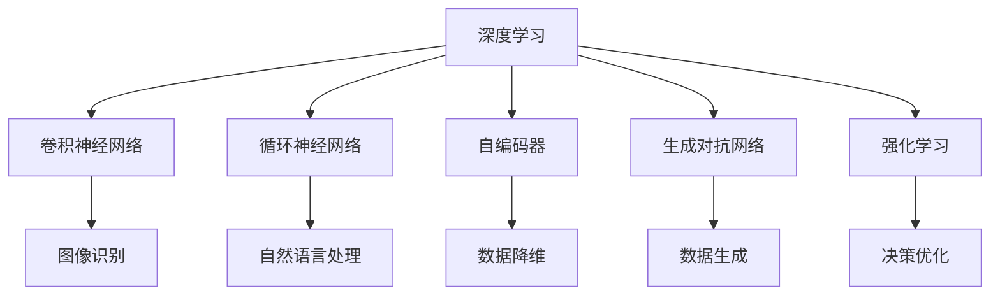

                 

# Deep Learning

> 关键词：深度学习,神经网络,反向传播,卷积神经网络,循环神经网络,自编码器,生成对抗网络,强化学习,迁移学习,深度学习框架

## 1. 背景介绍

### 1.1 问题由来
深度学习(Deep Learning)作为当前人工智能领域的核心技术之一，已广泛应用于计算机视觉、自然语言处理、语音识别、游戏策略等多个领域，并取得了令人瞩目的成果。深度学习技术的崛起，主要得益于以下几个关键因素：

- **大数据时代**：随着互联网的普及，各种图像、文本、音频等数据的积累为深度学习提供了丰富的训练素材。
- **高性能计算资源**：现代计算机硬件的发展，特别是GPU、TPU等加速器，使得深度学习模型可以在合理的时间内完成训练。
- **算法突破**：如卷积神经网络(CNN)、循环神经网络(RNN)、自编码器(AE)、生成对抗网络(GAN)等，提供了更高效的特征提取和表示学习方法。

这些因素共同推动了深度学习技术的快速发展，并开启了人工智能的全新时代。

### 1.2 问题核心关键点
深度学习模型通常由多层神经网络构成，每个神经元接收上一层若干个神经元的输出，并通过激活函数进行非线性映射，构建出复杂的特征表示。深度学习模型的训练过程一般采用反向传播算法，通过梯度下降法不断调整模型参数，最小化预测输出与真实标签之间的误差。

深度学习模型主要包括：

- **卷积神经网络(CNN)**：主要用于图像识别、分类等任务，通过卷积操作提取空间局部特征。
- **循环神经网络(RNN)**：用于处理序列数据，如自然语言处理、语音识别等，通过循环结构保留序列信息。
- **自编码器(AE)**：一种无监督学习方法，通过重构输入数据，学习数据的低维表示。
- **生成对抗网络(GAN)**：由生成器和判别器两部分组成，通过对抗训练生成高质量的图像、音频等数据。
- **强化学习(RL)**：通过智能体与环境的交互，优化决策策略，适用于游戏、机器人控制等任务。

这些模型通过不同的网络结构和优化算法，构建出强大的特征表示和建模能力，使得深度学习在复杂多变的任务上表现优异。

### 1.3 问题研究意义
深度学习模型在诸多领域的成功应用，标志着其已经成为现代人工智能技术的重要支柱。研究深度学习算法和模型，对于推动人工智能技术的进步，促进各行业智能化转型具有重要意义：

1. **提升计算效率**：深度学习算法通过特征共享和参数共享，大幅提升了计算效率，使得大规模数据分析成为可能。
2. **提升模型精度**：深度学习模型通过多层非线性映射，能够学习到数据中复杂的分布特征，显著提升模型的预测精度。
3. **促进跨领域融合**：深度学习模型可以跨领域应用，如在计算机视觉领域取得成功的同时，也将这些技术引入自然语言处理、语音识别等任务中，推动了各领域的交叉融合。
4. **推动产业化应用**：深度学习技术的成熟，使得其能够在医疗、金融、零售等多个行业中得到广泛应用，提升了行业的智能化水平。
5. **激发创新思路**：深度学习技术的成功，激发了更多创新思路，如迁移学习、零样本学习、元学习等，拓展了人工智能研究的边界。

## 2. 核心概念与联系

### 2.1 核心概念概述

为更好地理解深度学习技术的核心概念，本节将介绍几个密切相关的核心概念：

- **深度学习(Deep Learning)**：一种基于多层神经网络的人工智能技术，通过学习数据分布，构建复杂的特征表示。
- **卷积神经网络(CNN)**：一种广泛应用于计算机视觉的神经网络，通过卷积操作提取空间局部特征。
- **循环神经网络(RNN)**：用于处理序列数据的神经网络，通过循环结构保留序列信息。
- **自编码器(AE)**：一种无监督学习方法，通过重构输入数据，学习数据的低维表示。
- **生成对抗网络(GAN)**：由生成器和判别器两部分组成，通过对抗训练生成高质量的数据。
- **强化学习(RL)**：通过智能体与环境的交互，优化决策策略，适用于游戏、机器人控制等任务。

这些核心概念之间的逻辑关系可以通过以下Mermaid流程图来展示：



这个流程图展示了几类深度学习模型及其应用场景：

1. CNN用于图像识别等计算机视觉任务。
2. RNN用于自然语言处理、语音识别等序列数据任务。
3. AE用于数据降维，提高数据表示的效率。
4. GAN用于生成高质量的图像、音频等数据。
5. RL用于优化智能体的决策策略，如游戏、机器人控制等。

这些核心概念共同构成了深度学习技术的核心框架，使得深度学习在多个领域取得了显著成果。

## 3. 核心算法原理 & 具体操作步骤
### 3.1 算法原理概述

深度学习的核心思想是通过多层神经网络构建复杂的特征表示，从而提升模型的表达能力和泛化能力。深度学习模型的训练过程一般采用反向传播算法，通过梯度下降法不断调整模型参数，最小化预测输出与真实标签之间的误差。

具体而言，深度学习模型的训练过程包括以下几个关键步骤：

1. **模型初始化**：随机初始化模型的权重参数。
2. **前向传播**：将输入数据送入模型，计算各层神经元的激活值。
3. **计算损失**：计算预测输出与真实标签之间的误差。
4. **反向传播**：通过链式法则，计算损失函数对各层神经元的梯度。
5. **参数更新**：使用梯度下降法更新模型参数，最小化损失函数。
6. **迭代优化**：重复上述步骤，直至模型收敛。

通过不断迭代优化，深度学习模型能够逐步逼近真实的模型，并在新的任务上进行迁移学习。

### 3.2 算法步骤详解

以下是深度学习模型训练的详细步骤：

**Step 1: 准备数据集**
- 收集训练集、验证集和测试集，划分数据集。
- 对数据集进行预处理，如数据增强、归一化等。

**Step 2: 设计模型结构**
- 选择合适的神经网络结构，如CNN、RNN、GAN等。
- 设计模型的超参数，如学习率、批大小、迭代轮数等。

**Step 3: 训练模型**
- 将训练集数据分批次输入模型，前向传播计算激活值和损失。
- 反向传播计算各层梯度，使用梯度下降法更新参数。
- 周期性在验证集上评估模型性能，根据性能指标决定是否触发Early Stopping。
- 重复上述步骤直到满足预设的迭代轮数或Early Stopping条件。

**Step 4: 测试模型**
- 在测试集上评估模型性能，对比训练前后的精度提升。
- 使用训练好的模型对新数据进行推理预测，集成到实际的应用系统中。

以上是深度学习模型训练的一般流程。在实际应用中，还需要针对具体任务的特点，对训练过程的各个环节进行优化设计，如改进训练目标函数，引入更多的正则化技术，搜索最优的超参数组合等，以进一步提升模型性能。

### 3.3 算法优缺点

深度学习模型具有以下优点：
1. **自动特征提取**：深度学习模型能够自动学习数据的特征表示，无需人工干预。
2. **泛化能力强**：深度学习模型具有较强的泛化能力，能够适应多种数据分布。
3. **精度高**：深度学习模型通过多层非线性映射，能够学习到数据中复杂的分布特征，显著提升模型的预测精度。
4. **端到端训练**：深度学习模型可以端到端训练，自动构建输入到输出的映射关系。

同时，深度学习模型也存在一定的局限性：
1. **计算资源需求高**：深度学习模型参数量巨大，对计算资源和存储空间提出了较高要求。
2. **模型复杂度高**：深度学习模型结构复杂，调试和优化难度较大。
3. **训练时间长**：深度学习模型通常需要较长的训练时间，特别是在大规模数据集上。
4. **过拟合风险高**：深度学习模型容易过拟合，特别是在训练数据不足的情况下。
5. **解释性差**：深度学习模型通常被视为"黑盒"，难以解释其内部工作机制和决策逻辑。

尽管存在这些局限性，但就目前而言，深度学习模型仍是最主流的人工智能技术，其高效特征表示和广泛应用前景吸引了众多研究和工业界的关注。

### 3.4 算法应用领域

深度学习模型在诸多领域已取得了显著的应用成果，以下是一些典型应用：

- **计算机视觉**：如图像分类、目标检测、图像生成等，使用CNN等模型处理图像数据。
- **自然语言处理**：如机器翻译、文本分类、情感分析等，使用RNN、Transformer等模型处理文本数据。
- **语音识别**：如语音识别、语音合成等，使用RNN、卷积神经网络等模型处理语音数据。
- **推荐系统**：如协同过滤、内容推荐等，使用深度神经网络优化推荐效果。
- **游戏策略**：如AlphaGo、Dota等游戏，使用强化学习优化智能体的决策策略。
- **医疗影像分析**：如医学影像诊断、放射学分析等，使用CNN等模型处理医学影像数据。

除了这些领域，深度学习技术还应用于金融、交通、农业、能源等多个行业，为各行各业带来了新的发展机遇。

## 4. 数学模型和公式 & 详细讲解 & 举例说明
### 4.1 数学模型构建

以下是深度学习模型的数学模型构建和推导过程：

假设深度学习模型为 $f(x; \theta)$，其中 $x$ 为输入， $\theta$ 为模型参数。模型的损失函数为 $\mathcal{L}(\theta)$，用于衡量预测输出与真实标签之间的差异。

模型的前向传播过程为：
$$
a_0 = x
$$
$$
a_l = g_w \cdot W_l \cdot a_{l-1} + b_l
$$
其中， $W_l$ 为第 $l$ 层的权重矩阵， $b_l$ 为第 $l$ 层的偏置向量， $g_w$ 为激活函数。

模型的损失函数一般为均方误差、交叉熵等，如均方误差损失函数：
$$
\mathcal{L}(\theta) = \frac{1}{N} \sum_{i=1}^N (f(x_i; \theta) - y_i)^2
$$

模型的反向传播过程为：
$$
\frac{\partial \mathcal{L}(\theta)}{\partial W_l} = \frac{\partial \mathcal{L}(\theta)}{\partial a_l} \cdot \frac{\partial a_l}{\partial W_l}
$$
$$
\frac{\partial \mathcal{L}(\theta)}{\partial b_l} = \frac{\partial \mathcal{L}(\theta)}{\partial a_l} \cdot \frac{\partial a_l}{\partial b_l}
$$
其中，$\frac{\partial a_l}{\partial W_l}$ 和 $\frac{\partial a_l}{\partial b_l}$ 为激活函数的导数和链式法则。

### 4.2 公式推导过程

以简单的单层神经网络为例，进行数学推导。

设输入数据 $x$ 经过一层线性变换，得到输出 $y = Wx + b$。定义均方误差损失函数为：
$$
\mathcal{L}(y) = \frac{1}{N} \sum_{i=1}^N (y_i - t_i)^2
$$

其中 $t$ 为真实标签。

求损失函数对权重 $W$ 和偏置 $b$ 的偏导数：
$$
\frac{\partial \mathcal{L}(y)}{\partial W} = \frac{2}{N} \sum_{i=1}^N (y_i - t_i) \cdot x_i
$$
$$
\frac{\partial \mathcal{L}(y)}{\partial b} = \frac{2}{N} \sum_{i=1}^N (y_i - t_i)
$$

使用梯度下降法更新权重和偏置：
$$
W \leftarrow W - \eta \frac{\partial \mathcal{L}(y)}{\partial W}
$$
$$
b \leftarrow b - \eta \frac{\partial \mathcal{L}(y)}{\partial b}
$$

其中 $\eta$ 为学习率。

在多层的神经网络中，通过链式法则将损失函数对每一层的权重和偏置求偏导数，进行反向传播。

### 4.3 案例分析与讲解

以卷积神经网络(CNN)为例，进行具体分析。

假设输入为 $x \in \mathbb{R}^{h \times w \times c}$，输出为 $y \in \mathbb{R}^{n}$，其中 $h$、$w$、$c$ 分别为输入图像的高度、宽度和通道数。

卷积神经网络由卷积层、池化层、全连接层等组成，其中卷积层通过卷积操作提取局部特征，池化层用于降维和保留特征，全连接层进行最终的分类或回归。

卷积操作的公式为：
$$
o_i^{l+1} = g_w \cdot W_l \cdot o_i^l + b_l
$$
其中 $W_l$ 为卷积核， $o_i^l$ 为输入特征图， $o_i^{l+1}$ 为输出特征图。

池化操作的公式为：
$$
o_{i,j}^{l+1} = f(o_{i,j}^l)
$$
其中 $f$ 为池化函数，如最大池化、平均池化等。

全连接层的公式为：
$$
y = W^T \cdot o^{L} + b
$$
其中 $W^T$ 为权重矩阵， $o^{L}$ 为最后一层特征图， $b$ 为偏置向量。

## 5. 项目实践：代码实例和详细解释说明
### 5.1 开发环境搭建

在进行深度学习实践前，我们需要准备好开发环境。以下是使用Python进行PyTorch开发的环境配置流程：

1. 安装Anaconda：从官网下载并安装Anaconda，用于创建独立的Python环境。

2. 创建并激活虚拟环境：
```bash
conda create -n pytorch-env python=3.8 
conda activate pytorch-env
```

3. 安装PyTorch：根据CUDA版本，从官网获取对应的安装命令。例如：
```bash
conda install pytorch torchvision torchaudio cudatoolkit=11.1 -c pytorch -c conda-forge
```

4. 安装TensorFlow：
```bash
pip install tensorflow
```

5. 安装各类工具包：
```bash
pip install numpy pandas scikit-learn matplotlib tqdm jupyter notebook ipython
```

完成上述步骤后，即可在`pytorch-env`环境中开始深度学习实践。

### 5.2 源代码详细实现

这里我们以手写数字识别(MNIST)任务为例，给出使用PyTorch进行卷积神经网络训练的PyTorch代码实现。

首先，定义卷积神经网络模型：

```python
import torch
import torch.nn as nn
import torch.nn.functional as F

class Net(nn.Module):
    def __init__(self):
        super(Net, self).__init__()
        self.conv1 = nn.Conv2d(1, 32, 3, 1)
        self.conv2 = nn.Conv2d(32, 64, 3, 1)
        self.dropout1 = nn.Dropout2d(0.25)
        self.dropout2 = nn.Dropout2d(0.5)
        self.fc1 = nn.Linear(9216, 128)
        self.fc2 = nn.Linear(128, 10)

    def forward(self, x):
        x = F.relu(self.conv1(x))
        x = F.max_pool2d(x, 2)
        x = F.relu(self.conv2(x))
        x = F.max_pool2d(x, 2)
        x = x.view(-1, 9216)
        x = F.relu(self.fc1(x))
        x = self.dropout1(x)
        x = F.relu(self.fc2(x))
        x = self.dropout2(x)
        return F.log_softmax(x, dim=1)
```

然后，定义损失函数和优化器：

```python
import torch.optim as optim

net = Net()
criterion = nn.CrossEntropyLoss()
optimizer = optim.SGD(net.parameters(), lr=0.001, momentum=0.9)
```

接着，定义训练和评估函数：

```python
def trainEpoch(model, device, train_loader, optimizer):
    model.train()
    for batch_idx, (data, target) in enumerate(train_loader):
        data, target = data.to(device), target.to(device)
        optimizer.zero_grad()
        output = model(data)
        loss = criterion(output, target)
        loss.backward()
        optimizer.step()

def evaluate(model, device, test_loader):
    model.eval()
    test_loss = 0
    correct = 0
    with torch.no_grad():
        for data, target in test_loader:
            data, target = data.to(device), target.to(device)
            output = model(data)
            test_loss += criterion(output, target).item()
            pred = output.argmax(dim=1, keepdim=True)
            correct += pred.eq(target.view_as(pred)).sum().item()
    test_loss /= len(test_loader.dataset)
    correct /= len(test_loader.dataset)
    return test_loss, correct
```

最后，启动训练流程并在测试集上评估：

```python
device = torch.device('cuda' if torch.cuda.is_available() else 'cpu')
train_loader = torch.utils.data.DataLoader(train_dataset, batch_size=64, shuffle=True)
test_loader = torch.utils.data.DataLoader(test_dataset, batch_size=64, shuffle=False)

for epoch in range(10):
    trainEpoch(net, device, train_loader, optimizer)
    test_loss, correct = evaluate(net, device, test_loader)
    print(f'Epoch {epoch+1}, test_loss={test_loss:.4f}, test_acc={correct:.4f}')
```

以上就是使用PyTorch对卷积神经网络进行手写数字识别任务训练的完整代码实现。可以看到，得益于PyTorch的强大封装，我们可以用相对简洁的代码完成卷积神经网络的构建和训练。

### 5.3 代码解读与分析

让我们再详细解读一下关键代码的实现细节：

**Net类**：
- `__init__`方法：初始化模型各层的权重和偏置。
- `forward`方法：定义模型前向传播过程。

**trainEpoch函数**：
- 将模型置于训练模式，并遍历训练集数据。
- 在每个批次上前向传播计算损失，反向传播更新模型参数。

**evaluate函数**：
- 将模型置于评估模式，计算模型在测试集上的性能。
- 对每个批次数据进行前向传播，计算损失并累加到总损失中。
- 统计模型在测试集上的正确率。

**训练流程**：
- 定义总的epoch数，开始循环迭代
- 每个epoch内，在训练集上训练，输出平均损失和正确率
- 在测试集上评估，输出测试结果

可以看到，PyTorch配合GPU加速，使得卷积神经网络的训练过程非常高效。开发者可以将更多精力放在模型改进和数据处理等高层逻辑上，而不必过多关注底层实现细节。

当然，工业级的系统实现还需考虑更多因素，如模型的保存和部署、超参数的自动搜索、更灵活的网络结构设计等。但核心的训练范式基本与此类似。

## 6. 实际应用场景
### 6.1 计算机视觉

卷积神经网络(CNN)作为一种经典的深度学习模型，已经在计算机视觉领域取得了广泛应用。例如，通过CNN进行图像分类、目标检测、图像生成等任务，已经成为计算机视觉技术的核心方法之一。

在图像分类任务中，CNN通过卷积操作提取图像的局部特征，再通过池化操作进行降维，最后通过全连接层进行分类。通过在大规模图像数据集上进行预训练，CNN可以学习到丰富的图像特征，并在新的图像数据上进行高效的迁移学习。

目标检测任务中，CNN通过使用R-CNN、YOLO、Faster R-CNN等检测框架，能够检测出图像中的目标位置和类别。通过在目标检测数据集上进行微调，CNN能够适应新的目标类别和背景信息，提升检测精度。

图像生成任务中，CNN通过生成对抗网络(GAN)等模型，能够生成高质量的图像数据。通过在大量真实图像数据上进行预训练，GAN模型能够学习到图像的分布特征，并在新的图像数据上生成逼真的图像。

### 6.2 自然语言处理

循环神经网络(RNN)和Transformer模型在自然语言处理领域取得了显著成果。例如，通过RNN进行文本分类、情感分析、机器翻译等任务，通过Transformer进行文本生成、文本摘要等任务。

在文本分类任务中，RNN通过循环结构处理序列数据，学习文本的语义信息，再通过全连接层进行分类。通过在大规模文本数据集上进行预训练，RNN可以学习到丰富的文本特征，并在新的文本数据上进行高效的迁移学习。

情感分析任务中，RNN通过学习文本的情感倾向，判断文本的情感极性。通过在情感分析数据集上进行微调，RNN能够适应新的情感类别和文本表达方式，提升情感分析的准确度。

机器翻译任务中，Transformer通过自注意力机制，学习文本的语义信息，并能够实现端到端的机器翻译。通过在机器翻译数据集上进行微调，Transformer能够适应新的语言对和文本表达方式，提升翻译质量。

文本生成任务中，Transformer通过生成对抗网络(GAN)等模型，能够生成高质量的文本数据。通过在大规模文本数据上进行预训练，GAN模型能够学习到文本的分布特征，并在新的文本数据上生成逼真的文本。

文本摘要任务中，Transformer通过学习文本的语义信息，提取文本的关键信息，生成简洁的摘要。通过在文本摘要数据集上进行微调，Transformer能够适应新的文本摘要长度和表达方式，提升摘要质量。

### 6.3 游戏策略

强化学习(RL)在智能游戏策略中也得到了广泛应用。例如，通过强化学习训练AlphaGo、Dota等游戏，使得游戏智能体能够制定最优策略，赢得比赛。

在AlphaGo中，通过强化学习训练两支神经网络，一是用于选择下一手棋的策略网络，二是用于评估游戏局面的价值网络。通过在大量棋谱数据上进行预训练，AlphaGo可以学习到复杂的围棋策略，并在新的棋局中制定最优决策。

在Dota中，通过强化学习训练神经网络，学习游戏的策略和决策。通过在大量游戏数据上进行预训练，Dota模型能够学习到复杂的游戏规则和策略，并在新的游戏对局中制定最优决策。

## 7. 工具和资源推荐
### 7.1 学习资源推荐

为了帮助开发者系统掌握深度学习技术的理论基础和实践技巧，这里推荐一些优质的学习资源：

1. 《深度学习》课程：由斯坦福大学Andrew Ng开设，系统介绍了深度学习的基本概念和算法。
2. 《动手学深度学习》书籍：由李沐等人编写，结合大量代码实例，深入浅出地讲解了深度学习的基本知识和实践技巧。
3. PyTorch官方文档：提供了PyTorch框架的详细文档和代码示例，是深度学习实践的必备资料。
4. TensorFlow官方文档：提供了TensorFlow框架的详细文档和代码示例，是深度学习实践的另一个重要资源。
5. Coursera深度学习专项课程：由Google和DeepMind联合开设，涵盖了深度学习的基本概念和高级技巧。

通过对这些资源的学习实践，相信你一定能够快速掌握深度学习技术的精髓，并用于解决实际的计算机视觉、自然语言处理等问题。

### 7.2 开发工具推荐

高效的开发离不开优秀的工具支持。以下是几款用于深度学习开发的常用工具：

1. PyTorch：基于Python的开源深度学习框架，灵活动态的计算图，适合快速迭代研究。
2. TensorFlow：由Google主导开发的开源深度学习框架，生产部署方便，适合大规模工程应用。
3. Keras：高层次的深度学习框架，易于使用，适合快速原型开发。
4. JAX：Google开发的Python机器学习库，支持高效的自动微分和向量化，适合高性能计算。
5. MXNet：由Amazon主导开发的深度学习框架，支持多语言和多种硬件平台，适合跨平台应用。
6. ONNX：开放神经网络交换格式，支持多种深度学习框架之间的模型转换和部署，适合跨框架应用。

合理利用这些工具，可以显著提升深度学习模型的开发效率，加快创新迭代的步伐。

### 7.3 相关论文推荐

深度学习技术的快速发展离不开学界的持续研究。以下是几篇奠基性的相关论文，推荐阅读：

1. ImageNet Large Scale Visual Recognition Challenge：引入了大规模图像数据集，推动了深度学习在图像识别领域的应用。
2. AlexNet：提出了卷积神经网络(CNN)，奠定了深度学习在计算机视觉领域的基础。
3. Long Short-Term Memory Networks for Machine Description Generation：提出了循环神经网络(RNN)，推动了深度学习在自然语言处理领域的应用。
4. Attention is All You Need：提出了Transformer模型，推动了深度学习在自然语言处理领域的发展。
5. Generative Adversarial Nets：提出了生成对抗网络(GAN)，推动了深度学习在图像生成、文本生成等领域的应用。
6. AlphaGo Zero：提出了强化学习(RL)，推动了深度学习在游戏策略领域的应用。

这些论文代表了大深度学习技术的发展脉络。通过学习这些前沿成果，可以帮助研究者把握学科前进方向，激发更多的创新灵感。

## 8. 总结：未来发展趋势与挑战
### 8.1 总结

本文对深度学习技术的核心概念和算法原理进行了全面系统的介绍。首先阐述了深度学习技术的研究背景和意义，明确了深度学习在各个领域的应用价值。其次，从原理到实践，详细讲解了深度学习模型的数学模型和训练过程，给出了深度学习任务开发的完整代码实例。同时，本文还广泛探讨了深度学习在计算机视觉、自然语言处理、游戏策略等多个领域的应用前景，展示了深度学习技术的巨大潜力。

通过本文的系统梳理，可以看到，深度学习模型已经成为现代人工智能技术的重要支柱，其高效特征表示和广泛应用前景吸引了众多研究和工业界的关注。未来，深度学习技术还将不断演进，拓展更多领域的应用，推动人工智能技术的全面发展。

### 8.2 未来发展趋势

展望未来，深度学习技术将呈现以下几个发展趋势：

1. **更大规模模型**：随着计算资源的不断提升，深度学习模型的规模将不断增大，能够处理更加复杂的数据分布和任务。
2. **更高效模型**：未来的深度学习模型将更加高效，能够在更短的时间内进行训练和推理，减少资源消耗。
3. **更多样化应用**：深度学习技术将进一步拓展到医疗、金融、教育等多个领域，提升这些行业的智能化水平。
4. **更智能算法**：深度学习技术将与强化学习、自然语言处理等前沿技术进行更深入的融合，提升系统的智能水平。
5. **更泛化能力**：未来的深度学习模型将具备更强的泛化能力，能够适应更多样化的数据分布和任务。

这些趋势凸显了深度学习技术的广阔前景。这些方向的探索发展，必将进一步提升深度学习系统的性能和应用范围，为人工智能技术的发展注入新的活力。

### 8.3 面临的挑战

尽管深度学习技术已经取得了显著成果，但在迈向更加智能化、普适化应用的过程中，它仍面临诸多挑战：

1. **计算资源瓶颈**：深度学习模型的规模不断增大，对计算资源和存储空间提出了更高要求。如何优化模型结构和算法，减少计算资源消耗，仍是一个重要的研究方向。
2. **模型解释性差**：深度学习模型通常被视为"黑盒"，难以解释其内部工作机制和决策逻辑。如何提升模型的可解释性，增强系统的透明性和可信度，将是未来的重要研究方向。
3. **数据质量和多样性**：深度学习模型需要大量高质量的数据进行训练，数据质量和多样性直接影响模型的性能。如何获取高质量的数据，进行数据增强和数据扩充，将是未来的重要研究方向。
4. **模型公平性和鲁棒性**：深度学习模型容易过拟合，且对输入数据的微小扰动较为敏感。如何提高模型的公平性和鲁棒性，避免系统偏见和误判，将是未来的重要研究方向。
5. **知识整合能力**：深度学习模型需要整合大量知识进行训练，如何构建高效的知识表示和整合机制，提升系统的智能水平，将是未来的重要研究方向。

这些挑战凸显了深度学习技术的复杂性和多样性。只有克服这些挑战，才能真正实现深度学习技术的全面落地和应用。

### 8.4 研究展望

面向未来，深度学习技术的探索和发展仍需多方面的协同努力：

1. **算法创新**：开发新的深度学习算法和模型结构，提升模型的效率和泛化能力。
2. **数据挖掘**：挖掘和生成高质量的数据，提升模型的训练效果。
3. **模型解释**：研究模型解释技术和方法，提升模型的可解释性和透明性。
4. **跨领域融合**：将深度学习技术与其它前沿技术进行融合，推动人工智能技术的全面发展。
5. **伦理与安全性**：研究深度学习技术的伦理与安全性问题，确保系统的公正性和可信度。

这些研究方向将为深度学习技术的发展提供更广阔的想象空间，推动人工智能技术的全面进步。

## 9. 附录：常见问题与解答

**Q1：深度学习与机器学习的区别是什么？**

A: 深度学习是机器学习的一种特殊形式，通过多层神经网络进行特征提取和表示学习。深度学习能够自动学习数据的复杂分布特征，具有较强的泛化能力。机器学习还包括其他方法，如决策树、支持向量机等，主要用于处理小规模数据。

**Q2：深度学习模型的过拟合问题如何解决？**

A: 深度学习模型的过拟合问题可以通过以下方法解决：
1. 数据增强：通过变换输入数据，增加数据多样性，缓解过拟合。
2. 正则化：使用L2正则、Dropout等技术，防止模型过度适应训练数据。
3. 早停机制：在验证集上监控模型性能，一旦性能不再提升，立即停止训练。
4. 模型集成：通过集成多个模型，减少单一模型的过拟合风险。
5. 参数共享：在网络结构中引入参数共享，减小过拟合风险。

**Q3：深度学习模型的训练时间过长如何解决？**

A: 深度学习模型的训练时间过长可以通过以下方法解决：
1. 数据并行：使用多台计算机进行数据并行训练，提升训练速度。
2. 模型压缩：通过剪枝、量化等技术，减小模型参数量，提升计算效率。
3. 模型并行：通过模型并行技术，将模型分解成多个子模型，并行计算，提升训练速度。
4. 分布式训练：通过分布式训练技术，在多台计算机上进行模型并行训练，提升训练速度。
5. 预训练模型：使用预训练模型进行微调，减少训练时间。

**Q4：深度学习模型的应用场景有哪些？**

A: 深度学习模型已经在计算机视觉、自然语言处理、语音识别、游戏策略等多个领域取得了显著应用：
1. 计算机视觉：图像分类、目标检测、图像生成等。
2. 自然语言处理：文本分类、情感分析、机器翻译、文本生成等。
3. 语音识别：语音识别、语音合成等。
4. 游戏策略：AlphaGo、Dota等。
5. 医疗影像分析：医学影像诊断、放射学分析等。
6. 金融风险管理：信用评分、欺诈检测等。
7. 智能推荐：协同过滤、内容推荐等。
8. 智能交通：自动驾驶、交通流量预测等。

这些应用场景展示了深度学习技术的广泛适用性和强大潜力。

**Q5：深度学习模型的参数量多大？**

A: 深度学习模型的参数量通常以百万或亿计，如卷积神经网络、循环神经网络、生成对抗网络等。例如，ResNet-50有约2500万个参数，AlexNet有约6000万个参数，GAN模型参数量更大，如StarGAN有约4.5亿个参数。

总之，深度学习技术已经成为了现代人工智能技术的重要支柱，其高效特征表示和广泛应用前景吸引了众多研究和工业界的关注。未来，深度学习技术将在更多领域得到应用，为人工智能技术的全面发展注入新的动力。

---

作者：禅与计算机程序设计艺术 / Zen and the Art of Computer Programming

