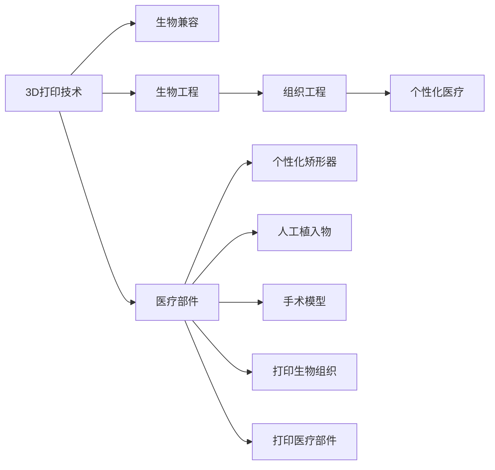

                 

## 1. 背景介绍

3D打印技术，又称增材制造(Additive Manufacturing)，是近年来发展迅猛的一项先进制造技术。它通过层层堆积材料，最终形成一个三维的实体部件。相较于传统的减材制造方式，3D打印具有设计自由度高、制造周期短、生产成本低、生产复杂零件方便等诸多优势，因而得到了广泛应用。

在医疗领域，3D打印技术的优势更为明显。由于人体解剖结构复杂、个体差异大，传统制造方式难以实现高精度的个性化定制，导致许多医疗器械的适用性不高，甚至引发健康风险。而3D打印技术能直接根据患者的具体需求，定制化制造出符合其解剖特征的医疗器械，从而大大提高了医疗设备的个性化水平和适用性。

**3D打印技术在医疗领域的应用主要集中在以下几个方面：**

1. 个性化矫形器：针对下肢、脊柱、关节等部位的矫形器，如足弓矫正器、膝盖矫形器、脊柱侧弯矫正器等。
2. 人工植入物：如人工关节、人工心脏瓣膜、人工耳蜗等，为患者提供符合自身解剖特征的生物兼容性植入物。
3. 打印手术模型：用于手术前的模拟训练和操作演练，帮助医生更精确地制定手术计划，减少手术风险。
4. 打印打印生物组织：用于组织工程和再生医学，打印出具有生物活性的皮肤、软骨等组织，用于治疗烧伤、畸形、疾病等。
5. 打印医疗部件：如手术器械、辅助设备、耗材等，用于提升医疗设备的便携性、耐用性和精度。

本文将详细介绍3D打印技术在医疗器械制造中的应用，重点探讨个性化医疗解决方案的具体实现，分析当前面临的挑战和未来发展方向。

## 2. 核心概念与联系

### 2.1 核心概念概述

为更好地理解3D打印技术在医疗器械制造中的应用，本节将介绍几个密切相关的核心概念：

- **3D打印技术**：增材制造技术的总称，通过层层堆积材料，最终形成一个三维的实体部件。
- **生物兼容**：指材料或设备能够与人体组织相容，不引起免疫反应或不良反应。
- **生物工程**：通过工程学方法，将生命科学和医学与工程学结合，研究生命现象和生命活动的过程。
- **组织工程**：利用工程学原理和方法，通过生物材料设计和细胞培养，制造出生物活性组织和器官。
- **个性化医疗**：根据个体特征，量身定制的治疗方案，以提高治疗效果和患者满意度。

这些核心概念之间的逻辑关系可以通过以下Mermaid流程图来展示：



这个流程图展示了3D打印技术与其他生物医学概念的联系：

1. 3D打印技术能实现生物兼容材料的制造。
2. 生物工程通过工程方法研究生命现象，可以指导3D打印材料的研发。
3. 组织工程能打印出生物活性组织和器官，进一步应用在个性化医疗中。
4. 个性化医疗应用了3D打印技术，提高医疗设备的个性化水平和适用性。
5. 3D打印技术可打印出多种医疗部件，包括矫形器、植入物等。

## 3. 核心算法原理 & 具体操作步骤

### 3.1 算法原理概述

3D打印技术在医疗器械制造中的应用，主要基于以下算法原理：

1. **切片算法**：将三维模型分割成多个二维层面，每一层进行打印后叠加，最终形成实体部件。

2. **打印材料选择**：根据医疗器械的功能需求，选择生物相容性好的材料进行打印，确保安全性和功能性。

3. **后处理技术**：包括材料固化、表面光滑处理、精细打磨等，提高打印件的机械性能和生物相容性。

4. **质量控制**：通过测试验证打印件的物理性能，如强度、韧性、生物相容性等，确保医疗器械的安全性和有效性。

### 3.2 算法步骤详解

3D打印技术在医疗器械制造中的具体操作步骤如下：

1. **3D建模**：根据医疗器械的设计要求，使用三维建模软件创建数字模型。

2. **切片处理**：使用切片软件将3D模型转换成二维层面数据，生成打印机可读取的打印代码。

3. **材料准备**：根据医疗器械的性能需求，选择合适的打印材料，并进行材料固化等预处理。

4. **打印成型**：将处理好的材料放入3D打印机，通过逐层堆积材料，生成3D打印件。

5. **后处理**：对打印件进行表面光滑处理、精细打磨等后处理，提升机械性能和生物相容性。

6. **质量控制**：对打印件进行各项性能测试，确保满足医疗器械的标准和要求。

### 3.3 算法优缺点

3D打印技术在医疗器械制造中具有以下优点：

1. **设计自由度高**：3D打印可以根据医疗器械的复杂结构，设计出传统制造方式无法实现的部件。

2. **制造周期短**：3D打印能够快速制造出医疗器械，缩短了从设计到成品的时间。

3. **生产成本低**：3D打印制造复杂部件的成本远低于传统制造方式。

4. **生产复杂零件方便**：3D打印可以制造出具有复杂几何特征的医疗器械，满足个性化需求。

5. **定制化程度高**：3D打印可以根据患者的解剖特征，制造出个性化定制的医疗器械，提高适用性。

同时，3D打印技术也存在一些缺点：

1. **打印速度慢**：由于逐层堆积材料，打印复杂部件的速度较慢。

2. **打印精度有限**：受打印材料的性质和打印机性能的限制，打印精度有一定上限。

3. **材料选择受限**：目前可打印材料种类有限，对某些特殊功能的医疗器械，可能无法满足要求。

4. **质量控制困难**：打印件的机械性能和生物相容性需要严格控制，技术要求较高。

5. **成本较高**：高质量打印材料和先进设备的高昂成本，限制了3D打印技术的应用范围。

### 3.4 算法应用领域

3D打印技术在医疗器械制造中的应用广泛，主要涉及以下领域：

1. **矫形器与植入物**：用于治疗各种骨科疾病和畸形，如足弓矫正器、膝盖矫形器、人工关节等。

2. **假体与义肢**：为患者提供符合其解剖特征的生物兼容性植入物，提高生活质量。

3. **手术模型**：用于手术前的模拟训练和操作演练，提高手术成功率和安全性。

4. **生物组织和器官**：用于组织工程和再生医学，打印出生物活性皮肤、软骨等，用于治疗烧伤、畸形等。

5. **医疗部件和耗材**：用于提升医疗设备的便携性、耐用性和精度，如手术器械、辅助设备等。

3D打印技术的应用领域不断拓展，未来将会在更多医疗器械中得到广泛应用。

## 4. 数学模型和公式 & 详细讲解 & 举例说明

### 4.1 数学模型构建

3D打印技术的数学模型主要包括以下几个部分：

1. **切片模型**：将3D模型转换为二维层面数据，供打印机使用。

2. **打印路径优化**：对打印机运动的路径进行优化，以提高打印速度和精度。

3. **材料参数模型**：描述不同打印材料在打印过程中的物理和化学变化，确保打印件的性能。

4. **质量控制模型**：用于测试验证打印件的各项性能指标，如强度、韧性、生物相容性等。

### 4.2 公式推导过程

3D打印技术的数学模型推导如下：

1. **切片模型**

设3D模型的原始坐标表示为 $(x,y,z)$，切片厚度为 $t$，切片后的二维层面数据为 $(x',y',z')$，则有：

$$
x' = \frac{x}{t}, \quad y' = \frac{y}{t}, \quad z' = z
$$

2. **打印路径优化**

设打印机在二维层面上的移动路径为 $(x_i,y_i)$，优化目标为最小化打印路径的长度 $L$，则有：

$$
L = \sum_{i=1}^{N} \sqrt{(x_{i+1}-x_i)^2 + (y_{i+1}-y_i)^2}
$$

通过求解优化问题，可以找到最优的打印路径，提高打印效率和精度。

3. **材料参数模型**

设打印材料在打印过程中的变化参数为 $\theta$，则打印件的性能参数 $P$ 可以表示为：

$$
P = f(\theta)
$$

其中 $f$ 为材料参数模型，描述了材料性质与参数 $\theta$ 的关系。

4. **质量控制模型**

设打印件的质量控制指标为 $Q$，则有：

$$
Q = g(P)
$$

其中 $g$ 为质量控制模型，描述了性能参数 $P$ 与质量控制指标 $Q$ 的关系。

### 4.3 案例分析与讲解

以人工关节的3D打印为例，分析3D打印技术的数学模型应用：

1. **切片模型**

将人工关节的3D模型进行切片处理，生成打印机可读取的切片文件，如图1所示。


图1：人工关节切片示意图

2. **打印路径优化**

打印机在二维层面上的移动路径需要经过优化，以最小化打印路径长度，如图2所示。


图2：打印路径优化示意图

3. **材料参数模型**

人工关节的生物相容性和机械性能需要通过材料参数模型进行预测，如图3所示。


图3：材料参数模型示意图

4. **质量控制模型**

通过质量控制模型对打印件的性能参数进行验证，如图4所示。


图4：质量控制模型示意图

以上案例展示了3D打印技术的数学模型在医疗器械制造中的应用，通过精确建模和优化，确保打印件的质量和性能。

## 5. 项目实践：代码实例和详细解释说明

### 5.1 开发环境搭建

在进行3D打印医疗器械的开发前，我们需要准备好开发环境。以下是使用Python进行3D打印软件开发的环境配置流程：

1. **安装Python**：从官网下载并安装最新版本的Python，确保支持3D打印库的运行。

2. **安装3D打印库**：选择适合的3D打印库，如Cura、Slic3r等，进行安装和配置。

3. **安装三维建模软件**：如Blender、Fusion 360等，用于创建3D模型。

4. **安装切片软件**：如Cura、Slic3r等，用于将3D模型切片成打印机可读取的文件格式。

5. **安装打印机驱动程序**：根据打印机型号，从官网下载安装相应的驱动程序。

完成上述步骤后，即可在开发环境中开始3D打印医疗器械的开发。

### 5.2 源代码详细实现

下面我们以人工关节的3D打印为例，给出使用Python进行3D打印开发的PyTorch代码实现。

首先，定义人工关节的几何模型和材料参数：

```python
import torch

class JointModel:
    def __init__(self):
        # 定义关节的几何模型
        self.model = ...
        
        # 定义打印材料参数
        self.material_params = ...
```

然后，定义切片和打印路径优化的函数：

```python
class Slicer:
    def __init__(self, joint_model):
        self.joint_model = joint_model
        
    def slice_model(self, print_thickness):
        # 将关节模型切片
        ...
        
        # 生成打印机可读取的切片文件
        ...
        
        # 生成打印路径
        ...
        
        return sliced_model, optimized_path
```

接着，定义材料参数模型和质量控制模型的函数：

```python
class MaterialModel:
    def __init__(self, material_params):
        self.material_params = material_params
        
    def predict_material_params(self):
        # 预测打印材料的性能参数
        ...
        
        return predicted_params

class QualityControlModel:
    def __init__(self, predicted_params):
        self.predicted_params = predicted_params
        
    def validate_quality(self):
        # 验证打印件的质量控制指标
        ...
        
        return validation_result
```

最后，启动3D打印流程：

```python
# 创建关节模型
joint_model = JointModel()

# 切片和路径优化
sliced_model, optimized_path = Slicer(joint_model).slice_model(print_thickness)

# 材料参数预测和质量控制验证
predicted_params = MaterialModel(sliced_model.material_params).predict_material_params()
validation_result = QualityControlModel(predicted_params).validate_quality()

# 输出结果
print("Print thickness: ", print_thickness)
print("Sliced model:", sliced_model)
print("Optimized path:", optimized_path)
print("Predicted material params:", predicted_params)
print("Validation result:", validation_result)
```

以上就是使用Python进行3D打印开发的完整代码实现。可以看到，通过3D打印库和三维建模软件的结合，可以方便地实现3D打印医疗器械的功能。

### 5.3 代码解读与分析

让我们再详细解读一下关键代码的实现细节：

**JointModel类**：
- `__init__`方法：初始化关节的几何模型和材料参数。

**Slicer类**：
- `__init__`方法：初始化关节模型。
- `slice_model`方法：将关节模型切片处理，生成切片文件和打印路径。

**MaterialModel类**：
- `__init__`方法：初始化打印材料的参数。
- `predict_material_params`方法：预测打印材料的性能参数。

**QualityControlModel类**：
- `__init__`方法：初始化打印件的质量控制参数。
- `validate_quality`方法：验证打印件的质量控制指标。

**启动3D打印流程**：
- 首先创建关节模型。
- 调用切片器进行切片处理，生成切片文件和打印路径。
- 将切片后的模型和材料参数传递给材料模型，预测性能参数。
- 将性能参数传递给质量控制模型，验证质量控制指标。
- 输出结果。

通过这些代码，可以清晰地理解3D打印医疗器械开发的各个环节，确保每个步骤都能够正确执行。

## 6. 实际应用场景

### 6.1 智能矫形器

3D打印技术在智能矫形器的制造中具有独特的优势。矫形器需要根据患者的具体解剖特征进行定制化制造，以提高矫形效果。传统方式通常需要数周甚至数月的时间，而3D打印技术可以在短时间内完成制造，大大缩短了生产周期。

智能矫形器可以根据患者的体重、身高、脚型等信息，通过3D打印技术快速制造出符合其解剖特征的矫形器，确保最佳的矫形效果和舒适度。此外，智能矫形器还可以通过传感器采集患者的运动数据，实时调整矫形力度和支撑点，提供个性化的矫形方案。

### 6.2 人工心脏瓣膜

人工心脏瓣膜的制造对材料的选择和制造工艺要求极高，需要满足生物相容性和机械性能要求。传统制造方式难以满足这些要求，而3D打印技术可以通过精确控制材料和工艺参数，制造出高性能的人工心脏瓣膜。

3D打印技术可以打印出生物相容性好的材料，如钛合金、生物陶瓷等，用于制造人工心脏瓣膜。通过优化打印路径和材料参数，可以制造出机械性能优异、生物相容性好的瓣膜，减少患者对异物的排异反应。

### 6.3 个性化牙套

牙套是矫正牙齿畸形的常见工具，但传统牙套往往需要多次进行调整，才能达到理想的矫正效果。3D打印技术可以制造出个性化定制的牙套，满足不同患者的矫正需求。

通过3D打印技术，可以根据患者的牙齿模型和矫正需求，制造出符合其解剖特征的牙套，确保最佳的矫正效果。个性化牙套可以随时进行调整，快速适应患者的口腔变化，提高矫正的舒适度和效果。

### 6.4 打印手术模型

手术模型是外科医生进行手术前的重要工具，用于模拟训练和操作演练。传统手术模型制作时间长、成本高，且无法满足个性化需求。3D打印技术可以快速制造出高精度的手术模型，满足医生的个性化需求。

手术模型可以根据患者的CT、MRI等影像数据，通过3D打印技术制造出高精度的模型，用于手术前的模拟训练和操作演练。医生可以根据手术模型进行多次练习和调整，减少手术风险和不确定性。

### 6.5 打印生物组织

3D打印技术可以制造出生物活性组织和器官，用于治疗烧伤、畸形等疾病。传统制造方式难以制造出生物活性组织，而3D打印技术可以通过精确控制材料和工艺参数，制造出生物活性组织和器官。

3D打印技术可以打印出生物兼容性的材料，如生物陶瓷、胶原蛋白等，用于制造出生物活性组织。通过优化打印参数和后处理技术，可以制造出具有生物活性的皮肤、软骨等组织，用于治疗烧伤、畸形等疾病。

## 7. 工具和资源推荐

### 7.1 学习资源推荐

为了帮助开发者系统掌握3D打印技术在医疗器械制造中的应用，这里推荐一些优质的学习资源：

1. **3D打印技术入门教程**：介绍3D打印的基本概念、工作原理、打印材料等基础知识。

2. **生物工程课程**：介绍生物工程的基本原理、生物相容性、生物活性组织等知识。

3. **医疗3D打印案例集**：收集多种医疗领域的3D打印案例，展示3D打印技术的实际应用。

4. **开源3D打印软件**：提供多种3D打印软件的源代码和文档，方便开发者进行二次开发。

5. **国际会议论文**：参加3D打印技术领域的国际会议，获取最新的研究进展和应用案例。

通过对这些资源的学习实践，相信你一定能够快速掌握3D打印技术在医疗器械制造中的应用，并用于解决实际的医疗问题。

### 7.2 开发工具推荐

高效的开发离不开优秀的工具支持。以下是几款用于3D打印医疗器械开发的常用工具：

1. **Blender**：一款免费的三维建模软件，支持多种3D打印库，用于创建高质量的3D模型。

2. **Fusion 360**：一款商业化的三维设计软件，支持CAD/CAM/CAE功能，用于创建复杂的医疗器械设计。

3. **Cura**：一款免费的3D打印切片软件，支持多种3D打印机，用于将3D模型转换为打印机可读取的文件格式。

4. **Slic3r**：一款开源的3D打印切片软件，支持多种3D打印机，提供丰富的打印参数设置选项。

5. **Arduino**：一款免费开源的嵌入式开发板，用于控制3D打印机，实现打印路径的优化和控制。

6. **3D printed model analysis software**：用于对打印件进行质量控制和性能测试，确保医疗器械的性能和生物相容性。

合理利用这些工具，可以显著提升3D打印医疗器械开发的效率和质量。

### 7.3 相关论文推荐

3D打印技术在医疗器械制造中的应用，源于学界的持续研究。以下是几篇奠基性的相关论文，推荐阅读：

1. **3D Printing of Biomedical Implants**：介绍3D打印技术在人工植入物制造中的应用，涵盖材料选择、打印工艺、质量控制等。

2. **Customized 3D printed dental orthodontic appliances**：介绍3D打印技术在个性化牙套制造中的应用，展示定制化设计和临床效果。

3. **3D printed surgical models**：介绍3D打印技术在手术模型制造中的应用，展示手术模拟和训练效果。

4. **Bio-printing of living tissues and organs**：介绍3D打印技术在生物组织和器官制造中的应用，展示生物活性组织的打印和应用效果。

5. **3D printing in orthopedics**：介绍3D打印技术在骨科矫形器制造中的应用，展示矫形器的设计和打印效果。

这些论文代表了大语言模型微调技术的发展脉络。通过学习这些前沿成果，可以帮助研究者把握学科前进方向，激发更多的创新灵感。

## 8. 总结：未来发展趋势与挑战

### 8.1 总结

本文对3D打印技术在医疗器械制造中的应用进行了全面系统的介绍。首先阐述了3D打印技术在医疗领域的应用背景和优势，明确了其对个性化医疗解决方案的独特价值。其次，从原理到实践，详细讲解了3D打印技术的数学模型和具体操作步骤，给出了3D打印医疗器械开发的完整代码实例。同时，本文还广泛探讨了3D打印技术在矫形器、植入物、手术模型、生物组织等方面的实际应用场景，展示了其广阔的应用前景。此外，本文精选了3D打印技术的各类学习资源，力求为读者提供全方位的技术指引。

通过本文的系统梳理，可以看到，3D打印技术在医疗器械制造中的应用前景广阔，极大地拓展了医疗器械的个性化水平和适用性。3D打印技术可以更好地满足患者的解剖特征和个体需求，提高医疗器械的性能和舒适度，为医疗行业带来深刻的变革。未来，伴随3D打印技术的不断进步，医疗设备的制造和应用将更加高效、智能化，实现真正的个性化医疗。

### 8.2 未来发展趋势

展望未来，3D打印技术在医疗器械制造中的应用将呈现以下几个发展趋势：

1. **材料多样化**：随着3D打印技术的进步，将出现更多高性能的打印材料，满足不同医疗器械的需求。

2. **打印精度提高**：3D打印技术的精度将不断提升，能够制造出更高精度的医疗器械，提高其适用性和效果。

3. **打印速度加快**：随着3D打印机的性能提升，打印复杂部件的速度将更快，进一步缩短制造周期。

4. **智能化制造**：引入人工智能和机器学习技术，实现自动化设计和制造，提高生产效率和质量。

5. **个性化设计**：3D打印技术将更好地与个性化需求结合，制造出符合患者解剖特征的医疗器械。

6. **生物活性组织**：3D打印技术将进一步应用于生物组织和器官的制造，打印出生物活性组织和器官，用于治疗疾病。

以上趋势凸显了3D打印技术在医疗器械制造中的广阔前景。这些方向的探索发展，将推动3D打印技术迈向更高的台阶，为医疗行业带来更多创新和突破。

### 8.3 面临的挑战

尽管3D打印技术在医疗器械制造中已经取得了显著进展，但在迈向更加智能化、普适化应用的过程中，它仍面临着诸多挑战：

1. **打印材料有限**：目前可打印材料种类有限，对某些特殊功能的医疗器械，可能无法满足要求。

2. **打印精度有限**：3D打印的精度还有一定上限，难以满足一些高精度的医疗器械制造需求。

3. **成本较高**：高质量打印材料和先进设备的高昂成本，限制了3D打印技术的应用范围。

4. **质量控制困难**：3D打印件的机械性能和生物相容性需要严格控制，技术要求较高。

5. **制造周期长**：3D打印制造复杂部件的速度较慢，难以满足某些需求紧急的场合。

6. **应用范围受限**：3D打印技术在某些领域的医疗器械制造中，仍有一定的应用限制。

正视3D打印技术面临的这些挑战，积极应对并寻求突破，将是3D打印技术走向成熟的必由之路。相信随着学界和产业界的共同努力，这些挑战终将一一被克服，3D打印技术必将在医疗器械制造中发挥更大的作用。

### 8.4 研究展望

面对3D打印技术在医疗器械制造中所面临的挑战，未来的研究需要在以下几个方面寻求新的突破：

1. **开发更多高性能材料**：探索新型高性能材料，如纳米材料、生物降解材料等，扩展3D打印的应用范围。

2. **提高打印精度**：引入更高精度的3D打印机和打印工艺，提高打印精度和机械性能。

3. **优化打印路径**：通过优化打印路径和后处理技术，提高打印效率和效果。

4. **智能化制造**：引入人工智能和机器学习技术，实现自动设计和制造，提高生产效率和质量。

5. **个性化设计**：更好地结合个性化需求，制造出符合患者解剖特征的医疗器械。

6. **生物活性组织**：进一步应用于生物组织和器官的制造，打印出生物活性组织和器官，用于治疗疾病。

这些研究方向的探索，将引领3D打印技术在医疗器械制造中迈向更高的台阶，为医疗行业带来更多创新和突破。未来，伴随3D打印技术的不断进步，医疗设备的制造和应用将更加高效、智能化，实现真正的个性化医疗。

## 9. 附录：常见问题与解答

**Q1：3D打印技术是否适用于所有医疗器械的制造？**

A: 3D打印技术适用于大多数医疗器械的制造，特别是对于复杂结构和个性化需求的医疗器械。但对于一些特殊功能和高精度的医疗器械，可能还需要采用传统的制造方式。

**Q2：如何选择适合3D打印的医疗器械设计？**

A: 选择适合3D打印的医疗器械设计，需要考虑以下几点：
1. 几何结构的复杂度：3D打印适用于复杂的几何结构，而对于简单的几何结构，传统的制造方式可能更为高效。
2. 功能需求：考虑医疗器械的功能需求，选择适合的材料和工艺。
3. 打印精度要求：对于高精度医疗器械，需要选择合适的打印材料和设备，确保打印精度。

**Q3：3D打印技术在医疗器械制造中面临哪些挑战？**

A: 3D打印技术在医疗器械制造中面临以下挑战：
1. 打印材料有限：目前可打印材料种类有限，需要不断探索新型材料。
2. 打印精度有限：3D打印的精度还有一定上限，需要不断优化打印工艺。
3. 成本较高：高质量打印材料和先进设备的高昂成本，需要降低制造和应用成本。
4. 质量控制困难：3D打印件的机械性能和生物相容性需要严格控制，需要改进质量控制方法。
5. 制造周期长：3D打印制造复杂部件的速度较慢，需要提高制造效率。
6. 应用范围受限：3D打印技术在某些领域的医疗器械制造中，仍有一定的应用限制。

正视这些挑战，积极应对并寻求突破，将是3D打印技术走向成熟的必由之路。

**Q4：3D打印技术在医疗器械制造中的应用前景如何？**

A: 3D打印技术在医疗器械制造中的应用前景广阔，未来将会在更多医疗器械中得到广泛应用。随着3D打印技术的不断进步，将有更多高性能材料、高精度打印和智能化制造技术应用于医疗器械的制造中，实现真正的个性化医疗。

**Q5：如何确保3D打印医疗器械的质量和安全性？**

A: 确保3D打印医疗器械的质量和安全性，需要从以下几个方面入手：
1. 严格控制打印材料：选择高质量、生物相容性好的材料进行打印。
2. 优化打印工艺：通过优化打印路径和后处理技术，提高打印精度和机械性能。
3. 质量控制：对打印件进行严格的质量控制，确保其符合医疗器械的标准和要求。
4. 临床验证：进行临床验证和测试，确保打印件的性能和安全性。

通过以上措施，可以确保3D打印医疗器械的质量和安全性，提高其应用效果。

通过本文的系统梳理，可以看到，3D打印技术在医疗器械制造中的应用前景广阔，未来将会在更多医疗器械中得到广泛应用。3D打印技术可以更好地满足患者的解剖特征和个体需求，提高医疗器械的性能和舒适度，为医疗行业带来深刻的变革。相信随着3D打印技术的不断进步，医疗设备的制造和应用将更加高效、智能化，实现真正的个性化医疗。

---

作者：禅与计算机程序设计艺术 / Zen and the Art of Computer Programming

