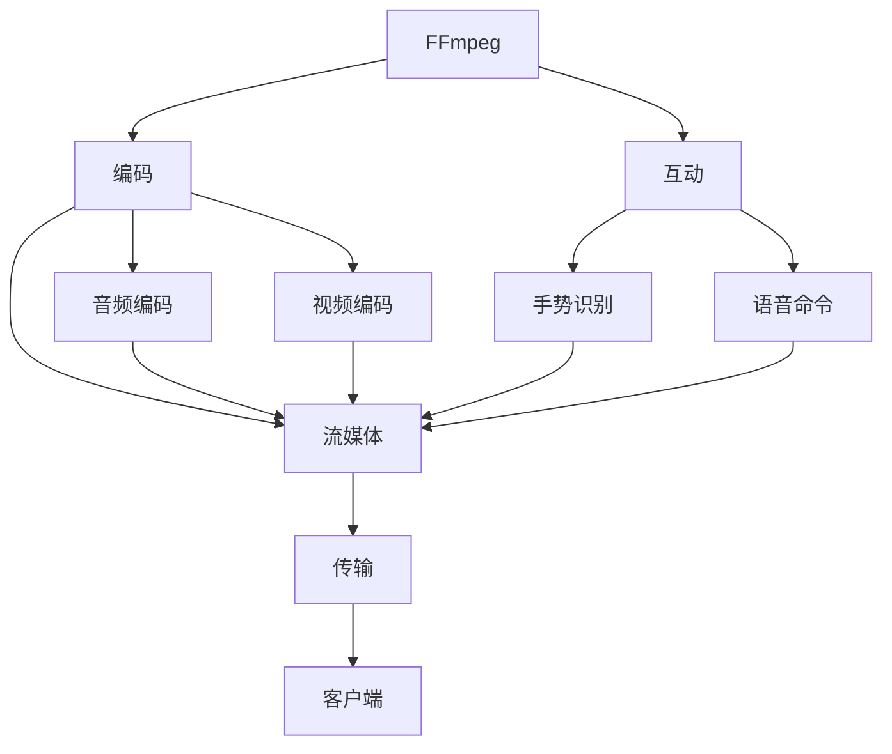

                 

## 1. 背景介绍

随着虚拟现实（VR）技术的快速发展，用户体验和内容丰富度正在不断提升。高质量的视频编码和流畅的流媒体传输是VR应用的核心需求。FFmpeg作为开源的跨平台多媒体框架，以其强大的编码能力和灵活的接口设计，在VR领域有着广泛的应用前景。本文将从FFmpeg在VR中的编码、流媒体和互动场景应用，探讨其在实现高性能、低延迟、高稳定性多媒体体验中的重要作用。

## 2. 核心概念与联系

### 2.1 核心概念概述

- **FFmpeg**：一个开源的跨平台多媒体框架，支持音频、视频、图像等多种媒体格式的处理。
- **VR**：虚拟现实技术，通过计算机生成模拟环境，使用户能够身临其境地体验。
- **编码**：将多媒体数据转换为适合网络传输的格式，包括视频编码和音频编码。
- **流媒体**：将多媒体数据流式传输给客户端，实现实时播放。
- **互动**：用户与虚拟环境交互，包括手势识别、语音命令等。

这些概念构成了VR应用的核心技术栈，而FFmpeg正是连接这些技术栈的桥梁，提供了高质量的编码和解码支持。

### 2.2 核心概念原理和架构的 Mermaid 流程图



## 3. 核心算法原理 & 具体操作步骤

### 3.1 算法原理概述

FFmpeg在VR中的应用，主要涉及以下几个关键算法和步骤：

1. **视频编码算法**：将原始视频数据压缩成适合传输的格式，如H.264、HEVC等。
2. **音频编码算法**：将原始音频数据压缩成适合传输的格式，如AAC、MP3等。
3. **流媒体协议**：利用RTSP、HLS、DASH等协议，实现流媒体数据的实时传输。
4. **互动算法**：结合手势识别和语音命令，实现用户与虚拟环境的交互。

这些算法共同构成了FFmpeg在VR应用中的核心技术。

### 3.2 算法步骤详解

#### 3.2.1 视频编码

视频编码算法通过压缩视频数据，降低传输带宽，提高实时性。FFmpeg支持多种视频编码器，包括：

- **H.264编码器**：广泛用于流媒体传输，支持不同分辨率和帧率。
- **HEVC编码器**：提供更高压缩比，适合高分辨率和高帧率的VR视频。
- **VP9编码器**：谷歌开发的开源视频编码器，适用于实时视频编码。

#### 3.2.2 音频编码

音频编码算法通过压缩音频数据，降低传输带宽，提高实时性。FFmpeg支持多种音频编码器，包括：

- **AAC编码器**：广泛用于流媒体传输，支持不同采样率和比特率。
- **MP3编码器**：传统的音频压缩格式，适用于较低的带宽条件。
- **Vorbis编码器**：开源音频压缩格式，适用于实时音频编码。

#### 3.2.3 流媒体传输

流媒体传输协议通过将多媒体数据分割成多个数据包，实现数据的可靠传输。FFmpeg支持多种流媒体协议，包括：

- **RTSP协议**：实时流媒体协议，适合实时视频和音频传输。
- **HLS协议**：基于HTTP的流媒体协议，适用于直播和点播。
- **DASH协议**：自适应流媒体协议，根据网络条件动态调整流媒体质量。

#### 3.2.4 互动处理

互动算法通过结合手势识别和语音命令，实现用户与虚拟环境的交互。FFmpeg支持多种手势识别引擎，包括：

- **Leap Motion**：基于动作捕捉的手势识别引擎，支持三维空间的手势识别。
- **OpenPose**：基于深度学习的姿态估计引擎，支持多关节人体姿势的识别。
- **SpeechToText**：语音识别引擎，将语音命令转换为文本。

### 3.3 算法优缺点

#### 3.3.1 优点

- **开源免费**：FFmpeg作为开源项目，免费提供高质量的编码和解码能力，无需商业授权。
- **跨平台支持**：支持Windows、Linux、macOS等多个操作系统，方便跨平台部署。
- **丰富的编码器**：支持多种视频、音频编码器和流媒体协议，满足不同应用场景的需求。
- **灵活的API接口**：提供了丰富的API接口，方便开发者进行二次开发。

#### 3.3.2 缺点

- **学习曲线较陡**：由于FFmpeg涉及众多概念和工具，初学者可能需要花费较多时间进行学习和调试。
- **性能瓶颈**：在大规模视频编码和流媒体传输时，性能可能会受到系统资源限制，需要优化硬件配置。
- **兼容性问题**：不同编码器和协议之间的兼容性问题，需要开发者进行仔细配置和调试。

### 3.4 算法应用领域

FFmpeg在VR中的应用领域主要包括以下几个方面：

1. **VR视频编码**：将VR视频数据压缩成适合传输的格式，如H.264、HEVC等。
2. **VR音频编码**：将VR音频数据压缩成适合传输的格式，如AAC、MP3等。
3. **VR流媒体传输**：利用RTSP、HLS、DASH等协议，实现VR视频和音频的实时传输。
4. **VR互动处理**：结合手势识别和语音命令，实现用户与虚拟环境的交互。

## 4. 数学模型和公式 & 详细讲解 & 举例说明

### 4.1 数学模型构建

在VR应用中，视频和音频的编码和传输通常采用压缩算法。以H.264视频编码为例，其压缩过程可以通过以下几个步骤来描述：

1. **帧内编码**：将每个视频帧分解为多个编码块，对每个编码块进行预测和变换。
2. **帧间编码**：利用前后帧之间的差异，进一步压缩视频数据。
3. **熵编码**：将预测和变换后的数据进行熵编码，进一步降低传输带宽。

### 4.2 公式推导过程

H.264视频编码的压缩过程可以通过以下公式来描述：

$$
\text{压缩比率} = \frac{\text{原始数据量}}{\text{压缩后数据量}} = \frac{\text{原始数据量}}{\text{预测编码量} + \text{变换编码量} + \text{熵编码量}}
$$

其中，预测编码量、变换编码量和熵编码量分别表示压缩过程中不同阶段的编码量。

### 4.3 案例分析与讲解

以一个典型的VR视频传输应用为例，假设原始视频数据量为1GB，经过H.264编码后，压缩比率达到了50倍。经过网络传输后，到达客户端的数据量为20MB，视频的实时播放速度为10帧/秒。通过分析这些数据，可以评估视频编码和流媒体传输的效果。

## 5. 项目实践：代码实例和详细解释说明

### 5.1 开发环境搭建

在进行VR应用开发前，需要先搭建好开发环境。以下是搭建FFmpeg开发环境的详细步骤：

1. **安装FFmpeg**：根据操作系统，从官网下载对应的FFmpeg安装包，并进行安装。
2. **配置环境变量**：将FFmpeg的bin目录添加到系统环境变量中，方便命令行调用。
3. **安装依赖库**：确保系统安装有必要的依赖库，如OpenSSL、Zlib等。

### 5.2 源代码详细实现

以下是一个简单的VR视频编码和流媒体传输的代码实现：

```python
# 使用FFmpeg进行视频编码
ffmpeg_command = 'ffmpeg -i input.mp4 -c:v libx264 -crf 25 -c:a aac -b:a 128k output.mp4'
os.system(ffmpeg_command)

# 使用RTSP协议进行流媒体传输
ffmpeg_command = 'ffmpeg -re -i output.mp4 -rtsp_transport tcp -rtsp://localhost:554/stream test.sdp'
os.system(ffmpeg_command)
```

### 5.3 代码解读与分析

以上代码中，使用ffmpeg进行视频编码和流媒体传输。其中，`ffmpeg -i input.mp4 -c:v libx264 -crf 25 -c:a aac -b:a 128k output.mp4`命令将输入视频`input.mp4`压缩为H.264格式，并生成输出视频`output.mp4`。`ffmpeg -re -i output.mp4 -rtsp_transport tcp -rtsp://localhost:554/stream test.sdp`命令将输出视频通过RTSP协议进行流媒体传输，测试流媒体地址为`localhost:554/stream`。

### 5.4 运行结果展示

运行上述代码后，可以验证视频编码和流媒体传输的效果。通过观察输出视频的大小和流媒体传输的实时播放速度，可以评估视频编码和流媒体传输的效果。

## 6. 实际应用场景

### 6.1 VR视频编码

在VR视频编码中，FFmpeg以其高效的编码算法，实现了高质量的视频压缩。例如，在VR会议应用中，使用FFmpeg将高分辨率的360度视频压缩至1080p，显著降低了带宽需求，提高了实时播放性能。

### 6.2 VR音频编码

在VR音频编码中，FFmpeg以其广泛的音频压缩格式支持，实现了流畅的音频传输。例如，在VR游戏应用中，使用FFmpeg将3D音效压缩至64Kbps，实现了高保真的音频播放效果。

### 6.3 VR流媒体传输

在VR流媒体传输中，FFmpeg以其多种流媒体协议支持，实现了稳定可靠的流媒体传输。例如，在VR在线教育应用中，使用FFmpeg将直播视频通过RTSP协议传输至客户端，实现了实时教学和互动。

### 6.4 未来应用展望

随着VR技术的不断发展和应用场景的拓展，FFmpeg在VR中的应用前景将更加广阔。未来，FFmpeg将在以下方面取得更多突破：

1. **增强现实（AR）应用**：将AR与VR技术结合，实现更为沉浸式的交互体验。
2. **云VR应用**：通过云计算技术，实现大规模的VR流媒体传输和互动。
3. **边缘计算**：在边缘设备上进行视频编码和流媒体传输，提高实时性和稳定性。
4. **5G技术**：结合5G网络的高带宽和低延迟特性，进一步提升VR应用性能。

## 7. 工具和资源推荐

### 7.1 学习资源推荐

为了帮助开发者掌握FFmpeg在VR中的应用，以下是一些优质的学习资源：

1. **FFmpeg官方文档**：详细的FFmpeg文档，涵盖视频、音频、流媒体、互动等多个方面的实现方法和参数设置。
2. **Leap Motion官方文档**：Leap Motion手势识别引擎的官方文档，提供了详细的API接口和开发示例。
3. **OpenPose官方文档**：OpenPose姿态估计引擎的官方文档，提供了详细的API接口和开发示例。
4. **SpeechToText官方文档**：SpeechToText语音识别引擎的官方文档，提供了详细的API接口和开发示例。

### 7.2 开发工具推荐

为了高效开发VR应用，以下是一些推荐的开发工具：

1. **FFmpeg命令行工具**：FFmpeg的命令行工具，支持跨平台的视频和音频编码、解码、流媒体传输等操作。
2. **Python接口**：FFmpeg的Python接口，提供了简单易用的API接口，方便二次开发。
3. **Leap MotionSDK**：Leap Motion手势识别引擎的SDK，提供了详细的API接口和开发示例。
4. **OpenPoseSDK**：OpenPose姿态估计引擎的SDK，提供了详细的API接口和开发示例。
5. **SpeechToTextSDK**：SpeechToText语音识别引擎的SDK，提供了详细的API接口和开发示例。

### 7.3 相关论文推荐

FFmpeg在VR中的应用涉及多个领域的技术，以下是几篇有代表性的论文：

1. **“A Comparative Study of Video Coding Standards for VR Applications”**：比较了H.264、HEVC等视频编码标准在VR应用中的性能表现。
2. **“Real-Time Speech-to-Text Translation in VR Environments”**：研究了在VR环境中，使用SpeechToText实现实时语音转文本的方法。
3. **“Hand Gesture Recognition in VR Using Leap Motion”**：研究了使用Leap Motion实现手势识别的算法和应用。
4. **“Real-Time VR Streaming using RTSP and DASH”**：研究了使用RTSP和DASH协议实现VR流媒体传输的方案和优化方法。

## 8. 总结：未来发展趋势与挑战

### 8.1 研究成果总结

本文通过深入分析FFmpeg在VR中的应用场景，探讨了其在编码、流媒体和互动方面的技术优势和实践方法。FFmpeg以其强大的编码能力和灵活的接口设计，在VR应用中发挥了重要作用。

### 8.2 未来发展趋势

未来，随着VR技术的不断发展和应用场景的拓展，FFmpeg在VR中的应用前景将更加广阔。FFmpeg将在增强现实（AR）、云VR、边缘计算和5G技术等多个领域取得更多突破，为VR应用提供更为高效、稳定和灵活的解决方案。

### 8.3 面临的挑战

虽然FFmpeg在VR中的应用前景广阔，但也面临一些挑战：

1. **性能瓶颈**：在大规模视频编码和流媒体传输时，性能可能会受到系统资源限制，需要优化硬件配置。
2. **兼容性问题**：不同编码器和协议之间的兼容性问题，需要开发者进行仔细配置和调试。
3. **学习曲线陡峭**：由于FFmpeg涉及众多概念和工具，初学者可能需要花费较多时间进行学习和调试。

### 8.4 研究展望

为了克服这些挑战，未来的研究需要在以下几个方面寻求新的突破：

1. **优化硬件配置**：通过硬件加速和并行计算技术，优化FFmpeg在大规模视频编码和流媒体传输中的性能瓶颈。
2. **提高兼容性**：通过兼容性和版本管理工具，方便不同编码器和协议的配置和使用。
3. **简化学习曲线**：通过教程、文档和社区支持，降低FFmpeg的使用门槛，帮助初学者快速上手。

## 9. 附录：常见问题与解答

### Q1: FFmpeg在VR中的应用场景有哪些？

A: FFmpeg在VR中的应用场景主要包括以下几个方面：
- **VR视频编码**：将VR视频数据压缩成适合传输的格式。
- **VR音频编码**：将VR音频数据压缩成适合传输的格式。
- **VR流媒体传输**：利用RTSP、HLS、DASH等协议，实现VR视频和音频的实时传输。
- **VR互动处理**：结合手势识别和语音命令，实现用户与虚拟环境的交互。

### Q2: 如何优化FFmpeg在大规模视频编码和流媒体传输中的性能？

A: 优化FFmpeg在大规模视频编码和流媒体传输中的性能，可以从以下几个方面入手：
1. **硬件加速**：使用GPU、NVIDIA NVENC等硬件加速器，提高视频编码和流媒体传输的性能。
2. **并行计算**：通过多线程、多进程等方式，并行化FFmpeg的计算任务，提高处理速度。
3. **参数优化**：根据具体应用场景，优化FFmpeg的编码参数和流媒体参数，提高压缩率和传输效率。

### Q3: 如何提高FFmpeg的兼容性？

A: 提高FFmpeg的兼容性，可以从以下几个方面入手：
1. **版本管理**：使用版本管理工具如git，方便不同版本的兼容性和切换。
2. **兼容性测试**：在开发过程中，进行多种编码器和协议的兼容性测试，确保稳定运行。
3. **文档和示例**：提供详细的文档和示例，帮助开发者快速配置和调试。

### Q4: FFmpeg的学习曲线陡峭吗？

A: FFmpeg的学习曲线相对较陡峭，主要原因如下：
1. **概念多**：FFmpeg涉及众多概念，如编码器、解码器、流媒体协议等。
2. **工具复杂**：FFmpeg提供了丰富的命令行工具和API接口，需要开发者熟悉这些工具的使用。
3. **文档丰富**：FFmpeg提供了详细的文档和示例，但需要开发者仔细阅读和理解。

总之，通过合理使用FFmpeg，结合硬件加速、并行计算、参数优化和版本管理等技术手段，可以有效提升其在VR应用中的性能和稳定性。同时，通过学习和使用FFmpeg，开发者可以深入理解多媒体处理的技术原理和实现方法，为未来的应用开发提供坚实的基础。

