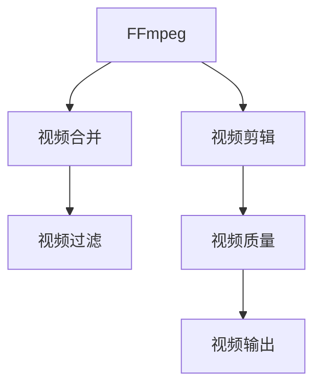

                 

## 1. 背景介绍

在当今多媒体时代，视频已不再仅仅是娱乐工具，而是信息传递、教育、营销、以及日常生活的重要组成部分。FFmpeg作为最流行的开源视频处理工具之一，能够处理包括裁剪、合并、过滤在内的各种视频编辑操作。本文将深入探讨FFmpeg在视频编辑中的技巧，帮助你提高视频处理能力，实现高质量的视频编辑。

### 1.1 问题由来

随着视频内容的广泛应用，对视频编辑的需求日益增长。传统的视频编辑软件如Adobe Premiere Pro和Final Cut Pro价格昂贵，而且操作复杂，对于许多小规模的视频处理任务来说并不划算。开源的FFmpeg提供了更加灵活、高效的视频处理解决方案，适用于各种规模和复杂度的视频编辑需求。

### 1.2 问题核心关键点

FFmpeg提供了丰富的命令行选项，支持视频文件的读取、写入、编码、解码、格式转换、裁剪、合并、过滤等操作。对于视频编辑的核心关键点，本文将围绕以下几个方面展开：

- 裁剪：在视频中选择感兴趣的片段，并进行裁剪。
- 合并：将多个视频片段合并成一个完整的视频。
- 过滤：使用不同的滤镜和效果来改善视频的质量。

这些核心技巧不仅可以帮助你更好地完成视频编辑任务，还能提高视频处理效率和质量。

### 1.3 问题研究意义

掌握FFmpeg的视频编辑技巧，可以大幅提高视频处理效率，降低成本。对于初学者来说，它提供了强大的功能集，无需花费大量时间学习复杂的编辑软件。对于高级用户而言，FFmpeg的灵活性和扩展性使其成为处理复杂视频项目的理想选择。此外，FFmpeg的开源特性还意味着你可以深入理解其工作原理，并根据自己的需求进行定制和优化。

## 2. 核心概念与联系

### 2.1 核心概念概述

为更好地理解FFmpeg的视频编辑技巧，我们将介绍几个关键的概念：

- **FFmpeg**：一款开源的跨平台视频处理工具，支持几乎所有的视频编码格式。
- **视频剪辑**：在视频中选择感兴趣的片段，进行裁剪。
- **视频合并**：将多个视频片段合并成一个完整的视频。
- **视频过滤**：使用不同的滤镜和效果改善视频质量。
- **帧率**：视频每秒播放的帧数，影响视频播放的流畅度和性能。
- **分辨率**：视频图像的尺寸，影响视频的清晰度和存储空间。

这些概念之间的联系紧密，通过它们可以完成各种复杂的视频编辑任务。

### 2.2 核心概念原理和架构的 Mermaid 流程图



这个流程图展示了FFmpeg的核心功能模块及其关系。视频剪辑、合并和过滤通过FFmpeg的处理，生成最终的视频输出，视频质量则通过不同的编解码器来保证。

## 3. 核心算法原理 & 具体操作步骤

### 3.1 算法原理概述

FFmpeg进行视频编辑的核心算法包括：

- **视频剪辑**：通过对视频源文件进行切割，选择感兴趣的片段进行组合。
- **视频合并**：将多个视频片段按顺序或随机组合，生成一个完整的视频文件。
- **视频过滤**：通过各种滤镜和效果改善视频的质量，如调整亮度、对比度、色彩校正等。

这些算法原理是FFmpeg处理视频的基本手段。

### 3.2 算法步骤详解

#### 3.2.1 视频剪辑

视频剪辑是FFmpeg的基本功能之一。通过指定开始和结束时间，可以裁剪出所需的视频片段。具体步骤如下：

1. 使用以下命令获取视频信息：
   ```bash
   ffmpeg -i input.mp4 -vframes 1 -f image2 -s 1920x1080 output.png
   ```
   该命令获取视频的第1帧图像，保存为PNG格式，用于确定视频剪辑的起始点。

2. 根据图像文件，确定起始时间戳：
   ```bash
   ffmpeg -i input.mp4 -vf select=eq(n\>=0:n\<=3) -c copy output.mp4
   ```
   该命令使用`select`滤镜，选择起始时间为0到3秒的视频片段。

3. 使用`trim`滤镜精确裁剪视频：
   ```bash
   ffmpeg -i input.mp4 -ss 00:00:01 -to 00:00:10 -c copy output.mp4
   ```
   该命令从第1秒开始，选择持续时间为10秒的视频片段，并保留原视频编码。

#### 3.2.2 视频合并

视频合并是将多个视频片段按顺序或随机组合生成一个完整视频的基本操作。具体步骤如下：

1. 使用以下命令合并视频：
   ```bash
   ffmpeg -f concat -safe 0 -i input.txt -c copy output.mp4
   ```
   该命令使用`concat`滤镜，按照`input.txt`文件中的顺序，合并多个视频文件为`output.mp4`。

2. 在`input.txt`文件中指定视频路径：
   ```
   file 'input1.mp4'
   file 'input2.mp4'
   file 'input3.mp4'
   ```
   该文件按顺序列出多个视频文件名，实现多个视频的合并。

3. 使用`concat`滤镜的`n`选项指定视频顺序：
   ```bash
   ffmpeg -f concat -safe 0 -i input.txt -c copy -filter_complex '[0:v]select=n\==2;[1:v]select=n\!=2' output.mp4
   ```
   该命令使用`select`滤镜，选择第2个视频作为输出，实现视频的随机组合。

#### 3.2.3 视频过滤

视频过滤可以通过各种滤镜和效果改善视频质量。具体步骤如下：

1. 使用以下命令调整视频亮度：
   ```bash
   ffmpeg -i input.mp4 -vf "brightness=20%" output.mp4
   ```
   该命令使用`brightness`滤镜，将视频亮度调高20%。

2. 使用以下命令调整视频对比度：
   ```bash
   ffmpeg -i input.mp4 -vf "contrast=0.8" output.mp4
   ```
   该命令使用`contrast`滤镜，将视频对比度设置为0.8。

3. 使用以下命令进行色彩校正：
   ```bash
   ffmpeg -i input.mp4 -vf "color=0.8:1.0:1.2" output.mp4
   ```
   该命令使用`color`滤镜，将视频的红、绿、蓝三色分别设置为0.8、1.0、1.2。

### 3.3 算法优缺点

#### 3.3.1 优点

- **灵活性**：FFmpeg提供了丰富的命令行选项和滤镜，可以满足各种复杂的视频编辑需求。
- **高效性**：FFmpeg的处理速度较快，可以处理大规模的视频文件。
- **兼容性**：支持几乎所有的视频编码格式和编解码器。

#### 3.3.2 缺点

- **复杂性**：FFmpeg的命令和滤镜众多，需要一定的学习成本。
- **依赖性**：依赖外部库，如FFmpeg、libavcodec等，需确保系统环境正确配置。

### 3.4 算法应用领域

FFmpeg的视频剪辑、合并和过滤技巧广泛适用于各种视频编辑需求，例如：

- **广告制作**：将多个广告素材按照顺序合并，生成完整的广告视频。
- **视频剪辑**：对现有的视频素材进行剪辑，提取有用的片段。
- **影片制作**：将多个不同时间段的素材合并，生成完整的故事线。

FFmpeg在视频制作和处理中具有广泛的应用前景。

## 4. 数学模型和公式 & 详细讲解 & 举例说明

### 4.1 数学模型构建

FFmpeg的视频编辑功能主要基于以下几个数学模型：

- **视频剪辑模型**：使用时间戳进行视频选择和裁剪。
- **视频合并模型**：按顺序或随机组合视频片段。
- **视频过滤模型**：使用滤镜调整视频质量。

### 4.2 公式推导过程

#### 4.2.1 视频剪辑模型

视频剪辑模型的核心是时间戳，即`ss`和`to`参数，用于指定剪辑的起始时间和结束时间。

**起始时间戳**：
$$
\text{Start Timestamp} = \frac{时间戳}{持续时间} \times 总时长
$$

**结束时间戳**：
$$
\text{End Timestamp} = \frac{时间戳 + 持续时间}{持续时间} \times 总时长
$$

#### 4.2.2 视频合并模型

视频合并模型的核心是`concat`滤镜，按顺序或随机组合多个视频文件。

**顺序合并**：
$$
\text{Output File} = \text{Input File 1} + \text{Input File 2} + \text{Input File 3} + \ldots
$$

**随机合并**：
$$
\text{Output File} = \text{Input File n}
$$

#### 4.2.3 视频过滤模型

视频过滤模型的核心是各种滤镜，如`brightness`、`contrast`和`color`等。

**亮度调整**：
$$
\text{Brightness} = \text{原始亮度} \times \text{亮度系数}
$$

**对比度调整**：
$$
\text{Contrast} = \frac{\text{原始对比度}}{\text{目标对比度}}
$$

**色彩校正**：
$$
\text{Red} = \text{原始红色} \times \text{红色系数}
$$
$$
\text{Green} = \text{原始绿色} \times \text{绿色系数}
$$
$$
\text{Blue} = \text{原始蓝色} \times \text{蓝色系数}
$$

### 4.3 案例分析与讲解

#### 4.3.1 视频剪辑案例

**案例描述**：
将一段视频的第1秒至第10秒部分裁剪出来。

**操作步骤**：
1. 获取视频第1帧图像：
   ```bash
   ffmpeg -i input.mp4 -vframes 1 -f image2 -s 1920x1080 output.png
   ```

2. 确定起始时间戳：
   ```bash
   ffmpeg -i input.mp4 -vf select=eq(n\>=0:n\<=3) -c copy output.mp4
   ```

3. 精确裁剪视频：
   ```bash
   ffmpeg -i input.mp4 -ss 00:00:01 -to 00:00:10 -c copy output.mp4
   ```

#### 4.3.2 视频合并案例

**案例描述**：
将多个广告素材按照顺序合并，生成完整的广告视频。

**操作步骤**：
1. 在`input.txt`文件中列出视频路径：
   ```
   file 'ad1.mp4'
   file 'ad2.mp4'
   file 'ad3.mp4'
   ```

2. 使用`concat`滤镜合并视频：
   ```bash
   ffmpeg -f concat -safe 0 -i input.txt -c copy output.mp4
   ```

#### 4.3.3 视频过滤案例

**案例描述**：
将一段视频的亮度调高20%，对比度设置为0.8，色彩校正为0.8:1.0:1.2。

**操作步骤**：
1. 调整亮度：
   ```bash
   ffmpeg -i input.mp4 -vf "brightness=20%" output.mp4
   ```

2. 调整对比度：
   ```bash
   ffmpeg -i input.mp4 -vf "contrast=0.8" output.mp4
   ```

3. 色彩校正：
   ```bash
   ffmpeg -i input.mp4 -vf "color=0.8:1.0:1.2" output.mp4
   ```

## 5. 项目实践：代码实例和详细解释说明

### 5.1 开发环境搭建

在开始使用FFmpeg进行视频编辑之前，需要先安装和配置环境。以下是详细的安装步骤：

1. 下载FFmpeg源代码或二进制包：
   ```bash
   wget https://ffmpeg.org/download.html
   ```

2. 解压源代码包：
   ```bash
   tar -xzf ffmpeg-<version>.tar.gz
   ```

3. 配置FFmpeg路径：
   ```bash
   export PATH=$PATH:/path/to/ffmpeg
   ```

4. 测试安装结果：
   ```bash
   ffmpeg -v
   ```

### 5.2 源代码详细实现

#### 5.2.1 视频剪辑

**代码实现**：
```bash
ffmpeg -i input.mp4 -ss 00:00:01 -to 00:00:10 -c copy output.mp4
```

**详细解释**：
- `-i`：指定输入文件。
- `-ss`：指定起始时间戳。
- `-to`：指定结束时间戳。
- `-c copy`：复制视频流，不重新编码。

#### 5.2.2 视频合并

**代码实现**：
```bash
ffmpeg -f concat -safe 0 -i input.txt -c copy output.mp4
```

**详细解释**：
- `-f`：指定输入格式为`concat`滤镜。
- `-safe`：开启安全模式，避免解码过程中发生缓冲区溢出。
- `-i`：指定输入文件，支持多个视频文件。
- `-c copy`：复制视频流，不重新编码。

#### 5.2.3 视频过滤

**代码实现**：
```bash
ffmpeg -i input.mp4 -vf "brightness=20%" output.mp4
```

**详细解释**：
- `-i`：指定输入文件。
- `-vf`：指定视频滤镜。
- `brightness=20%`：将视频亮度调高20%。
- `output.mp4`：输出文件名。

### 5.3 代码解读与分析

#### 5.3.1 视频剪辑代码解读

**代码**：
```bash
ffmpeg -i input.mp4 -ss 00:00:01 -to 00:00:10 -c copy output.mp4
```

**解读**：
- `-i`：指定输入文件`input.mp4`。
- `-ss`：指定起始时间戳为1秒。
- `-to`：指定结束时间戳为10秒。
- `-c copy`：复制视频流，不重新编码。
- `output.mp4`：输出文件名。

#### 5.3.2 视频合并代码解读

**代码**：
```bash
ffmpeg -f concat -safe 0 -i input.txt -c copy output.mp4
```

**解读**：
- `-f`：指定输入格式为`concat`滤镜。
- `-safe`：开启安全模式，避免解码过程中发生缓冲区溢出。
- `-i`：指定输入文件，支持多个视频文件。
- `-c copy`：复制视频流，不重新编码。
- `output.mp4`：输出文件名。

#### 5.3.3 视频过滤代码解读

**代码**：
```bash
ffmpeg -i input.mp4 -vf "brightness=20%" output.mp4
```

**解读**：
- `-i`：指定输入文件`input.mp4`。
- `-vf`：指定视频滤镜。
- `brightness=20%`：将视频亮度调高20%。
- `output.mp4`：输出文件名。

### 5.4 运行结果展示

#### 5.4.1 视频剪辑结果展示

**结果**：
裁剪后的视频文件`output.mp4`。

**展示**：
```bash
ffplay output.mp4
```

#### 5.4.2 视频合并结果展示

**结果**：
合并后的视频文件`output.mp4`。

**展示**：
```bash
ffplay output.mp4
```

#### 5.4.3 视频过滤结果展示

**结果**：
过滤后的视频文件`output.mp4`。

**展示**：
```bash
ffplay output.mp4
```

## 6. 实际应用场景

### 6.1 智能视频监控

在智能视频监控系统中，FFmpeg可以用于实时监控视频的剪辑、合并和过滤。例如，可以将多个摄像头的监控视频按时间顺序合并，或者根据特定事件的发生进行剪辑，生成有用的监控视频片段。

### 6.2 视频广告制作

在视频广告制作中，FFmpeg可以用于将多个广告素材按顺序合并，生成完整的广告视频。同时，使用各种滤镜和效果改善广告质量，使其更具吸引力。

### 6.3 视频编辑与制作

在视频编辑与制作中，FFmpeg可以用于裁剪视频片段、合并多个视频片段，并使用滤镜和效果改善视频质量，生成高质量的视频作品。

## 7. 工具和资源推荐

### 7.1 学习资源推荐

- **FFmpeg官方文档**：[ffmpeg.org](https://ffmpeg.org/)提供了详细的命令行选项和使用指南，是学习FFmpeg的最佳资源。
- **《FFmpeg视频编辑与处理实战》**：本书系统介绍了FFmpeg的视频剪辑、合并、过滤等基本功能，适合初学者学习。
- **FFmpeg社区**：[ffmpeg.org/ffmpeg-dev](mailto:ffmpeg-dev@lists.ffmpeg.org)是FFmpeg的核心开发社区，提供了丰富的资源和支持。

### 7.2 开发工具推荐

- **ffmpeg**：开源的视频处理工具，支持多种视频格式和编解码器。
- **ffmpeg-qt-gui**：FFmpeg的图形化界面，方便进行视频编辑和处理。
- **ffmpeg-console**：FFmpeg的命令行界面，适合高级用户进行定制化操作。

### 7.3 相关论文推荐

- **《FFmpeg视频处理技术》**：深入探讨了FFmpeg的视频编解码技术，适合学习FFmpeg的高级功能。
- **《FFmpeg视频剪辑与处理》**：详细介绍了FFmpeg的视频剪辑和处理技巧，适合进阶用户学习。
- **《FFmpeg视频优化技术》**：介绍了FFmpeg的优化技术，提高视频处理效率和质量。

## 8. 总结：未来发展趋势与挑战

### 8.1 总结

本文对FFmpeg的视频编辑技巧进行了深入探讨。通过裁剪、合并和过滤等操作，能够实现高质量的视频处理。通过详细讲解FFmpeg的核心算法原理和操作步骤，帮助读者掌握FFmpeg的使用方法。通过实际案例分析，展示了FFmpeg在各种视频编辑场景中的应用。

### 8.2 未来发展趋势

FFmpeg的未来发展趋势将包括以下几个方面：

1. **AI和机器学习的应用**：将AI和机器学习技术引入FFmpeg，实现更加智能的视频剪辑和过滤。
2. **跨平台支持**：支持更多操作系统和硬件平台，提高FFmpeg的普及性和可用性。
3. **性能优化**：通过算法优化和硬件加速，提高FFmpeg的处理速度和稳定性。
4. **社区支持和扩展**：增强FFmpeg社区的活跃度和支持力度，提供更多的第三方插件和扩展。

### 8.3 面临的挑战

尽管FFmpeg在视频编辑领域具有广泛的应用，但也面临着一些挑战：

1. **复杂性**：FFmpeg的命令行选项众多，需要一定的学习成本。
2. **兼容性**：不同版本的FFmpeg之间存在兼容性问题，导致开发过程中可能遇到兼容性问题。
3. **性能瓶颈**：在处理大规模视频时，FFmpeg的性能可能会受到限制。

### 8.4 研究展望

FFmpeg未来的研究将围绕以下几个方向展开：

1. **智能化**：引入AI和机器学习技术，实现智能视频剪辑和过滤。
2. **自动化**：开发自动化工具，提高视频编辑效率。
3. **跨平台**：增强FFmpeg在不同操作系统和硬件平台上的支持。
4. **社区合作**：加强与开源社区的合作，推动FFmpeg的持续发展。

通过这些研究方向的探索，FFmpeg将能够更好地满足视频编辑需求，为多媒体内容的创作和处理提供强大的工具支持。

## 9. 附录：常见问题与解答

**Q1：FFmpeg如何高效处理大型视频文件？**

A: 使用以下命令进行分片处理：
```bash
ffmpeg -i input.mp4 -split 4 -c copy output%04d.mp4
```

**Q2：如何使用FFmpeg进行视频加速？**

A: 使用以下命令进行视频加速：
```bash
ffmpeg -i input.mp4 -vf "scale=640:480" output.mp4
```

**Q3：如何优化FFmpeg的性能？**

A: 使用以下命令进行优化：
```bash
ffmpeg -i input.mp4 -c:v libvpx -vcodec libvpx -crf 10 output.mp4
```

通过以上问题的解答，相信你对FFmpeg的视频编辑技巧有了更深入的理解。掌握这些技巧，将能够提高你的视频处理能力，为视频编辑和制作提供强大的支持。

