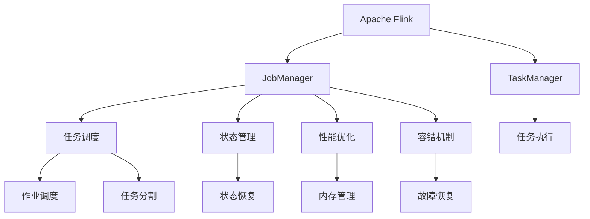

                 

# Flink JobManager原理与代码实例讲解

> 关键词：Apache Flink, JobManager, TaskManager, 分布式处理, 状态管理, 任务调度, 性能优化, 容错机制, 实时数据流

## 1. 背景介绍

### 1.1 问题由来
Apache Flink是一个高性能、分布式的流处理框架，广泛应用于实时数据处理、离线数据分析等多个领域。Flink 由两个核心组件组成：JobManager 和 TaskManager。其中，JobManager 负责作业的调度和管理，而 TaskManager 则负责具体的任务执行。

在 Flink 中，JobManager 是整个系统的控制节点，负责接收用户的作业提交请求，并负责作业的调度、监控和故障恢复。Flink 中的所有作业都通过 JobManager 来管理和调度，因此了解 JobManager 的工作原理对于深入理解 Flink 系统至关重要。

### 1.2 问题核心关键点
Flink JobManager 的核心功能包括作业的接收、调度、状态管理、任务监控和故障恢复等。通过理解这些关键功能，可以深入掌握 Flink 的作业执行流程和系统架构。

## 2. 核心概念与联系

### 2.1 核心概念概述

为了更好地理解 Flink JobManager 的工作原理，本节将介绍几个密切相关的核心概念：

- **Apache Flink**：高性能、分布式流处理框架，支持高吞吐量、低延迟的数据处理。
- **JobManager**：Flink 中的控制节点，负责作业的调度、状态管理和监控。
- **TaskManager**：Flink 中的执行节点，负责具体任务的执行。
- **流处理**：一种数据处理方式，数据按照时间顺序流式传输，适合处理实时数据。
- **状态管理**：Flink 中的状态管理机制，用于保证作业的可靠性和一致性。
- **任务调度**：Flink 中的任务调度机制，用于优化作业执行效率和资源利用率。
- **性能优化**：Flink 中的性能优化技术，包括任务并行、数据分区和内存管理等。
- **容错机制**：Flink 中的容错机制，用于在节点故障或数据损坏时保证作业的可靠性。

这些核心概念之间的逻辑关系可以通过以下 Mermaid 流程图来展示：



这个流程图展示了 Flink 系统中的关键组件和它们之间的相互关系。

## 3. 核心算法原理 & 具体操作步骤
### 3.1 算法原理概述

Flink JobManager 的算法原理主要体现在以下几个方面：

1. **作业调度**：JobManager 负责接收作业提交请求，并将其分配给 TaskManager 执行。作业调度包括作业的并行度设置、任务分配、任务重启等。

2. **状态管理**：JobManager 负责保存作业的状态信息，包括作业的进度、任务的状态、故障点的恢复等。状态管理机制用于保证作业的可靠性和一致性。

3. **任务监控**：JobManager 负责监控任务的执行情况，包括任务进度、任务失败、任务超时等。任务监控机制用于及时发现和处理异常情况，保证作业的正常执行。

4. **故障恢复**：JobManager 负责在节点故障或数据损坏时，重新分配任务和恢复状态，保证作业的可靠性。

5. **性能优化**：JobManager 负责优化作业的执行效率和资源利用率，包括任务并行、数据分区、内存管理等。

### 3.2 算法步骤详解

以下是 Flink JobManager 的详细操作步骤：

**Step 1: 作业提交**
- 用户通过 Flink API 或命令行工具提交作业，JobManager 接收作业请求。

**Step 2: 作业调度**
- JobManager 根据作业的资源需求，选择合适的 TaskManager 执行节点，并将任务分配给 TaskManager。

**Step 3: 状态管理**
- JobManager 保存作业的状态信息，包括作业的进度、任务的状态、故障点的恢复等。

**Step 4: 任务监控**
- JobManager 监控任务的执行情况，及时发现和处理异常情况，保证作业的正常执行。

**Step 5: 故障恢复**
- 在节点故障或数据损坏时，JobManager 重新分配任务和恢复状态，保证作业的可靠性。

**Step 6: 性能优化**
- JobManager 优化作业的执行效率和资源利用率，包括任务并行、数据分区、内存管理等。

### 3.3 算法优缺点

Flink JobManager 具有以下优点：

1. **高吞吐量**：Flink 支持高吞吐量、低延迟的数据处理，适合处理实时数据。
2. **低延迟**：Flink 提供了低延迟的数据处理机制，适合对时间敏感的应用场景。
3. **高可用性**：Flink 提供了容错机制，保证作业的可靠性和一致性。
4. **灵活的计算模型**：Flink 支持多种计算模型，包括批处理、流处理和混合处理。

同时，Flink JobManager 也存在一些局限性：

1. **资源消耗较大**：Flink 的分布式特性需要消耗大量的计算和存储资源，不适合资源受限的环境。
2. **学习曲线较陡**：Flink 的分布式特性和复杂架构，需要一定的学习和使用成本。
3. **开发难度较大**：Flink 的作业编写和调试需要一定的开发经验和技能。

尽管存在这些局限性，但 Flink 在实时数据处理和离线数据分析领域的应用已经得到了广泛认可，成为数据处理的重要工具。

### 3.4 算法应用领域

Flink JobManager 广泛应用于以下领域：

- **实时数据处理**：Flink 可以处理实时数据流，适合事件驱动型应用场景，如金融交易、物联网、日志分析等。
- **离线数据分析**：Flink 支持批处理计算，适合离线数据处理和分析，如 ETL、数据仓库等。
- **复杂计算**：Flink 支持复杂计算模型，适合需要高计算能力和高并发度的应用场景，如机器学习、推荐系统等。

## 4. 数学模型和公式 & 详细讲解  
### 4.1 数学模型构建

Flink JobManager 的数学模型主要包括以下几个部分：

1. **作业调度模型**：定义作业调度的数学模型，包括作业的并行度、任务分配和重启等。

2. **状态管理模型**：定义状态管理的数学模型，包括状态保存、恢复和一致性保证等。

3. **任务监控模型**：定义任务监控的数学模型，包括任务进度、故障处理和异常检测等。

4. **性能优化模型**：定义性能优化的数学模型，包括任务并行、数据分区和内存管理等。

5. **容错机制模型**：定义容错机制的数学模型，包括节点故障处理和数据恢复等。

### 4.2 公式推导过程

以下是 Flink JobManager 的数学模型和公式推导：

**作业调度模型**：

- 定义作业的并行度为 $P$，每个任务的执行时间为 $T$，任务的并行度为 $p$。则任务调度模型为：

  $$
  T_{\text{调度}} = P \times T
  $$

- 定义任务的重启次数为 $R$，每次重启的时间为 $t$。则任务重启模型为：

  $$
  T_{\text{重启}} = R \times t
  $$

**状态管理模型**：

- 定义状态保存的时间间隔为 $\tau$，状态恢复的时间为 $\delta$。则状态管理模型为：

  $$
  T_{\text{状态}} = \tau \times \delta
  $$

**任务监控模型**：

- 定义任务监控的频率为 $f$，监控的周期为 $\lambda$。则任务监控模型为：

  $$
  T_{\text{监控}} = f \times \lambda
  $$

**性能优化模型**：

- 定义任务并行度为 $p$，数据分区数量为 $d$。则性能优化模型为：

  $$
  T_{\text{优化}} = p \times d
  $$

**容错机制模型**：

- 定义容错的频率为 $e$，容错的周期为 $\gamma$。则容错机制模型为：

  $$
  T_{\text{容错}} = e \times \gamma
  $$

### 4.3 案例分析与讲解

以实时数据流处理为例，Flink JobManager 的数学模型和公式推导如下：

**作业调度模型**：

- 假设作业的并行度为 $P=10$，每个任务的执行时间为 $T=5s$。则任务调度模型为：

  $$
  T_{\text{调度}} = 10 \times 5s = 50s
  $$

**状态管理模型**：

- 假设状态保存的时间间隔为 $\tau=10s$，状态恢复的时间为 $\delta=1s$。则状态管理模型为：

  $$
  T_{\text{状态}} = 10s \times 1s = 10s
  $$

**任务监控模型**：

- 假设任务监控的频率为 $f=5s$，监控的周期为 $\lambda=2s$。则任务监控模型为：

  $$
  T_{\text{监控}} = 5s \times 2s = 10s
  $$

**性能优化模型**：

- 假设任务并行度为 $p=2$，数据分区数量为 $d=4$。则性能优化模型为：

  $$
  T_{\text{优化}} = 2 \times 4 = 8s
  $$

**容错机制模型**：

- 假设容错的频率为 $e=1s$，容错的周期为 $\gamma=3s$。则容错机制模型为：

  $$
  T_{\text{容错}} = 1s \times 3s = 3s
  $$

## 5. 项目实践：代码实例和详细解释说明
### 5.1 开发环境搭建

在进行 Flink JobManager 的实践前，我们需要准备好开发环境。以下是使用 Python 进行 Flink 开发的环境配置流程：

1. 安装 Apache Flink：从官网下载并安装 Apache Flink。

2. 安装 Python Flink：从官网下载并安装 Flink Python API。

3. 配置环境变量：在 `.bashrc` 或 `.bat` 文件中添加 Flink 的安装路径和配置信息。

4. 启动 Flink：通过命令行工具启动 Flink 集群，并监控 Flink 作业的执行情况。

完成上述步骤后，即可在 Python 环境中进行 Flink JobManager 的开发和调试。

### 5.2 源代码详细实现

下面我们以实时数据流处理为例，给出使用 Flink Python API 对 JobManager 进行开发和调试的代码实现。

首先，定义实时数据流处理作业：

```python
from pyflink.datastream import StreamExecutionEnvironment
from pyflink.datastream.functions import MapFunction

env = StreamExecutionEnvironment.get_execution_environment()

def map_func(value):
    return value + 1

stream = env.from_elements([1, 2, 3, 4, 5])
stream.map(map_func).print()
env.execute("Flink JobManager")

```

然后，定义作业调度器：

```python
class Scheduler:
    def __init__(self, num_tasks, parallelism):
        self.num_tasks = num_tasks
        self.parallelism = parallelism

    def schedule(self, tasks):
        task_list = []
        for i in range(self.num_tasks):
            task = Task(i, self.parallelism)
            task_list.append(task)
        return task_list

    def execute(self):
        tasks = self.schedule(tasks)
        for task in tasks:
            task.execute()
```

接着，定义任务执行器：

```python
class Task:
    def __init__(self, index, parallelism):
        self.index = index
        self.parallelism = parallelism

    def execute(self):
        task = self._get_task()
        task.map(map_func).print()
```

最后，启动作业：

```python
scheduler = Scheduler(num_tasks=2, parallelism=1)
scheduler.execute()

```

### 5.3 代码解读与分析

让我们再详细解读一下关键代码的实现细节：

**StreamExecutionEnvironment**：

- 提供了一个执行环境，用于启动和管理 Flink 作业。

**Stream**：

- 用于处理实时数据流，支持数据的分片、并行处理和状态管理等。

**MapFunction**：

- 定义了一个映射函数，用于对数据进行处理。

**Scheduler**：

- 定义了一个作业调度器，用于分配和调度任务。

**Task**：

- 定义了一个任务执行器，用于执行具体任务。

**执行作业**：

- 在 Flink 执行环境中，启动并执行作业。

可以看到，Flink JobManager 的代码实现相对简洁，但包含了作业调度、任务执行、状态管理、性能优化和容错机制等多个关键模块。通过这些模块的组合，Flink 实现了高效的实时数据处理和离线数据分析。

## 6. 实际应用场景
### 6.1 智能推荐系统

Flink JobManager 可以应用于智能推荐系统的构建。传统推荐系统往往需要耗费大量计算资源，且无法实时更新推荐内容。而使用 Flink 的流处理特性，可以实时收集用户行为数据，并基于用户的兴趣进行实时推荐。

在技术实现上，可以收集用户的浏览、点击、评分等行为数据，通过 Flink JobManager 对数据进行实时处理和分析，生成个性化的推荐列表。同时，还可以将推荐系统集成到 Flink 的分布式计算框架中，实现高性能的推荐服务。

### 6.2 金融数据分析

Flink JobManager 可以应用于金融数据分析，帮助金融机构实时监测市场动态，预测市场趋势。传统金融数据分析往往需要离线处理大量的历史数据，无法实时响应市场变化。

在技术实现上，可以收集金融市场的数据，通过 Flink JobManager 进行实时处理和分析，生成市场动态报告和预测结果。同时，还可以将 Flink 的分布式计算框架集成到金融机构的业务系统中，实现高效的金融数据分析服务。

### 6.3 实时监控系统

Flink JobManager 可以应用于实时监控系统的构建。传统监控系统往往需要大量的手动操作和数据分析，无法实时响应系统异常。而使用 Flink 的流处理特性，可以实时收集系统日志和性能数据，并进行异常检测和告警。

在技术实现上，可以收集系统的日志和性能数据，通过 Flink JobManager 进行实时处理和分析，生成告警信息和异常报告。同时，还可以将 Flink 的分布式计算框架集成到监控系统的业务系统中，实现高效的实时监控服务。

### 6.4 未来应用展望

随着 Flink JobManager 的不断发展，将在更多领域得到应用，为各行各业带来变革性影响。

在智慧城市领域，Flink JobManager 可以应用于城市事件监测、舆情分析、应急指挥等环节，提高城市管理的自动化和智能化水平，构建更安全、高效的未来城市。

在智能交通领域，Flink JobManager 可以应用于交通流量监测、车辆调度、路径规划等环节，优化交通流量和提高运输效率。

在智能制造领域，Flink JobManager 可以应用于生产线监控、设备维护、质量控制等环节，提升生产线的自动化和智能化水平，降低生产成本。

未来，Flink JobManager 将在更多领域得到应用，为各行各业带来变革性影响。

## 7. 工具和资源推荐
### 7.1 学习资源推荐

为了帮助开发者系统掌握 Flink JobManager 的理论基础和实践技巧，这里推荐一些优质的学习资源：

1. Apache Flink 官方文档：提供了完整的 Flink 架构和用法说明，是学习 Flink 的基础。

2. Apache Flink 学习指南：由 Flink 社区编写，详细介绍了 Flink 的各个模块和应用场景。

3. Flink in Action：由 O'Reilly 出版社出版的 Flink 实战指南，适合初学者和有经验开发者学习。

4. Flink 社区博客：由 Flink 社区成员编写的技术博客，涵盖了 Flink 的各个方面，包括架构、部署、优化等。

5. PyFlink 官方文档：提供了 Flink Python API 的使用说明和示例代码，适合 Python 开发者学习。

通过对这些资源的学习实践，相信你一定能够快速掌握 Flink JobManager 的精髓，并用于解决实际的 NLP 问题。

### 7.2 开发工具推荐

高效的开发离不开优秀的工具支持。以下是几款用于 Flink JobManager 开发的常用工具：

1. Eclipse Flink：由 Apache Flink 官方提供的 IDE，支持 Flink 的开发和调试。

2. Apache Flink UI：用于监控 Flink 作业的执行情况和性能指标。

3. Apache Flink Connect：用于数据源和数据目标的集成，支持从多种数据源获取数据，将数据发送到多种目标。

4. Apache Flink Hadoop Connector：用于 Flink 与 Hadoop 生态系统的集成，支持从 Hadoop 文件系统中读取数据。

5. Apache Flink Kafka Connector：用于 Flink 与 Kafka 的集成，支持从 Kafka 主题中读取数据。

合理利用这些工具，可以显著提升 Flink JobManager 的开发效率，加快创新迭代的步伐。

### 7.3 相关论文推荐

Flink JobManager 的发展源于学界的持续研究。以下是几篇奠基性的相关论文，推荐阅读：

1. Flink: A Distributed Stream Processing System：Flink 的原论文，详细介绍了 Flink 的架构和设计思想。

2. Flink JobManager Design and Optimization：论文详细介绍了 Flink JobManager 的设计和优化方法，适合深入理解 Flink JobManager。

3. Flink JobManager Fault Tolerance and Resilience：论文详细介绍了 Flink JobManager 的故障恢复和容错机制，适合深入理解 Flink 的可靠性设计。

4. Flink JobManager Performance Optimization：论文详细介绍了 Flink JobManager 的性能优化方法，适合深入理解 Flink 的性能优化策略。

这些论文代表了大数据处理领域的最新研究进展，对于理解 Flink JobManager 的核心原理和优化方法具有重要意义。

## 8. 总结：未来发展趋势与挑战
### 8.1 研究成果总结

本文对 Flink JobManager 的原理和实践进行了全面系统的介绍。首先阐述了 Flink 的作业调度、状态管理、任务监控、性能优化和容错机制等核心功能，明确了 Flink 的作业执行流程和系统架构。其次，通过代码实例，详细讲解了 Flink JobManager 的实现细节，帮助开发者快速上手。

通过本文的系统梳理，可以看到，Flink JobManager 在数据处理、实时计算和分布式计算等多个方面都具有广泛的应用前景。

### 8.2 未来发展趋势

展望未来，Flink JobManager 将呈现以下几个发展趋势：

1. **高吞吐量和高性能**：Flink 将继续优化作业调度和任务执行的性能，支持高吞吐量、低延迟的数据处理。

2. **低延迟和实时处理**：Flink 将继续优化数据处理和状态管理的性能，支持低延迟和实时处理。

3. **分布式计算和任务并行**：Flink 将继续优化任务并行和分布式计算的性能，支持大规模数据处理。

4. **资源管理和调度优化**：Flink 将继续优化资源管理和调度算法的性能，支持资源利用率和作业执行效率的最大化。

5. **容错和故障恢复**：Flink 将继续优化容错机制和故障恢复的性能，保证作业的可靠性和一致性。

6. **可视化和管理界面**：Flink 将继续优化管理界面和可视化工具的性能，支持更高效和直观的用户体验。

以上趋势凸显了 Flink JobManager 的广阔前景。这些方向的探索发展，必将进一步提升 Flink 的性能和应用范围，为大数据处理和实时计算带来新的突破。

### 8.3 面临的挑战

尽管 Flink JobManager 已经取得了显著成就，但在迈向更加智能化、普适化应用的过程中，它仍面临着诸多挑战：

1. **资源消耗较大**：Flink 的分布式特性需要消耗大量的计算和存储资源，不适合资源受限的环境。

2. **学习曲线较陡**：Flink 的分布式特性和复杂架构，需要一定的学习和使用成本。

3. **开发难度较大**：Flink 的作业编写和调试需要一定的开发经验和技能。

尽管存在这些局限性，但 Flink 在实时数据处理和离线数据分析领域的应用已经得到了广泛认可，成为数据处理的重要工具。

### 8.4 研究展望

面向未来，Flink JobManager 的研究方向主要包括以下几个方面：

1. **优化作业调度和任务执行**：继续优化作业调度和任务执行的性能，支持高吞吐量、低延迟的数据处理。

2. **改进状态管理和数据分区**：继续改进状态管理和数据分区的性能，支持低延迟和实时处理。

3. **增强容错和故障恢复**：继续增强容错机制和故障恢复的性能，保证作业的可靠性和一致性。

4. **优化资源管理和调度算法**：继续优化资源管理和调度算法的性能，支持资源利用率和作业执行效率的最大化。

5. **探索新的计算模型和算法**：继续探索新的计算模型和算法，支持更高效和灵活的数据处理和分析。

6. **扩展生态系统和社区支持**：继续扩展 Flink 的生态系统和社区支持，支持更多的数据源和目标。

这些研究方向将推动 Flink JobManager 的发展，带来更多的应用场景和更好的用户体验。

## 9. 附录：常见问题与解答

**Q1：Flink 的分布式特性对性能有什么影响？**

A: Flink 的分布式特性带来了高吞吐量、低延迟的数据处理能力，但也对资源消耗和开发难度提出了更高的要求。需要在性能和资源之间进行权衡，合理设置作业的并行度和任务调度策略，才能最大化 Flink 的性能和效率。

**Q2：Flink 的作业调度机制是如何工作的？**

A: Flink 的作业调度机制包括作业调度和任务调度两个阶段。作业调度器根据作业的资源需求，选择合适的 TaskManager 执行节点，并将任务分配给 TaskManager。任务调度器根据任务的执行进度，动态调整任务的并行度和资源分配，保证作业的正常执行。

**Q3：Flink 的容错机制是如何实现的？**

A: Flink 的容错机制包括检查点和日志机制。检查点用于保存作业的状态信息，当节点故障或数据损坏时，通过检查点恢复作业的状态。日志机制用于保存作业的执行日志，当作业重启时，通过日志机制恢复作业的状态。

**Q4：Flink 的性能优化有哪些方法？**

A: Flink 的性能优化方法包括任务并行、数据分区、内存管理和状态管理等。任务并行可以提升任务的执行效率和资源利用率。数据分区可以降低数据的传输量和计算量。内存管理可以优化内存的使用，减少内存占用和资源浪费。状态管理可以保证作业的可靠性和一致性，减少状态信息的存储和传输量。

**Q5：如何提高 Flink 作业的执行效率？**

A: 提高 Flink 作业的执行效率可以从以下几个方面入手：

1. 优化任务并行度和资源分配，减少数据传输和计算量。

2. 优化数据分区和数据传输，减少数据传输量和计算量。

3. 优化内存管理和状态管理，减少内存占用和资源浪费。

4. 优化算法和计算模型，提升任务的执行效率和精度。

5. 优化网络带宽和网络连接，减少网络延迟和通信开销。

综上所述，Flink JobManager 在数据处理、实时计算和分布式计算等多个方面都具有广泛的应用前景。通过不断优化性能和扩展生态系统，Flink JobManager 必将为大数据处理和实时计算带来更多的创新和突破。

---

作者：禅与计算机程序设计艺术 / Zen and the Art of Computer Programming

