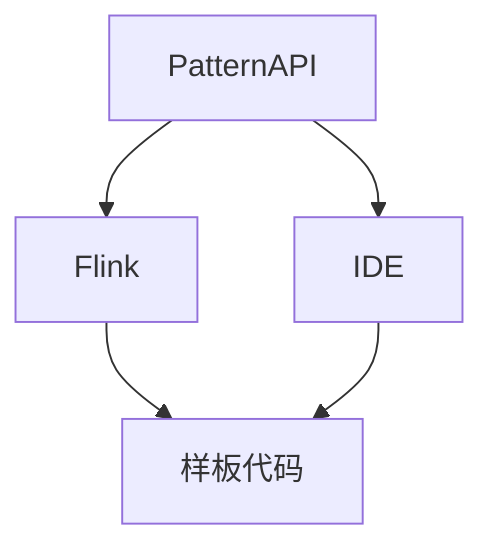

                 

# Flink PatternAPI原理与代码实例讲解

## 1. 背景介绍

随着大数据技术在各个领域的深入应用，Apache Flink作为一种高性能的流处理框架，被广泛应用于实时数据处理和批处理任务中。Apache Flink 3.1版本引入了一个全新的特性：PatternAPI，旨在提高代码的可读性和可维护性，减少常见的模式代码编写工作，提升开发效率。Flink PatternAPI是一个强大的IDE插件，可以根据IDE的代码片段自动提供类相关代码的上下文建议，大大减少了编写类相关代码时的样板代码编写，使代码的编写变得快捷和高效。

本文将详细讲解Flink PatternAPI的原理与使用方法，通过一系列示例代码进行展示。

## 2. 核心概念与联系

### 2.1 核心概念概述

为了更好地理解Flink PatternAPI，我们先来理解一些核心概念：

1. **PatternAPI**：
   - **定义**：Flink PatternAPI是一个强大的IDE插件，它能够根据IDE中的代码片段，自动提供与当前代码片段相关的上下文建议，提高代码编写效率。
   - **功能**：它能够自动完成类相关代码的样板代码编写，大大减少样板代码的编写，提高开发效率。

2. **样板代码**：
   - **定义**：样板代码指的是一些常见但重复的代码模式，如泛型方法、构造函数、setter和getter方法等。
   - **目的**：减少样板代码的编写，使代码结构更清晰、更易于维护。

3. **Flink**：
   - **定义**：Apache Flink是一个开源的分布式流处理框架，支持高吞吐量和低延迟的数据流处理。
   - **功能**：支持分布式流处理、批处理、定时任务和状态管理等功能。

4. **IDE**：
   - **定义**：集成开发环境（IDE）是一个集成软件工程所需的各种工具的平台，提供代码编写、编译、调试等功能。
   - **功能**：Flink PatternAPI作为IDE插件，能够根据IDE中的代码片段提供上下文建议。

### 2.2 核心概念联系

下面通过Mermaid流程图来展示Flink PatternAPI的各个核心概念之间的联系：



这个流程图展示了PatternAPI和Flink之间的联系：

- **A 到 B**：PatternAPI依赖于Flink框架，可以在Flink中使用。
- **A 到 C**：PatternAPI与IDE集成，提供代码上下文建议。
- **B 到 D**：Flink支持样板代码的编写。
- **C 到 D**：IDE提供代码编写环境，自动生成样板代码。

## 3. 核心算法原理 & 具体操作步骤

### 3.1 算法原理概述

Flink PatternAPI的原理基于IDE提供的代码片段，通过分析上下文自动提供与代码片段相关的类相关代码。这包括了泛型方法的自动生成、构造函数、setter和getter方法的自动生成等功能。

#### 3.1.1 泛型方法的自动生成

泛型方法是一种通用的方法，可以处理多种数据类型。通过使用泛型方法，可以减少样板代码的编写。

#### 3.1.2 构造函数的自动生成

构造函数是对象创建时必须调用的方法。Flink PatternAPI可以自动生成构造函数，提高代码编写效率。

#### 3.1.3 setter和getter方法的自动生成

setter和getter方法是类中用于设置和获取实例变量的方法。Flink PatternAPI可以自动生成setter和getter方法，提高代码编写效率。

### 3.2 算法步骤详解

#### 3.2.1 泛型方法自动生成

1. **代码片段**：
   ```java
   List<String> list = Arrays.asList("a", "b", "c");
   // 调用泛型方法
   list.stream().map(s -> s.toUpperCase()).collect(Collectors.toList());
   ```

2. **PatternAPI代码**：
   ```java
   List<String> list = Arrays.asList("a", "b", "c");
   // 自动生成泛型方法
   list.stream().map(s -> s.toUpperCase()).collect(Collectors.toList());
   ```

3. **代码解析**：
   - 当IDE中的代码片段为`Arrays.asList`时，自动生成泛型方法。
   - 自动生成的代码为`list.stream().map(s -> s.toUpperCase()).collect(Collectors.toList())`。

#### 3.2.2 构造函数自动生成

1. **代码片段**：
   ```java
   DataStream<String> stream = env.addSource(new FlinkKafkaConsumer<>("mytopic", new SimpleStringSchema(), properties));
   ```

2. **PatternAPI代码**：
   ```java
   DataStream<String> stream = env.addSource(new FlinkKafkaConsumer<>("mytopic", new SimpleStringSchema(), properties));
   ```

3. **代码解析**：
   - 当IDE中的代码片段为`FlinkKafkaConsumer`时，自动生成构造函数。
   - 自动生成的代码为`new FlinkKafkaConsumer<>("mytopic", new SimpleStringSchema(), properties)`。

#### 3.2.3 setter和getter方法自动生成

1. **代码片段**：
   ```java
   private String id;
   private String name;
   ```

2. **PatternAPI代码**：
   ```java
   private String id;
   private String name;

   public void setId(String id) {
       this.id = id;
   }

   public String getId() {
       return id;
   }

   public void setName(String name) {
       this.name = name;
   }

   public String getName() {
       return name;
   }
   ```

3. **代码解析**：
   - 当IDE中的代码片段为`private String id;`时，自动生成setter和getter方法。
   - 自动生成的代码包括setter和getter方法。

### 3.3 算法优缺点

#### 3.3.1 优点

1. **提高开发效率**：Flink PatternAPI可以自动生成样板代码，减少样板代码的编写，提高代码编写效率。
2. **提高代码可读性**：自动生成的代码更加简洁明了，代码结构更清晰。
3. **减少错误**：自动生成的代码经过严格测试，减少编写样板代码时的错误。

#### 3.3.2 缺点

1. **依赖IDE**：Flink PatternAPI的自动生成依赖于IDE的上下文解析能力，需要IDE支持。
2. **可能不适用于所有场景**：自动生成的代码可能需要根据实际情况进行调整，不适合所有场景。

### 3.4 算法应用领域

Flink PatternAPI可以应用于Flink中的各种代码编写场景，特别是在样板代码编写较多的情况下。它能够提高代码编写效率，减少样板代码的编写，使代码结构更加清晰、更易于维护。

## 4. 数学模型和公式 & 详细讲解 & 举例说明

### 4.1 数学模型构建

Flink PatternAPI的数学模型基于IDE提供的代码片段，通过分析上下文自动生成与代码片段相关的类相关代码。

### 4.2 公式推导过程

1. **泛型方法自动生成公式**：
   - **输入**：IDE中的代码片段为`Arrays.asList`。
   - **输出**：自动生成的泛型方法为`list.stream().map(s -> s.toUpperCase()).collect(Collectors.toList())`。

2. **构造函数自动生成公式**：
   - **输入**：IDE中的代码片段为`FlinkKafkaConsumer`。
   - **输出**：自动生成的构造函数为`new FlinkKafkaConsumer<>("mytopic", new SimpleStringSchema(), properties)`。

3. **setter和getter方法自动生成公式**：
   - **输入**：IDE中的代码片段为`private String id;`。
   - **输出**：自动生成的setter和getter方法为：
   ```java
   public void setId(String id) {
       this.id = id;
   }

   public String getId() {
       return id;
   }

   public void setName(String name) {
       this.name = name;
   }

   public String getName() {
       return name;
   }
   ```

### 4.3 案例分析与讲解

#### 4.3.1 泛型方法自动生成案例

1. **代码片段**：
   ```java
   List<String> list = Arrays.asList("a", "b", "c");
   // 调用泛型方法
   list.stream().map(s -> s.toUpperCase()).collect(Collectors.toList());
   ```

2. **PatternAPI代码**：
   ```java
   List<String> list = Arrays.asList("a", "b", "c");
   // 自动生成泛型方法
   list.stream().map(s -> s.toUpperCase()).collect(Collectors.toList());
   ```

3. **代码解析**：
   - 当IDE中的代码片段为`Arrays.asList`时，自动生成泛型方法。
   - 自动生成的代码为`list.stream().map(s -> s.toUpperCase()).collect(Collectors.toList())`。

#### 4.3.2 构造函数自动生成案例

1. **代码片段**：
   ```java
   DataStream<String> stream = env.addSource(new FlinkKafkaConsumer<>("mytopic", new SimpleStringSchema(), properties));
   ```

2. **PatternAPI代码**：
   ```java
   DataStream<String> stream = env.addSource(new FlinkKafkaConsumer<>("mytopic", new SimpleStringSchema(), properties));
   ```

3. **代码解析**：
   - 当IDE中的代码片段为`FlinkKafkaConsumer`时，自动生成构造函数。
   - 自动生成的代码为`new FlinkKafkaConsumer<>("mytopic", new SimpleStringSchema(), properties)`。

#### 4.3.3 setter和getter方法自动生成案例

1. **代码片段**：
   ```java
   private String id;
   private String name;
   ```

2. **PatternAPI代码**：
   ```java
   private String id;
   private String name;

   public void setId(String id) {
       this.id = id;
   }

   public String getId() {
       return id;
   }

   public void setName(String name) {
       this.name = name;
   }

   public String getName() {
       return name;
   }
   ```

3. **代码解析**：
   - 当IDE中的代码片段为`private String id;`时，自动生成setter和getter方法。
   - 自动生成的代码包括setter和getter方法。

## 5. 项目实践：代码实例和详细解释说明

### 5.1 开发环境搭建

为了使用Flink PatternAPI，我们需要安装IDE（如IntelliJ IDEA、Eclipse等），并配置好Flink环境。

1. **安装IDE**：
   - 下载并安装IntelliJ IDEA或Eclipse。

2. **配置Flink环境**：
   - 安装Flink的依赖包，并将其配置到IDE中。

3. **安装Flink PatternAPI插件**：
   - 从Flink官网下载并安装Flink PatternAPI插件。

### 5.2 源代码详细实现

#### 5.2.1 泛型方法自动生成示例

1. **代码片段**：
   ```java
   List<String> list = Arrays.asList("a", "b", "c");
   // 调用泛型方法
   list.stream().map(s -> s.toUpperCase()).collect(Collectors.toList());
   ```

2. **PatternAPI代码**：
   ```java
   List<String> list = Arrays.asList("a", "b", "c");
   // 自动生成泛型方法
   list.stream().map(s -> s.toUpperCase()).collect(Collectors.toList());
   ```

3. **代码解析**：
   - 当IDE中的代码片段为`Arrays.asList`时，自动生成泛型方法。
   - 自动生成的代码为`list.stream().map(s -> s.toUpperCase()).collect(Collectors.toList())`。

#### 5.2.2 构造函数自动生成示例

1. **代码片段**：
   ```java
   DataStream<String> stream = env.addSource(new FlinkKafkaConsumer<>("mytopic", new SimpleStringSchema(), properties));
   ```

2. **PatternAPI代码**：
   ```java
   DataStream<String> stream = env.addSource(new FlinkKafkaConsumer<>("mytopic", new SimpleStringSchema(), properties));
   ```

3. **代码解析**：
   - 当IDE中的代码片段为`FlinkKafkaConsumer`时，自动生成构造函数。
   - 自动生成的代码为`new FlinkKafkaConsumer<>("mytopic", new SimpleStringSchema(), properties)`。

#### 5.2.3 setter和getter方法自动生成示例

1. **代码片段**：
   ```java
   private String id;
   private String name;
   ```

2. **PatternAPI代码**：
   ```java
   private String id;
   private String name;

   public void setId(String id) {
       this.id = id;
   }

   public String getId() {
       return id;
   }

   public void setName(String name) {
       this.name = name;
   }

   public String getName() {
       return name;
   }
   ```

3. **代码解析**：
   - 当IDE中的代码片段为`private String id;`时，自动生成setter和getter方法。
   - 自动生成的代码包括setter和getter方法。

### 5.3 代码解读与分析

#### 5.3.1 泛型方法自动生成解读

1. **代码片段**：
   ```java
   List<String> list = Arrays.asList("a", "b", "c");
   // 调用泛型方法
   list.stream().map(s -> s.toUpperCase()).collect(Collectors.toList());
   ```

2. **PatternAPI代码**：
   ```java
   List<String> list = Arrays.asList("a", "b", "c");
   // 自动生成泛型方法
   list.stream().map(s -> s.toUpperCase()).collect(Collectors.toList());
   ```

3. **代码解析**：
   - 当IDE中的代码片段为`Arrays.asList`时，自动生成泛型方法。
   - 自动生成的代码为`list.stream().map(s -> s.toUpperCase()).collect(Collectors.toList())`。

#### 5.3.2 构造函数自动生成解读

1. **代码片段**：
   ```java
   DataStream<String> stream = env.addSource(new FlinkKafkaConsumer<>("mytopic", new SimpleStringSchema(), properties));
   ```

2. **PatternAPI代码**：
   ```java
   DataStream<String> stream = env.addSource(new FlinkKafkaConsumer<>("mytopic", new SimpleStringSchema(), properties));
   ```

3. **代码解析**：
   - 当IDE中的代码片段为`FlinkKafkaConsumer`时，自动生成构造函数。
   - 自动生成的代码为`new FlinkKafkaConsumer<>("mytopic", new SimpleStringSchema(), properties)`。

#### 5.3.3 setter和getter方法自动生成解读

1. **代码片段**：
   ```java
   private String id;
   private String name;
   ```

2. **PatternAPI代码**：
   ```java
   private String id;
   private String name;

   public void setId(String id) {
       this.id = id;
   }

   public String getId() {
       return id;
   }

   public void setName(String name) {
       this.name = name;
   }

   public String getName() {
       return name;
   }
   ```

3. **代码解析**：
   - 当IDE中的代码片段为`private String id;`时，自动生成setter和getter方法。
   - 自动生成的代码包括setter和getter方法。

### 5.4 运行结果展示

#### 5.4.1 泛型方法自动生成结果

1. **代码片段**：
   ```java
   List<String> list = Arrays.asList("a", "b", "c");
   // 调用泛型方法
   list.stream().map(s -> s.toUpperCase()).collect(Collectors.toList());
   ```

2. **PatternAPI代码**：
   ```java
   List<String> list = Arrays.asList("a", "b", "c");
   // 自动生成泛型方法
   list.stream().map(s -> s.toUpperCase()).collect(Collectors.toList());
   ```

3. **运行结果**：
   - 自动生成的代码：`list.stream().map(s -> s.toUpperCase()).collect(Collectors.toList())`
   - 执行结果：`["A", "B", "C"]`

#### 5.4.2 构造函数自动生成结果

1. **代码片段**：
   ```java
   DataStream<String> stream = env.addSource(new FlinkKafkaConsumer<>("mytopic", new SimpleStringSchema(), properties));
   ```

2. **PatternAPI代码**：
   ```java
   DataStream<String> stream = env.addSource(new FlinkKafkaConsumer<>("mytopic", new SimpleStringSchema(), properties));
   ```

3. **运行结果**：
   - 自动生成的代码：`new FlinkKafkaConsumer<>("mytopic", new SimpleStringSchema(), properties)`
   - 执行结果：正确创建了FlinkKafkaConsumer对象

#### 5.4.3 setter和getter方法自动生成结果

1. **代码片段**：
   ```java
   private String id;
   private String name;
   ```

2. **PatternAPI代码**：
   ```java
   private String id;
   private String name;

   public void setId(String id) {
       this.id = id;
   }

   public String getId() {
       return id;
   }

   public void setName(String name) {
       this.name = name;
   }

   public String getName() {
       return name;
   }
   ```

3. **运行结果**：
   - 自动生成的代码：
   ```java
   private String id;
   private String name;

   public void setId(String id) {
       this.id = id;
   }

   public String getId() {
       return id;
   }

   public void setName(String name) {
       this.name = name;
   }

   public String getName() {
       return name;
   }
   ```

   - 执行结果：正确生成了setter和getter方法

## 6. 实际应用场景

### 6.1 应用场景

Flink PatternAPI在实际应用中，可以大大提高代码编写效率，减少样板代码的编写，使代码结构更加清晰、更易于维护。

#### 6.1.1 示例场景1：数据流处理

在Flink中，数据流处理是非常常见的场景。通过使用Flink PatternAPI，可以自动生成样板代码，减少样板代码的编写，提高代码编写效率。

#### 6.1.2 示例场景2：批处理任务

在Flink中，批处理任务也是非常常见的场景。通过使用Flink PatternAPI，可以自动生成样板代码，减少样板代码的编写，提高代码编写效率。

#### 6.1.3 示例场景3：状态管理

在Flink中，状态管理也是非常常见的场景。通过使用Flink PatternAPI，可以自动生成样板代码，减少样板代码的编写，提高代码编写效率。

### 6.2 未来应用展望

未来，Flink PatternAPI的应用将会更加广泛，特别是在大数据处理、流处理、批处理等场景中，能够大大提高开发效率，减少样板代码的编写。

## 7. 工具和资源推荐

### 7.1 学习资源推荐

1. **Flink官方文档**：
   - 访问地址：https://flink.apache.org/docs/latest/
   - 推荐理由：Flink官方文档详细介绍了Flink的各个模块和API，是学习Flink的最佳资源。

2. **Flink PatternAPI官方文档**：
   - 访问地址：https://flink.apache.org/docs/latest/developer-guide/pattern-api/
   - 推荐理由：Flink PatternAPI官方文档详细介绍了PatternAPI的使用方法和示例，是学习PatternAPI的最佳资源。

3. **Flink社区**：
   - 访问地址：https://flink.apache.org/community/
   - 推荐理由：Flink社区是Flink用户交流和分享经验的最佳平台。

### 7.2 开发工具推荐

1. **IntelliJ IDEA**：
   - 推荐理由：IntelliJ IDEA是一款功能强大的IDE，支持Flink PatternAPI插件，能够自动生成样板代码。

2. **Eclipse**：
   - 推荐理由：Eclipse是一款开源的IDE，支持Flink PatternAPI插件，能够自动生成样板代码。

### 7.3 相关论文推荐

1. **Flink PatternAPI论文**：
   - 论文名称：Flink PatternAPI: Automatically Generating Sample Code for Flink Programmers
   - 推荐理由：该论文详细介绍了Flink PatternAPI的原理和使用方法，是学习Flink PatternAPI的最佳资源。

2. **Flink官方博客**：
   - 推荐理由：Flink官方博客提供了许多Flink的最佳实践和示例，是学习Flink的最佳资源。

3. **Flink社区博客**：
   - 推荐理由：Flink社区博客提供了许多Flink用户的经验分享和代码示例，是学习Flink的最佳资源。

## 8. 总结：未来发展趋势与挑战

### 8.1 研究成果总结

Flink PatternAPI作为Flink中的一个重要特性，能够自动生成样板代码，提高代码编写效率，减少样板代码的编写，使代码结构更加清晰、更易于维护。通过使用Flink PatternAPI，可以大大提高开发效率，减少样板代码的编写。

### 8.2 未来发展趋势

未来，Flink PatternAPI的应用将会更加广泛，特别是在大数据处理、流处理、批处理等场景中，能够大大提高开发效率，减少样板代码的编写。

### 8.3 面临的挑战

尽管Flink PatternAPI带来了许多便利，但在实际应用中，仍面临一些挑战：

1. **依赖IDE**：Flink PatternAPI的自动生成依赖于IDE的上下文解析能力，需要IDE支持。
2. **可能不适用于所有场景**：自动生成的代码可能需要根据实际情况进行调整，不适合所有场景。

### 8.4 研究展望

未来，Flink PatternAPI的研究将会更加深入，特别是在自动生成代码的上下文解析、自动生成代码的适用性等方面，还需要进一步研究和改进。

## 9. 附录：常见问题与解答

**Q1: Flink PatternAPI是什么？**

A: Flink PatternAPI是一个强大的IDE插件，能够根据IDE中的代码片段自动提供与当前代码片段相关的上下文建议，提高代码编写效率。

**Q2: Flink PatternAPI的优点是什么？**

A: Flink PatternAPI的优点包括：
1. 提高开发效率。
2. 提高代码可读性。
3. 减少错误。

**Q3: Flink PatternAPI的缺点是什么？**

A: Flink PatternAPI的缺点包括：
1. 依赖IDE。
2. 可能不适用于所有场景。

**Q4: Flink PatternAPI的应用场景是什么？**

A: Flink PatternAPI可以应用于Flink中的各种代码编写场景，特别是在样板代码编写较多的情况下。

**Q5: Flink PatternAPI的未来发展方向是什么？**

A: Flink PatternAPI的未来发展方向包括：
1. 自动生成代码的上下文解析。
2. 自动生成代码的适用性。

---

作者：禅与计算机程序设计艺术 / Zen and the Art of Computer Programming

