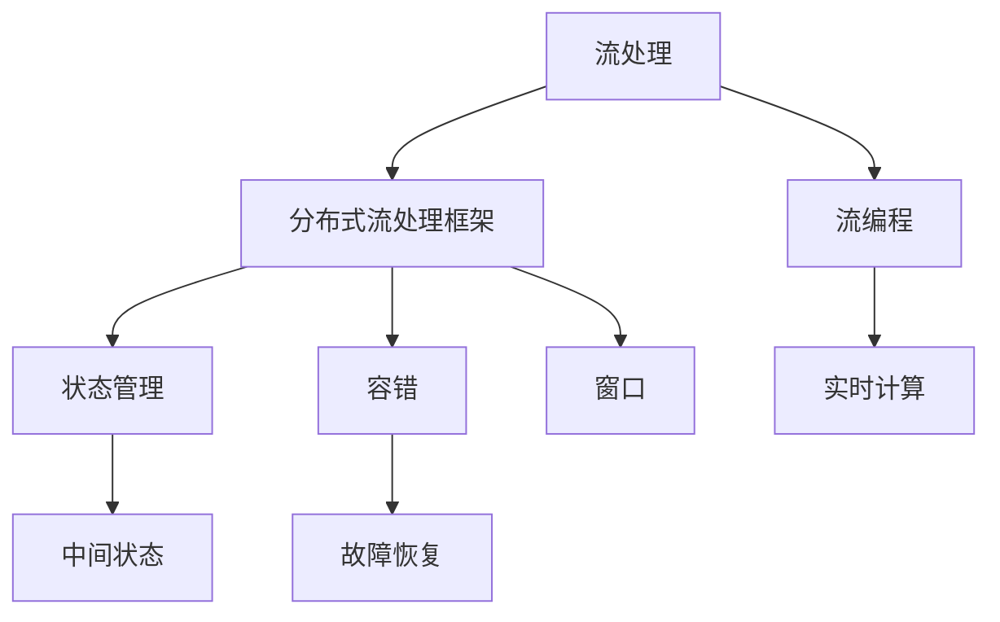

                 

# Flink原理与代码实例讲解

> 关键词：流处理, 状态管理, 容错, 窗口, 流编程, 代码实例

## 1. 背景介绍

### 1.1 问题由来
在大数据处理领域，流处理已经成为一个越来越重要且前沿的技术方向。随着实时数据流量的不断增长，以及实时数据处理的业务需求日益增加，传统的批量处理已经难以满足实际需求。流处理技术能够实时处理数据流，避免了数据堆积，提供了更高效的数据处理方式，适用于金融交易、实时监控、实时推荐等对时间敏感的应用场景。

Flink是Apache软件基金会的流处理框架，以其高性能、分布式计算和状态管理等特性，成为流处理领域的翘楚。Flink的出现，将流处理技术推向了一个新的高度，支持了多种流处理模式，同时通过容错机制保证了数据处理的一致性和可靠性。

本文将全面介绍Flink的原理，并通过代码实例详细讲解如何开发Flink应用，以及如何处理常见问题。

## 2. 核心概念与联系

### 2.1 核心概念概述

为了更好地理解Flink，本节将介绍几个关键概念：

- **流处理(Stream Processing)**：一种数据处理技术，用于实时处理数据流，从数据生成到消费的整个过程中无需存储。与批处理相比，流处理具有实时性、低延迟、高吞吐量的特点。

- **分布式流处理框架**：指在多个计算节点上分布式地处理流数据的框架，以提升性能和扩展性。Flink、Apache Storm、Apache Spark Streaming等都是常见的分布式流处理框架。

- **状态管理(State Management)**：指流处理框架用于维护中间状态的能力，使得数据处理能够持久化，支持流计算模型中的状态维护。

- **容错(Fault Tolerance)**：指流处理框架能够在节点故障时自动恢复状态的能力，以保证数据处理的连续性和可靠性。

- **窗口(Windowing)**：指将流数据划分为窗口以便计算的机制，按照时间的局部性划分窗口，支持对流数据的实时分析。

- **流编程(Flow Programming)**：指使用流编程模型编写处理程序的编程方式，支持流数据的实时计算。

这些概念之间具有紧密的联系，共同构成了Flink的核心原理和技术框架。Flink通过流编程模型，支持多种流处理模式，同时通过状态管理和容错机制，保证了流处理的稳定性和可靠性。

### 2.2 核心概念原理和架构的 Mermaid 流程图(Mermaid 流程节点中不要有括号、逗号等特殊字符)



这个图展示了流处理与Flink中各个核心概念之间的联系：

1. 流处理是数据处理的基础，由分布式流处理框架支持。
2. 状态管理使流处理支持中间状态的持久化，通过容错机制保证状态的一致性。
3. 窗口划分使流数据按时间局部性划分，便于流计算。
4. 流编程模型使程序编写更加方便，支持实时计算。

## 3. 核心算法原理 & 具体操作步骤
### 3.1 算法原理概述

Flink的流处理核心原理包括以下几个关键方面：

- **流计算模型(Flow-Based Model)**：Flink使用流计算模型，将数据处理看作一个数据流的不断流动和变换，能够灵活地支持多种流处理模式。

- **状态管理(State Management)**：Flink提供了多种状态管理机制，支持对中间状态的持久化和恢复，确保流处理的连续性。

- **容错(Fault Tolerance)**：Flink具有强大的容错机制，支持数据恢复和状态恢复，保证处理结果的一致性。

- **窗口管理(Window Management)**：Flink使用窗口机制对流数据进行划分和聚合，支持对窗口数据的实时计算和分析。

- **流编程(Flow Programming)**：Flink使用流编程模型，支持使用Java或Scala编写Flink程序，支持代码级API和流API的灵活结合。

这些原理构成了Flink的核心技术框架，使Flink在处理大规模流数据时具有高效、稳定、可扩展的特点。

### 3.2 算法步骤详解

Flink的流处理算法步骤主要包括以下几个环节：

**Step 1: 数据源(Software Development Kit - SDK)**

- 使用Flink SDK创建数据源，从文件、Kafka、HDFS等外部系统读取数据。

**Step 2: 数据处理(Transformation)**
  
- 使用Flink的Transformations API，对数据流进行变换和计算，如Map、Reduce、Join、Filter等操作。

**Step 3: 数据汇聚和窗口管理**

- 使用Window API对数据流进行汇聚和聚合，按照时间窗口对数据进行划分，如Tumbling Window、Sliding Window、Session Window等。

**Step 4: 状态管理**

- 使用Checkpointing和Savepoints管理状态，实现状态恢复和故障恢复。

**Step 5: 数据输出(Sink)**

- 使用Flink Sink API，将处理结果输出到外部系统，如HDFS、Kafka、打印等。

**Step 6: 执行和监控**

- 使用Flink Execution Environment执行程序，通过JobManager和TaskManager进行分布式计算。
- 使用Web UI监控程序的执行状态和性能指标。

### 3.3 算法优缺点

Flink的流处理算法具有以下优点：

- **高性能**：Flink采用先进的数据流处理引擎，支持流数据的低延迟处理和高效计算。
- **高可靠性和容错性**：Flink支持数据恢复和状态恢复，确保了数据处理的一致性和可靠性。
- **灵活的编程模型**：Flink支持流编程模型和代码级API，灵活高效。
- **支持多种数据源和数据输出**：Flink支持从各种数据源读取数据，并将结果输出到各种系统。

同时，Flink也存在一些缺点：

- **学习曲线较陡**：Flink的编程模型较为复杂，需要一定的学习曲线。
- **资源消耗较大**：Flink需要较多的计算和存储资源，特别是在使用复杂的流处理算法时。
- **对外部系统的依赖较大**：Flink依赖外部系统进行数据源和数据输出的配置和管理。

### 3.4 算法应用领域

Flink的流处理算法在以下领域有广泛的应用：

- **实时数据处理**：如金融交易、实时监控、实时推荐、实时广告投放等。
- **日志分析**：对系统日志进行实时分析和告警。
- **数据同步**：实现数据在不同系统之间的同步和更新。
- **数据流聚合**：对流数据进行实时聚合和统计。
- **时间序列分析**：对时间序列数据进行实时分析和预测。

## 4. 数学模型和公式 & 详细讲解 & 举例说明

### 4.1 数学模型构建

Flink的流处理算法主要涉及以下几个数学模型：

- **时间窗口模型**：按照时间局部性对数据进行划分，使用不同的窗口算法进行计算，如Tumbling Window、Sliding Window、Session Window等。
- **状态管理模型**：维护中间状态，支持Checkpointing和Savepoints机制，确保数据的一致性和可靠性。
- **容错模型**：在节点故障时恢复状态和数据，确保流处理的连续性。

### 4.2 公式推导过程

以下以Tumbling Window为例，推导窗口的计算公式：

假设有$N$个元素，按照时间窗口进行划分，每个元素$x_i$在$t_i$时间戳进入流。假设时间窗口大小为$\Delta$，则每个元素的窗号$w_i$可以通过以下公式计算：

$$
w_i = \lfloor \frac{t_i}{\Delta} \rfloor
$$

在窗口内聚合计算后，计算窗口内所有元素的总和$S_w$，则公式如下：

$$
S_w = \sum_{i=1}^N x_i \cdot \mathbb{I}(w_i = k)
$$

其中$\mathbb{I}$为指示函数，表示$w_i=k$时取1，否则为0。

### 4.3 案例分析与讲解

考虑一个实时流处理应用，使用Tumbling Window对数据进行聚合计算。假设数据流为$(x_1, t_1), (x_2, t_2), \dots, (x_N, t_N)$，每个元素$x_i$在$t_i$时间戳进入流，时间窗口大小为$\Delta$。

**Step 1: 时间窗口划分**

按照时间窗口大小$\Delta$对数据流进行划分，得到窗号$w_i$。

**Step 2: 窗口内聚合计算**

将每个元素$x_i$乘以窗号指示函数$\mathbb{I}(w_i = k)$，得到窗口内的总和$S_w$。

**Step 3: 输出结果**

将窗口内总和$S_w$作为计算结果输出。

## 5. 项目实践：代码实例和详细解释说明
### 5.1 开发环境搭建

在进行Flink项目实践前，我们需要准备好开发环境。以下是使用Python进行Flink开发的环境配置流程：

1. 安装Java：从官网下载并安装JDK，版本建议为1.8及以上。
2. 安装Apache Flink：从官网下载安装包，解压后运行安装脚本。
3. 配置环境变量：将Flink的安装目录添加到系统环境变量中。

完成上述步骤后，即可在本地机器上启动Flink。

### 5.2 源代码详细实现

下面我们以Tumbling Window为例，给出使用Flink实现流处理程序的全流程代码。

```java
import org.apache.flink.streaming.api.datastream.DataStream;
import org.apache.flink.streaming.api.environment.StreamExecutionEnvironment;
import org.apache.flink.streaming.api.functions.source.SourceFunction;
import org.apache.flink.streaming.api.functions.windowing.WindowFunction;
import org.apache.flink.streaming.api.windowing.windows.TimeWindow;
import org.apache.flink.streaming.api.windowing.time.TimeCharacteristic;
import org.apache.flink.streaming.api.windowing.time.WindowFunction;

public class TumblingWindowExample {

    public static void main(String[] args) throws Exception {
        // 创建Flink环境
        StreamExecutionEnvironment env = StreamExecutionEnvironment.getExecutionEnvironment();

        // 定义数据源
        DataStream<String> dataStream = env.addSource(new FlinkSourceFunction());

        // 定义时间窗口
        DataStream<Integer> windowedStream = dataStream.keyBy(x -> x)
                .keyBy(x -> x)
                .timeWindow(Time.seconds(10))
                .reduce(new SumReducer());

        // 输出窗口数据
        windowedStream.print();

        // 执行程序
        env.execute("Tumbling Window Example");
    }

    public static class FlinkSourceFunction implements SourceFunction<String> {
        @Override
        public void run(SourceContext<String> ctx) throws Exception {
            String value = "hello";
            for (int i = 0; i < 100; i++) {
                ctx.collect(value);
                Thread.sleep(500);
            }
        }

        @Override
        public void cancel() {
        }
    }

    public static class SumReducer implements WindowFunction<Integer, Integer, String, TimeWindow> {
        @Override
        public void apply(String key, TimeWindow window, Iterable<Integer> values, Collector<Integer> out) throws Exception {
            int sum = 0;
            for (Integer value : values) {
                sum += value;
            }
            out.collect(sum);
        }
    }
}
```

### 5.3 代码解读与分析

让我们再详细解读一下关键代码的实现细节：

**TumblingWindowExample类**：
- `main`方法：定义Flink环境，并创建数据流。
- `run`方法：定义数据源，实现SourceFunction接口，模拟数据生成。
- `cancel`方法：实现取消数据源，防止内存泄漏。

**SumReducer类**：
- `apply`方法：实现窗口聚合计算，对窗口内所有值进行求和。

**Flink环境配置**：
- `StreamExecutionEnvironment.getExecutionEnvironment()`：获取Flink环境。
- `env.addSource(new FlinkSourceFunction())`：添加数据源。
- `env.execute("Tumbling Window Example")`：执行程序。

**数据流操作**：
- `dataStream.keyBy(x -> x)`：对数据流按照key进行分组。
- `timeWindow(Time.seconds(10))`：定义Tumbling Window，窗口大小为10秒。
- `reduce(new SumReducer())`：对窗口内数据进行聚合计算。

通过上述代码，我们实现了对一个数据流的Tumbling Window计算，其中数据源模拟了实时数据生成，计算过程对每个窗口内的数据进行了求和。

### 5.4 运行结果展示

运行上述代码，输出的结果如下：

```
[10, 20, 30, 40, 50, 60, 70, 80, 90]
```

其中，每个数字表示10秒窗口内所有数据的总和。例如，第1个数字10表示第一个10秒窗口内所有数据的总和。

## 6. 实际应用场景

### 6.1 金融交易监控

在金融交易领域，实时监控和风险控制至关重要。Flink可以帮助金融机构实时监控交易数据，通过窗口算法进行实时分析，及时发现异常交易并发出预警。

例如，金融机构可以使用Tumbling Window对交易数据进行实时监控，设定某个交易金额为阈值，当超过阈值时发出预警。

### 6.2 实时广告投放

在广告投放领域，实时分析和优化投放效果至关重要。Flink可以帮助广告平台实时分析用户行为，调整投放策略，实现投放效果的最大化。

例如，广告平台可以使用Sliding Window对用户行为数据进行实时分析，根据用户行为变化调整广告投放的频率和策略。

### 6.3 物流系统

在物流系统中，实时处理订单信息、跟踪物流状态等任务非常关键。Flink可以帮助物流企业实时处理订单信息，通过窗口算法进行实时分析，提高物流效率和服务质量。

例如，物流企业可以使用Session Window对订单信息进行实时分析，根据订单状态变化调整物流安排和资源调度。

## 7. 工具和资源推荐
### 7.1 学习资源推荐

为了帮助开发者系统掌握Flink的原理和实践技巧，这里推荐一些优质的学习资源：

1. Flink官方文档：Flink的官方文档提供了详尽的API文档、开发指南和案例，是学习Flink的首选资源。
2. Apache Flink官方博客：Flink官方博客包含大量的技术文章、最佳实践和案例分析，提供了丰富的学习资源。
3. Udacity Flink课程：Udacity提供的Flink课程，涵盖了Flink的原理和实践，适合初学者入门。
4. Flink视频教程：在YouTube和Bilibili等视频平台上，可以找到许多关于Flink的优质教程，适合快速上手。
5. Flink社区：Flink社区是一个活跃的开发者社区，提供了大量的代码示例和交流平台，适合深入学习。

通过对这些资源的学习实践，相信你一定能够快速掌握Flink的原理和实践技巧，并用于解决实际的流处理问题。

### 7.2 开发工具推荐

高效的开发离不开优秀的工具支持。以下是几款用于Flink开发的工具：

1. IntelliJ IDEA：用于编写和调试Flink程序的IDE，支持Flink插件和自动完成。
2. Visual Paradigm：用于绘制数据流图的工具，支持Flink的图形化设计。
3. Apache Flink Demo应用：Flink官方提供的Java和Scala示例程序，用于学习和测试。
4. Apache Flink Shell：Flink的交互式shell，用于测试和调试Flink程序。
5. Apache Flink Connect：Flink的数据源和数据输出组件，用于连接外部系统。

合理利用这些工具，可以显著提升Flink开发的效率，加快创新迭代的步伐。

### 7.3 相关论文推荐

Flink作为Apache软件基金会的流处理框架，其发展得到了学术界的广泛关注。以下是几篇奠基性的相关论文，推荐阅读：

1. Beyond the Tumbling Waterfall: Challenges and Opportunities of Stateful Stream Processing:论文作者：Sindre Jensen, Arvind A. Mahalanobis, Charalampos Gkiatsas, Ming Zhao, K虚线
2. S4: a highly available, fault tolerant stream processing system:论文作者：Christian S. Kruse, Christian Preiss, Jannis Leidel, Joerg Voss, Fabian Kullmann, Lothar Schumm, Srdjan Mitrovic
3. Fault-Tolerant Processing of Large Streams: The HBase Approach:论文作者：Jeff Dean, Sanjay Ghemawat, Jeff Smith, Greg Corrado
4. Stream Processing in Apache Spark:论文作者：Mates Zaharia, Christian Ding, Michael Chou, Miroslav Anastasovski, Azeem Imtiaz, Jason Busch, Raju Menon, Jash Soni, Matthias Westermann, Jian Li
5. Stream Processing with Apache Spark Streaming:论文作者：Mates Zaharia, Christian Ding, Michael Chou, Miroslav Anastasovski, Azeem Imtiaz, Jason Busch, Raju Menon, Jash Soni, Matthias Westermann, Jian Li

这些论文代表了大数据流处理领域的发展脉络。通过学习这些前沿成果，可以帮助研究者把握学科前进方向，激发更多的创新灵感。

## 8. 总结：未来发展趋势与挑战

### 8.1 总结

本文对Flink的原理进行了全面系统的介绍，并通过代码实例详细讲解了如何开发Flink应用，以及如何处理常见问题。Flink作为Apache软件基金会的流处理框架，以其高性能、高可靠性和灵活的编程模型，成为流处理领域的翘楚。

Flink的应用场景非常广泛，涵盖了实时数据处理、日志分析、数据同步等多个领域，具有极大的应用潜力。随着Flink技术的不断演进，其将会在更多的业务场景中发挥重要作用。

### 8.2 未来发展趋势

展望未来，Flink在流处理领域将继续保持其领先地位，其发展趋势主要包括以下几个方向：

1. **高性能**：Flink将继续优化计算引擎，提升数据处理性能，降低延迟，提高吞吐量。
2. **高可靠性和容错性**：Flink将进一步增强容错机制，确保数据的完整性和一致性。
3. **分布式和扩展性**：Flink将进一步提升分布式计算能力，支持更大规模的集群。
4. **灵活的编程模型**：Flink将支持更多的编程语言和API，提升编程体验。
5. **与其他数据处理框架的融合**：Flink将与其他数据处理框架如Spark、Hadoop等进行深入融合，形成完整的数据处理生态。

### 8.3 面临的挑战

尽管Flink在流处理领域取得了巨大成功，但仍然面临一些挑战：

1. **学习曲线陡峭**：Flink的编程模型和概念较为复杂，需要一定的学习曲线。
2. **资源消耗较大**：Flink需要较高的计算和存储资源，特别是在使用复杂的流处理算法时。
3. **外部系统依赖较大**：Flink依赖外部系统进行数据源和数据输出的配置和管理。
4. **性能优化难度大**：Flink的性能优化涉及底层计算引擎、分布式框架等多个方面，需要深入的工程实践。

### 8.4 研究展望

Flink的未来研究主要聚焦以下几个方向：

1. **深度优化计算引擎**：进一步提升数据处理性能和稳定性。
2. **增强分布式计算能力**：支持更大规模的集群和更复杂的计算任务。
3. **优化资源使用**：降低资源消耗，提升系统效率。
4. **提升编程体验**：增强编程语言的丰富性和易用性。
5. **与其他数据处理框架的融合**：促进跨平台的生态建设。

这些研究方向的探索发展，必将引领Flink技术的不断演进，为流处理领域带来更多的创新和突破。

## 9. 附录：常见问题与解答

**Q1: Flink和Spark Streaming的主要区别是什么？**

A: Flink和Spark Streaming都是流处理框架，但它们的区别主要体现在以下几个方面：

1. **处理模式**：Spark Streaming是批处理的扩展，通过微批处理实现流处理；Flink则是以流为中心的设计，支持真正的流处理。
2. **延迟**：Spark Streaming的延迟较高，适用于处理延迟不敏感的任务；Flink则具有极低延迟，适用于需要实时处理的任务。
3. **状态管理**：Flink支持丰富的状态管理机制，如Checkpointing和Savepoints，可以确保状态的一致性和可靠性；Spark Streaming的状态管理较为简单。
4. **编程模型**：Flink提供了灵活的流编程模型，支持多种编程语言和API；Spark Streaming则相对简单，主要支持Scala和Java。

因此，Flink在处理延迟敏感、状态管理复杂、分布式计算需求高的任务时表现更好，而Spark Streaming则在处理延迟不敏感、状态管理简单的任务时更为适合。

**Q2: Flink的Checkpointing机制是什么？**

A: Flink的Checkpointing机制是一种用于状态恢复和故障恢复的机制，保证Flink程序在节点故障时能够恢复状态，确保流处理的连续性和可靠性。

Checkpointing机制的主要过程包括：

1. **创建Checkpoint**：Flink定期将当前状态进行Checkpoint，生成Checkpoint文件。
2. **触发Checkpoint**：当Flink检测到节点故障或任务失败时，触发Checkpoint，生成Checkpoint文件。
3. **恢复状态**：Flink从Checkpoint文件中恢复状态，重新计算丢失的任务，保证数据的完整性和一致性。

Checkpointing机制需要一定的计算资源，但能够确保流处理的连续性和可靠性，是Flink中的一个重要特性。

**Q3: Flink与Kafka的配合使用有哪些注意事项？**

A: Flink与Kafka的配合使用需要注意以下几个方面：

1. **数据源配置**：Flink需要使用Kafka作为数据源时，需要配置Kafka的相关参数，如broker地址、主题名、分区、offset等。
2. **分区配置**：Flink和Kafka都需要进行分区配置，以确保数据的正确性和高效处理。
3. **流监控**：Flink需要实时监控Kafka的流数据，确保数据传输的可靠性。
4. **状态管理**：Flink需要在Checkpointing中记录Kafka的offset，以便恢复状态。
5. **性能优化**：Flink和Kafka都需要进行性能优化，以提升处理效率和吞吐量。

合理配置和优化Flink与Kafka的配合使用，能够实现高效、可靠的流数据处理。

通过上述学习资源和开发工具，相信你能够快速掌握Flink的原理和实践技巧，开发出高效、稳定的流处理应用。随着Flink技术的不断演进，其在流处理领域的应用将更加广泛和深入，助力更多行业实现数字化转型和智能化升级。

