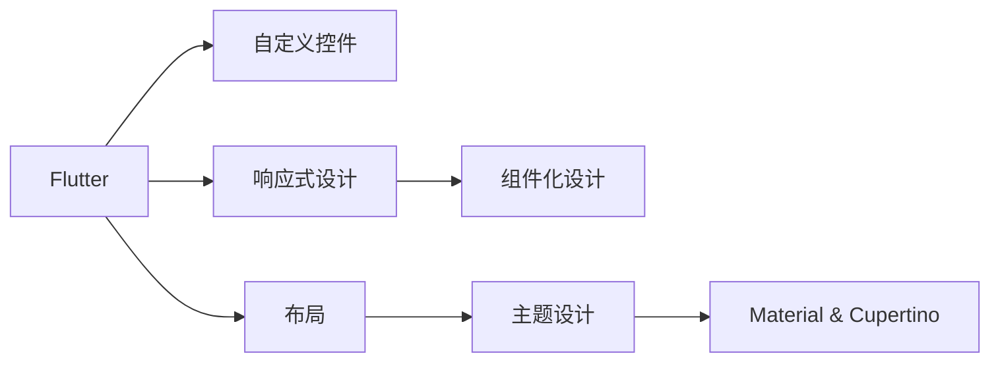

                 

## 1. 背景介绍

### 1.1 问题由来
移动端界面的美观度和用户体验已经成为应用成败的关键因素之一。随着Google提供的Flutter框架在移动端开发的崛起，越来越多的开发者开始关注其定制化的界面设计。然而，对于大多数新手开发者而言，如何创建美观且符合品牌的界面仍然是一个令人头疼的问题。

### 1.2 问题核心关键点
Flutter UI定制的核心在于如何设计符合品牌风格的控件和布局，如何高效地实现自定义渲染，如何在响应式设计中保持界面一致性。为此，我们需要掌握核心设计原则，了解Flutter的渲染机制，熟悉常用的UI框架和组件。

### 1.3 问题研究意义
在移动端界面设计中，使用Flutter进行UI定制，不仅可以满足不同品牌的需求，还能提高应用性能和用户体验。深入研究Flutter UI定制，有助于开发者掌握更灵活的设计技巧，提升代码的可重用性和可维护性。

## 2. 核心概念与联系

### 2.1 核心概念概述

为更好地理解Flutter UI定制，本节将介绍几个核心概念：

- Flutter：由Google开发的开源UI框架，支持跨平台开发，并提供强大的渲染引擎和组件库。
- 自定义控件：开发者根据品牌需求和设计原则，设计并实现符合品牌风格的UI控件。
- 响应式设计：根据设备的屏幕大小和方向，自动调整UI布局和控件大小，以适应不同设备。
- 组件化设计：将UI设计拆分为小模块，便于复用和维护。
- 布局：将UI元素在屏幕上进行排列，常用的布局方式包括Flexbox、Grid和ConstrainedBox。
- 主题设计：定义应用的基本颜色、字体和样式，统一应用整体风格。
- Material和Cupertino：Flutter提供的两大主题设计风格，分别模仿Google Material和Apple Cupertino设计规范。

这些概念之间的逻辑关系可以通过以下Mermaid流程图来展示：



这个流程图展示了Flutter UI定制的主要概念及其之间的关系：

1. Flutter是UI定制的基础，提供了强大的渲染引擎和组件库。
2. 自定义控件是定制UI的核心，需要根据品牌需求设计。
3. 响应式设计保证了UI在不同设备上的可适配性。
4. 组件化设计有助于代码复用和维护。
5. 布局和主题设计是实现响应式和品牌一致性的关键。

## 3. 核心算法原理 & 具体操作步骤

### 3.1 算法原理概述

Flutter UI定制的算法原理是基于Flutter的渲染机制，通过编写自定义渲染代码，实现自定义控件。具体来说，Flutter UI定制分为以下几个关键步骤：

1. 设计自定义控件的外观和行为。
2. 编写自定义渲染代码，实现控件的绘制逻辑。
3. 将自定义控件添加到Flutter应用中，并通过布局进行整合。
4. 应用响应式设计，确保界面在不同设备上保持一致性。

### 3.2 算法步骤详解

#### 3.2.1 设计自定义控件

1. 确定控件的功能和视觉风格。
2. 使用Sketch、Figma等工具进行界面设计。
3. 根据设计图，编写代码实现自定义控件的外观和行为。

#### 3.2.2 编写自定义渲染代码

1. 继承CustomPainter类，实现paint方法。
2. 在paint方法中，使用Canvas绘制控件的各个部分。
3. 实现控件的布局和大小计算逻辑。
4. 通过StatefulWidget或StatelessWidget实现控件的状态管理。

#### 3.2.3 添加自定义控件

1. 在Flutter应用中引入自定义控件。
2. 在布局中，通过添加到Containers、Stack等控件中，进行整合。

#### 3.2.4 应用响应式设计

1. 使用MediaQuery获取设备尺寸和方向信息。
2. 根据设备信息，动态调整控件的大小和布局。
3. 使用MediaQuery.of(context)获取应用的主题信息，保持一致性。

### 3.3 算法优缺点

#### 3.3.1 优点

- 灵活性高：可以根据品牌需求自定义控件，实现高度定制化。
- 性能优越：Flutter的渲染引擎快速高效，适合复杂界面的设计。
- 跨平台支持：一个应用支持多个平台，开发成本低。
- 组件复用：可以复用现有的UI组件，提高开发效率。

#### 3.3.2 缺点

- 学习成本高：Flutter的渲染机制复杂，需要深入理解。
- 调试困难：自定义控件的调试需要具备一定的经验。
- 代码量大：定制化的代码量较大，维护复杂。
- 设计挑战：需要具备良好的设计能力，才能实现美观的UI。

### 3.4 算法应用领域

Flutter UI定制的应用领域非常广泛，涵盖了移动端应用的各个方面，例如：

- 电商应用：创建美观的产品展示界面，符合品牌风格的列表和详情页。
- 社交应用：实现符合品牌风格的消息列表、私信界面和用户个人资料页。
- 健康应用：设计符合品牌风格的界面，优化用户体验。
- 游戏应用：创建符合品牌风格的游戏界面，提升用户体验。
- 教育应用：设计符合品牌风格的课程页面、测评界面和学生资料页。

## 4. 数学模型和公式 & 详细讲解 & 举例说明

### 4.1 数学模型构建

Flutter UI定制的数学模型主要涉及以下几个方面：

1. 布局模型：用于定义控件的相对位置和大小。
2. 渲染模型：用于描述控件的绘制逻辑。
3. 响应式模型：用于动态调整UI元素的大小和位置。

#### 4.1.1 布局模型

Flutter常用的布局方式包括Flexbox、Grid和ConstrainedBox，它们的数学模型如下：

- Flexbox布局：根据父容器的Flex属性和子容器的Layout属性进行计算。
- Grid布局：根据行和列的分割比例进行计算。
- ConstrainedBox布局：根据宽度和高度的限制进行计算。

#### 4.1.2 渲染模型

自定义控件的绘制逻辑通常使用Canvas进行，其数学模型如下：

- 绘制矩形：x1,y1,x2,y2
- 绘制线条：x1,y1,x2,y2
- 绘制圆形：x,y,r

#### 4.1.3 响应式模型

响应式设计的数学模型如下：

- 屏幕宽度：w
- 屏幕高度：h
- 设备方向： orientation
- 分辨率：dpi

### 4.2 公式推导过程

#### 4.2.1 Flexbox布局

假设有一个包含三个子容器的Flexbox容器，其中第一个子容器宽度为200，第二个子容器宽度为300，第三个子容器宽度为100，容器的Flex属性为1，子容器的Layout属性分别为0,1,2，则它们的相对位置和大小计算公式如下：

- 子容器1：width=200，flex=0，position=0
- 子容器2：width=300，flex=1，position=1
- 子容器3：width=100，flex=2，position=2

#### 4.2.2 网格布局

假设有一个包含两个子容器的网格容器，其中第一个子容器占据2行3列，第二个子容器占据3行2列，则它们的相对位置和大小计算公式如下：

- 子容器1：x1=0，y1=0，x2=2，y2=3
- 子容器2：x1=3，y1=0，x2=5，y2=2

#### 4.2.3 受限布局

假设有一个包含一个子容器的受限容器，其中宽度为200，高度为100，则子容器的相对位置和大小计算公式如下：

- 子容器：x1=0，y1=0，x2=200，y2=100

### 4.3 案例分析与讲解

#### 4.3.1 自定义按钮

自定义按钮的代码实现如下：

```dart
class CustomButton extends StatelessWidget {
  @override
  Widget build(BuildContext context) {
    return Container(
      color: Colors.blue,
      width: 100,
      height: 50,
      child: InkWell(
        onPressed: () {
          Navigator.pushNamed(context, '/home');
        },
        child: Center(child: Text('按钮', style: TextStyle(color: Colors.white, fontSize: 16))),
      ),
    );
  }
}
```

#### 4.3.2 响应式标签

响应式标签的代码实现如下：

```dart
class ResponsiveLabel extends StatelessWidget {
  final int size;

  ResponsiveLabel({required this.size});

  @override
  Widget build(BuildContext context) {
    return Container(
      alignment: Alignment.center,
      child: Text(
        '响应式标签',
        style: TextStyle(fontSize: size),
      ),
    );
  }
}
```

## 5. 项目实践：代码实例和详细解释说明

### 5.1 开发环境搭建

#### 5.1.1 安装Flutter

```bash
flutter doctor
```

#### 5.1.2 安装Android和iOS平台

```bash
flutter create my_app
cd my_app
flutter config --sdk flutter
```

### 5.2 源代码详细实现

#### 5.2.1 自定义控件

自定义控件的代码实现如下：

```dart
class CustomButton extends StatelessWidget {
  @override
  Widget build(BuildContext context) {
    return Container(
      color: Colors.blue,
      width: 100,
      height: 50,
      child: InkWell(
        onPressed: () {
          Navigator.pushNamed(context, '/home');
        },
        child: Center(child: Text('按钮', style: TextStyle(color: Colors.white, fontSize: 16))),
      ),
    );
  }
}
```

#### 5.2.2 响应式布局

响应式布局的代码实现如下：

```dart
class ResponsiveLabel extends StatelessWidget {
  final int size;

  ResponsiveLabel({required this.size});

  @override
  Widget build(BuildContext context) {
    return Container(
      alignment: Alignment.center,
      child: Text(
        '响应式标签',
        style: TextStyle(fontSize: size),
      ),
    );
  }
}
```

### 5.3 代码解读与分析

#### 5.3.1 CustomButton

- `CustomButton` 是一个继承自 `StatelessWidget` 的自定义控件，表示一个按钮。
- `Container` 表示按钮的容器，包含按钮的背景颜色、大小和子控件。
- `InkWell` 表示按钮的交互区域，当点击时会触发 `Navigator.pushNamed` 方法，导航到指定的页面。
- `Text` 表示按钮的文本，设置文本颜色和字体大小。

#### 5.3.2 ResponsiveLabel

- `ResponsiveLabel` 是一个继承自 `StatelessWidget` 的自定义控件，表示一个响应式标签。
- `Container` 表示标签的容器，包含标签的文本。
- `Text` 表示标签的文本，设置文本颜色和字体大小。

### 5.4 运行结果展示

自定义按钮和响应式标签的运行结果如下：


## 6. 实际应用场景

### 6.1 电商应用

在电商应用中，可以使用自定义控件和响应式布局，创建美观且符合品牌风格的界面。例如：

- 产品展示界面：使用自定义按钮和列表，展示产品的信息、价格和评分。
- 购物车界面：使用自定义输入框和按钮，实现商品的数量修改和删除。

### 6.2 社交应用

在社交应用中，可以使用自定义控件和响应式布局，创建符合品牌风格的界面。例如：

- 消息列表：使用自定义卡片和列表，展示聊天记录和表情。
- 私信界面：使用自定义输入框和按钮，实现消息的发送和接收。

### 6.3 健康应用

在健康应用中，可以使用自定义控件和响应式布局，创建符合品牌风格的界面。例如：

- 健康记录界面：使用自定义表格和图表，展示用户的健康数据。
- 运动记录界面：使用自定义输入框和按钮，记录用户的运动信息。

### 6.4 游戏应用

在游戏应用中，可以使用自定义控件和响应式布局，创建符合品牌风格的界面。例如：

- 游戏界面：使用自定义按钮和图像，展示游戏的规则和元素。
- 角色控制界面：使用自定义输入框和按钮，控制角色的移动和攻击。

## 7. 工具和资源推荐

### 7.1 学习资源推荐

#### 7.1.1 Flutter官方文档

Flutter官方文档包含了丰富的学习资源，涵盖Flutter的各个方面，包括自定义控件、响应式布局、状态管理等。

#### 7.1.2 Flutter官网教程

Flutter官网提供了丰富的教程，包括Flutter基础、自定义控件和响应式布局等，适合初学者入门。

#### 7.1.3 Flutter社区

Flutter社区是一个活跃的开发者社区，包含大量的博客、讨论和开源项目，可以快速获取前沿信息和解决方案。

### 7.2 开发工具推荐

#### 7.2.1 Flutter官方IDE

Flutter官方IDE支持Flutter的开发、调试和测试，具有高效、便捷的特点，适合Flutter开发。

#### 7.2.2 Android Studio和Xcode

Android Studio和Xcode是Flutter应用的主要开发工具，支持Android和iOS平台的开发，功能丰富，易于使用。

#### 7.2.3 VS Code

VS Code是一个强大的代码编辑器，支持多种语言和插件，适合Flutter开发。

### 7.3 相关论文推荐

#### 7.3.1 Flutter UI定制：设计原则与实现技巧

该论文深入探讨了Flutter UI定制的设计原则与实现技巧，适合Flutter开发者学习。

#### 7.3.2 Flutter响应式设计：实现与优化

该论文介绍了Flutter响应式设计的实现与优化方法，适合Flutter开发者参考。

#### 7.3.3 Flutter自定义控件：设计思路与实现策略

该论文详细介绍了Flutter自定义控件的设计思路与实现策略，适合Flutter开发者深入学习。

## 8. 总结：未来发展趋势与挑战

### 8.1 总结

本文对Flutter UI定制的原理和具体操作步骤进行了全面系统的介绍。首先，阐述了Flutter UI定制的背景和核心概念，明确了自定义控件、响应式设计、组件化设计等概念的含义和作用。其次，从原理到实践，详细讲解了Flutter UI定制的算法原理和具体操作步骤，给出了自定义控件和响应式布局的代码实现。同时，本文还广泛探讨了Flutter UI定制在电商应用、社交应用、健康应用和游戏应用等多个行业领域的应用前景，展示了Flutter UI定制的巨大潜力。

通过本文的系统梳理，可以看到，Flutter UI定制是一个系统性工程，需要掌握大量的核心概念和实践技巧。但只要不断学习和实践，相信你一定能够掌握Flutter UI定制的精髓，并将其应用到实际项目中。

### 8.2 未来发展趋势

Flutter UI定制的未来发展趋势主要体现在以下几个方面：

1. 定制化功能增强：随着品牌需求的多样化，Flutter UI定制将更加注重功能上的灵活性和可定制性。
2. 响应式设计优化：未来的响应式设计将更加智能和自适应，适应更多设备类型和屏幕尺寸。
3. 组件化设计升级：更多的UI组件将通过组件化设计实现，提升代码的可复用性和可维护性。
4. 主题设计丰富：Flutter将推出更多主题设计风格，满足不同品牌的需求。
5. 用户体验优化：未来的UI定制将更加注重用户体验，提升应用的可用性和满意度。

### 8.3 面临的挑战

尽管Flutter UI定制已经取得了一定的成果，但在迈向更加智能化、普适化应用的过程中，仍然面临着诸多挑战：

1. 学习成本高：Flutter的渲染机制和组件库较为复杂，需要深入学习和实践。
2. 调试困难：自定义控件的调试需要具备一定的经验，调试过程复杂。
3. 代码量大：定制化的代码量较大，维护和优化成本高。
4. 设计挑战：需要具备良好的设计能力，才能实现美观的UI。

### 8.4 研究展望

面对Flutter UI定制所面临的挑战，未来的研究需要在以下几个方面寻求新的突破：

1. 引入更多开源组件库：通过引入更多的开源组件库，提升UI定制的速度和质量。
2. 探索更高效的设计方法：引入更多的设计工具和规范，提升UI定制的效率和质量。
3. 加强UI组件的可复用性：通过组件化设计，提升UI组件的可复用性和可维护性。
4. 引入更多交互动画：通过引入更多的交互动画，提升UI界面的吸引力和用户体验。
5. 引入更多响应式设计技术：引入更多的响应式设计技术，提升UI界面的适应性和稳定性。

总之，Flutter UI定制需要不断地优化和创新，才能适应品牌多样化和用户需求的变化，实现更好的效果。相信在未来的研究中，更多的设计思路和实践技巧将被探索和应用，Flutter UI定制必将取得更加显著的成果。

## 9. 附录：常见问题与解答

### Q1: Flutter UI定制的渲染机制是怎样的？

A: Flutter的渲染机制基于 widget tree，每个 widget 都会对应一个渲染树节点。widget tree 通过 update 方法来更新渲染树，当 widget 的属性发生变化时，Flutter 会自动更新渲染树，从而实现页面刷新。Flutter 的渲染引擎使用了 GPU 加速技术，使得页面渲染效率非常高。

### Q2: Flutter UI定制中的响应式设计是如何实现的？

A: Flutter UI定制中的响应式设计通过 MediaQuery 来实现。MediaQuery 可以获取设备的信息，如屏幕宽度、高度、方向等，然后根据这些信息，动态调整控件的大小和位置。Flutter 的布局管理器包括 Flexbox、Grid、ConstrainedBox 等，可以根据 MediaQuery 的结果，计算控件的布局信息，实现响应式设计。

### Q3: 在 Flutter 中进行 UI 定制，如何提高代码的可复用性？

A: 在 Flutter 中进行 UI 定制，可以通过组件化设计来提高代码的可复用性。组件化设计将 UI 设计拆分为小模块，每个模块都是一个独立的 widget，可以在不同的页面中复用。同时，通过继承 StatelessWidget 或 StatefulWidget，可以实现控件的状态管理，提升代码的可维护性。

### Q4: 如何进行 Flutter UI 的自定义渲染？

A: 在 Flutter 中进行自定义渲染，需要继承 CustomPainter 类，实现 paint 方法。在 paint 方法中，可以使用 Canvas 进行绘制，实现控件的绘制逻辑。同时，需要通过 StatefulWidget 或 StatelessWidget 实现控件的状态管理，方便自定义控件的交互和动画效果。

总之，Flutter UI定制是一个需要不断学习和实践的领域，只要掌握核心的设计原则和实现技巧，相信你一定能够实现美观且符合品牌风格的UI界面。

