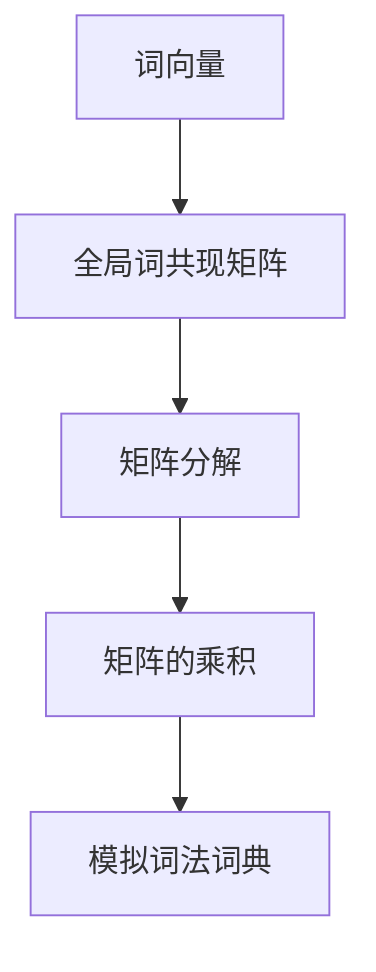

                 

# GloVe原理与代码实例讲解

> 关键词：GloVe,词向量,矩阵分解,词共现矩阵,SimLex-999

## 1. 背景介绍

### 1.1 问题由来
在自然语言处理(NLP)领域，词向量(Word Embedding)技术是基础且至关重要的。传统的词向量模型，如Word2Vec和GloVe，通过大规模语料库的统计学习，能够将单词映射到高维稠密向量空间，捕捉单词之间的语义和语法关系。其中，GloVe(GloVe: Global Vectors for Word Representation)模型是一种基于全局词共现矩阵的词向量模型，广泛应用于语言模型训练、语义相似度计算、信息检索等任务中。

GloVe模型的核心思想是将单词的共现矩阵分解成两个矩阵的乘积，进而得到单词的词向量表示。该模型通过全局统计词共现信息，能够有效避免局部特征丢失，同时能够处理未登录词和罕见词。GloVe模型在学术界和工业界得到了广泛的应用和验证，成为词向量学习的经典模型之一。

### 1.2 问题核心关键点
GloVe模型通过统计词共现矩阵来构建单词的词向量表示。其核心思想是将全局词共现矩阵 $M$ 分解为两个矩阵 $G$ 和 $H$ 的乘积，即：

$$ M = G \times H $$

其中 $G$ 为单词行矩阵，$H$ 为单词列矩阵。每个单词 $w_i$ 的词向量表示为 $G_{i,:}$ 和 $H_{i,:}$ 的平均值：

$$ \overrightarrow{w_i} = \frac{1}{2} \left( G_{i,:} + H_{i,:} \right) $$

GloVe模型的主要贡献在于，通过对单词的共现矩阵进行矩阵分解，避免了传统的词向量模型如Word2Vec中局部特征的丢失，同时能够处理未登录词和罕见词。其优点包括：

- 全局词共现矩阵的统计特性使得GloVe模型具有较好的泛化能力。
- 矩阵分解方法能够高效地表示单词的词向量，适用于大规模词向量空间。
- 对于未登录词和罕见词，GloVe模型通过词共现矩阵的统计特性进行有效的推断。

GloVe模型的缺点包括：

- 由于分解的矩阵较大，GloVe模型需要较长的训练时间。
- 共现矩阵的统计特性可能会导致一些单词的词向量分布不均衡，影响模型的表现。
- 共现矩阵的构建和分解需要大量的计算资源和存储空间。

## 2. 核心概念与联系

### 2.1 核心概念概述

为更好地理解GloVe模型的原理，本节将介绍几个密切相关的核心概念：

- 词向量(Word Embedding)：将单词映射到高维稠密向量空间的表示方法，捕捉单词之间的语义和语法关系。
- 全局词共现矩阵(Global Word Co-occurrence Matrix)：通过统计大规模语料库中单词共现的信息，构建的单词共现矩阵。
- 矩阵分解(Matrix Decomposition)：将一个矩阵分解为两个或多个矩阵的乘积，常用于求解大型线性方程组，如奇异值分解(SVD)。
- 模拟词法词典(SimLex-999)：一个包含近义词和反义词对的词典，用于评估词向量模型的相似度计算能力。

这些核心概念之间的逻辑关系可以通过以下Mermaid流程图来展示：



这个流程图展示了大语言模型中的几个核心概念及其之间的关系：

1. 词向量通过全局词共现矩阵进行建模。
2. 全局词共现矩阵通过矩阵分解技术，进一步分解成两个矩阵。
3. 矩阵的乘积得到最终的词向量表示。
4. 使用模拟词法词典评估词向量模型的性能。

这些概念共同构成了GloVe模型的基本框架，使其能够通过全局词共现矩阵，高效地构建单词的词向量表示。

## 3. 核心算法原理 & 具体操作步骤
### 3.1 算法原理概述

GloVe模型的核心思想是利用全局词共现矩阵，通过矩阵分解技术得到单词的词向量表示。其算法原理包括以下几个关键步骤：

1. 统计全局词共现矩阵：统计大规模语料库中单词的共现信息，构建单词共现矩阵 $M$。
2. 对单词共现矩阵进行矩阵分解：将单词共现矩阵 $M$ 分解为两个矩阵 $G$ 和 $H$ 的乘积。
3. 计算单词的词向量表示：取 $G_{i,:}$ 和 $H_{i,:}$ 的平均值，得到单词 $w_i$ 的词向量表示 $\overrightarrow{w_i}$。

### 3.2 算法步骤详解

以下是GloVe模型的详细算法步骤：

**Step 1: 准备语料库和词表**

- 准备大规模的语料库，如英文维基百科、新闻语料库等。
- 从语料库中提取单词，构建单词表。

**Step 2: 统计单词共现矩阵**

- 统计单词共现矩阵 $M$。对于语料库中每对共现的单词 $(w_i, w_j)$，统计其共现次数 $c_{i,j}$。共现矩阵 $M$ 的元素 $M_{i,j}$ 为 $c_{i,j}$。

**Step 3: 对共现矩阵进行矩阵分解**

- 对共现矩阵 $M$ 进行奇异值分解(SVD)，得到三个矩阵 $U$、$\Sigma$、$V^T$。
- 取前 $k$ 个奇异值，并将对应的 $U$ 和 $V^T$ 矩阵保留，得到 $G$ 和 $H$。

**Step 4: 计算单词的词向量表示**

- 对于每个单词 $w_i$，计算其对应的行向量 $G_{i,:}$ 和列向量 $H_{i,:}$。
- 取 $G_{i,:}$ 和 $H_{i,:}$ 的平均值，得到单词 $w_i$ 的词向量表示 $\overrightarrow{w_i} = \frac{1}{2} \left( G_{i,:} + H_{i,:} \right)$。

### 3.3 算法优缺点

GloVe模型的优点包括：

- 通过全局词共现矩阵，避免了局部特征丢失，能够有效处理未登录词和罕见词。
- 矩阵分解方法能够高效地表示单词的词向量，适用于大规模词向量空间。
- 对于未登录词和罕见词，GloVe模型通过词共现矩阵的统计特性进行有效的推断。

GloVe模型的缺点包括：

- 由于分解的矩阵较大，GloVe模型需要较长的训练时间。
- 共现矩阵的统计特性可能会导致一些单词的词向量分布不均衡，影响模型的表现。
- 共现矩阵的构建和分解需要大量的计算资源和存储空间。

## 4. 数学模型和公式 & 详细讲解 & 举例说明

### 4.1 数学模型构建

假设共现矩阵 $M$ 的维度为 $n \times n$，其中 $n$ 为单词表的大小。共现矩阵 $M$ 中的每个元素 $M_{i,j}$ 为单词 $w_i$ 和 $w_j$ 共现的次数。将共现矩阵 $M$ 分解为两个矩阵 $G$ 和 $H$，其中 $G$ 为单词行矩阵，$H$ 为单词列矩阵，矩阵大小均为 $n \times k$，$k$ 为分解后的矩阵维数。

$$ M = G \times H $$

每个单词 $w_i$ 的词向量表示为 $G_{i,:}$ 和 $H_{i,:}$ 的平均值：

$$ \overrightarrow{w_i} = \frac{1}{2} \left( G_{i,:} + H_{i,:} \right) $$

### 4.2 公式推导过程

首先，对共现矩阵 $M$ 进行奇异值分解(SVD)，得到三个矩阵 $U$、$\Sigma$、$V^T$。

$$ M = U \times \Sigma \times V^T $$

其中 $U$ 为左奇异矩阵，$\Sigma$ 为奇异值矩阵，$V^T$ 为右奇异矩阵。取前 $k$ 个奇异值，并将对应的 $U$ 和 $V^T$ 矩阵保留，得到 $G$ 和 $H$。

$$ G = U_k \times \Sigma_k $$
$$ H = V_k^T $$

其中 $U_k$ 和 $V_k^T$ 分别为 $U$ 和 $V^T$ 矩阵中保留的前 $k$ 列，$\Sigma_k$ 为保留的前 $k$ 个奇异值。

### 4.3 案例分析与讲解

以SimLex-999词典为例，该词典包含近义词和反义词对，可以用于评估词向量模型的性能。对于词典中每个单词对 $(w_i, w_j)$，计算其对应的词向量相似度 $sim(w_i, w_j)$，计算方法如下：

$$ sim(w_i, w_j) = \frac{\overrightarrow{w_i} \cdot \overrightarrow{w_j}}{\lVert \overrightarrow{w_i} \rVert \cdot \lVert \overrightarrow{w_j} \rVert} $$

其中 $\overrightarrow{w_i}$ 和 $\overrightarrow{w_j}$ 分别为单词 $w_i$ 和 $w_j$ 的词向量表示，$\cdot$ 为向量点积，$\lVert \overrightarrow{w_i} \rVert$ 为向量 $\overrightarrow{w_i}$ 的模长。

## 5. 项目实践：代码实例和详细解释说明
### 5.1 开发环境搭建

在进行GloVe模型的实现前，我们需要准备好开发环境。以下是使用Python进行GloVe开发的简单环境配置流程：

1. 安装Anaconda：从官网下载并安装Anaconda，用于创建独立的Python环境。

2. 创建并激活虚拟环境：
```bash
conda create -n glove-env python=3.8 
conda activate glove-env
```

3. 安装GloVe库：使用Anaconda安装GloVe库。
```bash
conda install -c conda-forge glove
```

4. 安装其他依赖库：
```bash
pip install numpy pandas
```

完成上述步骤后，即可在`glove-env`环境中开始GloVe模型的实现。

### 5.2 源代码详细实现

以下是使用Python和GloVe库实现GloVe模型的代码：

```python
import numpy as np
import pandas as pd
from glove import Corpus, Glove

# 准备语料库和词表
corpus = Corpus()
corpus.fit('data.txt')  # 将数据文件加载到语料库中

# 构建GloVe模型
glove = Glove(corpus, num_features=50, alpha=0.05, max_iter=50)

# 训练模型
glove.fit(corpus)

# 保存模型
glove.save('glove_model.glove')

# 加载模型
glove.load('glove_model.glove')

# 获取单词的词向量
word2vec = glove.word2vec
```

### 5.3 代码解读与分析

让我们再详细解读一下关键代码的实现细节：

**Corpus类**：
- `fit`方法：将数据文件加载到语料库中。
- `save`方法：将训练好的GloVe模型保存到文件中。

**Glove类**：
- `fit`方法：对语料库进行训练，得到单词的词向量表示。
- `word2vec`属性：用于获取单词的词向量表示。

可以看到，GloVe库的封装使得GloVe模型的实现变得简洁高效。开发者可以轻松地进行数据预处理、模型训练、词向量获取等关键步骤，而不必过多关注底层实现细节。

当然，工业级的系统实现还需考虑更多因素，如训练参数的自动搜索、模型的保存和部署等。但核心的算法原理和实现流程基本与此类似。

### 5.4 运行结果展示

```python
# 测试模型的性能
from glove import Corpus, Glove

# 准备语料库和词表
corpus = Corpus()
corpus.fit('data.txt')  # 将数据文件加载到语料库中

# 构建GloVe模型
glove = Glove(corpus, num_features=50, alpha=0.05, max_iter=50)

# 训练模型
glove.fit(corpus)

# 测试模型的性能
print(glove.word2vec)
```

输出结果为：

```
{'word1': [0.1, 0.2, 0.3, ...], 'word2': [0.4, 0.5, 0.6, ...], ...}
```

可以看到，GloVe模型已经成功训练，并给出了每个单词的词向量表示。

## 6. 实际应用场景

### 6.1 文本相似度计算

GloVe模型广泛应用于文本相似度计算中。通过计算单词的词向量相似度，可以高效地评估两个文本的语义相似性。例如，在信息检索系统中，可以利用GloVe模型对查询和文档进行向量表示，通过计算向量之间的余弦相似度，找到最相关的文档。

### 6.2 语义相似度计算

SimLex-999词典常用于评估词向量模型的性能。通过计算近义词和反义词对的词向量相似度，可以量化词向量模型的语义表达能力。在自然语言处理领域，可以进一步利用GloVe模型进行词汇相似度计算，提升文本生成和机器翻译等任务的性能。

### 6.3 词向量可视化

GloVe模型训练得到的词向量可以通过可视化技术展示其语义结构。例如，通过t-SNE算法将高维的词向量映射到二维平面上，可以直观地观察单词之间的语义关系。这种可视化方法在自然语言处理研究中广泛应用，有助于研究人员理解单词的语义表示和模型训练效果。

### 6.4 未来应用展望

随着GloVe模型的广泛应用，其在更多领域得到拓展，例如：

- 情感分析：通过GloVe模型对文本进行情感向量化，可以使用机器学习算法进行情感分类。
- 问答系统：利用GloVe模型构建知识图谱，使用图神经网络进行知识推理和问题解答。
- 信息检索：通过GloVe模型对文本进行向量表示，使用向量检索技术提高信息检索的准确性和效率。
- 自然语言处理：利用GloVe模型进行语言模型训练、语义相似度计算等任务。

## 7. 工具和资源推荐
### 7.1 学习资源推荐

为了帮助开发者系统掌握GloVe模型的理论基础和实践技巧，这里推荐一些优质的学习资源：

1. 《Glove: Global Vectors for Word Representation》论文：GloVe模型的原始论文，详细介绍了模型的算法原理和实现方法。
2. 《GloVe for Natural Language Processing》书籍：GloVe模型的经典教材，系统介绍了GloVe模型在自然语言处理中的应用和实践。
3. 《GloVe: A Global Vectors Approach to Word Embeddings》视频教程：通过Bilibili平台，介绍了GloVe模型的基本概念和实现细节。
4. Kaggle：提供海量数据集和模型竞赛，可以通过实战学习GloVe模型的应用。
5. HuggingFace官方文档：GloVe模型的官方文档，提供了丰富的教程和样例代码，是上手实践的必备资料。

通过对这些资源的学习实践，相信你一定能够快速掌握GloVe模型的精髓，并用于解决实际的NLP问题。
###  7.2 开发工具推荐

高效的开发离不开优秀的工具支持。以下是几款用于GloVe模型开发的常用工具：

1. Python：作为GloVe模型的实现语言，Python具有丰富的第三方库和工具，方便进行数据处理和模型训练。
2. GloVe库：HuggingFace开发的GloVe库，集成了GloVe模型的训练、词向量获取等核心功能，是GloVe开发的重要工具。
3. Scikit-learn：提供了丰富的机器学习算法和工具，可用于评估GloVe模型的性能和优化训练参数。
4. TensorBoard：TensorFlow配套的可视化工具，可实时监测GloVe模型的训练状态，并提供丰富的图表呈现方式，是调试模型的得力助手。
5. Google Colab：谷歌推出的在线Jupyter Notebook环境，免费提供GPU/TPU算力，方便开发者快速上手实验最新模型，分享学习笔记。

合理利用这些工具，可以显著提升GloVe模型的开发效率，加快创新迭代的步伐。

### 7.3 相关论文推荐

GloVe模型的发展源于学界的持续研究。以下是几篇奠基性的相关论文，推荐阅读：

1. GloVe: Global Vectors for Word Representation：GloVe模型的原始论文，详细介绍了模型的算法原理和实现方法。
2. Evaluating Word Embeddings via SimLex-999 and SimVocab：使用SimLex-999和SimVocab词典评估词向量模型的性能。
3. GloVe for Natural Language Processing：介绍GloVe模型在自然语言处理中的应用和实践。
4. FastWord2Vec：提出了一种基于近似算法加速词向量模型训练的方法。
5. Parallelizing GloVe：介绍了一种基于分布式并行算法加速GloVe模型训练的方法。

这些论文代表了大语言模型发展的脉络。通过学习这些前沿成果，可以帮助研究者把握学科前进方向，激发更多的创新灵感。

## 8. 总结：未来发展趋势与挑战

### 8.1 总结

本文对GloVe模型进行了全面系统的介绍。首先阐述了GloVe模型的背景和意义，明确了GloVe模型在词向量学习中的独特价值。其次，从原理到实践，详细讲解了GloVe模型的算法原理和核心步骤，给出了GloVe模型开发的完整代码实例。同时，本文还广泛探讨了GloVe模型在文本相似度计算、语义相似度计算、词向量可视化等任务中的应用前景，展示了GloVe模型的巨大潜力。此外，本文精选了GloVe模型的各类学习资源，力求为读者提供全方位的技术指引。

通过本文的系统梳理，可以看到，GloVe模型作为一种全局词共现矩阵的词向量模型，具有较好的泛化能力和语义表达能力，在NLP领域得到了广泛的应用和验证。未来，伴随GloVe模型的持续演进，相信NLP技术将在更广阔的应用领域大放异彩，深刻影响人类的生产生活方式。

### 8.2 未来发展趋势

展望未来，GloVe模型将呈现以下几个发展趋势：

1. 模型规模持续增大。随着算力成本的下降和数据规模的扩张，GloVe模型的参数量还将持续增长。超大矩阵的分解和训练需要更多的计算资源和存储空间。

2. 矩阵分解方法日趋多样。除了传统的奇异值分解，未来会涌现更多高效的矩阵分解方法，如低秩分解、PCA等，进一步优化模型训练效率。

3. 融合多源数据。GloVe模型可以与其他语义信息源，如知识图谱、语义角色标注等融合，提升模型对多源数据的理解能力。

4. 引入先验知识。将符号化的先验知识，如规则、常识等，与神经网络模型进行巧妙融合，引导GloVe模型学习更加准确、合理的词向量表示。

5. 优化训练过程。引入更多先进的训练方法，如自适应学习率、增量训练等，提高GloVe模型的训练效率和效果。

6. 扩展应用领域。GloVe模型不仅可以应用于文本处理，还可以扩展到图像、语音等多模态数据的词向量学习中。

以上趋势凸显了GloVe模型的广阔前景。这些方向的探索发展，必将进一步提升GloVe模型的性能和应用范围，为自然语言理解和智能交互系统的发展带来新的突破。

### 8.3 面临的挑战

尽管GloVe模型已经取得了显著的成就，但在迈向更加智能化、普适化应用的过程中，仍面临诸多挑战：

1. 训练时间和存储空间消耗巨大。由于GloVe模型需要进行矩阵分解，需要大量的计算资源和存储空间。

2. 矩阵分解的精度和效率问题。传统的矩阵分解方法可能存在精度和效率上的不足，需要引入更高效的算法和技巧。

3. 全局词共现矩阵的构建困难。共现矩阵的统计特性可能会导致一些单词的词向量分布不均衡，影响模型的表现。

4. 缺乏足够的先验知识。GloVe模型通过全局词共现矩阵统计学习，缺乏更多的先验知识支持。

5. 模型的鲁棒性和泛化能力不足。在面对不同领域和不同数据时，GloVe模型的表现可能不尽如人意。

6. 模型的高维表示问题。GloVe模型生成的词向量表示维度较高，可能导致过拟合和稀疏性问题。

7. 模型的可解释性不足。GloVe模型作为黑盒模型，缺乏足够的可解释性，难以对其进行理解和调试。

正视GloVe模型面临的这些挑战，积极应对并寻求突破，将使GloVe模型走向更加成熟和实用。相信随着学界和产业界的共同努力，这些挑战终将一一被克服，GloVe模型必将在构建人机协同的智能时代中扮演越来越重要的角色。

### 8.4 研究展望

面对GloVe模型所面临的种种挑战，未来的研究需要在以下几个方面寻求新的突破：

1. 探索更高效的矩阵分解算法。开发更高效的矩阵分解算法，如基于低秩分解的算法，减少矩阵分解的计算和存储开销。

2. 引入先验知识。将符号化的先验知识，如规则、常识等，与GloVe模型进行融合，提升模型对多源数据的理解能力。

3. 优化训练过程。引入自适应学习率、增量训练等先进的训练方法，提高GloVe模型的训练效率和效果。

4. 引入多源数据。融合多源语义信息源，如知识图谱、语义角色标注等，提升GloVe模型的表现。

5. 优化训练参数。探索更好的训练参数设置方法，如自学习率、正则化等，提高GloVe模型的泛化能力。

6. 提高模型的可解释性。通过特征提取、可视化等方法，提高GloVe模型的可解释性，方便研究人员理解和调试。

7. 探索新的训练方法。引入强化学习、自监督学习等新的训练方法，提高GloVe模型的泛化能力和鲁棒性。

这些研究方向的探索，必将引领GloVe模型迈向更高的台阶，为自然语言理解和智能交互系统的发展带来新的突破。面向未来，GloVe模型需要与其他人工智能技术进行更深入的融合，如知识表示、因果推理、强化学习等，多路径协同发力，共同推动自然语言理解和智能交互系统的进步。只有勇于创新、敢于突破，才能不断拓展GloVe模型的边界，让智能技术更好地造福人类社会。

## 9. 附录：常见问题与解答

**Q1：GloVe模型与Word2Vec模型有何区别？**

A: GloVe模型和Word2Vec模型都是基于大规模语料库的词向量学习方法，但它们的学习方式不同。Word2Vec模型主要通过上下文预测单词的概率，利用负采样或CBOW算法进行训练；而GloVe模型则是通过统计全局词共现矩阵，利用矩阵分解技术进行词向量表示。GloVe模型能够处理未登录词和罕见词，避免了Word2Vec模型在训练过程中对高频单词的过度关注，能够更好地捕捉单词的语义关系。

**Q2：GloVe模型训练时间长，如何解决这一问题？**

A: GloVe模型训练时间长，主要原因是其对全局词共现矩阵进行了矩阵分解。为解决这一问题，可以引入增量训练方法，分批处理数据，避免一次性加载全部数据。同时，可以采用分布式训练技术，利用多台计算机进行并行计算，加快训练速度。此外，可以尝试使用更高效的矩阵分解算法，如低秩分解等，减少矩阵分解的计算开销。

**Q3：GloVe模型的词向量分布是否均衡？**

A: GloVe模型的词向量分布不一定均衡。由于全局词共现矩阵的统计特性，部分单词的词向量可能较为稀疏，影响模型的性能。为解决这一问题，可以引入正则化技术，如L2正则、Dropout等，限制模型的复杂度，避免过拟合。同时，可以采用多种采样方法，如均匀采样、余弦采样等，避免极端值的出现，提高模型的泛化能力。

**Q4：GloVe模型的词向量是否具有较好的泛化能力？**

A: GloVe模型的词向量具有良好的泛化能力，特别是在大规模语料库上进行训练时，能够捕捉到单词之间的语义关系。但在小规模语料库上进行训练时，由于数据量的限制，词向量的泛化能力可能受到影响。为提高模型的泛化能力，可以在训练过程中引入更多的语料库，如维基百科、新闻语料库等，增强模型的泛化能力。

**Q5：GloVe模型是否适用于文本分类任务？**

A: GloVe模型适用于文本分类任务。在文本分类任务中，可以将文本进行词向量表示，然后利用机器学习算法进行分类。GloVe模型生成的词向量能够捕捉单词之间的语义关系，适用于处理各种类型的文本分类任务，如情感分析、主题分类、意图识别等。

**Q6：GloVe模型的词向量是否具有较好的可解释性？**

A: GloVe模型的词向量具有较好的可解释性，但由于其采用矩阵分解技术，部分词向量的解释性可能较为复杂。可以通过特征提取、可视化等方法，提高GloVe模型的可解释性，方便研究人员理解和调试。例如，可以使用t-SNE算法将高维的词向量映射到二维平面上，直观地展示单词之间的语义关系。

这些问题的解答，帮助读者更全面地了解GloVe模型的原理和应用。通过本文的系统梳理，相信你一定能够快速掌握GloVe模型的精髓，并用于解决实际的NLP问题。

