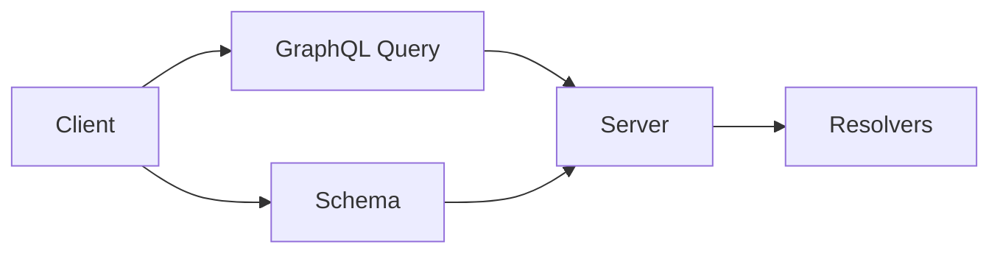

                 

## 1. 背景介绍

在现代互联网应用中，数据获取和处理常常是复杂多变的。传统的RESTful API以固定的资源路径和HTTP方法来定义接口，已经无法适应各种场景下的数据查询需求。为了解决这一问题，GraphQL作为一种灵活的查询语言应运而生。

GraphQL是一种由Facebook于2015年提出的新型API查询语言，其核心思想是根据客户端需求，灵活地返回数据，而不是像RESTful API一样固定返回所有字段。它采用了类似SQL的查询语言语法，允许开发者定义出自定义的数据模型，并能够通过单次请求获取复杂的数据结构。

## 2. 核心概念与联系

### 2.1 核心概念概述

为了更好地理解GraphQL的工作原理和优势，我们首先介绍几个关键的概念：

1. **Schema**：Schema是GraphQL的根对象，定义了数据类型和它们之间的关系。它是一个GraphQL语言中定义的Graph结构，包含了所有可用的查询和变异操作。

2. **Resolvers**：Resolvers是Schema的执行层，它们根据查询返回对应的数据。每一个Schema中的类型和字段都有一个对应的Resolver。

3. **Client**：客户端是GraphQL请求的发起方，它根据Schema定义的查询语言，构造请求，向Server发送。

4. **Server**：Server负责解析客户端请求，并根据Schema定义执行相应的操作，返回数据。

### 2.2 核心概念原理和架构的 Mermaid 流程图

以下是GraphQL的原理和架构的Mermaid流程图：



从图中我们可以看到，GraphQL的请求和响应过程主要由客户端、Schema、Server和Resolvers四个部分组成。客户端根据Schema定义的查询语言构造请求，Server解析这些请求，并调用Resolvers获取对应的数据。

## 3. 核心算法原理 & 具体操作步骤

### 3.1 算法原理概述

GraphQL的核心算法原理是围绕Schema和Resolvers展开的。Schema定义了可以查询的数据类型和关系，而Resolvers则根据Schema定义的数据模型，获取具体的数据。GraphQL的查询解析过程如下：

1. 客户端根据Schema定义的查询语言，构造GraphQL请求。
2. Server接收到请求后，解析查询语言，并根据Schema获取需要查询的数据类型和字段。
3. Server调用相应的Resolvers，获取具体的数据。
4. Server将获取到的数据进行聚合和包装，构造GraphQL响应。

这个过程可以概括为以下步骤：

1. 解析Schema和GraphQL查询。
2. 获取需要的数据类型和字段。
3. 调用Resolvers获取数据。
4. 构造响应数据。

### 3.2 算法步骤详解

以下是GraphQL的核心步骤：

**Step 1: 定义Schema**

Schema是GraphQL的核心，它定义了可以查询的数据类型和关系。Schema通常包括类型定义、查询和变异定义、子类型和接口、字段定义等。

```graphql
type Query {
  user(id: ID!): User
  users: [User]
}

type User {
  id: ID!
  name: String!
  email: String!
  posts: [Post]
}

type Post {
  id: ID!
  title: String!
  body: String!
}
```

在上面的Schema中，我们定义了三个类型：Query、User和Post。其中Query类型包含两个字段：user和users。用户类型包含id、name和email三个字段，并有一个posts字段。Post类型包含id、title和body三个字段。

**Step 2: 编写Resolvers**

Resolvers是Schema的执行层，它们根据查询返回对应的数据。每一个Schema中的类型和字段都有一个对应的Resolver。

```js
const root = {
  Query: {
    user: (parent, args, context, info) => {
      const { id } = args;
      return getUserById(id);
    },
    users: () => {
      return getUsers();
    }
  },
  User: {
    posts: (parent) => {
      const { id } = parent;
      return getPostsByUserId(id);
    }
  },
  Post: {}
}
```

在上面的Resolvers中，我们编写了三个函数：getUserById、getUsers和getPostsByUserId。它们分别对应Schema中的user、users和posts字段。

**Step 3: 创建GraphQL Server**

创建GraphQL Server需要使用GraphQL库，并根据Schema和Resolvers来定义Server。

```js
const { graphqlHTTP } = require('express-graphql');
const schema = makeExecutableSchema({
  typeDefs: typeDefs,
  resolvers: root
});
const server = express();
server.use('/graphql', graphqlHTTP({
  schema: schema,
  graphiql: true
}));
server.listen(3000, () => console.log('Server is running on http://localhost:3000/graphql'));
```

在上面的代码中，我们创建了一个GraphQL Server，并使用`graphqlHTTP`中间件来处理GraphQL请求。`schema`参数传入我们已经定义的Schema，`graphiql`参数设置为`true`表示开启GraphiQL界面，方便我们调试。

**Step 4: 测试GraphQL请求**

我们可以通过GraphiQL界面来测试GraphQL请求。GraphiQL是一个前端界面，它允许我们编写和测试GraphQL查询。

在GraphiQL界面中，我们可以编写以下查询：

```graphql
query {
  users {
    id
    name
    email
  }
}
```

这个查询会返回所有用户的信息。

### 3.3 算法优缺点

GraphQL作为一种新型API查询语言，有以下优点和缺点：

#### 优点：

1. **灵活性高**：GraphQL允许客户端根据需求获取具体的字段，避免了传统API固定返回所有字段的问题。

2. **性能高**：GraphQL采用按需返回数据，减少了不必要的数据传输，提高了性能。

3. **易于扩展**：Schema和Resolvers的独立定义使得GraphQL易于扩展和维护。

4. **支持多种数据源**：GraphQL可以连接多种数据源，如数据库、API等，提供一站式解决方案。

#### 缺点：

1. **学习曲线陡峭**：GraphQL的语法和概念比传统API复杂，需要花费更多时间学习和理解。

2. **缓存问题**：GraphQL的按需返回数据方式使得缓存难以设计，增加了实现难度。

3. **安全性问题**：GraphQL的灵活性也带来了安全问题，需要额外考虑查询注入等问题。

### 3.4 算法应用领域

GraphQL作为一种灵活的API查询语言，可以应用于各种场景下的数据查询，包括但不限于：

1. **Web应用**：GraphQL可以用于前端数据获取，提高Web应用的灵活性和性能。

2. **移动应用**：GraphQL可以用于移动应用的数据获取，提高移动应用的性能和用户体验。

3. **微服务架构**：GraphQL可以用于连接微服务架构中的各个服务，提供统一的查询接口。

4. **API网关**：GraphQL可以用于API网关的数据聚合和处理，提供一站式API解决方案。

## 4. 数学模型和公式 & 详细讲解 & 举例说明

### 4.1 数学模型构建

GraphQL的查询和响应过程可以看作是一个数学模型，其核心是Schema和Resolvers的组合。Schema定义了可以查询的数据类型和关系，而Resolvers则根据Schema定义的数据模型，获取具体的数据。

### 4.2 公式推导过程

GraphQL的查询解析过程可以表示为一个有向图，其中节点表示Schema中的类型和字段，边表示查询路径。查询解析过程可以通过遍历这个图来实现。

假设查询路径为`users { name }`，它的查询图如下：

```
users -> users.name
```

在查询图中，`users`节点表示`User`类型，`name`节点表示`User`类型中的`name`字段。查询路径表示客户端需要查询`users`类型中的`name`字段。

### 4.3 案例分析与讲解

假设我们有一个简单的GraphQL Schema和Resolvers：

```graphql
type User {
  id: ID!
  name: String!
  email: String!
  posts: [Post]
}

type Post {
  id: ID!
  title: String!
  body: String!
}

type Query {
  user(id: ID!): User
  users: [User]
}

const root = {
  Query: {
    user: (parent, args, context, info) => {
      const { id } = args;
      return getUserById(id);
    },
    users: () => {
      return getUsers();
    }
  },
  User: {
    posts: (parent) => {
      const { id } = parent;
      return getPostsByUserId(id);
    }
  },
  Post: {}
}
```

查询路径为`users { name }`的查询解析过程如下：

1. 解析Schema：找到`User`类型，包含`name`字段。

2. 解析字段：找到`User`类型的`name`字段。

3. 调用Resolver：根据`name`字段的Resolver，调用`getUserById`函数。

4. 构造响应：将获取到的用户信息返回给客户端。

## 5. 项目实践：代码实例和详细解释说明

### 5.1 开发环境搭建

为了搭建GraphQL Server，我们需要以下环境：

- Node.js 14.x及以上版本
- Express 4.17.1及以上版本
- Apollo Server 2.6.2及以上版本
- TypeGraphQL 0.14.3及以上版本
- GraphQL 0.16.7及以上版本

### 5.2 源代码详细实现

以下是GraphQL Server的实现代码：

```js
const { ApolloServer, gql } = require('apollo-server-express');
const typeDefs = gql`
  type User {
    id: ID!
    name: String!
    email: String!
    posts: [Post]
  }

  type Post {
    id: ID!
    title: String!
    body: String!
  }

  type Query {
    user(id: ID!): User
    users: [User]
  }

  type Mutation {
    addUser(name: String!, email: String!, posts: [Post]): User
  }
`;

const root = {
  Query: {
    user: (parent, args, context, info) => {
      const { id } = args;
      return getUserById(id);
    },
    users: () => {
      return getUsers();
    }
  },
  User: {
    posts: (parent) => {
      const { id } = parent;
      return getPostsByUserId(id);
    }
  },
  Post: {},
  Mutation: {
    addUser: (parent, args, context, info) => {
      const { name, email, posts } = args;
      const user = createNewUser(name, email, posts);
      return user;
    }
  }
};

const server = new ApolloServer({
  typeDefs,
  resolvers: root,
  context: ({ req }) => ({ userId: req.headers['x-user-id'] })
});
server.applyMiddleware({ app: express() });

server.listen({ port: 4000 }, () => console.log(`Server is running on http://localhost:4000`));
```

在上面的代码中，我们定义了GraphQL Schema和Resolvers，并使用Apollo Server来创建GraphQL Server。我们定义了两个查询：`user`和`users`，以及一个变异：`addUser`。查询`user`和`users`分别返回单个用户和用户列表，变异`addUser`用于创建新用户。

### 5.3 代码解读与分析

1. **typeDefs**：定义了Schema中所有的类型和查询、变异。

2. **root**：定义了Schema中的Resolvers，实现了查询和变异的业务逻辑。

3. **ApolloServer**：创建了GraphQL Server，并使用`applyMiddleware`方法将其挂载到Express应用中。

4. **getUsers、getUserById、getPostsByUserId**：实现了Resolvers中的业务逻辑。

### 5.4 运行结果展示

运行上述代码，可以在浏览器中访问`http://localhost:4000/graphql`，使用GraphiQL界面来测试GraphQL请求。

## 6. 实际应用场景

GraphQL作为一种灵活的API查询语言，已经被广泛应用于各种场景下的数据获取和处理。以下是几个实际应用场景：

### 6.1 前端数据获取

在前端开发中，GraphQL可以用于数据获取。相比于传统的RESTful API，GraphQL允许前端根据需求获取具体的数据字段，避免了数据传输过剩的问题。

例如，一个电子商务网站可以使用GraphQL来获取商品信息。前端可以指定需要获取的商品ID和字段，服务器返回对应的商品信息，避免了传统API返回所有商品信息的问题。

### 6.2 移动应用数据获取

在移动应用中，GraphQL可以用于数据获取。相比于传统的RESTful API，GraphQL允许移动应用根据需求获取具体的数据字段，避免了数据传输过剩的问题。

例如，一个社交媒体应用可以使用GraphQL来获取用户信息。用户可以根据需求获取用户ID、名称、头像等信息，服务器返回对应的用户信息，避免了传统API返回所有用户信息的问题。

### 6.3 微服务架构数据获取

在微服务架构中，GraphQL可以用于连接各个微服务。相比于传统的RESTful API，GraphQL允许微服务之间通过统一的查询接口获取数据，避免了数据传输过剩的问题。

例如，一个电商应用可以使用GraphQL来连接购物车、订单、支付等微服务。各个微服务可以通过GraphQL获取所需的数据，避免了传统API返回所有微服务数据的问题。

## 7. 工具和资源推荐

### 7.1 学习资源推荐

为了帮助开发者系统掌握GraphQL的理论基础和实践技巧，这里推荐一些优质的学习资源：

1. **GraphQL官方文档**：GraphQL官方文档详细介绍了GraphQL的语法和概念，是学习GraphQL的最佳资料。

2. **GraphQL教程**：《GraphQL教程》是一本详细介绍GraphQL的书籍，适合初学者和进阶者学习。

3. **Apollo Server官方文档**：Apollo Server是GraphQL Server的实现，其官方文档详细介绍了Apollo Server的用法和最佳实践。

4. **TypeGraphQL官方文档**：TypeGraphQL是一个基于TypeScript的GraphQL库，其官方文档详细介绍了TypeGraphQL的用法和最佳实践。

5. **GraphiQL官方文档**：GraphiQL是一个GraphQL查询调试工具，其官方文档详细介绍了GraphiQL的用法和最佳实践。

通过这些资源的学习实践，相信你一定能够快速掌握GraphQL的理论基础和实践技巧，并用于解决实际的GraphQL问题。

### 7.2 开发工具推荐

为了提高GraphQL开发效率，以下是几款常用的开发工具：

1. **Visual Studio Code**：Visual Studio Code是一个轻量级且功能强大的IDE，支持GraphQL的语法高亮和代码补全，是GraphQL开发的首选工具。

2. **GraphiQL**：GraphiQL是一个GraphQL查询调试工具，可以在浏览器中测试GraphQL查询，方便调试和验证。

3. **Apollo Studio**：Apollo Studio是一个GraphQL管理平台，支持Schema、Resolvers、数据库、缓存等管理功能，适合团队协作开发。

4. **GraphQL IDEs**：GraphQL IDEs是一组GraphQL相关的IDE插件，支持GraphQL的语法高亮和代码补全，提高了GraphQL开发效率。

### 7.3 相关论文推荐

GraphQL作为一种新型API查询语言，其理论和实践还在不断演进。以下是几篇奠基性的相关论文，推荐阅读：

1. **The GraphQL Query Language**：这篇文章是GraphQL的原始论文，介绍了GraphQL的核心思想和设计理念。

2. **GraphQL: A Next-Generation Client/Server API**：这篇文章是GraphQL的进阶论文，介绍了GraphQL的语法和应用场景。

3. **GraphQL Resolvers: A Tutorial**：这篇文章介绍了GraphQL Resolvers的实现方法，适合初学者学习。

4. **GraphQL with Express and TypeGraphQL**：这篇文章介绍了使用TypeGraphQL和Express实现GraphQL Server的方法，适合进阶者学习。

这些论文代表了GraphQL的理论和实践演进，通过学习这些前沿成果，可以帮助研究者把握GraphQL的发展方向，激发更多的创新灵感。

## 8. 总结：未来发展趋势与挑战

### 8.1 总结

本文对GraphQL作为一种新型API查询语言进行了全面系统的介绍。首先阐述了GraphQL的核心思想和优势，明确了GraphQL在现代互联网应用中的重要性和应用前景。其次，从原理到实践，详细讲解了GraphQL的Schema、Resolvers和GraphQL请求解析过程，给出了GraphQL服务器实现的完整代码实例。同时，本文还广泛探讨了GraphQL在Web应用、移动应用、微服务架构等多个行业领域的应用前景，展示了GraphQL的广泛适用性和强大功能。

通过本文的系统梳理，可以看到，GraphQL作为一种灵活的API查询语言，极大地提高了数据获取和处理的灵活性和效率，带来了显著的性能提升和用户体验改善。未来，伴随GraphQL技术的不断演进，相信GraphQL将在更多场景下得到广泛应用，为现代互联网应用带来更多的创新和突破。

### 8.2 未来发展趋势

展望未来，GraphQL作为一种新型API查询语言，将呈现以下几个发展趋势：

1. **更加广泛的应用场景**：GraphQL不仅在前端和移动应用中得到广泛应用，还在微服务架构、API网关等多个场景中发挥重要作用。

2. **更加丰富的功能和扩展**：随着GraphQL技术的不断演进，将会出现更多的功能和扩展，如GraphQL Subscriptions、GraphQL Playground等，进一步增强GraphQL的功能。

3. **更加便捷的使用体验**：GraphQL的使用体验将更加便捷，更加易于上手和维护。

4. **更加高效的数据处理**：GraphQL将提供更加高效的数据处理方案，减少不必要的数据传输，提高性能。

5. **更加完善的生态系统**：GraphQL的生态系统将更加完善，包括更多的工具、插件、框架等，方便开发者使用。

6. **更加强大的安全性和可控性**：GraphQL的安全性和可控性将更加强大，避免查询注入等问题，提高系统的稳定性。

以上趋势凸显了GraphQL的广泛应用前景和未来发展潜力。这些方向的探索发展，必将进一步推动GraphQL技术的普及和应用，为现代互联网应用带来更多的创新和突破。

### 8.3 面临的挑战

尽管GraphQL作为一种新型API查询语言已经取得了不错的成绩，但在迈向更加智能化、普适化应用的过程中，它仍面临诸多挑战：

1. **学习曲线陡峭**：GraphQL的语法和概念比传统API复杂，需要花费更多时间学习和理解。

2. **缓存问题**：GraphQL的按需返回数据方式使得缓存设计复杂，增加了实现难度。

3. **安全性问题**：GraphQL的灵活性也带来了安全问题，需要额外考虑查询注入等问题。

4. **兼容性问题**：GraphQL与其他API查询语言存在兼容性问题，需要解决这些兼容性问题。

5. **生态系统问题**：GraphQL的生态系统还在不断完善，需要更多工具和插件的支持。

6. **性能问题**：GraphQL的按需返回数据方式可能导致性能瓶颈，需要优化解决。

7. **社区支持问题**：GraphQL社区仍在不断发展，需要更多的支持和关注。

这些挑战需要通过技术创新和社区协作来逐步解决，才能使GraphQL技术得到更广泛的应用。

### 8.4 研究展望

面向未来，GraphQL的研究需要从以下几个方面寻求新的突破：

1. **更加便捷的使用体验**：提高GraphQL的使用便捷性，使其更易于上手和维护。

2. **更加强大的安全性和可控性**：增强GraphQL的安全性和可控性，避免查询注入等问题，提高系统的稳定性。

3. **更加完善的数据模型设计**：提高GraphQL的数据模型设计能力，使其能够更好地适应各种场景下的数据获取和处理。

4. **更加高效的数据处理**：提高GraphQL的数据处理效率，减少不必要的数据传输，提高性能。

5. **更加广泛的生态系统**：增强GraphQL的生态系统，包括更多的工具、插件、框架等，方便开发者使用。

6. **更加完善的文档和教程**：提高GraphQL的文档和教程质量，帮助开发者更好地理解和使用GraphQL。

这些研究方向和突破将使GraphQL技术得到更广泛的应用，推动现代互联网应用的发展。

## 9. 附录：常见问题与解答

**Q1：GraphQL与RESTful API有什么区别？**

A: GraphQL与RESTful API的最大区别在于数据获取的方式。RESTful API固定返回所有字段，而GraphQL允许客户端根据需求获取具体的字段，避免了数据传输过剩的问题。GraphQL提供更加灵活的数据获取方式，能够适应复杂多变的需求。

**Q2：GraphQL适合哪些场景？**

A: GraphQL适合各种需要灵活数据获取的场景，包括Web应用、移动应用、微服务架构、API网关等。它尤其适合数据结构复杂、数据获取需求多样化的应用场景。

**Q3：如何提高GraphQL的性能？**

A: 提高GraphQL的性能可以从以下几个方面入手：

1. 优化查询路径：减少不必要的数据传输，提高性能。

2. 使用缓存：缓存查询结果，避免重复计算。

3. 使用批处理：将多个查询合并成一个请求，减少请求次数。

4. 使用分页：分页查询结果，减少不必要的数据传输。

5. 使用高效的查询语言：优化查询语言，提高查询效率。

**Q4：GraphQL的安全性问题如何解决？**

A: GraphQL的安全性问题可以通过以下措施解决：

1. 使用查询验证：验证查询是否合法，避免查询注入等问题。

2. 使用身份验证：对查询请求进行身份验证，确保请求来源合法。

3. 使用授权机制：对查询结果进行授权，确保查询结果符合权限要求。

4. 使用数据加密：对数据进行加密处理，提高数据安全性。

5. 使用缓存策略：缓存查询结果，避免重复计算。

通过这些措施，可以增强GraphQL的安全性和可控性，提高系统的稳定性。

**Q5：GraphQL的未来发展方向是什么？**

A: GraphQL的未来发展方向主要包括以下几个方面：

1. 更加广泛的应用场景：GraphQL将会在更多场景下得到应用，如Web应用、移动应用、微服务架构、API网关等。

2. 更加丰富的功能和扩展：GraphQL将会出现更多的功能和扩展，如GraphQL Subscriptions、GraphQL Playground等，进一步增强GraphQL的功能。

3. 更加便捷的使用体验：GraphQL的使用体验将更加便捷，更加易于上手和维护。

4. 更加高效的数据处理：GraphQL将提供更加高效的数据处理方案，减少不必要的数据传输，提高性能。

5. 更加完善的生态系统：GraphQL的生态系统将更加完善，包括更多的工具、插件、框架等，方便开发者使用。

6. 更加强大的安全性和可控性：GraphQL的安全性和可控性将更加强大，避免查询注入等问题，提高系统的稳定性。

这些方向将使GraphQL技术得到更广泛的应用，推动现代互联网应用的发展。

---

作者：禅与计算机程序设计艺术 / Zen and the Art of Computer Programming

