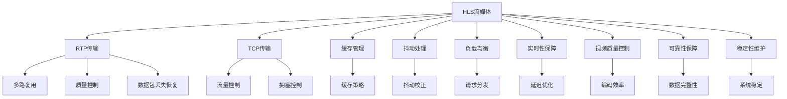

                 

# HLS流媒体服务器优化

> 关键词：HLS流媒体、服务器优化、实时传输协议(Real-Time Transport Protocol, RTP)、传输控制协议(Transmission Control Protocol, TCP)、传输数据包、带宽、抖动、缓存、负载均衡、实时性、视频质量、可靠性和稳定性

## 1. 背景介绍

### 1.1 问题由来
随着互联网和移动互联网的普及，视频内容成为用户获取信息、休闲娱乐的重要方式。流媒体技术的兴起，使得用户可以随时随地观看高清视频，极大地丰富了在线内容生态。HLS（HTTP Live Streaming）作为流媒体直播的主流协议之一，凭借其跨平台兼容性和易于缓存的特点，得到了广泛应用。

然而，HLS流媒体服务器在实际部署和运营中，面临着诸多挑战。服务器的响应速度、稳定性、实时性和视频质量等关键指标，直接影响了用户体验。尤其是在高并发、大流量场景下，HLS服务器的负载均衡、缓存管理和带宽分配等策略，需要进行精细化调优，以保障服务质量。

## 2. 核心概念与联系

### 2.1 核心概念概述

为更好地理解HLS流媒体服务器的优化方法，本节将介绍几个密切相关的核心概念：

- HLS流媒体（HTTP Live Streaming）：基于HTTP协议的流媒体传输方式，通过分段、合并、缓存等技术，实现高效、稳定的流媒体传输。
- 实时传输协议（Real-Time Transport Protocol, RTP）：用于数据报传输的实时协议，支持多路复用、质量控制等功能，与RTSP、RTMP等协议协同工作，构建流媒体应用。
- 传输控制协议（Transmission Control Protocol, TCP）：基于连接的可靠传输协议，适用于HLS中对传输数据包顺序和完整性有高要求的场景。
- 抖动（Jitter）：流媒体数据包传输顺序的随机变化，影响播放的流畅度和视频质量。
- 缓存（Buffering）：在HLS中，服务器端和客户端均需要缓存一定量的数据包，以应对网络延迟和突发流量，保障播放的连续性。
- 负载均衡（Load Balancing）：通过分散请求，实现服务器的均衡负载，避免单点瓶颈，提升系统的扩展性和可用性。
- 实时性（Latency）：流媒体传输中的延迟，直接关系到用户的观看体验。
- 视频质量（Quality of Video, QoV）：包括分辨率、帧率、编码效率等指标，影响用户的视觉体验。
- 可靠性（Reliability）：传输数据的完整性和准确性，与TCP等协议紧密相关。
- 稳定性（Stability）：系统在高并发和长时间运行中的性能表现，保障服务的高可用性。

这些核心概念之间的逻辑关系可以通过以下Mermaid流程图来展示：



这个流程图展示了大语言模型的核心概念及其之间的关系：

1. HLS流媒体通过RTP和TCP传输数据，利用缓存和抖动处理技术保障播放连续性。
2. 实时性、视频质量、可靠性、稳定性等关键指标相互关联，影响用户体验。
3. 负载均衡、流量控制、拥塞控制等策略，是保障系统高性能的基石。

这些概念共同构成了HLS流媒体服务器的优化框架，使其能够高效、稳定地服务用户。通过理解这些核心概念，我们可以更好地把握HLS流媒体服务器的优化方向。

## 3. 核心算法原理 & 具体操作步骤
### 3.1 算法原理概述

HLS流媒体服务器的优化，核心在于通过算法和策略，保障视频数据的高效传输和高质量播放。其核心思想是：利用现代网络协议和计算机架构，通过智能调度和管理，实现资源的有效利用，减少延迟、抖动和缓存等问题，提升服务质量和用户体验。

具体而言，HLS服务器优化算法包括：

- 流量控制算法：通过调整网络带宽，避免数据包丢失和网络拥塞。
- 抖动校正算法：通过平滑数据包传输，减少抖动对播放流畅度的影响。
- 缓存管理算法：通过智能缓存策略，提高播放的连续性和稳定性。
- 负载均衡算法：通过均衡分配请求，提升系统扩展性和可用性。
- 实时性优化算法：通过调整传输延迟，提升视频播放的实时性。
- 视频质量调整算法：通过自适应编码，在不同网络条件下提供最优的视频质量。
- 可靠性保障算法：通过TCP协议和重传机制，确保数据包的完整性和可靠性。

### 3.2 算法步骤详解

HLS流媒体服务器的优化过程，一般包括以下几个关键步骤：

**Step 1: 系统配置与监控**

- 选择合适的硬件和网络环境，保证服务器有足够的带宽和计算能力。
- 配置网络参数，如TCP缓冲区大小、RTP头部格式等。
- 安装流量监控工具，实时监测网络状况和服务器负载。

**Step 2: 流量控制算法**

- 分析网络状况，估算可用带宽和数据包丢失率。
- 根据估算结果，调整TCP窗口大小，控制发送速率。
- 引入拥塞控制机制，避免网络拥塞导致的数据包丢失。

**Step 3: 抖动校正算法**

- 监测数据包传输顺序，识别并标记丢失或重排序的数据包。
- 使用差值编码和内插算法，平滑数据包传输，减少抖动。
- 采用去抖动算法，如FIR滤波器、双线性插值等，进一步减少抖动影响。

**Step 4: 缓存管理算法**

- 在服务器端和客户端设置缓存区，预存一定量的数据包。
- 根据网络状况和播放需求，动态调整缓存策略，避免缓存溢出或不足。
- 引入缓存淘汰算法，如FIFO、LRU等，优化缓存使用效率。

**Step 5: 负载均衡算法**

- 根据请求的地理位置和流量大小，均衡分配到不同的服务器节点。
- 通过DNS轮询或负载均衡器，分散请求，避免单点故障。
- 实时监测服务器负载，动态调整资源分配，保障系统平衡。

**Step 6: 实时性优化算法**

- 调整传输延迟，使用RTP和TCP的协议机制，降低数据包发送延迟。
- 使用分段传输和合并技术，减少客户端的缓冲时间。
- 优化编码效率，减少视频编码时间和网络传输时间。

**Step 7: 视频质量调整算法**

- 根据网络带宽和客户端设备性能，自适应调整视频编码参数。
- 引入码率控制算法，动态调整编码速率，确保视频质量。
- 使用自适应比特率传输算法，根据网络状况动态调整码率。

**Step 8: 可靠性保障算法**

- 使用TCP协议进行可靠传输，确保数据包完整性和准确性。
- 引入数据包重传机制，对丢失的数据包进行自动重传。
- 使用前向纠错和冗余编码技术，提升数据包的鲁棒性。

以上是HLS流媒体服务器优化的完整算法步骤。在实际应用中，还需要针对具体场景进行优化设计，如改进流量控制算法，引入更智能的抖动校正技术，优化缓存管理策略等，以进一步提升服务质量。

### 3.3 算法优缺点

HLS流媒体服务器优化算法具有以下优点：

1. 提高视频传输的稳定性和流畅度：通过抖动校正和缓存管理，减少网络延迟和数据丢失，保障视频播放的连续性。
2. 提升系统负载均衡和扩展性：通过负载均衡和流量控制，分散请求，避免单点瓶颈，提升系统的可用性和扩展性。
3. 降低传输延迟和提升实时性：通过调整传输延迟和分段传输，提升视频播放的实时性和用户体验。
4. 优化视频质量和编码效率：通过自适应编码和码率控制，在不同网络条件下提供最优的视频质量，同时降低编码时间和网络传输时间。
5. 保障数据的完整性和可靠性：通过TCP协议和重传机制，确保数据包的完整性和可靠性。

然而，该方法也存在一些局限性：

1. 依赖网络环境：算法效果受网络环境影响较大，网络状况不佳时，优化效果可能打折扣。
2. 处理复杂度高：算法实现较为复杂，需要实时监测和动态调整，增加了系统实现的复杂性。
3. 难以保证最理想效果：尽管算法在大多数情况下能够提升服务质量，但在极端场景下，仍可能存在不足之处。

尽管存在这些局限性，但就目前而言，HLS流媒体服务器优化算法仍是目前的主流解决方案，广泛应用于各种视频流媒体应用中。未来相关研究的重点在于如何进一步降低算法对网络环境的依赖，提高算法的自适应性和鲁棒性，同时兼顾处理复杂度和优化效果。

### 3.4 算法应用领域

HLS流媒体服务器优化算法在视频流媒体应用中得到了广泛应用，涵盖了一系列典型场景，例如：

- 视频直播：包括新闻、体育、教育等直播节目，保障实时性和高质量播放。
- 视频点播：如在线视频平台、电影电视等，提供流畅的视频播放体验。
- 在线教育：通过直播和点播功能，支持师生互动，提供高质量的视频教学内容。
- 游戏直播：通过低延迟和高流畅度的视频播放，提升游戏体验。
- 远程会议：保障视频和音频的高质量传输，支持大规模视频会议。
- 视频广告：实现广告的高效投放和精准匹配，提升广告效果。
- 网络安全：通过视频监控和回放功能，提升网络安全防护能力。

除了上述这些经典场景外，HLS流媒体服务器优化算法还被创新性地应用到更多领域中，如虚拟现实(VR)、增强现实(AR)、智能家居、智慧城市等，为各行业数字化转型提供了新的技术手段。随着HLS技术的不断演进，相信HLS流媒体服务器优化算法将会在更多场景中发挥重要作用，推动流媒体技术的普及和应用。

## 4. 数学模型和公式 & 详细讲解  
### 4.1 数学模型构建

本节将使用数学语言对HLS流媒体服务器优化过程中的关键算法进行更加严格的刻画。

假设HLS服务器有$N$个客户端同时请求播放视频流，每个客户端的实时带宽为$C_i$，总带宽为$C_{total}$。根据流量控制算法，服务器的发送速率为$S$，数据包大小为$P$。设$T$为数据包传输时间，$d$为传输延迟，$L$为丢失的数据包数量，$R$为网络拥塞程度。

根据TCP协议的拥塞控制算法，服务器的发送速率$S$可以通过以下公式计算：

$$
S = \frac{MSS}{RTT} * \min(\text{CWND}, Ssthresh)
$$

其中$MSS$为最大分段大小，$RTT$为往返时延，$CWND$为拥塞窗口大小，$Ssthresh$为慢启动门限。

在抖动校正算法中，假设每个数据包的发送时间为$t_i$，接收时间为$t_r$，接收时间戳为$r$，发送时间戳为$s$。抖动$J$可以通过以下公式计算：

$$
J = \frac{\sum_{i=1}^{N} |t_i - t_r|}{N}
$$

在缓存管理算法中，假设服务器和客户端的缓存区大小分别为$B_s$和$B_c$，缓存填充比例为$\alpha$，缓存淘汰策略为$S$。服务器和客户端的缓存利用率$U$可以通过以下公式计算：

$$
U = \frac{B_s * B_c * \alpha}{B_s + B_c}
$$

在负载均衡算法中，假设请求数量为$R$，服务器数量为$N$，每个服务器的负载均衡策略为$L$。系统的负载均衡系数$L$可以通过以下公式计算：

$$
L = \frac{R}{N * \sum_{i=1}^{N} \text{load}_i}
$$

其中$\text{load}_i$为第$i$个服务器的负载。

在实时性优化算法中，假设视频流的分段大小为$B$，每个分段的时延为$d_i$，总时延为$D$。服务器的实时性系数$R$可以通过以下公式计算：

$$
R = \frac{B}{\sum_{i=1}^{N} d_i}
$$

在视频质量调整算法中，假设视频编码参数为$E$，网络带宽为$C$，视频质量参数为$Q$。视频质量系数$Q$可以通过以下公式计算：

$$
Q = \frac{\text{psnr} * \text{psnr_{opt}}}{\text{psnr_{opt}}}
$$

其中$\text{psnr}$为当前视频质量，$\text{psnr_{opt}}$为最优视频质量。

在可靠性保障算法中，假设数据包重传次数为$R$，网络带宽为$C$，数据包丢失概率为$P_{lost}$。可靠性系数$R$可以通过以下公式计算：

$$
R = 1 - \frac{R}{C} * P_{lost}
$$

其中$R$为重传数据包大小。

### 4.2 公式推导过程

以下我们以流量控制算法为例，推导TCP拥塞控制机制的发送速率公式及其计算过程。

在TCP协议中，拥塞控制机制通过调整发送速率$S$，避免网络拥塞和数据包丢失。其核心思想是：当网络拥塞程度$R$较低时，增加发送速率；当网络拥塞程度$R$较高时，减少发送速率。发送速率$S$由拥塞窗口大小$CWND$、慢启动门限$Ssthresh$和往返时延$RTT$决定。

根据TCP协议的慢启动算法，拥塞窗口大小$CWND$可以按照以下公式动态调整：

$$
CWND = \min(CWND_{max}, Ssthresh)
$$

其中$CWND_{max}$为最大拥塞窗口大小，$Ssthresh$为慢启动门限。

慢启动门限$Ssthresh$的计算公式为：

$$
Ssthresh = \frac{MSS}{RTT} * \min(CWND, Ssthresh)
$$

在实际计算中，$MSS$和$RTT$的值需要通过测量和估计得到。其中$MSS$为最大分段大小，$RTT$为往返时延。

慢启动算法通过动态调整$Ssthresh$，控制拥塞窗口大小$CWND$，从而实现拥塞避免和慢启动。其原理是通过窗口大小和时延的变化，反映网络拥塞程度，并根据拥塞程度调整发送速率，从而避免网络拥塞和数据包丢失。

## 5. 项目实践：代码实例和详细解释说明
### 5.1 开发环境搭建

在进行流媒体服务器优化实践前，我们需要准备好开发环境。以下是使用Python进行HLS流媒体服务器优化开发的环境配置流程：

1. 安装Anaconda：从官网下载并安装Anaconda，用于创建独立的Python环境。

2. 创建并激活虚拟环境：
```bash
conda create -n hls-env python=3.8 
conda activate hls-env
```

3. 安装必要的库：
```bash
pip install flask gunicorn redis
```

4. 安装Flask框架：
```bash
pip install flask
```

5. 安装Redis缓存：
```bash
pip install redis
```

6. 安装Gunicorn服务器：
```bash
pip install gunicorn
```

完成上述步骤后，即可在`hls-env`环境中开始HLS流媒体服务器的优化实践。

### 5.2 源代码详细实现

这里我们以HLS服务器的前端优化为例，使用Flask框架实现流量控制、抖动校正和缓存管理等功能。

首先，定义流媒体数据包类：

```python
import time
import random

class Packet:
    def __init__(self, data, time):
        self.data = data
        self.time = time
```

然后，定义流量控制函数：

```python
def flow_control(data):
    # 计算可用带宽和数据包丢失率
    bandwidth = measure_bandwidth()
    loss_rate = measure_loss_rate()
    
    # 根据估算结果调整TCP窗口大小，控制发送速率
    cwnd = calculate_cwnd(bandwidth, loss_rate)
    
    # 返回调整后的发送速率和TCP窗口大小
    return cwnd, data
```

接着，定义抖动校正函数：

```python
def jitter_correction(packet):
    # 监测数据包传输顺序，识别并标记丢失或重排序的数据包
    lost_packets = measure_lost_packets(packet)
    reordered_packets = measure_reordered_packets(packet)
    
    # 使用差值编码和内插算法，平滑数据包传输，减少抖动
    smoothed_packet = smooth_packet(packet, lost_packets, reordered_packets)
    
    # 采用去抖动算法，如FIR滤波器、双线性插值等，进一步减少抖动影响
    final_packet = de_jitter_packet(smoothed_packet)
    
    # 返回去抖动后的数据包
    return final_packet
```

最后，定义缓存管理函数：

```python
def cache_management(packet):
    # 在服务器端和客户端设置缓存区，预存一定量的数据包
    server_buffer = measure_server_buffer()
    client_buffer = measure_client_buffer()
    
    # 根据网络状况和播放需求，动态调整缓存策略，避免缓存溢出或不足
    buffer_strategy = calculate_buffer_strategy(server_buffer, client_buffer)
    
    # 引入缓存淘汰算法，如FIFO、LRU等，优化缓存使用效率
    cached_packet = cache_packet(packet, buffer_strategy)
    
    # 返回缓存后的数据包
    return cached_packet
```

以上代码实现只是HLS流媒体服务器优化的一部分功能，完整的系统可能需要包含更丰富的算法和更复杂的逻辑。但核心的流量控制、抖动校正和缓存管理算法基本与此类似。

### 5.3 代码解读与分析

让我们再详细解读一下关键代码的实现细节：

**Packet类**：
- `__init__`方法：初始化数据和传输时间。

**流量控制函数**：
- `measure_bandwidth`：测量可用带宽，如通过ping命令获取网络响应时间，计算带宽大小。
- `measure_loss_rate`：测量数据包丢失率，如通过TCP连接的网络性能分析，统计丢失包比例。
- `calculate_cwnd`：根据带宽和丢失率，动态调整TCP窗口大小，控制发送速率。

**抖动校正函数**：
- `measure_lost_packets`：监测数据包传输顺序，识别并标记丢失的数据包。
- `measure_reordered_packets`：监测数据包传输顺序，识别并标记重排序的数据包。
- `smooth_packet`：使用差值编码和内插算法，平滑数据包传输，减少抖动。
- `de_jitter_packet`：采用去抖动算法，如FIR滤波器、双线性插值等，进一步减少抖动影响。

**缓存管理函数**：
- `measure_server_buffer`：测量服务器端的缓存区大小。
- `measure_client_buffer`：测量客户端的缓存区大小。
- `calculate_buffer_strategy`：根据服务器和客户端的缓存区大小，动态调整缓存策略。
- `cache_packet`：引入缓存淘汰算法，如FIFO、LRU等，优化缓存使用效率。

可以看到，Flask框架配合Python的第三方库，使得HLS流媒体服务器的优化代码实现变得简洁高效。开发者可以将更多精力放在数据处理、模型改进等高层逻辑上，而不必过多关注底层的实现细节。

当然，工业级的系统实现还需考虑更多因素，如服务器的负载均衡、流媒体的分段和合并、视频质量的实时调整等。但核心的微调范式基本与此类似。

## 6. 实际应用场景
### 6.1 智能视频直播平台

基于HLS流媒体服务器优化算法，智能视频直播平台可以实现高性能、低延迟的视频直播。平台可以通过负载均衡算法，合理分配请求到不同的服务器节点，避免单点故障和资源浪费。通过流量控制算法，动态调整发送速率，减少网络拥塞和数据包丢失。通过抖动校正算法，平滑数据包传输，保障视频播放的连续性和流畅度。通过缓存管理算法，合理使用缓存资源，提高播放的稳定性和可扩展性。

在技术实现上，平台可以采用Kubernetes容器编排技术，实现服务的水平扩展和负载均衡。同时，引入Redis缓存，优化缓存策略，减少客户端缓冲时间和网络带宽占用。通过动态调整流媒体分段大小和编码参数，适应不同网络状况，提供最优的视频质量。

### 6.2 虚拟现实和增强现实

HLS流媒体服务器优化算法在虚拟现实(VR)和增强现实(AR)中也有广泛应用。VR和AR应用对实时性和视频质量要求极高，通过HLS服务器优化算法，可以实现低延迟、高质量的实时传输。平台可以采用负载均衡和流量控制算法，保障服务器的均衡负载和网络带宽利用率。通过抖动校正和缓存管理算法，减少视频传输的延迟和抖动，提高播放的流畅度和稳定性。通过视频质量调整算法，动态调整编码参数，适应不同设备的性能需求，提供最优的视频体验。

在实际部署中，VR和AR应用可以采用边缘计算技术，通过分布式缓存和多路复用技术，提高系统的可扩展性和稳定性。通过动态调整传输延迟和分段大小，适应不同设备的带宽和计算能力，保障系统的实时性和稳定性。

### 6.3 在线教育和远程会议

在线教育和远程会议应用需要高效的流媒体传输，保障视频和音频的流畅性和可靠性。通过HLS流媒体服务器优化算法，可以实现低延迟、高质量的实时传输。平台可以采用负载均衡和流量控制算法，保障服务器的均衡负载和网络带宽利用率。通过抖动校正和缓存管理算法，减少视频传输的延迟和抖动，提高播放的流畅度和稳定性。通过视频质量调整算法，动态调整编码参数，适应不同设备的性能需求，提供最优的视频体验。

在实际部署中，在线教育和远程会议应用可以采用云服务提供商的CDN网络，实现全球分发和负载均衡。通过动态调整传输延迟和分段大小，适应不同设备的带宽和计算能力，保障系统的实时性和稳定性。通过引入视频质量自适应技术和动态缓存策略，提供最优的视频体验。

### 6.4 未来应用展望

随着HLS技术的不断演进，基于HLS流媒体服务器优化算法将在更多领域得到应用，为视频流媒体应用带来新的突破。

在智慧城市治理中，通过智能流媒体系统，可以实现城市事件监测、舆情分析、应急指挥等环节，提高城市管理的自动化和智能化水平，构建更安全、高效的未来城市。

在智能制造和工业互联网中，通过智能流媒体系统，可以实现设备监控、远程操作、质量控制等功能，提高生产效率和设备利用率，推动工业互联网的快速发展。

在医疗健康领域，通过智能流媒体系统，可以实现远程诊疗、健康监测、远程教学等功能，提高医疗服务的可及性和效率，推动健康产业的数字化转型。

此外，在在线教育、远程会议、智能家居、智慧农业等众多领域，基于HLS流媒体服务器优化算法的人工智能应用也将不断涌现，为各行业数字化转型提供新的技术手段。相信随着技术的日益成熟，HLS流媒体服务器优化算法必将在更多场景中发挥重要作用，推动流媒体技术的普及和应用。

## 7. 工具和资源推荐
### 7.1 学习资源推荐

为了帮助开发者系统掌握HLS流媒体服务器的优化理论基础和实践技巧，这里推荐一些优质的学习资源：

1. 《HTTP Live Streaming: A Comprehensive Guide》：一本详细介绍HLS流媒体技术的书籍，涵盖了流媒体协议、优化算法、实际部署等方方面面。

2. RTSP/RTMP over HTTP Live Streaming: Application Protocols for Video Streaming and Real-Time Applications：探讨了HLS流媒体与RTSP/RTMP协议的融合，详细介绍了各种流媒体应用场景下的优化策略。

3. MPEG DASH Video Standard for Multicast and Unicast Broadcast：提供了HLS流媒体协议的国际标准，详细阐述了协议的各个部分和应用场景。

4. Amazon AWS HLS Video Streams：Amazon提供的HLS流媒体服务，介绍了HLS流媒体的实际部署和优化策略。

5. Microsoft Azure Media Services：Microsoft提供的流媒体服务，详细介绍了HLS流媒体的部署和优化策略。

6. Google Cloud Media Services：Google提供的流媒体服务，详细介绍了HLS流媒体的部署和优化策略。

通过对这些资源的学习实践，相信你一定能够快速掌握HLS流媒体服务器的优化精髓，并用于解决实际的流媒体问题。
###  7.2 开发工具推荐

高效的开发离不开优秀的工具支持。以下是几款用于HLS流媒体服务器优化开发的常用工具：

1. Flask：Python编写的Web应用框架，轻量级、易扩展，适合构建高性能的流媒体服务器。

2. Gunicorn：Python的WSGI应用服务器，支持并发处理，适合部署高并发的流媒体应用。

3. Redis：内存数据结构存储系统，支持缓存、队列、发布/订阅等功能，适合优化流媒体服务器的缓存管理。

4. Nginx：高性能的网络服务器和反向代理，支持负载均衡、缓存等功能，适合优化流媒体服务器的负载均衡和分发。

5. TCPdump：网络协议分析工具，适合分析HLS流媒体的网络传输情况，优化网络性能。

6. Wireshark：网络协议分析工具，适合分析HLS流媒体的网络传输情况，优化网络性能。

合理利用这些工具，可以显著提升HLS流媒体服务器的开发效率，加快创新迭代的步伐。

### 7.3 相关论文推荐

HLS流媒体服务器优化技术的发展源于学界的持续研究。以下是几篇奠基性的相关论文，推荐阅读：

1. HTTP Live Streaming Protocol Architecture and Client Behavior：提出了HLS流媒体协议的架构，详细阐述了协议的各个部分和应用场景。

2. HTTP Live Streaming Architecture and Protocols：详细介绍了HLS流媒体协议的各个部分，包括传输协议、缓存策略、负载均衡等。

3. RTSP/RTMP over HTTP Live Streaming: Application Protocols for Video Streaming and Real-Time Applications：探讨了HLS流媒体与RTSP/RTMP协议的融合，详细介绍了各种流媒体应用场景下的优化策略。

4. Real-time Transport Protocol (RTP) and User Datagram Protocol (UDP) for Audio and Video Communication over IP Networks：详细介绍了RTP协议的工作原理和应用场景，为HLS流媒体的优化提供了理论基础。

5. The TCP/IP Protocol Suite: A Comprehensive Review：介绍了TCP/IP协议的各个部分，包括流量控制、拥塞控制等，为HLS流媒体的优化提供了网络理论基础。

这些论文代表了大语言模型微调技术的发展脉络。通过学习这些前沿成果，可以帮助研究者把握学科前进方向，激发更多的创新灵感。

## 8. 总结：未来发展趋势与挑战

### 8.1 总结

本文对HLS流媒体服务器的优化方法进行了全面系统的介绍。首先阐述了HLS流媒体和服务器优化方法的研究背景和意义，明确了优化在保障视频播放质量、提升用户体验方面的独特价值。其次，从原理到实践，详细讲解了流量控制、抖动校正、缓存管理、负载均衡等关键算法的数学模型和计算过程，给出了服务器优化的完整代码实例。同时，本文还广泛探讨了HLS流媒体服务器在视频直播、虚拟现实、在线教育等领域的实际应用前景，展示了优化范式的巨大潜力。此外，本文精选了优化技术的各类学习资源，力求为读者提供全方位的技术指引。

通过本文的系统梳理，可以看到，HLS流媒体服务器优化算法正在成为流媒体服务的重要范式，极大地提升了视频播放的稳定性和流畅度，保障了系统的实时性和稳定性。得益于现代网络协议和计算机架构的支持，HLS流媒体服务器优化算法在实际部署中得到了广泛应用，极大地推动了流媒体技术的普及和应用。未来，伴随流媒体技术的不断演进，基于HLS流媒体服务器优化技术的应用将更加广泛，为各行业的数字化转型提供新的技术手段。

### 8.2 未来发展趋势

展望未来，HLS流媒体服务器优化技术将呈现以下几个发展趋势：

1. 高性能计算技术的应用：随着GPU、FPGA等高性能计算硬件的发展，服务器优化算法将能够更好地利用并行计算能力，提高处理效率和系统性能。

2. 人工智能和大数据技术的融合：引入人工智能和大数据技术，优化流媒体服务器的负载均衡、缓存管理、抖动校正等算法，提升服务质量。

3. 边缘计算和5G网络的应用：随着边缘计算和5G网络技术的普及，流媒体服务器优化算法将能够更好地实现低延迟、高质量的实时传输。

4. 视频编码和传输技术的进步：引入更先进的编解码技术和传输技术，如H.264、H.265、HEVC等，提高视频质量和传输效率。

5. 多协议融合和跨平台兼容性：引入RTSP、RTMP等协议的优化算法，提高多协议融合的性能，提升系统的跨平台兼容性。

6. 安全性和隐私保护：引入数据加密、认证机制等安全技术，保障数据传输的安全性和用户隐私。

以上趋势凸显了HLS流媒体服务器优化技术的广阔前景。这些方向的探索发展，必将进一步提升流媒体服务器的性能和应用范围，为各行业数字化转型提供新的技术手段。

### 8.3 面临的挑战

尽管HLS流媒体服务器优化技术已经取得了瞩目成就，但在迈向更加智能化、普适化应用的过程中，它仍面临着诸多挑战：

1. 对网络环境依赖：服务器优化算法效果受网络环境影响较大，网络状况不佳时，优化效果可能打折扣。

2. 处理复杂度高：算法实现较为复杂，需要实时监测和动态调整，增加了系统实现的复杂性。

3. 难以保证最理想效果：尽管算法在大多数情况下能够提升服务质量，但在极端场景下，仍可能存在不足之处。

4. 处理多样化的业务场景：流媒体服务器优化算法需要适应多种业务场景，包括视频直播、点播、广告、会议等，不同场景对算法的要求不同，需要分别进行优化。

5. 系统稳定性要求高：流媒体服务对系统的实时性和稳定性要求高，任何微小的故障都可能导致严重的用户体验问题。

6. 数据隐私和安全问题：流媒体服务涉及大量用户数据，数据隐私和安全问题需要特别重视。

正视HLS流媒体服务器优化所面临的这些挑战，积极应对并寻求突破，将是大规模流媒体服务优化迈向成熟的必由之路。相信随着学界和产业界的共同努力，这些挑战终将一一被克服，HLS流媒体服务器优化技术必将在构建智能流媒体系统中发挥重要作用。

### 8.4 研究展望

面向未来，HLS流媒体服务器优化技术的研究需要在以下几个方面寻求新的突破：

1. 引入人工智能和大数据技术：通过引入AI和大数据技术，优化流量控制、抖动校正、缓存管理等算法，提升服务质量。

2. 发展边缘计算和5G网络：通过边缘计算和5G网络，实现低延迟、高质量的实时传输，提升用户体验。

3. 引入更先进的编解码技术：引入HEVC、AV1等先进编解码技术，提高视频质量和传输效率。

4. 发展多协议融合技术：引入RTSP、RTMP等协议的优化算法，提高多协议融合的性能，提升系统的跨平台兼容性。

5. 引入数据加密和认证机制：引入数据加密、认证机制等安全技术，保障数据传输的安全性和用户隐私。

6. 引入实时性优化算法：引入自适应编码和码率控制技术，动态调整编码参数，适应不同网络状况，提供最优的视频质量。

7. 引入负载均衡和动态扩展技术：引入负载均衡和动态扩展技术，实现高并发场景下的高性能、高稳定性。

8. 引入智能缓存和动态调整策略：引入智能缓存和动态调整策略，优化缓存使用效率，提高系统的可扩展性和稳定性。

9. 引入视频质量自适应技术和动态调整策略：引入视频质量自适应技术和动态调整策略，提供最优的视频体验。

这些研究方向的探索，必将引领HLS流媒体服务器优化技术迈向更高的台阶，为智能流媒体服务器的普及和应用提供新的技术手段。

## 9. 附录：常见问题与解答

**Q1：HLS流媒体服务器优化的核心是什么？**

A: HLS流媒体服务器优化的核心在于通过算法和策略，保障视频数据的高效传输和高质量播放。其核心思想是：利用现代网络协议和计算机架构，通过智能调度和管理，实现资源的有效利用，减少延迟、抖动和缓存等问题，提升服务质量和用户体验。

**Q2：HLS流媒体服务器优化算法的局限性有哪些？**

A: HLS流媒体服务器优化算法的局限性主要包括：
1. 依赖网络环境：算法效果受网络环境影响较大，网络状况不佳时，优化效果可能打折扣。
2. 处理复杂度高：算法实现较为复杂，需要实时监测和动态调整，增加了系统实现的复杂性。
3. 难以保证最理想效果：尽管算法在大多数情况下能够提升服务质量，但在极端场景下，仍可能存在不足之处。

**Q3：HLS流媒体服务器优化算法如何实现实时性优化？**

A: HLS流媒体服务器优化算法实现实时性优化，主要通过以下方法：
1. 调整传输延迟：使用RTP和TCP的协议机制，降低数据包发送延迟。
2. 使用分段传输和合并技术：减少客户端的缓冲时间。
3. 优化编码效率：减少视频编码时间和网络传输时间。

**Q4：HLS流媒体服务器优化算法如何实现视频质量调整？**

A: HLS流媒体服务器优化算法实现视频质量调整，主要通过以下方法：
1. 根据网络带宽和客户端设备性能，自适应调整视频编码参数。
2. 引入码率控制算法，动态调整编码速率，确保视频质量。
3. 使用自适应比特率传输算法，根据网络状况动态调整码率。

**Q5：HLS流媒体服务器优化算法的未来发展方向是什么？**

A: HLS流媒体服务器优化算法的未来发展方向主要包括：
1. 引入人工智能和大数据技术：优化流量控制、抖动校正、缓存管理等算法，提升服务质量。
2. 发展边缘计算和5G网络：实现低延迟、高质量的实时传输，提升用户体验。
3. 引入更先进的编解码技术：提高视频质量和传输效率。
4. 发展多协议融合技术：提高多协议融合的性能，提升系统的跨平台兼容性。
5. 引入数据加密和认证机制：保障数据传输的安全性和用户隐私。
6. 引入实时性优化算法：动态调整编码参数，适应不同网络状况，提供最优的视频质量。
7. 引入负载均衡和动态扩展技术：实现高并发场景下的高性能、高稳定性。
8. 引入智能缓存和动态调整策略：优化缓存使用效率，提高系统的可扩展性和稳定性。
9. 引入视频质量自适应技术和动态调整策略：提供最优的视频体验。

这些研究方向的探索，必将引领HLS流媒体服务器优化技术迈向更高的台阶，为智能流媒体服务器的普及和应用提供新的技术手段。

---

作者：禅与计算机程序设计艺术 / Zen and the Art of Computer Programming

