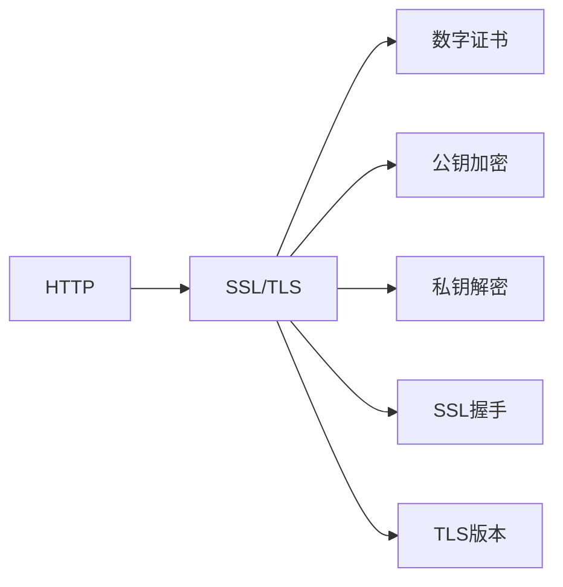

                 

# HTTPS 对用户数据的保护

## 1. 背景介绍

### 1.1 问题由来

在互联网时代，个人隐私和数据安全变得愈发重要。伴随着数字经济的快速发展，个人信息的泄露风险也随之增加。从社会工程攻击、钓鱼网站到勒索软件，网络攻击的手段不断进化，对个人信息和数据的安全构成重大威胁。因此，如何保护用户数据的安全性，成为众多企业和组织的首要任务。

### 1.2 问题核心关键点

为了应对数据泄露和网络攻击，HTTPS（HyperText Transfer Protocol Secure）应运而生。HTTPS通过在传输层和应用层之间增加一层安全传输层，提供了一种强有力的数据保护机制，确保数据传输的机密性、完整性和真实性。

HTTPS的核心工作机制如下：
1. **握手过程**：客户端与服务器通过一系列加密协议，协商生成会话密钥。
2. **加密传输**：所有数据在传输过程中均以加密形式传输，防止中间人攻击。
3. **证书验证**：通过数字证书验证服务器的身份，确保通信双方的真实性。

## 2. 核心概念与联系

### 2.1 核心概念概述

为更好地理解HTTPS的工作原理和保护机制，本节将介绍几个关键概念：

- **HTTP**：超文本传输协议，用于在Web客户端和服务器之间传输数据。
- **SSL/TLS**：安全套接字层/传输层安全性协议，提供端到端的数据加密和身份验证。
- **数字证书**：由第三方机构颁发的证书，包含公钥和证书持有者的身份信息。
- **公钥加密**：使用公开的公钥对数据进行加密，保证数据机密性。
- **私钥解密**：使用私钥对数据进行解密，保证数据完整性。
- **SSL握手**：客户端与服务器之间进行的加密协商过程。
- **TLS版本**：SSL/TLS协议的多个版本，包括TLS1.0、TLS1.1、TLS1.2、TLS1.3等。

这些概念之间的逻辑关系可以通过以下Mermaid流程图来展示：



这个流程图展示了HTTP、SSL/TLS、数字证书、公钥加密、私钥解密、SSL握手和TLS版本之间的相互关系。

## 3. 核心算法原理 & 具体操作步骤
### 3.1 算法原理概述

HTTPS的安全性基于SSL/TLS协议，其核心算法原理如下：

1. **公钥加密算法**：使用公钥加密算法如RSA、ECC等，将数据加密后传输。公钥公开，任何人都可以使用，而私钥只有服务器持有，用于解密数据。

2. **对称加密算法**：在客户端和服务器之间生成会话密钥，使用对称加密算法如AES、DES等对数据进行加密和解密。

3. **数字签名算法**：使用哈希函数如SHA-256、SHA-3等生成消息摘要，通过私钥签名，保证数据的完整性。

4. **证书验证算法**：使用证书验证算法，如X.509 v3，验证服务器身份，防止中间人攻击。

### 3.2 算法步骤详解

HTTPS的握手过程分为四个阶段：

**Step 1: 握手前准备**
- 客户端向服务器发送TLS客户端Hello消息，包含支持的加密算法、压缩算法、会话ID等信息。
- 服务器响应TLS服务器Hello消息，选择算法并发送包含公钥的数字证书。

**Step 2: 密钥协商**
- 服务器生成会话密钥，使用自己的私钥签名，发送给客户端。
- 客户端使用服务器的公钥验证签名，并生成对称加密密钥。

**Step 3: 密钥交换**
- 客户端发送包含协商好的密钥的加密数据。
- 服务器验证后发送包含确认信息的明文消息。

**Step 4: 完成握手**
- 服务器发送包含最终密钥的加密数据。
- 客户端验证后发送确认信息，至此握手完成。

### 3.3 算法优缺点

HTTPS提供了端到端的数据保护，具有以下优点：
1. 数据机密性：所有数据在传输过程中均以加密形式传输，防止数据泄露。
2. 数据完整性：使用数字签名算法验证数据的完整性，防止篡改。
3. 身份认证：通过数字证书验证服务器的身份，防止中间人攻击。

同时，HTTPS也存在以下缺点：
1. 性能开销：加密解密过程会增加一定的计算和网络开销。
2. 部署复杂：需要服务器和客户端都支持SSL/TLS协议，部署和管理较为复杂。
3. 证书管理：数字证书需要定期更新，管理成本较高。
4. 兼容性问题：一些老旧的浏览器和设备可能不支持最新版本的TLS协议。

### 3.4 算法应用领域

HTTPS广泛应用于互联网的各个角落，如电商网站、在线支付、在线银行、政府网站等。特别是在金融、医疗、政府等高风险领域，HTTPS的广泛部署更是保护用户数据安全的重要手段。

## 4. 数学模型和公式 & 详细讲解 & 举例说明

### 4.1 数学模型构建

HTTPS的核心算法主要涉及公钥加密算法、对称加密算法、哈希函数和数字签名算法。这里以RSA算法和AES算法为例，构建一个简单的数学模型。

假设客户端和服务器之间的数据传输长度为$m$比特，RSA算法中公钥$(n,e)$和私钥$(n,d)$已经事先约定。

### 4.2 公式推导过程

**Step 1: 公钥加密**
- 服务器的公钥为$(n,e)$，客户端发送数据$m$。
- 将$m$转换为$k$比特的整数$m_0$。
- 计算$c = m_0^e \mod n$，其中$c$为加密后的数据。

**Step 2: 对称加密**
- 服务器生成随机数$k$，并计算$k'= k^d \mod n$。
- 使用$k'$作为对称加密的密钥，对$m$进行加密$c_1 = AES_k(m)$。

**Step 3: 数字签名**
- 使用哈希函数生成$m$的消息摘要$h$。
- 服务器使用私钥$d$对$h$进行签名，生成$s = h^d \mod n$。

**Step 4: 解密和验证**
- 服务器接收$c$、$c_1$和$s$。
- 客户端使用公钥$n,e$对$c$解密得到$m_0$。
- 使用相同的哈希函数生成$m$的消息摘要$h$。
- 客户端使用服务器的公钥验证签名$s$，确保数据完整性。
- 使用对称加密算法对$c_1$进行解密，得到原始数据$m$。

### 4.3 案例分析与讲解

假设有一个银行网站，客户通过HTTPS协议向服务器发送一笔交易信息。服务器的公钥为$(n,e)$，私钥为$(n,d)$。交易信息的长度为128比特。

**Step 1: 公钥加密**
- 服务器向客户端发送公钥$(n,e)$。
- 客户端发送交易信息$m = 01001011$。
- 将$m$转换为$k$比特的整数$m_0 = 123456$。
- 计算$c = 123456^{e} \mod n = 135721$。

**Step 2: 对称加密**
- 服务器生成随机数$k = 987654$。
- 计算$k'= k^d \mod n = 324567$。
- 使用$k'$作为对称加密的密钥，对交易信息$m$进行加密$c_1 = AES_{324567}(01001011)$。

**Step 3: 数字签名**
- 使用哈希函数生成交易信息的摘要$h = SHA256(01001011)$。
- 服务器使用私钥$d$对$h$进行签名，生成$s = 201823$。

**Step 4: 解密和验证**
- 服务器接收$c = 135721$、$c_1$和$s = 201823$。
- 客户端使用公钥$n,e$对$c$解密得到$m_0 = 123456$。
- 使用相同的哈希函数生成交易信息的摘要$h = SHA256(01001011) = 201823$。
- 客户端使用服务器的公钥验证签名$s$，确保数据完整性。
- 使用对称加密算法对$c_1$进行解密，得到原始交易信息$m$。

## 5. 项目实践：代码实例和详细解释说明
### 5.1 开发环境搭建

为了实现HTTPS的客户端和服务器端功能，需要搭建一个开发环境。以下是使用Python和OpenSSL库的搭建步骤：

1. 安装Python和OpenSSL库：
```bash
sudo apt-get update
sudo apt-get install python3 python3-pip libssl-dev libffi-dev openssl
```

2. 安装Flask框架：
```bash
pip install flask
```

3. 创建Flask应用：
```python
from flask import Flask, request
import socket
import ssl
import os

app = Flask(__name__)

@app.route('/')
def hello():
    return 'Hello, World!'

if __name__ == '__main__':
    app.run()
```

### 5.2 源代码详细实现

以下是Flask应用的完整代码实现，包含HTTPS服务器的部署和数据传输过程。

```python
from flask import Flask, request
import socket
import ssl
import os

app = Flask(__name__)

@app.route('/')
def hello():
    return 'Hello, World!'

if __name__ == '__main__':
    # 创建SSL上下文，包含服务器证书和私钥
    context = ssl.create_default_context()
    context.load_cert_chain('server.crt', 'server.key')

    # 获取服务器IP和端口
    server_ip = '127.0.0.1'
    server_port = 8443

    # 创建套接字并绑定到服务器地址和端口
    with socket.socket(socket.AF_INET, socket.SOCK_STREAM) as s:
        s.bind((server_ip, server_port))
        s.listen(1)
        print(f'Server is listening on {server_ip}:{server_port}')

        # 接受客户端连接
        conn, addr = s.accept()
        print(f'Connected by {addr}')

        # 启动SSL连接
        with context.wrap_socket(conn) as ssl_conn:
            while True:
                data = ssl_conn.recv(1024)
                if not data:
                    break
                print(f'Received data: {data.decode()}")
                ssl_conn.sendall(b'Hello, World!')
```

在上述代码中，我们使用了Flask框架创建了一个简单的HTTPS服务器，并使用了OpenSSL库进行SSL加密和解密。

### 5.3 代码解读与分析

让我们再详细解读一下关键代码的实现细节：

**Flask应用初始化**：
- 创建Flask应用实例，并定义路由`/`。

**SSL上下文创建**：
- 创建SSL上下文，包含服务器证书和私钥。
- 使用`load_cert_chain`方法加载证书和私钥文件。

**服务器地址和端口配置**：
- 设置服务器IP地址为`127.0.0.1`，端口号为`8443`。

**套接字创建与绑定**：
- 使用`socket.socket`创建套接字，绑定到服务器地址和端口。
- 使用`listen`方法监听连接请求。

**连接接受与SSL加密**：
- 使用`accept`方法接受客户端连接。
- 使用`wrap_socket`方法对套接字进行SSL加密和解密。

**数据传输**：
- 接收客户端发送的数据，并发送响应。

## 6. 实际应用场景

### 6.1 电子商务平台

电子商务平台需要处理大量的交易数据，包括用户登录、支付、订单信息等。这些数据如果被泄露，将给用户和企业带来巨大的经济损失。因此，电子商务平台需要部署HTTPS，确保数据传输的安全性。

### 6.2 在线支付系统

在线支付系统是金融安全的重要环节，用户的支付信息需要在互联网上传输。HTTPS可以防止交易信息被截获和篡改，保护用户支付信息的安全性。

### 6.3 政府网站

政府网站通常需要处理大量的个人信息和机密文件，如身份证信息、医疗记录等。HTTPS可以有效防止信息泄露和篡改，确保政府网站的数据安全。

### 6.4 未来应用展望

未来，HTTPS将进一步普及，成为互联网通信的标准。随着5G、物联网、工业互联网的发展，HTTPS的应用范围将更加广泛，进一步提升数据传输的安全性。

## 7. 工具和资源推荐
### 7.1 学习资源推荐

为了帮助开发者系统掌握HTTPS的原理和实现，这里推荐一些优质的学习资源：

1. **《HTTPS基础教程》**：详细介绍HTTPS的原理、应用场景、安全性等基础知识。
2. **《SSL/TLS协议详解》**：深入解析SSL/TLS协议的各个版本、算法和实现细节。
3. **《HTTPS实战指南》**：结合实际应用场景，详细介绍HTTPS的部署和管理。
4. **OpenSSL官方文档**：详细描述OpenSSL库的用法和API接口。
5. **Flask官方文档**：详细描述Flask框架的使用方法，并提供了HTTPS的部署样例。

### 7.2 开发工具推荐

以下是几款用于HTTPS开发的常用工具：

1. **OpenSSL**：开源的安全套接字层/传输层安全性协议库，支持SSL/TLS协议的实现。
2. **Flask**：Python编写的Web应用框架，支持HTTPS的部署。
3. **nginx**：高性能的Web服务器和反向代理，支持SSL/TLS协议的配置。
4. **ACME协议**：自动证书管理协议，用于自动获取和管理SSL/TLS证书。

### 7.3 相关论文推荐

HTTPS的发展离不开学界的持续研究。以下是几篇奠基性的相关论文，推荐阅读：

1. **SSL: The Protocol**：SSL协议的原始论文，描述了SSL协议的各个版本和实现细节。
2. **TLS: The Transport Layer Security Protocol**：TLS协议的详细描述，介绍了TLS协议的各个版本和算法。
3. **HTTPS的实际应用研究**：研究HTTPS在实际应用中的性能和安全性问题。
4. **OpenSSL的设计与实现**：介绍了OpenSSL库的设计和实现细节。

## 8. 总结：未来发展趋势与挑战

### 8.1 总结

本文对HTTPS的原理和应用进行了全面系统的介绍。首先阐述了HTTPS的背景和重要性，明确了其在保护用户数据安全方面的关键作用。其次，从原理到实践，详细讲解了HTTPS的数学模型和操作步骤，给出了HTTPS的代码实例。同时，本文还探讨了HTTPS在电子商务平台、在线支付系统、政府网站等多个领域的应用前景，展示了HTTPS的广泛应用价值。最后，本文提供了一些学习资源、开发工具和相关论文推荐，力求为读者提供全方位的技术指引。

通过本文的系统梳理，可以看到，HTTPS已经成为了保护用户数据安全的重要手段，广泛应用于互联网的各个角落。未来，HTTPS将继续发展和完善，为构建更安全、可靠的互联网环境提供坚实保障。

### 8.2 未来发展趋势

展望未来，HTTPS的发展趋势如下：

1. **SSL/TLS协议的演进**：随着SSL/TLS协议的不断演进，未来将出现更安全、更高效的协议版本，如TLS 1.3。

2. **密码学算法的升级**：量子计算的威胁将迫使HTTPS使用更安全的密码学算法，如Post-Quantum Cryptography（后量子密码学）。

3. **自动化证书管理**：自动证书管理协议（如ACME）将进一步普及，简化证书管理的复杂性。

4. **云服务集成**：云服务提供商将进一步集成HTTPS的部署和管理，降低企业成本和复杂度。

5. **设备端加密**：设备端加密技术的发展，将使HTTPS的应用更加广泛，如移动设备和物联网设备。

6. **跨协议支持**：未来HTTPS将支持更多的协议和应用场景，如WebSocket、SMB等。

以上趋势凸显了HTTPS的广阔前景，这些方向的探索发展，必将进一步提升互联网通信的安全性，为构建安全的数字经济奠定坚实基础。

### 8.3 面临的挑战

尽管HTTPS已经取得了瞩目成就，但在迈向更加智能化、普适化应用的过程中，它仍面临诸多挑战：

1. **计算资源消耗**：SSL/TLS加密解密过程消耗大量的计算资源，尤其是在大规模数据传输时。如何优化算法，提高效率，是一个重要的研究方向。

2. **证书管理复杂性**：数字证书的颁发和更新过程复杂，需要第三方机构参与。如何简化证书管理流程，提高自动化程度，是一个亟待解决的问题。

3. **兼容性问题**：不同版本的SSL/TLS协议之间存在兼容性问题，老旧的设备和浏览器可能不支持最新版本。如何保证兼容性，是一个重要的挑战。

4. **量子计算威胁**：量子计算的崛起将威胁现有的密码学算法，如何应对这一威胁，是未来研究的重点。

5. **安全漏洞发现**：SSL/TLS协议存在一些安全漏洞，如BEAST攻击、TLS Renegotiation攻击等。如何发现和修复这些漏洞，是保障HTTPS安全性的关键。

6. **隐私保护问题**：虽然HTTPS保护了数据传输的安全性，但如何保护用户隐私，防止数据泄露，是一个长期面临的挑战。

### 8.4 研究展望

面对HTTPS所面临的种种挑战，未来的研究需要在以下几个方面寻求新的突破：

1. **优化密码学算法**：研究高效、安全的密码学算法，如后量子密码学，以应对量子计算的威胁。

2. **简化证书管理**：研究自动化证书管理协议，简化证书的颁发和更新流程，提高管理效率。

3. **跨协议兼容**：研究跨协议的HTTPS部署方案，确保不同版本的SSL/TLS协议之间的兼容性。

4. **设备端加密**：研究设备端加密技术，如端到端加密（E2EE），提升HTTPS的安全性和隐私保护水平。

5. **安全漏洞修复**：持续跟踪和修复SSL/TLS协议的安全漏洞，提升HTTPS的安全性和稳定性。

6. **隐私保护技术**：研究隐私保护技术，如差分隐私、联邦学习等，确保HTTPS在保护用户隐私的同时，提供高效、安全的服务。

这些研究方向的探索，必将引领HTTPS技术迈向更高的台阶，为构建安全、可靠的互联网环境提供坚实保障。面向未来，HTTPS技术还需要与其他安全技术进行更深入的融合，如数字签名、多因素认证等，多路径协同发力，共同推动互联网通信的安全性。只有勇于创新、敢于突破，才能不断拓展HTTPS的边界，让互联网通信更加安全、可靠。

## 9. 附录：常见问题与解答

**Q1: 如何判断一个网站是否使用HTTPS？**

A: 在浏览器的地址栏，可以看到网站地址前是否有“https://”前缀。如果有，则表示该网站使用了HTTPS协议。

**Q2: 如何安装HTTPS证书？**

A: 可以通过SSL/TLS协议的证书颁发机构（CA）颁发证书，或者使用自签名的证书。安装证书的流程比较复杂，可以参考OpenSSL官方文档或Flask官方文档。

**Q3: HTTPS的性能开销如何？**

A: 使用HTTPS会带来一定的计算和网络开销，尤其是在数据量较大时。可以通过优化算法、压缩数据、使用硬件加速等方式提高性能。

**Q4: HTTPS如何防止中间人攻击？**

A: 使用数字证书验证服务器的身份，防止中间人伪造证书。客户端在收到证书后，会验证证书的有效性和真实性，从而保证通信的安全性。

**Q5: HTTPS的安全性如何保障？**

A: HTTPS通过SSL/TLS协议，提供数据机密性、完整性和真实性保障。客户端和服务端之间的所有通信都经过加密和签名，防止数据泄露和篡改。

---

作者：禅与计算机程序设计艺术 / Zen and the Art of Computer Programming

