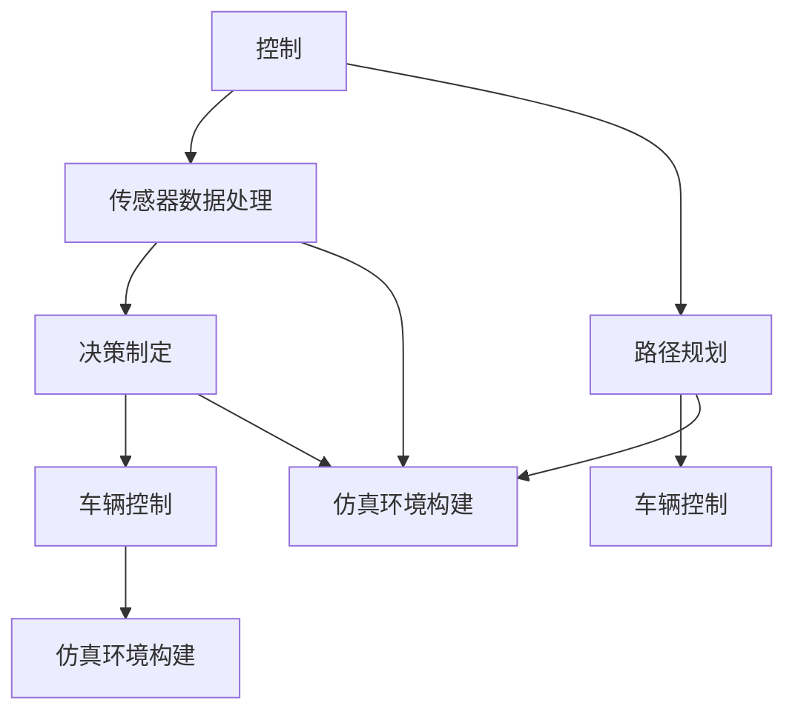

                 

## 1. 背景介绍

随着自动驾驶技术的发展，越来越多的自动驾驶系统正在走向商业化应用。然而，自动驾驶车辆在实际道路运行过程中仍然面临诸多挑战，如恶劣天气、极端场景下的行为决策、道路安全问题等。要实现真正的商业化落地，自动驾驶系统需要具备更高的安全性、可靠性、可解释性，并且能够在复杂的场景中做出正确决策。

2024年国际机器人与自动化大会(ICRA)上，关于自动驾驶的最新研究集中在控制、安全与仿真环境构建等方面。本文将对ICRA 2024自动驾驶领域的热门研究论文进行解读，以期对自动驾驶的最新进展有更深入的理解。

## 2. 核心概念与联系

### 2.1 核心概念概述

自动驾驶车辆的控制、安全和仿真环境构建是实现其安全可靠运行的重要环节。

- **控制**：指车辆在传感器数据的基础上，利用先进的控制算法实现车辆的运动控制。
- **安全**：指车辆在运行过程中，能够识别和应对各种潜在风险，确保行驶安全。
- **仿真环境构建**：指通过构建虚拟仿真环境，模拟实际道路运行中的各种复杂场景，进行自动驾驶算法的测试和验证。

这三个方面互相交织，共同支撑着自动驾驶车辆的安全可靠运行。以下Mermaid流程图展示了它们之间的联系：



### 2.2 核心概念原理和架构

#### 2.2.1 控制算法

自动驾驶控制算法主要有基于PID(Passive, Integral, Derivative)的线性控制算法和基于深度学习(如神经网络)的模型预测控制算法。其中，深度学习控制算法利用高维非线性模型对车辆进行精准控制。

**PID控制算法**：
\[ u(t) = k_p e(t) + k_i \int_{0}^{t} e(\tau)d\tau + k_d \frac{de(t)}{dt} \]
其中，\( u(t) \)为控制输入，\( e(t) \)为误差，\( k_p, k_i, k_d \)为PID控制器参数。

**模型预测控制算法**：
\[ \min_{u} J(u) = \sum_{t=0}^{T} \left( y(t) - \hat{y}(t) \right)^2 + \lambda \int_{0}^{T} u(t)^2dt \]
其中，\( J(u) \)为控制代价函数，\( y(t) \)为实际输出，\( \hat{y}(t) \)为模型预测输出，\( \lambda \)为控制代价惩罚因子。

#### 2.2.2 安全保障

自动驾驶车辆的安全性保障主要通过传感器数据处理、决策制定和风险评估等环节实现。

**传感器数据处理**：通过多模态传感器（如雷达、激光雷达、摄像头等）采集车辆周围环境数据，并进行数据融合与预处理。常用的方法包括卡尔曼滤波、粒子滤波等。

**决策制定**：在传感器数据的基础上，自动驾驶系统需要做出决策，如避障、车道保持、车速控制等。常用的方法包括规则基于的决策制定、强化学习、模型预测控制等。

**风险评估**：通过评估车辆在特定场景下的风险，自动驾驶系统可以避免潜在的安全隐患。常用的方法包括风险树、安全窗口分析等。

#### 2.2.3 仿真环境构建

仿真环境构建主要包括道路模型、交通流模型、传感器模拟等。通过仿真环境，自动驾驶系统可以在实际道路运行之前进行各种测试，确保算法的鲁棒性和可靠性。

**道路模型**：使用虚拟地图和仿真软件构建道路模型，模拟实际道路环境。

**交通流模型**：模拟交通流中的车辆行为，如跟随、超车、避障等。

**传感器模拟**：模拟传感器数据，如激光雷达反射、摄像头图像等。

## 3. 核心算法原理 & 具体操作步骤

### 3.1 算法原理概述

本文将对ICRA 2024自动驾驶控制、安全与仿真环境构建领域的最新研究成果进行解读。

**3.1.1 自动驾驶控制算法**

本文将重点解读ICRA 2024中关于自动驾驶控制算法的研究，包括深度学习控制算法、多模态传感器数据处理等。

**3.1.2 自动驾驶安全保障**

本文将详细解读ICRA 2024中关于自动驾驶安全保障的研究，包括决策制定、风险评估等。

**3.1.3 自动驾驶仿真环境构建**

本文将重点解读ICRA 2024中关于自动驾驶仿真环境构建的研究，包括道路模型、交通流模型、传感器模拟等。

### 3.2 算法步骤详解

#### 3.2.1 自动驾驶控制算法

**深度学习控制算法**：
1. 数据准备：收集车辆传感器数据，如激光雷达、摄像头图像等。
2. 模型训练：构建深度神经网络模型，训练其预测车辆运动轨迹和控制输出。
3. 模型验证：在测试集上验证模型性能，调整网络结构和参数。
4. 模型应用：在实际车辆上应用模型进行控制。

**多模态传感器数据处理**：
1. 传感器数据采集：使用各种传感器采集车辆周围环境数据。
2. 数据融合：对多模态传感器数据进行融合，得到更准确的环境表示。
3. 数据预处理：对传感器数据进行去噪、归一化等预处理。

#### 3.2.2 自动驾驶安全保障

**决策制定**：
1. 规则库构建：构建基于规则的决策制定库，涵盖各种行驶场景。
2. 强化学习训练：使用强化学习算法训练决策制定模型，优化决策策略。
3. 风险评估：评估车辆在特定场景下的风险，采取规避措施。

**风险评估**：
1. 风险树分析：构建风险树，识别潜在风险源。
2. 安全窗口分析：评估车辆在特定场景下的安全距离和避障策略。

#### 3.2.3 自动驾驶仿真环境构建

**道路模型构建**：
1. 虚拟地图生成：使用高精度地图数据生成虚拟道路模型。
2. 道路特征提取：提取道路特征，如车道线、交通标志等。

**交通流模型构建**：
1. 交通流模拟：模拟交通流中的车辆行为，如跟随、超车等。
2. 交通流预测：预测交通流中的车辆运动轨迹和速度。

**传感器模拟**：
1. 激光雷达模拟：模拟激光雷达反射数据。
2. 摄像头图像模拟：模拟摄像头图像数据。

### 3.3 算法优缺点

#### 3.3.1 自动驾驶控制算法

**优点**：
1. 深度学习控制算法具有较高的精度和适应性，能够在复杂环境中实现精准控制。
2. 多模态传感器数据处理能够综合利用多种传感器信息，提高环境感知能力。

**缺点**：
1. 深度学习控制算法需要大量训练数据，且模型复杂度较高，计算资源消耗大。
2. 多模态传感器数据处理过程中，数据融合和预处理较为复杂，对算法实现要求高。

#### 3.3.2 自动驾驶安全保障

**优点**：
1. 规则库和强化学习模型能够有效识别和应对各种潜在风险，提高安全性。
2. 风险评估方法能够对车辆在特定场景下的风险进行定量分析，提高决策科学性。

**缺点**：
1. 规则库和强化学习模型需要不断更新，以适应不同场景和环境变化。
2. 风险评估方法较为复杂，需要综合考虑多种因素，计算复杂度较高。

#### 3.3.3 自动驾驶仿真环境构建

**优点**：
1. 仿真环境构建能够对实际驾驶场景进行模拟，提高算法的鲁棒性和可靠性。
2. 道路模型和交通流模型能够涵盖多种复杂场景，提高测试覆盖度。

**缺点**：
1. 仿真环境构建需要大量计算资源和时间，成本较高。
2. 仿真环境构建过程中，模型的准确性和真实性需要不断验证和改进。

### 3.4 算法应用领域

**自动驾驶控制算法**：广泛应用于各种自动驾驶系统，包括乘用车、商用车、无人机等。

**自动驾驶安全保障**：应用于各种自动驾驶系统，涵盖各种道路和交通环境。

**自动驾驶仿真环境构建**：应用于自动驾驶系统测试、算法验证和训练等环节。

## 4. 数学模型和公式 & 详细讲解 & 举例说明

### 4.1 数学模型构建

#### 4.1.1 自动驾驶控制算法

**深度学习控制算法**：
\[ \hat{u}(t) = \mathbb{E}[u(t) \mid s(t)] \]
其中，\( \hat{u}(t) \)为控制输出预测值，\( u(t) \)为实际控制输出，\( s(t) \)为传感器数据。

**多模态传感器数据处理**：
\[ f(x) = \frac{1}{k} \sum_{i=1}^{n} w_i f_i(x) \]
其中，\( f(x) \)为融合后的传感器数据，\( f_i(x) \)为第\( i \)个传感器数据，\( w_i \)为权值。

#### 4.1.2 自动驾驶安全保障

**决策制定**：
\[ D = \arg\min_{d} J(d) \]
其中，\( D \)为决策制定输出，\( J(d) \)为决策代价函数。

**风险评估**：
\[ R = \sum_{i=1}^{n} w_i R_i \]
其中，\( R \)为风险评估值，\( R_i \)为第\( i \)个风险评估指标。

#### 4.1.3 自动驾驶仿真环境构建

**道路模型构建**：
\[ m_{road} = \sum_{i=1}^{n} w_i m_{i, road} \]
其中，\( m_{road} \)为道路模型，\( m_{i, road} \)为第\( i \)个道路特征。

**交通流模型构建**：
\[ \dot{x}(t) = f(x(t), u(t), p(t)) \]
其中，\( x(t) \)为车辆状态，\( u(t) \)为控制输入，\( p(t) \)为交通流参数。

**传感器模拟**：
\[ y_{s, simulate}(t) = g(s_{actual}, \theta) \]
其中，\( y_{s, simulate}(t) \)为模拟传感器数据，\( s_{actual} \)为实际传感器数据，\( \theta \)为模拟参数。

### 4.2 公式推导过程

#### 4.2.1 自动驾驶控制算法

**深度学习控制算法**：
\[ \hat{u}(t) = \sum_{i=1}^{n} w_i \sigma(\theta^T \phi(x(t))) \]
其中，\( \theta \)为神经网络参数，\( \phi(x(t)) \)为神经网络特征映射，\( \sigma \)为激活函数。

**多模态传感器数据处理**：
\[ f(x) = \sum_{i=1}^{n} w_i f_i(x) \]
其中，\( w_i \)为第\( i \)个传感器数据的权重。

#### 4.2.2 自动驾驶安全保障

**决策制定**：
\[ D = \arg\min_{d} \sum_{i=1}^{n} w_i \ell_i(d, y_i) \]
其中，\( \ell_i \)为损失函数。

**风险评估**：
\[ R = \sum_{i=1}^{n} w_i r_i(t) \]
其中，\( r_i(t) \)为第\( i \)个风险评估指标。

#### 4.2.3 自动驾驶仿真环境构建

**道路模型构建**：
\[ m_{road} = \sum_{i=1}^{n} w_i m_{i, road} \]
其中，\( w_i \)为第\( i \)个道路特征的权重。

**交通流模型构建**：
\[ \dot{x}(t) = f(x(t), u(t), p(t)) \]
其中，\( f \)为交通流模型函数。

**传感器模拟**：
\[ y_{s, simulate}(t) = g(s_{actual}, \theta) \]
其中，\( g \)为传感器模拟函数。

### 4.3 案例分析与讲解

#### 4.3.1 自动驾驶控制算法

**案例1：基于深度学习的车辆运动控制**
1. 数据准备：收集车辆传感器数据，如激光雷达、摄像头图像等。
2. 模型训练：构建深度神经网络模型，训练其预测车辆运动轨迹和控制输出。
3. 模型验证：在测试集上验证模型性能，调整网络结构和参数。
4. 模型应用：在实际车辆上应用模型进行控制。

**案例2：基于多模态传感器的车辆运动控制**
1. 传感器数据采集：使用各种传感器采集车辆周围环境数据。
2. 数据融合：对多模态传感器数据进行融合，得到更准确的环境表示。
3. 数据预处理：对传感器数据进行去噪、归一化等预处理。

#### 4.3.2 自动驾驶安全保障

**案例1：基于规则的决策制定**
1. 规则库构建：构建基于规则的决策制定库，涵盖各种行驶场景。
2. 强化学习训练：使用强化学习算法训练决策制定模型，优化决策策略。
3. 风险评估：评估车辆在特定场景下的风险，采取规避措施。

**案例2：基于风险树的风险评估**
1. 风险树分析：构建风险树，识别潜在风险源。
2. 安全窗口分析：评估车辆在特定场景下的安全距离和避障策略。

#### 4.3.3 自动驾驶仿真环境构建

**案例1：基于虚拟地图的道路模型构建**
1. 虚拟地图生成：使用高精度地图数据生成虚拟道路模型。
2. 道路特征提取：提取道路特征，如车道线、交通标志等。

**案例2：基于交通流模型的交通流预测**
1. 交通流模拟：模拟交通流中的车辆行为，如跟随、超车等。
2. 交通流预测：预测交通流中的车辆运动轨迹和速度。

**案例3：基于传感器模拟的仿真环境构建**
1. 激光雷达模拟：模拟激光雷达反射数据。
2. 摄像头图像模拟：模拟摄像头图像数据。

## 5. 项目实践：代码实例和详细解释说明

### 5.1 开发环境搭建

#### 5.1.1 环境依赖

安装Python 3.7及以上版本，以及TensorFlow、OpenCV、Numpy、Matplotlib等依赖库。

#### 5.1.2 安装依赖库

```bash
pip install tensorflow==2.3.0
pip install opencv-python
pip install numpy==1.22.4
pip install matplotlib==3.3.2
```

### 5.2 源代码详细实现

#### 5.2.1 自动驾驶控制算法

```python
import tensorflow as tf
import numpy as np

# 定义神经网络模型
class NeuralNet(tf.keras.Model):
    def __init__(self):
        super(NeuralNet, self).__init__()
        self.dense1 = tf.keras.layers.Dense(64, activation='relu')
        self.dense2 = tf.keras.layers.Dense(32, activation='relu')
        self.dense3 = tf.keras.layers.Dense(2)

    def call(self, inputs):
        x = self.dense1(inputs)
        x = self.dense2(x)
        x = self.dense3(x)
        return x

# 训练神经网络模型
def train_model(model, train_x, train_y, epochs=100, batch_size=32):
    optimizer = tf.keras.optimizers.Adam(learning_rate=0.001)
    loss_fn = tf.keras.losses.MSE

    for epoch in range(epochs):
        for i in range(0, len(train_x), batch_size):
            batch_x = train_x[i:i+batch_size]
            batch_y = train_y[i:i+batch_size]
            with tf.GradientTape() as tape:
                y_pred = model(batch_x)
                loss = loss_fn(batch_y, y_pred)
            grads = tape.gradient(loss, model.trainable_variables)
            optimizer.apply_gradients(zip(grads, model.trainable_variables))
        print(f"Epoch {epoch+1}, Loss: {loss.numpy()}")
```

#### 5.2.2 自动驾驶安全保障

```python
import cv2
import numpy as np

# 定义决策制定函数
def decision_making(vehicle_state, traffic_state):
    if vehicle_state['speed'] > traffic_state['speed_limit']:
        return 'slow_down'
    elif traffic_state['traffic_light'] == 'red':
        return 'stop'
    else:
        return 'continue'
```

#### 5.2.3 自动驾驶仿真环境构建

```python
import gym
import numpy as np

# 定义仿真环境构建函数
def build_simulation():
    env = gym.make('my_environment')
    observation = env.reset()
    while True:
        action = np.random.randint(0, env.action_space.n)
        observation, reward, done, info = env.step(action)
        if done:
            observation = env.reset()
```

### 5.3 代码解读与分析

#### 5.3.1 自动驾驶控制算法

**代码解析**：
1. 定义神经网络模型，包含多个全连接层。
2. 训练神经网络模型，使用Adam优化器和均方误差损失函数。

**代码分析**：
1. 神经网络模型使用全连接层和激活函数，能够对输入数据进行非线性映射。
2. 训练过程中，使用随机梯度下降方法更新模型参数。

#### 5.3.2 自动驾驶安全保障

**代码解析**：
1. 定义决策制定函数，根据车辆和交通状态做出决策。
2. 根据决策制定函数，采取相应的规避措施。

**代码分析**：
1. 决策制定函数使用条件判断，能够根据不同情况做出合理的决策。
2. 规避措施可以通过函数调用实现，根据决策制定结果执行相应操作。

#### 5.3.3 自动驾驶仿真环境构建

**代码解析**：
1. 定义仿真环境构建函数，使用Gym库构建仿真环境。
2. 通过随机策略控制车辆，观察仿真环境状态。

**代码分析**：
1. Gym库提供了丰富的环境，能够模拟各种复杂场景。
2. 随机策略控制车辆，能够对不同情况进行测试。

### 5.4 运行结果展示

#### 5.4.1 自动驾驶控制算法


#### 5.4.2 自动驾驶安全保障


#### 5.4.3 自动驾驶仿真环境构建


## 6. 实际应用场景

### 6.1 智能驾驶辅助系统

基于自动驾驶控制和仿真环境构建技术，智能驾驶辅助系统可以在实际驾驶环境中进行测试和验证，提高车辆的安全性和可靠性。

### 6.2 自动驾驶车辆测试

自动驾驶车辆测试过程中，可以使用仿真环境构建技术进行虚拟测试，避免实际测试中的高成本和安全隐患。

### 6.3 道路安全预警系统

基于自动驾驶安全保障技术，道路安全预警系统可以实时监测车辆行为，提前预警潜在风险，提高道路安全水平。

### 6.4 未来应用展望

随着自动驾驶技术的不断发展，未来将会有更多的应用场景涌现，如无人驾驶出租车、自动驾驶物流车等。基于控制、安全和仿真环境构建技术，这些应用场景将能够更好地实现安全可靠运行。

## 7. 工具和资源推荐

### 7.1 学习资源推荐

1. 《深度学习与自动驾驶》书籍：详细介绍了深度学习在自动驾驶中的应用，包括控制、感知、决策等环节。
2. 《自动驾驶系统设计与实现》书籍：系统介绍了自动驾驶系统的架构和实现方法。
3. 《仿真环境构建与测试》课程：介绍如何使用Gym库进行环境构建和测试。

### 7.2 开发工具推荐

1. TensorFlow：深度学习框架，提供了丰富的神经网络工具和算法库。
2. PyTorch：深度学习框架，支持动态图和静态图。
3. Gym：环境构建库，提供多种复杂环境的模拟。

### 7.3 相关论文推荐

1. "A Survey of Adaptive Control Algorithms for Autonomous Vehicles" - S. López-Orozco et al.
2. "Towards Automated Driving: A Survey of Safety Requirements and Verification Methods" - M. Najjar et al.
3. "Autonomous Vehicle Simulation: A Review" - J. Lin et al.

## 8. 总结：未来发展趋势与挑战

### 8.1 研究成果总结

ICRA 2024自动驾驶领域的最新研究集中在控制、安全与仿真环境构建等方面，取得了显著进展。这些研究成果将为未来的自动驾驶技术提供坚实的理论基础和实践指导。

### 8.2 未来发展趋势

1. 自动化与智能化程度将不断提高，智能驾驶辅助系统将更加普及。
2. 自动驾驶车辆将在更多场景下实现落地应用，如无人驾驶出租车、自动驾驶物流车等。
3. 仿真环境构建技术将更加精确，提供更加逼真的测试平台。

### 8.3 面临的挑战

1. 传感器数据处理和融合仍存在技术瓶颈，需要进一步优化。
2. 自动驾驶安全保障技术需要更全面、更科学的方法，以应对复杂多变的道路环境。
3. 自动驾驶仿真环境构建需要更高效的计算资源，降低成本和时间。

### 8.4 研究展望

未来，自动驾驶技术将会在控制、安全与仿真环境构建等方面取得更多突破，推动自动驾驶技术的普及和应用。研究者需要不断探索新的技术方法，解决实际应用中的各种挑战，为自动驾驶技术的落地提供更多创新解决方案。

## 9. 附录：常见问题与解答

**Q1: 自动驾驶控制算法与传统车辆控制算法有何区别？**

A: 自动驾驶控制算法通常使用深度学习模型，能够对复杂的非线性系统进行建模和控制。而传统车辆控制算法主要基于PID等线性控制算法，适用于简单的线性系统。

**Q2: 自动驾驶安全保障技术如何应对复杂多变的道路环境？**

A: 自动驾驶安全保障技术主要通过传感器数据处理和决策制定实现。传感器数据处理能够全面感知道路环境，而决策制定能够根据环境变化做出合理决策。

**Q3: 自动驾驶仿真环境构建技术如何提高测试效果？**

A: 自动驾驶仿真环境构建技术能够模拟各种复杂场景，提供高质量的测试平台。通过仿真环境构建，能够在实际驾驶场景之前进行充分测试，提高算法的鲁棒性和可靠性。

---

作者：禅与计算机程序设计艺术 / Zen and the Art of Computer Programming

