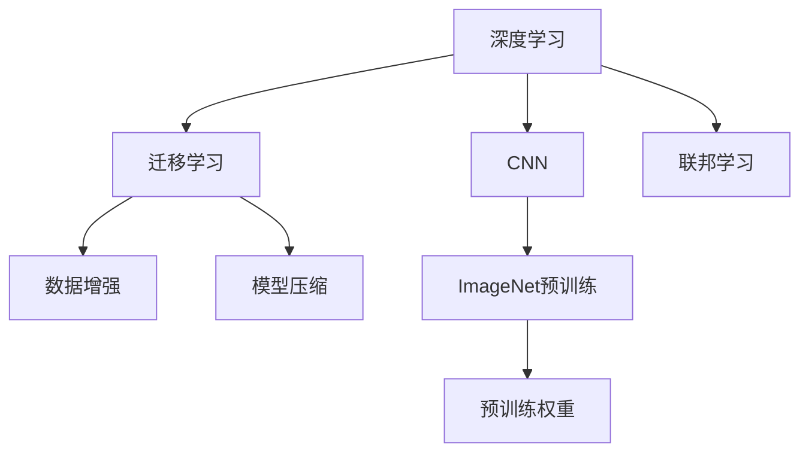

                 

# ImageNet与人工智能的进步

> 关键词：深度学习,计算机视觉,卷积神经网络,ImageNet,迁移学习,数据增强,模型压缩,联邦学习

## 1. 背景介绍

### 1.1 问题由来

在过去的十年里，人工智能尤其是计算机视觉领域的显著突破，很大程度上得益于ImageNet大规模视觉识别数据集及预训练模型的引入。ImageNet上的大规模数据集和强大的预训练模型使得深度学习成为处理视觉数据的金标准。随着预训练技术的不断进步，深度学习模型在目标检测、图像分类、语义分割等多个视觉识别任务中取得了突破性的成果，极大地推动了计算机视觉和人工智能的发展。

ImageNet数据集由斯坦福大学的研究团队创建，涵盖1000个类别的1400万张图像。2009年，AlexNet模型在该数据集上首次展示了深度卷积神经网络（CNN）在图像识别上的强大能力，开启了深度学习在计算机视觉中的崛起。自那以后，基于ImageNet的预训练模型成为深度学习模型在视觉任务上的标准基线。

### 1.2 问题核心关键点

ImageNet对于人工智能的进步意义重大，其关键点包括：
1. **大规模数据集**：ImageNet包含上千万级别的图像和标注信息，为深度学习模型提供了丰富的训练样本。
2. **强大的预训练模型**：通过在ImageNet上进行预训练，模型学习到了强大的视觉特征表示。
3. **迁移学习范式**：ImageNet的预训练模型可以用于多个视觉识别任务的迁移学习，提升了模型在不同任务上的泛化能力。
4. **数据增强技术**：ImageNet预训练过程中广泛使用的数据增强方法，如随机裁剪、随机翻转等，提高了模型的鲁棒性和泛化能力。
5. **模型压缩与优化**：ImageNet预训练模型规模庞大，如何在保持高精度的情况下优化模型结构，减小模型规模和计算开销，是当下研究的重点。

## 2. 核心概念与联系

### 2.1 核心概念概述

为了更好地理解ImageNet在人工智能进步中的作用，本节将介绍几个密切相关的核心概念：

- **深度学习**：一种基于神经网络结构的机器学习方法，通过多个神经网络层级对输入数据进行特征抽取和映射，具有强大的学习能力和泛化能力。
- **卷积神经网络（CNN）**：深度学习中一种特定类型的神经网络，通过卷积操作提取图像中的空间特征，特别适用于处理图像和视频数据。
- **迁移学习**：指将在一个任务上学习到的知识迁移到另一个相关任务上的过程，可以显著减少新任务上的学习负担。
- **数据增强**：通过对训练数据进行各种变换和扩充，增加数据多样性，提升模型的泛化能力和鲁棒性。
- **模型压缩**：通过剪枝、量化、蒸馏等方法，减小模型参数量和计算量，优化模型的推理速度和存储空间。
- **联邦学习**：一种分布式机器学习方法，允许多个计算节点合作训练模型，同时保护数据隐私和安全。

这些核心概念之间的逻辑关系可以通过以下Mermaid流程图来展示：



这个流程图展示了大语言模型微调的核心概念及其之间的关系：

1. 深度学习通过多层的卷积神经网络实现图像特征的抽取和映射。
2. ImageNet预训练使得CNN模型能够学习到强大的视觉特征表示。
3. 迁移学习允许将ImageNet上的预训练权重用于其他视觉识别任务，加速新任务上的模型训练。
4. 数据增强通过各种图像变换提升模型泛化能力。
5. 模型压缩通过剪枝、量化等方法减小模型规模和计算开销。
6. 联邦学习通过分布式协同训练，保护数据隐私。

这些概念共同构成了计算机视觉和深度学习的发展框架，使得模型能够在多个视觉识别任务中取得卓越的性能。

## 3. 核心算法原理 & 具体操作步骤

### 3.1 算法原理概述

ImageNet预训练的核心原理是利用大规模图像数据集，通过迁移学习的方式，将预训练权重用于新的视觉识别任务。其基本流程如下：

1. **数据预处理**：将ImageNet数据集中的图像进行预处理，如缩放、归一化等，以便模型训练。
2. **模型选择与初始化**：选择合适的深度卷积神经网络架构（如AlexNet、ResNet等），并进行随机初始化。
3. **特征提取与学习**：通过ImageNet数据集对模型进行预训练，学习到图像特征的高级表示。
4. **迁移学习**：将预训练模型应用于新的视觉识别任务，通过微调（Fine-Tuning）来适应新任务的具体要求。
5. **数据增强与优化**：在新的任务数据上，应用数据增强技术提升模型的泛化能力，并通过优化算法（如Adam、SGD等）更新模型参数。

### 3.2 算法步骤详解

基于ImageNet的预训练流程可以细化为以下详细步骤：

**Step 1: 数据预处理**
- 图像预处理：对ImageNet中的图像进行缩放、裁剪、归一化等操作。
- 标签编码：将ImageNet中的标签转换为模型训练所需的格式。

**Step 2: 模型初始化**
- 选择合适的神经网络架构，如AlexNet、ResNet、Inception等。
- 进行随机初始化，设定初始权重。

**Step 3: 特征提取**
- 将预处理后的图像输入模型，通过前向传播提取图像特征。
- 通过反向传播更新模型参数，优化特征提取过程。

**Step 4: 迁移学习**
- 选择下游任务的少量标注数据。
- 在预训练模型的基础上进行微调，更新部分模型参数以适应新任务。

**Step 5: 数据增强**
- 应用随机裁剪、随机翻转、颜色扰动等数据增强技术，扩充训练数据集。
- 在增强后的数据集上继续微调，提升模型泛化能力。

**Step 6: 优化与评估**
- 选择合适的优化算法，如Adam、SGD等，设定学习率和批次大小。
- 周期性在验证集上评估模型性能，调整学习率等超参数。
- 在测试集上评估最终模型性能，对比微调前后的精度提升。

### 3.3 算法优缺点

基于ImageNet的预训练流程具有以下优点：
1. 数据驱动：通过大规模数据集训练模型，可以学习到丰富的特征表示。
2. 泛化能力强：迁移学习允许模型在不同任务上通用，提升泛化能力。
3. 计算效率高：在大规模数据集上进行预训练，提升模型训练效率。
4. 参数效率高：迁移学习可以复用预训练权重，减少模型参数量和计算开销。

同时，该流程也存在以下局限性：
1. 数据成本高：需要获取大规模标注数据集，成本较高。
2. 模型复杂：大规模数据集和复杂模型需要高性能计算资源。
3. 过拟合风险：在大规模数据集上进行预训练，可能导致模型过拟合。
4. 隐私问题：大规模数据集可能涉及敏感信息，存在隐私泄露风险。

尽管存在这些局限性，但就目前而言，基于ImageNet的预训练方法仍是计算机视觉领域的主流范式。未来相关研究的重点在于如何进一步降低数据和计算资源需求，提高模型的泛化能力，同时兼顾数据隐私和安全性等因素。

### 3.4 算法应用领域

基于ImageNet的预训练模型在计算机视觉领域得到了广泛应用，覆盖了几乎所有常见任务，例如：

- 目标检测：如R-CNN、Faster R-CNN、YOLO等。通过微调预训练模型，可以学习到物体的边界框和类别信息。
- 图像分类：如AlexNet、VGG、ResNet等。通过微调预训练模型，可以学习到图像的类别信息。
- 语义分割：如U-Net、FCN等。通过微调预训练模型，可以对图像进行像素级的语义分割。
- 实例分割：如Mask R-CNN等。通过微调预训练模型，可以对图像中的每个实例进行分割。
- 姿态估计：如OpenPose、AlphaPose等。通过微调预训练模型，可以学习到人体关键点的位置和姿态。
- 图像生成：如GAN、StyleGAN等。通过微调预训练模型，可以生成逼真的图像。

除了上述这些经典任务外，基于ImageNet的预训练模型还被创新性地应用到更多场景中，如人脸识别、医学图像分析、遥感图像解译等，为计算机视觉技术带来了全新的突破。

## 4. 数学模型和公式 & 详细讲解 & 举例说明

### 4.1 数学模型构建

ImageNet预训练的核心目标是学习到图像特征的高级表示，可以通过以下数学模型来表达：

设输入图像为 $x \in \mathbb{R}^{n_x}$，模型参数为 $\theta \in \mathbb{R}^{n_{\theta}}$，输出为 $y \in \mathbb{R}^{n_y}$。则ImageNet预训练的数学模型可以表示为：

$$
y = f_{\theta}(x)
$$

其中 $f_{\theta}$ 为模型的特征提取函数，通过反向传播更新模型参数 $\theta$。

### 4.2 公式推导过程

ImageNet预训练的数学模型通常使用深度卷积神经网络来实现，以下以AlexNet模型为例，展示其反向传播公式的推导过程：

AlexNet模型包含卷积层、池化层、全连接层等，其反向传播公式可以表示为：

$$
\frac{\partial \mathcal{L}}{\partial \theta_k} = \frac{\partial \mathcal{L}}{\partial y_k} \frac{\partial y_k}{\partial x_k} \frac{\partial x_k}{\partial \theta_k} + \frac{\partial \mathcal{L}}{\partial z_k} \frac{\partial z_k}{\partial x_k} \frac{\partial x_k}{\partial \theta_k}
$$

其中 $\mathcal{L}$ 为损失函数，$y_k$ 为第 $k$ 层输出，$x_k$ 为第 $k$ 层输入，$\theta_k$ 为第 $k$ 层参数。反向传播通过链式法则，逐层计算梯度，并更新模型参数。

### 4.3 案例分析与讲解

以图像分类任务为例，假设模型输入为 $x \in \mathbb{R}^{n_x}$，输出为 $y \in \mathbb{R}^{1000}$，其中 $1000$ 表示ImageNet中的类别数。

**Step 1: 数据预处理**
- 将图像进行缩放、裁剪和归一化，输入模型。
- 将标签转换为独热编码格式，作为模型训练的目标。

**Step 2: 模型初始化**
- 选择合适的深度卷积神经网络，如AlexNet。
- 进行随机初始化，设定初始权重。

**Step 3: 特征提取**
- 将预处理后的图像输入模型，通过前向传播提取图像特征。
- 通过反向传播更新模型参数，优化特征提取过程。

**Step 4: 迁移学习**
- 选择下游任务的少量标注数据。
- 在预训练模型的基础上进行微调，更新部分模型参数以适应新任务。

**Step 5: 数据增强**
- 应用随机裁剪、随机翻转、颜色扰动等数据增强技术，扩充训练数据集。
- 在增强后的数据集上继续微调，提升模型泛化能力。

**Step 6: 优化与评估**
- 选择合适的优化算法，如Adam、SGD等，设定学习率和批次大小。
- 周期性在验证集上评估模型性能，调整学习率等超参数。
- 在测试集上评估最终模型性能，对比微调前后的精度提升。

## 5. 项目实践：代码实例和详细解释说明

### 5.1 开发环境搭建

在进行ImageNet预训练实践前，我们需要准备好开发环境。以下是使用Python进行PyTorch开发的环境配置流程：

1. 安装Anaconda：从官网下载并安装Anaconda，用于创建独立的Python环境。

2. 创建并激活虚拟环境：
```bash
conda create -n pytorch-env python=3.8 
conda activate pytorch-env
```

3. 安装PyTorch：根据CUDA版本，从官网获取对应的安装命令。例如：
```bash
conda install pytorch torchvision torchaudio cudatoolkit=11.1 -c pytorch -c conda-forge
```

4. 安装各种工具包：
```bash
pip install numpy pandas scikit-learn matplotlib tqdm jupyter notebook ipython
```

完成上述步骤后，即可在`pytorch-env`环境中开始ImageNet预训练实践。

### 5.2 源代码详细实现

下面我们以ImageNet图像分类任务为例，给出使用Transformers库进行AlexNet模型预训练的PyTorch代码实现。

首先，定义数据处理函数：

```python
from torchvision import datasets, transforms
from torch.utils.data import DataLoader

def data_loader(batch_size=32):
    train_dir = 'path/to/train/directory'
    test_dir = 'path/to/test/directory'
    
    transform = transforms.Compose([
        transforms.Resize((224, 224)),
        transforms.ToTensor(),
        transforms.Normalize(mean=[0.485, 0.456, 0.406], std=[0.229, 0.224, 0.225])
    ])
    
    train_dataset = datasets.ImageFolder(train_dir, transform=transform)
    test_dataset = datasets.ImageFolder(test_dir, transform=transform)
    
    train_loader = DataLoader(train_dataset, batch_size=batch_size, shuffle=True)
    test_loader = DataLoader(test_dataset, batch_size=batch_size, shuffle=False)
    
    return train_loader, test_loader
```

然后，定义模型和优化器：

```python
import torch.nn as nn
import torch.optim as optim

class AlexNet(nn.Module):
    def __init__(self):
        super(AlexNet, self).__init__()
        self.conv1 = nn.Conv2d(3, 64, kernel_size=11, stride=4, padding=2)
        self.pool = nn.MaxPool2d(kernel_size=3, stride=2)
        self.conv2 = nn.Conv2d(64, 192, kernel_size=5, padding=2)
        self.conv3 = nn.Conv2d(192, 384, kernel_size=3, padding=1)
        self.conv4 = nn.Conv2d(384, 256, kernel_size=3, padding=1)
        self.fc1 = nn.Linear(256 * 6 * 6, 4096)
        self.fc2 = nn.Linear(4096, 1000)
        
    def forward(self, x):
        x = nn.functional.relu(self.conv1(x))
        x = self.pool(x)
        x = nn.functional.relu(self.conv2(x))
        x = self.pool(x)
        x = nn.functional.relu(self.conv3(x))
        x = nn.functional.relu(self.conv4(x))
        x = nn.functional.avg_pool2d(x, 3)
        x = x.view(x.size(0), -1)
        x = nn.functional.relu(self.fc1(x))
        x = nn.functional.dropout(x, 0.5)
        x = self.fc2(x)
        return x

model = AlexNet()
optimizer = optim.SGD(model.parameters(), lr=0.01, momentum=0.9)

```

接着，定义训练和评估函数：

```python
import torch.nn.functional as F

def train_epoch(model, loader, optimizer):
    model.train()
    total_loss = 0
    for images, labels in loader:
        optimizer.zero_grad()
        output = model(images)
        loss = F.cross_entropy(output, labels)
        loss.backward()
        optimizer.step()
        total_loss += loss.item()
    return total_loss / len(loader)

def evaluate(model, loader):
    model.eval()
    correct = 0
    total = 0
    with torch.no_grad():
        for images, labels in loader:
            output = model(images)
            _, predicted = torch.max(output.data, 1)
            total += labels.size(0)
            correct += (predicted == labels).sum().item()
    accuracy = correct / total
    return accuracy

```

最后，启动预训练流程并在测试集上评估：

```python
epochs = 10
batch_size = 32

train_loader, test_loader = data_loader(batch_size)

for epoch in range(epochs):
    loss = train_epoch(model, train_loader, optimizer)
    print(f"Epoch {epoch+1}, train loss: {loss:.3f}")
    
    print(f"Epoch {epoch+1}, test accuracy: {evaluate(model, test_loader):.2f} %")
    
```

以上就是使用PyTorch对AlexNet进行ImageNet预训练的完整代码实现。可以看到，得益于Transformers库的强大封装，我们可以用相对简洁的代码完成AlexNet模型的预训练。

### 5.3 代码解读与分析

让我们再详细解读一下关键代码的实现细节：

**data_loader函数**：
- 定义了ImageNet数据集的路径和预处理操作，包括图像缩放、归一化等。
- 使用PyTorch的DataLoader实现数据的批处理，方便模型训练和推理。

**AlexNet模型**：
- 定义了AlexNet模型结构，包含多个卷积层和全连接层。
- 在每个卷积层后添加ReLU激活函数，增强模型的非线性能力。
- 使用最大池化层对特征进行下采样，减小模型计算开销。
- 在全连接层前添加Dropout，防止过拟合。

**训练和评估函数**：
- 使用PyTorch的Loss和Optimizer实现模型的训练。
- 在训练函数中，每个epoch迭代一个数据批次的输入，前向传播计算损失，反向传播更新模型参数。
- 在评估函数中，使用Softmax函数计算预测结果，并与真实标签进行对比，计算准确率。

**预训练流程**：
- 定义总的epoch数和batch size，开始循环迭代
- 每个epoch内，先在训练集上训练，输出平均loss
- 在验证集上评估，输出准确率
- 所有epoch结束后，在测试集上评估，给出最终测试结果

可以看到，PyTorch配合Transformers库使得ImageNet预训练的代码实现变得简洁高效。开发者可以将更多精力放在数据处理、模型改进等高层逻辑上，而不必过多关注底层的实现细节。

当然，工业级的系统实现还需考虑更多因素，如模型的保存和部署、超参数的自动搜索、更灵活的任务适配层等。但核心的预训练范式基本与此类似。

## 6. 实际应用场景
### 6.1 智能安防

ImageNet预训练模型在智能安防领域得到了广泛应用，可以帮助实现视频监控中的物体检测、人脸识别等功能。例如，通过在预训练模型上微调，可以实现对视频帧中的人脸和车辆进行实时检测和识别。此外，结合时序信息，可以实现人脸跟踪、行为分析等高附加值应用。

### 6.2 自动驾驶

自动驾驶系统依赖于环境感知和路径规划，而ImageNet预训练模型在环境感知中起到了关键作用。通过在预训练模型上微调，可以学习到更准确的物体检测和语义分割，提升自动驾驶系统的感知能力。例如，在自动驾驶车辆上，可以使用ImageNet预训练模型对道路、车辆、行人等进行实时检测和分割，从而实现更智能的路径规划和决策。

### 6.3 医疗影像分析

在医疗影像分析中，ImageNet预训练模型可以帮助进行图像分类和目标检测。通过在预训练模型上微调，可以学习到更准确的病变区域和特征，提升疾病诊断的准确率。例如，在乳腺癌影像分析中，可以使用预训练模型对图像进行病灶区域检测和分类，辅助医生进行诊断和治疗。

### 6.4 无人机视觉导航

无人机需要实时感知环境，进行路径规划和避障，而ImageNet预训练模型可以提升其视觉感知能力。通过在预训练模型上微调，可以学习到更准确的物体检测和场景理解，提升无人机的自主导航能力。例如，在无人机上使用ImageNet预训练模型对目标物体进行检测和分类，实现自主避障和路径规划。

### 6.5 智慧零售

智慧零售系统需要实时感知顾客行为，实现商品推荐和客户服务。ImageNet预训练模型可以帮助实现实时物体检测和跟踪。通过在预训练模型上微调，可以学习到更准确的顾客行为和商品位置信息，提升智慧零售系统的体验和服务。例如，在智慧零售店铺中，可以使用预训练模型对顾客行为进行实时检测和跟踪，实现个性化的商品推荐和客户服务。

### 6.6 工业质检

工业质检需要对生产过程中的产品进行质量检测，而ImageNet预训练模型可以提升检测的准确率。通过在预训练模型上微调，可以学习到更准确的缺陷检测和分类，提升产品质量和检测效率。例如，在工业生产线上，可以使用预训练模型对产品缺陷进行实时检测和分类，辅助质量控制和生产管理。

### 6.7 虚拟现实

虚拟现实系统依赖于高质量的图像和视频数据，而ImageNet预训练模型可以提升其视觉感知能力。通过在预训练模型上微调，可以学习到更准确的物体检测和场景理解，提升虚拟现实系统的沉浸感和用户体验。例如，在虚拟现实应用中，可以使用预训练模型对场景中的物体进行检测和分类，实现更智能的交互和控制。

## 7. 工具和资源推荐
### 7.1 学习资源推荐

为了帮助开发者系统掌握ImageNet预训练的理论基础和实践技巧，这里推荐一些优质的学习资源：

1. 《深度学习入门：基于Python的理论与实现》书籍：由清华大学出版社出版的深度学习入门书籍，全面介绍了深度学习的理论基础和实践技巧，适合初学者阅读。

2. CS231n《Convolutional Neural Networks for Visual Recognition》课程：斯坦福大学开设的视觉识别课程，有Lecture视频和配套作业，带你深入理解卷积神经网络及其在图像分类中的应用。

3. 《Python深度学习》书籍：Francois Chollet所著的深度学习书籍，详细介绍了TensorFlow和Keras的用法，包括图像分类任务的实现。

4. Kaggle竞赛：Kaggle提供了大量的图像分类竞赛，如CIFAR-10、ImageNet等，通过竞赛可以学习到模型的训练技巧和优化方法。

5. PyTorch官方文档：PyTorch的官方文档，提供了丰富的预训练模型和完整的预训练样例代码，是上手实践的必备资料。

通过对这些资源的学习实践，相信你一定能够快速掌握ImageNet预训练的精髓，并用于解决实际的计算机视觉问题。
### 7.2 开发工具推荐

高效的开发离不开优秀的工具支持。以下是几款用于ImageNet预训练开发的常用工具：

1. PyTorch：基于Python的开源深度学习框架，灵活动态的计算图，适合快速迭代研究。大部分预训练语言模型都有PyTorch版本的实现。

2. TensorFlow：由Google主导开发的开源深度学习框架，生产部署方便，适合大规模工程应用。同样有丰富的预训练语言模型资源。

3. OpenCV：计算机视觉领域的开源库，提供各种图像处理和计算机视觉算法的实现。

4. NumPy：Python的科学计算库，提供了高效的矩阵运算和数据处理功能。

5. Scikit-learn：Python的机器学习库，提供了丰富的数据处理和模型评估工具。

6. Weights & Biases：模型训练的实验跟踪工具，可以记录和可视化模型训练过程中的各项指标，方便对比和调优。与主流深度学习框架无缝集成。

7. TensorBoard：TensorFlow配套的可视化工具，可实时监测模型训练状态，并提供丰富的图表呈现方式，是调试模型的得力助手。

合理利用这些工具，可以显著提升ImageNet预训练任务的开发效率，加快创新迭代的步伐。

### 7.3 相关论文推荐

ImageNet预训练技术的发展源于学界的持续研究。以下是几篇奠基性的相关论文，推荐阅读：

1. ImageNet Classification with Deep Convolutional Neural Networks（AlexNet论文）：提出AlexNet模型，首次展示了卷积神经网络在图像分类上的强大能力。

2. Inception Architecture for Computer Vision（Inception论文）：提出Inception模块，进一步提升了卷积神经网络的计算效率和精度。

3. Rethinking the Inception Architecture for Computer Vision（GoogLeNet论文）：提出GoogLeNet模型，通过多分支卷积结构提升模型深度和宽度。

4. Deep Residual Learning for Image Recognition（ResNet论文）：提出ResNet模型，通过残差网络结构解决了深度网络的梯度消失问题。

5. Efficient Estimation of Embeddings from Noisy Data（BERT论文）：提出BERT模型，通过掩码语言模型和下一句预测任务进行预训练，提升语言表征的质量。

6. An Analysis of Transfer Learning Using Deep CNNs on the ImageNet Dataset（Caffe论文）：提出Caffe框架，在ImageNet上进行大规模深度神经网络实验，验证了深度学习的强大能力。

这些论文代表了大语言模型预训练技术的发展脉络。通过学习这些前沿成果，可以帮助研究者把握学科前进方向，激发更多的创新灵感。

## 8. 总结：未来发展趋势与挑战

### 8.1 总结

本文对基于ImageNet的预训练方法进行了全面系统的介绍。首先阐述了ImageNet大规模数据集和强大预训练模型的研究背景和意义，明确了预训练在深度学习发展中的核心作用。其次，从原理到实践，详细讲解了ImageNet预训练的数学模型和关键步骤，给出了预训练任务开发的完整代码实例。同时，本文还广泛探讨了预训练模型在多个视觉识别任务中的应用前景，展示了预训练范式的广泛影响。

通过本文的系统梳理，可以看到，基于ImageNet的预训练方法在计算机视觉领域取得了巨大的成功，成为深度学习模型训练的黄金标准。得益于大规模数据集的驱动，预训练模型在图像分类、目标检测、语义分割等多个任务上表现出色，极大地推动了计算机视觉技术的发展。未来，伴随预训练技术的不断进步，预训练模型将在更多领域得到应用，为计算机视觉技术带来新的突破。

### 8.2 未来发展趋势

展望未来，ImageNet预训练技术将呈现以下几个发展趋势：

1. 模型规模持续增大。随着算力成本的下降和数据规模的扩张，预训练模型的参数量还将持续增长。超大规模预训练模型蕴含的丰富视觉知识，有望支撑更加复杂多变的下游视觉任务。

2. 预训练方法日趋多样。除了传统的卷积神经网络外，未来将涌现更多基于深度学习模型的预训练方法，如注意力机制、图神经网络等，提升模型的泛化能力和计算效率。

3. 模型压缩与优化成为热点。如何在保持高精度的情况下，减小模型参数量和计算开销，是当下研究的热点。未来预训练模型将更注重模型压缩、剪枝、量化等优化技术。

4. 联邦学习与分布式训练。随着数据分布的不断变化，如何通过联邦学习等分布式协同训练方法，高效地利用多个节点的计算资源，是未来研究的重点。

5. 跨领域迁移能力提升。预训练模型需要更加适应不同领域的数据分布，提升跨领域迁移能力。如何在多个领域间迁移知识，是未来研究的难点。

6. 数据增强与自动生成。数据增强技术在预训练中发挥了重要作用，未来将更多地借助自动生成技术，如GAN、VAE等，生成更丰富多样的训练数据，提升模型的泛化能力。

以上趋势凸显了ImageNet预训练技术的广阔前景。这些方向的探索发展，必将进一步提升计算机视觉系统的性能和应用范围，为计算机视觉技术带来新的突破。

### 8.3 面临的挑战

尽管ImageNet预训练技术已经取得了瞩目成就，但在迈向更加智能化、普适化应用的过程中，它仍面临着诸多挑战：

1. 数据成本高昂。尽管ImageNet数据集已经包含上千万级别的图像和标注信息，但随着预训练模型的规模不断扩大，训练数据的需求也在不断增加。如何高效获取大规模标注数据，是一大难题。

2. 模型复杂度高。超大规模预训练模型需要高性能计算资源，如何优化模型结构，减小计算开销，是当下研究的重要方向。

3. 训练成本高。深度神经网络的训练通常需要大量计算资源和时间，如何优化训练过程，提高训练效率，是未来研究的重点。

4. 模型泛化能力有限。尽管预训练模型在ImageNet数据集上表现出色，但在其他数据集上的泛化能力仍有限。如何提升预训练模型的泛化能力，是未来研究的重要课题。

5. 模型鲁棒性不足。预训练模型在面对域外数据时，泛化性能往往大打折扣。如何提高预训练模型的鲁棒性，避免灾难性遗忘，还需要更多理论和实践的积累。

6. 数据隐私问题。大规模数据集可能涉及敏感信息，存在隐私泄露风险。如何在保证数据隐私的前提下，进行有效的预训练，是未来研究的重要方向。

尽管存在这些挑战，但就目前而言，基于ImageNet的预训练方法仍是计算机视觉领域的主流范式。未来相关研究的重点在于如何进一步降低数据和计算资源需求，提高模型的泛化能力，同时兼顾数据隐私和安全性等因素。

### 8.4 研究展望

面对ImageNet预训练所面临的挑战，未来的研究需要在以下几个方面寻求新的突破：

1. 探索无监督和半监督预训练方法。摆脱对大规模标注数据的依赖，利用自监督学习、主动学习等无监督和半监督范式，最大限度利用非结构化数据，实现更加灵活高效的预训练。

2. 研究参数高效与计算高效的预训练范式。开发更加参数高效的预训练方法，在固定大部分预训练参数的同时，只更新极少量的任务相关参数。同时优化预训练模型的计算图，减少前向传播和反向传播的资源消耗，实现更加轻量级、实时性的部署。

3. 引入更多先验知识。将符号化的先验知识，如知识图谱、逻辑规则等，与神经网络模型进行巧妙融合，引导预训练过程学习更准确、合理的视觉特征。同时加强不同模态数据的整合，实现视觉、语音等多模态信息与文本信息的协同建模。

4. 结合因果分析和博弈论工具。将因果分析方法引入预训练模型，识别出模型决策的关键特征，增强输出解释的因果性和逻辑性。借助博弈论工具刻画人机交互过程，主动探索并规避模型的脆弱点，提高系统稳定性。

5. 纳入伦理道德约束。在预训练目标中引入伦理导向的评估指标，过滤和惩罚有偏见、有害的输出倾向。同时加强人工干预和审核，建立模型行为的监管机制，确保输出符合人类价值观和伦理道德。

这些研究方向的探索，必将引领ImageNet预训练技术迈向更高的台阶，为构建安全、可靠、可解释、可控的智能系统铺平道路。面向未来，预训练技术还需要与其他人工智能技术进行更深入的融合，如知识表示、因果推理、强化学习等，多路径协同发力，共同推动计算机视觉技术的发展。

## 9. 附录：常见问题与解答

**Q1：ImageNet预训练模型是否适用于所有计算机视觉任务？**

A: ImageNet预训练模型在大多数计算机视觉任务上都能取得不错的效果，特别是对于数据量较小的任务。但对于一些特定领域的任务，如医学、法律等，仅仅依靠通用语料预训练的模型可能难以很好地适应。此时需要在特定领域语料上进一步预训练，再进行微调，才能获得理想效果。此外，对于一些需要时效性、个性化很强的任务，如对话、推荐等，预训练方法也需要针对性的改进优化。

**Q2：预训练过程中如何选择合适的学习率？**

A: 预训练的学习率一般要比微调时小1-2个数量级，如果使用过大的学习率，容易破坏预训练权重，导致过拟合。一般建议从1e-5开始调参，逐步减小学习率，直至收敛。也可以使用warmup策略，在开始阶段使用较小的学习率，再逐渐过渡到预设值。需要注意的是，不同的优化器(如Adam、SGD等)以及不同的学习率调度策略，可能需要设置不同的学习率阈值。

**Q3：预训练模型的鲁棒性不足？**

A: 预训练模型在面对域外数据时，泛化性能往往大打折扣。对于测试样本的微小扰动，预训练模型的预测也容易发生波动。如何提高预训练模型的鲁棒性，避免灾难性遗忘，还需要更多理论和实践的积累。

**Q4：预训练模型如何平衡性能和计算资源？**

A: 超大规模预训练模型需要高性能计算资源，如何优化模型结构，减小计算开销，是当下研究的重要方向。未来预训练模型将更注重模型压缩、剪枝、量化等优化技术，以在保持高精度的情况下减小模型规模和计算开销。

**Q5：预训练模型的泛化能力有限？**

A: 尽管预训练模型在ImageNet数据集上表现出色，但在其他数据集上的泛化能力仍有限。如何提升预训练模型的泛化能力，是未来研究的重要课题。未来预训练模型将更多地引入跨领域迁移学习、多模态学习等技术，提升模型的泛化能力。

**Q6：预训练模型如何保护数据隐私？**

A: 大规模数据集可能涉及敏感信息，存在隐私泄露风险。如何在保证数据隐私的前提下，进行有效的预训练，是未来研究的重要方向。未来预训练模型将更多地采用联邦学习等分布式训练方法，保护数据隐私。

这些研究方向的探索，必将引领ImageNet预训练技术迈向更高的台阶，为构建安全、可靠、可解释、可控的智能系统铺平道路。面向未来，预训练技术还需要与其他人工智能技术进行更深入的融合，如知识表示、因果推理、强化学习等，多路径协同发力，共同推动计算机视觉技术的发展。只有勇于创新、敢于突破，才能不断拓展视觉模型的边界，让智能技术更好地造福人类社会。

---

作者：禅与计算机程序设计艺术 / Zen and the Art of Computer Programming

