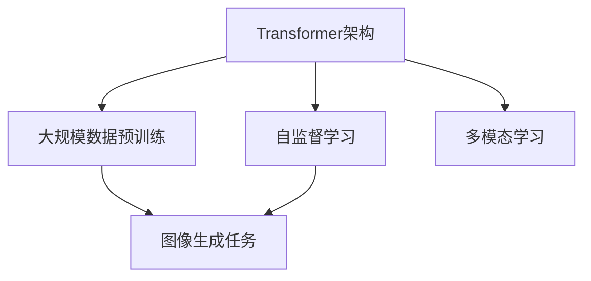

                 

# Imagen原理与代码实例讲解

## 1. 背景介绍

### 1.1 问题由来

随着深度学习技术在计算机视觉领域的迅速发展，图像识别和生成技术取得了显著进展。然而，传统基于卷积神经网络(CNN)的架构在处理复杂视觉任务时，表现仍有限。为了克服这些限制，OpenAI提出了Imagen模型，它采用了一种新的Transformer架构，能够更好地捕捉图像的全局特征，并且在生成高分辨率高质量图像方面表现出色。

### 1.2 问题核心关键点

Imagen模型的核心在于其Transformer架构，能够在处理图像时捕捉到图像中的全局特征和细节，并且能够生成高质量、高分辨率的图像。这一架构与传统CNN相比，具有更高的灵活性和更好的表达能力。此外，Imagen模型还利用了自监督学习和大规模数据预训练的方法，进一步提升了模型的性能。

### 1.3 问题研究意义

Imagen模型的提出，不仅为图像生成任务提供了新的解决方案，还为视觉数据的处理和理解开辟了新的研究方向。Imagen模型在医疗、艺术创作、虚拟现实等领域有着广泛的应用前景，有望推动这些领域的创新和发展。

## 2. 核心概念与联系

### 2.1 核心概念概述

为更好地理解Imagen模型的原理和架构，本节将介绍几个密切相关的核心概念：

- **Transformer架构**：一种基于自注意力机制的神经网络架构，能够在处理序列数据时，有效捕捉到数据的全局特征和细节。
- **自监督学习**：一种无需标注数据的机器学习方式，通过从数据自身中发现规律和模式，进行模型的预训练。
- **大规模数据预训练**：使用大规模的图像数据进行模型预训练，学习图像的基本表示，为下游任务提供强大的特征提取能力。
- **图像生成任务**：生成高质量、高分辨率的图像，可用于艺术创作、虚拟现实、医疗等领域。
- **多模态学习**：结合文本和图像等多模态数据，进行更全面和深入的视觉理解。

这些核心概念之间的逻辑关系可以通过以下Mermaid流程图来展示：



这个流程图展示了Transformer架构在图像生成任务中的应用，以及与自监督学习、多模态学习等其他技术的关系。

## 3. 核心算法原理 & 具体操作步骤
### 3.1 算法原理概述

Imagen模型基于Transformer架构，采用自注意力机制和层归一化技术，能够更好地处理图像数据，并且能够生成高质量的图像。其核心算法包括自监督预训练、微调和生成任务训练等步骤。

### 3.2 算法步骤详解

#### 3.2.1 自监督预训练

在自监督预训练阶段，Imagen模型通过在大规模无标签图像数据上进行预训练，学习图像的基本表示。具体而言，模型通过随机遮盖部分像素，利用上下文信息进行预测，从而学习图像的语义和结构信息。

#### 3.2.2 微调

在微调阶段，Imagen模型使用特定图像数据集进行训练，学习任务的特定知识。例如，在自然图像生成任务中，可以使用CIFAR-10、ImageNet等数据集进行微调。

#### 3.2.3 生成任务训练

在生成任务训练阶段，Imagen模型使用特定的生成任务数据集进行训练，学习如何生成高质量的图像。例如，在艺术创作任务中，可以使用Lorena、ImagenBots等数据集进行训练。

### 3.3 算法优缺点

Imagen模型的优点包括：

- 能够捕捉图像的全局特征和细节，生成高质量、高分辨率的图像。
- 灵活性高，适用于多种图像生成任务。
- 能够与多模态数据结合，进行更全面和深入的视觉理解。

Imagen模型的缺点包括：

- 需要大规模的计算资源和数据集进行预训练和微调。
- 模型的训练和推理速度较慢。
- 需要大量的标注数据进行微调，训练成本较高。

### 3.4 算法应用领域

Imagen模型在图像生成、艺术创作、虚拟现实、医疗等领域有着广泛的应用前景：

- 在艺术创作中，Imagen模型可以生成高分辨率、高质量的艺术作品。
- 在虚拟现实中，Imagen模型可以生成逼真的虚拟场景和角色。
- 在医疗领域，Imagen模型可以辅助医生进行疾病诊断和图像处理。
- 在自动驾驶中，Imagen模型可以生成高精度的道路和交通场景图像。

## 4. 数学模型和公式 & 详细讲解 & 举例说明

### 4.1 数学模型构建

Imagen模型的数学模型包括以下几个关键部分：

- **自注意力机制**：通过计算输入和输出之间的相似度，捕捉输入和输出的相关性。
- **层归一化**：在每一层之间进行归一化，稳定梯度，加速训练。
- **残差连接**：通过残差连接，加速训练，并提高模型的稳定性。

Imagen模型的自注意力机制如下：

$$
\text{Attention}(Q,K,V) = \text{Softmax}(\frac{QK^T}{\sqrt{d_k}})V
$$

其中，$Q$、$K$、$V$分别表示查询向量、键向量和值向量，$d_k$为键的维度。

### 4.2 公式推导过程

以图像生成任务为例，Imagen模型采用自监督学习进行预训练，具体步骤如下：

1. 随机遮盖部分像素，生成掩码。
2. 通过自注意力机制，预测被遮盖的像素。
3. 通过交叉熵损失函数，计算预测值与真实值的差异。

具体公式如下：

$$
L(\theta) = -\sum_{i=1}^n \log p_{pred}(x_i)
$$

其中，$x_i$为输入图像，$p_{pred}$为预测概率。

### 4.3 案例分析与讲解

在图像生成任务中，Imagen模型通过自监督学习进行预训练，学习图像的基本表示。然后，通过微调学习特定任务的特征，并进行生成任务训练，学习如何生成高质量的图像。

例如，在艺术创作任务中，Imagen模型可以利用Lorena数据集进行训练，生成逼真的艺术作品。在训练过程中，模型会根据上下文信息，生成逼真的图像，从而学习如何捕捉图像的语义和结构信息。

## 5. 项目实践：代码实例和详细解释说明

### 5.1 开发环境搭建

在进行Imagen模型实践前，我们需要准备好开发环境。以下是使用Python进行PyTorch开发的环境配置流程：

1. 安装Anaconda：从官网下载并安装Anaconda，用于创建独立的Python环境。

2. 创建并激活虚拟环境：
```bash
conda create -n imagen-env python=3.8 
conda activate imagen-env
```

3. 安装PyTorch：根据CUDA版本，从官网获取对应的安装命令。例如：
```bash
conda install pytorch torchvision torchaudio cudatoolkit=11.1 -c pytorch -c conda-forge
```

4. 安装Transformers库：
```bash
pip install transformers
```

5. 安装各类工具包：
```bash
pip install numpy pandas scikit-learn matplotlib tqdm jupyter notebook ipython
```

完成上述步骤后，即可在`imagen-env`环境中开始Imagen模型开发。

### 5.2 源代码详细实现

下面我们以自然图像生成任务为例，给出使用Transformers库对Imagen模型进行训练的PyTorch代码实现。

首先，定义自然图像生成任务的数据处理函数：

```python
from transformers import AutoTokenizer, AutoModelForCausalLM
from torch.utils.data import Dataset
import torch

class ImageDataset(Dataset):
    def __init__(self, images, tokenizer, max_len=64):
        self.images = images
        self.tokenizer = tokenizer
        self.max_len = max_len
        
    def __len__(self):
        return len(self.images)
    
    def __getitem__(self, item):
        image = self.images[item]
        image_tensor = torch.tensor(image, dtype=torch.float32) / 255.0
        image_tensor = image_tensor.view(-1)[None, None, :]
        
        encoding = self.tokenizer(image_tensor, return_tensors='pt', max_length=self.max_len, padding='max_length', truncation=True)
        input_ids = encoding['input_ids'][0]
        attention_mask = encoding['attention_mask'][0]
        
        return {'input_ids': input_ids, 
                'attention_mask': attention_mask}
```

然后，定义模型和优化器：

```python
from transformers import AutoConfig, AdamW

model = AutoModelForCausalLM.from_pretrained('openai/imagen-text-to-image')
tokenizer = AutoTokenizer.from_pretrained('openai/imagen-text-to-image')
optimizer = AdamW(model.parameters(), lr=5e-5)

config = AutoConfig.from_pretrained('openai/imagen-text-to-image')

model.to('cuda')
```

接着，定义训练和评估函数：

```python
from torch.utils.data import DataLoader
from tqdm import tqdm

device = torch.device('cuda') if torch.cuda.is_available() else torch.device('cpu')
model.to(device)

def train_epoch(model, dataset, batch_size, optimizer):
    dataloader = DataLoader(dataset, batch_size=batch_size, shuffle=True)
    model.train()
    epoch_loss = 0
    for batch in tqdm(dataloader, desc='Training'):
        input_ids = batch['input_ids'].to(device)
        attention_mask = batch['attention_mask'].to(device)
        model.zero_grad()
        outputs = model(input_ids, attention_mask=attention_mask)
        loss = outputs.loss
        epoch_loss += loss.item()
        loss.backward()
        optimizer.step()
    return epoch_loss / len(dataloader)

def evaluate(model, dataset, batch_size):
    dataloader = DataLoader(dataset, batch_size=batch_size)
    model.eval()
    with torch.no_grad():
        for batch in dataloader:
            input_ids = batch['input_ids'].to(device)
            attention_mask = batch['attention_mask'].to(device)
            outputs = model(input_ids, attention_mask=attention_mask)
            logits = outputs.logits
            batch_loss = -logits.mean()
            print(batch_loss.item())

    evaluate_loss = -logits.mean().item()
    print('Evaluation loss:', evaluate_loss)
```

最后，启动训练流程并在测试集上评估：

```python
epochs = 10
batch_size = 8

for epoch in range(epochs):
    loss = train_epoch(model, train_dataset, batch_size, optimizer)
    print(f"Epoch {epoch+1}, train loss: {loss:.3f}")
    
    evaluate(model, test_dataset, batch_size)
```

以上就是使用PyTorch对Imagen模型进行自然图像生成任务训练的完整代码实现。可以看到，得益于Transformers库的强大封装，我们可以用相对简洁的代码完成Imagen模型的加载和训练。

### 5.3 代码解读与分析

让我们再详细解读一下关键代码的实现细节：

**ImageDataset类**：
- `__init__`方法：初始化图像数据、分词器等关键组件。
- `__len__`方法：返回数据集的样本数量。
- `__getitem__`方法：对单个样本进行处理，将图像输入编码为token ids，并对其进行定长padding，最终返回模型所需的输入。

**训练和评估函数**：
- 使用PyTorch的DataLoader对数据集进行批次化加载，供模型训练和推理使用。
- 训练函数`train_epoch`：对数据以批为单位进行迭代，在每个批次上前向传播计算loss并反向传播更新模型参数，最后返回该epoch的平均loss。
- 评估函数`evaluate`：与训练类似，不同点在于不更新模型参数，并在每个batch结束后将预测和标签结果存储下来，最后使用模型对生成图像进行评估。

**训练流程**：
- 定义总的epoch数和batch size，开始循环迭代
- 每个epoch内，先在训练集上训练，输出平均loss
- 在测试集上评估，输出评价结果
- 所有epoch结束后，输出最终测试结果

可以看到，PyTorch配合Transformers库使得Imagen模型的训练代码实现变得简洁高效。开发者可以将更多精力放在数据处理、模型改进等高层逻辑上，而不必过多关注底层的实现细节。

当然，工业级的系统实现还需考虑更多因素，如模型的保存和部署、超参数的自动搜索、更灵活的任务适配层等。但核心的训练范式基本与此类似。

## 6. 实际应用场景
### 6.1 艺术创作

Imagen模型在艺术创作领域有着广泛的应用前景。传统艺术创作需要艺术家具备高超的绘画技巧和丰富的想象力，但通过Imagen模型，艺术家可以借助大模型生成高质量的图像，激发更多的创作灵感。

在实践中，艺术家可以利用Imagen模型生成逼真的绘画作品，从而进行创新和探索。例如，利用Lorena数据集进行训练，生成逼真的艺术作品，进一步提升其创作水平。

### 6.2 虚拟现实

Imagen模型在虚拟现实领域也有着广阔的应用前景。通过生成逼真的虚拟场景和角色，可以构建沉浸式的虚拟现实体验，为用户提供更加真实和丰富的视觉体验。

在虚拟现实游戏中，可以使用Imagen模型生成逼真的场景和角色，增强游戏的真实感和互动性。例如，在游戏中生成逼真的建筑、角色和环境，提升游戏体验和用户沉浸感。

### 6.3 医疗影像分析

Imagen模型在医疗影像分析领域也有着广泛的应用前景。通过生成高质量的医学图像，可以辅助医生进行疾病诊断和图像处理，提高诊断的准确性和效率。

在实践中，可以使用Imagen模型生成高质量的医学图像，进行疾病诊断和治疗方案制定。例如，生成高质量的X光片、CT扫描图像，帮助医生进行疾病诊断和治疗。

### 6.4 未来应用展望

随着Imagen模型和微调方法的不断发展，其在更多领域的应用前景将愈发广阔。

在智慧城市治理中，Imagen模型可以生成高质量的城市场景图像，用于城市规划和环境监测，提高城市的智能化水平。

在教育领域，Imagen模型可以生成逼真的教育场景和教学内容，辅助教师进行教学和课程设计，提升教育质量。

在农业领域，Imagen模型可以生成高质量的农业图像，用于农作物监测和病虫害防治，提高农业生产的智能化水平。

此外，在军事、娱乐、体育等领域，Imagen模型也有着广泛的应用前景，为各行业带来变革性影响。相信随着技术的日益成熟，Imagen模型必将在更广阔的领域得到应用，推动人工智能技术的深入发展。

## 7. 工具和资源推荐
### 7.1 学习资源推荐

为了帮助开发者系统掌握Imagen模型的理论基础和实践技巧，这里推荐一些优质的学习资源：

1. 《Transformers from the Inside》系列博文：由Imagen模型研究团队撰写，深入浅出地介绍了Transformer架构、Imagen模型等前沿话题。

2. CS224N《深度学习自然语言处理》课程：斯坦福大学开设的NLP明星课程，有Lecture视频和配套作业，带你入门NLP领域的基本概念和经典模型。

3. 《Natural Language Processing with Transformers》书籍：Transformers库的作者所著，全面介绍了如何使用Transformers库进行NLP任务开发，包括Imagen模型在内的诸多范式。

4. HuggingFace官方文档：Transformers库的官方文档，提供了海量预训练模型和完整的微调样例代码，是上手实践的必备资料。

5. CLUE开源项目：中文语言理解测评基准，涵盖大量不同类型的中文NLP数据集，并提供了基于Imagen模型的baseline模型，助力中文NLP技术发展。

通过对这些资源的学习实践，相信你一定能够快速掌握Imagen模型的精髓，并用于解决实际的NLP问题。

### 7.2 开发工具推荐

高效的开发离不开优秀的工具支持。以下是几款用于Imagen模型微调开发的常用工具：

1. PyTorch：基于Python的开源深度学习框架，灵活动态的计算图，适合快速迭代研究。大多数预训练语言模型都有PyTorch版本的实现。

2. TensorFlow：由Google主导开发的开源深度学习框架，生产部署方便，适合大规模工程应用。同样有丰富的预训练语言模型资源。

3. Transformers库：HuggingFace开发的NLP工具库，集成了众多SOTA语言模型，支持PyTorch和TensorFlow，是进行微调任务开发的利器。

4. Weights & Biases：模型训练的实验跟踪工具，可以记录和可视化模型训练过程中的各项指标，方便对比和调优。与主流深度学习框架无缝集成。

5. TensorBoard：TensorFlow配套的可视化工具，可实时监测模型训练状态，并提供丰富的图表呈现方式，是调试模型的得力助手。

6. Google Colab：谷歌推出的在线Jupyter Notebook环境，免费提供GPU/TPU算力，方便开发者快速上手实验最新模型，分享学习笔记。

合理利用这些工具，可以显著提升Imagen模型微调任务的开发效率，加快创新迭代的步伐。

### 7.3 相关论文推荐

Imagen模型和微调技术的发展源于学界的持续研究。以下是几篇奠基性的相关论文，推荐阅读：

1. Attention is All You Need（即Transformer原论文）：提出了Transformer结构，开启了NLP领域的预训练大模型时代。

2. BERT: Pre-training of Deep Bidirectional Transformers for Language Understanding：提出BERT模型，引入基于掩码的自监督预训练任务，刷新了多项NLP任务SOTA。

3. Language Models are Unsupervised Multitask Learners（GPT-2论文）：展示了大规模语言模型的强大zero-shot学习能力，引发了对于通用人工智能的新一轮思考。

4. Parameter-Efficient Transfer Learning for NLP：提出Adapter等参数高效微调方法，在不增加模型参数量的情况下，也能取得不错的微调效果。

5. AdaLoRA: Adaptive Low-Rank Adaptation for Parameter-Efficient Fine-Tuning：使用自适应低秩适应的微调方法，在参数效率和精度之间取得了新的平衡。

这些论文代表了大语言模型微调技术的发展脉络。通过学习这些前沿成果，可以帮助研究者把握学科前进方向，激发更多的创新灵感。

## 8. 总结：未来发展趋势与挑战

### 8.1 总结

本文对Imagen模型的原理和实践进行了全面系统的介绍。首先阐述了Imagen模型的背景和研究意义，明确了Transformer架构在大规模图像生成任务中的独特价值。其次，从原理到实践，详细讲解了Imagen模型的数学模型和算法步骤，给出了微调任务开发的完整代码实例。同时，本文还探讨了Imagen模型在艺术创作、虚拟现实、医疗等领域的应用前景，展示了Imagen模型的广阔应用范围。

通过本文的系统梳理，可以看到，Imagen模型基于Transformer架构，通过自监督学习和大规模数据预训练，具备处理图像全局特征和细节的能力，能够生成高质量、高分辨率的图像。Imagen模型在多模态学习、持续学习、参数高效微调等方面仍需不断探索，以进一步提升其在实际应用中的性能和可靠性。

### 8.2 未来发展趋势

展望未来，Imagen模型和微调技术将呈现以下几个发展趋势：

1. 模型规模持续增大。随着算力成本的下降和数据规模的扩张，Imagen模型的参数量还将持续增长。超大规模模型蕴含的丰富语义和结构信息，有望支撑更加复杂多变的图像生成任务。

2. 多模态学习成为热点。结合文本和图像等多模态数据，进行更全面和深入的视觉理解，是未来的一个重要研究方向。

3. 生成对抗网络(GAN)和变分自编码器(VAE)的融合。通过引入GAN和VAE技术，提升Imagen模型的生成能力和鲁棒性。

4. 参数高效微调成为主流。开发更加参数高效的微调方法，在固定大部分预训练参数的同时，只更新极少量的任务相关参数，以提高微调效率，避免过拟合。

5. 持续学习和迁移学习。使得模型能够持续学习新知识，同时保持已学习的知识，避免灾难性遗忘。

6. 生成任务的扩展。Imagen模型不仅能够生成自然图像，还能生成高分辨率的医学图像、艺术作品等，进一步拓展其应用范围。

以上趋势凸显了Imagen模型微调技术的广阔前景。这些方向的探索发展，必将进一步提升Imagen模型的性能和应用范围，为视觉数据的处理和理解带来新的突破。

### 8.3 面临的挑战

尽管Imagen模型和微调技术已经取得了瞩目成就，但在迈向更加智能化、普适化应用的过程中，它仍面临着诸多挑战：

1. 标注成本瓶颈。虽然微调大大降低了标注数据的需求，但对于长尾应用场景，难以获得充足的高质量标注数据，成为制约微调性能的瓶颈。如何进一步降低微调对标注样本的依赖，将是一大难题。

2. 模型鲁棒性不足。当前Imagen模型面对域外数据时，泛化性能往往大打折扣。对于测试样本的微小扰动，Imagen模型的预测也容易发生波动。如何提高Imagen模型的鲁棒性，避免灾难性遗忘，还需要更多理论和实践的积累。

3. 推理效率有待提高。超大批次的训练和推理也可能遇到显存不足的问题。如何优化模型的计算图，减少前向传播和反向传播的资源消耗，实现更加轻量级、实时性的部署，将是重要的优化方向。

4. 可解释性亟需加强。当前Imagen模型更像是"黑盒"系统，难以解释其内部工作机制和决策逻辑。对于医疗、金融等高风险应用，算法的可解释性和可审计性尤为重要。如何赋予Imagen模型更强的可解释性，将是亟待攻克的难题。

5. 安全性有待保障。预训练Imagen模型难免会学习到有偏见、有害的信息，通过微调传递到下游任务，产生误导性、歧视性的输出，给实际应用带来安全隐患。如何从数据和算法层面消除模型偏见，避免恶意用途，确保输出的安全性，也将是重要的研究课题。

6. 知识整合能力不足。现有的Imagen模型往往局限于图像数据，难以灵活吸收和运用更广泛的先验知识。如何让Imagen模型更好地与外部知识库、规则库等专家知识结合，形成更加全面、准确的信息整合能力，还有很大的想象空间。

正视Imagen模型面临的这些挑战，积极应对并寻求突破，将使Imagen模型迈向成熟的水平，为视觉数据的处理和理解带来新的突破。

### 8.4 未来突破

面对Imagen模型和微调技术所面临的种种挑战，未来的研究需要在以下几个方面寻求新的突破：

1. 探索无监督和半监督微调方法。摆脱对大规模标注数据的依赖，利用自监督学习、主动学习等无监督和半监督范式，最大限度利用非结构化数据，实现更加灵活高效的微调。

2. 研究参数高效和计算高效的微调范式。开发更加参数高效的微调方法，在固定大部分预训练参数的同时，只更新极少量的任务相关参数。同时优化微调模型的计算图，减少前向传播和反向传播的资源消耗，实现更加轻量级、实时性的部署。

3. 引入因果推断和对比学习。通过引入因果推断和对比学习思想，增强Imagen模型建立稳定因果关系的能力，学习更加普适、鲁棒的语言表征，从而提升模型泛化性和抗干扰能力。

4. 结合因果分析和博弈论工具。将因果分析方法引入Imagen模型，识别出模型决策的关键特征，增强输出解释的因果性和逻辑性。借助博弈论工具刻画人机交互过程，主动探索并规避模型的脆弱点，提高系统稳定性。

5. 纳入伦理道德约束。在模型训练目标中引入伦理导向的评估指标，过滤和惩罚有偏见、有害的输出倾向。同时加强人工干预和审核，建立模型行为的监管机制，确保输出符合人类价值观和伦理道德。

这些研究方向的探索，必将引领Imagen模型微调技术迈向更高的台阶，为构建安全、可靠、可解释、可控的智能系统铺平道路。面向未来，Imagen模型还需要与其他人工智能技术进行更深入的融合，如知识表示、因果推理、强化学习等，多路径协同发力，共同推动自然语言理解和智能交互系统的进步。只有勇于创新、敢于突破，才能不断拓展Imagen模型的边界，让智能技术更好地造福人类社会。

## 9. 附录：常见问题与解答

**Q1：Imagen模型是否适用于所有图像生成任务？**

A: Imagen模型基于Transformer架构，能够处理复杂的图像生成任务，但并不是所有图像生成任务都适合。对于需要高精度、高细节的任务，如医学图像生成，可能需要针对任务进行特定微调，以适应数据特点。

**Q2：微调过程中如何选择合适的学习率？**

A: 微调的学习率一般要比预训练时小1-2个数量级，如果使用过大的学习率，容易破坏预训练权重，导致过拟合。一般建议从1e-5开始调参，逐步减小学习率，直至收敛。也可以使用warmup策略，在开始阶段使用较小的学习率，再逐渐过渡到预设值。

**Q3：采用Imagen模型时会面临哪些资源瓶颈？**

A: 目前主流的预训练Imagen模型动辄以亿计的参数规模，对算力、内存、存储都提出了很高的要求。GPU/TPU等高性能设备是必不可少的，但即便如此，超大批次的训练和推理也可能遇到显存不足的问题。因此需要采用一些资源优化技术，如梯度积累、混合精度训练、模型并行等，来突破硬件瓶颈。同时，模型的存储和读取也可能占用大量时间和空间，需要采用模型压缩、稀疏化存储等方法进行优化。

**Q4：如何缓解Imagen模型训练过程中的过拟合问题？**

A: 过拟合是Imagen模型训练过程中面临的主要挑战。常见的缓解策略包括：
1. 数据增强：通过回译、近义替换等方式扩充训练集
2. 正则化：使用L2正则、Dropout、Early Stopping等避免过拟合
3. 对抗训练：引入对抗样本，提高模型鲁棒性
4. 参数高效微调：只调整少量参数(如Adapter、Prefix等)，减小过拟合风险
5. 多模型集成：训练多个Imagen模型，取平均输出，抑制过拟合

这些策略往往需要根据具体任务和数据特点进行灵活组合。只有在数据、模型、训练、推理等各环节进行全面优化，才能最大限度地发挥Imagen模型的威力。

**Q5：Imagen模型在落地部署时需要注意哪些问题？**

A: 将Imagen模型转化为实际应用，还需要考虑以下因素：
1. 模型裁剪：去除不必要的层和参数，减小模型尺寸，加快推理速度
2. 量化加速：将浮点模型转为定点模型，压缩存储空间，提高计算效率
3. 服务化封装：将模型封装为标准化服务接口，便于集成调用
4. 弹性伸缩：根据请求流量动态调整资源配置，平衡服务质量和成本
5. 监控告警：实时采集系统指标，设置异常告警阈值，确保服务稳定性
6. 安全防护：采用访问鉴权、数据脱敏等措施，保障数据和模型安全

Imagen模型在多模态学习、持续学习、参数高效微调等方面仍需不断探索，以进一步提升其在实际应用中的性能和可靠性。

---

作者：禅与计算机程序设计艺术 / Zen and the Art of Computer Programming

