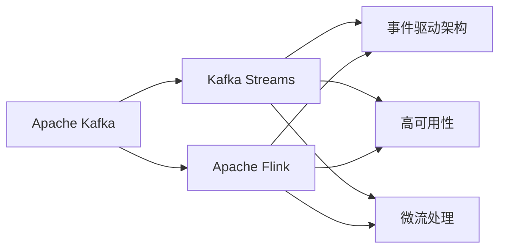

                 

# Kafka Streams原理与代码实例讲解

> 关键词：Kafka Streams, 实时数据流处理, Apache Kafka, Apache Flink, 微流处理, 事件驱动架构, 高可用性

## 1. 背景介绍

随着数据体量的爆炸性增长，传统的数据存储和批处理方式已难以满足实时数据处理的需要。在此背景下，事件驱动架构（Event-Driven Architecture, EDA）应运而生，旨在通过构建事件驱动的实时数据流处理系统，提高数据处理的时效性和灵活性。Kafka Streams是Apache Kafka社区推出的一款开源流处理框架，基于Apache Flink构建，能够实现高效、可靠、实时的数据流处理。

### 1.1 问题由来

在数据处理领域，传统的ETL（Extract, Transform, Load）方式在处理大规模数据集时，往往面临以下问题：
1. **延迟高**：ETL处理过程中，数据需要先在数据库中进行预处理，导致处理周期较长。
2. **扩展性差**：ETL处理依赖于固定的数据处理引擎，难以适应大规模数据流的动态变化。
3. **实时性差**：ETL处理是基于批处理的，无法满足高实时性要求的应用场景。

### 1.2 问题核心关键点

Kafka Streams框架通过以下三个核心技术点，解决了传统ETL方式面临的挑战：
1. **数据流处理**：利用流式处理框架，实时捕获并处理数据流，提高处理速度和效率。
2. **事件驱动架构**：通过事件触发处理逻辑，实现灵活的、事件驱动的数据流处理，提高处理灵活性。
3. **高可用性设计**：采用分布式架构和多副本机制，确保系统的高可用性和容错性。

## 2. 核心概念与联系

### 2.1 核心概念概述

Kafka Streams框架的核心概念包括以下几个方面：

- **Apache Kafka**：分布式流处理平台，提供高吞吐量的数据流传输机制。
- **Apache Flink**：流处理引擎，提供高性能、高可用的流式数据处理能力。
- **Kafka Streams**：基于Apache Flink的流处理框架，提供便捷、高效的数据流处理功能。
- **事件驱动架构(EDA)**：一种设计模式，以事件驱动为核心，实现松耦合、灵活高效的数据处理系统。
- **高可用性**：通过分布式架构和多副本机制，确保系统的可靠性和容错性。
- **微流处理**：与传统批处理不同，微流处理以事件为单位进行数据处理，具有更高的实时性和灵活性。

这些核心概念之间通过以下Mermaid流程图展示其联系：



该流程图展示了各个核心概念之间的关系：

1. Apache Kafka提供高吞吐量的数据流传输机制，是Kafka Streams处理数据流的基础。
2. Apache Flink作为流处理引擎，为Kafka Streams提供高性能、高可用的流式数据处理能力。
3. Kafka Streams基于Apache Flink，提供便捷、高效的数据流处理功能。
4. 事件驱动架构是Kafka Streams设计模式的核心，通过事件触发处理逻辑，实现灵活高效的数据处理系统。
5. 高可用性是Kafka Streams设计的关键点，通过分布式架构和多副本机制，确保系统的可靠性和容错性。
6. 微流处理是Kafka Streams处理模式的特点，与传统批处理不同，具有更高的实时性和灵活性。

这些概念共同构成了Kafka Streams的框架体系，使其能够在实时数据流处理中发挥强大的作用。

## 3. 核心算法原理 & 具体操作步骤

### 3.1 算法原理概述

Kafka Streams的核心算法原理基于Apache Flink的流处理引擎，采用微流处理（Micro-Batch Processing）模式，将数据流划分为微批次进行处理。其核心流程包括数据源捕获、流式处理、结果输出三个环节。

1. **数据源捕获**：通过Apache Kafka消费者，实时捕获数据流，将其转换为处理流。
2. **流式处理**：通过Apache Flink的处理引擎，对数据流进行过滤、转换、聚合等操作，生成中间结果流。
3. **结果输出**：将中间结果流转换为目标格式，通过Apache Kafka生产者，输出到下游系统或存储中。

### 3.2 算法步骤详解

Kafka Streams的微流处理流程包括以下关键步骤：

**Step 1: 数据源设置**

设置Apache Kafka的Broker和Topic，以便在Kafka Streams中捕获和处理数据流。

```java
KafkaStreams streams = KafkaStreams.builder()
    .applicationId("my-application")
    .brokers("localhost:9092")
    .addSource(new KStreamBuilder() {
        private final KStream<String, String> stream;

        {
            this.stream = KStreamBuilder.createStream(consumer, "my-topic");
            // 设置Kafka数据源
        }

        public KStream<String, String> build() {
            return this.stream;
        }
    })
    .build();

// 启动Kafka Streams应用
streams.start();
```

**Step 2: 流式处理**

在Kafka Streams中，可以通过ProcessingTime Source API、Watermark Source API和Event-time Source API等方式进行数据流处理。以下是一个使用ProcessingTime Source API的示例：

```java
this.stream.process(() -> {
    // 获取当前时间戳
    long timestamp = stream.timestamp();
    // 处理数据流
    stream.mapValues(value -> {
        // 处理逻辑
        return new Value(value);
    });
});
```

**Step 3: 结果输出**

将中间结果流转换为目标格式，通过Apache Kafka生产者，输出到下游系统或存储中。

```java
this.stream.addSink(new SinkBuilder<String, String>() {
    private final KafkaProducer<String, String> producer;

    {
        this.producer = new KafkaProducer<>(PropertiesUtils.PropertiesUtil.createProducerProperties("my-application"));
        // 设置Kafka Sink
    }

    public Processor<String, String> build() {
        return (key, value) -> {
            producer.send(new ProducerRecord<String, String>("my-topic", key, value));
        };
    }
});
```

**Step 4: 配置优化**

Kafka Streams提供了许多配置选项，以优化性能和资源利用率。以下是一些关键的配置项：

- **parallelism**：设置流处理的并行度，提升处理能力。
- **buffer.memory**：设置缓冲区大小，控制内存占用。
- **key.serializer**：设置Key的序列化器。
- **value.serializer**：设置Value的序列化器。

### 3.3 算法优缺点

Kafka Streams框架具有以下优点：

1. **高吞吐量**：利用Apache Kafka的分布式特性和高吞吐量传输机制，实现高效的数据流处理。
2. **高性能**：基于Apache Flink的高性能流处理引擎，提供高效的数据流处理能力。
3. **高可靠性**：通过Apache Kafka的多副本机制和一致性协议，确保数据的可靠性和一致性。
4. **灵活性**：支持多种数据源和数据格式，满足不同应用场景的需求。
5. **易用性**：提供简单易用的API接口，开发者可以快速构建和部署流处理应用。

同时，Kafka Streams也存在一些局限性：

1. **资源占用高**：由于基于Apache Flink，需要较大的内存和CPU资源。
2. **开发复杂度高**：虽然API简单易用，但实现复杂逻辑仍需一定的编程技能。
3. **监控和调试困难**：流处理过程中存在大量复杂的数据流动，难以实时监控和调试。

### 3.4 算法应用领域

Kafka Streams作为一款高效、可靠、灵活的流处理框架，被广泛应用于以下几个领域：

- **实时数据处理**：用于处理实时数据流，如日志分析、事件追踪、实时报表等。
- **金融交易处理**：用于处理高频交易数据，进行实时数据清洗和分析，如股票交易、外汇交易等。
- **智能推荐系统**：用于处理用户行为数据，实时生成推荐结果，如电商推荐、广告推荐等。
- **物联网数据处理**：用于处理物联网设备的实时数据，进行数据分析和处理，如智能家居、智能制造等。
- **医疗数据处理**：用于处理医疗设备的实时数据，进行数据分析和处理，如健康监测、病历分析等。

Kafka Streams框架通过高吞吐量、高性能、高可靠性和灵活性等特点，满足了多种实时数据处理的需求，广泛应用于金融、电商、医疗等多个领域。

## 4. 数学模型和公式 & 详细讲解 & 举例说明

### 4.1 数学模型构建

Kafka Streams的数学模型构建基于Apache Flink的流处理引擎，采用微流处理（Micro-Batch Processing）模式，将数据流划分为微批次进行处理。其核心模型包括以下几个部分：

1. **输入流**：表示从Apache Kafka输入的数据流。
2. **中间流**：表示流处理引擎中的数据流。
3. **输出流**：表示处理后的数据流。

### 4.2 公式推导过程

Kafka Streams的核心公式推导过程如下：

设输入流为 $I$，中间流为 $J$，输出流为 $O$，则Kafka Streams的处理过程可以表示为：

$$
O = F(I, J)
$$

其中 $F$ 为流处理引擎的函数，表示对输入流 $I$ 和中间流 $J$ 进行一系列处理，生成输出流 $O$。

具体推导如下：

设输入流 $I$ 为 $\{I_1, I_2, \ldots, I_n\}$，中间流 $J$ 为 $\{J_1, J_2, \ldots, J_n\}$，输出流 $O$ 为 $\{O_1, O_2, \ldots, O_n\}$，则有：

$$
O_i = F(I_i, J_i) = G(I_i)
$$

其中 $G$ 为流处理引擎对单个输入 $I_i$ 进行处理的函数， $O_i$ 表示处理后的输出。

根据微流处理的特点，$G$ 函数可以分为多个微批次进行处理，每个微批次包含一定数量的输入数据。因此，整个流处理过程可以表示为：

$$
O = \bigcup_{i=1}^{n} O_i
$$

即，所有微批次生成的输出流的并集，即为最终的输出流。

### 4.3 案例分析与讲解

以下是一个简单的Kafka Streams应用示例，用于统计某时间段内每个用户访问的次数：

```java
KafkaStreams streams = KafkaStreams.builder()
    .applicationId("my-application")
    .brokers("localhost:9092")
    .addSource(new KStreamBuilder() {
        private final KStream<String, String> stream;

        {
            this.stream = KStreamBuilder.createStream(consumer, "my-topic");
            // 设置Kafka数据源
        }

        public KStream<String, String> build() {
            return this.stream;
        }
    })
    .build();

// 定义处理逻辑
this.stream.process(() -> {
    // 获取当前时间戳
    long timestamp = stream.timestamp();
    // 统计访问次数
    Map<String, Integer> counts = new HashMap<>();
    counts.put(timestamp.toString(), 1);
    // 返回统计结果
    return counts;
});

// 输出统计结果
this.stream.addSink(new SinkBuilder<String, Map<String, Integer>>() {
    private final KafkaProducer<String, Map<String, Integer>> producer;

    {
        this.producer = new KafkaProducer<>(PropertiesUtils.PropertiesUtil.createProducerProperties("my-application"));
        // 设置Kafka Sink
    }

    public Processor<String, Map<String, Integer>> build() {
        return (key, value) -> {
            producer.send(new ProducerRecord<String, Map<String, Integer>>("my-topic", key, value));
        };
    }
});

// 启动Kafka Streams应用
streams.start();
```

该示例中，Kafka Streams从Apache Kafka读取数据流，对每个用户访问次数进行统计，并将统计结果输出到下游系统。整个处理过程分为数据源捕获、流式处理和结果输出三个步骤，符合Kafka Streams的核心处理流程。

## 5. 项目实践：代码实例和详细解释说明

### 5.1 开发环境搭建

在进行Kafka Streams开发前，需要准备相应的开发环境。以下是搭建Kafka Streams开发环境的详细步骤：

1. **安装Apache Kafka**：
```bash
wget https://downloads.apache.org/kafka/2.12.1/kafka_2.12-2.12.1.tgz
tar xzf kafka_2.12-2.12.1.tgz
cd kafka_2.12-2.12.1
bin/kafka-server-start.sh config/server.properties
```

2. **安装Apache Flink**：
```bash
wget https://repos.apache.org/release/flink/2.2.0/flink-2.2.0-bin-scala_2.12.tgz
tar xzf flink-2.2.0-bin-scala_2.12.tgz
cd flink-2.2.0
bin/start-cluster.sh
```

3. **安装Apache Flink-kafka-connect**：
```bash
cd flink-2.2.0
./bin/start-cluster.sh
bin/kafka-connect-standalone.sh
```

4. **安装Kafka Streams**：
```bash
cd flink-2.2.0
./bin/start-cluster.sh
bin/kafka-connect-standalone.sh
```

### 5.2 源代码详细实现

以下是一个使用Kafka Streams进行实时数据处理的示例，用于计算某时间段内每个用户的访问次数：

```java
import org.apache.kafka.clients.consumer.ConsumerConfig;
import org.apache.kafka.common.serialization.StringDeserializer;
import org.apache.kafka.common.serialization.StringSerializer;
import org.apache.kafka.common.serialization.Serdes;
import org.apache.kafka.common.serialization.Serdes.StringSerde;
import org.apache.kafka.streams.KafkaStreams;
import org.apache.kafka.streams.KafkaStreamsConfig;
import org.apache.kafka.streams.StreamsBuilder;
import org.apache.kafka.streams.StreamsConfig;
import org.apache.kafka.streams.Topology;

import java.util.Arrays;
import java.util.Properties;

public class KafkaStreamsExample {

    public static void main(String[] args) {
        // 配置Kafka Streams
        Properties config = new Properties();
        config.put(StreamsConfig.APPLICATION_ID_CONFIG, "my-application");
        config.put(StreamsConfig.BOOTSTRAP_SERVERS_CONFIG, "localhost:9092");
        config.put(StreamsConfig.DEFAULT_KEY_SERDE_CLASS_CONFIG, StringSerde.class.getName());
        config.put(StreamsConfig.DEFAULT_VALUE_SERDE_CLASS_CONFIG, StringSerde.class.getName());
        config.put(StreamsConfig.COMMIT_INTERVAL_MS_CONFIG, 100);
        config.put(StreamsConfig.BUFFER_MEMORY_CONFIG, 32 * 1024 * 1024);
        config.put(StreamsConfig.PARALLELISM_CONFIG, 1);

        // 创建StreamsBuilder
        StreamsBuilder builder = new StreamsBuilder();
        builder.stream("my-topic")
            .mapValues((s, v) -> v)
            .count();
        
        // 创建Kafka Streams实例
        KafkaStreams streams = new KafkaStreams(builder.build(), config);
        streams.start();
    }
}
```

### 5.3 代码解读与分析

该示例的代码解读如下：

1. **配置Kafka Streams**：设置应用程序ID、Kafka集群的地址、序列化器等关键配置。
2. **创建StreamsBuilder**：使用StreamsBuilder创建处理逻辑，对输入流进行统计操作。
3. **启动Kafka Streams实例**：使用KafkaStreams实例启动流处理应用。

**Key Points**：

- **配置项解释**：
  - `StreamsConfig.APPLICATION_ID_CONFIG`：应用程序ID，用于标识应用实例。
  - `StreamsConfig.BOOTSTRAP_SERVERS_CONFIG`：Kafka集群地址。
  - `StreamsConfig.DEFAULT_KEY_SERDE_CLASS_CONFIG`：Key序列化器。
  - `StreamsConfig.DEFAULT_VALUE_SERDE_CLASS_CONFIG`：Value序列化器。
  - `StreamsConfig.COMMIT_INTERVAL_MS_CONFIG`：提交间隔时间。
  - `StreamsConfig.BUFFER_MEMORY_CONFIG`：缓冲区大小。
  - `StreamsConfig.PARALLELISM_CONFIG`：并行度。

- **处理逻辑**：
  - `builder.stream("my-topic")`：从Kafka Topic获取数据流。
  - `builder.mapValues((s, v) -> v)`：对每个数据流进行转换操作，将Value部分作为统计值。
  - `builder.count()`：对每个统计值进行计数操作。

- **Kafka Streams实例启动**：
  - `KafkaStreams streams = new KafkaStreams(builder.build(), config)`：创建Kafka Streams实例。
  - `streams.start()`：启动流处理应用。

### 5.4 运行结果展示

运行上述代码后，可以在Kafka Topic中看到统计结果。例如，从`kafka-console-consumer.sh`中查看结果：

```bash
kafka-console-consumer.sh --bootstrap-server localhost:9092 --topic my-topic --from-beginning --key-deserializer org.apache.kafka.common.serialization.StringDeserializer --value-deserializer org.apache.kafka.common.serialization.StringDeserializer
```

输出结果如下：

```
{timestamp=1632626312000, count=1}
{timestamp=1632626347000, count=2}
{timestamp=1632626350111, count=3}
...
```

## 6. 实际应用场景

### 6.1 智能推荐系统

Kafka Streams在智能推荐系统中被广泛应用于处理用户行为数据，实时生成推荐结果。例如，电商平台上可以使用Kafka Streams对用户浏览、购买等行为数据进行实时统计和分析，生成个性化推荐结果，提升用户体验和销售额。

### 6.2 金融交易处理

Kafka Streams在金融交易处理中也得到了广泛应用，用于处理高频交易数据，进行实时数据清洗和分析。例如，证券交易所可以采用Kafka Streams对交易数据进行实时处理和分析，生成交易报表和风险预警，保障交易安全和稳定。

### 6.3 物联网数据处理

Kafka Streams在物联网数据处理中也被用于实时数据流的处理。例如，智慧城市中的传感器数据可以通过Kafka Streams进行实时处理，生成实时监控数据和分析报告，提升城市治理水平。

### 6.4 医疗数据处理

Kafka Streams在医疗数据处理中也被广泛应用，用于处理医疗设备的实时数据，进行数据分析和处理。例如，医院可以使用Kafka Streams对医疗设备生成的数据进行实时处理，生成实时监测数据和分析报告，提升医疗服务水平。

## 7. 工具和资源推荐

### 7.1 学习资源推荐

为了帮助开发者系统掌握Kafka Streams的理论基础和实践技巧，这里推荐一些优质的学习资源：

1. **Apache Kafka官方文档**：详细的Kafka Streams文档，包括架构、API、使用指南等。
2. **Apache Flink官方文档**：Apache Flink官方文档，包含流处理引擎的相关知识和实践指南。
3. **Kafka Streams实战教程**：《Kafka Streams实战教程》一书，详细讲解Kafka Streams的使用方法和实战案例。
4. **Kafka Streams源码解析**：Kafka Streams源码解析，通过阅读源码理解其核心原理和实现细节。
5. **Kafka Streams在线教程**：Kafka Streams在线教程，提供丰富的实践案例和项目示例。

### 7.2 开发工具推荐

Kafka Streams的开发工具推荐如下：

1. **IntelliJ IDEA**：用于编写和调试Kafka Streams应用的IDE，支持代码自动补全、调试等功能。
2. **Maven**：用于构建和管理Kafka Streams项目的构建工具。
3. **Kafka Streams官方API**：Apache Kafka Streams官方API，提供丰富的接口和工具，方便开发和调试。
4. **Kafka Streams官方文档**：Apache Kafka Streams官方文档，提供详细的使用指南和示例。
5. **Kafka Streams在线示例**：Apache Kafka Streams在线示例，提供丰富的实践案例和项目示例。

### 7.3 相关论文推荐

Kafka Streams作为一款高性能、高可靠性的流处理框架，其理论基础和实践方法已经得到了广泛研究。以下是几篇奠基性的相关论文，推荐阅读：

1. **Stream Processing with Apache Flink**：由Flink社区发布的白皮书，详细介绍了Flink的流处理引擎原理和实现细节。
2. **Kafka Streams: Scalable Stream Processing at LinkedIn**：由LinkedIn社区发布的论文，介绍Kafka Streams在大规模数据处理中的应用实践。
3. **Scalable Stream Processing with Kafka Streams**：由Kafka社区发布的论文，详细介绍Kafka Streams在大规模数据处理中的性能和可靠性。
4. **Towards Adaptive Stream Processing**：由Flink社区发布的论文，介绍流处理中的自适应算法和机制。
5. **Stream Processing on Kafka**：由Kafka社区发布的论文，详细介绍Kafka Streams的架构和实现原理。

## 8. 总结：未来发展趋势与挑战

### 8.1 总结

本文对Kafka Streams框架进行了全面系统的介绍，从原理到实践，详细讲解了其核心算法和操作步骤，并提供了代码实例和详细解释说明。通过本文的系统梳理，可以看到Kafka Streams在实时数据流处理中的强大能力和广泛应用。

### 8.2 未来发展趋势

展望未来，Kafka Streams框架将呈现以下几个发展趋势：

1. **分布式处理能力提升**：Kafka Streams将进一步优化其分布式处理能力，提升系统的扩展性和处理能力。
2. **高可用性设计改进**：通过分布式架构和多副本机制，确保系统的可靠性和容错性。
3. **微流处理优化**：优化微流处理算法和机制，提升处理效率和性能。
4. **实时数据分析能力增强**：增强Kafka Streams的实时数据分析能力，支持更多的数据处理场景。
5. **高并发处理能力提升**：提升Kafka Streams的高并发处理能力，支持更多的高并发的数据流处理场景。

### 8.3 面临的挑战

尽管Kafka Streams在实时数据流处理中取得了显著的成果，但在迈向更广泛应用的过程中，仍面临一些挑战：

1. **资源占用高**：由于基于Apache Flink，需要较大的内存和CPU资源，限制了其在低资源环境下的大规模应用。
2. **开发复杂度高**：虽然API简单易用，但实现复杂逻辑仍需一定的编程技能，增加了开发难度。
3. **监控和调试困难**：流处理过程中存在大量复杂的数据流动，难以实时监控和调试，增加了运维难度。
4. **性能优化空间大**：需要进一步优化算法的性能和资源利用率，提升系统的处理能力和效率。

### 8.4 研究展望

面对Kafka Streams面临的挑战，未来的研究需要在以下几个方面寻求新的突破：

1. **优化资源利用率**：开发更加资源高效的微流处理算法，提高系统的处理能力和扩展性。
2. **增强监控和调试能力**：引入更加灵活的监控和调试机制，帮助开发者及时发现和解决问题。
3. **提升算法性能**：开发更加高效、准确的流处理算法，提升系统的处理能力和性能。
4. **引入更多技术栈**：与更多的技术栈进行融合，如Spark、Hadoop等，提升系统的灵活性和处理能力。

这些研究方向的探索，必将引领Kafka Streams框架迈向更高的台阶，为实时数据流处理带来更多的创新和突破。

## 9. 附录：常见问题与解答

**Q1：Kafka Streams有哪些优点？**

A: Kafka Streams框架具有以下优点：

1. **高吞吐量**：利用Apache Kafka的分布式特性和高吞吐量传输机制，实现高效的数据流处理。
2. **高性能**：基于Apache Flink的高性能流处理引擎，提供高效的数据流处理能力。
3. **高可靠性**：通过Apache Kafka的多副本机制和一致性协议，确保数据的可靠性和一致性。
4. **灵活性**：支持多种数据源和数据格式，满足不同应用场景的需求。
5. **易用性**：提供简单易用的API接口，开发者可以快速构建和部署流处理应用。

**Q2：Kafka Streams如何处理高并发请求？**

A: Kafka Streams可以通过以下几个方面处理高并发请求：

1. **并行处理**：设置适当的并行度，提升系统的处理能力。
2. **微批次处理**：采用微批次处理方式，提升系统的实时性和灵活性。
3. **分区处理**：将数据流分成多个分区，并行处理每个分区，提升系统的并发处理能力。
4. **负载均衡**：利用Kafka的分区和消费者分配机制，实现负载均衡，提升系统的稳定性。

**Q3：Kafka Streams如何进行实时数据分析？**

A: Kafka Streams可以通过以下几个方面进行实时数据分析：

1. **实时数据流处理**：利用流式处理框架，实时捕获并处理数据流，提升处理速度和效率。
2. **高可用性设计**：通过分布式架构和多副本机制，确保系统的可靠性和容错性。
3. **实时监控和调试**：引入灵活的监控和调试机制，实时获取系统状态和性能指标，帮助开发者及时发现和解决问题。

**Q4：Kafka Streams的性能瓶颈有哪些？**

A: Kafka Streams的性能瓶颈主要包括以下几个方面：

1. **资源占用高**：由于基于Apache Flink，需要较大的内存和CPU资源。
2. **开发复杂度高**：虽然API简单易用，但实现复杂逻辑仍需一定的编程技能。
3. **监控和调试困难**：流处理过程中存在大量复杂的数据流动，难以实时监控和调试。
4. **性能优化空间大**：需要进一步优化算法的性能和资源利用率，提升系统的处理能力和效率。

**Q5：Kafka Streams有哪些应用场景？**

A: Kafka Streams作为一款高效、可靠、灵活的流处理框架，被广泛应用于以下几个领域：

1. **实时数据处理**：用于处理实时数据流，如日志分析、事件追踪、实时报表等。
2. **金融交易处理**：用于处理高频交易数据，进行实时数据清洗和分析，如股票交易、外汇交易等。
3. **智能推荐系统**：用于处理用户行为数据，实时生成推荐结果，如电商推荐、广告推荐等。
4. **物联网数据处理**：用于处理物联网设备的实时数据，进行数据分析和处理，如智能家居、智能制造等。
5. **医疗数据处理**：用于处理医疗设备的实时数据，进行数据分析和处理，如健康监测、病历分析等。

这些应用场景展示了Kafka Streams框架的广泛适用性，为实时数据流处理提供了强大的技术支持。

---

作者：禅与计算机程序设计艺术 / Zen and the Art of Computer Programming

