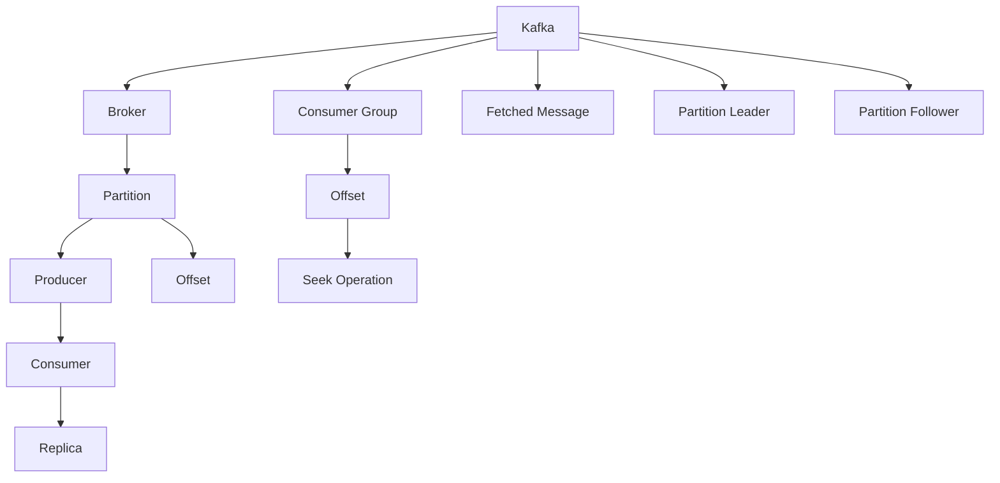

                 

# Kafka 原理与代码实例讲解

> 关键词：Kafka,分布式消息系统,流式处理,架构设计,代码实现,应用场景

## 1. 背景介绍

### 1.1 问题由来
随着大数据时代的到来，实时数据的处理和存储需求日益增长。企业需要高效、稳定、可靠的机制来处理各种类型和来源的数据，支持各种应用场景。传统的数据处理方式（如Hadoop MapReduce）已经难以满足实时性和高吞吐量的需求。分布式消息系统（如Apache Kafka）应运而生，成为处理大规模流式数据的重要解决方案。

### 1.2 问题核心关键点
Kafka的核心在于其分布式架构和实时流式处理能力。其分布式特性使得Kafka能够支持高吞吐量的数据流，并通过异步写入和复制机制保证数据可靠性。Kafka的流式处理能力使其能够支持各种数据流应用，如实时数据采集、数据流式分析、数据同步、事件驱动架构等。

### 1.3 问题研究意义
研究Kafka的原理和实现方式，对于理解分布式消息系统的高可用性、可扩展性和实时性具有重要意义。掌握Kafka的代码实现细节，有助于开发人员更好地设计和部署分布式数据流处理系统，支撑数据驱动的业务应用。

## 2. 核心概念与联系

### 2.1 核心概念概述

为更好地理解Kafka系统，本节将介绍几个密切相关的核心概念：

- **Kafka**：Apache Kafka是一个开源的分布式流式消息处理平台，提供高吞吐量的分布式数据流处理，同时支持发布/订阅模型。
- **Broker**：Kafka集群中的消息存储服务，负责数据存储和消费。每个Broker上运行一个或多个Partition，每个Partition对应一个独立的流。
- **Partition**：Kafka中的数据分区，一个Partition对应一个有序的消息序列。多个Consumer可以订阅同一个Partition进行并行消费。
- **Producer**：向Kafka集群发送数据的客户端，负责数据的生产和传递。
- **Consumer**：从Kafka集群中读取数据的客户端，负责数据的消费和处理。
- **Replica**：Kafka中的数据副本，每个Partition在多个Broker上都有相应的副本，确保数据的高可用性。
- **Consumer Group**：多个Consumer可以组成一个消费者组，订阅同一个Partition，并行消费数据，避免重复处理。
- **Offset**：Kafka中的消息偏移量，用于标记消息在Partition中的位置。Consumer通过维护Offset来跟踪消费进度。
- **Fetch Request**：Consumer向Broker发送的请求，用于获取Partition中的新消息。
- **Producer Request**：Producer向Broker发送的请求，用于提交消息到Partition中。
- **Seek Operation**：Consumer从指定位置开始消费数据的操作。
- **Partition Leader**：每个Partition有且只有一个Leader Broker，负责处理Partition的读写操作。
- **Partition Follower**：每个Partition可以有多个Follower Broker，负责数据的复制和同步。

这些核心概念之间的逻辑关系可以通过以下Mermaid流程图来展示：



这个流程图展示了Kafka系统的主要组件及其关系：

1. Kafka作为消息处理平台，包含Broker、Partition、Producer和Consumer等组件。
2. Broker是Kafka集群中的消息存储服务，每个Broker上运行一个或多个Partition。
3. Partition是Kafka中的数据分区，多个Consumer可以订阅同一个Partition进行并行消费。
4. Producer负责数据的生产和传递，将消息提交到Partition中。
5. Consumer负责数据的消费和处理，从Partition中读取消息。
6. Replica是Kafka中的数据副本，确保数据的高可用性。
7. Consumer Group是多个Consumer组成的消费者组，订阅同一个Partition，并行消费数据。
8. Offset是Kafka中的消息偏移量，用于标记消息在Partition中的位置。
9. Fetch Request是Consumer向Broker发送的请求，用于获取Partition中的新消息。
10. Producer Request是Producer向Broker发送的请求，用于提交消息到Partition中。
11. Seek Operation是Consumer从指定位置开始消费数据的操作。
12. Partition Leader是每个Partition有且只有一个Leader Broker，负责处理Partition的读写操作。
13. Partition Follower是每个Partition可以有多个Follower Broker，负责数据的复制和同步。

## 3. 核心算法原理 & 具体操作步骤
### 3.1 算法原理概述

Kafka的分布式架构和流式处理能力是其核心特性。其原理可以归纳为以下几点：

- 分布式存储与消费：Kafka通过Broker存储数据，通过Partition进行数据的分区和消费，支持大规模数据的存储和处理。
- 高吞吐量与低延迟：Kafka通过异步写入和复制机制，实现数据的快速生产和消费。
- 数据可靠性与一致性：Kafka通过数据副本机制，确保数据在多个Broker上的同步和冗余，提高数据的可靠性和一致性。
- 分布式订阅与消费：Kafka支持多个Consumer订阅同一个Partition，实现并行消费和负载均衡。
- 实时流式处理：Kafka支持实时数据的流式处理，能够适应各种实时数据应用场景。

### 3.2 算法步骤详解

Kafka的核心算法主要涉及数据存储、数据生产、数据消费和数据同步四个方面。下面分别介绍这四个方面的具体实现：

#### 3.2.1 数据存储与消费

Kafka通过Broker和Partition实现数据的存储和消费。具体步骤如下：

1. **Broker启动与初始化**：
   - 启动Broker节点，初始化存储配置、日志文件和分区信息。
   - 配置Broker与ZooKeeper进行同步，确保集群稳定性和数据一致性。

2. **Partition创建与划分**：
   - Kafka通过分区（Partition）实现数据的并行处理。
   - Partition可以在Broker上创建多个，每个Partition对应一个有序的消息序列。
   - Partition的划分可以通过配置文件或编程接口实现，一般建议根据业务需求进行手动划分。

3. **数据写入与存储**：
   - Producer将数据通过网络发送到Broker。
   - Broker接收数据后，根据配置将数据写入Partition中。
   - Kafka采用异步写入机制，支持高吞吐量的数据生产。

4. **数据读取与消费**：
   - Consumer从Partition中读取数据，并根据业务需求进行处理。
   - Kafka支持顺序读取Partition中的数据，确保数据的实时性和一致性。

#### 3.2.2 高吞吐量与低延迟

Kafka通过异步写入和复制机制实现高吞吐量与低延迟：

1. **异步写入**：
   - Producer将数据通过网络发送到Broker，但不等待Broker的确认。
   - Broker接收到数据后，将数据写入本地日志文件，并在后台异步同步到其他Broker。
   - 异步写入机制大大提高了数据生产的效率和吞吐量。

2. **数据复制**：
   - Kafka通过数据副本机制实现数据的冗余和容错。
   - 每个Partition在多个Broker上都有相应的副本，确保数据的高可用性。
   - Kafka支持自动复制，将数据自动同步到多个Broker上，无需手动干预。

#### 3.2.3 数据可靠性与一致性

Kafka通过数据副本机制确保数据的高可靠性和一致性：

1. **数据副本**：
   - Kafka每个Partition可以有多个Follower Broker，负责数据的复制和同步。
   - 数据副本机制确保了数据的冗余和容错，提高了数据的可靠性和一致性。

2. **数据同步**：
   - Kafka通过ZooKeeper协调Broker之间的数据同步。
   - 当某个Broker宕机时，Kafka自动将数据从Follower复制至新Leader，保证数据的连续性和一致性。

#### 3.2.4 分布式订阅与消费

Kafka支持多个Consumer订阅同一个Partition，实现并行消费和负载均衡：

1. **Consumer组**：
   - Kafka支持多个Consumer组成一个消费者组，订阅同一个Partition。
   - 消费者组内的Consumer可以并行消费数据，避免重复处理。

2. **Offset管理**：
   - Kafka通过Offset管理Consumer的消费进度。
   - 每个Consumer维护自己的Offset，记录上次消费的消息位置。

3. **Seek操作**：
   - Consumer可以通过Seek操作从指定位置开始消费数据。
   - Seek操作可以快速跳转到特定的消息位置，提高消费效率。

### 3.3 算法优缺点

Kafka作为一种高性能、分布式的流式消息处理平台，具有以下优点：

- **高吞吐量与低延迟**：Kafka通过异步写入和数据复制机制，支持高吞吐量的数据生产与消费，适用于大规模数据的存储与处理。
- **高可靠性与一致性**：Kafka通过数据副本和数据同步机制，确保数据的可靠性和一致性，避免数据丢失和损坏。
- **分布式订阅与消费**：Kafka支持多个Consumer订阅同一个Partition，实现并行消费和负载均衡，提高系统的可扩展性和性能。

然而，Kafka也存在一些缺点：

- **资源消耗较大**：Kafka的分布式特性和数据复制机制导致资源消耗较大，需要较高的硬件配置。
- **复杂性较高**：Kafka的分布式架构和复杂配置参数需要较高的技术水平和运维能力。
- **数据一致性要求高**：Kafka通过数据副本和同步机制确保数据一致性，但如果某个Broker宕机，数据同步可能会影响系统的稳定性和可靠性。

### 3.4 算法应用领域

Kafka因其高吞吐量、高可靠性、低延迟和分布式特性，广泛应用于以下领域：

- **数据流处理**：Kafka支持大规模数据的流式处理，适用于实时数据采集、数据同步、数据流分析等应用场景。
- **消息队列**：Kafka作为一种消息队列，支持异步消息传递和数据缓冲，适用于异步任务处理、事件驱动架构等。
- **日志存储与分析**：Kafka可以将日志数据存储到Hadoop HDFS等存储系统，并使用流式处理引擎进行日志分析，支持日志查询、监控告警等应用。
- **微服务架构**：Kafka支持微服务架构的数据共享与通信，通过消息队列实现微服务之间的解耦和通信。
- **实时数据计算**：Kafka支持实时数据的流式处理和计算，通过流式处理引擎进行数据计算、实时报表等应用。

## 4. 数学模型和公式 & 详细讲解  
### 4.1 数学模型构建

为了更好地理解Kafka的原理和实现方式，本节将使用数学语言对Kafka的实现机制进行更加严格的刻画。

假设Kafka集群中有n个Broker节点，每个Broker上运行m个Partition，每个Partition中有s条数据。Kafka的生产者生产k条数据，消费者消费t条数据。

Kafka的数学模型可以表示为：

1. **数据生产模型**：
   \[
   \text{Total Data Produced} = k
   \]
   表示生产者生产的总数据量。

2. **数据存储模型**：
   \[
   \text{Data Stored} = \sum_{i=1}^{n} \text{Data Stored in Broker }i
   \]
   表示集群中存储的总数据量。

3. **数据复制模型**：
   \[
   \text{Data Replicated} = \sum_{i=1}^{n} \sum_{j=1}^{m} (\text{Replicas of Partition }j \text{ in Broker }i)
   \]
   表示集群中数据副本的总数量。

4. **数据消费模型**：
   \[
   \text{Data Consumed} = t
   \]
   表示消费者消费的总数据量。

### 4.2 公式推导过程

以下我们以单Partition为例，推导Kafka的消息传递和消费过程：

1. **消息写入Partition**：
   \[
   \text{Message to Partition }j = \text{Message from Producer }
   \]
   表示生产者向Partition j写入的消息。

2. **消息存储到Broker**：
   \[
   \text{Data Stored in Broker }i = \sum_{j=1}^{m} \text{Message to Partition }j \text{ in Broker }i
   \]
   表示Broker i中存储的数据量。

3. **消息复制到Follower Broker**：
   \[
   \text{Data Replicated in Broker }i = \sum_{j=1}^{m} (\text{Replicas of Partition }j \text{ in Broker }i)
   \]
   表示Broker i中数据副本的总数量。

4. **消息读取与消费**：
   \[
   \text{Data Consumed by Consumer }g = \sum_{j=1}^{m} (\text{Offset }g \text{ of Partition }j)
   \]
   表示消费者g消费的数据量。

### 4.3 案例分析与讲解

以一个具体的案例来说明Kafka的实现原理：

假设Kafka集群中有2个Broker节点，每个Broker上运行3个Partition，每个Partition中有100条数据。生产者生产1000条数据，消费者消费500条数据。每个Consumer组成一个消费者组，每个Partition分配给一个Consumer组。

1. **数据生产**：
   - 生产者生产1000条数据，写入到3个Partition中，每个Partition分别接收1000/3条数据。

2. **数据存储**：
   - Broker 1和Broker 2各自存储1500条数据，其中1000条数据为原始数据，500条数据为数据副本。

3. **数据复制**：
   - Broker 1中的数据副本数量为500条，Broker 2中的数据副本数量也为500条。

4. **数据消费**：
   - 消费者组1和消费者组2分别消费500条数据，消费者组1消费100条数据，消费者组2消费300条数据。

以上案例展示了Kafka数据的生产、存储、复制和消费过程，通过数学模型可以清晰地理解和计算各个环节的数据流向。

## 5. 项目实践：代码实例和详细解释说明
### 5.1 开发环境搭建

在进行Kafka项目实践前，我们需要准备好开发环境。以下是使用Python进行Kafka开发的环境配置流程：

1. 安装Anaconda：从官网下载并安装Anaconda，用于创建独立的Python环境。

2. 创建并激活虚拟环境：
```bash
conda create -n kafka-env python=3.8 
conda activate kafka-env
```

3. 安装Kafka客户端库：
```bash
pip install kafka-python
```

4. 安装Kafka Server：
```bash
# 下载Kafka Server压缩包
wget http://kafka.apache.org/releases/download/2.4.1/kafka_2.4.1.tgz

# 解压压缩包
tar -xvf kafka_2.4.1.tgz

# 进入Kafka Server目录
cd kafka_2.4.1
```

5. 安装ZooKeeper：
```bash
# 下载ZooKeeper压缩包
wget http://zookeeper.apache.org/releases/latest/apache-zookeeper-3.5.2.tgz

# 解压压缩包
tar -xvf apache-zookeeper-3.5.2.tgz

# 进入ZooKeeper目录
cd apache-zookeeper-3.5.2
```

6. 配置Kafka和ZooKeeper：
```bash
# 修改kafka-producer.properties和kafka-consumer.properties配置文件
# 添加zookeeper服务器地址

# 启动Kafka Server和ZooKeeper
bin/kafka-server-start.sh config/server.properties
bin/zookeeper-server-start.sh config/zookeeper.properties
```

完成上述步骤后，即可在`kafka-env`环境中开始Kafka项目实践。

### 5.2 源代码详细实现

下面我们以Kafka的生产和消费为例，给出使用Python进行Kafka开发的完整代码实现。

首先，定义生产者函数：

```python
from kafka import KafkaProducer
import time

producer = KafkaProducer(bootstrap_servers='localhost:9092', value_serializer=lambda v: str(v).encode('utf-8'))

def produce_data():
    for i in range(1, 1001):
        producer.send('topic1', key=str(i).encode('utf-8'), value=str(i).encode('utf-8'))
        time.sleep(1)
    producer.flush()

produce_data()
```

然后，定义消费者函数：

```python
from kafka import KafkaConsumer
import time

consumer = KafkaConsumer('topic1', bootstrap_servers='localhost:9092', value_deserializer=lambda v: int(v.decode('utf-8')))

def consume_data():
    for msg in consumer:
        print(msg.key, msg.value)

consume_data()
```

最后，启动生产者和消费者进程：

```bash
python producer.py & python consumer.py &
```

以上代码展示了使用Python进行Kafka生产和消费的完整实现。可以看到，Kafka的生产者和消费者分别通过KafkaProducer和KafkaConsumer类实现，能够方便地与Kafka集群进行交互。

### 5.3 代码解读与分析

让我们再详细解读一下关键代码的实现细节：

**KafkaProducer类**：
- `__init__`方法：初始化生产者，设置Bootstrap服务器地址、序列化方式等。
- `send`方法：将数据发送到Kafka集群，支持指定Topic、Key、Value等参数。
- `flush`方法：将未发送的数据刷新到Broker，确保数据被正确发送到集群中。

**KafkaConsumer类**：
- `__init__`方法：初始化消费者，设置Bootstrap服务器地址、Topic、序列化方式等。
- `fetch`方法：从Broker中读取Partition中的数据，支持指定偏移量、消费周期等参数。
- `commit`方法：提交消费进度，确保消费数据的正确性和一致性。

**产生者函数produce_data**：
- 使用KafkaProducer类发送1000条数据到'topic1' Topic中，每条数据包含一个唯一的Key和一个整数值。
- 每发送一条数据，等待1秒钟，确保生产过程的稳定性和可控性。

**消费者函数consume_data**：
- 使用KafkaConsumer类从'topic1' Topic中消费数据，并输出Key和Value。
- 消费者在读取数据时，可以指定偏移量，从指定的位置开始消费数据。

**启动生产者和消费者进程**：
- 使用`&`符号启动生产者和消费者进程，使其在后台并行运行。

通过以上代码，可以看到Kafka的生产者和消费者通过简单的Python代码实现，能够高效地与Kafka集群进行数据交互。

## 6. 实际应用场景
### 6.1 智能客服系统

基于Kafka的分布式消息系统，可以广泛应用于智能客服系统的构建。传统客服往往需要配备大量人力，高峰期响应缓慢，且一致性和专业性难以保证。而使用Kafka作为消息队列，可以实时收集和处理客户咨询数据，提高客服系统的响应速度和效率。

在技术实现上，可以使用Kafka的分布式特性，将客户咨询数据进行分流和并行处理，同时通过消息队列机制实现数据缓存和异步处理。客户咨询数据可以通过Kafka的生产者端发送到Kafka集群，并由多个客服系统消费者端异步处理，提高系统处理能力。

### 6.2 金融舆情监测

金融机构需要实时监测市场舆论动向，以便及时应对负面信息传播，规避金融风险。传统的人工监测方式成本高、效率低，难以应对网络时代海量信息爆发的挑战。基于Kafka的流式消息处理系统，可以实时收集和分析各种金融数据，实现市场舆情的实时监测和预警。

在技术实现上，可以使用Kafka作为消息队列，实时收集各类金融数据，并通过流式处理引擎进行数据清洗、分析和预警。Kafka的分布式特性可以处理大规模数据流，同时通过消息队列机制实现数据的可靠传输和存储。金融机构可以通过定制的数据分析模型，实时监测市场舆情，及时采取应对措施。

### 6.3 个性化推荐系统

当前的推荐系统往往只依赖用户的历史行为数据进行物品推荐，无法深入理解用户的真实兴趣偏好。基于Kafka的流式消息处理系统，可以实时收集和分析用户行为数据，提高个性化推荐系统的精度和效果。

在技术实现上，可以使用Kafka作为消息队列，实时收集用户浏览、点击、评论、分享等行为数据，并通过流式处理引擎进行数据清洗、分析和推荐。Kafka的分布式特性可以处理大规模用户行为数据，同时通过消息队列机制实现数据的可靠传输和存储。推荐系统可以通过定制的推荐算法，实时生成个性化的推荐结果，提升用户体验。

### 6.4 未来应用展望

随着Kafka技术的不断发展，基于Kafka的分布式消息处理系统将在更多领域得到应用，为传统行业带来变革性影响。

在智慧医疗领域，基于Kafka的医疗数据分析系统可以实时处理和分析医疗数据，辅助医生诊断和治疗，提升医疗服务的智能化水平。

在智能教育领域，基于Kafka的学生行为分析系统可以实时收集和分析学生行为数据，提供个性化的学习建议和推荐，促进教育公平，提高教学质量。

在智慧城市治理中，基于Kafka的城市事件监测系统可以实时收集和分析城市事件数据，提高城市管理的自动化和智能化水平，构建更安全、高效的未来城市。

此外，在企业生产、社会治理、文娱传媒等众多领域，基于Kafka的流式消息处理系统也将不断涌现，为经济社会发展注入新的动力。相信随着技术的日益成熟，Kafka必将在构建智能系统方面发挥更大的作用。

## 7. 工具和资源推荐
### 7.1 学习资源推荐

为了帮助开发者系统掌握Kafka的理论基础和实践技巧，这里推荐一些优质的学习资源：

1. **《Kafka: The Definitive Guide》**：由Kafka社区专家撰写，全面介绍了Kafka的原理、架构、部署和运维等方方面面，是学习Kafka的最佳入门书籍。

2. **Kafka官方文档**：Kafka官网提供的详细文档，涵盖了Kafka的架构、配置、使用和故障排查等方面的内容，是Kafka学习的重要参考资料。

3. **《Apache Kafka: The Complete Reference》**：由Kafka社区专家撰写，详细介绍了Kafka的API、命令行工具、监控工具等技术细节，是Kafka学习的高级资料。

4. **Kafka在生产中的应用实践**：Kafka社区提供的多种使用案例，展示了Kafka在实际生产环境中的应用，帮助开发者深入理解Kafka的实践经验。

5. **Kafka专题讲座和培训**：各大技术社区和公司提供的Kafka专题讲座和培训课程，帮助开发者掌握Kafka的最新技术进展和实战经验。

通过这些资源的学习实践，相信你一定能够快速掌握Kafka的精髓，并用于解决实际的分布式数据流处理问题。

### 7.2 开发工具推荐

高效的开发离不开优秀的工具支持。以下是几款用于Kafka开发的常用工具：

1. **Kafka官方的客户端库**：Kafka社区提供的Python、Java等客户端库，支持生产者、消费者和流式处理等功能。
2. **Kafka Manager**：Kafka社区提供的可视化管理工具，帮助用户监控和管理Kafka集群。
3. **Kafdrop**：基于Web的管理工具，提供Kafka集群的可视化界面和实时监控。
4. **ZooKeeper**：Kafka依赖的分布式协调服务，支持数据的存储和同步。
5. **Curator**：Kafka社区提供的ZooKeeper客户端工具，提供丰富的API支持ZooKeeper的管理和操作。
6. **Hadoop**：Kafka社区提供的数据存储和处理平台，支持数据的持久化存储和流式处理。

合理利用这些工具，可以显著提升Kafka项目的开发效率，加快创新迭代的步伐。

### 7.3 相关论文推荐

Kafka作为一种高性能、分布式的流式消息处理平台，其背后的理论和技术基础日益丰富。以下是几篇奠基性的相关论文，推荐阅读：

1. **A Scalable Distributed Real-Time Data Processing System**：由Kafka社区的创始团队撰写，介绍了Kafka系统的设计思想和架构原理。
2. **Apache Kafka: The scalable streaming platform**：Kafka社区的核心论文，详细介绍了Kafka的核心技术和架构设计。
3. **Efficient Fault-Tolerant Messaging**：Kafka社区的经典论文，介绍了Kafka的高可靠性设计和数据复制机制。
4. **Real-Time Data Streaming with Apache Kafka**：Kafka社区的实战经验分享，介绍了Kafka在实际生产环境中的应用和优化。
5. **Towards Consistency in the Kafka Cluster**：Kafka社区的研究论文，介绍了Kafka集群一致性的设计和实现。

这些论文代表了大数据流处理领域的最新研究成果，帮助开发者深入理解Kafka的技术原理和实现细节。

## 8. 总结：未来发展趋势与挑战

### 8.1 总结

本文对Kafka系统的原理和实现方式进行了全面系统的介绍。首先阐述了Kafka作为分布式消息处理系统的核心特性，明确了其在高吞吐量、高可靠性、低延迟等方面的优势。其次，从原理到实践，详细讲解了Kafka的数学模型和实现细节，给出了Kafka生产和消费的完整代码实例。同时，本文还广泛探讨了Kafka在智能客服、金融舆情、个性化推荐等多个行业领域的应用前景，展示了Kafka技术的广阔应用空间。此外，本文精选了Kafka的学习资源和开发工具，力求为读者提供全方位的技术指引。

通过本文的系统梳理，可以看到，Kafka作为一种高性能、分布式的流式消息处理平台，正在成为数据驱动应用的重要组件。其分布式特性和流式处理能力，为大规模数据的存储和处理提供了新的解决方案，推动了大数据技术的深入发展。未来，伴随技术的不断演进和应用场景的拓展，Kafka必将在构建智能系统方面发挥更大的作用，为各行各业带来变革性的影响。

### 8.2 未来发展趋势

展望未来，Kafka的发展趋势如下：

1. **数据流处理的深度融合**：Kafka将进一步与流式处理引擎（如Apache Flink、Apache Spark等）深度融合，实现数据流处理的端到端集成，提供更加高效和可靠的数据流处理能力。
2. **多模态数据的集成**：Kafka将支持多模态数据的集成，如文本、图像、视频、语音等，实现跨模态数据的流式处理和分析。
3. **实时数据的分析与预测**：Kafka将支持实时数据的流式分析和预测，通过机器学习和深度学习算法，提供实时的数据分析和预测服务。
4. **分布式容错的优化**：Kafka将进一步优化分布式容错机制，通过容错和冗余设计，提高系统的稳定性和可靠性。
5. **自动化运维的提升**：Kafka将支持自动化的运维和监控，通过自动化工具和脚本，简化运维操作，提高系统的可扩展性和易用性。
6. **社区生态的繁荣**：Kafka将进一步发展社区生态，提供更多工具、插件和集成，丰富Kafka的应用场景和功能。

以上趋势凸显了Kafka技术的广阔前景。这些方向的探索发展，必将进一步提升Kafka系统的性能和应用范围，为大数据流处理技术的普及和应用带来新的突破。

### 8.3 面临的挑战

尽管Kafka作为高性能、分布式的流式消息处理平台，但其技术架构和实现细节复杂，在实际应用中也面临诸多挑战：

1. **资源消耗较大**：Kafka的分布式特性和数据复制机制导致资源消耗较大，需要较高的硬件配置。
2. **复杂性较高**：Kafka的分布式架构和复杂配置参数需要较高的技术水平和运维能力。
3. **数据一致性要求高**：Kafka通过数据副本和同步机制确保数据一致性，但如果某个Broker宕机，数据同步可能会影响系统的稳定性和可靠性。
4. **安全性问题**：Kafka的分布式特性和数据交换机制可能带来数据泄露和系统安全问题，需要完善的安全机制和策略。
5. **管理复杂度**：Kafka集群的规模化和复杂化带来了管理上的挑战，需要优化集群部署和管理策略。

这些挑战需要开发者在实际应用中不断探索和优化，通过合理的资源配置、技术选型和管理策略，克服Kafka系统的复杂性和挑战，实现稳定、高效、可靠的分布式数据流处理。

### 8.4 研究展望

面对Kafka系统面临的诸多挑战，未来的研究需要在以下几个方面寻求新的突破：

1. **优化数据流处理性能**：通过优化流式处理引擎的性能和效率，提高Kafka的实时处理能力和数据吞吐量。
2. **提高系统稳定性**：通过改进分布式容错机制和数据同步策略，提高Kafka集群的稳定性和可靠性。
3. **增强数据安全性**：通过完善数据加密、权限控制和安全审计等机制，提高Kafka系统的安全性和隐私保护。
4. **提升管理便利性**：通过自动化运维和管理工具，简化Kafka集群的部署、管理和监控。
5. **扩展应用场景**：通过与更多技术和平台集成，扩展Kafka的应用场景和功能，支持更多行业和领域的数据流处理。

这些研究方向的探索发展，必将进一步提升Kafka系统的性能和应用范围，为大数据流处理技术的普及和应用带来新的突破。未来，Kafka必将在构建智能系统和支撑大数据应用方面发挥更大的作用，为各行各业带来变革性的影响。

## 9. 附录：常见问题与解答

**Q1：Kafka的消息一致性和数据可靠性如何保证？**

A: Kafka通过数据副本和数据同步机制，确保数据的可靠性和一致性。每个Partition在多个Broker上有相应的副本，通过异步写入和复制机制，实现数据的冗余和容错。在数据写入过程中，Kafka会将消息先写入本地日志文件，然后再异步同步到其他Broker。当某个Broker宕机时，Kafka自动将数据从Follower复制至新Leader，保证数据的连续性和一致性。

**Q2：Kafka的分布式特性是如何实现的？**

A: Kafka的分布式特性主要通过ZooKeeper和Broker的协同工作实现。ZooKeeper作为Kafka的分布式协调服务，负责集群的管理和协调，包括Broker节点的监控、数据同步、集群选举等。Broker负责数据的存储和消费，通过数据分区和副本机制，实现数据的分布式存储和处理。Kafka通过ZooKeeper和Broker的协同工作，实现数据的可靠传输和存储，支持大规模数据的流式处理。

**Q3：Kafka如何处理大流量和高吞吐量的数据流？**

A: Kafka通过异步写入和数据副本机制，支持高吞吐量的数据生产与消费。生产者将数据通过网络发送到Broker，但不等待Broker的确认。Broker接收到数据后，将数据写入本地日志文件，并在后台异步同步到其他Broker。Kafka的分布式特性和数据副本机制，确保了数据的可靠性和一致性，支持大规模数据的存储和处理。

**Q4：Kafka如何处理数据的顺序性和一致性？**

A: Kafka通过数据分区和顺序写入机制，确保数据的顺序性和一致性。每个Partition对应一个有序的消息序列，消费者按照消息的顺序读取数据。Kafka在数据写入过程中，按照消息的顺序写入日志文件，确保数据的顺序性。同时，Kafka通过数据副本和同步机制，实现数据的冗余和容错，确保数据的可靠性和一致性。

**Q5：Kafka在实际应用中如何处理异常情况？**

A: Kafka在实际应用中通过错误处理机制和容错机制，处理各种异常情况。当某个Broker宕机时，Kafka自动将数据从Follower复制至新Leader，确保数据的连续性和一致性。同时，Kafka通过重试机制和异常处理策略，处理网络异常、数据丢失等异常情况，确保系统的稳定性和可靠性。

这些常见问题的解答，帮助读者更好地理解Kafka的实现原理和应用实践，解决实际应用中的问题。

---

作者：禅与计算机程序设计艺术 / Zen and the Art of Computer Programming

