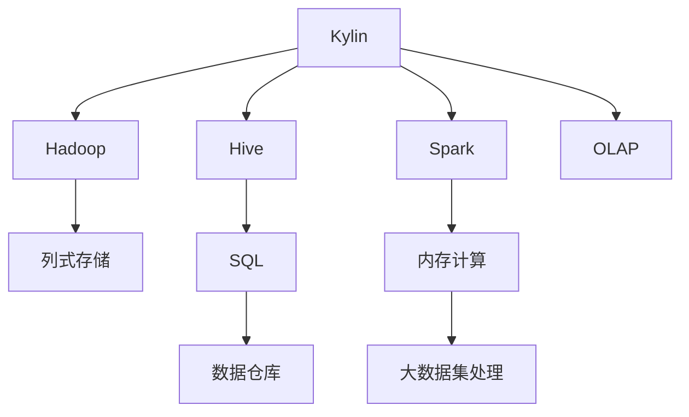

                 

# Kylin原理与代码实例讲解

> 关键词：Kylin,分布式计算,数据仓库,列式存储,低延迟查询

## 1. 背景介绍

### 1.1 问题由来
Kylin是一种流行的列式存储和分布式计算的数据仓库系统，特别适用于大规模数据的实时查询和分析。随着数据量的不断增长，传统的行式数据库难以应对查询延迟和扩展性需求。而Kylin通过将数据按列式存储和分布式处理，大幅提升了查询性能和系统可扩展性，成为数据仓库领域的重要技术之一。

### 1.2 问题核心关键点
Kylin的核心在于其独特的列式存储和分布式计算架构，能够高效处理大规模数据仓库的实时查询需求。Kylin将数据按列存储，数据行以紧凑形式存储，大大减少了磁盘I/O和缓存压力，提升查询效率。同时，通过分布式计算，Kylin能够将查询任务分配到多个节点上并行处理，提高系统扩展性和容错能力。

## 2. 核心概念与联系

### 2.1 核心概念概述

为更好地理解Kylin的工作原理和架构，本节将介绍几个密切相关的核心概念：

- Kylin：一种分布式列式存储和计算的数据仓库系统，采用Hadoop生态系统进行分布式处理和存储，支持高效的大规模数据实时查询。

- Hadoop：由Apache基金会主导的开源分布式计算框架，通过MapReduce算法将大规模数据并行处理，支持数据的可靠存储和高效访问。

- Hive：基于Hadoop的数据仓库系统，提供SQL查询接口，方便用户进行数据仓库操作和分析。

- Spark：一种快速、通用的分布式计算系统，支持内存计算、大数据集处理和机器学习等高级特性。

- 列式存储：将数据按照列的方式存储，而不是按行存储，以提高查询效率和存储密度。

- OLAP：联机分析处理，一种数据仓库应用技术，支持数据的维度和度量聚合分析。

这些核心概念之间的逻辑关系可以通过以下Mermaid流程图来展示：



这个流程图展示了大数据生态中各组件的功能和相互关系，Kylin在数据仓库领域起着核心的作用。

## 3. 核心算法原理 & 具体操作步骤
### 3.1 算法原理概述

Kylin的核心算法原理主要包括以下几个方面：

- 列式存储：Kylin将数据按列存储，每个列存储一个单独的数据块，使得每个查询只涉及到一小部分列，大大减少了磁盘I/O和缓存压力，提高查询效率。

- 分布式计算：Kylin将查询任务拆分成多个子任务，并行处理，支持大规模数据的高效处理。

- OLAP引擎：Kylin内置的OLAP引擎，支持多维分析、聚合计算等高级查询操作。

- 数据切块：Kylin将数据按块分割，每个块包含一定数量的行数据，通过预聚合将查询操作减少到单个数据块上，提高查询性能。

- 时间线管理：Kylin支持多种时间粒度管理，通过时间线，可以按时间顺序保存数据，方便时间维度的查询。

- 快速聚合：Kylin内置了快速聚合计算引擎，能够高效地处理聚合查询操作，避免重复计算。

### 3.2 算法步骤详解

Kylin的查询操作主要包括以下几个关键步骤：

**Step 1: 数据预聚合**
- 将原始数据按列存储，并按行进行划分。
- 对数据进行预聚合，将数据块按时间、维度和度量进行预聚合，生成聚合块，减少查询时的数据量。

**Step 2: 查询执行**
- 将查询任务拆分成多个子任务，每个子任务负责处理数据块的一个小部分。
- 在每个子任务上执行查询，查询操作仅涉及数据块中的特定列，大大减少I/O和缓存压力。

**Step 3: 数据拼接**
- 将子任务的结果进行拼接，生成最终查询结果。

**Step 4: 结果返回**
- 将查询结果返回给客户端。

### 3.3 算法优缺点

Kylin的算法具有以下优点：

1. 高效查询：列式存储和预聚合技术大幅提升了查询效率，适合大规模数据的实时查询。
2. 可扩展性强：分布式计算支持系统扩展，能够处理更大规模的数据集。
3. 灵活性高：支持多种时间粒度和维度计算，适应各种查询需求。
4. 高可用性：数据冗余和高容错设计，保证系统高可用性和稳定性。

同时，Kylin的算法也存在一些局限性：

1. 数据存储开销较大：列式存储虽然提高了查询效率，但会占用更多的存储空间。
2. 预聚合计算复杂：预聚合时需要提前计算聚合数据，增加了预处理和存储的复杂性。
3. 数据更新困难：预聚合后的数据块在更新时需要先计算新值，再将旧值删除，操作复杂。
4. 维护成本高：需要定期维护数据结构和索引，保证查询性能。

尽管存在这些局限性，Kylin在处理大规模数据仓库的实时查询方面仍具有显著优势，成为数据仓库领域的重要选择。

### 3.4 算法应用领域

Kylin主要应用于以下领域：

1. 商业智能分析：支持多维分析、销售预测、客户行为分析等商业智能应用。

2. 数据仓库管理：管理海量数据，支持OLAP查询、数据建模等数据仓库管理功能。

3. 大数据平台：与Hadoop、Spark等大数据平台无缝集成，支持大规模数据处理和分析。

4. 实时数据处理：支持实时数据接入、存储和查询，满足实时数据处理需求。

5. 用户行为分析：支持用户行为追踪、个性化推荐、广告投放等应用场景。

## 4. 数学模型和公式 & 详细讲解 & 举例说明
### 4.1 数学模型构建

Kylin的查询操作可以形式化表示为一个多维关系查询，包括时间、维度和度量三个维度。假设查询的时间维度为$t$，维度和度量分别为$d_1, d_2, ..., d_n$，则查询可以表示为：

$$
Q = \{(t, d_1, d_2, ..., d_n)| (t, d_1, d_2, ..., d_n) \in T \wedge (t, d_1, d_2, ..., d_n) \in D \wedge (t, d_1, d_2, ..., d_n) \in O \}
$$

其中$T$表示时间维度，$D$表示维度$d_1, d_2, ..., d_n$的取值集合，$O$表示度量$d_1, d_2, ..., d_n$的取值集合。

### 4.2 公式推导过程

Kylin的查询操作可以表示为多维聚合计算，其中查询的时间维度$t$与数据块的粒度$\Delta t$有关，查询的结果可以表示为：

$$
Q = \sum_{i=1}^{N} \prod_{j=1}^{n} (d_j^{(i)})^{o_j}
$$

其中$N$表示数据块数量，$d_j^{(i)}$表示维度$d_j$在数据块$i$上的取值，$o_j$表示度量$d_j$的取值。

### 4.3 案例分析与讲解

假设有一个包含销售数据的Kylin数据仓库，查询在2022年Q1的每个销售员的销售额。则查询可以表示为：

$$
Q = \sum_{i=1}^{N} \prod_{j=1}^{n} (d_j^{(i)})^{o_j}
$$

其中$d_1$表示销售员，$d_2$表示销售额，$o_1$表示销售时间（Q1），$o_2$表示销售额（以元为单位）。

在实际查询中，Kylin会将数据按照销售员、销售额和时间进行预聚合，生成多个聚合块。查询时，只需查找对应的聚合块，并取出特定的查询结果即可。这种预聚合和多维聚合技术，大大提高了查询效率。

## 5. 项目实践：代码实例和详细解释说明
### 5.1 开发环境搭建

在进行Kylin开发前，需要先搭建好开发环境。以下是使用Kylin官方文档搭建Kylin集群的步骤：

1. 安装Kylin和Hadoop：从Kylin官网下载最新版本的Kylin和Hadoop安装包，解压缩后安装。

2. 配置Kylin环境变量：在Kylin目录下的conf文件夹中修改配置文件，配置Kylin和Hadoop的路径。

3. 启动Kylin：在Kylin目录下执行启动脚本，启动Kylin服务。

4. 访问Kylin集群：通过Web界面访问Kylin集群，进行数据导入、查询等操作。

完成上述步骤后，即可在Kylin集群上开始开发和测试。

### 5.2 源代码详细实现

下面我们以Kylin的预聚合功能为例，给出使用Kylin进行数据预聚合的代码实现。

```python
from kylin.usage import User
from kylin.manager.context import with_kylin
from kylin.table import Table, TableQuery, TimeQuery

# 登录Kylin集群
user = User(username='root', password='root', host='localhost')
with_kylin(user=user)

# 创建数据表
table = Table('sales', data='{"columns":["salesman", "sales", "time"]}')

# 定义预聚合查询
query = TableQuery(table, TimeQuery('2022-Q1'), ['total_sales'])

# 执行预聚合查询
with_kylin(user=user):
    with_kylin(user=user):
        query.aggregate()
```

在代码中，我们使用Kylin的API创建了一个包含销售数据的表，并定义了一个预聚合查询，计算2022年Q1的每个销售员的销售额。通过调用`aggregate()`方法，Kylin会自动生成预聚合数据，存储在数据表中，供后续查询使用。

### 5.3 代码解读与分析

让我们再详细解读一下关键代码的实现细节：

- `User`类：用于创建Kylin用户，用于访问Kylin集群。
- `with_kylin`上下文管理器：用于自动管理Kylin连接的生命周期，确保连接在代码块内生效。
- `Table`类：用于创建Kylin表，并定义表的列信息。
- `TableQuery`类：用于定义查询条件和聚合计算。
- `TimeQuery`类：用于定义时间维度查询。
- `aggregate()`方法：用于执行预聚合计算，将查询结果存储在数据表中。

Kylin的API设计简洁明了，开发者可以使用简单易用的方法完成数据预聚合、查询等操作。

### 5.4 运行结果展示

在完成预聚合操作后，我们可以通过Kylin的Web界面，查看预聚合结果。具体步骤如下：

1. 登录Kylin集群。
2. 进入数据管理页面，选择相应的表。
3. 选择要查看的预聚合结果，点击“Query”按钮。
4. 查看预聚合结果的统计信息。

通过Kylin的Web界面，我们可以方便地进行数据查询和分析，快速获取所需的结果。

## 6. 实际应用场景
### 6.1 商业智能分析

Kylin在商业智能分析领域具有广泛应用。企业可以使用Kylin构建数据仓库，存储和处理各种业务数据，支持多维分析、销售预测、客户行为分析等商业智能应用。通过Kylin的高效查询和灵活查询功能，企业可以快速生成各种分析报表，帮助决策者制定更加科学的业务策略。

### 6.2 数据仓库管理

Kylin支持数据仓库管理功能，包括数据建模、数据清洗、数据导入等。企业可以使用Kylin构建自己的数据仓库，支持各种OLAP查询操作，快速生成各种维度和度量的聚合结果，方便进行数据管理和分析。

### 6.3 大数据平台

Kylin与Hadoop、Spark等大数据平台无缝集成，支持大规模数据的处理和分析。企业可以使用Kylin构建自己的大数据平台，支持各种大规模数据查询和分析任务，满足各种业务需求。

### 6.4 用户行为分析

Kylin支持用户行为追踪、个性化推荐、广告投放等应用场景。企业可以使用Kylin分析用户行为数据，进行用户画像、个性化推荐和广告投放，提升用户体验和转化率。

## 7. 工具和资源推荐
### 7.1 学习资源推荐

为了帮助开发者系统掌握Kylin的理论基础和实践技巧，这里推荐一些优质的学习资源：

1. Kylin官方文档：Kylin的详细文档，包含架构介绍、配置指导、查询操作等详细信息。

2. Hadoop官方文档：Hadoop的详细文档，包含生态系统介绍、架构设计、开发指导等详细信息。

3. Spark官方文档：Spark的详细文档，包含Spark的架构、API使用、性能调优等详细信息。

4. 《大数据技术栈实战》书籍：由知名IT专家撰写，详细介绍大数据技术栈的搭建和应用，包括Hadoop、Spark、Kylin等技术。

5. 《Kylin实战》课程：由Kylin专家讲授，涵盖Kylin的安装、配置、使用等实战操作，适合实战练习。

通过对这些资源的学习实践，相信你一定能够快速掌握Kylin的原理和使用方法，并用于解决实际的业务问题。
### 7.2 开发工具推荐

Kylin的开发工具主要集中在Hadoop、Spark和Kylin本身，以下是几款常用的开发工具：

1. Hadoop：由Apache基金会主导的开源分布式计算框架，支持大规模数据处理和存储。

2. Spark：一种快速、通用的分布式计算系统，支持内存计算、大数据集处理和机器学习等高级特性。

3. Kylin：Kylin本身是一个数据仓库系统，支持数据存储、查询和预聚合功能。

4. Hive：基于Hadoop的数据仓库系统，提供SQL查询接口，方便用户进行数据仓库操作和分析。

5. Tableau：一款流行的商业智能工具，支持与Kylin集成，方便用户进行数据可视化和分析。

合理利用这些工具，可以显著提升Kylin的开发效率，加快业务问题的解决速度。

### 7.3 相关论文推荐

Kylin的研究和应用领域广泛，以下是几篇奠基性的相关论文，推荐阅读：

1. "Kylin: Fast OLAP in Hadop with Time-Decomposed Logical Tables"：Kylin的架构设计论文，详细介绍Kylin的原理和架构。

2. "Scalable OLAP with Decomposed Logical Tables"：Kylin的预聚合算法论文，详细介绍Kylin的预聚合算法和实现。

3. "An Experimental Evaluation of OLAP Engines"：比较Kylin与其他OLAP引擎的性能和优劣，为选择适合的OLAP引擎提供参考。

4. "Distributed Data-Parallel Aggregation"：Kylin的分布式计算论文，详细介绍Kylin的分布式计算架构和实现。

5. "Building Scalable Data Models"：介绍如何使用Kylin构建大规模数据模型的实际案例，为Kylin的实际应用提供参考。

这些论文代表了大数据生态中Kylin的研究进展，通过学习这些前沿成果，可以帮助研究者把握学科前进方向，激发更多的创新灵感。

## 8. 总结：未来发展趋势与挑战
### 8.1 总结

本文对Kylin的原理和代码实例进行了全面系统的介绍。首先阐述了Kylin在数据仓库领域的重要作用，明确了列式存储和分布式计算架构的核心价值。其次，从原理到实践，详细讲解了Kylin的数学模型和查询操作，给出了Kylin的代码实现和运行结果展示。同时，本文还广泛探讨了Kylin在商业智能分析、数据仓库管理、大数据平台、用户行为分析等多个领域的应用前景，展示了Kylin的广泛适用性和高效性能。

通过本文的系统梳理，可以看到，Kylin在处理大规模数据仓库的实时查询方面具有显著优势，成为数据仓库领域的重要选择。未来，伴随数据量的不断增长和业务需求的日益复杂，Kylin在提升数据处理效率和支持更复杂查询操作方面将发挥越来越重要的作用。

### 8.2 未来发展趋势

展望未来，Kylin将呈现以下几个发展趋势：

1. 数据模型支持：Kylin将支持更加复杂的数据模型，包括关系型数据模型、文档数据模型等，支持更加多样化的数据存储和查询。

2. 分布式计算优化：Kylin将优化分布式计算架构，支持更多的计算节点和更大的数据集，提高系统的扩展性和容错能力。

3. 多维分析增强：Kylin将支持更多维度的数据分析，包括时间、空间、用户等维度，满足更多的业务需求。

4. 实时查询优化：Kylin将优化查询性能，支持更高的实时查询需求，满足更加复杂的查询操作。

5. 数据处理增强：Kylin将支持更多的数据处理功能，包括数据清洗、数据转换、数据合并等，支持更加灵活的数据操作。

6. 用户体验提升：Kylin将优化Web界面和客户端工具，提供更加友好和易用的用户体验。

以上趋势凸显了Kylin在大数据生态中的重要地位，Kylin的发展将进一步提升数据仓库的查询效率和扩展性，为各种业务场景提供可靠的数据支持。

### 8.3 面临的挑战

尽管Kylin已经取得了不错的成绩，但在迈向更加智能化、普适化应用的过程中，它仍面临着诸多挑战：

1. 数据存储开销：列式存储虽然提高了查询效率，但会占用更多的存储空间。如何优化数据存储，减少存储开销，将是未来的一大挑战。

2. 预聚合计算复杂：预聚合时需要提前计算聚合数据，增加了预处理和存储的复杂性。如何优化预聚合算法，提高查询效率，将是未来的一大挑战。

3. 数据更新困难：预聚合后的数据块在更新时需要先计算新值，再将旧值删除，操作复杂。如何优化数据更新机制，简化数据更新操作，将是未来的一大挑战。

4. 维护成本高：需要定期维护数据结构和索引，保证查询性能。如何降低维护成本，提升系统稳定性，将是未来的一大挑战。

5. 扩展性不足：Kylin目前主要用于大规模数据仓库的查询操作，对于实时数据处理和在线查询等场景，扩展性仍有限。如何优化扩展性，支持更多实时数据处理，将是未来的一大挑战。

6. 技术生态支持不足：Kylin主要在Hadoop和Spark生态中运行，如何更好地与其他生态系统集成，提升生态系统的支持度，将是未来的一大挑战。

正视Kylin面临的这些挑战，积极应对并寻求突破，将是大数据生态中Kylin走向成熟的必由之路。相信随着学界和产业界的共同努力，这些挑战终将一一被克服，Kylin必将在构建人机协同的智能时代中扮演越来越重要的角色。

### 8.4 研究展望

未来，Kylin需要在以下几个方面进行进一步的研究和改进：

1. 优化数据模型支持：支持更加复杂的数据模型，支持更多的数据存储和查询方式。

2. 优化分布式计算：支持更多的计算节点和更大的数据集，提升系统的扩展性和容错能力。

3. 优化预聚合算法：优化预聚合计算，提高查询效率，减少预处理和存储的复杂性。

4. 优化数据更新机制：优化数据更新操作，简化数据更新过程，提升系统的维护效率。

5. 优化实时查询性能：优化实时查询性能，支持更高的实时查询需求，满足更加复杂的查询操作。

6. 优化用户体验：优化Web界面和客户端工具，提供更加友好和易用的用户体验。

这些研究方向将进一步提升Kylin的性能和可扩展性，为各种业务场景提供更加可靠的数据支持。相信在未来的发展中，Kylin将继续引领数据仓库领域的技术进步，为大数据生态贡献更多的价值。

## 9. 附录：常见问题与解答

**Q1：Kylin和Hadoop/Spark的区别是什么？**

A: Kylin是一个专门的数据仓库系统，支持大规模数据存储和预聚合计算，适合进行多维数据分析。Hadoop和Spark则更侧重于大规模数据的存储和计算，支持各种数据处理任务。Kylin通常与Hadoop和Spark结合使用，在分布式计算和存储框架上运行，可以高效地支持Kylin的数据存储和预聚合操作。

**Q2：Kylin和传统关系型数据库的区别是什么？**

A: Kylin是一种列式存储和分布式计算的数据仓库系统，支持大规模数据的实时查询和分析。传统关系型数据库则是基于行式存储和SQL查询的数据库系统，适用于小规模数据和复杂事务处理。Kylin主要针对大规模数据的实时查询和分析，支持多维分析、预聚合等操作，适合处理大规模数据仓库任务。

**Q3：Kylin的预聚合功能有哪些优势？**

A: 预聚合功能是Kylin的核心优势之一，能够显著提升查询效率。通过预聚合，Kylin可以将查询操作减少到单个数据块上，避免了对大规模数据的全扫描，减少了I/O和缓存压力。同时，预聚合还能支持时间维度查询，方便进行时间分析。预聚合功能是Kylin快速高效查询的核心保障。

**Q4：Kylin的Web界面如何使用？**

A: 使用Kylin的Web界面，可以方便地进行数据导入、查询、预聚合等操作。具体步骤如下：

1. 登录Kylin集群。
2. 进入数据管理页面，选择要导入或查询的数据表。
3. 选择相应的操作，如导入数据、执行查询、预聚合等。
4. 查看查询结果和预聚合数据。

通过Kylin的Web界面，可以方便地进行各种数据操作，提升数据管理效率。

---

作者：禅与计算机程序设计艺术 / Zen and the Art of Computer Programming

