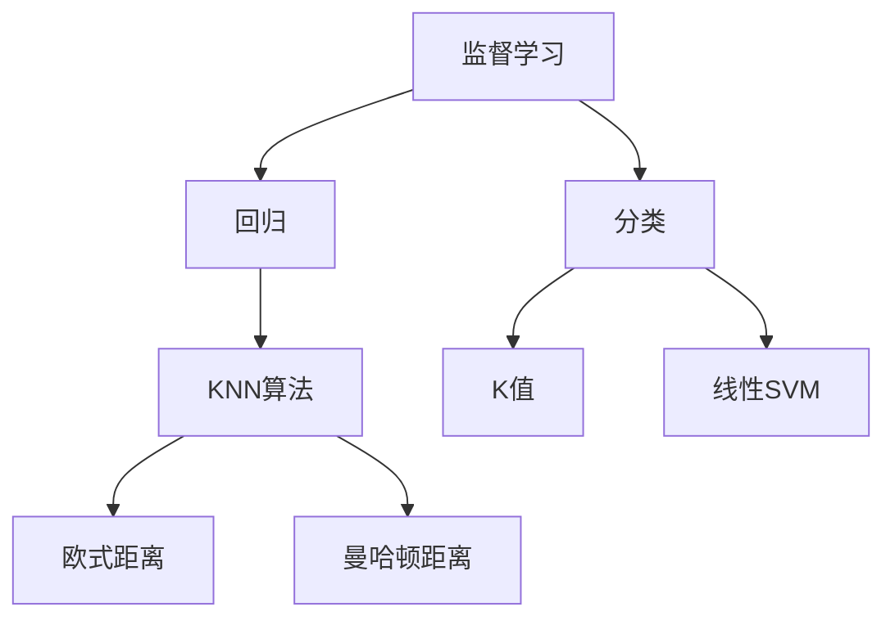

                 

# K-最近邻（KNN）原理与代码实例讲解

> 关键词：K-最近邻,监督学习,分类,回归,代码实现

## 1. 背景介绍

### 1.1 问题由来

在机器学习领域，分类和回归问题是最常见且基础的任务。传统的基于统计学的方法，如逻辑回归、决策树等，通常需要大量特征工程，容易过拟合，且在处理复杂问题时效果不佳。1968年，美国统计学家Edwin Flanders Satorra和IBM工程师Arthur Samuel提出了一种简单直观、易于理解和实现的方法——K-最近邻（K-Nearest Neighbors，简称KNN）算法，通过简单的"以邻为类"的思想，将输入样本分类到离其最近的K个邻居中。KNN算法因其易于理解和实现，且不需要做复杂的特征工程，在实际应用中得到了广泛应用。

### 1.2 问题核心关键点

KNN算法是一种基于实例的监督学习算法，其核心在于通过计算待预测样本与已有样本之间的距离（通常是欧式距离），找到与其最近的K个邻居，并将这些邻居的标签进行加权平均或简单投票，以得到待预测样本的分类结果。KNN算法的性能高度依赖于K值的选择和距离度量的定义。选择过小的K值会导致模型泛化能力差，易受噪声干扰；选择过大的K值则会导致模型丧失对细节的敏感性，分类效果下降。

## 2. 核心概念与联系

### 2.1 核心概念概述

为更好地理解KNN算法的原理和应用，本节将介绍几个关键概念：

- 监督学习（Supervised Learning）：使用带有标签的训练数据，通过学习数据和标签之间的映射关系，使模型能够对新数据进行分类或回归的机器学习方法。KNN算法即一种监督学习算法。
- 分类（Classification）：将输入数据分为有限个类别中的某一个的机器学习任务。KNN算法主要用于分类任务。
- 回归（Regression）：预测一个或多个连续值的机器学习任务。KNN算法也可以用于回归任务，但需要额外的预处理步骤。
- 距离度量（Distance Metric）：衡量数据点之间相似度的度量方法。KNN算法通常使用欧式距离或曼哈顿距离作为距离度量。
- K值（K Value）：在KNN算法中，K值是指用于确定邻域大小的参数，通常取值1到10之间。
- 线性SVM（Linear SVM）：KNN算法是线性SVM的一种特例，当K值趋于无穷大时，KNN算法等价于线性SVM。

这些概念之间的逻辑关系可以通过以下Mermaid流程图来展示：



这个流程图展示了一些关键概念之间的关联：

1. 监督学习是KNN算法的基础。
2. KNN算法主要用于分类任务。
3. 距离度量是KNN算法中的重要组成部分。
4. K值的选择对KNN算法性能有重要影响。
5. 线性SVM可以看作KNN算法的一种特例。

## 3. 核心算法原理 & 具体操作步骤

### 3.1 算法原理概述

KNN算法的基本思想是通过计算输入样本与已有样本之间的距离，找到与待预测样本最近的K个邻居，并根据这些邻居的标签进行分类。假设训练数据集为$D=\{(x_1,y_1),(x_2,y_2),\ldots,(x_N,y_N)\}$，其中$x_i \in R^d$为样本特征，$y_i \in C$为标签。对于待预测的样本$x_0$，假设其最近的K个邻居为$x_{i_1},x_{i_2},\ldots,x_{i_K}$。根据KNN算法的思想，将$x_0$分为与其距离最近的K个邻居中最常见的类别，即：

$$
\hat{y}(x_0) = \arg\min_{c \in C} \sum_{k=1}^K \mathbb{I}(y_{i_k}=c)
$$

其中$\mathbb{I}$为示性函数，当$y_{i_k}=c$时，示性函数值为1，否则为0。

### 3.2 算法步骤详解

KNN算法的具体步骤如下：

**Step 1: 准备数据集**
- 收集标注数据集$D=\{(x_i,y_i)\}_{i=1}^N$，$x_i \in R^d$为样本特征，$y_i \in C$为标签。
- 将数据集分为训练集$D_{train}=\{(x_1,y_1),(x_2,y_2),\ldots,(x_M,y_M)\}$和测试集$D_{test}=\{(x_{M+1},y_{M+1}),(x_{M+2},y_{M+2}),\ldots,(x_N,y_N)\}$。

**Step 2: 选择距离度量**
- 根据任务需求，选择适当的距离度量。常用的距离度量包括欧式距离和曼哈顿距离。
- 欧式距离：$d(x_i,x_j)=\sqrt{\sum_{k=1}^d (x_{ik}-x_{jk})^2}$，适用于高维数据。
- 曼哈顿距离：$d(x_i,x_j)=\sum_{k=1}^d |x_{ik}-x_{jk}|$，适用于低维数据。

**Step 3: 确定K值**
- 选择合适的K值，通常取值1到10之间。
- K值过小可能导致过拟合，K值过大可能导致欠拟合。

**Step 4: 计算距离**
- 对于待预测样本$x_0$，计算其与训练集中每个样本的距离$d(x_0,x_i)$。
- 根据距离度量计算公式，计算出所有距离值。

**Step 5: 选取最近邻**
- 根据距离大小，选择距离$x_0$最近的K个样本$x_{i_1},x_{i_2},\ldots,x_{i_K}$。

**Step 6: 预测结果**
- 根据K个最近邻的标签$y_{i_1},y_{i_2},\ldots,y_{i_K}$，通过投票或加权平均方式得到待预测样本$x_0$的预测结果$\hat{y}(x_0)$。

### 3.3 算法优缺点

KNN算法具有以下优点：

- 算法简单直观，易于实现和理解。
- 对于样本空间中的任意分布，理论上都能取得优良的分类效果。
- 对于高维数据具有较好的表现。

同时，该算法也存在以下缺点：

- 计算复杂度高，需要计算所有样本的距离。
- 对于大规模数据集，计算和存储成本较高。
- 对于噪声数据和异常值敏感，容易受到噪声干扰。
- 对于样本分布不均衡的数据，分类效果较差。

尽管存在这些局限性，KNN算法仍是一种简单且有效的监督学习算法，适用于许多实际应用场景。

### 3.4 算法应用领域

KNN算法在多个领域得到了广泛应用，包括：

- 图像识别：将图像特征向量作为输入样本，根据最近邻进行分类。
- 文本分类：将文本特征向量作为输入样本，根据最近邻进行分类。
- 推荐系统：根据用户历史行为和物品特征，找到最近邻物品，进行推荐。
- 异常检测：在低维数据中，通过计算最近邻的个数，检测异常点。
- 数据挖掘：根据数据特征和标签，找到最近邻数据点，进行聚类或关联规则挖掘。

## 4. 数学模型和公式 & 详细讲解 & 举例说明

### 4.1 数学模型构建

KNN算法的数学模型可以通过以下步骤进行构建：

- 定义训练数据集$D=\{(x_1,y_1),(x_2,y_2),\ldots,(x_N,y_N)\}$，其中$x_i \in R^d$为样本特征，$y_i \in C$为标签。
- 定义待预测样本$x_0 \in R^d$，其中$d$为特征维度。
- 定义距离度量函数$d(x_i,x_j)$，其中$x_i,x_j \in R^d$。
- 定义K值$K \in N^+$，通常取值1到10之间。
- 定义示性函数$\mathbb{I}$，当$y_{i_k}=c$时，$\mathbb{I}(y_{i_k}=c)=1$，否则为0。

### 4.2 公式推导过程

以欧式距离度量为例子，KNN算法的预测公式可以推导如下：

设训练数据集为$D=\{(x_1,y_1),(x_2,y_2),\ldots,(x_N,y_N)\}$，待预测样本为$x_0$，欧式距离度量为$d(x_i,x_j)=\sqrt{\sum_{k=1}^d (x_{ik}-x_{jk})^2}$。对于待预测样本$x_0$，找到其最近的K个邻居$x_{i_1},x_{i_2},\ldots,x_{i_K}$，根据这些邻居的标签进行加权平均或简单投票，得到预测结果：

$$
\hat{y}(x_0) = \arg\min_{c \in C} \sum_{k=1}^K \mathbb{I}(y_{i_k}=c)
$$

具体推导步骤如下：

- 首先，计算待预测样本$x_0$与训练集中每个样本的距离$d(x_0,x_i)$，得到距离向量$d(x_0)=(d(x_0,x_1),d(x_0,x_2),\ldots,d(x_0,x_N))$。
- 根据距离大小，将训练集中所有样本按照距离大小排序，得到距离从小到大排列的样本列表$L_{d}$。
- 选取距离$x_0$最近的K个样本$x_{i_1},x_{i_2},\ldots,x_{i_K}$。
- 根据K个最近邻的标签$y_{i_1},y_{i_2},\ldots,y_{i_K}$，计算示性函数$\mathbb{I}(y_{i_k}=c)$，得到示性向量$\mathbb{I}(x_0)=\left(\mathbb{I}(y_{i_1}=c),\mathbb{I}(y_{i_2}=c),\ldots,\mathbb{I}(y_{i_K}=c)\right)$。
- 对示性向量$\mathbb{I}(x_0)$进行求和，得到$\sum_{k=1}^K \mathbb{I}(y_{i_k}=c)$。
- 对于每个类别$c \in C$，计算$\sum_{k=1}^K \mathbb{I}(y_{i_k}=c)$的总和，得到$\sum_{k=1}^K \mathbb{I}(y_{i_k}=c)$。
- 选取最小值$\min_{c \in C} \sum_{k=1}^K \mathbb{I}(y_{i_k}=c)$，作为预测结果$\hat{y}(x_0)$。

### 4.3 案例分析与讲解

以手写数字识别为例，我们可以将每个数字的像素点作为特征向量，将其转化为高维向量。在训练集中选择KNN算法作为分类器，进行训练和测试。具体步骤如下：

- 准备训练数据集，其中每个样本是一个28x28的灰度图像，将其转化为784维的向量。
- 对于待预测的样本，将其转化为同样维度的向量。
- 选择欧式距离度量，计算待预测样本与训练集中每个样本的距离。
- 根据距离大小，选择距离$x_0$最近的K个样本。
- 根据K个最近邻的标签，计算示性函数，进行加权平均或简单投票，得到预测结果。
- 在测试集上进行评估，对比KNN算法和其他分类器的性能。

通过实验验证，可以看到KNN算法在手写数字识别任务中具有较好的分类效果。

## 5. 项目实践：代码实例和详细解释说明

### 5.1 开发环境搭建

在进行KNN算法实现前，我们需要准备好开发环境。以下是使用Python进行Scikit-learn开发的环境配置流程：

1. 安装Anaconda：从官网下载并安装Anaconda，用于创建独立的Python环境。

2. 创建并激活虚拟环境：
```bash
conda create -n sklearn-env python=3.8 
conda activate sklearn-env
```

3. 安装Scikit-learn：
```bash
pip install scikit-learn
```

4. 安装各类工具包：
```bash
pip install numpy pandas scikit-image matplotlib seaborn joblib jupyter notebook ipython
```

完成上述步骤后，即可在`sklearn-env`环境中开始KNN算法的实现。

### 5.2 源代码详细实现

下面我们以手写数字识别任务为例，给出使用Scikit-learn实现KNN算法的代码实现。

首先，导入必要的库和数据集：

```python
import numpy as np
import matplotlib.pyplot as plt
from sklearn import datasets
from sklearn.model_selection import train_test_split
from sklearn.metrics import accuracy_score
from sklearn.neighbors import KNeighborsClassifier
```

然后，加载手写数字数据集，并进行预处理：

```python
digits = datasets.load_digits()
X = digits.data
y = digits.target
X_train, X_test, y_train, y_test = train_test_split(X, y, test_size=0.2, random_state=42)
```

接着，定义KNN模型并进行训练：

```python
k = 3
knn = KNeighborsClassifier(n_neighbors=k)
knn.fit(X_train, y_train)
```

最后，进行预测和评估：

```python
y_pred = knn.predict(X_test)
accuracy = accuracy_score(y_test, y_pred)
print(f"Accuracy: {accuracy:.2f}")
```

完整代码如下：

```python
import numpy as np
import matplotlib.pyplot as plt
from sklearn import datasets
from sklearn.model_selection import train_test_split
from sklearn.metrics import accuracy_score
from sklearn.neighbors import KNeighborsClassifier

digits = datasets.load_digits()
X = digits.data
y = digits.target
X_train, X_test, y_train, y_test = train_test_split(X, y, test_size=0.2, random_state=42)

k = 3
knn = KNeighborsClassifier(n_neighbors=k)
knn.fit(X_train, y_train)
y_pred = knn.predict(X_test)
accuracy = accuracy_score(y_test, y_pred)
print(f"Accuracy: {accuracy:.2f}")
```

### 5.3 代码解读与分析

让我们再详细解读一下关键代码的实现细节：

- `train_test_split`方法：将数据集划分为训练集和测试集，用于模型训练和评估。
- `KNeighborsClassifier`类：Scikit-learn中用于实现KNN算法的类，接受K值作为参数。
- `fit`方法：训练模型，传入训练集数据和标签。
- `predict`方法：对测试集进行预测。
- `accuracy_score`方法：计算预测结果与真实标签的准确率。

## 6. 实际应用场景

### 6.1 金融风险评估

KNN算法在金融风险评估中具有广泛应用。银行和金融机构可以利用KNN算法对客户的信用记录、消费行为等数据进行分析，判断客户的信用风险等级。具体而言，可以收集客户的各类行为数据，根据这些行为数据计算出距离度量，找到与其最近的K个客户，根据这些客户的信用等级，计算出待评估客户的信用等级。

### 6.2 医学诊断

KNN算法在医学诊断中也得到了应用。医院可以利用KNN算法对病人的症状、体检结果等数据进行分析，判断病人的疾病类型。具体而言，可以收集病人的各类症状数据，根据这些症状数据计算出距离度量，找到与其最近的K个病人，根据这些病人的诊断结果，计算出待评估病人的诊断结果。

### 6.3 推荐系统

KNN算法在推荐系统中也得到了广泛应用。电子商务平台可以利用KNN算法对用户的浏览、购买行为进行分析，推荐用户可能感兴趣的商品。具体而言，可以收集用户的各类行为数据，根据这些行为数据计算出距离度量，找到与其最近的K个用户，根据这些用户的购买历史，推荐出待评估用户可能感兴趣的商品。

## 7. 工具和资源推荐

### 7.1 学习资源推荐

为了帮助开发者系统掌握KNN算法的理论基础和实践技巧，这里推荐一些优质的学习资源：

1. 《Python机器学习》（Python Machine Learning）：由Sebastian Raschka和Vahid Mirjalili编写，全面介绍了机器学习的基本概念和经典算法，包括KNN算法。

2. CS229《机器学习》课程：斯坦福大学开设的机器学习明星课程，有Lecture视频和配套作业，带你深入理解机器学习的基本原理。

3. 《Pattern Recognition and Machine Learning》（模式识别与机器学习）：由Christopher Bishop编写，介绍了机器学习的基本理论和算法，包括KNN算法。

4. Scikit-learn官方文档：Scikit-learn库的官方文档，提供了KNN算法的详细实现和应用样例，是学习KNN算法的必备资料。

5. Kaggle竞赛：Kaggle是一个数据科学竞赛平台，提供各类KNN算法的竞赛任务，通过实践竞赛，可以提升KNN算法的应用能力。

通过对这些资源的学习实践，相信你一定能够快速掌握KNN算法的精髓，并用于解决实际的机器学习问题。

### 7.2 开发工具推荐

KNN算法的实现通常使用Scikit-learn库，利用其简单易用的API，可以快速实现KNN算法。以下是几个常用的开发工具：

1. PyTorch：基于Python的开源深度学习框架，提供了丰富的神经网络实现，可用于复杂机器学习任务的开发。

2. TensorFlow：由Google主导开发的开源深度学习框架，生产部署方便，适合大规模工程应用。

3. Scikit-learn：Python中常用的机器学习库，提供了简单易用的API，包括KNN算法的实现。

4. Keras：基于Python的高层神经网络API，简单易用，适合快速搭建和训练模型。

5. Jupyter Notebook：Python中常用的开发工具，支持实时展示代码执行结果，适合数据科学家的交互式开发。

合理利用这些工具，可以显著提升KNN算法的开发效率，加快创新迭代的步伐。

### 7.3 相关论文推荐

KNN算法的经典研究源于学术界的研究成果。以下是几篇奠基性的相关论文，推荐阅读：

1. Cover, T. M. and Hart, P. E. (1967). Nearest neighbor pattern classification. IEEE Transactions on Information Theory.

2. Huang, G. B., Xu, M., & Chen, H. S. (2006). Nearest neighbor classification in high-dimensional space: some fundamental results. IEEE Transactions on Information Theory, 52(8), 3611-3623.

3. Zhang, T., & Ramakrishnan, B. (2006). Nearest neighbor classification in high-dimensional space. Machine Learning, 67(3), 173-189.

这些论文代表了大规模KNN算法的理论研究进展。通过学习这些前沿成果，可以帮助研究者把握KNN算法的未来发展方向，激发更多的创新灵感。

## 8. 总结：未来发展趋势与挑战

### 8.1 总结

本文对K-最近邻（KNN）算法进行了全面系统的介绍。首先阐述了KNN算法的背景和核心原理，明确了KNN算法在分类、回归任务中的独特优势。其次，从原理到实践，详细讲解了KNN算法的数学模型和实现步骤，给出了KNN算法的代码实现示例。同时，本文还探讨了KNN算法在金融风险评估、医学诊断、推荐系统等多个领域的应用场景，展示了KNN算法的强大应用潜力。此外，本文精选了KNN算法的各类学习资源，力求为读者提供全方位的技术指引。

通过本文的系统梳理，可以看到，KNN算法因其简单直观、易于实现的特点，在实际应用中得到了广泛应用。未来，随着数据规模和复杂度的不断提升，KNN算法将在更多领域得到应用，为机器学习技术的发展注入新的活力。

### 8.2 未来发展趋势

展望未来，KNN算法的应用前景和研究热点将呈现以下几个趋势：

1. 多模态数据融合：KNN算法可以与其他模态的数据结合，如视觉、语音等，提升分类和回归的效果。

2. 深度学习融合：KNN算法可以与深度学习模型结合，如KNN-SVM、KNN-Recurrent等，提升模型的表达能力和泛化能力。

3. 在线学习：KNN算法可以实时更新模型参数，适应数据流变化，实现在线分类和回归。

4. 大数据处理：KNN算法可以与分布式计算框架结合，如Hadoop、Spark等，实现大规模数据处理。

5. 领域适应：KNN算法可以结合领域适应的思想，提升模型在不同领域的泛化能力。

6. 超参数优化：KNN算法中的K值需要根据数据集的特点进行调整，未来可以结合优化算法，如网格搜索、随机搜索等，自动选择最优的K值。

以上趋势展示了KNN算法的未来发展方向，这些方向的探索和研究，必将进一步提升KNN算法的性能和应用范围，为机器学习技术的发展带来新的突破。

### 8.3 面临的挑战

尽管KNN算法已经取得了一定的应用成果，但在面对大数据、高维数据、在线学习等复杂场景时，其性能和适用性仍面临诸多挑战：

1. 计算复杂度高：KNN算法需要计算所有样本的距离，在大规模数据集上计算成本高。

2. 内存占用大：KNN算法需要存储所有样本的数据，在内存受限的环境下无法应用。

3. 噪声和异常值：KNN算法对噪声和异常值敏感，容易受到干扰。

4. 高维数据：KNN算法在高维数据上表现不佳，计算距离度量时容易产生维数灾难。

5. 模型可解释性：KNN算法是一种基于实例的算法，缺乏模型内部的可解释性。

6. 超参数选择：KNN算法中的K值需要根据数据集的特点进行调整，但如何选择最优的K值仍是一个难题。

面对这些挑战，需要进一步探索和研究KNN算法的优化方法和改进方向，以应对复杂的应用场景。

### 8.4 研究展望

未来，KNN算法的研究方向可以从以下几个方面寻求新的突破：

1. 分布式KNN：将KNN算法与分布式计算框架结合，实现大规模数据集上的高效处理。

2. 近似KNN：通过采样或剪枝等技术，减少KNN算法中的计算量，提升计算效率。

3. 在线KNN：结合在线学习的方法，实现KNN算法的实时更新和优化。

4. 深度KNN：将KNN算法与深度学习模型结合，提升模型的表达能力和泛化能力。

5. 多模态KNN：结合视觉、语音、文本等模态数据，提升KNN算法的分类和回归效果。

6. 领域适应KNN：结合领域适应的思想，提升KNN算法在不同领域的泛化能力。

这些研究方向的探索，必将引领KNN算法走向更加高效、灵活和广泛的应用，为机器学习技术的发展带来新的突破。

## 9. 附录：常见问题与解答

**Q1：KNN算法的K值如何选择？**

A: K值的选择对KNN算法的性能有重要影响。通常可以通过交叉验证或网格搜索等方法，自动选择最优的K值。一般来说，K值的选择范围为1到10之间，K值过小可能导致过拟合，K值过大会导致欠拟合。

**Q2：KNN算法在高维数据中的表现如何？**

A: KNN算法在高维数据中表现不佳，计算距离度量时容易产生维数灾难。一种解决方法是使用近似KNN算法，如KD-Tree等，通过构建数据结构来加速计算。

**Q3：KNN算法如何处理噪声和异常值？**

A: KNN算法对噪声和异常值敏感，容易受到干扰。一种解决方法是在距离计算中引入权重，如使用加权KNN算法，根据距离大小进行加权处理。

**Q4：KNN算法的计算复杂度是多少？**

A: KNN算法的计算复杂度为$O(N)$，其中$N$为训练样本数。在实际应用中，需要根据数据集大小和硬件环境进行选择，以平衡计算速度和精度。

**Q5：KNN算法有哪些优缺点？**

A: KNN算法的优点是算法简单直观，易于实现和理解，且对于样本空间中的任意分布，理论上都能取得优良的分类效果。缺点是计算复杂度高，需要计算所有样本的距离，对于大规模数据集，计算和存储成本较高。

通过本文的系统梳理，可以看到，KNN算法作为一种简单且有效的监督学习算法，在实际应用中具有广泛的应用前景。随着数据规模和复杂度的不断提升，KNN算法将在更多领域得到应用，为机器学习技术的发展注入新的活力。未来，通过进一步的优化和改进，KNN算法必将在机器学习领域发挥更加重要的作用。

---

作者：禅与计算机程序设计艺术 / Zen and the Art of Computer Programming

