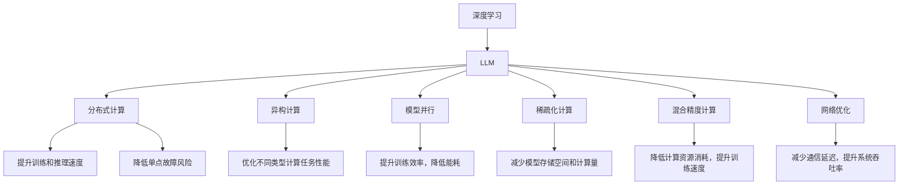

                 

# LLM:计算机架构的新时代

> 关键词：大语言模型(LLM),计算架构,深度学习,分布式计算,异构计算,机器学习,人工智能,神经网络,模型训练

## 1. 背景介绍

### 1.1 问题由来

近年来，随着深度学习技术的飞速发展，尤其是大语言模型(LLM)的突破性应用，计算机架构已经进入了一个全新的时代。LLM，如GPT-3、BERT等，通过在大规模无标签文本数据上进行自监督预训练，学习到了丰富的语言知识和语义表示，能够进行复杂的自然语言理解和生成。这些模型具有强大的泛化能力和语言表达能力，能够高效地处理各种自然语言处理(NLP)任务，如文本分类、信息检索、问答系统等。

然而，LLM的高性能和复杂度对计算机架构提出了新的挑战。在传统的冯诺依曼架构下，数据流和控制流线性串行执行，难以满足LLM对计算和存储需求的高并行性。与此同时，随着计算任务的复杂度不断提升，单核CPU性能瓶颈日益突出。这些问题催生了新的计算架构研究，旨在提高计算和存储的效率，提升系统的可扩展性和灵活性。

### 1.2 问题核心关键点

为了解决上述问题，研究者们提出了多种基于深度学习的计算架构，这些架构旨在提升模型训练和推理的速度，降低能耗，提升系统效率。以下是这些关键点：

1. **分布式计算**：通过多机协同处理，提升模型的训练和推理速度，降低单点故障风险。
2. **异构计算**：将GPU、TPU等异构加速器与CPU协同工作，优化不同类型计算任务的性能。
3. **模型并行**：将模型分为多个子模型并行训练，提升训练效率，降低能耗。
4. **稀疏化计算**：通过量化和稀疏化处理，减少模型存储空间和计算量，提高模型训练和推理速度。
5. **混合精度计算**：通过使用混合精度数据类型，在保证精度的同时，降低计算资源消耗，提升训练速度。
6. **网络优化**：优化网络通信协议和数据传输方式，减少通信延迟，提升系统吞吐率。

这些关键点为计算机架构的发展指明了方向，推动了深度学习和LLM技术的广泛应用。

## 2. 核心概念与联系

### 2.1 核心概念概述

为了更好地理解基于深度学习的计算架构，本节将介绍几个核心概念及其相互关系：

- **深度学习**：通过多层次神经网络对复杂数据进行学习和表示，广泛应用于计算机视觉、自然语言处理、语音识别等领域。
- **大语言模型(LLM)**：在大规模无标签文本数据上进行自监督预训练，学习到丰富的语言知识和语义表示，能够进行复杂的自然语言理解和生成。
- **分布式计算**：通过多机协同处理，提升模型的训练和推理速度，降低单点故障风险。
- **异构计算**：将GPU、TPU等异构加速器与CPU协同工作，优化不同类型计算任务的性能。
- **模型并行**：将模型分为多个子模型并行训练，提升训练效率，降低能耗。
- **稀疏化计算**：通过量化和稀疏化处理，减少模型存储空间和计算量，提高模型训练和推理速度。
- **混合精度计算**：通过使用混合精度数据类型，在保证精度的同时，降低计算资源消耗，提升训练速度。
- **网络优化**：优化网络通信协议和数据传输方式，减少通信延迟，提升系统吞吐率。

这些核心概念之间通过一系列复杂的交互和协同，共同构成了基于深度学习的计算架构框架。

### 2.2 核心概念原理和架构的 Mermaid 流程图(Mermaid 流程节点中不要有括号、逗号等特殊字符)



这个流程图展示了深度学习和LLM与其他核心概念之间的关系，揭示了各概念之间相互作用和协同的机制。

## 3. 核心算法原理 & 具体操作步骤

### 3.1 算法原理概述

基于深度学习的计算架构的核心算法原理主要包括分布式计算、异构计算、模型并行、稀疏化计算、混合精度计算和网络优化等。这些算法通过不同技术手段提升计算和存储效率，从而提升深度学习和LLM的性能和可扩展性。

### 3.2 算法步骤详解

下面以基于深度学习的分布式计算为例，详细讲解其算法步骤：

1. **数据分割**：将大规模数据集分割成多个子集，分发到多个计算节点进行处理。
2. **任务分配**：根据节点计算能力，将数据分割任务分配给各个节点。
3. **模型训练**：在各个节点上独立进行模型训练，利用分布式优化算法（如SGD、Adam等）更新模型参数。
4. **参数同步**：通过异步通信机制，将各个节点的模型参数同步更新，保证模型一致性。
5. **模型评估**：在各个节点上对模型进行评估，计算损失函数和梯度。
6. **参数优化**：根据评估结果，优化模型参数，更新模型状态。

### 3.3 算法优缺点

基于深度学习的计算架构具有以下优点：

1. **提升性能**：通过多机协同处理，大大提升模型的训练和推理速度。
2. **可扩展性**：根据计算资源需求，可以动态扩展计算节点数量，提高系统的可扩展性。
3. **容错性**：通过数据和任务的分散处理，降低单点故障风险，提高系统的可靠性。

然而，这些架构也存在一些缺点：

1. **通信开销**：数据分割和参数同步会增加通信开销，降低系统效率。
2. **资源管理复杂**：需要高效管理计算资源，优化数据和任务调度，增加了系统复杂性。
3. **能耗高**：多机协同处理会增加能耗，需要在设计和实施过程中考虑节能问题。

### 3.4 算法应用领域

基于深度学习的计算架构已经在多个领域得到广泛应用，以下是几个典型应用：

- **科学研究**：在深度学习和LLM研究中，分布式计算、异构计算、模型并行等技术被广泛应用于大规模模型的训练和推理。
- **医疗健康**：在医疗影像分析、基因组学等领域，深度学习和LLM模型需要处理大规模数据，分布式计算和异构计算技术提高了系统的效率和可靠性。
- **金融科技**：在金融风控、智能投顾等领域，分布式计算和混合精度计算技术被用于提升模型的训练和推理速度。
- **自动驾驶**：在自动驾驶领域，模型并行和稀疏化计算技术被应用于实时处理大量传感器数据。
- **云计算**：在云计算平台中，分布式计算和网络优化技术被广泛应用于大规模数据的处理和存储。

## 4. 数学模型和公式 & 详细讲解 & 举例说明

### 4.1 数学模型构建

基于深度学习的计算架构的数学模型通常包括以下几个关键部分：

1. **数据表示**：将输入数据表示为向量或张量形式。
2. **模型结构**：定义神经网络的结构，包括卷积层、全连接层、池化层、激活函数等。
3. **损失函数**：定义模型的输出和真实标签之间的误差函数，如交叉熵、均方误差等。
4. **优化算法**：定义模型参数的优化算法，如SGD、Adam等。
5. **评估指标**：定义模型在测试集上的评估指标，如准确率、召回率、F1值等。

### 4.2 公式推导过程

以线性回归模型为例，推导其最小二乘法求解过程。

设训练集为 $D=\{(x_i, y_i)\}_{i=1}^N$，其中 $x_i \in \mathbb{R}^d$ 为输入向量，$y_i \in \mathbb{R}$ 为输出标签。假设线性回归模型为 $y = \theta^T x + b$，其中 $\theta \in \mathbb{R}^d$ 为模型参数，$b \in \mathbb{R}$ 为偏置项。

最小二乘法的目标是找到最优的 $\theta$，使得模型对所有训练数据的预测误差最小。定义均方误差为损失函数：

$$
J(\theta) = \frac{1}{N} \sum_{i=1}^N (y_i - \theta^T x_i - b)^2
$$

通过求偏导数并令其为零，可以找到最优的 $\theta$：

$$
\frac{\partial J(\theta)}{\partial \theta} = -\frac{2}{N} \sum_{i=1}^N (y_i - \theta^T x_i - b) x_i = 0
$$

解得：

$$
\theta = (X^T X)^{-1} X^T y
$$

其中 $X = [x_1, x_2, ..., x_N]^T \in \mathbb{R}^{N\times d}$ 为输入向量的矩阵。

### 4.3 案例分析与讲解

以BERT模型的分布式训练为例，分析其分布式优化算法的设计。

BERT模型在分布式计算中，采用了参数服务器架构（PS）和梯度更新策略。其步骤如下：

1. 数据分割：将训练集 $D$ 分割成 $K$ 个子集 $D_k$，每个子集由一个计算节点负责训练。
2. 参数初始化：每个节点初始化本地参数 $\theta_k$。
3. 模型训练：在每个节点上独立进行模型训练，计算损失函数和梯度。
4. 参数同步：每个节点将本地参数 $\theta_k$ 发送到参数服务器，参数服务器计算全局平均值 $\hat{\theta}$。
5. 参数更新：每个节点根据参数服务器发送的平均参数 $\hat{\theta}$ 更新本地参数 $\theta_k$。
6. 迭代优化：重复上述步骤，直到模型收敛。

这种方法能够有效利用计算资源，提升模型的训练速度，同时保证模型的一致性和鲁棒性。

## 5. 项目实践：代码实例和详细解释说明

### 5.1 开发环境搭建

在进行深度学习和LLM项目的开发前，需要准备好相应的开发环境。以下是使用PyTorch和TensorFlow进行开发的Python虚拟环境搭建步骤：

1. 安装Anaconda：从官网下载并安装Anaconda，用于创建独立的Python环境。

2. 创建并激活虚拟环境：
```bash
conda create -n pytorch-env python=3.8 
conda activate pytorch-env
```

3. 安装PyTorch和TensorFlow：根据CUDA版本，从官网获取对应的安装命令。例如：
```bash
conda install pytorch torchvision torchaudio cudatoolkit=11.1 -c pytorch -c conda-forge
conda install tensorflow -c conda-forge
```

4. 安装各类工具包：
```bash
pip install numpy pandas scikit-learn matplotlib tqdm jupyter notebook ipython
```

完成上述步骤后，即可在`pytorch-env`环境中开始深度学习和LLM项目的开发。

### 5.2 源代码详细实现

以下是使用PyTorch和分布式计算库Horovod进行BERT模型微调的代码实现。

```python
import torch
import torch.nn as nn
import torch.distributed as dist
from transformers import BertTokenizer, BertForTokenClassification
from horovod.torch import all_gather, all_reduce

# 定义模型和优化器
model = BertForTokenClassification.from_pretrained('bert-base-cased', num_labels=len(tag2id))
optimizer = torch.optim.AdamW(model.parameters(), lr=2e-5)

# 初始化Horovod环境
horovod.init()

# 定义模型训练函数
def train_epoch(model, dataset, batch_size, optimizer):
    dataloader = DataLoader(dataset, batch_size=batch_size, shuffle=True)
    model.train()
    epoch_loss = 0
    for batch in dataloader:
        input_ids = batch['input_ids'].to(device)
        attention_mask = batch['attention_mask'].to(device)
        labels = batch['labels'].to(device)
        model.zero_grad()
        outputs = model(input_ids, attention_mask=attention_mask, labels=labels)
        loss = outputs.loss
        epoch_loss += loss.item()
        loss.backward()
        optimizer.step()
        all_reduce(loss)
        all_gather(epoch_loss)
    return epoch_loss / len(dataloader)

# 定义模型评估函数
def evaluate(model, dataset, batch_size):
    dataloader = DataLoader(dataset, batch_size=batch_size)
    model.eval()
    preds, labels = [], []
    with torch.no_grad():
        for batch in dataloader:
            input_ids = batch['input_ids'].to(device)
            attention_mask = batch['attention_mask'].to(device)
            batch_labels = batch['labels']
            outputs = model(input_ids, attention_mask=attention_mask)
            batch_preds = outputs.logits.argmax(dim=2).to('cpu').tolist()
            batch_labels = batch_labels.to('cpu').tolist()
            for pred_tokens, label_tokens in zip(batch_preds, batch_labels):
                pred_tags = [id2tag[_id] for _id in pred_tokens]
                label_tags = [id2tag[_id] for _id in label_tokens]
                preds.append(pred_tags[:len(label_tags)])
                labels.append(label_tags)
    print(classification_report(labels, preds))

# 训练和评估过程
epochs = 5
batch_size = 16

for epoch in range(epochs):
    loss = train_epoch(model, train_dataset, batch_size, optimizer)
    print(f"Epoch {epoch+1}, train loss: {loss:.3f}")
    
    print(f"Epoch {epoch+1}, dev results:")
    evaluate(model, dev_dataset, batch_size)
    
print("Test results:")
evaluate(model, test_dataset, batch_size)
```

这段代码展示了使用Horovod进行分布式训练的完整流程。Horovod是一个开源的分布式深度学习框架，支持多机协同训练，能够在多个GPU或TPU上高效处理大规模数据。

### 5.3 代码解读与分析

下面是代码的详细解读：

**Horovod初始化**：通过调用`horovod.init()`初始化Horovod环境，将多个计算节点连接起来，形成一个分布式计算集群。

**训练函数`train_epoch`**：在每个计算节点上独立进行模型训练，计算损失函数和梯度。通过`all_reduce`操作，将各节点的梯度求和，更新模型参数。最后通过`all_gather`操作，收集各节点的损失函数，用于监控训练进度和调试。

**评估函数`evaluate`**：在多个计算节点上对模型进行评估，计算分类指标。评估过程中使用`all_gather`操作，收集各节点的评估结果。

**训练和评估过程**：在每个epoch内，在训练集上训练模型，输出训练损失，并在验证集上评估模型性能。

## 6. 实际应用场景

### 6.1 智能客服系统

基于深度学习的分布式计算和异构计算技术，可以广泛应用于智能客服系统的构建。传统客服往往需要配备大量人力，高峰期响应缓慢，且一致性和专业性难以保证。而使用深度学习模型进行微调，可以7x24小时不间断服务，快速响应客户咨询，用自然流畅的语言解答各类常见问题。

在技术实现上，可以收集企业内部的历史客服对话记录，将问题和最佳答复构建成监督数据，在此基础上对预训练模型进行微调。微调后的模型能够自动理解用户意图，匹配最合适的答案模板进行回复。对于客户提出的新问题，还可以接入检索系统实时搜索相关内容，动态组织生成回答。如此构建的智能客服系统，能大幅提升客户咨询体验和问题解决效率。

### 6.2 金融舆情监测

金融机构需要实时监测市场舆论动向，以便及时应对负面信息传播，规避金融风险。传统的人工监测方式成本高、效率低，难以应对网络时代海量信息爆发的挑战。基于深度学习的分布式计算和异构计算技术，能够实时处理大规模数据，快速识别市场舆情变化，及时预警风险。

具体而言，可以收集金融领域相关的新闻、报道、评论等文本数据，并对其进行主题标注和情感标注。在此基础上对预训练语言模型进行微调，使其能够自动判断文本属于何种主题，情感倾向是正面、中性还是负面。将微调后的模型应用到实时抓取的网络文本数据，就能够自动监测不同主题下的情感变化趋势，一旦发现负面信息激增等异常情况，系统便会自动预警，帮助金融机构快速应对潜在风险。

### 6.3 个性化推荐系统

当前的推荐系统往往只依赖用户的历史行为数据进行物品推荐，无法深入理解用户的真实兴趣偏好。基于深度学习的模型并行和稀疏化计算技术，能够更好地挖掘用户行为背后的语义信息，从而提供更精准、多样的推荐内容。

在实践中，可以收集用户浏览、点击、评论、分享等行为数据，提取和用户交互的物品标题、描述、标签等文本内容。将文本内容作为模型输入，用户的后续行为（如是否点击、购买等）作为监督信号，在此基础上微调深度学习模型。微调后的模型能够从文本内容中准确把握用户的兴趣点。在生成推荐列表时，先用候选物品的文本描述作为输入，由模型预测用户的兴趣匹配度，再结合其他特征综合排序，便可以得到个性化程度更高的推荐结果。

### 6.4 未来应用展望

随着深度学习和LLM技术的不断发展，基于分布式计算和异构计算的架构将在更多领域得到应用，为传统行业带来变革性影响。

在智慧医疗领域，基于深度学习的分布式计算和异构计算技术，可以用于大规模医疗影像分析、基因组学研究等，提升医疗服务的智能化水平，辅助医生诊疗，加速新药开发进程。

在智能教育领域，深度学习模型可以用于作业批改、学情分析、知识推荐等方面，因材施教，促进教育公平，提高教学质量。

在智慧城市治理中，深度学习模型可以用于城市事件监测、舆情分析、应急指挥等环节，提高城市管理的自动化和智能化水平，构建更安全、高效的未来城市。

此外，在企业生产、社会治理、文娱传媒等众多领域，基于深度学习的架构也将不断涌现，为NLP技术带来新的突破。相信随着预训练语言模型和深度学习架构的持续演进，NLP技术必将在更广阔的应用领域大放异彩，深刻影响人类的生产生活方式。

## 7. 工具和资源推荐

### 7.1 学习资源推荐

为了帮助开发者系统掌握深度学习和LLM的理论基础和实践技巧，这里推荐一些优质的学习资源：

1. 《深度学习》（Ian Goodfellow）：介绍深度学习的基本概念、算法和应用，是深度学习领域的经典教材。
2. 《自然语言处理综述》（Daniel Jurafsky和James H. Martin）：全面介绍了自然语言处理的基本原理和最新进展，是NLP领域的经典教材。
3. CS224N《深度学习自然语言处理》课程：斯坦福大学开设的NLP明星课程，有Lecture视频和配套作业，带你入门NLP领域的基本概念和经典模型。
4. 《TensorFlow深度学习》（Miro Openshaw和Jake VanderPlas）：介绍TensorFlow深度学习框架的原理和应用，是TensorFlow开发的指南性书籍。
5. 《PyTorch深度学习》（Eli Stevens、Luca Antiga和Greg Chanan）：介绍PyTorch深度学习框架的原理和应用，是PyTorch开发的指南性书籍。

通过对这些资源的学习实践，相信你一定能够快速掌握深度学习和LLM的精髓，并用于解决实际的NLP问题。

### 7.2 开发工具推荐

高效的开发离不开优秀的工具支持。以下是几款用于深度学习和LLM开发的常用工具：

1. PyTorch：基于Python的开源深度学习框架，灵活动态的计算图，适合快速迭代研究。PyTorch是当前深度学习领域的主流框架之一，有丰富的预训练模型和训练库。
2. TensorFlow：由Google主导开发的开源深度学习框架，生产部署方便，适合大规模工程应用。TensorFlow同样拥有丰富的预训练模型和训练库。
3. Horovod：开源的分布式深度学习框架，支持多机协同训练，能够在多个GPU或TPU上高效处理大规模数据。
4. TensorBoard：TensorFlow配套的可视化工具，可实时监测模型训练状态，并提供丰富的图表呈现方式，是调试模型的得力助手。
5. Weights & Biases：模型训练的实验跟踪工具，可以记录和可视化模型训练过程中的各项指标，方便对比和调优。

合理利用这些工具，可以显著提升深度学习和LLM的开发效率，加快创新迭代的步伐。

### 7.3 相关论文推荐

深度学习和LLM的发展源于学界的持续研究。以下是几篇奠基性的相关论文，推荐阅读：

1. Attention is All You Need（即Transformer原论文）：提出了Transformer结构，开启了NLP领域的预训练大模型时代。
2. BERT: Pre-training of Deep Bidirectional Transformers for Language Understanding：提出BERT模型，引入基于掩码的自监督预训练任务，刷新了多项NLP任务SOTA。
3. Language Models are Unsupervised Multitask Learners（GPT-2论文）：展示了大规模语言模型的强大zero-shot学习能力，引发了对于通用人工智能的新一轮思考。
4. Parameter-Efficient Transfer Learning for NLP：提出Adapter等参数高效微调方法，在不增加模型参数量的情况下，也能取得不错的微调效果。
5. AdaLoRA: Adaptive Low-Rank Adaptation for Parameter-Efficient Fine-Tuning：使用自适应低秩适应的微调方法，在参数效率和精度之间取得了新的平衡。
6. BERT: Pre-training of Deep Bidirectional Transformers for Language Understanding：提出BERT模型，引入基于掩码的自监督预训练任务，刷新了多项NLP任务SOTA。

这些论文代表了大语言模型微调技术的发展脉络。通过学习这些前沿成果，可以帮助研究者把握学科前进方向，激发更多的创新灵感。

## 8. 总结：未来发展趋势与挑战

### 8.1 总结

本文对基于深度学习的计算架构进行了全面系统的介绍。首先阐述了深度学习和LLM的研究背景和意义，明确了这些技术对计算机架构的影响。其次，从原理到实践，详细讲解了分布式计算、异构计算、模型并行、稀疏化计算、混合精度计算和网络优化等关键技术。同时，本文还展示了深度学习和LLM技术在智能客服、金融舆情、个性化推荐等实际应用场景中的应用，展示了其广阔的应用前景。最后，本文精选了深度学习和LLM技术的各类学习资源，力求为读者提供全方位的技术指引。

通过本文的系统梳理，可以看到，基于深度学习的计算架构正在成为计算机架构的重要组成部分，极大地提升了模型的训练和推理速度，推动了深度学习和LLM技术的广泛应用。未来，随着深度学习和LLM技术的不断发展，基于分布式计算和异构计算的架构将会有更广阔的应用空间，为人工智能技术的产业化进程注入新的动力。

### 8.2 未来发展趋势

展望未来，基于深度学习的计算架构将呈现以下几个发展趋势：

1. **分布式计算的普及**：随着多核CPU和GPU的普及，分布式计算技术将更加广泛地应用于深度学习和LLM的训练和推理中，进一步提升模型的性能和可扩展性。
2. **异构计算的优化**：随着GPU、TPU等异构加速器的性能提升和成本下降，异构计算技术将更加灵活地应用于深度学习和LLM的应用中，优化不同类型计算任务的性能。
3. **模型并行的优化**：随着模型结构的复杂化和数据量的增大，模型并行技术将更加高效地应用于深度学习和LLM的训练中，提高训练速度和稳定性。
4. **稀疏化计算的普及**：随着硬件资源和存储资源的日益丰富，稀疏化计算技术将更加广泛地应用于深度学习和LLM的训练和推理中，减少计算资源消耗，提升系统效率。
5. **混合精度计算的优化**：随着混合精度计算技术的普及，深度学习和LLM模型将更加高效地应用于生产环境中，降低计算资源消耗，提升训练速度。
6. **网络优化的普及**：随着网络技术的进步，深度学习和LLM模型将更加高效地应用于大规模数据传输和处理中，提升系统吞吐率和效率。

这些趋势将进一步推动深度学习和LLM技术的发展，使其在更多领域得到应用，推动人工智能技术的产业化进程。

### 8.3 面临的挑战

尽管基于深度学习的计算架构已经取得了显著进展，但在迈向更加智能化、普适化应用的过程中，它仍面临着诸多挑战：

1. **资源管理复杂**：分布式计算和异构计算技术的应用需要高效的资源管理，优化数据和任务调度，增加了系统复杂性。
2. **通信开销高**：数据分割和参数同步会增加通信开销，降低系统效率。
3. **能耗高**：多机协同处理会增加能耗，需要在设计和实施过程中考虑节能问题。
4. **模型鲁棒性不足**：深度学习和LLM模型对输入数据的微小扰动敏感，泛化性能受限。
5. **参数高效性不足**：深度学习和LLM模型的参数量庞大，如何在不增加模型参数量的情况下，优化模型性能，仍然是一个重要的研究方向。
6. **可解释性不足**：深度学习和LLM模型的决策过程缺乏可解释性，难以对其推理逻辑进行分析和调试。

这些挑战将伴随着深度学习和LLM技术的发展不断涌现，需要通过技术创新和工程实践来解决。

### 8.4 研究展望

面对基于深度学习的计算架构所面临的挑战，未来的研究需要在以下几个方面寻求新的突破：

1. **分布式计算的优化**：开发更加高效的分布式计算框架，优化数据和任务调度，提升系统效率。
2. **异构计算的优化**：开发更加灵活的异构计算技术，优化不同类型计算任务的性能。
3. **模型并行的优化**：开发更加高效的模型并行技术，提升模型的训练速度和稳定性。
4. **稀疏化计算的优化**：开发更加高效的稀疏化计算技术，减少计算资源消耗，提升系统效率。
5. **混合精度计算的优化**：开发更加高效的混合精度计算技术，降低计算资源消耗，提升训练速度。
6. **网络优化的优化**：开发更加高效的网络优化技术，提升系统吞吐率和效率。

这些研究方向的探索，将引领深度学习和LLM技术迈向更高的台阶，为构建安全、可靠、可解释、可控的智能系统铺平道路。面向未来，基于深度学习的计算架构还需要与其他人工智能技术进行更深入的融合，如知识表示、因果推理、强化学习等，多路径协同发力，共同推动自然语言理解和智能交互系统的进步。只有勇于创新、敢于突破，才能不断拓展深度学习和LLM的边界，让智能技术更好地造福人类社会。

## 9. 附录：常见问题与解答

**Q1：深度学习和LLM是否适用于所有NLP任务？**

A: 深度学习和LLM在大多数NLP任务上都能取得不错的效果，特别是对于数据量较小的任务。但对于一些特定领域的任务，如医学、法律等，仅仅依靠通用语料预训练的模型可能难以很好地适应。此时需要在特定领域语料上进一步预训练，再进行微调，才能获得理想效果。此外，对于一些需要时效性、个性化很强的任务，如对话、推荐等，深度学习和LLM方法也需要针对性的改进优化。

**Q2：深度学习和LLM在实际应用中如何处理数据隐私和安全问题？**

A: 深度学习和LLM在实际应用中需要处理数据隐私和安全问题，以确保模型训练和推理过程中的数据安全。常见的方法包括：

1. **数据匿名化**：在模型训练前，对数据进行匿名化处理，去除个人标识信息，保护用户隐私。
2. **差分隐私**：在模型训练过程中，引入差分隐私技术，降低模型对个别样本的敏感度，保护数据隐私。
3. **安全多方计算**：在模型训练和推理过程中，采用安全多方计算技术，多方协同计算，保护数据隐私和安全。
4. **访问控制**：通过访问控制技术，限制对敏感数据的访问权限，确保数据安全。
5. **加密技术**：在数据传输和存储过程中，采用加密技术，保护数据隐私和安全。

通过这些方法，可以在深度学习和LLM模型训练和推理过程中，保护数据隐私和安全，确保模型的可靠性和可信赖性。

**Q3：深度学习和LLM的计算资源需求高，如何优化资源消耗？**

A: 深度学习和LLM的计算资源需求高，需要优化资源消耗以提升系统效率。常见的方法包括：

1. **模型压缩**：通过模型剪枝、量化、稀疏化等技术，减少模型参数量和计算资源消耗。
2. **混合精度计算**：使用混合精度数据类型，在保证精度的同时，降低计算资源消耗，提升训练速度。
3. **分布式训练**：通过多机协同处理，提升模型的训练和推理速度，降低单点故障风险。
4. **异构计算**：将GPU、TPU等异构加速器与CPU协同工作，优化不同类型计算任务的性能。
5. **网络优化**：优化网络通信协议和数据传输方式，减少通信延迟，提升系统吞吐率。
6. **缓存技术**：采用缓存技术，优化数据读取和存储，减少计算资源消耗。

通过这些方法，可以在深度学习和LLM模型训练和推理过程中，优化资源消耗，提升系统效率。

**Q4：深度学习和LLM模型的决策过程缺乏可解释性，如何增强其可解释性？**

A: 深度学习和LLM模型的决策过程缺乏可解释性，难以对其推理逻辑进行分析和调试。常见的方法包括：

1. **可解释性模型**：在模型设计阶段，引入可解释性模型，如决策树、规则等，增强模型的可解释性。
2. **解释性算法**：在模型训练过程中，引入解释性算法，如LIME、SHAP等，解释模型的决策过程。
3. **可视化技术**：在模型推理过程中，使用可视化技术，展示模型的特征重要性、激活图等，增强模型的可解释性。
4. **因果推理**：在模型推理过程中，引入因果推理技术，解释模型的决策逻辑和因果关系。
5. **透明度控制**：在模型部署过程中，控制模型的透明度，确保模型的决策过程可解释和可追溯。

通过这些方法，可以在深度学习和LLM模型训练和推理过程中，增强模型的可解释性，提高模型的透明度和可信度。

**Q5：深度学习和LLM模型在实际应用中如何优化性能？**

A: 深度学习和LLM模型在实际应用中需要优化性能，以提高模型的准确性和效率。常见的方法包括：

1. **数据增强**：通过数据增强技术，丰富训练集，提高模型的泛化性能。
2. **正则化技术**：在模型训练过程中，引入正则化技术，如L2正则、Dropout等，防止模型过拟合。
3. **优化算法**：在模型训练过程中，引入优化算法，如Adam、SGD等，提高模型的训练速度和性能。
4. **模型压缩**：通过模型剪枝、量化、稀疏化等技术，减少模型参数量和计算资源消耗。
5. **网络优化**：优化网络通信协议和数据传输方式，减少通信延迟，提升系统吞吐率。
6. **硬件加速**：采用硬件加速技术，如GPU、TPU等，提升模型的训练和推理速度。

通过这些方法，可以在深度学习和LLM模型训练和推理过程中，优化性能，提高模型的准确性和效率。

---

作者：禅与计算机程序设计艺术 / Zen and the Art of Computer Programming

