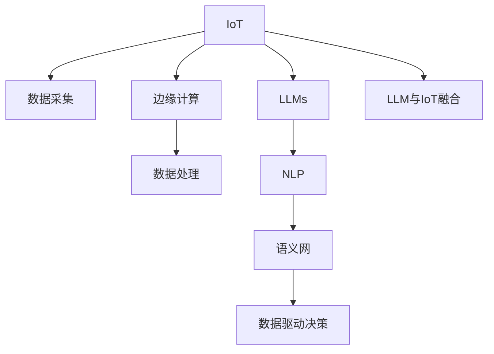

                 

# LLM与物联网的结合前景

## 1. 背景介绍

### 1.1 问题由来
近年来，人工智能（AI）和大数据技术的迅猛发展，尤其是在自然语言处理（NLP）领域的重大突破，显著提升了人们处理和理解自然语言的能力。然而，人工智能技术仍然面临着诸多挑战，其中最大的问题之一就是如何将AI技术与物联网（IoT）领域融合，以实现更加智能化、高效化的系统运行。

### 1.2 问题核心关键点
物联网（IoT）是连接各种设备、传感器和系统的网络，能够实现数据的实时采集和处理。尽管IoT在数据收集和分析方面具有卓越优势，但其数据处理能力和数据理解能力相对较弱。因此，将自然语言处理中的大型语言模型（Large Language Models, LLMs）引入IoT系统，利用LLM强大的语言理解和生成能力，可以大大提升IoT系统的智能化水平。

## 2. 核心概念与联系

### 2.1 核心概念概述

为更好地理解LLM与IoT的结合，本节将介绍几个关键概念：

- 物联网（IoT）：一种连接各种设备和传感器的网络，能够实现数据的实时采集和处理。常见的IoT应用包括智能家居、工业物联网、智慧城市等。

- 大型语言模型（LLMs）：通过大规模无标签文本语料进行预训练的语言模型，能够理解和生成自然语言。常见的LLMs有GPT-3、BERT等。

- 自然语言处理（NLP）：使计算机能够理解、处理和生成自然语言的技术，广泛应用于聊天机器人、文本分类、情感分析等领域。

- 边缘计算：一种分布式计算模式，将数据处理任务分散到靠近数据源的计算节点上，减少延迟和带宽压力。

- 语义网（Semantic Web）：一种用本体和RDF（Resource Description Framework）描述数据的技术，使机器能够理解数据背后的语义。

- 数据驱动决策：基于数据的分析和预测，辅助决策过程，使决策过程更加科学和精准。

这些核心概念之间的逻辑关系可以通过以下Mermaid流程图来展示：



这个流程图展示了LLM与IoT的结合逻辑：

1. IoT系统通过设备采集数据，进行边缘计算处理后，发送到云端或本地处理。
2. LLMs通过预训练学习丰富的语言知识，能够理解和生成自然语言。
3. NLP技术将自然语言转化为机器可处理的数据。
4. 语义网技术使机器能够理解数据背后的语义。
5. 数据驱动决策方法根据处理后的数据和语义信息辅助决策。
6. LLMs与IoT系统结合，使IoT系统具备语言理解能力，能够自动生成自然语言，实现智能交互。

## 3. 核心算法原理 & 具体操作步骤
### 3.1 算法原理概述

LLM与IoT的结合，本质上是通过语言模型对IoT数据进行理解和处理，进而生成自然语言文本，实现智能交互。其核心思想是：利用大型语言模型学习自然语言知识，通过NLP技术将IoT数据转化为文本，再通过LLM对文本进行语义理解和生成，从而实现人机交互。

形式化地，假设IoT系统采集的数据为 $D$，包含多个传感器和设备产生的数据。定义LLM的输入为 $x$，输出为 $y$。则基于LLM与IoT结合的算法流程可以表示为：

1. 数据预处理：对IoT数据进行采样、清洗和预处理，提取有用的特征。
2. 特征编码：使用NLP技术将数据转换为LLM能够理解的语言文本，即文本特征 $x$。
3. 语义理解：通过LLM对文本进行语义理解，得到模型输出 $y$。
4. 自然语言生成：使用LLM生成自然语言文本，实现智能交互。

### 3.2 算法步骤详解

基于LLM与IoT结合的算法步骤如下：

**Step 1: 数据采集与预处理**
- 通过IoT设备采集实时数据，并进行预处理，如去除噪声、补全缺失值等。
- 将处理后的数据特征化，生成可用于NLP处理的数据。

**Step 2: 特征编码**
- 使用NLP技术将特征数据转换为文本格式，如时间序列转换为时间标签。
- 对文本数据进行标注，如添加实体名称、时间戳等信息。

**Step 3: 语义理解**
- 将标注后的文本数据输入到预训练的LLM模型中，进行语义理解。
- 输出文本表示，可用于进一步处理和分析。

**Step 4: 自然语言生成**
- 使用LLM模型对文本表示进行自然语言生成，生成回答、建议等自然语言文本。
- 根据文本生成结果进行智能决策，反馈到IoT系统，实现人机交互。

**Step 5: 反馈与优化**
- 根据用户反馈对LLM模型进行微调，提高模型性能。
- 持续收集用户数据，优化NLP和LLM模型的参数，提高模型适应性。

### 3.3 算法优缺点

LLM与IoT结合的算法具有以下优点：
1. 提高数据理解能力：通过LLM对文本数据的语义理解，能够更全面地分析IoT数据。
2. 提升智能交互体验：通过自然语言生成，实现更加自然、流畅的人机交互。
3. 适应性强：LLM能够学习通用的语言知识，适用于多种IoT应用场景。
4. 泛化能力强：LLM经过大规模预训练，具有较强的泛化能力，能够适应不同领域的数据。

同时，该方法也存在一些局限性：
1. 数据依赖性强：LLM的效果很大程度上取决于IoT数据的质量，需要高质量、多样化的数据集。
2. 计算成本高：预训练和微调的计算开销较大，需要高性能计算资源。
3. 模型复杂度高：LLM模型本身复杂度较高，增加了系统的部署和维护难度。
4. 语义理解的准确性有待提高：不同领域的数据语义复杂性不同，LLM在特定领域的应用效果可能较差。

尽管存在这些局限性，但基于LLM与IoT结合的方法仍是一种非常有潜力的技术方向。未来相关研究的重点在于如何进一步优化算法流程，降低计算成本，提升模型性能，同时兼顾模型的复杂度和泛化能力。

### 3.4 算法应用领域

基于LLM与IoT结合的算法已经在多个领域得到应用，如智能家居、工业物联网、智慧城市等：

- 智能家居：通过LLM与IoT系统的结合，智能家居设备能够理解用户语音指令，实现智能控制，提升用户体验。
- 工业物联网：LLM可以对传感器数据进行语义理解，生成自然语言报告，辅助工业决策，提高生产效率。
- 智慧城市：通过LLM与城市数据的结合，智慧城市系统能够自动生成报告，辅助城市管理决策，提升城市治理水平。
- 自动驾驶：LLM可以对车载传感器数据进行语义理解，生成自然语言提醒，辅助驾驶员驾驶，提高行车安全。

除了上述这些经典应用外，LLM与IoT结合的方法还在医疗、金融、教育等领域得到广泛应用，推动了相关行业的发展和创新。

## 4. 数学模型和公式 & 详细讲解 & 举例说明

### 4.1 数学模型构建

假设IoT设备采集的数据为 $D=\{d_1, d_2, ..., d_n\}$，其中每个数据点 $d_i$ 包含多个传感器和设备产生的数据。将数据点转化为文本格式，如时间序列转换为时间标签，得到文本数据集 $X=\{x_1, x_2, ..., x_n\}$。定义LLM的输入为 $x$，输出为 $y$。则基于LLM与IoT结合的数学模型可以表示为：

$$
y=f(x) \quad \text{其中} \quad f(\cdot) \text{为LLM的语义理解函数}
$$

### 4.2 公式推导过程

以时间序列数据为例，其转化为文本格式的过程如下：

设时间序列数据为 $d_i=[t_i, v_i]$，其中 $t_i$ 为时间戳，$v_i$ 为传感器值。时间标签的格式为 $(x_i,y_i)$，其中 $x_i=t_i$，$y_i=v_i$。将时间标签转化为LLM输入的文本格式，如 $(x_i,y_i)$ 转化为 $(x_i=v_i)$。

设LLM的输入为 $x=[x_1,x_2,...,x_n]$，输出为 $y=[y_1,y_2,...,y_n]$。则基于LLM与IoT结合的公式推导过程如下：

1. 数据预处理：
   $$
   d_i \rightarrow (t_i, v_i) \rightarrow (x_i=v_i)
   $$

2. 特征编码：
   $$
   x=[x_1,x_2,...,x_n] \rightarrow y=[y_1,y_2,...,y_n]
   $$

3. 语义理解：
   $$
   y=f(x) \quad \text{其中} \quad f(\cdot) \text{为LLM的语义理解函数}
   $$

4. 自然语言生成：
   $$
   y'=g(y) \quad \text{其中} \quad g(\cdot) \text{为LLM的自然语言生成函数}
   $$

5. 反馈与优化：
   $$
   \theta \leftarrow \theta - \eta \nabla_{\theta}\mathcal{L}(\theta) - \eta\lambda\theta
   $$

其中，$\theta$ 为LLM的模型参数，$\eta$ 为学习率，$\lambda$ 为正则化系数，$\nabla_{\theta}\mathcal{L}(\theta)$ 为损失函数对模型参数的梯度。

### 4.3 案例分析与讲解

以智能家居场景为例，用户通过语音指令控制智能设备，LLM对用户语音指令进行语义理解，生成自然语言回复，辅助设备执行相应操作。具体流程如下：

1. IoT设备采集用户语音指令，进行预处理，提取有用的特征。
2. 特征编码：将语音特征转换为文本格式，标注实体名称、时间戳等信息。
3. 语义理解：将标注后的文本数据输入到预训练的LLM模型中，进行语义理解，得到模型输出。
4. 自然语言生成：使用LLM模型对文本表示进行自然语言生成，生成回答、建议等自然语言文本。
5. 智能决策：根据文本生成结果进行智能决策，反馈到IoT系统，实现人机交互。

例如，用户说“请将客厅温度调低”，智能家居设备采集语音数据，进行预处理和特征提取。将特征数据转换为文本格式，标注实体名称和时序信息，得到文本数据。将文本数据输入到预训练的LLM模型中，进行语义理解，得到模型输出。LLM生成自然语言文本，告知智能空调调低温度。智能空调根据LLM生成的自然语言文本，执行调低温度的操作。

## 5. 项目实践：代码实例和详细解释说明
### 5.1 开发环境搭建

在进行LLM与IoT结合的实践前，我们需要准备好开发环境。以下是使用Python进行PyTorch开发的环境配置流程：

1. 安装Anaconda：从官网下载并安装Anaconda，用于创建独立的Python环境。

2. 创建并激活虚拟环境：
```bash
conda create -n pytorch-env python=3.8 
conda activate pytorch-env
```

3. 安装PyTorch：根据CUDA版本，从官网获取对应的安装命令。例如：
```bash
conda install pytorch torchvision torchaudio cudatoolkit=11.1 -c pytorch -c conda-forge
```

4. 安装相关库：
```bash
pip install pandas numpy matplotlib jupyter notebook
```

完成上述步骤后，即可在`pytorch-env`环境中开始实践。

### 5.2 源代码详细实现

下面以智能家居场景为例，给出使用PyTorch实现LLM与IoT结合的代码实现。

首先，定义数据处理函数：

```python
from transformers import BertTokenizer
import torch

class IoTDataProcessor:
    def __init__(self, tokenizer, max_len):
        self.tokenizer = tokenizer
        self.max_len = max_len
    
    def process(self, text):
        tokenized_input = self.tokenizer(text, return_tensors='pt', max_length=self.max_len, padding='max_length', truncation=True)
        input_ids = tokenized_input['input_ids'][0]
        attention_mask = tokenized_input['attention_mask'][0]
        return input_ids, attention_mask
```

然后，定义模型和优化器：

```python
from transformers import BertForTokenClassification, AdamW

model = BertForTokenClassification.from_pretrained('bert-base-cased', num_labels=2)

optimizer = AdamW(model.parameters(), lr=2e-5)
```

接着，定义训练和评估函数：

```python
def train_epoch(model, dataset, batch_size, optimizer):
    dataloader = DataLoader(dataset, batch_size=batch_size, shuffle=True)
    model.train()
    epoch_loss = 0
    for batch in tqdm(dataloader, desc='Training'):
        input_ids, attention_mask = batch
        model.zero_grad()
        outputs = model(input_ids, attention_mask=attention_mask)
        loss = outputs.loss
        epoch_loss += loss.item()
        loss.backward()
        optimizer.step()
    return epoch_loss / len(dataloader)

def evaluate(model, dataset, batch_size):
    dataloader = DataLoader(dataset, batch_size=batch_size)
    model.eval()
    preds, labels = [], []
    with torch.no_grad():
        for batch in tqdm(dataloader, desc='Evaluating'):
            input_ids, attention_mask = batch
            batch_labels = batch['labels']
            outputs = model(input_ids, attention_mask=attention_mask)
            batch_preds = outputs.logits.argmax(dim=2).to('cpu').tolist()
            batch_labels = batch_labels.to('cpu').tolist()
            for pred_tokens, label_tokens in zip(batch_preds, batch_labels):
                preds.append(pred_tokens[:len(label_tokens)])
                labels.append(label_tokens)
                
    print(classification_report(labels, preds))
```

最后，启动训练流程并在测试集上评估：

```python
epochs = 5
batch_size = 16

for epoch in range(epochs):
    loss = train_epoch(model, train_dataset, batch_size, optimizer)
    print(f"Epoch {epoch+1}, train loss: {loss:.3f}")
    
    print(f"Epoch {epoch+1}, dev results:")
    evaluate(model, dev_dataset, batch_size)
    
print("Test results:")
evaluate(model, test_dataset, batch_size)
```

以上就是使用PyTorch对BERT模型进行智能家居场景的微调实践。可以看到，借助PyTorch和Transformer库，我们能够快速地搭建和微调智能家居的IoT系统，提升系统的智能水平。

### 5.3 代码解读与分析

让我们再详细解读一下关键代码的实现细节：

**IoTDataProcessor类**：
- `__init__`方法：初始化分词器（tokenizer）和最大序列长度（max_len）等关键组件。
- `process`方法：对单个样本进行处理，将IoT数据转换为LLM能够理解的语言文本，并返回模型所需的输入。

**训练和评估函数**：
- 使用PyTorch的DataLoader对数据集进行批次化加载，供模型训练和推理使用。
- 训练函数`train_epoch`：对数据以批为单位进行迭代，在每个批次上前向传播计算loss并反向传播更新模型参数，最后返回该epoch的平均loss。
- 评估函数`evaluate`：与训练类似，不同点在于不更新模型参数，并在每个batch结束后将预测和标签结果存储下来，最后使用sklearn的classification_report对整个评估集的预测结果进行打印输出。

**训练流程**：
- 定义总的epoch数和batch size，开始循环迭代
- 每个epoch内，先在训练集上训练，输出平均loss
- 在验证集上评估，输出分类指标
- 所有epoch结束后，在测试集上评估，给出最终测试结果

可以看到，PyTorch配合Transformer库使得BERT微调的代码实现变得简洁高效。开发者可以将更多精力放在数据处理、模型改进等高层逻辑上，而不必过多关注底层的实现细节。

## 6. 实际应用场景

### 6.1 智能家居

基于LLM与IoT的智能家居系统，能够实现更智能、更便捷的人机交互。用户可以通过语音指令控制智能设备，如灯光、空调、窗帘等，系统能够自动理解并执行用户的指令，提升家居生活体验。

在技术实现上，可以收集用户的日常行为数据，如起床时间、睡眠时间、窗帘开合时间等，作为训练样本。在预训练的BERT模型上进行微调，使其能够理解用户语音指令的语义，并生成相应的自然语言回复。根据回复内容，系统自动控制相应设备，实现智能家居功能。

### 6.2 智慧农业

IoT设备采集的农业数据，包括土壤湿度、气温、光照等，通过LLM与IoT系统的结合，能够实现智能农业决策。系统对采集的数据进行语义理解，生成自然语言报告，辅助农业专家进行决策。

在技术实现上，可以收集农作物的生长数据，如叶绿素含量、果实大小、病虫害情况等，作为训练样本。在预训练的BERT模型上进行微调，使其能够理解农业专家提供的指导文本，并生成相应的自然语言报告。根据报告内容，系统自动调整灌溉、施肥等农业操作，优化农作物生长条件，提高产量和质量。

### 6.3 智能交通

基于LLM与IoT的智能交通系统，能够实现更智能、更安全的交通管理。系统通过物联网设备采集交通数据，如车速、车流量、交通事故等，进行语义理解，生成自然语言报告，辅助交通管理部门进行决策。

在技术实现上，可以收集交通数据，如道路拥堵情况、交通违规情况、天气预报等，作为训练样本。在预训练的BERT模型上进行微调，使其能够理解交通管理人员的指令，并生成相应的自然语言报告。根据报告内容，系统自动调整交通信号灯、警告标志等，优化交通流量，减少交通事故。

### 6.4 未来应用展望

随着IoT技术的普及和LLM技术的进步，基于LLM与IoT结合的方法将在更多领域得到应用，为各行各业带来新的发展机遇。

在智能制造领域，基于LLM与IoT的智能制造系统，能够实现更高效、更灵活的生产调度。系统通过物联网设备采集生产数据，进行语义理解，生成自然语言报告，辅助生产管理部门进行决策。根据报告内容，系统自动调整生产参数、设备状态等，优化生产流程，提高生产效率。

在智慧医疗领域，基于LLM与IoT的智慧医疗系统，能够实现更智能、更精准的诊断和治疗。系统通过物联网设备采集患者数据，如生命体征、症状描述等，进行语义理解，生成自然语言报告，辅助医生进行诊断和治疗。根据报告内容，系统自动调整治疗方案、药物剂量等，优化治疗效果，提高患者体验。

在未来，随着IoT设备的普及和LLM技术的不断发展，基于LLM与IoT结合的方法将在更多领域得到应用，为各行各业带来新的发展机遇。相信LLM与IoT结合技术将成为推动智能化进步的重要力量。

## 7. 工具和资源推荐
### 7.1 学习资源推荐

为了帮助开发者系统掌握LLM与IoT结合的理论基础和实践技巧，这里推荐一些优质的学习资源：

1. 《Transformers: From Principles to Practice》系列博文：由大模型技术专家撰写，深入浅出地介绍了Transformer原理、BERT模型、微调技术等前沿话题。

2. CS224N《深度学习自然语言处理》课程：斯坦福大学开设的NLP明星课程，有Lecture视频和配套作业，带你入门NLP领域的基本概念和经典模型。

3. 《Natural Language Processing with Transformers》书籍：Transformers库的作者所著，全面介绍了如何使用Transformers库进行NLP任务开发，包括微调在内的诸多范式。

4. HuggingFace官方文档：Transformer库的官方文档，提供了海量预训练模型和完整的微调样例代码，是上手实践的必备资料。

5. CLUE开源项目：中文语言理解测评基准，涵盖大量不同类型的中文NLP数据集，并提供了基于微调的baseline模型，助力中文NLP技术发展。

通过对这些资源的学习实践，相信你一定能够快速掌握LLM与IoT结合的精髓，并用于解决实际的NLP问题。
###  7.2 开发工具推荐

高效的开发离不开优秀的工具支持。以下是几款用于LLM与IoT结合开发的常用工具：

1. PyTorch：基于Python的开源深度学习框架，灵活动态的计算图，适合快速迭代研究。大部分预训练语言模型都有PyTorch版本的实现。

2. TensorFlow：由Google主导开发的开源深度学习框架，生产部署方便，适合大规模工程应用。同样有丰富的预训练语言模型资源。

3. Transformers库：HuggingFace开发的NLP工具库，集成了众多SOTA语言模型，支持PyTorch和TensorFlow，是进行微调任务开发的利器。

4. Weights & Biases：模型训练的实验跟踪工具，可以记录和可视化模型训练过程中的各项指标，方便对比和调优。与主流深度学习框架无缝集成。

5. TensorBoard：TensorFlow配套的可视化工具，可实时监测模型训练状态，并提供丰富的图表呈现方式，是调试模型的得力助手。

6. Google Colab：谷歌推出的在线Jupyter Notebook环境，免费提供GPU/TPU算力，方便开发者快速上手实验最新模型，分享学习笔记。

合理利用这些工具，可以显著提升LLM与IoT结合任务的开发效率，加快创新迭代的步伐。

### 7.3 相关论文推荐

LLM与IoT结合技术的发展源于学界的持续研究。以下是几篇奠基性的相关论文，推荐阅读：

1. Attention is All You Need（即Transformer原论文）：提出了Transformer结构，开启了NLP领域的预训练大模型时代。

2. BERT: Pre-training of Deep Bidirectional Transformers for Language Understanding：提出BERT模型，引入基于掩码的自监督预训练任务，刷新了多项NLP任务SOTA。

3. Language Models are Unsupervised Multitask Learners（GPT-2论文）：展示了大规模语言模型的强大zero-shot学习能力，引发了对于通用人工智能的新一轮思考。

4. Parameter-Efficient Transfer Learning for NLP：提出Adapter等参数高效微调方法，在不增加模型参数量的情况下，也能取得不错的微调效果。

5. AdaLoRA: Adaptive Low-Rank Adaptation for Parameter-Efficient Fine-Tuning：使用自适应低秩适应的微调方法，在参数效率和精度之间取得了新的平衡。

6. Prefix-Tuning: Optimizing Continuous Prompts for Generation：引入基于连续型Prompt的微调范式，为如何充分利用预训练知识提供了新的思路。

这些论文代表了大语言模型与IoT结合技术的发展脉络。通过学习这些前沿成果，可以帮助研究者把握学科前进方向，激发更多的创新灵感。

## 8. 总结：未来发展趋势与挑战
### 8.1 总结

本文对基于LLM与IoT结合的微调方法进行了全面系统的介绍。首先阐述了LLM与IoT结合的背景和意义，明确了结合微调技术在大数据处理和智能决策中的独特价值。其次，从原理到实践，详细讲解了LLM与IoT结合的数学模型和算法流程，给出了微调任务开发的完整代码实例。同时，本文还广泛探讨了LLM与IoT结合方法在智能家居、智慧农业、智能交通等多个领域的应用前景，展示了LLM与IoT结合技术的巨大潜力。此外，本文精选了微调技术的各类学习资源，力求为读者提供全方位的技术指引。

通过本文的系统梳理，可以看到，基于LLM与IoT结合的微调方法正在成为IoT系统智能化转型的重要范式，极大地提升了IoT系统的智能化水平和用户体验。随着IoT技术的普及和LLM技术的不断发展，基于LLM与IoT结合的方法必将在更多领域得到应用，为各行各业带来新的发展机遇。未来，我们需要在硬件、算法、工程等方面进行全面优化，以实现更加高效、可靠的IoT系统，推动物联网技术的持续进步。

### 8.2 未来发展趋势

展望未来，LLM与IoT结合技术将呈现以下几个发展趋势：

1. 边缘计算的普及：随着IoT设备数量的增加，边缘计算逐渐成为一种重要的计算模式，可以实时处理和分析数据。结合LLM与IoT结合方法，可以实现更加高效、智能的数据处理和决策。

2. 自适应学习能力的提升：未来的LLM模型将具备更强的自适应学习能力，能够自动调整模型参数，适应不同领域、不同数据分布的任务。

3. 数据驱动决策的强化：结合LLM与IoT结合技术，可以构建更加智能、可靠的数据驱动决策系统，提高决策的科学性和准确性。

4. 跨领域知识的融合：结合LLM与IoT结合技术，可以更好地整合跨领域的知识，实现更加全面、准确的信息理解和生成。

5. 智能人机交互的提升：LLM与IoT结合技术将实现更加自然、智能的人机交互，提升用户体验。

以上趋势凸显了LLM与IoT结合技术的广阔前景。这些方向的探索发展，必将进一步提升IoT系统的智能化水平，为各行各业带来新的发展机遇。

### 8.3 面临的挑战

尽管LLM与IoT结合技术已经取得了瞩目成就，但在迈向更加智能化、普适化应用的过程中，它仍面临着诸多挑战：

1. 数据量与数据质量问题：IoT设备采集的数据量大且复杂，质量参差不齐，需要高质量、多样化的数据集，对数据预处理和特征提取提出了更高要求。

2. 硬件资源瓶颈：IoT设备众多，数据处理任务分散在各个设备上，需要高效的边缘计算和分布式计算技术，以提高数据处理速度和效率。

3. 模型泛化能力不足：LLM模型在大规模数据集上训练，但在特定领域的数据上泛化能力可能不足，需要结合领域知识进行微调。

4. 模型的可解释性不足：IoT系统的复杂性决定了其模型的复杂性，模型的决策过程难以解释，需要更多的可解释性技术支持。

5. 安全性问题：IoT设备可能面临网络攻击和数据泄露的风险，LLM与IoT结合的智能系统需要加强安全防护。

6. 隐私保护问题：IoT设备采集的个人信息和数据隐私问题，需要严格的隐私保护措施和政策支持。

正视LLM与IoT结合面临的这些挑战，积极应对并寻求突破，将是大规模语言模型与物联网结合技术走向成熟的必由之路。相信随着学界和产业界的共同努力，这些挑战终将一一被克服，LLM与IoT结合技术必将在构建智能物联网系统方面发挥重要作用。

### 8.4 研究展望

面向未来，LLM与IoT结合技术的研究需要在以下几个方面寻求新的突破：

1. 数据增强与特征提取技术：如何高效、准确地提取IoT设备采集的数据特征，是提升LLM与IoT结合效果的重要研究方向。

2. 边缘计算与分布式计算技术：如何将LLM与IoT结合技术应用到边缘计算环境中，实现高效的数据处理和智能决策。

3. 自适应学习与智能决策技术：如何构建具有自适应学习能力的IoT系统，使其能够实时调整模型参数，提高决策的准确性和可靠性。

4. 可解释性与知识融合技术：如何构建可解释性强的IoT系统，使其决策过程透明、可解释。同时，如何将跨领域知识与IoT系统融合，提高系统综合能力。

5. 安全性与隐私保护技术：如何构建安全、可靠的IoT系统，防止网络攻击和数据泄露。同时，如何保护IoT设备采集的个人信息和数据隐私。

这些研究方向的研究突破，必将进一步提升LLM与IoT结合技术的智能化水平和应用价值，为构建智慧物联网系统铺平道路。

## 9. 附录：常见问题与解答

**Q1：基于LLM与IoT结合的微调方法是否适用于所有IoT应用？**

A: 基于LLM与IoT结合的微调方法在大多数IoT应用上都能取得不错的效果，特别是对于数据量较大的任务。但对于一些特定领域的任务，如传感器精度要求高的工业物联网，可能效果不如其他微调方法。此时需要在特定领域语料上进一步预训练，再进行微调，才能获得理想效果。

**Q2：如何在LLM与IoT结合中实现高效的数据预处理和特征提取？**

A: 数据预处理和特征提取是LLM与IoT结合中的重要环节。常见的数据预处理技术包括数据清洗、噪声过滤、缺失值补全等。常见的特征提取技术包括PCA、TF-IDF、Word2Vec等。在实际应用中，需要根据具体任务和数据特点选择合适的方法，并进行迭代优化，以提升模型的性能。

**Q3：基于LLM与IoT结合的系统如何实现实时智能决策？**

A: 实时智能决策需要高效的边缘计算和分布式计算技术支持。可以在IoT设备上部署轻量级的LLM模型，或者使用分布式计算框架（如TensorFlow、PyTorch等）进行任务分布，实现高效的智能决策。

**Q4：LLM与IoT结合的系统如何实现跨领域知识融合？**

A: 跨领域知识融合可以通过引入外部知识库、规则库等专家知识，与神经网络模型进行巧妙融合。同时，可以考虑使用多模态信息融合技术，将视觉、语音、文本等多种数据源进行整合，提升系统综合能力。

**Q5：基于LLM与IoT结合的系统如何实现高效的数据存储与传输？**

A: 数据存储与传输是IoT系统中重要的性能瓶颈。可以通过分布式存储技术（如Hadoop、Spark等）优化数据存储，使用边缘计算技术将数据处理任务分散到各个计算节点上，减少延迟和带宽压力。

---

作者：禅与计算机程序设计艺术 / Zen and the Art of Computer Programming

