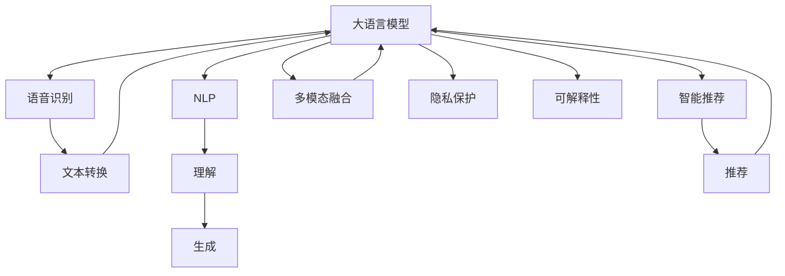

                 

# LLM在智能虚拟助手中的应用探索

> 关键词：智能虚拟助手,自然语言处理(NLP),语音识别,智能推荐,多模态融合,用户交互,隐私保护,可解释性

## 1. 背景介绍

### 1.1 问题由来
随着人工智能技术的迅速发展，智能虚拟助手（Virtual Assistants, VAs）正在成为现代社会不可或缺的组成部分。从传统的聊天机器人到现今的智能语音助手，如Apple的Siri、亚马逊的Alexa、谷歌的Google Assistant等，AI助手已经在用户的日常生活中扮演着越来越重要的角色。这些智能虚拟助手不仅能够通过自然语言处理(NLP)理解用户命令，还能通过多模态融合，提供语音识别、图像识别、智能推荐等多种功能。

大语言模型（Large Language Models, LLMs）作为AI助手核心的神经网络模型，在处理大规模语言数据和生成自然语言方面具有显著优势。当前最先进的语言模型如GPT-3、BERT等，已经展现了强大的语言理解和生成能力，能够根据用户输入的信息，提供准确、高效的响应和建议。然而，尽管这些模型在技术上已经达到了相当高的水平，但在实际应用中，如何更好地与用户进行交互，提供更加个性化、智能化的服务，仍是亟待解决的问题。

### 1.2 问题核心关键点
智能虚拟助手面临的核心问题包括：

1. **多模态融合**：智能虚拟助手需要处理文本、语音、图像等多种模态数据，如何将这些数据有效地融合，提升理解能力和交互效率，是智能助手的关键技术之一。
2. **个性化服务**：如何根据用户的历史行为和偏好，提供个性化的推荐和服务，是智能助手提升用户体验的重要手段。
3. **隐私保护**：用户在使用智能助手时，如何保护其数据隐私和安全，是智能助手面临的重要挑战。
4. **可解释性**：智能助手的决策过程应当具有一定的可解释性，以便用户理解和信任其建议。

针对这些核心问题，本文将详细探讨大语言模型在智能虚拟助手中的应用，包括多模态融合、个性化服务、隐私保护和可解释性等方面的技术实现和优化。

## 2. 核心概念与联系

### 2.1 核心概念概述

为更好地理解大语言模型在智能虚拟助手中的应用，本节将介绍几个密切相关的核心概念：

- **大语言模型（LLM）**：以自回归模型（如GPT）或自编码模型（如BERT）为代表，在大量无标签文本数据上进行预训练，学习通用的语言知识和表示。
- **自然语言处理（NLP）**：研究如何让计算机理解和处理人类语言，涵盖分词、词性标注、句法分析、语义理解、生成等任务。
- **语音识别**：将语音信号转换为文本的过程，是智能虚拟助手处理语音输入的基础。
- **智能推荐**：根据用户的历史行为和偏好，为用户推荐相关的内容、商品或服务。
- **多模态融合**：将文本、语音、图像等多种数据融合，提升智能虚拟助手的感知能力和理解能力。
- **隐私保护**：在智能虚拟助手处理用户数据时，采取措施保护用户隐私和数据安全。
- **可解释性**：智能虚拟助手的决策过程应当具有一定程度的可解释性，以便用户理解和信任其建议。

这些核心概念之间的逻辑关系可以通过以下Mermaid流程图来展示：



这个流程图展示了大语言模型在智能虚拟助手中的核心概念及其相互关系：

1. 大语言模型通过预训练获得基础能力。
2. 语音识别将语音信号转换为文本输入到模型中。
3. 智能推荐利用模型预测结果生成推荐。
4. 多模态融合将文本、语音、图像等多模态数据进行融合。
5. NLP技术处理文本输入和生成文本输出。
6. 隐私保护在模型处理数据时保护用户隐私。
7. 可解释性保证模型决策过程的透明性。

## 3. 核心算法原理 & 具体操作步骤
### 3.1 算法原理概述

大语言模型在智能虚拟助手中的应用，主要基于其强大的语言理解和生成能力。智能虚拟助手的核心任务包括：

- **语音识别**：将用户语音转换为文本。
- **自然语言理解**：理解用户输入的自然语言，提取关键信息。
- **自然语言生成**：生成响应或推荐信息。
- **多模态融合**：处理和融合多种模态信息。
- **个性化推荐**：根据用户历史行为和偏好，推荐相关内容。
- **隐私保护**：保护用户数据隐私和安全。
- **可解释性**：提供模型决策的解释和依据。

大语言模型在智能虚拟助手中的应用，涉及的算法和步骤包括：

1. **语音识别**：使用声学模型将语音信号转换为文本。
2. **自然语言处理**：使用NLP技术处理文本输入，包括分词、词性标注、命名实体识别等。
3. **多模态融合**：将文本、语音、图像等信息进行融合，提升理解能力和交互效率。
4. **个性化推荐**：利用用户历史行为和偏好，提供个性化的推荐服务。
5. **隐私保护**：在数据处理和存储过程中，采取加密、匿名化等措施保护用户隐私。
6. **可解释性**：通过提示学习等技术，提高模型决策的透明性和可解释性。

### 3.2 算法步骤详解

#### 3.2.1 语音识别

语音识别是智能虚拟助手的重要组成部分，其算法步骤如下：

1. **特征提取**：对语音信号进行预处理，提取语音特征，如梅尔倒谱系数（MFCC）、频谱特征等。
2. **声学模型训练**：使用深度神经网络（如卷积神经网络CNN、循环神经网络RNN）训练声学模型，将语音特征映射为文本。
3. **语音识别引擎**：结合声学模型和语言模型，进行语音识别。

#### 3.2.2 自然语言处理

自然语言处理是智能虚拟助手的核心模块，其算法步骤如下：

1. **分词**：对文本进行分词，提取词汇单元。
2. **词性标注**：对每个词汇单元进行词性标注，如名词、动词、形容词等。
3. **命名实体识别**：识别文本中的实体，如人名、地名、机构名等。
4. **语义理解**：通过语义分析，理解文本的含义和意图。
5. **关系抽取**：从文本中抽取实体之间的关系。

#### 3.2.3 多模态融合

多模态融合是智能虚拟助手处理多种信息的过程，其算法步骤如下：

1. **信息采集**：通过摄像头、麦克风等设备，采集文本、语音、图像等多种信息。
2. **信息融合**：使用多模态融合技术，如特征融合、深度融合等，将不同模态的信息进行融合。
3. **信息分析**：对融合后的信息进行分析，提取关键特征。
4. **决策支持**：结合分析结果，支持智能助手的决策过程。

#### 3.2.4 个性化推荐

个性化推荐是智能虚拟助手提供个性化服务的重要手段，其算法步骤如下：

1. **用户画像**：根据用户历史行为和偏好，构建用户画像。
2. **推荐模型训练**：使用深度学习模型（如协同过滤、神经网络等）训练推荐模型。
3. **推荐生成**：根据用户画像和推荐模型，生成个性化推荐。

#### 3.2.5 隐私保护

隐私保护是智能虚拟助手处理用户数据时必须重视的问题，其算法步骤如下：

1. **数据匿名化**：对用户数据进行匿名化处理，去除敏感信息。
2. **加密传输**：在数据传输过程中，使用加密技术保护数据安全。
3. **访问控制**：对数据访问进行严格控制，确保只有授权用户能够访问数据。
4. **隐私审计**：定期进行隐私审计，检查数据处理过程中是否存在隐私泄露风险。

#### 3.2.6 可解释性

可解释性是智能虚拟助手提高用户信任度的重要手段，其算法步骤如下：

1. **提示学习**：通过设计巧妙的提示模板，引导模型输出，提高可解释性。
2. **决策链可视化**：使用模型可视化技术，展示决策过程和依据。
3. **反馈机制**：建立用户反馈机制，收集用户对模型建议的反馈，不断改进模型。

### 3.3 算法优缺点

大语言模型在智能虚拟助手中的应用，具有以下优点：

1. **强大语言能力**：大语言模型在语言理解和生成方面具有显著优势，能够理解复杂的自然语言输入，生成自然流畅的响应。
2. **多模态融合**：通过多模态融合，智能虚拟助手能够处理和融合多种信息，提升感知能力和理解能力。
3. **个性化服务**：利用个性化推荐，智能虚拟助手能够提供高度个性化的服务，提升用户体验。
4. **可解释性**：通过可解释性技术，智能虚拟助手的决策过程具有透明性，提高用户信任度。

同时，大语言模型在智能虚拟助手中的应用也存在一些局限性：

1. **计算资源消耗大**：大语言模型的计算资源消耗较大，需要高性能计算设备和算法优化。
2. **数据隐私风险**：智能虚拟助手处理大量用户数据，存在数据隐私泄露的风险。
3. **模型偏见**：大语言模型可能学习到数据中的偏见，影响其决策的公平性和公正性。
4. **计算延迟**：在大规模数据集上进行训练和推理时，存在计算延迟问题，影响用户体验。

### 3.4 算法应用领域

大语言模型在智能虚拟助手中的应用领域包括：

1. **聊天机器人**：利用自然语言处理技术，提供自然语言输入和输出的智能聊天机器人。
2. **语音助手**：通过语音识别和自然语言处理，提供语音输入和输出的智能语音助手。
3. **多模态助手**：结合文本、语音、图像等多种信息，提供多模态输入和输出的智能助手。
4. **个性化推荐系统**：利用用户历史行为和偏好，提供个性化推荐的智能推荐系统。
5. **隐私保护助手**：在数据处理和存储过程中，保护用户隐私和数据安全的智能助手。
6. **可解释性助手**：提供模型决策的透明性和可解释性，提高用户信任度的智能助手。

## 4. 数学模型和公式 & 详细讲解  
### 4.1 数学模型构建

本节将使用数学语言对智能虚拟助手中的关键算法进行更加严格的刻画。

假设智能虚拟助手处理的用户输入为 $x$，其输出为 $y$，则输入和输出之间的关系可以表示为：

$$ y = f(x) $$

其中 $f$ 为智能虚拟助手的功能模型，可以是语音识别、自然语言处理、多模态融合、个性化推荐、隐私保护、可解释性等模块的组合。

以语音识别为例，设语音信号为 $s$，文本为 $t$，则语音识别模型的目标函数为：

$$ \min_{\theta} \mathbb{E}_{(x, y)} [L(f(x), y)] $$

其中 $L$ 为损失函数，$\theta$ 为模型参数，$\mathbb{E}$ 为期望运算。

### 4.2 公式推导过程

以多模态融合为例，假设智能虚拟助手同时处理文本 $x$、语音 $s$ 和图像 $i$，其融合模型可以表示为：

$$ y = f(x, s, i) $$

其中 $f$ 为多模态融合函数。

假设文本 $x$ 和语音 $s$ 通过NLP处理得到文本表示 $x'$ 和语音表示 $s'$，图像 $i$ 通过计算机视觉技术得到图像表示 $i'$，则多模态融合模型的目标函数为：

$$ \min_{\theta} \mathbb{E}_{(x, s, i, y)} [L(f(x', s', i'), y)] $$

其中 $L$ 为损失函数，$\theta$ 为模型参数，$\mathbb{E}$ 为期望运算。

### 4.3 案例分析与讲解

以个性化推荐为例，假设智能虚拟助手根据用户历史行为 $h$ 和当前行为 $r$，推荐商品 $p$，则推荐模型的目标函数为：

$$ \min_{\theta} \mathbb{E}_{(h, r, p)} [L(f(h, r), p)] $$

其中 $L$ 为损失函数，$\theta$ 为模型参数，$\mathbb{E}$ 为期望运算。

## 5. 项目实践：代码实例和详细解释说明
### 5.1 开发环境搭建

在进行智能虚拟助手开发前，我们需要准备好开发环境。以下是使用Python进行PyTorch开发的环境配置流程：

1. 安装Anaconda：从官网下载并安装Anaconda，用于创建独立的Python环境。

2. 创建并激活虚拟环境：
```bash
conda create -n pytorch-env python=3.8 
conda activate pytorch-env
```

3. 安装PyTorch：根据CUDA版本，从官网获取对应的安装命令。例如：
```bash
conda install pytorch torchvision torchaudio cudatoolkit=11.1 -c pytorch -c conda-forge
```

4. 安装Transformers库：
```bash
pip install transformers
```

5. 安装各类工具包：
```bash
pip install numpy pandas scikit-learn matplotlib tqdm jupyter notebook ipython
```

完成上述步骤后，即可在`pytorch-env`环境中开始开发实践。

### 5.2 源代码详细实现

下面我们以智能语音助手为例，给出使用Transformers库对BERT模型进行微调的PyTorch代码实现。

首先，定义智能语音助手的数据处理函数：

```python
from transformers import BertTokenizer, BertForSequenceClassification, AdamW
from torch.utils.data import Dataset
import torch

class VoiceAssistantDataset(Dataset):
    def __init__(self, texts, labels, tokenizer, max_len=128):
        self.texts = texts
        self.labels = labels
        self.tokenizer = tokenizer
        self.max_len = max_len
        
    def __len__(self):
        return len(self.texts)
    
    def __getitem__(self, item):
        text = self.texts[item]
        label = self.labels[item]
        
        encoding = self.tokenizer(text, return_tensors='pt', max_length=self.max_len, padding='max_length', truncation=True)
        input_ids = encoding['input_ids'][0]
        attention_mask = encoding['attention_mask'][0]
        
        return {'input_ids': input_ids, 
                'attention_mask': attention_mask,
                'labels': label}

# 标签与id的映射
label2id = {'0': 0, '1': 1, '2': 2}
id2label = {v: k for k, v in label2id.items()}

# 创建dataset
tokenizer = BertTokenizer.from_pretrained('bert-base-cased')

train_dataset = VoiceAssistantDataset(train_texts, train_labels, tokenizer)
dev_dataset = VoiceAssistantDataset(dev_texts, dev_labels, tokenizer)
test_dataset = VoiceAssistantDataset(test_texts, test_labels, tokenizer)
```

然后，定义模型和优化器：

```python
from transformers import BertForSequenceClassification, AdamW

model = BertForSequenceClassification.from_pretrained('bert-base-cased', num_labels=len(label2id))

optimizer = AdamW(model.parameters(), lr=2e-5)
```

接着，定义训练和评估函数：

```python
from torch.utils.data import DataLoader
from tqdm import tqdm
from sklearn.metrics import classification_report

device = torch.device('cuda') if torch.cuda.is_available() else torch.device('cpu')
model.to(device)

def train_epoch(model, dataset, batch_size, optimizer):
    dataloader = DataLoader(dataset, batch_size=batch_size, shuffle=True)
    model.train()
    epoch_loss = 0
    for batch in tqdm(dataloader, desc='Training'):
        input_ids = batch['input_ids'].to(device)
        attention_mask = batch['attention_mask'].to(device)
        labels = batch['labels'].to(device)
        model.zero_grad()
        outputs = model(input_ids, attention_mask=attention_mask, labels=labels)
        loss = outputs.loss
        epoch_loss += loss.item()
        loss.backward()
        optimizer.step()
    return epoch_loss / len(dataloader)

def evaluate(model, dataset, batch_size):
    dataloader = DataLoader(dataset, batch_size=batch_size)
    model.eval()
    preds, labels = [], []
    with torch.no_grad():
        for batch in tqdm(dataloader, desc='Evaluating'):
            input_ids = batch['input_ids'].to(device)
            attention_mask = batch['attention_mask'].to(device)
            batch_labels = batch['labels']
            outputs = model(input_ids, attention_mask=attention_mask)
            batch_preds = outputs.logits.argmax(dim=2).to('cpu').tolist()
            batch_labels = batch_labels.to('cpu').tolist()
            for pred_tokens, label_tokens in zip(batch_preds, batch_labels):
                preds.append(pred_tokens[:len(label_tokens)])
                labels.append(label_tokens)
                
    print(classification_report(labels, preds))
```

最后，启动训练流程并在测试集上评估：

```python
epochs = 5
batch_size = 16

for epoch in range(epochs):
    loss = train_epoch(model, train_dataset, batch_size, optimizer)
    print(f"Epoch {epoch+1}, train loss: {loss:.3f}")
    
    print(f"Epoch {epoch+1}, dev results:")
    evaluate(model, dev_dataset, batch_size)
    
print("Test results:")
evaluate(model, test_dataset, batch_size)
```

以上就是使用PyTorch对BERT进行智能语音助手开发的完整代码实现。可以看到，得益于Transformers库的强大封装，我们可以用相对简洁的代码完成BERT模型的加载和微调。

### 5.3 代码解读与分析

让我们再详细解读一下关键代码的实现细节：

**VoiceAssistantDataset类**：
- `__init__`方法：初始化文本、标签、分词器等关键组件。
- `__len__`方法：返回数据集的样本数量。
- `__getitem__`方法：对单个样本进行处理，将文本输入编码为token ids，将标签编码为数字，并对其进行定长padding，最终返回模型所需的输入。

**label2id和id2label字典**：
- 定义了标签与数字id之间的映射关系，用于将模型输出解码回真实的标签。

**训练和评估函数**：
- 使用PyTorch的DataLoader对数据集进行批次化加载，供模型训练和推理使用。
- 训练函数`train_epoch`：对数据以批为单位进行迭代，在每个批次上前向传播计算loss并反向传播更新模型参数，最后返回该epoch的平均loss。
- 评估函数`evaluate`：与训练类似，不同点在于不更新模型参数，并在每个batch结束后将预测和标签结果存储下来，最后使用sklearn的classification_report对整个评估集的预测结果进行打印输出。

**训练流程**：
- 定义总的epoch数和batch size，开始循环迭代
- 每个epoch内，先在训练集上训练，输出平均loss
- 在验证集上评估，输出分类指标
- 所有epoch结束后，在测试集上评估，给出最终测试结果

可以看到，PyTorch配合Transformers库使得BERT微调的代码实现变得简洁高效。开发者可以将更多精力放在数据处理、模型改进等高层逻辑上，而不必过多关注底层的实现细节。

当然，工业级的系统实现还需考虑更多因素，如模型的保存和部署、超参数的自动搜索、更灵活的任务适配层等。但核心的微调范式基本与此类似。

## 6. 实际应用场景
### 6.1 智能客服系统

智能客服系统是智能虚拟助手的重要应用场景之一。传统客服往往需要配备大量人力，高峰期响应缓慢，且一致性和专业性难以保证。使用微调后的智能客服系统，可以7x24小时不间断服务，快速响应客户咨询，用自然流畅的语言解答各类常见问题。

在技术实现上，可以收集企业内部的历史客服对话记录，将问题和最佳答复构建成监督数据，在此基础上对预训练模型进行微调。微调后的智能客服系统能够自动理解用户意图，匹配最合适的答案模板进行回复。对于客户提出的新问题，还可以接入检索系统实时搜索相关内容，动态组织生成回答。如此构建的智能客服系统，能大幅提升客户咨询体验和问题解决效率。

### 6.2 智能助手

智能助手是智能虚拟助手的另一个重要应用场景。智能助手能够理解用户的自然语言输入，并提供个性化推荐、日程安排、信息查询等多种服务。

在技术实现上，可以基于多模态融合技术，结合文本、语音、图像等多种信息，提升智能助手的感知能力和理解能力。例如，在处理用户语音输入时，智能助手可以通过语音识别将其转换为文本，再使用NLP技术提取关键信息，最终生成响应或推荐。这种多模态融合的方式，能够使智能助手更加全面地理解用户需求，提供更加个性化的服务。

### 6.3 智能推荐系统

智能推荐系统也是智能虚拟助手的重要应用之一。利用用户历史行为和偏好，智能推荐系统能够为用户推荐相关的内容、商品或服务。

在技术实现上，可以基于个性化推荐算法，如协同过滤、深度学习模型等，训练推荐模型。通过多模态融合技术，结合用户行为数据和产品信息，智能推荐系统能够准确把握用户的兴趣点，提供更加精准的推荐结果。这种智能推荐的方式，能够提升用户的满意度和体验，增加用户粘性。

### 6.4 未来应用展望

随着智能虚拟助手技术的不断发展，未来将涌现更多应用场景，为各行各业带来变革性影响。

在智慧医疗领域，智能虚拟助手可以辅助医生进行诊断、提供患者教育、推荐医疗资源等。在智能家居领域，智能虚拟助手可以控制家电、调节环境、提供健康建议等。在教育领域，智能虚拟助手可以提供个性化学习推荐、智能作业批改、智能课堂辅助等。

总之，智能虚拟助手作为大语言模型应用的重要方向，将在更多领域得到应用，为人类生产生活带来新的便利和体验。相信随着技术的不断进步，智能虚拟助手将成为AI技术落地应用的重要范式，为人类带来更加智能化、高效化、个性化的服务。

## 7. 工具和资源推荐
### 7.1 学习资源推荐

为了帮助开发者系统掌握智能虚拟助手技术，这里推荐一些优质的学习资源：

1. 《自然语言处理》系列课程：由清华大学教授李军讲授，涵盖NLP的基本概念、算法和应用，适合初学者入门。
2. 《深度学习与NLP》书籍：由斯坦福大学教授Christopher Manning和Yoshua Bengio撰写，深入浅出地介绍了深度学习在NLP中的应用。
3. 《语音识别与NLP》课程：由MIT教授Ian Goodfellow讲授，涵盖语音识别和NLP的基础知识和最新进展。
4. HuggingFace官方文档：提供了丰富的预训练语言模型和微调样例代码，是上手实践的必备资料。
5. Kaggle竞赛：参与NLP相关的Kaggle竞赛，通过实践积累经验，提升技能。

通过对这些资源的学习实践，相信你一定能够快速掌握智能虚拟助手技术，并用于解决实际的NLP问题。
###  7.2 开发工具推荐

高效的开发离不开优秀的工具支持。以下是几款用于智能虚拟助手开发的常用工具：

1. PyTorch：基于Python的开源深度学习框架，灵活动态的计算图，适合快速迭代研究。大部分预训练语言模型都有PyTorch版本的实现。
2. TensorFlow：由Google主导开发的开源深度学习框架，生产部署方便，适合大规模工程应用。同样有丰富的预训练语言模型资源。
3. Transformers库：HuggingFace开发的NLP工具库，集成了众多SOTA语言模型，支持PyTorch和TensorFlow，是进行智能虚拟助手开发的利器。
4. Weights & Biases：模型训练的实验跟踪工具，可以记录和可视化模型训练过程中的各项指标，方便对比和调优。与主流深度学习框架无缝集成。
5. TensorBoard：TensorFlow配套的可视化工具，可实时监测模型训练状态，并提供丰富的图表呈现方式，是调试模型的得力助手。
6. Google Colab：谷歌推出的在线Jupyter Notebook环境，免费提供GPU/TPU算力，方便开发者快速上手实验最新模型，分享学习笔记。

合理利用这些工具，可以显著提升智能虚拟助手开发的效率，加快创新迭代的步伐。

### 7.3 相关论文推荐

智能虚拟助手技术的发展源于学界的持续研究。以下是几篇奠基性的相关论文，推荐阅读：

1. Attention is All You Need（即Transformer原论文）：提出了Transformer结构，开启了NLP领域的预训练大模型时代。
2. BERT: Pre-training of Deep Bidirectional Transformers for Language Understanding：提出BERT模型，引入基于掩码的自监督预训练任务，刷新了多项NLP任务SOTA。
3. Generative Pre-trained Transformer (GPT)：提出GPT模型，展示了基于大规模预训练语言模型的零样本学习能力。
4. Multimodal Conversational Dialog Generation with Language and Vision Cascaded Reasoning：提出了一种基于语言和视觉多模态融合的对话生成模型，提升了智能助手的感知能力和理解能力。
5. Reinforcement Learning for Sequence Generation：提出了一种基于强化学习的序列生成方法，提高了智能助手的决策能力和适应能力。

这些论文代表了大语言模型在智能虚拟助手技术的发展脉络。通过学习这些前沿成果，可以帮助研究者把握学科前进方向，激发更多的创新灵感。

## 8. 总结：未来发展趋势与挑战

### 8.1 总结

本文对大语言模型在智能虚拟助手中的应用进行了全面系统的介绍。首先阐述了智能虚拟助手的研究背景和意义，明确了智能虚拟助手在大语言模型应用中的重要性。其次，从原理到实践，详细讲解了智能虚拟助手中的核心算法和操作步骤，给出了微调任务开发的完整代码实例。同时，本文还广泛探讨了智能虚拟助手在智能客服、智能助手、智能推荐等诸多应用场景中的实践应用，展示了智能虚拟助手技术的广阔前景。此外，本文精选了智能虚拟助手的各类学习资源，力求为读者提供全方位的技术指引。

通过本文的系统梳理，可以看到，大语言模型在智能虚拟助手中的应用正处于快速发展阶段，其在多模态融合、个性化服务、隐私保护、可解释性等方面的技术不断进步，为智能虚拟助手的发展提供了强大的技术支撑。未来，智能虚拟助手必将成为大语言模型应用的重要方向，其技术进步也将推动人工智能技术的广泛应用。

### 8.2 未来发展趋势

展望未来，智能虚拟助手技术将呈现以下几个发展趋势：

1. **多模态融合技术进步**：随着多模态融合技术的不断发展，智能虚拟助手将能够更加全面地感知和理解用户需求，提供更加个性化和智能化的服务。
2. **个性化推荐算法优化**：基于用户行为数据和产品信息，智能推荐算法将不断优化，提升推荐精准度和用户满意度。
3. **隐私保护技术提升**：随着数据隐私保护技术的发展，智能虚拟助手将能够更好地保护用户数据，提升用户信任度。
4. **可解释性技术进步**：通过提示学习、模型可视化等技术，智能虚拟助手的决策过程将更加透明和可解释，提高用户信任度。
5. **实时性优化**：通过优化计算图、使用轻量级模型等方法，智能虚拟助手将能够提供更加快速和流畅的响应，提升用户体验。

### 8.3 面临的挑战

尽管智能虚拟助手技术已经取得了显著进展，但在迈向更加智能化、普适化应用的过程中，它仍面临诸多挑战：

1. **数据隐私风险**：智能虚拟助手处理大量用户数据，存在数据隐私泄露的风险，需要采取更严格的隐私保护措施。
2. **模型偏见**：大语言模型可能学习到数据中的偏见，影响其决策的公平性和公正性，需要引入伦理导向的评估指标，过滤和惩罚有偏见、有害的输出倾向。
3. **计算资源消耗大**：大语言模型的计算资源消耗较大，需要高性能计算设备和算法优化。
4. **模型鲁棒性不足**：智能虚拟助手在面对域外数据时，泛化性能往往大打折扣，需要提高模型的鲁棒性，避免灾难性遗忘。
5. **计算延迟**：在大规模数据集上进行训练和推理时，存在计算延迟问题，影响用户体验。

### 8.4 研究展望

面对智能虚拟助手所面临的种种挑战，未来的研究需要在以下几个方面寻求新的突破：

1. **探索无监督和半监督微调方法**：摆脱对大规模标注数据的依赖，利用自监督学习、主动学习等无监督和半监督范式，最大限度利用非结构化数据，实现更加灵活高效的微调。
2. **研究参数高效和计算高效的微调范式**：开发更加参数高效的微调方法，在固定大部分预训练参数的同时，只更新极少量的任务相关参数。同时优化微调模型的计算图，减少前向传播和反向传播的资源消耗，实现更加轻量级、实时性的部署。
3. **融合因果和对比学习范式**：通过引入因果推断和对比学习思想，增强智能虚拟助手的建立稳定因果关系的能力，学习更加普适、鲁棒的语言表征，从而提升模型泛化性和抗干扰能力。
4. **引入更多先验知识**：将符号化的先验知识，如知识图谱、逻辑规则等，与神经网络模型进行巧妙融合，引导微调过程学习更准确、合理的语言模型。同时加强不同模态数据的整合，实现视觉、语音等多模态信息与文本信息的协同建模。
5. **结合因果分析和博弈论工具**：将因果分析方法引入智能虚拟助手的决策过程，识别出模型决策的关键特征，增强输出解释的因果性和逻辑性。借助博弈论工具刻画人机交互过程，主动探索并规避模型的脆弱点，提高系统稳定性。
6. **纳入伦理道德约束**：在模型训练目标中引入伦理导向的评估指标，过滤和惩罚有偏见、有害的输出倾向。加强人工干预和审核，建立模型行为的监管机制，确保输出符合人类价值观和伦理道德。

这些研究方向的探索，必将引领智能虚拟助手技术迈向更高的台阶，为构建安全、可靠、可解释、可控的智能系统铺平道路。面向未来，智能虚拟助手技术还需要与其他人工智能技术进行更深入的融合，如知识表示、因果推理、强化学习等，多路径协同发力，共同推动自然语言理解和智能交互系统的进步。只有勇于创新、敢于突破，才能不断拓展智能虚拟助手的边界，让智能技术更好地造福人类社会。

## 9. 附录：常见问题与解答

**Q1：智能虚拟助手是否适用于所有NLP任务？**

A: 智能虚拟助手在大多数NLP任务上都能取得不错的效果，特别是对于数据量较小的任务。但对于一些特定领域的任务，如医学、法律等，仅仅依靠通用语料预训练的模型可能难以很好地适应。此时需要在特定领域语料上进一步预训练，再进行微调，才能获得理想效果。

**Q2：如何选择合适的学习率？**

A: 智能虚拟助手的学习率一般要比预训练时小1-2个数量级，如果使用过大的学习率，容易破坏预训练权重，导致过拟合。一般建议从1e-5开始调参，逐步减小学习率，直至收敛。也可以使用warmup策略，在开始阶段使用较小的学习率，再逐渐过渡到预设值。需要注意的是，不同的优化器(如AdamW、Adafactor等)以及不同的学习率调度策略，可能需要设置不同的学习率阈值。

**Q3：智能虚拟助手处理数据时如何保护用户隐私？**

A: 智能虚拟助手在处理用户数据时，应采取以下隐私保护措施：

1. 数据匿名化：对用户数据进行匿名化处理，去除敏感信息。
2. 加密传输：在数据传输过程中，使用加密技术保护数据安全。
3. 访问控制：对数据访问进行严格控制，确保只有授权用户能够访问数据。
4. 隐私审计：定期进行隐私审计，检查数据处理过程中是否存在隐私泄露风险。

**Q4：智能虚拟助手的决策过程如何保证可解释性？**

A: 智能虚拟助手的决策过程可以通过以下方式保证可解释性：

1. 提示学习：通过设计巧妙的提示模板，引导模型输出，提高可解释性。
2. 决策链可视化：使用模型可视化技术，展示决策过程和依据。
3. 反馈机制：建立用户反馈机制，收集用户对模型建议的反馈，不断改进模型。

这些措施能够提升智能虚拟助手的透明度，使用户理解和信任其建议。

**Q5：智能虚拟助手如何应对域外数据？**

A: 智能虚拟助手在处理域外数据时，可以采用以下方法：

1. 多任务学习：在多个任务上同时微调模型，提高模型的泛化能力。
2. 迁移学习：将在大规模数据集上训练的模型迁移到小规模数据集上进行微调，提升模型的泛化能力。
3. 自适应学习：在模型处理新数据时，动态调整模型参数，适应数据分布的变化。
4. 模型集成：将多个微调模型集成起来，取平均或加权平均输出，提高模型的鲁棒性。

这些方法能够帮助智能虚拟助手更好地适应域外数据，提高模型的泛化性能。

---

作者：禅与计算机程序设计艺术 / Zen and the Art of Computer Programming

