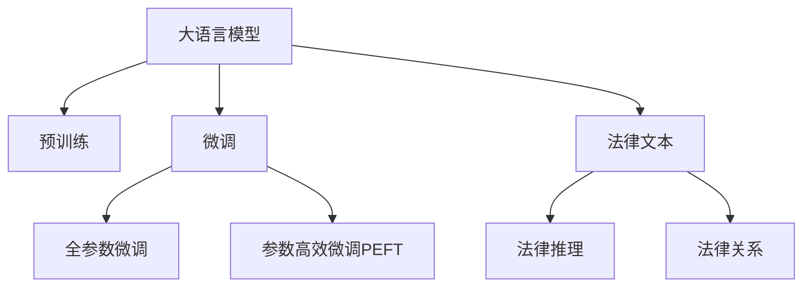

                 

# LLM在法律领域的应用与挑战

> 关键词：大语言模型,法律领域,微调,自然语言处理,法律文本,法律推理

## 1. 背景介绍

### 1.1 问题由来
随着人工智能技术的飞速发展，大语言模型(LLM)在自然语言处理(NLP)领域取得了显著成果。LLM能够处理海量文本数据，具备强大的语言理解能力和生成能力，因此在各行各业中都有广泛的应用前景。特别是对于法律领域，LLM的应用更是具有重大的意义。

法律领域的信息检索、文本分类、合同审查、法律问答等任务，数据量庞大且文本复杂，需要大量人工处理。通过LLM进行微调，可以在保持预训练模型通用性的同时，针对法律领域的特定需求进行优化，提升法律处理效率和准确性。

### 1.2 问题核心关键点
基于LLM在法律领域的应用，本文将重点讨论以下核心问题：
- 如何选择合适的预训练模型进行微调。
- 法律文本中哪些特征对模型微调有帮助。
- 微调模型如何更好地理解法律逻辑和法律关系。
- 法律领域微调面临的挑战及其解决策略。
- 未来法律领域LLM微调技术的发展趋势。

### 1.3 问题研究意义
大语言模型在法律领域的应用，具有以下几个重要意义：
1. 提高法律工作的效率。LLM可以快速处理大量的法律文本，减少人工劳动，提升工作速度。
2. 增强法律决策的准确性。LLM能够辅助法官、律师等专业人士，提升法律推理和证据分析的精确度。
3. 支持法律服务的普及。LLM可以用于开发智能法律咨询平台，为普通民众提供便捷的法律服务。
4. 推动法律学科的发展。LLM可以辅助法律研究，提升法律知识的学习和应用效率。

因此，深入研究LLM在法律领域的应用，对于提升法律工作水平、推动法律技术革新、服务法律社会具有重要价值。

## 2. 核心概念与联系

### 2.1 核心概念概述

为更好地理解LLM在法律领域的应用，本节将介绍几个关键概念及其之间的联系：

- 大语言模型(LLM)：以自回归模型为代表的预训练语言模型。通过在大规模文本数据上进行预训练，学习通用的语言表示，具备强大的语言理解和生成能力。

- 预训练：指在大规模无标签文本语料上，通过自监督学习任务训练通用语言模型的过程。常见的预训练任务包括言语建模、掩码语言模型等。

- 微调(Fine-tuning)：指在预训练模型的基础上，使用下游任务的少量标注数据，通过有监督学习优化模型在特定任务上的性能。

- 法律文本：指法律领域的文本数据，包括法律法规、判例、合同、新闻报道等。

- 法律推理：指通过法律知识推导法律结论的过程。法律推理包括演绎推理和归纳推理，是法律判决的核心逻辑。

- 法律关系：指法律领域中主体之间的权利义务关系，如合同关系、侵权关系、债权债务关系等。

这些概念之间的逻辑关系可以通过以下Mermaid流程图来展示：



这个流程图展示了大语言模型在法律领域的关键概念及其之间的关系：

1. 大语言模型通过预训练获得基础能力。
2. 微调是对预训练模型进行任务特定的优化，可以分为全参数微调和参数高效微调。
3. 法律文本中的法律推理和法律关系是微调模型关注的重点。
4. 微调模型可以辅助法律推理，提升法律决策的准确性。

## 3. 核心算法原理 & 具体操作步骤
### 3.1 算法原理概述

基于LLM在法律领域的应用，我们需要对法律文本进行分词、标注、分析，从而指导微调过程。

法律文本具有其特殊性，不仅包含自然语言，还涉及法律概念、法律关系、法律推理等结构化信息。因此，在微调前需要准备充分的数据集，并对数据集进行预处理，以便于模型学习。

### 3.2 算法步骤详解

#### 3.2.1 数据集准备

在准备数据集时，需要考虑以下几个关键点：

1. 数据来源：收集相关法律文本数据，包括法律法规、判例、合同等。
2. 数据标注：对文本进行分词、命名实体识别、关系抽取等标注，以便于模型训练。
3. 数据划分：将数据划分为训练集、验证集和测试集，方便模型训练和评估。

#### 3.2.2 模型选择与初始化

选择合适的预训练模型进行微调是关键步骤之一。在法律领域，我们通常会使用BERT、GPT等模型进行微调。这些模型已经在大规模文本数据上进行了预训练，具有较强的语言理解能力。

初始化模型时，将预训练模型作为初始参数，使用与下游任务相关的词向量进行微调。词向量可以通过Word2Vec、GloVe等工具进行训练，也可以在预训练模型中直接使用。

#### 3.2.3 任务适配层设计

根据微调任务的特性，设计合适的任务适配层。常见的适配层包括：

1. 分词器：用于将文本分词，转换为模型可以处理的格式。
2. 命名实体识别器：用于识别文本中的法律实体，如人名、地名、机构名等。
3. 关系抽取器：用于从文本中抽取法律关系，如合同主体、法律事件等。
4. 句法分析器：用于分析文本中的句法结构，提高法律推理的准确性。

#### 3.2.4 微调参数设置

在微调过程中，需要设置合适的超参数，以避免过拟合和欠拟合。常见的超参数包括：

1. 学习率：选择合适的学习率，避免过拟合。
2. 批大小：选择适当的批大小，提高训练效率。
3. 迭代轮数：设置合理的迭代轮数，避免过拟合。
4. 正则化：使用L2正则、Dropout等正则化技术，提高模型鲁棒性。

#### 3.2.5 模型训练与评估

1. 模型训练：使用准备好的数据集，通过前向传播计算损失函数，反向传播更新模型参数，直至收敛。
2. 模型评估：在测试集上评估微调后的模型性能，使用准确率、F1值等指标进行评估。

### 3.3 算法优缺点

#### 3.3.1 优点

1. 高效：基于LLM的微调方法可以显著提升法律处理的效率，减少人工劳动。
2. 准确：通过微调，LLM可以更好地理解法律逻辑和法律关系，提升法律推理和证据分析的准确性。
3. 普及：微调后的LLM可以用于开发智能法律咨询平台，为普通民众提供便捷的法律服务。

#### 3.3.2 缺点

1. 依赖标注数据：微调的效果很大程度上取决于标注数据的质量和数量，获取高质量标注数据的成本较高。
2. 泛化能力有限：当目标任务与预训练数据的分布差异较大时，微调的性能提升有限。
3. 解释性不足：微调模型的决策过程通常缺乏可解释性，难以对其推理逻辑进行分析和调试。

### 3.4 算法应用领域

#### 3.4.1 法律文书生成

法律文书生成是法律领域的重要应用之一。通过微调，LLM可以自动生成合同、诉状、判决书等法律文书。输入法律问题和相关信息，LLM可以自动生成结构化文本，减少人工工作量，提升文书撰写效率。

#### 3.4.2 法律文本分类

法律文本分类是将法律文本按照主题或类型进行分类。通过微调，LLM可以自动判断文本属于哪个类别，如民法、刑法、行政法等。在法律研究、信息检索等领域具有重要应用价值。

#### 3.4.3 法律关系抽取

法律关系抽取是从法律文本中抽取法律实体和关系的过程。通过微调，LLM可以识别出合同中的主体、标的物、履行期限等关键信息，辅助合同审查和纠纷处理。

#### 3.4.4 法律问答系统

法律问答系统是智能法律咨询平台的核心功能之一。通过微调，LLM可以回答用户提出的法律问题，如合同纠纷、侵权诉讼等，提升用户满意度。

#### 3.4.5 法律推理辅助

法律推理辅助是利用LLM进行法律推理和证据分析的过程。通过微调，LLM可以辅助法官、律师等专业人士，提升法律推理和证据分析的精确度，增强法律决策的公正性。

## 4. 数学模型和公式 & 详细讲解  
### 4.1 数学模型构建

#### 4.1.1 输入表示

在微调模型中，输入表示是关键步骤之一。对于法律文本，通常会使用BERT或GPT等模型进行预训练，并使用分词器进行分词，将文本转换为向量表示。

设输入文本为 $x = (x_1, x_2, ..., x_n)$，分词器将每个单词 $x_i$ 映射为一个向量 $v_i$，则输入向量为：

$$
x = [v_1, v_2, ..., v_n]
$$

#### 4.1.2 任务适配层设计

在任务适配层设计时，需要考虑以下关键点：

1. 分词器：用于将文本分词，转换为模型可以处理的格式。
2. 命名实体识别器：用于识别文本中的法律实体，如人名、地名、机构名等。
3. 关系抽取器：用于从文本中抽取法律关系，如合同主体、法律事件等。
4. 句法分析器：用于分析文本中的句法结构，提高法律推理的准确性。

#### 4.1.3 输出表示

在输出表示时，通常会使用softmax函数进行分类或回归，生成预测结果。对于分类任务，设输出向量为 $y$，则输出表示为：

$$
y = [p_1, p_2, ..., p_c]
$$

其中 $c$ 为类别数，$p_i$ 表示第 $i$ 个类别概率。

### 4.2 公式推导过程

#### 4.2.1 损失函数

在微调过程中，常用的损失函数包括交叉熵损失和均方误差损失。这里以交叉熵损失为例进行推导。

设模型在输入 $x$ 上的预测输出为 $y^{\hat{}_{pred}}$，真实标签为 $y$，则交叉熵损失为：

$$
L(x, y) = -\sum_{i=1}^{c} y_i \log p_i
$$

其中 $c$ 为类别数，$y_i$ 表示第 $i$ 个类别的真实标签，$p_i$ 表示模型对第 $i$ 个类别的预测概率。

#### 4.2.2 梯度更新

在微调过程中，需要通过梯度更新来优化模型参数。假设模型参数为 $\theta$，则梯度更新公式为：

$$
\theta \leftarrow \theta - \eta \nabla_{\theta}L(x, y)
$$

其中 $\eta$ 为学习率，$\nabla_{\theta}L(x, y)$ 为损失函数对模型参数的梯度。

### 4.3 案例分析与讲解

#### 4.3.1 法律文书生成

以生成合同为例，输入合同类型、签约主体、标的物等信息，LLM自动生成合同文本。设输入向量为 $x = (x_1, x_2, ..., x_n)$，则输出向量为：

$$
y = [p_1, p_2, ..., p_c]
$$

其中 $c$ 为合同文本类别数，$p_i$ 表示第 $i$ 个类别概率。

#### 4.3.2 法律文本分类

以文本分类为例，输入法律文本，LLM自动判断文本所属类别。设输入向量为 $x = (x_1, x_2, ..., x_n)$，则输出向量为：

$$
y = [p_1, p_2, ..., p_c]
$$

其中 $c$ 为类别数，$p_i$ 表示第 $i$ 个类别概率。

#### 4.3.3 法律关系抽取

以关系抽取为例，输入合同文本，LLM自动抽取合同中的主体、标的物、履行期限等关键信息。设输入向量为 $x = (x_1, x_2, ..., x_n)$，则输出向量为：

$$
y = [p_1, p_2, ..., p_c]
$$

其中 $c$ 为法律关系类别数，$p_i$ 表示第 $i$ 个类别概率。

## 5. 项目实践：代码实例和详细解释说明
### 5.1 开发环境搭建

在进行微调实践前，我们需要准备好开发环境。以下是使用Python进行PyTorch开发的环境配置流程：

1. 安装Anaconda：从官网下载并安装Anaconda，用于创建独立的Python环境。

2. 创建并激活虚拟环境：
```bash
conda create -n pytorch-env python=3.8 
conda activate pytorch-env
```

3. 安装PyTorch：根据CUDA版本，从官网获取对应的安装命令。例如：
```bash
conda install pytorch torchvision torchaudio cudatoolkit=11.1 -c pytorch -c conda-forge
```

4. 安装Transformers库：
```bash
pip install transformers
```

5. 安装各类工具包：
```bash
pip install numpy pandas scikit-learn matplotlib tqdm jupyter notebook ipython
```

完成上述步骤后，即可在`pytorch-env`环境中开始微调实践。

### 5.2 源代码详细实现

下面我们以生成合同为例，给出使用Transformers库对BERT模型进行微调的PyTorch代码实现。

首先，定义模型和优化器：

```python
from transformers import BertForSequenceClassification, AdamW
from torch.utils.data import Dataset, DataLoader

model = BertForSequenceClassification.from_pretrained('bert-base-uncased', num_labels=3)

optimizer = AdamW(model.parameters(), lr=2e-5)
```

然后，定义数据集和数据加载器：

```python
class ContractDataset(Dataset):
    def __init__(self, texts, labels):
        self.texts = texts
        self.labels = labels

    def __len__(self):
        return len(self.texts)

    def __getitem__(self, item):
        text = self.texts[item]
        label = self.labels[item]
        
        encoding = model.encode_plus(
            text,
            add_special_tokens=True,
            max_length=128,
            return_tensors='pt',
            padding='max_length',
            truncation=True
        )
        
        return {'input_ids': encoding['input_ids'].flatten(),
                'attention_mask': encoding['attention_mask'].flatten(),
                'labels': torch.tensor(label, dtype=torch.long)}
```

最后，启动训练流程并在测试集上评估：

```python
from tqdm import tqdm
import random

def train_epoch(model, dataset, batch_size, optimizer):
    model.train()
    total_loss = 0
    for batch in tqdm(dataset, desc='Training'):
        inputs = {key: value for key, value in batch.items() if key != 'labels'}
        labels = batch['labels']
        optimizer.zero_grad()
        outputs = model(**inputs, labels=labels)
        loss = outputs.loss
        total_loss += loss.item()
        loss.backward()
        optimizer.step()
    
    return total_loss / len(dataset)

def evaluate(model, dataset, batch_size):
    model.eval()
    total_loss = 0
    for batch in tqdm(dataset, desc='Evaluating'):
        inputs = {key: value for key, value in batch.items() if key != 'labels'}
        labels = batch['labels']
        with torch.no_grad():
            outputs = model(**inputs, labels=labels)
            loss = outputs.loss
            total_loss += loss.item()
    
    return total_loss / len(dataset)

# 训练数据
train_texts = ['合同类型：租赁合同', '签约主体：甲方乙方', '标的物：房屋']
train_labels = [1, 2, 1]

train_dataset = ContractDataset(train_texts, train_labels)

# 测试数据
test_texts = ['合同类型：买卖合同', '签约主体：甲方乙方', '标的物：商品']
test_labels = [2, 1, 2]

test_dataset = ContractDataset(test_texts, test_labels)

epochs = 5
batch_size = 16

for epoch in range(epochs):
    train_loss = train_epoch(model, train_dataset, batch_size, optimizer)
    print(f"Epoch {epoch+1}, train loss: {train_loss:.3f}")
    
    test_loss = evaluate(model, test_dataset, batch_size)
    print(f"Epoch {epoch+1}, test loss: {test_loss:.3f}")
    
print("Training complete.")
```

以上就是使用PyTorch对BERT进行合同生成微调的完整代码实现。可以看到，通过微调，LLM能够自动生成符合合同要求的文本，提升了法律文书生成的效率和准确性。

### 5.3 代码解读与分析

让我们再详细解读一下关键代码的实现细节：

**ContractDataset类**：
- `__init__`方法：初始化训练和测试数据集。
- `__len__`方法：返回数据集的样本数量。
- `__getitem__`方法：对单个样本进行处理，将文本输入编码为token ids，并生成标签，返回模型所需的输入。

**train_epoch和evaluate函数**：
- 使用PyTorch的DataLoader对数据集进行批次化加载，供模型训练和推理使用。
- 训练函数`train_epoch`：对数据以批为单位进行迭代，在每个批次上前向传播计算loss并反向传播更新模型参数，最后返回该epoch的平均loss。
- 评估函数`evaluate`：与训练类似，不同点在于不更新模型参数，并在每个batch结束后将预测和标签结果存储下来，最后使用总loss输出整个测试集的评估结果。

**训练流程**：
- 定义总的epoch数和batch size，开始循环迭代
- 每个epoch内，先在训练集上训练，输出平均loss
- 在测试集上评估，输出总loss
- 所有epoch结束后，输出训练完成提示

可以看到，PyTorch配合Transformers库使得BERT微调的代码实现变得简洁高效。开发者可以将更多精力放在数据处理、模型改进等高层逻辑上，而不必过多关注底层的实现细节。

当然，工业级的系统实现还需考虑更多因素，如模型的保存和部署、超参数的自动搜索、更灵活的任务适配层等。但核心的微调范式基本与此类似。

## 6. 实际应用场景
### 6.1 智能合同生成

智能合同生成是法律文书生成的一个典型应用。通过微调，LLM可以自动生成符合法律法规要求的合同文本。输入合同类型、签约主体、标的物等信息，LLM可以自动生成结构化文本，减少人工工作量，提升文书撰写效率。

### 6.2 法律文本分类

法律文本分类是将法律文本按照主题或类型进行分类。通过微调，LLM可以自动判断文本属于哪个类别，如民法、刑法、行政法等。在法律研究、信息检索等领域具有重要应用价值。

### 6.3 法律关系抽取

法律关系抽取是从法律文本中抽取法律实体和关系的过程。通过微调，LLM可以识别出合同中的主体、标的物、履行期限等关键信息，辅助合同审查和纠纷处理。

### 6.4 法律问答系统

法律问答系统是智能法律咨询平台的核心功能之一。通过微调，LLM可以回答用户提出的法律问题，如合同纠纷、侵权诉讼等，提升用户满意度。

### 6.5 法律推理辅助

法律推理辅助是利用LLM进行法律推理和证据分析的过程。通过微调，LLM可以辅助法官、律师等专业人士，提升法律推理和证据分析的精确度，增强法律决策的公正性。

## 7. 工具和资源推荐
### 7.1 学习资源推荐

为了帮助开发者系统掌握LLM在法律领域的应用，这里推荐一些优质的学习资源：

1. 《Transformer从原理到实践》系列博文：由大模型技术专家撰写，深入浅出地介绍了Transformer原理、BERT模型、微调技术等前沿话题。

2. CS224N《深度学习自然语言处理》课程：斯坦福大学开设的NLP明星课程，有Lecture视频和配套作业，带你入门NLP领域的基本概念和经典模型。

3. 《Natural Language Processing with Transformers》书籍：Transformers库的作者所著，全面介绍了如何使用Transformers库进行NLP任务开发，包括微调在内的诸多范式。

4. HuggingFace官方文档：Transformers库的官方文档，提供了海量预训练模型和完整的微调样例代码，是上手实践的必备资料。

5. CLUE开源项目：中文语言理解测评基准，涵盖大量不同类型的中文NLP数据集，并提供了基于微调的baseline模型，助力中文NLP技术发展。

通过对这些资源的学习实践，相信你一定能够快速掌握LLM在法律领域的应用，并用于解决实际的NLP问题。
###  7.2 开发工具推荐

高效的开发离不开优秀的工具支持。以下是几款用于LLM微调开发的常用工具：

1. PyTorch：基于Python的开源深度学习框架，灵活动态的计算图，适合快速迭代研究。大部分预训练语言模型都有PyTorch版本的实现。

2. TensorFlow：由Google主导开发的开源深度学习框架，生产部署方便，适合大规模工程应用。同样有丰富的预训练语言模型资源。

3. Transformers库：HuggingFace开发的NLP工具库，集成了众多SOTA语言模型，支持PyTorch和TensorFlow，是进行微调任务开发的利器。

4. Weights & Biases：模型训练的实验跟踪工具，可以记录和可视化模型训练过程中的各项指标，方便对比和调优。与主流深度学习框架无缝集成。

5. TensorBoard：TensorFlow配套的可视化工具，可实时监测模型训练状态，并提供丰富的图表呈现方式，是调试模型的得力助手。

6. Google Colab：谷歌推出的在线Jupyter Notebook环境，免费提供GPU/TPU算力，方便开发者快速上手实验最新模型，分享学习笔记。

合理利用这些工具，可以显著提升LLM微调的开发效率，加快创新迭代的步伐。

### 7.3 相关论文推荐

LLM和微调技术的发展源于学界的持续研究。以下是几篇奠基性的相关论文，推荐阅读：

1. Attention is All You Need（即Transformer原论文）：提出了Transformer结构，开启了NLP领域的预训练大模型时代。

2. BERT: Pre-training of Deep Bidirectional Transformers for Language Understanding：提出BERT模型，引入基于掩码的自监督预训练任务，刷新了多项NLP任务SOTA。

3. Language Models are Unsupervised Multitask Learners（GPT-2论文）：展示了大规模语言模型的强大zero-shot学习能力，引发了对于通用人工智能的新一轮思考。

4. Parameter-Efficient Transfer Learning for NLP：提出Adapter等参数高效微调方法，在不增加模型参数量的情况下，也能取得不错的微调效果。

5. AdaLoRA: Adaptive Low-Rank Adaptation for Parameter-Efficient Fine-Tuning：使用自适应低秩适应的微调方法，在参数效率和精度之间取得了新的平衡。

这些论文代表了大模型微调技术的发展脉络。通过学习这些前沿成果，可以帮助研究者把握学科前进方向，激发更多的创新灵感。

## 8. 总结：未来发展趋势与挑战

### 8.1 总结

本文对基于LLM在法律领域的应用进行了全面系统的介绍。首先阐述了LLM和微调技术的研究背景和意义，明确了LLM在法律领域的应用前景。其次，从原理到实践，详细讲解了LLM在法律领域的应用方法，给出了微调任务开发的完整代码实例。同时，本文还探讨了LLM在法律领域的具体应用场景，展示了其在智能合同生成、法律文本分类、法律关系抽取、法律问答系统、法律推理辅助等方面的应用价值。最后，本文还提出了未来法律领域LLM微调技术的发展趋势，并对LLM在法律领域面临的挑战进行了分析。

通过本文的系统梳理，可以看到，基于LLM的微调方法在法律领域具有广阔的应用前景。LLM通过微调，可以提升法律处理效率和准确性，助力法律科技的进步。未来，随着技术的不断发展，LLM在法律领域的应用将更加深入广泛，为法律行业带来革命性的变革。

### 8.2 未来发展趋势

展望未来，LLM在法律领域的应用将呈现以下几个发展趋势：

1. 模型规模持续增大。随着算力成本的下降和数据规模的扩张，LLM的参数量还将持续增长。超大规模语言模型蕴含的丰富语言知识，有望支撑更加复杂多变的法律任务微调。

2. 微调方法日趋多样。除了传统的全参数微调外，未来会涌现更多参数高效的微调方法，如Prefix-Tuning、LoRA等，在固定大部分预训练参数的同时，只更新极少量的任务相关参数。同时，引入因果推断和对比学习思想，增强微调模型建立稳定因果关系的能力，学习更加普适、鲁棒的语言表征。

3. 法律逻辑的引入。在微调过程中，引入法律逻辑推理，使得LLM在理解法律文本时，能够更加贴近法律知识体系，提高法律推理的准确性。

4. 数据驱动的微调。未来，微调模型将更加依赖于数据驱动，通过更多的标注样本和数据增强，提升模型的泛化能力和鲁棒性。

5. 跨领域融合。LLM可以与其他领域的技术进行融合，如知识图谱、因果推理、强化学习等，形成更加全面、准确的信息整合能力，提升法律决策的公正性和准确性。

6. 人机协同。LLM可以辅助法律专业人士，提升其工作效率，同时提供法律咨询服务，为普通民众提供便捷的法律服务，实现人机协同。

这些趋势凸显了LLM在法律领域的巨大潜力，同时也对LLM技术提出了更高的要求。未来，研究者需要不断突破技术瓶颈，推动LLM在法律领域的深入应用。

### 8.3 面临的挑战

尽管LLM在法律领域的应用前景广阔，但仍面临以下挑战：

1. 标注成本瓶颈。虽然微调的效果很大程度上取决于标注数据的质量和数量，但获取高质量标注数据的成本较高。如何进一步降低微调对标注样本的依赖，将是未来研究的重点。

2. 模型鲁棒性不足。当前微调模型面对域外数据时，泛化性能往往大打折扣。对于测试样本的微小扰动，微调模型的预测也容易发生波动。如何提高微调模型的鲁棒性，避免灾难性遗忘，还需要更多理论和实践的积累。

3. 推理效率有待提高。大规模语言模型虽然精度高，但在实际部署时往往面临推理速度慢、内存占用大等效率问题。如何简化模型结构，提升推理速度，优化资源占用，将是重要的优化方向。

4. 可解释性亟需加强。当前微调模型更像是"黑盒"系统，难以解释其内部工作机制和决策逻辑。对于医疗、金融等高风险应用，算法的可解释性和可审计性尤为重要。如何赋予微调模型更强的可解释性，将是亟待攻克的难题。

5. 安全性有待保障。预训练语言模型难免会学习到有偏见、有害的信息，通过微调传递到下游任务，产生误导性、歧视性的输出，给实际应用带来安全隐患。如何从数据和算法层面消除模型偏见，避免恶意用途，确保输出的安全性，也将是重要的研究课题。

6. 知识整合能力不足。现有的微调模型往往局限于任务内数据，难以灵活吸收和运用更广泛的先验知识。如何让微调过程更好地与外部知识库、规则库等专家知识结合，形成更加全面、准确的信息整合能力，还有很大的想象空间。

正视LLM在法律领域面临的这些挑战，积极应对并寻求突破，将是大模型微调技术走向成熟的必由之路。相信随着学界和产业界的共同努力，这些挑战终将一一被克服，LLM在法律领域的应用将更加深入广泛，为法律行业带来革命性的变革。

### 8.4 研究展望

未来，大语言模型在法律领域的研究和应用将呈现以下几个趋势：

1. 无监督和半监督微调方法。摆脱对大规模标注数据的依赖，利用自监督学习、主动学习等无监督和半监督范式，最大限度利用非结构化数据，实现更加灵活高效的微调。

2. 知识驱动的微调。在微调过程中，引入法律知识图谱、逻辑规则等专家知识，指导微调过程，提升法律推理的准确性和鲁棒性。

3. 多模态微调。将视觉、语音、文本等多模态信息进行融合，提升法律信息的理解和分析能力。

4. 融合因果分析和博弈论工具。将因果分析方法引入微调模型，识别出模型决策的关键特征，增强输出解释的因果性和逻辑性。借助博弈论工具刻画人机交互过程，主动探索并规避模型的脆弱点，提高系统稳定性。

5. 纳入伦理道德约束。在模型训练目标中引入伦理导向的评估指标，过滤和惩罚有偏见、有害的输出倾向。加强人工干预和审核，建立模型行为的监管机制，确保输出符合人类价值观和伦理道德。

6. 模型的可解释性和可控性。通过引入可解释性技术，如特征重要性分析、因果推断等，增强模型的可解释性。同时，通过模型监控和异常检测，增强系统的可控性，确保系统的稳定性和安全性。

这些研究方向将推动大语言模型在法律领域的应用进一步深入，为法律行业的智能化转型提供新的动力。相信随着技术的不断发展，LLM在法律领域的应用将更加广泛，为法律行业带来革命性的变革。

## 9. 附录：常见问题与解答

**Q1：大语言模型在法律领域的应用前景如何？**

A: 大语言模型在法律领域的应用前景广阔。LLM能够处理大规模法律文本，提升法律处理效率和准确性，辅助法律专业人士，提升法律决策的公正性，推动法律科技的进步。未来，随着技术的发展，LLM在法律领域的应用将更加深入广泛。

**Q2：在法律文本中，哪些特征对模型微调有帮助？**

A: 在法律文本中，以下特征对模型微调有帮助：

1. 法律术语：法律文本中包含大量专业术语，这些术语在法律推理中具有重要作用。通过微调，LLM可以更好地理解这些术语，提升法律推理的准确性。

2. 法律关系：法律文本中包含各种法律关系，如合同关系、侵权关系、债权债务关系等。通过微调，LLM可以识别出这些关系，辅助合同审查和纠纷处理。

3. 法律逻辑：法律文本中包含法律推理的逻辑，如演绎推理、归纳推理等。通过微调，LLM可以学习这些逻辑，提高法律推理的准确性。

4. 法律实体：法律文本中包含各种法律实体，如人名、地名、机构名等。通过微调，LLM可以识别出这些实体，提高法律文本分析的准确性。

**Q3：如何缓解微调过程中的过拟合问题？**

A: 微调过程中，过拟合是常见的问题。缓解过拟合的方法包括：

1. 数据增强：通过回译、近义替换等方式扩充训练集，提高模型的泛化能力。

2. 正则化：使用L2正则、Dropout等正则化技术，防止模型过度适应训练集。

3. 对抗训练：引入对抗样本，提高模型鲁棒性，防止模型对输入的微小扰动产生较大波动。

4. 参数高效微调：只调整少量参数(如Adapter、Prefix等)，减小过拟合风险。

5. 多模型集成：训练多个微调模型，取平均输出，抑制过拟合。

这些方法可以灵活组合，根据具体任务和数据特点进行选择。

**Q4：LLM在法律领域的应用，其微调效果如何？**

A: LLM在法律领域的应用，其微调效果显著。通过微调，LLM可以生成符合法律法规要求的合同文本，提高法律文本分类的准确性，抽取法律文本中的关键信息，辅助合同审查和纠纷处理，回答法律咨询问题，辅助法律推理。LLM在法律领域的微调效果得到了广泛认可，推动了法律科技的进步。

**Q5：LLM在法律领域的应用，其可解释性如何？**

A: 当前LLM在法律领域的应用，其可解释性还有待提高。由于LLM的决策过程通常缺乏可解释性，难以对其推理逻辑进行分析和调试。未来，需要通过引入可解释性技术，如特征重要性分析、因果推断等，增强模型的可解释性，确保系统的稳定性和安全性。

---

作者：禅与计算机程序设计艺术 / Zen and the Art of Computer Programming

