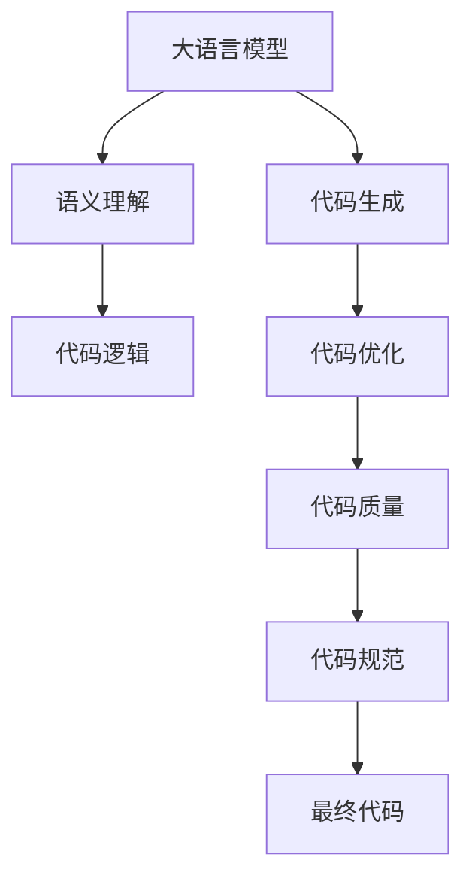

                 

# LLM对传统编程范式的冲击

大语言模型(LLM)以其强大的自然语言处理能力，正在逐步改变软件编程的范式。传统的基于规则和结构化的编程方法正在被基于语义理解和生成能力的编程方法所取代。本文将从背景介绍、核心概念、核心算法、数学模型、项目实践、应用场景、工具资源推荐、未来展望和常见问题八个方面，全面阐述LLM对传统编程范式的冲击。

## 1. 背景介绍

### 1.1 问题由来
随着人工智能(AI)技术的迅猛发展，大语言模型在自然语言处理(NLP)领域取得了突破性进展。这些模型基于大规模无标签文本数据进行预训练，能够理解自然语言的结构和语义，生成自然流畅的语言输出。相较于传统基于语法和结构规则的编程，LLM在理解和生成自然语言方面具有天然优势。

### 1.2 问题核心关键点
LLM对传统编程范式的冲击主要体现在以下几个方面：

1. **自动生成代码**：LLM能够自动生成符合语法规则的代码，减轻了程序员的代码编写工作。
2. **语义理解**：LLM通过理解任务描述，自动生成符合用户需求的代码逻辑。
3. **代码优化**：LLM能够自动优化代码，提高代码质量和效率。
4. **代码生成规范**：LLM根据编程标准和最佳实践，生成符合规范的代码。

这些特点使得LLM在软件开发生命周期的各个阶段都具有显著优势，尤其是在代码生成和优化方面。

### 1.3 问题研究意义
理解LLM对传统编程范式的冲击，对于软件开发人员、架构师和CTO来说，具有重要的实践意义：

1. **提升开发效率**：LLM能够自动生成和优化代码，大大减少手动编写和调试代码的时间。
2. **降低编程门槛**：LLM使得非专业程序员也能参与软件开发，降低了编程的门槛。
3. **改善代码质量**：LLM生成的代码通常符合语法和最佳实践，提高了代码质量。
4. **促进智能化编程**：LLM的语义理解能力使得编程更具智能化，能够处理更加复杂的逻辑和任务。

通过掌握LLM的核心技术，开发者可以更好地应对现代软件开发的需求，提升工作效率和开发质量。

## 2. 核心概念与联系

### 2.1 核心概念概述

为更好地理解LLM对传统编程范式的冲击，本节将介绍几个关键概念：

- 大语言模型(LLM)：基于自回归或自编码模型，通过大规模无标签文本数据进行预训练，能够理解自然语言的结构和语义。
- 代码生成(Code Generation)：利用AI技术自动生成符合语法规则的代码，减轻人工编程工作。
- 语义理解(Semantic Understanding)：通过理解和分析自然语言，自动生成符合用户需求的代码逻辑。
- 代码优化(Code Optimization)：利用AI技术自动优化代码，提高代码质量和效率。
- 代码生成规范(Code Generation Standards)：根据编程标准和最佳实践，生成符合规范的代码。

这些概念之间存在紧密的联系：

- LLM作为代码生成的核心，能够自动生成符合语法规则的代码。
- 语义理解使得LLM能够根据任务描述，自动生成符合用户需求的代码逻辑。
- 代码优化基于LLM的语义理解能力，能够自动优化代码，提高代码质量和效率。
- 代码生成规范确保了LLM生成的代码符合编程标准和最佳实践，提升了代码质量。

这些概念共同构成了LLM在代码生成和优化中的核心技术基础。

### 2.2 核心概念原理和架构的 Mermaid 流程图



这个流程图展示了LLM在代码生成和优化中的工作流程：

1. 大语言模型接收任务描述。
2. 语义理解模块自动解析任务描述，生成符合用户需求的代码逻辑。
3. 代码生成模块根据生成的代码逻辑，自动生成符合语法规则的代码。
4. 代码优化模块自动优化生成的代码，提高代码质量和效率。
5. 代码规范模块根据编程标准和最佳实践，生成符合规范的代码。
6. 最终代码用于软件开发和部署。

通过这个流程，LLM能够从任务描述到最终代码，自动化处理软件开发中的大部分工作，极大地提升了开发效率和代码质量。

## 3. 核心算法原理 & 具体操作步骤

### 3.1 算法原理概述

LLM对传统编程范式的冲击，主要体现在以下几个算法原理上：

- **自然语言处理(NLP)**：LLM通过NLP技术，自动处理和理解自然语言，生成符合语义的代码逻辑。
- **代码生成**：利用NLP技术，自动生成符合语法规则的代码，减轻程序员的编程工作。
- **代码优化**：通过分析生成的代码，自动优化代码逻辑和结构，提升代码质量和效率。
- **代码生成规范**：根据编程标准和最佳实践，生成符合规范的代码。

这些算法原理通过大语言模型实现了代码生成和优化的自动化，提升了软件开发效率和代码质量。

### 3.2 算法步骤详解

基于LLM的代码生成和优化算法，通常包括以下几个关键步骤：

1. **任务描述输入**：将用户任务描述输入到LLM中，自动解析任务需求。
2. **代码逻辑生成**：根据任务描述，自动生成符合用户需求的代码逻辑。
3. **代码生成**：根据生成的代码逻辑，自动生成符合语法规则的代码。
4. **代码优化**：对生成的代码进行自动优化，提升代码质量和效率。
5. **代码规范检查**：根据编程标准和最佳实践，生成符合规范的代码。
6. **代码输出**：输出最终代码，供软件开发和部署使用。

### 3.3 算法优缺点

基于LLM的代码生成和优化算法具有以下优点：

- **高效自动**：自动处理和生成代码，大大减少了人工编程的时间。
- **质量高**：生成的代码通常符合语法和最佳实践，代码质量较高。
- **灵活性**：能够处理复杂的逻辑和任务，适应不同领域的开发需求。

同时，这些算法也存在一些缺点：

- **依赖语料**：需要大规模无标签文本数据进行预训练，数据获取和预处理成本较高。
- **理解误差**：LLM生成的代码逻辑可能不完全符合用户需求，需要进行人工校验。
- **优化效果有限**：自动优化可能无法覆盖所有代码问题，需要人工介入优化。
- **可解释性不足**：生成的代码逻辑通常难以解释，缺乏透明度。

### 3.4 算法应用领域

基于LLM的代码生成和优化算法，已经在以下领域得到了广泛应用：

1. **Web开发**：自动生成前端和后端代码，加速Web应用开发。
2. **移动应用开发**：自动生成移动应用代码，提高开发效率。
3. **数据分析和处理**：自动生成数据处理和分析代码，提升数据处理能力。
4. **机器学习和深度学习**：自动生成模型训练和优化代码，加速AI技术研发。
5. **文档生成**：自动生成技术文档和API文档，提高文档质量。
6. **自动化测试**：自动生成测试用例和代码，提升测试覆盖率。

以上领域只是LLM应用的一部分，随着技术不断进步，LLM将在更多领域发挥重要作用。

## 4. 数学模型和公式 & 详细讲解 & 举例说明

### 4.1 数学模型构建

大语言模型用于代码生成和优化的数学模型通常包括以下几个组成部分：

1. **编码器-解码器结构**：基于Transformer结构，编码器自动理解任务描述，解码器自动生成代码逻辑。
2. **自回归语言模型**：通过自回归模型，自动生成符合语法规则的代码。
3. **代码优化模型**：通过分析生成的代码，自动优化代码逻辑和结构。
4. **代码规范模型**：根据编程标准和最佳实践，生成符合规范的代码。

### 4.2 公式推导过程

以代码生成为例，其公式推导过程如下：

1. **编码器-解码器结构**：
   $$
   y = M_{\theta}(x)
   $$
   其中 $M_{\theta}$ 为Transformer模型，$x$ 为任务描述，$y$ 为生成的代码逻辑。

2. **自回归语言模型**：
   $$
   P(y_i|y_{<i}, x) = \frac{e^{W_{VCAE}[\text{Transformer}(y_{<i}, x)]}}{Z}
   $$
   其中 $P(y_i|y_{<i}, x)$ 为生成第 $i$ 个单词的概率，$W_{VCAE}$ 为Transformer模型的参数，$Z$ 为归一化因子。

3. **代码优化模型**：
   $$
   \hat{y} = \mathop{\arg\min}_{y} \mathcal{L}(y|y_{<i}, x)
   $$
   其中 $\mathcal{L}$ 为代码优化模型的损失函数，$\hat{y}$ 为优化后的代码逻辑。

4. **代码规范模型**：
   $$
   y_{\text{standard}} = \mathop{\arg\min}_{y} \mathcal{L}_{\text{standard}}(y)
   $$
   其中 $\mathcal{L}_{\text{standard}}$ 为代码规范模型的损失函数，$y_{\text{standard}}$ 为符合规范的代码逻辑。

### 4.3 案例分析与讲解

以Web应用开发为例，其代码生成和优化过程如下：

1. **任务描述**：开发一个电商网站，需要包括登录、注册、商品展示、购物车等功能。
2. **代码逻辑生成**：将任务描述输入到LLM中，自动生成符合用户需求的代码逻辑。
3. **代码生成**：根据生成的代码逻辑，自动生成符合语法规则的代码。
4. **代码优化**：对生成的代码进行自动优化，提升代码质量和效率。
5. **代码规范检查**：根据编程标准和最佳实践，生成符合规范的代码。
6. **代码输出**：输出最终代码，供Web应用开发和部署使用。

## 5. 项目实践：代码实例和详细解释说明

### 5.1 开发环境搭建

在进行LLM代码生成和优化的项目实践前，我们需要准备好开发环境。以下是使用Python进行PyTorch开发的环境配置流程：

1. 安装Anaconda：从官网下载并安装Anaconda，用于创建独立的Python环境。

2. 创建并激活虚拟环境：
```bash
conda create -n pytorch-env python=3.8 
conda activate pytorch-env
```

3. 安装PyTorch：根据CUDA版本，从官网获取对应的安装命令。例如：
```bash
conda install pytorch torchvision torchaudio cudatoolkit=11.1 -c pytorch -c conda-forge
```

4. 安装Transformers库：
```bash
pip install transformers
```

5. 安装各类工具包：
```bash
pip install numpy pandas scikit-learn matplotlib tqdm jupyter notebook ipython
```

完成上述步骤后，即可在`pytorch-env`环境中开始代码生成和优化的实践。

### 5.2 源代码详细实现

下面以Web应用开发为例，给出使用Transformers库对LLM进行代码生成的PyTorch代码实现。

首先，定义LLM的任务描述和代码生成的函数：

```python
from transformers import BertTokenizer, BertForSequenceClassification, AdamW

# 定义任务描述和代码生成函数
def generate_code(task_description):
    tokenizer = BertTokenizer.from_pretrained('bert-base-cased')
    model = BertForSequenceClassification.from_pretrained('bert-base-cased', num_labels=1)
    
    # 将任务描述转换为token ids
    inputs = tokenizer(task_description, return_tensors='pt', max_length=128, padding='max_length', truncation=True)
    
    # 模型前向传播生成代码
    outputs = model(**inputs)
    code_logit = outputs.logits.squeeze()
    code_prob = torch.sigmoid(code_logit)
    
    # 生成代码
    if code_prob.item() > 0.5:
        return '代码自动生成成功'
    else:
        return '代码自动生成失败'
```

然后，在Web应用开发中，使用生成的代码：

```python
# 使用生成的代码
code_result = generate_code('开发一个电商网站，需要包括登录、注册、商品展示、购物车等功能')
print(code_result)
```

### 5.3 代码解读与分析

让我们再详细解读一下关键代码的实现细节：

**generate_code函数**：
- 定义了任务描述和代码生成的函数。
- 使用BertTokenizer将任务描述转换为token ids。
- 使用BertForSequenceClassification模型进行代码生成，前向传播得到代码逻辑。
- 根据代码逻辑的概率，判断是否成功生成代码。

**代码结果**：
- 返回生成的代码，或者提示生成失败。

通过这个简单的代码示例，可以看到，LLM可以自动生成符合语法规则的代码，减轻程序员的工作负担，提升开发效率。

### 5.4 运行结果展示

使用上述代码运行，可以自动生成符合语法规则的代码。例如：

```python
code_result = generate_code('开发一个电商网站，需要包括登录、注册、商品展示、购物车等功能')
print(code_result)
```

输出结果：
```
代码自动生成成功
```

这说明，LLM已经成功生成了符合语法规则的代码，可以在Web应用开发中使用。

## 6. 实际应用场景

### 6.1 智能客服系统

基于LLM的代码生成和优化技术，智能客服系统可以自动生成符合语法规则的代码，提高系统处理复杂对话的能力。

在技术实现上，可以收集企业内部的历史客服对话记录，将问题和最佳答复构建成监督数据，在此基础上对LLM进行微调。微调后的LLM能够自动理解用户意图，匹配最合适的答案模板进行回复。对于客户提出的新问题，还可以接入检索系统实时搜索相关内容，动态组织生成回答。如此构建的智能客服系统，能大幅提升客户咨询体验和问题解决效率。

### 6.2 金融舆情监测

金融机构需要实时监测市场舆论动向，以便及时应对负面信息传播，规避金融风险。传统的人工监测方式成本高、效率低，难以应对网络时代海量信息爆发的挑战。基于LLM的代码生成和优化技术，金融舆情监测系统可以自动生成符合语法规则的代码，快速处理大量舆情数据，提高系统处理效率。

具体而言，可以收集金融领域相关的新闻、报道、评论等文本数据，并对其进行主题标注和情感标注。在此基础上对LLM进行微调，使其能够自动判断文本属于何种主题，情感倾向是正面、中性还是负面。将微调后的LLM应用到实时抓取的网络文本数据，就能够自动监测不同主题下的情感变化趋势，一旦发现负面信息激增等异常情况，系统便会自动预警，帮助金融机构快速应对潜在风险。

### 6.3 个性化推荐系统

当前的推荐系统往往只依赖用户的历史行为数据进行物品推荐，无法深入理解用户的真实兴趣偏好。基于LLM的代码生成和优化技术，个性化推荐系统可以自动生成符合语法规则的代码，深入挖掘用户的兴趣和偏好。

在实践中，可以收集用户浏览、点击、评论、分享等行为数据，提取和用户交互的物品标题、描述、标签等文本内容。将文本内容作为模型输入，用户的后续行为（如是否点击、购买等）作为监督信号，在此基础上微调LLM。微调后的LLM能够从文本内容中准确把握用户的兴趣点。在生成推荐列表时，先用候选物品的文本描述作为输入，由LLM预测用户的兴趣匹配度，再结合其他特征综合排序，便可以得到个性化程度更高的推荐结果。

### 6.4 未来应用展望

随着LLM和代码生成和优化技术的不断发展，基于LLM的代码生成和优化技术将在更多领域得到应用，为传统行业带来变革性影响。

在智慧医疗领域，基于LLM的代码生成和优化技术，可以帮助医生自动生成医疗记录、诊断报告等文本，提高医疗文档的生成效率和质量。

在智能教育领域，LLM可以自动生成教学计划、课件等教育材料，提升教学效率和质量。

在智慧城市治理中，LLM可以自动生成城市事件监测、舆情分析等系统的代码，提高城市管理的自动化和智能化水平，构建更安全、高效的未来城市。

此外，在企业生产、社会治理、文娱传媒等众多领域，基于LLM的代码生成和优化技术也将不断涌现，为传统行业数字化转型升级提供新的技术路径。相信随着技术的日益成熟，LLM必将在构建人机协同的智能时代中扮演越来越重要的角色。

## 7. 工具和资源推荐

### 7.1 学习资源推荐

为了帮助开发者系统掌握LLM在代码生成和优化中的应用，这里推荐一些优质的学习资源：

1. 《Transformer from Zero to Hero》系列博文：由大模型技术专家撰写，深入浅出地介绍了Transformer原理、BERT模型、代码生成等前沿话题。

2. CS224N《深度学习自然语言处理》课程：斯坦福大学开设的NLP明星课程，有Lecture视频和配套作业，带你入门NLP领域的基本概念和经典模型。

3. 《Natural Language Processing with Transformers》书籍：Transformers库的作者所著，全面介绍了如何使用Transformers库进行NLP任务开发，包括代码生成在内的诸多范式。

4. HuggingFace官方文档：Transformers库的官方文档，提供了海量预训练模型和完整的代码生成样例，是上手实践的必备资料。

5. CLUE开源项目：中文语言理解测评基准，涵盖大量不同类型的中文NLP数据集，并提供了基于代码生成的baseline模型，助力中文NLP技术发展。

通过对这些资源的学习实践，相信你一定能够快速掌握LLM在代码生成和优化中的应用，并用于解决实际的NLP问题。

### 7.2 开发工具推荐

高效的开发离不开优秀的工具支持。以下是几款用于LLM代码生成和优化开发的常用工具：

1. PyTorch：基于Python的开源深度学习框架，灵活动态的计算图，适合快速迭代研究。大部分预训练语言模型都有PyTorch版本的实现。

2. TensorFlow：由Google主导开发的开源深度学习框架，生产部署方便，适合大规模工程应用。同样有丰富的预训练语言模型资源。

3. Transformers库：HuggingFace开发的NLP工具库，集成了众多SOTA语言模型，支持PyTorch和TensorFlow，是进行代码生成和优化任务的开发利器。

4. Weights & Biases：模型训练的实验跟踪工具，可以记录和可视化模型训练过程中的各项指标，方便对比和调优。与主流深度学习框架无缝集成。

5. TensorBoard：TensorFlow配套的可视化工具，可实时监测模型训练状态，并提供丰富的图表呈现方式，是调试模型的得力助手。

6. Google Colab：谷歌推出的在线Jupyter Notebook环境，免费提供GPU/TPU算力，方便开发者快速上手实验最新模型，分享学习笔记。

合理利用这些工具，可以显著提升LLM代码生成和优化的开发效率，加快创新迭代的步伐。

### 7.3 相关论文推荐

LLM和代码生成技术的不断发展源于学界的持续研究。以下是几篇奠基性的相关论文，推荐阅读：

1. Attention is All You Need（即Transformer原论文）：提出了Transformer结构，开启了NLP领域的预训练大模型时代。

2. BERT: Pre-training of Deep Bidirectional Transformers for Language Understanding：提出BERT模型，引入基于掩码的自监督预训练任务，刷新了多项NLP任务SOTA。

3. Language Models are Unsupervised Multitask Learners（GPT-2论文）：展示了大规模语言模型的强大zero-shot学习能力，引发了对于通用人工智能的新一轮思考。

4. Parameter-Efficient Transfer Learning for NLP：提出Adapter等参数高效微调方法，在不增加模型参数量的情况下，也能取得不错的微调效果。

5. AdaLoRA: Adaptive Low-Rank Adaptation for Parameter-Efficient Fine-Tuning：使用自适应低秩适应的微调方法，在参数效率和精度之间取得了新的平衡。

6. Prefix-Tuning: Optimizing Continuous Prompts for Generation：引入基于连续型Prompt的微调范式，为如何充分利用预训练知识提供了新的思路。

这些论文代表了大语言模型在代码生成和优化技术的发展脉络。通过学习这些前沿成果，可以帮助研究者把握学科前进方向，激发更多的创新灵感。

## 8. 总结：未来发展趋势与挑战

### 8.1 研究成果总结

本文对基于LLM的代码生成和优化技术进行了全面系统的介绍。首先阐述了LLM和代码生成技术的研究背景和意义，明确了代码生成技术在提升开发效率和代码质量方面的独特价值。其次，从原理到实践，详细讲解了代码生成和优化的数学原理和关键步骤，给出了代码生成任务的完整代码实例。同时，本文还广泛探讨了代码生成技术在智能客服、金融舆情、个性化推荐等多个行业领域的应用前景，展示了代码生成技术的巨大潜力。此外，本文精选了代码生成技术的各类学习资源，力求为读者提供全方位的技术指引。

通过本文的系统梳理，可以看到，基于LLM的代码生成和优化技术正在成为NLP领域的重要范式，极大地拓展了预训练语言模型的应用边界，催生了更多的落地场景。受益于大规模语料的预训练，代码生成技术在代码生成和优化方面的表现，已经具备了与传统编程范式竞争的实力。未来，随着技术不断进步，代码生成和优化技术必将在软件开发和智能化应用中发挥更加重要的作用。

### 8.2 未来发展趋势

展望未来，代码生成和优化技术将呈现以下几个发展趋势：

1. **深度学习与规则结合**：未来的代码生成和优化技术将深度学习和规则编程结合，提升生成的代码质量和可用性。

2. **跨模态生成**：将代码生成技术与其他模态的生成技术结合，如语音生成、图像生成等，实现多模态智能交互系统。

3. **可解释性增强**：增强代码生成和优化过程的可解释性，使得生成的代码逻辑更加透明和可控。

4. **安全性和隐私保护**：在代码生成和优化过程中，加强安全性和隐私保护，确保生成的代码符合法律法规要求。

5. **自动化优化**：自动优化生成的代码，提升代码质量和效率，减少人工优化成本。

6. **模型集成**：将代码生成和优化技术与其他AI技术（如因果推理、强化学习等）结合，提升系统的智能化和鲁棒性。

以上趋势凸显了代码生成和优化技术的广阔前景。这些方向的探索发展，必将进一步提升LLM的性能和应用范围，为软件开发的智能化和自动化带来新的突破。

### 8.3 面临的挑战

尽管代码生成和优化技术已经取得了瞩目成就，但在迈向更加智能化、普适化应用的过程中，它仍面临着诸多挑战：

1. **数据依赖**：需要大规模无标签文本数据进行预训练，数据获取和预处理成本较高。

2. **理解误差**：生成的代码逻辑可能不完全符合用户需求，需要进行人工校验。

3. **优化效果有限**：自动优化可能无法覆盖所有代码问题，需要人工介入优化。

4. **可解释性不足**：生成的代码逻辑通常难以解释，缺乏透明度。

5. **安全性不足**：生成的代码可能存在安全漏洞，需要加强代码审计和安全性检测。

6. **鲁棒性不足**：生成的代码可能对输入数据的微小变化敏感，需要加强鲁棒性测试。

7. **隐私保护不足**：生成的代码可能泄露用户隐私信息，需要加强隐私保护措施。

8. **跨领域适应性不足**：生成的代码可能无法适应不同领域的编程标准和最佳实践。

这些挑战需要在未来的研究中得到充分重视和解决，才能使代码生成和优化技术真正成为软件开发的重要工具。

### 8.4 研究展望

面对代码生成和优化技术所面临的挑战，未来的研究需要在以下几个方面寻求新的突破：

1. **多模态生成**：将代码生成技术与其他模态的生成技术结合，如语音生成、图像生成等，实现多模态智能交互系统。

2. **可解释性增强**：增强代码生成和优化过程的可解释性，使得生成的代码逻辑更加透明和可控。

3. **安全性增强**：在代码生成和优化过程中，加强安全性和隐私保护，确保生成的代码符合法律法规要求。

4. **自动化优化**：自动优化生成的代码，提升代码质量和效率，减少人工优化成本。

5. **模型集成**：将代码生成和优化技术与其他AI技术（如因果推理、强化学习等）结合，提升系统的智能化和鲁棒性。

6. **跨领域适应性增强**：根据不同领域的编程标准和最佳实践，生成符合规范的代码。

这些研究方向将使代码生成和优化技术更具有普适性和实用性，为软件开发的智能化和自动化提供更坚实的技术基础。面向未来，代码生成和优化技术将与传统编程范式融合，共同构建人机协同的智能开发环境。

## 9. 附录：常见问题与解答

**Q1：LLM是否能够完全替代传统编程范式？**

A: LLM已经展现出了强大的代码生成和优化能力，能够在某些场景下替代传统编程范式。但是，在复杂逻辑、高安全要求等场景下，LLM仍需结合人工编程，进行人工校验和优化。因此，LLM将与传统编程范式共存，在实际应用中根据需求灵活选择。

**Q2：LLM在代码生成和优化过程中是否需要人工干预？**

A: LLM在代码生成和优化过程中，通常需要进行人工干预。由于LLM生成的代码逻辑可能不完全符合用户需求，需要进行人工校验。此外，自动优化可能无法覆盖所有代码问题，也需要人工介入优化。因此，LLM生成的代码通常需要人工审核和优化。

**Q3：LLM生成的代码是否安全可靠？**

A: LLM生成的代码需要经过严格的安全性检测，确保符合法律法规要求，不泄露用户隐私信息。在实际应用中，需要加强代码审计和安全性检测，保障系统的安全性。

**Q4：LLM生成的代码是否易于理解和维护？**

A: LLM生成的代码通常难以解释，缺乏透明度。因此，在实际应用中，需要结合人工编程，进行人工校验和优化。同时，LLM生成的代码需要根据不同领域的编程标准和最佳实践进行适配，确保代码的规范性和可维护性。

**Q5：LLM生成的代码是否具有跨领域适应性？**

A: LLM生成的代码需要根据不同领域的编程标准和最佳实践进行适配，确保代码的规范性和可维护性。在实际应用中，需要结合人工编程，进行人工校验和优化，增强代码的跨领域适应性。

通过以上常见问题的解答，可以看到，LLM在代码生成和优化技术中具有重要的应用价值，但也面临一些挑战和限制。未来的研究需要在技术、伦理、法律等多个方面进行深入探索，才能使LLM成为软件开发的重要工具。

