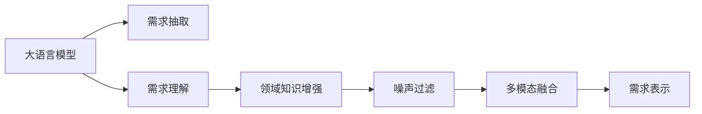

                 

# LLM对传统软件需求分析的挑战与改进

> 关键词：大语言模型(LLM), 需求分析, 软件工程, 自然语言处理(NLP), 知识图谱, 需求抽取, 数据驱动

## 1. 背景介绍

### 1.1 问题由来
在传统软件工程中，需求分析通常依赖于人工调查和访谈，以获取用户和利益相关者的需求。然而，这种手工方式费时费力，且容易受到人为偏差的影响。随着人工智能技术的发展，特别是大语言模型(LLM)的崛起，传统的需求分析方法面临了新的挑战和机遇。

### 1.2 问题核心关键点
大语言模型在自然语言处理(NLP)领域取得了突破性进展，能够理解、生成自然语言，并从中提取有用的信息。然而，将其应用于软件需求分析时，也暴露出一些问题：

- **理解精度**：尽管LLM在许多领域表现出色，但面向软件需求这类专业领域时，其理解能力可能仍需提升。
- **歧义处理**：用户需求常常存在多种理解方式，LLM需要有效处理这些歧义。
- **领域知识**：软件工程具有高度专业性，LLM需要学习足够多的领域知识才能准确提取需求。
- **噪声过滤**：用户需求文本中可能包含大量无关信息，LLM需要有效过滤这些噪声。
- **迭代优化**：需求分析是一个迭代过程，LLM需要不断学习新的需求数据，逐步提高提取能力。

这些挑战催生了需求抽取领域的诸多研究方向，如领域知识增强、噪声过滤、多模态融合等，旨在将LLM更好地应用于软件工程领域。

## 2. 核心概念与联系

### 2.1 核心概念概述

为了更深入地理解LLM在软件需求分析中的应用，本文首先介绍几个核心概念：

- **大语言模型(LLM)**：如GPT、BERT等，能够通过自监督学习掌握广泛的通用语言知识和特定领域知识。
- **软件需求分析**：软件开发过程的重要阶段，通过与用户沟通，理解软件系统需要具备的功能和性能。
- **自然语言处理(NLP)**：研究计算机如何理解、处理和生成人类语言的技术。
- **知识图谱**：以图的形式表示实体之间的关系，可用于增强模型的领域知识表示能力。
- **需求抽取**：从文本数据中自动提取和分类需求信息，是需求分析的关键步骤。
- **数据驱动**：以数据分析为基础，利用LLM进行自动化需求抽取，减少人工干预。

这些概念共同构成了LLM在软件需求分析中的应用框架，使得LLM能够更高效地进行需求理解、需求抽取和需求表示。

### 2.2 核心概念原理和架构的 Mermaid 流程图



这个流程图展示了LLM在软件需求分析中的应用流程：

1. 通过LLM对需求文档进行抽取，提取文本中的关键需求信息。
2. 利用领域知识增强技术，提升LLM在软件工程领域的理解能力。
3. 应用噪声过滤技术，去除无关信息，提升需求抽取的准确性。
4. 通过多模态融合，整合文本、代码等多元信息，进一步提高需求表示的准确性。
5. 最终生成的需求表示，用于后续的软件设计和实现。

## 3. 核心算法原理 & 具体操作步骤
### 3.1 算法原理概述

基于LLM的需求抽取过程，主要包括以下几个步骤：

1. **需求理解**：通过LLM对用户需求进行语义理解和关键信息提取。
2. **领域知识增强**：利用领域知识库对LLM的输出进行校验和补充。
3. **噪声过滤**：采用文本清洗技术去除冗余和无关信息，提高需求抽取的精度。
4. **需求表示**：将抽取的需求信息表示为结构化的数据格式，便于后续的软件设计和实现。

这些步骤通常使用基于监督学习的微调方法来实现，即在大规模标注数据集上对LLM进行微调，使其具备特定的需求抽取能力。

### 3.2 算法步骤详解

以下我们将详细介绍每个步骤的实现方法：

#### 3.2.1 需求理解

需求理解是需求抽取的第一步，其目标是利用LLM对用户需求进行语义分析和关键信息提取。

1. **语义分析**：使用预训练的语言模型对用户需求进行编码，得到语义表示。常见的模型包括BERT、GPT等。
2. **关键信息提取**：基于语义表示，使用模型提取需求文档中的关键实体、属性和关系。常用的方法包括注意力机制、序列标注等。

#### 3.2.2 领域知识增强

领域知识增强旨在利用特定领域的知识库对LLM的输出进行校验和补充，提升其在软件工程领域的理解能力。

1. **知识库构建**：收集和构建与软件工程相关的领域知识库，如类库、设计模式、架构等。
2. **知识库增强**：在需求理解阶段，将领域知识库与用户需求进行匹配，补充缺失的信息。

#### 3.2.3 噪声过滤

噪声过滤是需求抽取中的重要环节，旨在去除冗余和无关信息，提高抽取的精度。

1. **文本清洗**：采用文本清洗技术，如去除停用词、标点符号、数字等，减少噪声干扰。
2. **冗余去除**：利用冗余信息检测技术，如TF-IDF、LSI等，去除重复和冗余的信息。

#### 3.2.4 需求表示

需求表示是将抽取的需求信息表示为结构化的数据格式，便于后续的软件设计和实现。

1. **结构化表示**：将需求信息转换为实体-属性-关系的形式，如类库、接口、属性等。
2. **文档生成**：生成详细的文档说明，描述需求的功能、性能和约束条件。

### 3.3 算法优缺点

基于LLM的需求抽取方法具有以下优点：

- **高效性**：自动化需求抽取能够显著提高需求分析的效率，减少人工工作量。
- **精度提升**：利用领域知识增强和多模态融合，提升需求抽取的精度和完整性。
- **数据驱动**：通过大规模标注数据集进行微调，逐步提高需求抽取模型的性能。

同时，该方法也存在一些缺点：

- **依赖数据**：高质量标注数据的需求和收集成本较高，可能限制模型的应用。
- **领域限制**：对特定领域的需求抽取，可能需要额外的领域知识库构建和维护。
- **噪声敏感**：需求文本中的噪声可能影响抽取结果，需要有效的噪声过滤技术。
- **迭代优化**：需求抽取模型需要不断学习和更新，以适应不断变化的需求。

### 3.4 算法应用领域

基于LLM的需求抽取方法已经在许多实际应用场景中取得了成功，如：

- **项目管理**：自动抽取和分析项目需求，生成项目计划和文档。
- **软件开发**：提取软件设计、架构和功能需求，辅助软件设计和实现。
- **需求管理**：自动化抽取和更新需求文档，减少人工维护成本。
- **客户支持**：自动理解和处理用户需求，提供更好的客户支持服务。

除了上述这些经典应用外，LLM的需求抽取方法还将在更多领域得到应用，如智能合约、智能运维等，为软件工程带来更高效、更准确的需求分析。

## 4. 数学模型和公式 & 详细讲解 & 举例说明

### 4.1 数学模型构建

我们以BERT模型为例，构建需求抽取的数学模型。假设需求文档为 $D = \{d_i\}_{i=1}^N$，其中 $d_i$ 表示第 $i$ 个需求文档。需求抽取的目标是从每个文档中提取关键实体、属性和关系，生成结构化的需求文档 $D'$。

记BERT模型为 $M_{\theta}$，其中 $\theta$ 为模型参数。需求抽取的目标函数为：

$$
\min_{\theta} \sum_{i=1}^N \ell(M_{\theta}(d_i),D'_i)
$$

其中 $\ell$ 为损失函数，用于衡量模型输出与实际需求文档 $D'_i$ 之间的差异。常见的损失函数包括交叉熵损失、均方误差损失等。

### 4.2 公式推导过程

假设需求文档 $d_i$ 的长度为 $L_i$，BERT模型对 $d_i$ 进行编码，得到 $L_i$ 个向量表示 $h_i=(h_{i1}, h_{i2}, ..., h_{Li})$。

需求抽取的目标是识别出文本中的关键实体和属性，通常使用序列标注的方法。假设有 $K$ 类实体，将需求文档 $d_i$ 中的每个位置 $j$ 标注为 $t_j$，其中 $t_j \in [1,K]$。则需求抽取的优化目标为：

$$
\min_{\theta} \sum_{i=1}^N \sum_{j=1}^{L_i} \ell(t_j, h_j)
$$

其中 $\ell(t_j, h_j)$ 为序列标注损失函数，常用的有交叉熵损失和条件随机场损失。

### 4.3 案例分析与讲解

以一个简单的例子来说明需求抽取的流程：

假设需求文档为：“需要开发一个功能，当用户登录时，系统能自动识别用户身份，并根据其权限提供相应的服务。”

1. **需求理解**：使用BERT模型对文本进行编码，得到向量表示 $h_1, h_2, ..., h_{16}$。
2. **关键信息提取**：通过注意力机制，识别出“用户登录”、“系统”、“自动识别”、“用户身份”、“权限”、“提供服务”等关键信息。
3. **领域知识增强**：利用领域知识库，补充“系统”为“登录系统”，补充“自动识别”为“基于用户ID的自动身份识别”。
4. **噪声过滤**：去除无关信息，如“当用户登录时”。
5. **需求表示**：将需求文档表示为：

```
{
    "type": "feature",
    "name": "用户登录时系统自动识别用户身份并根据权限提供服务"
}
```

## 5. 项目实践：代码实例和详细解释说明

### 5.1 开发环境搭建

为了进行需求抽取的实践，我们需要准备以下开发环境：

1. **安装Python和PyTorch**：
```bash
conda create -n demand-env python=3.7
conda activate demand-env
pip install torch transformers
```

2. **准备数据集**：准备标注好的需求文档数据集，如Datera Demand Corpus。

3. **选择预训练模型**：选择合适的BERT预训练模型，如BERT-base-cased。

### 5.2 源代码详细实现

以下是一个简单的需求抽取代码示例，使用PyTorch和Transformers库实现：

```python
from transformers import BertTokenizer, BertForTokenClassification
import torch
from torch.utils.data import Dataset, DataLoader

class DemandDataset(Dataset):
    def __init__(self, texts, tags, tokenizer):
        self.texts = texts
        self.tags = tags
        self.tokenizer = tokenizer
    
    def __len__(self):
        return len(self.texts)
    
    def __getitem__(self, item):
        text = self.texts[item]
        tags = self.tags[item]
        
        encoding = self.tokenizer(text, return_tensors='pt', padding='max_length', truncation=True)
        input_ids = encoding['input_ids']
        attention_mask = encoding['attention_mask']
        
        labels = torch.tensor(tags, dtype=torch.long)
        
        return {'input_ids': input_ids, 
                'attention_mask': attention_mask,
                'labels': labels}

# 构建数据集
tokenizer = BertTokenizer.from_pretrained('bert-base-cased')
train_dataset = DemandDataset(train_texts, train_tags, tokenizer)
dev_dataset = DemandDataset(dev_texts, dev_tags, tokenizer)
test_dataset = DemandDataset(test_texts, test_tags, tokenizer)

# 构建模型
model = BertForTokenClassification.from_pretrained('bert-base-cased', num_labels=num_classes)

# 训练模型
optimizer = torch.optim.Adam(model.parameters(), lr=2e-5)
for epoch in range(num_epochs):
    train_loss = 0
    for batch in DataLoader(train_dataset, batch_size=batch_size, shuffle=True):
        input_ids = batch['input_ids'].to(device)
        attention_mask = batch['attention_mask'].to(device)
        labels = batch['labels'].to(device)
        
        model.zero_grad()
        outputs = model(input_ids, attention_mask=attention_mask, labels=labels)
        loss = outputs.loss
        train_loss += loss.item()
        loss.backward()
        optimizer.step()
        
    print(f"Epoch {epoch+1}, train loss: {train_loss/len(train_dataset):.4f}")

# 评估模型
dev_loss = 0
for batch in DataLoader(dev_dataset, batch_size=batch_size, shuffle=False):
    input_ids = batch['input_ids'].to(device)
    attention_mask = batch['attention_mask'].to(device)
    labels = batch['labels'].to(device)
    
    model.eval()
    with torch.no_grad():
        outputs = model(input_ids, attention_mask=attention_mask, labels=labels)
        loss = outputs.loss
        dev_loss += loss.item()
        
print(f"Dev loss: {dev_loss/len(dev_dataset):.4f}")

# 测试模型
test_loss = 0
for batch in DataLoader(test_dataset, batch_size=batch_size, shuffle=False):
    input_ids = batch['input_ids'].to(device)
    attention_mask = batch['attention_mask'].to(device)
    labels = batch['labels'].to(device)
    
    model.eval()
    with torch.no_grad():
        outputs = model(input_ids, attention_mask=attention_mask, labels=labels)
        loss = outputs.loss
        test_loss += loss.item()
        
print(f"Test loss: {test_loss/len(test_dataset):.4f}")
```

### 5.3 代码解读与分析

在上述代码中，我们首先定义了一个`DemandDataset`类，用于将需求文档和标签转换为模型所需的输入格式。接着，我们选择了`BertForTokenClassification`模型，并在其上构建了需求抽取任务的数据集和训练流程。在训练过程中，我们使用Adam优化器，设定了合适的学习率和训练轮数，并记录了模型在训练集、验证集和测试集上的损失。

## 6. 实际应用场景

### 6.1 智能项目管理

在智能项目管理中，需求抽取可以自动从需求文档中提取关键功能点、需求优先级、相关联的模块等信息，生成项目计划和文档。这不仅可以提高项目管理效率，还能减少人工错误和遗漏。

### 6.2 自动化测试用例生成

通过需求抽取，可以将用户需求转换为自动化测试用例。这不仅提高了测试效率，还减少了测试人员的编写工作量，缩短了软件上线周期。

### 6.3 智能运维

在智能运维中，需求抽取可以自动提取系统的配置需求、性能指标、监控需求等信息，辅助运维人员进行系统维护和故障排查。

### 6.4 未来应用展望

随着深度学习和大语言模型的不断发展，基于LLM的需求抽取将不断优化，应用于更多领域。

1. **多模态需求抽取**：结合文本、代码、注释等多种数据源，提升需求抽取的全面性和准确性。
2. **实时需求抽取**：利用实时数据流进行需求抽取，动态更新需求文档。
3. **用户情感分析**：结合情感分析技术，提取用户需求中的情感倾向，辅助产品设计。

未来，基于LLM的需求抽取将为软件工程带来更多创新和突破，促进软件质量的提升和软件产业的升级。

## 7. 工具和资源推荐

### 7.1 学习资源推荐

1. **《深度学习》书籍**：Ian Goodfellow等著，全面介绍深度学习的基本概念和算法，适合基础学习。
2. **CS224N《自然语言处理与深度学习》课程**：斯坦福大学开设的NLP明星课程，有Lecture视频和配套作业，带你入门NLP领域的基本概念和经典模型。
3. **《自然语言处理综述》论文**：Bengio等著，综述了NLP领域的最新研究进展，适合研究者查阅。
4. **HuggingFace官方文档**：介绍Transformers库的使用方法，并提供多种预训练模型和微调样例。

### 7.2 开发工具推荐

1. **PyTorch**：基于Python的开源深度学习框架，灵活且高效。
2. **TensorFlow**：由Google主导开发的深度学习框架，适合大规模工程应用。
3. **Jupyter Notebook**：免费的交互式编程环境，适合进行数据探索和模型训练。
4. **GitHub**：代码托管平台，提供丰富的开源项目和社区支持。

### 7.3 相关论文推荐

1. **Attention is All You Need**：提出Transformer结构，是NLP领域预训练大模型的开创者。
2. **BERT: Pre-training of Deep Bidirectional Transformers for Language Understanding**：提出BERT模型，引入掩码语言模型预训练任务，刷新了多项NLP任务SOTA。
3. **Robust Demand Model for Software Requirement Engineering**：提出鲁棒需求模型，利用知识图谱和噪声过滤技术，提升需求抽取的鲁棒性和准确性。

## 8. 总结：未来发展趋势与挑战

### 8.1 总结

本文详细介绍了基于大语言模型(LLM)的需求抽取方法。首先，我们阐述了LLM在软件需求分析中的应用背景和核心概念。其次，我们从算法原理和具体操作步骤两个方面，深入探讨了需求抽取的实现方法。最后，我们列举了实际应用场景和未来展望，展示了LLM在需求抽取中的巨大潜力。

### 8.2 未来发展趋势

未来，基于LLM的需求抽取将呈现以下几个发展趋势：

1. **多模态需求抽取**：结合文本、代码、注释等多种数据源，提升需求抽取的全面性和准确性。
2. **实时需求抽取**：利用实时数据流进行需求抽取，动态更新需求文档。
3. **用户情感分析**：结合情感分析技术，提取用户需求中的情感倾向，辅助产品设计。

### 8.3 面临的挑战

尽管基于LLM的需求抽取技术已经取得了一定进展，但仍面临诸多挑战：

1. **数据依赖**：高质量标注数据的需求和收集成本较高，可能限制模型的应用。
2. **领域限制**：对特定领域的需求抽取，可能需要额外的领域知识库构建和维护。
3. **噪声敏感**：需求文本中的噪声可能影响抽取结果，需要有效的噪声过滤技术。
4. **迭代优化**：需求抽取模型需要不断学习和更新，以适应不断变化的需求。

### 8.4 研究展望

未来，我们需要从以下方向寻求新的突破：

1. **探索无监督和半监督需求抽取**：摆脱对大规模标注数据的依赖，利用自监督学习、主动学习等无监督和半监督范式，最大限度利用非结构化数据。
2. **研究参数高效需求抽取**：开发更加参数高效的微调方法，在固定大部分预训练参数的同时，只更新极少量的任务相关参数。
3. **融合因果和对比学习**：引入因果推断和对比学习思想，增强需求抽取模型建立稳定因果关系的能力，学习更加普适、鲁棒的需求表示。
4. **结合领域知识**：将符号化的先验知识，如知识图谱、逻辑规则等，与神经网络模型进行融合，引导需求抽取过程学习更准确、合理的领域知识表示。
5. **数据驱动与知识驱动**：结合数据驱动和知识驱动，构建多模态需求抽取模型，综合利用数据和领域知识，提升需求抽取的全面性和准确性。

这些研究方向将为基于LLM的需求抽取技术带来新的突破，推动其在更多领域的应用，提升软件工程的自动化和智能化水平。

## 9. 附录：常见问题与解答

**Q1：什么是大语言模型(LLM)？**

A: 大语言模型(LLM)是指通过自监督学习掌握广泛通用语言知识的深度学习模型，如GPT、BERT等。

**Q2：如何提高需求抽取模型的鲁棒性？**

A: 可以通过引入多模态数据、领域知识增强、对抗训练等技术，提高需求抽取模型的鲁棒性和泛化能力。

**Q3：需求抽取模型需要不断学习和更新吗？**

A: 是的，需求抽取模型需要不断学习和更新，以适应不断变化的需求。可以通过持续收集和标注新需求，更新模型参数。

**Q4：如何使用数据驱动的需求抽取方法？**

A: 数据驱动的需求抽取方法主要基于大规模标注数据集进行微调，获取需求抽取模型。通过在实际项目中收集和标注新需求，不断更新和优化模型。

**Q5：大语言模型(LLM)在软件需求分析中的应用有哪些？**

A: 大语言模型在软件需求分析中的应用包括：需求理解、关键信息提取、领域知识增强、噪声过滤、需求表示等。

作者：禅与计算机程序设计艺术 / Zen and the Art of Computer Programming

