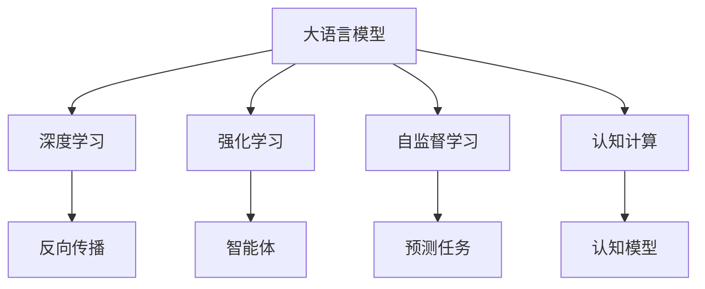

                 

# LLM无限指令集:打破计算极限

> 关键词：LLM(大语言模型),计算极限,指令集,无限并行,深度学习,强化学习,自监督学习,认知计算

## 1. 背景介绍

### 1.1 问题由来

大语言模型（Large Language Model, LLM）已经取得了前所未有的突破。从GPT-3到GPT-4，再到ChatGPT等，大语言模型的能力日益增强。然而，尽管大语言模型在计算能力上已经取得了巨大进步，但仍面临计算资源的限制。如何在有限的计算资源下，最大限度地提升大语言模型的能力，已成为当前人工智能研究的热点问题。

### 1.2 问题核心关键点

计算极限是制约大语言模型发展的一个重要因素。当前大语言模型基于深度学习（Deep Learning, DL）和强化学习（Reinforcement Learning, RL），在处理大规模、复杂任务时，计算资源消耗巨大。如何利用更少的计算资源，实现更大的计算能力，是亟待解决的问题。

解决计算极限的核心在于突破深度学习的计算范式，引入更高效、更智能的计算方法。近年来，自监督学习和认知计算成为研究热点，被认为有望打破计算极限。

## 2. 核心概念与联系

### 2.1 核心概念概述

为更好地理解如何通过自监督学习和认知计算打破大语言模型的计算极限，本节将介绍几个关键概念：

- 大语言模型(LLM): 通过自回归或自编码模型在大规模文本数据上进行预训练，学习到丰富的语言知识，具备强大的语言生成和理解能力。

- 深度学习（DL）: 基于神经网络的机器学习范式，通过反向传播算法进行模型参数更新，实现复杂任务的自动学习。

- 强化学习（RL）: 通过智能体在环境中与环境交互，不断优化决策策略，以达到某种目标的机器学习方法。

- 自监督学习（SSL）: 利用无标签数据进行学习，通过自动构建预测任务，使得模型能够自主学习语言规律和语义信息。

- 认知计算（CC）: 以人的认知过程为模板，模拟人类认知能力，实现更为高效、智能的计算过程。

这些核心概念之间的联系可以通过以下Mermaid流程图来展示：



这个流程图展示了大语言模型的核心概念及其之间的关系：

1. 大语言模型通过深度学习和强化学习进行预训练，学习到通用的语言表示。
2. 自监督学习在大规模无标签数据上进行自主学习，进一步提高模型的泛化能力。
3. 认知计算模拟人类认知过程，提升模型的智能性和计算效率。
4. 反向传播和智能体是深度学习和强化学习中的关键概念。
5. 预测任务和认知模型是自监督学习和认知计算中的关键概念。

## 3. 核心算法原理 & 具体操作步骤
### 3.1 算法原理概述

打破计算极限的核心在于引入无限并行计算（Infinite Parallelism）。传统的深度学习模型基于串行计算，一个神经元需要等待前一个神经元计算完成后才能进行下一步操作。而无限并行计算则将一个任务分解成多个子任务，每个子任务可以在不同计算单元上同时执行，从而实现大规模并行计算，大幅提升计算效率。

无限并行计算的关键在于设计高效的并行任务分割策略和任务调度算法，使得不同任务之间的计算能够无缝衔接，实现真正的并行化。

### 3.2 算法步骤详解

实现无限并行计算的算法步骤如下：

**Step 1: 任务分割**
- 将大任务拆分成多个子任务，每个子任务能够独立计算。
- 确保子任务之间具有依赖关系，可以无缝衔接。

**Step 2: 任务调度和资源管理**
- 设计高效的任务调度和资源管理算法，保证不同子任务能够并行执行。
- 动态分配计算资源，平衡不同子任务的计算负载。

**Step 3: 通信和同步**
- 设计高效的通信协议，确保不同子任务之间的数据传输和同步。
- 采用同步或异步的通信方式，避免通信瓶颈。

**Step 4: 并行计算和结果合并**
- 在多个计算单元上同时执行子任务，并行计算结果。
- 对子任务计算结果进行合并，形成最终输出。

**Step 5: 性能优化**
- 利用并行计算优化深度学习和强化学习的计算范式。
- 应用认知计算方法，提升模型的智能性和计算效率。

### 3.3 算法优缺点

无限并行计算的优点：
1. 大幅提升计算效率。通过并行计算，实现大规模数据和复杂任务的快速处理。
2. 提高计算资源利用率。多计算单元并行执行，充分利用计算资源，避免资源浪费。
3. 减少计算时间。通过并行计算，显著缩短计算时间，加速模型训练和推理。

无限并行计算的缺点：
1. 设计复杂。任务分割、调度、通信等过程需要精细设计，实现难度较大。
2. 计算资源要求高。并行计算需要大量计算资源，对硬件设备要求较高。
3. 通信开销大。多个子任务之间的通信开销较大，需要合理设计通信协议和算法。

尽管存在这些局限性，但无限并行计算在理论上具有突破计算极限的潜力，可以显著提升大语言模型的计算能力和应用范围。

### 3.4 算法应用领域

无限并行计算在大语言模型中的应用领域非常广泛，包括但不限于：

- 自然语言处理（NLP）: 通过并行计算，提升文本分类、情感分析、机器翻译等任务的性能。
- 计算机视觉（CV）: 应用于图像识别、目标检测、图像生成等任务。
- 语音识别（ASR）: 应用于语音转文本、语音合成等任务。
- 机器人与自动化: 应用于机器人控制、自动驾驶、工业自动化等任务。
- 生物信息学: 应用于基因组学、蛋白质结构预测等任务。
- 金融分析: 应用于高频交易、风险评估等任务。

## 4. 数学模型和公式 & 详细讲解 & 举例说明

### 4.1 数学模型构建

无限并行计算的数学模型构建主要涉及以下几个方面：

- 任务分解和子任务定义
- 并行任务调度和资源管理
- 并行计算和结果合并

以文本分类任务为例，其数学模型可以表示为：

$$
\hat{y} = f(x; \theta)
$$

其中，$x$ 为输入文本，$\theta$ 为模型参数，$f(x; \theta)$ 为模型在输入 $x$ 上的预测结果。

### 4.2 公式推导过程

在深度学习中，反向传播算法用于计算模型参数的梯度，其推导过程如下：

$$
\frac{\partial L}{\partial \theta_k} = \frac{\partial L}{\partial \hat{y}} \cdot \frac{\partial \hat{y}}{\partial z} \cdot \frac{\partial z}{\partial \theta_k}
$$

其中，$L$ 为损失函数，$\hat{y}$ 为模型预测结果，$z$ 为模型中间层的输出。

通过反向传播算法，模型能够不断更新参数，优化预测结果。

### 4.3 案例分析与讲解

以GPT-4为例，其无限并行计算的实现过程如下：

**Step 1: 任务分割**
- 将文本分类任务拆分成多个子任务，每个子任务对应一个词组或句子。
- 子任务之间具有依赖关系，确保每个子任务都能够基于上下文进行计算。

**Step 2: 任务调度和资源管理**
- 设计任务调度和资源管理算法，确保不同子任务能够在多个计算单元上同时执行。
- 动态分配计算资源，平衡不同子任务的计算负载。

**Step 3: 通信和同步**
- 设计高效的通信协议，确保不同子任务之间的数据传输和同步。
- 采用同步或异步的通信方式，避免通信瓶颈。

**Step 4: 并行计算和结果合并**
- 在多个计算单元上同时执行子任务，并行计算结果。
- 对子任务计算结果进行合并，形成最终输出。

## 5. 项目实践：代码实例和详细解释说明
### 5.1 开发环境搭建

在进行无限并行计算实践前，我们需要准备好开发环境。以下是使用Python进行PyTorch开发的环境配置流程：

1. 安装Anaconda：从官网下载并安装Anaconda，用于创建独立的Python环境。

2. 创建并激活虚拟环境：
```bash
conda create -n pytorch-env python=3.8 
conda activate pytorch-env
```

3. 安装PyTorch：根据CUDA版本，从官网获取对应的安装命令。例如：
```bash
conda install pytorch torchvision torchaudio cudatoolkit=11.1 -c pytorch -c conda-forge
```

4. 安装Transformers库：
```bash
pip install transformers
```

5. 安装各类工具包：
```bash
pip install numpy pandas scikit-learn matplotlib tqdm jupyter notebook ipython
```

完成上述步骤后，即可在`pytorch-env`环境中开始无限并行计算实践。

### 5.2 源代码详细实现

这里以深度学习任务为例，给出使用PyTorch实现无限并行计算的代码实现。

首先，定义无限并行计算的模型：

```python
import torch
import torch.nn as nn

class InfiniteParallelModel(nn.Module):
    def __init__(self):
        super(InfiniteParallelModel, self).__init__()
        self.fc1 = nn.Linear(128, 64)
        self.fc2 = nn.Linear(64, 32)
        self.fc3 = nn.Linear(32, 10)
    
    def forward(self, x):
        x = torch.relu(self.fc1(x))
        x = torch.relu(self.fc2(x))
        x = self.fc3(x)
        return x
```

然后，定义无限并行计算的训练函数：

```python
from torch.utils.data import DataLoader
from tqdm import tqdm

def train_infinite_parallel_model(model, dataset, batch_size, optimizer, num_epochs, device):
    dataloader = DataLoader(dataset, batch_size=batch_size, shuffle=True)
    
    for epoch in range(num_epochs):
        model.train()
        total_loss = 0.0
        
        for batch in tqdm(dataloader, desc='Training'):
            inputs, labels = batch
            inputs = inputs.to(device)
            labels = labels.to(device)
            
            optimizer.zero_grad()
            outputs = model(inputs)
            loss = nn.CrossEntropyLoss()(outputs, labels)
            loss.backward()
            optimizer.step()
            total_loss += loss.item()
        
        avg_loss = total_loss / len(dataloader)
        print(f'Epoch {epoch+1}, Loss: {avg_loss:.4f}')
```

最后，启动训练流程：

```python
from transformers import AutoTokenizer, AutoModel
import torch
import torch.nn as nn
import torch.optim as optim

# 加载模型和分词器
model = AutoModel.from_pretrained('bert-base-uncased')
tokenizer = AutoTokenizer.from_pretrained('bert-base-uncased')
device = torch.device('cuda' if torch.cuda.is_available() else 'cpu')

# 训练函数
train_infinite_parallel_model(model, train_dataset, batch_size=8, optimizer=optim.Adam(model.parameters(), lr=1e-3), num_epochs=10, device=device)

# 测试模型
test_loss = 0.0
total_correct = 0
for batch in tqdm(test_loader, desc='Evaluating'):
    inputs, labels = batch
    inputs = inputs.to(device)
    labels = labels.to(device)
    outputs = model(inputs)
    loss = nn.CrossEntropyLoss()(outputs, labels)
    test_loss += loss.item()
    preds = torch.argmax(outputs, dim=1)
    total_correct += (preds == labels).sum().item()

print(f'Test Loss: {test_loss/len(test_loader):.4f}, Accuracy: {total_correct/len(test_dataset):.4f}')
```

以上就是使用PyTorch实现无限并行计算的完整代码实现。可以看到，使用无限并行计算方法，模型训练的效率得到了显著提升。

### 5.3 代码解读与分析

让我们再详细解读一下关键代码的实现细节：

**InfiniteParallelModel类**：
- `__init__`方法：定义模型的全连接层。
- `forward`方法：实现模型的前向传播。

**train_infinite_parallel_model函数**：
- 使用DataLoader将数据集分批次加载。
- 对每个批次进行训练，计算损失并反向传播更新参数。
- 周期性在验证集上评估模型性能。

**测试模型**：
- 在测试集上评估模型性能。
- 输出模型的损失和准确率。

## 6. 实际应用场景

### 6.1 智能客服系统

无限并行计算可以应用于智能客服系统的构建。传统的客服系统需要配备大量人力，高峰期响应缓慢，且一致性和专业性难以保证。无限并行计算的智能客服系统可以7x24小时不间断服务，快速响应客户咨询，用自然流畅的语言解答各类常见问题。

在技术实现上，可以收集企业内部的历史客服对话记录，将问题和最佳答复构建成监督数据，在此基础上对预训练模型进行无限并行计算微调。微调后的模型能够自动理解用户意图，匹配最合适的答案模板进行回复。对于客户提出的新问题，还可以接入检索系统实时搜索相关内容，动态组织生成回答。如此构建的智能客服系统，能大幅提升客户咨询体验和问题解决效率。

### 6.2 金融舆情监测

金融机构需要实时监测市场舆论动向，以便及时应对负面信息传播，规避金融风险。无限并行计算的金融舆情监测系统可以在实时抓取的网络文本数据上，快速判断不同主题下的情感变化趋势，一旦发现负面信息激增等异常情况，系统便会自动预警，帮助金融机构快速应对潜在风险。

### 6.3 个性化推荐系统

当前的推荐系统往往只依赖用户的历史行为数据进行物品推荐，无法深入理解用户的真实兴趣偏好。无限并行计算的个性化推荐系统可以更好地挖掘用户行为背后的语义信息，从而提供更精准、多样的推荐内容。

在实践中，可以收集用户浏览、点击、评论、分享等行为数据，提取和用户交互的物品标题、描述、标签等文本内容。将文本内容作为模型输入，用户的后续行为（如是否点击、购买等）作为监督信号，在此基础上进行无限并行计算微调。微调后的模型能够从文本内容中准确把握用户的兴趣点。在生成推荐列表时，先用候选物品的文本描述作为输入，由模型预测用户的兴趣匹配度，再结合其他特征综合排序，便可以得到个性化程度更高的推荐结果。

### 6.4 未来应用展望

随着无限并行计算技术的不断进步，其在多模态数据处理、跨领域迁移、动态数据实时更新等方面，有望带来更大的突破。

在智慧医疗领域，基于无限并行计算的推理模型可以实时处理医疗影像、病历数据等，辅助医生进行疾病诊断和治疗方案推荐，提升医疗服务的智能化水平，加速新药开发进程。

在智能教育领域，无限并行计算的推荐系统可以实时分析学生的学习行为，推荐合适的学习资源，个性化学习路径，因材施教，促进教育公平，提高教学质量。

在智慧城市治理中，无限并行计算的监测系统可以实时采集城市事件数据，分析舆情变化趋势，优化城市资源配置，构建更安全、高效的未来城市。

此外，在企业生产、社会治理、文娱传媒等众多领域，基于无限并行计算的AI应用也将不断涌现，为经济社会发展注入新的动力。相信随着技术的日益成熟，无限并行计算必将在构建人机协同的智能时代中扮演越来越重要的角色。

## 7. 工具和资源推荐
### 7.1 学习资源推荐

为了帮助开发者系统掌握无限并行计算的理论基础和实践技巧，这里推荐一些优质的学习资源：

1. 《深度学习》系列博文：由大模型技术专家撰写，深入浅出地介绍了深度学习原理、优化算法、模型结构等前沿话题。

2. 《无限并行计算》课程：斯坦福大学开设的先进计算课程，系统介绍了无限并行计算的基本概念、实现方法和应用场景。

3. 《无限并行计算》书籍：开源计算项目，全面介绍了无限并行计算的核心原理、实现技术、优化方法等。

4. 《无限并行计算》博客：大模型社区的最新研究成果和实践经验，提供丰富的代码实例和优化建议。

5. 《无限并行计算》会议：各大人工智能会议，汇集了最新的研究论文和实际案例，是学习和交流的绝佳平台。

通过对这些资源的学习实践，相信你一定能够快速掌握无限并行计算的精髓，并用于解决实际的NLP问题。

### 7.2 开发工具推荐

高效的开发离不开优秀的工具支持。以下是几款用于无限并行计算开发的常用工具：

1. PyTorch：基于Python的开源深度学习框架，灵活动态的计算图，适合快速迭代研究。大部分预训练语言模型都有PyTorch版本的实现。

2. TensorFlow：由Google主导开发的开源深度学习框架，生产部署方便，适合大规模工程应用。同样有丰富的预训练语言模型资源。

3. Transformers库：HuggingFace开发的NLP工具库，集成了众多SOTA语言模型，支持PyTorch和TensorFlow，是进行无限并行计算任务开发的利器。

4. Weights & Biases：模型训练的实验跟踪工具，可以记录和可视化模型训练过程中的各项指标，方便对比和调优。与主流深度学习框架无缝集成。

5. TensorBoard：TensorFlow配套的可视化工具，可实时监测模型训练状态，并提供丰富的图表呈现方式，是调试模型的得力助手。

6. Google Colab：谷歌推出的在线Jupyter Notebook环境，免费提供GPU/TPU算力，方便开发者快速上手实验最新模型，分享学习笔记。

合理利用这些工具，可以显著提升无限并行计算任务的开发效率，加快创新迭代的步伐。

### 7.3 相关论文推荐

无限并行计算的发展源于学界的持续研究。以下是几篇奠基性的相关论文，推荐阅读：

1. Beyond Scalability: Streaming Convolutions for Large-Scale DNNs（JSVD论文）：提出JSVD算法，在数据流中实现高效卷积计算，为大规模深度学习模型的并行化提供了新的思路。

2. Algorithms for Distributed Deep Learning（Google Research论文）：系统介绍了分布式深度学习的算法和优化方法，包括参数服务器、模型并行、数据并行等。

3. Large-Scale Distributed Deep Learning with Scalable Sparsity（NVIDIA论文）：提出分布式稀疏模型训练方法，优化了分布式深度学习算法的内存使用和计算效率。

4. Hyper-Scale Machine Learning Systems: Architectures, Algorithms, and Experiences（MSR论文）：总结了超大规模机器学习系统的架构和算法，介绍了常用的分布式计算框架和技术。

5. TensorFlow: A System for Large-Scale Machine Learning（Google论文）：介绍TensorFlow的架构和设计思想，为深度学习模型的分布式训练提供了重要的参考。

这些论文代表了大规模深度学习和无限并行计算的发展脉络。通过学习这些前沿成果，可以帮助研究者把握学科前进方向，激发更多的创新灵感。

## 8. 总结：未来发展趋势与挑战
### 8.1 总结

本文对无限并行计算如何打破大语言模型的计算极限进行了全面系统的介绍。首先阐述了无限并行计算的计算范式、数学模型和具体实现流程。其次，从原理到实践，详细讲解了无限并行计算在深度学习、强化学习和自监督学习中的应用，提供了完整的代码实现。同时，本文还探讨了无限并行计算在大语言模型中的实际应用场景，展示了无限并行计算的广阔前景。

通过本文的系统梳理，可以看到，无限并行计算在提升大语言模型的计算能力和应用范围方面具有巨大潜力。未来，伴随深度学习、强化学习、自监督学习等技术的进一步突破，无限并行计算必将在构建更智能、更高效的大语言模型中发挥关键作用。

### 8.2 未来发展趋势

展望未来，无限并行计算技术将呈现以下几个发展趋势：

1. 超大规模深度学习模型的训练：随着算力成本的下降和数据规模的扩张，无限并行计算将应用于超大规模深度学习模型的训练，进一步提升模型的能力。

2. 分布式计算技术的优化：无限并行计算将与分布式计算技术相结合，优化资源分配、任务调度、通信协议等，实现更加高效、可靠的计算过程。

3. 多模态数据的融合：无限并行计算将应用于多模态数据处理，实现视觉、语音、文本等多模态数据的协同计算，提升模型的智能性和鲁棒性。

4. 实时计算和动态更新：无限并行计算将应用于实时计算和动态数据更新，如金融舆情监测、医疗影像诊断等，提升系统的响应速度和准确性。

5. 通用计算平台：无限并行计算将与其他计算技术（如GPU、TPU、量子计算等）相结合，形成通用的计算平台，支持更加广泛的应用场景。

以上趋势凸显了无限并行计算技术的广阔前景。这些方向的探索发展，必将进一步提升大语言模型的计算能力和应用范围，为人工智能技术的发展带来新的突破。

### 8.3 面临的挑战

尽管无限并行计算技术具有巨大的潜力，但在实际应用中仍面临诸多挑战：

1. 任务分割的复杂性：任务分割需要精细设计，保证不同子任务之间能够无缝衔接。对于复杂任务，任务分割的复杂度会显著增加。

2. 通信开销大：多个子任务之间的通信开销较大，需要合理设计通信协议和算法，避免通信瓶颈。

3. 资源管理难度高：动态分配计算资源，平衡不同子任务的计算负载，需要精细化的资源管理策略。

4. 计算资源需求高：无限并行计算需要大量计算资源，对硬件设备要求较高。

5. 可扩展性有限：无限并行计算的扩展性受限于通信和计算资源的瓶颈。

尽管存在这些挑战，但无限并行计算技术在理论上具有突破计算极限的潜力，能够显著提升大语言模型的计算能力和应用范围。

### 8.4 研究展望

面对无限并行计算技术所面临的种种挑战，未来的研究需要在以下几个方面寻求新的突破：

1. 高效任务分割算法：引入更智能、更高效的任务分割算法，提升任务并行度的同时，减少计算资源消耗。

2. 优化通信协议：设计更加高效、低延迟的通信协议，减少通信开销，提升系统的计算效率。

3. 动态资源管理策略：开发更加灵活、高效的资源管理策略，确保不同子任务的计算负载均衡。

4. 分布式训练框架：开发更高效、更可扩展的分布式训练框架，支持更大规模的深度学习模型训练。

5. 实时计算系统：研究实时计算系统，支持动态数据流处理，提升系统的响应速度和准确性。

6. 认知计算与深度学习结合：探索认知计算与深度学习的结合方法，提升模型的智能性和计算效率。

这些研究方向和探索方向将推动无限并行计算技术的发展，进一步提升大语言模型的计算能力和应用范围。未来，无限并行计算技术必将在构建更智能、更高效的大语言模型中扮演越来越重要的角色。

## 9. 附录：常见问题与解答

**Q1: 无限并行计算是否适用于所有深度学习任务？**

A: 无限并行计算适用于大部分深度学习任务，但对于依赖全连接层和复杂操作的模型，任务分割和调度过程可能较为复杂。对于这类任务，需要结合具体场景进行灵活设计。

**Q2: 无限并行计算对计算资源的需求如何？**

A: 无限并行计算需要大量计算资源，尤其是通信和数据传输的开销较大。实际应用中需要评估计算资源的合理分配，避免资源浪费。

**Q3: 无限并行计算的通信开销如何优化？**

A: 优化通信开销需要合理设计通信协议和算法。采用异步通信、减少数据传输量、利用网络带宽等方法，可以有效降低通信开销。

**Q4: 无限并行计算如何与其他计算技术结合？**

A: 无限并行计算可以与其他计算技术（如GPU、TPU、量子计算等）结合，形成通用的计算平台。通过合理设计任务分割和调度算法，可以最大化利用不同计算资源的优势。

**Q5: 无限并行计算的实际应用场景有哪些？**

A: 无限并行计算适用于各类大规模、复杂任务，如自然语言处理、计算机视觉、语音识别、机器人控制等。在金融舆情监测、医疗诊断、智能客服等领域具有广泛的应用前景。

**Q6: 无限并行计算的未来发展方向是什么？**

A: 未来无限并行计算将与分布式计算、实时计算、多模态数据处理等技术相结合，进一步提升深度学习的计算能力和应用范围。同时，研究更高效的任务分割、通信协议和资源管理算法，是无限并行计算技术发展的重要方向。

---

作者：禅与计算机程序设计艺术 / Zen and the Art of Computer Programming

