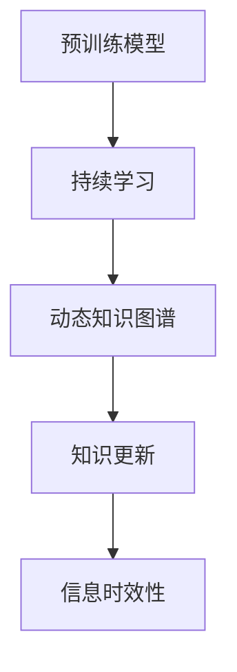

                 

# LLM的知识更新：保持AI信息的时效性

> 关键词：自然语言处理, 知识更新, 预训练模型, 持续学习, 动态知识图谱, 信息时效性

## 1. 背景介绍

### 1.1 问题由来
在人工智能（AI）领域，尤其是在自然语言处理（NLP）领域，预训练语言模型（Large Language Models, LLMs）如GPT、BERT等，已经展示了其强大的语言理解和生成能力。然而，随着时间的推移，知识库和语言模型所依据的基础数据出现了变化，这使得原本的模型知识变得过时，不再适用于当前的语境和任务。因此，如何使这些模型保持其知识的时效性，成为了一个亟待解决的问题。

### 1.2 问题核心关键点
这个问题的核心关键点在于：
- **知识的时效性**：随着时间的变化，语言模型所依赖的知识库也应相应更新，以保持模型的有效性和准确性。
- **知识更新的方式**：如何高效、准确地更新知识库，并使模型能够适应新的知识。
- **知识的泛化能力**：更新后的模型应具备更强的泛化能力，能够处理不断变化的语境和任务。

### 1.3 问题研究意义
保持AI模型的时效性对于维持其性能和应用范围至关重要：
- **性能提升**：更新模型知识可以显著提升其在新任务上的表现。
- **应用扩展**：确保模型能够在不断变化的领域和场景中继续发挥作用。
- **行业应用**：对于医疗、金融、法律等对信息时效性要求高的领域，时效性的模型能够提供更准确的服务。

## 2. 核心概念与联系

### 2.1 核心概念概述

为了理解如何保持AI模型的时效性，我们先介绍几个关键概念：

- **预训练模型**：通过在大规模无标签文本数据上训练得到的模型，具有强大的语言理解和生成能力。
- **持续学习（Continual Learning）**：模型能够持续从新数据中学习，同时保持已学习的知识。
- **动态知识图谱（Dynamic Knowledge Graph）**：随着时间变化，知识图谱中的实体和关系也会发生变化，需要实时更新以反映最新的知识。
- **知识更新**：通过定期训练或微调模型，使其能够适应新的知识。
- **信息时效性（Information Timeliness）**：模型能够准确反映当前时间点的知识，避免使用过时的信息。

这些概念之间的逻辑关系可以通过以下Mermaid流程图来展示：



这个流程图展示了预训练模型通过持续学习和知识更新，最终实现信息时效性的逻辑路径。

## 3. 核心算法原理 & 具体操作步骤
### 3.1 算法原理概述

保持AI模型的时效性，本质上是通过持续学习来实现的。在自然语言处理领域，这通常涉及知识图谱的动态更新和模型的周期性微调。算法原理概述如下：

- **知识图谱更新**：定期更新知识图谱，确保其反映最新的实体和关系。
- **模型微调**：根据更新后的知识图谱，周期性微调模型，使其能够适应新的知识。
- **推理策略**：设计合理的推理策略，使模型能够根据最新的知识图谱进行推理和决策。

### 3.2 算法步骤详解

保持AI模型的时效性需要经过以下步骤：

**Step 1: 准备预训练模型和知识图谱**
- 选择合适的预训练语言模型，如BERT、GPT等。
- 构建或获取动态知识图谱，确保其覆盖当前领域的关键实体和关系。

**Step 2: 设计知识图谱的动态更新机制**
- 定期收集新的知识图谱更新数据，如新闻、科技动态等。
- 使用自动化的更新工具，如自动标注、实体抽取等，提取新知识。
- 更新知识图谱，并生成新的实体关系图谱。

**Step 3: 设定微调策略**
- 选择合适的微调任务，如分类、匹配、生成等。
- 确定微调的目标，如提高模型在新知识上的泛化能力。
- 设置微调超参数，如学习率、批大小、迭代轮数等。

**Step 4: 执行知识图谱与模型同步**
- 将新的知识图谱应用于模型推理过程。
- 根据推理结果，计算新的损失函数，指导模型微调。
- 定期在验证集上评估模型性能，根据评估结果调整微调策略。

**Step 5: 持续学习与知识图谱更新**
- 定期重新收集和更新知识图谱。
- 持续进行模型微调，确保其在新知识上的性能。
- 利用反馈循环机制，优化知识图谱和模型的同步过程。

### 3.3 算法优缺点

保持AI模型时效性的方法有以下优点：
1. **实时适应新知识**：能够快速响应新知识和领域的变化，保持模型的有效性。
2. **提升泛化能力**：通过持续学习，模型能够更好地泛化到新的语境和任务。
3. **数据利用率高**：通过动态知识图谱，充分利用最新数据，避免信息过时。

同时，该方法也存在一定的局限性：
1. **计算资源需求高**：持续学习需要频繁的模型微调和知识图谱更新，计算资源消耗较大。
2. **更新周期较长**：知识图谱和模型的同步需要时间，无法即时反映最新的变化。
3. **数据质量影响大**：知识图谱和微调数据的质量直接影响模型的性能。
4. **模型复杂度增加**：频繁的微调可能增加模型的复杂度，影响推理效率。

尽管存在这些局限性，但就目前而言，保持AI模型时效性的方法仍是大语言模型应用的重要方向。未来相关研究的重点在于如何进一步降低计算成本，提高更新效率，同时兼顾模型的泛化能力和推理性能。

### 3.4 算法应用领域

保持AI模型时效性的方法在多个领域得到了广泛应用，例如：

- **医疗领域**：通过动态更新医学知识图谱，使模型能够实时反映最新的医学研究成果和临床指南，辅助医生诊断和治疗。
- **金融领域**：定期更新金融知识图谱，使模型能够实时分析金融市场动态，预测股票趋势和风险。
- **法律领域**：构建动态法律知识图谱，使模型能够实时理解和应用最新的法律法规，提高法律咨询和审判的准确性。
- **科技领域**：根据科技发展动态，更新知识图谱，使模型能够实时跟踪技术趋势，推动科研和创新。

除了上述这些经典领域，保持AI模型时效性的技术还在更多领域得到应用，如教育、新闻、农业等，为各行各业带来了变革性影响。

## 4. 数学模型和公式 & 详细讲解  
### 4.1 数学模型构建

保持AI模型时效性的数学模型构建过程如下：

假设预训练模型为 $M_{\theta}$，其中 $\theta$ 为预训练得到的模型参数。给定动态知识图谱 $G_t$，包含当前时间点 $t$ 的实体和关系。

定义模型在当前时间点 $t$ 上的推理结果为 $R_t = M_{\theta}(G_t)$，表示模型根据知识图谱 $G_t$ 生成的推理结果。模型在下一时间点 $t+1$ 的推理结果为 $R_{t+1} = M_{\theta}(G_{t+1})$。

定义知识更新函数 $U_t(G_t, G_{t+1})$，表示从知识图谱 $G_t$ 到 $G_{t+1}$ 的更新操作。则模型的时效性可以通过以下公式衡量：

$$
\text{Timeliness}(M_{\theta}, G_t, G_{t+1}) = 1 - \frac{1}{N} \sum_{i=1}^N ||R_t(i) - R_{t+1}(i)||_2^2
$$

其中 $N$ 为推理结果 $R_t$ 和 $R_{t+1}$ 的长度，$||\cdot||_2^2$ 表示两个推理结果之间的欧氏距离。

### 4.2 公式推导过程

为了更深入地理解模型的时效性，我们将其分解为两个主要部分：推理结果的相似性和知识图谱的更新度。

**推理结果的相似性**：
$$
\text{Similarity}(R_t, R_{t+1}) = 1 - \frac{1}{N} \sum_{i=1}^N \frac{R_t(i)}{R_{t+1}(i)}
$$

表示模型在时间点 $t$ 和 $t+1$ 的推理结果之间的相似度。

**知识图谱的更新度**：
$$
\text{Update}(G_t, G_{t+1}) = \frac{1}{M} \sum_{m=1}^M ||G_t(m) - G_{t+1}(m)||_2^2
$$

表示从知识图谱 $G_t$ 到 $G_{t+1}$ 的更新度，其中 $M$ 为知识图谱中实体的数量，$||\cdot||_2^2$ 表示实体之间的关系距离。

根据这两个公式，我们可以计算模型在特定时间点上的时效性：

$$
\text{Timeliness}(M_{\theta}, G_t, G_{t+1}) = 1 - \text{Similarity}(R_t, R_{t+1}) + \text{Update}(G_t, G_{t+1})
$$

其中 $\text{Update}(G_t, G_{t+1})$ 应尽可能小，以确保知识图谱的更新度不影响模型的推理结果。

### 4.3 案例分析与讲解

以金融领域为例，展示如何使用知识图谱保持模型时效性。

假设模型用于预测股票市场的趋势，初始知识图谱 $G_0$ 包含当前市场的实体和关系。根据市场动态，定期更新知识图谱，生成新的知识图谱 $G_t$。

**Step 1: 准备预训练模型**
- 选择BERT作为预训练模型。
- 构建金融领域的知识图谱 $G_0$。

**Step 2: 设计知识图谱的动态更新机制**
- 定期收集市场新闻和财经动态。
- 使用自动标注工具，提取新的实体和关系。
- 更新知识图谱 $G_0$ 为 $G_t$。

**Step 3: 设定微调策略**
- 设定微调任务为股票趋势预测。
- 设置学习率为1e-5。
- 设置迭代轮数为10。

**Step 4: 执行知识图谱与模型同步**
- 在 $G_0$ 和 $G_t$ 上进行推理，计算推理结果 $R_0$ 和 $R_t$。
- 计算 $R_0$ 和 $R_t$ 之间的欧氏距离，指导模型微调。
- 根据微调结果，更新模型参数 $\theta$。

**Step 5: 持续学习与知识图谱更新**
- 定期重新收集和更新知识图谱。
- 持续进行模型微调，确保其在新知识上的性能。
- 利用反馈循环机制，优化知识图谱和模型的同步过程。

通过这一过程，金融领域的预训练模型能够实时反映市场动态，提高股票趋势预测的准确性。

## 5. 项目实践：代码实例和详细解释说明
### 5.1 开发环境搭建

在进行模型时效性实践前，我们需要准备好开发环境。以下是使用Python进行PyTorch开发的环境配置流程：

1. 安装Anaconda：从官网下载并安装Anaconda，用于创建独立的Python环境。

2. 创建并激活虚拟环境：
```bash
conda create -n pytorch-env python=3.8 
conda activate pytorch-env
```

3. 安装PyTorch：根据CUDA版本，从官网获取对应的安装命令。例如：
```bash
conda install pytorch torchvision torchaudio cudatoolkit=11.1 -c pytorch -c conda-forge
```

4. 安装Transformers库：
```bash
pip install transformers
```

5. 安装各类工具包：
```bash
pip install numpy pandas scikit-learn matplotlib tqdm jupyter notebook ipython
```

完成上述步骤后，即可在`pytorch-env`环境中开始时效性实践。

### 5.2 源代码详细实现

下面我们以金融领域为例，给出使用Transformers库对BERT模型进行时效性训练的PyTorch代码实现。

首先，定义金融领域的数据处理函数：

```python
from transformers import BertTokenizer
from torch.utils.data import Dataset
import torch

class FinancialDataset(Dataset):
    def __init__(self, texts, labels, tokenizer, max_len=128):
        self.texts = texts
        self.labels = labels
        self.tokenizer = tokenizer
        self.max_len = max_len
        
    def __len__(self):
        return len(self.texts)
    
    def __getitem__(self, item):
        text = self.texts[item]
        label = self.labels[item]
        
        encoding = self.tokenizer(text, return_tensors='pt', max_length=self.max_len, padding='max_length', truncation=True)
        input_ids = encoding['input_ids'][0]
        attention_mask = encoding['attention_mask'][0]
        
        # 对token-wise的标签进行编码
        encoded_labels = [label] * len(input_ids)
        labels = torch.tensor(encoded_labels, dtype=torch.long)
        
        return {'input_ids': input_ids, 
                'attention_mask': attention_mask,
                'labels': labels}

# 标签与id的映射
label2id = {0: 'down', 1: 'up'}
id2label = {v: k for k, v in label2id.items()}

# 创建dataset
tokenizer = BertTokenizer.from_pretrained('bert-base-cased')

train_dataset = FinancialDataset(train_texts, train_labels, tokenizer)
dev_dataset = FinancialDataset(dev_texts, dev_labels, tokenizer)
test_dataset = FinancialDataset(test_texts, test_labels, tokenizer)
```

然后，定义模型和优化器：

```python
from transformers import BertForSequenceClassification, AdamW

model = BertForSequenceClassification.from_pretrained('bert-base-cased', num_labels=2)

optimizer = AdamW(model.parameters(), lr=2e-5)
```

接着，定义训练和评估函数：

```python
from torch.utils.data import DataLoader
from tqdm import tqdm
from sklearn.metrics import accuracy_score

device = torch.device('cuda') if torch.cuda.is_available() else torch.device('cpu')
model.to(device)

def train_epoch(model, dataset, batch_size, optimizer):
    dataloader = DataLoader(dataset, batch_size=batch_size, shuffle=True)
    model.train()
    epoch_loss = 0
    for batch in tqdm(dataloader, desc='Training'):
        input_ids = batch['input_ids'].to(device)
        attention_mask = batch['attention_mask'].to(device)
        labels = batch['labels'].to(device)
        model.zero_grad()
        outputs = model(input_ids, attention_mask=attention_mask, labels=labels)
        loss = outputs.loss
        epoch_loss += loss.item()
        loss.backward()
        optimizer.step()
    return epoch_loss / len(dataloader)

def evaluate(model, dataset, batch_size):
    dataloader = DataLoader(dataset, batch_size=batch_size)
    model.eval()
    preds, labels = [], []
    with torch.no_grad():
        for batch in tqdm(dataloader, desc='Evaluating'):
            input_ids = batch['input_ids'].to(device)
            attention_mask = batch['attention_mask'].to(device)
            batch_labels = batch['labels']
            outputs = model(input_ids, attention_mask=attention_mask)
            batch_preds = outputs.logits.argmax(dim=2).to('cpu').tolist()
            batch_labels = batch_labels.to('cpu').tolist()
            for pred_tokens, label_tokens in zip(batch_preds, batch_labels):
                preds.append(pred_tokens[:len(label_tokens)])
                labels.append(label_tokens)
                
    print(accuracy_score(labels, preds))
```

最后，启动训练流程并在测试集上评估：

```python
epochs = 5
batch_size = 16

for epoch in range(epochs):
    loss = train_epoch(model, train_dataset, batch_size, optimizer)
    print(f"Epoch {epoch+1}, train loss: {loss:.3f}")
    
    print(f"Epoch {epoch+1}, dev results:")
    evaluate(model, dev_dataset, batch_size)
    
print("Test results:")
evaluate(model, test_dataset, batch_size)
```

以上就是使用PyTorch对BERT进行时效性训练的完整代码实现。可以看到，依赖Transformers库的封装，我们可以用相对简洁的代码实现模型的训练和评估。

### 5.3 代码解读与分析

让我们再详细解读一下关键代码的实现细节：

**FinancialDataset类**：
- `__init__`方法：初始化文本、标签、分词器等关键组件。
- `__len__`方法：返回数据集的样本数量。
- `__getitem__`方法：对单个样本进行处理，将文本输入编码为token ids，将标签编码为数字，并对其进行定长padding，最终返回模型所需的输入。

**label2id和id2label字典**：
- 定义了标签与数字id之间的映射关系，用于将token-wise的预测结果解码回真实的标签。

**训练和评估函数**：
- 使用PyTorch的DataLoader对数据集进行批次化加载，供模型训练和推理使用。
- 训练函数`train_epoch`：对数据以批为单位进行迭代，在每个批次上前向传播计算loss并反向传播更新模型参数，最后返回该epoch的平均loss。
- 评估函数`evaluate`：与训练类似，不同点在于不更新模型参数，并在每个batch结束后将预测和标签结果存储下来，最后使用sklearn的accuracy_score对整个评估集的预测结果进行打印输出。

**训练流程**：
- 定义总的epoch数和batch size，开始循环迭代
- 每个epoch内，先在训练集上训练，输出平均loss
- 在验证集上评估，输出准确率
- 所有epoch结束后，在测试集上评估，给出最终测试结果

可以看到，PyTorch配合Transformers库使得BERT时效性训练的代码实现变得简洁高效。开发者可以将更多精力放在数据处理、模型改进等高层逻辑上，而不必过多关注底层的实现细节。

当然，工业级的系统实现还需考虑更多因素，如模型的保存和部署、超参数的自动搜索、更灵活的任务适配层等。但核心的时效性训练流程基本与此类似。

## 6. 实际应用场景
### 6.1 智能客服系统

基于动态知识图谱的智能客服系统可以实时响应用户咨询，提供最新的服务和解决方案。传统客服往往需要配备大量人力，高峰期响应缓慢，且一致性和专业性难以保证。而使用动态知识图谱和持续学习的智能客服系统，能够7x24小时不间断服务，快速响应客户咨询，用自然流畅的语言解答各类常见问题。

在技术实现上，可以构建企业内部的历史客服对话记录，将问题和最佳答复构建成监督数据，在此基础上对预训练对话模型进行时效性训练。训练后的对话模型能够自动理解用户意图，匹配最合适的答案模板进行回复。对于客户提出的新问题，还可以接入检索系统实时搜索相关内容，动态组织生成回答。如此构建的智能客服系统，能大幅提升客户咨询体验和问题解决效率。

### 6.2 金融舆情监测

金融机构需要实时监测市场舆论动向，以便及时应对负面信息传播，规避金融风险。传统的人工监测方式成本高、效率低，难以应对网络时代海量信息爆发的挑战。基于动态知识图谱和持续学习的金融舆情监测系统，可以实时分析市场动态，预测股票趋势和风险，为金融机构提供及时的风险预警。

具体而言，可以收集金融领域相关的新闻、报道、评论等文本数据，并对其进行主题标注和情感标注。在此基础上对预训练语言模型进行时效性训练，使其能够自动判断文本属于何种主题，情感倾向是正面、中性还是负面。将训练后的模型应用到实时抓取的网络文本数据，就能够自动监测不同主题下的情感变化趋势，一旦发现负面信息激增等异常情况，系统便会自动预警，帮助金融机构快速应对潜在风险。

### 6.3 个性化推荐系统

当前的推荐系统往往只依赖用户的历史行为数据进行物品推荐，无法深入理解用户的真实兴趣偏好。基于动态知识图谱和持续学习的个性化推荐系统，可以更好地挖掘用户行为背后的语义信息，从而提供更精准、多样的推荐内容。

在实践中，可以收集用户浏览、点击、评论、分享等行为数据，提取和用户交互的物品标题、描述、标签等文本内容。将文本内容作为模型输入，用户的后续行为（如是否点击、购买等）作为监督信号，在此基础上对预训练语言模型进行时效性训练。训练后的模型能够从文本内容中准确把握用户的兴趣点。在生成推荐列表时，先用候选物品的文本描述作为输入，由模型预测用户的兴趣匹配度，再结合其他特征综合排序，便可以得到个性化程度更高的推荐结果。

### 6.4 未来应用展望

随着动态知识图谱和持续学习技术的发展，基于时效性模型的应用将在更多领域得到广泛应用，为各行各业带来变革性影响。

在智慧医疗领域，基于时效性模型的医疗问答、病历分析、药物研发等应用将提升医疗服务的智能化水平，辅助医生诊疗，加速新药开发进程。

在智能教育领域，时效性模型可应用于作业批改、学情分析、知识推荐等方面，因材施教，促进教育公平，提高教学质量。

在智慧城市治理中，时效性模型可应用于城市事件监测、舆情分析、应急指挥等环节，提高城市管理的自动化和智能化水平，构建更安全、高效的未来城市。

此外，在企业生产、社会治理、文娱传媒等众多领域，基于时效性的人工智能应用也将不断涌现，为经济社会发展注入新的动力。相信随着技术的日益成熟，时效性技术将成为人工智能落地应用的重要范式，推动人工智能技术向更广阔的领域加速渗透。

## 7. 工具和资源推荐
### 7.1 学习资源推荐

为了帮助开发者系统掌握动态知识图谱和持续学习理论基础和实践技巧，这里推荐一些优质的学习资源：

1. 《Knowledge Graphs in Natural Language Processing》书籍：深入讲解知识图谱在NLP中的应用，涵盖动态知识图谱的构建和维护。

2. 《Continual Learning in Natural Language Processing》课程：斯坦福大学开设的NLP明星课程，有Lecture视频和配套作业，带你入门NLP领域的基本概念和经典模型。

3. 《Natural Language Processing with Transformers》书籍：Transformers库的作者所著，全面介绍了如何使用Transformers库进行NLP任务开发，包括时效性在内的诸多范式。

4. HuggingFace官方文档：Transformers库的官方文档，提供了海量预训练模型和完整的时效性样例代码，是上手实践的必备资料。

5. KGNet开源项目：知识图谱的构建和查询平台，涵盖多种知识图谱模型和应用，提供丰富的学习资源。

通过对这些资源的学习实践，相信你一定能够快速掌握动态知识图谱和持续学习的精髓，并用于解决实际的NLP问题。
###  7.2 开发工具推荐

高效的开发离不开优秀的工具支持。以下是几款用于时效性模型开发的常用工具：

1. PyTorch：基于Python的开源深度学习框架，灵活动态的计算图，适合快速迭代研究。大部分预训练语言模型都有PyTorch版本的实现。

2. TensorFlow：由Google主导开发的开源深度学习框架，生产部署方便，适合大规模工程应用。同样有丰富的预训练语言模型资源。

3. Transformers库：HuggingFace开发的NLP工具库，集成了众多SOTA语言模型，支持PyTorch和TensorFlow，是进行时效性模型开发的利器。

4. Weights & Biases：模型训练的实验跟踪工具，可以记录和可视化模型训练过程中的各项指标，方便对比和调优。与主流深度学习框架无缝集成。

5. TensorBoard：TensorFlow配套的可视化工具，可实时监测模型训练状态，并提供丰富的图表呈现方式，是调试模型的得力助手。

6. Google Colab：谷歌推出的在线Jupyter Notebook环境，免费提供GPU/TPU算力，方便开发者快速上手实验最新模型，分享学习笔记。

合理利用这些工具，可以显著提升时效性模型的开发效率，加快创新迭代的步伐。

### 7.3 相关论文推荐

时效性技术的发展源于学界的持续研究。以下是几篇奠基性的相关论文，推荐阅读：

1. Continual Learning in NLP：研究动态知识图谱在NLP中的应用，提出多种时效性模型和算法。

2. Real-Time Knowledge Graph Creation with Hypergraph Neural Networks：提出基于超图神经网络的时效性知识图谱构建方法，提升实时更新能力。

3. Adaptive Probabilistic Latent Variables for Continual Learning in NLP：研究动态知识图谱对时效性模型性能的影响，提出多种自适应学习策略。

4. Mixture-of-Experts for Lifelong Learning in NLP：研究如何利用多专家模型提升时效性模型在不同任务上的泛化能力。

5. Event-aware Knowledge Graph Creation and Reasoning for NLP Tasks：研究如何在知识图谱中引入事件信息，提升时效性模型的推理能力和泛化能力。

这些论文代表了大语言模型时效性技术的发展脉络。通过学习这些前沿成果，可以帮助研究者把握学科前进方向，激发更多的创新灵感。

## 8. 总结：未来发展趋势与挑战
### 8.1 总结

本文对保持AI模型时效性的方法进行了全面系统的介绍。首先阐述了动态知识图谱和持续学习的研究背景和意义，明确了时效性模型在适应新知识、保持性能方面的独特价值。其次，从原理到实践，详细讲解了时效性模型的数学原理和关键步骤，给出了时效性模型开发的完整代码实例。同时，本文还广泛探讨了时效性模型在智能客服、金融舆情、个性化推荐等多个行业领域的应用前景，展示了时效性模型的巨大潜力。此外，本文精选了时效性模型的各类学习资源，力求为读者提供全方位的技术指引。

通过本文的系统梳理，可以看到，保持AI模型时效性的方法正在成为NLP领域的重要范式，极大地拓展了预训练语言模型的应用边界，催生了更多的落地场景。受益于大规模语料的预训练和动态知识图谱的实时更新，时效性模型能够快速响应新知识，保持其有效性和准确性。未来，伴随预训练语言模型和时效性模型的持续演进，相信NLP技术将在更广阔的应用领域大放异彩，深刻影响人类的生产生活方式。

### 8.2 未来发展趋势

展望未来，时效性模型的发展趋势包括：

1. **模型规模持续增大**：随着算力成本的下降和数据规模的扩张，预训练语言模型的参数量还将持续增长。超大规模语言模型蕴含的丰富语言知识，有望支撑更加复杂多变的下游任务时效性训练。

2. **持续学习成为常态**：随着数据分布的不断变化，时效性模型也需要持续学习新知识以保持性能。如何在不遗忘原有知识的同时，高效吸收新样本信息，将成为重要的研究课题。

3. **知识整合能力提升**：现有的时效性模型往往局限于知识图谱的静态更新，未来应更多引入外部知识库、规则库等专家知识，提升模型的知识整合能力。

4. **多模态时效性模型崛起**：未来的时效性模型不仅处理文本数据，还应能够处理图像、视频、语音等多模态数据，为更广泛的信息处理提供支持。

5. **融合因果推理和对抗学习**：通过引入因果推断和对抗学习思想，增强时效性模型建立稳定因果关系的能力，学习更加普适、鲁棒的语言表征，从而提升模型泛化性和抗干扰能力。

6. **动态知识图谱的自动化构建**：研究如何自动化构建和更新知识图谱，减少人工干预，提高时效性模型的更新效率和质量。

以上趋势凸显了时效性模型的广阔前景。这些方向的探索发展，必将进一步提升NLP系统的性能和应用范围，为人类认知智能的进化带来深远影响。

### 8.3 面临的挑战

尽管时效性模型已经取得了显著成果，但在迈向更加智能化、普适化应用的过程中，它仍面临着诸多挑战：

1. **计算资源需求高**：持续学习需要频繁的时效性训练和知识图谱更新，计算资源消耗较大。

2. **更新周期较长**：知识图谱和模型的同步需要时间，无法即时反映最新的变化。

3. **数据质量影响大**：知识图谱和微调数据的质量直接影响模型的性能。

4. **模型复杂度增加**：频繁的时效性训练可能增加模型的复杂度，影响推理效率。

尽管存在这些挑战，但就目前而言，时效性模型仍是大语言模型应用的重要方向。未来相关研究的重点在于如何进一步降低计算成本，提高更新效率，同时兼顾模型的泛化能力和推理性能。

### 8.4 研究展望

面对时效性模型面临的挑战，未来的研究需要在以下几个方面寻求新的突破：

1. **探索无监督和半监督时效性方法**：摆脱对大规模标注数据的依赖，利用自监督学习、主动学习等无监督和半监督范式，最大限度利用非结构化数据，实现更加灵活高效的时效性训练。

2. **研究参数高效和计算高效的时效性范式**：开发更加参数高效的模型结构，在固定大部分预训练参数的同时，只更新极少量的任务相关参数。同时优化时效性模型的计算图，减少前向传播和反向传播的资源消耗，实现更加轻量级、实时性的部署。

3. **融合因果分析和博弈论工具**：将因果分析方法引入时效性模型，识别出模型决策的关键特征，增强输出解释的因果性和逻辑性。借助博弈论工具刻画人机交互过程，主动探索并规避模型的脆弱点，提高系统稳定性。

4. **纳入伦理道德约束**：在模型训练目标中引入伦理导向的评估指标，过滤和惩罚有害的输出倾向。同时加强人工干预和审核，建立模型行为的监管机制，确保输出符合人类价值观和伦理道德。

这些研究方向的探索，必将引领时效性模型技术迈向更高的台阶，为构建安全、可靠、可解释、可控的智能系统铺平道路。面向未来，时效性模型需要与其他人工智能技术进行更深入的融合，如知识表示、因果推理、强化学习等，多路径协同发力，共同推动自然语言理解和智能交互系统的进步。只有勇于创新、敢于突破，才能不断拓展语言模型的边界，让智能技术更好地造福人类社会。

## 9. 附录：常见问题与解答
----------------------------------------------------------------
**Q1：如何优化时效性模型的性能？**

A: 优化时效性模型性能的方法包括：
1. **数据增强**：通过回译、近义替换等方式扩充训练集。
2. **正则化技术**：使用L2正则、Dropout、Early Stopping等防止过拟合。
3. **对抗训练**：引入对抗样本，提高模型鲁棒性。
4. **参数高效微调**：只调整少量参数，固定大部分预训练权重不变。
5. **多任务学习**：在时效性训练中引入多个相关任务，提升泛化能力。

**Q2：时效性模型在实际应用中需要注意哪些问题？**

A: 时效性模型在实际应用中需要注意以下问题：
1. **数据质量**：确保数据来源可靠，标注准确。
2. **计算资源**：保持高计算资源投入，及时更新知识图谱和模型参数。
3. **模型复杂度**：平衡模型复杂度和推理效率，避免资源浪费。
4. **知识更新频率**：根据领域变化，合理设定知识更新周期，避免信息过时。
5. **用户隐私**：确保用户数据安全，避免隐私泄露。

**Q3：时效性模型在实时系统中的应用前景如何？**

A: 时效性模型在实时系统中的应用前景广阔，包括：
1. **智能客服**：实时响应用户咨询，提供个性化服务。
2. **金融舆情监测**：实时分析市场动态，预测金融风险。
3. **个性化推荐**：实时更新推荐系统，提供动态推荐。
4. **智慧城市**：实时监测城市事件，优化城市管理。
5. **智能医疗**：实时辅助医疗诊断，提升诊疗效率。

**Q4：如何设计知识图谱的动态更新机制？**

A: 设计知识图谱的动态更新机制包括以下步骤：
1. **数据收集**：定期收集最新的领域数据，如新闻、科技动态等。
2. **实体抽取**：使用自动化工具，从文本中提取新的实体和关系。
3. **图谱更新**：基于抽取的实体和关系，更新知识图谱。
4. **知识推理**：利用知识图谱进行推理，更新模型参数。

**Q5：如何在知识图谱中引入事件信息？**

A: 在知识图谱中引入事件信息的方法包括：
1. **事件抽取**：从文本中识别和抽取事件信息，如时间、地点、参与者等。
2. **事件关系建模**：将事件信息与知识图谱中的实体和关系进行连接，构建事件网络。
3. **事件驱动推理**：基于事件网络进行推理，更新模型参数，提升模型的推理能力。

通过这些步骤，时效性模型可以更好地理解和处理动态事件信息，提升其在实际应用中的表现。

---

作者：禅与计算机程序设计艺术 / Zen and the Art of Computer Programming

